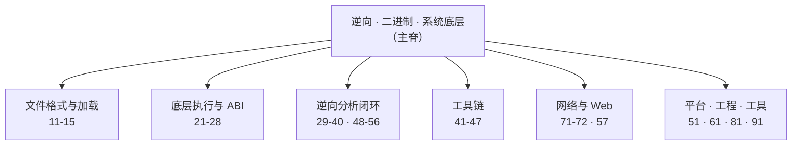

# 知识库总览 · 全库 MOC

> 本页是整库的**主索引/地图**：以「逆向工程 · 二进制 · 系统底层」为主脊，向工具链、密码学、网络、Web、工程与平台延展。带 ⭐ 的为本轮新增/补全的 14 个系列（完整深度正文）。

## ⭐ 本轮新增/补全（14 系列 · 约 160 万字）

### 底层执行与语言（贴 21–24）
| # | 系列 | 说明 |
| --- | --- | --- |
| 25 | [[25.CPU微架构与执行引擎/00.CPU微架构与执行引擎总览\|CPU微架构与执行引擎]] | 流水线/乱序/投机/缓存 + 微架构侧信道 |
| 26 | [[26.托管代码与字节码逆向/00.托管代码与字节码逆向总览\|托管代码与字节码逆向]] | JVM/.NET CLR/Python/Lua 字节码 |
| 27 | [[27.Go与Rust现代二进制逆向/00.Go与Rust现代二进制逆向总览\|Go与Rust现代二进制逆向]] | gopclntab/单态化/元数据恢复 |
| 28 | [[28.虚拟化与TEE机密计算/00.虚拟化与TEE机密计算总览\|虚拟化与TEE机密计算]] | VT-x/EPT/SGX/TrustZone/SEV |

### 逆向分析闭环（贴 29–40）
| # | 系列 | 说明 |
| --- | --- | --- |
| 33 | [[33.二进制漏洞与利用基础/00.二进制漏洞与利用基础总览\|二进制漏洞与利用基础]] | 栈/堆/格式化串/ROP/绕过（攻，对偶 34） |
| 48 | [[48.动态插桩与模拟执行引擎/00.动态插桩与模拟执行引擎总览\|动态插桩与模拟执行引擎]] | Pin/DynamoRIO/Frida-Gum/QEMU/Unicorn |
| 49 | [[49.Fuzzing与漏洞挖掘/00.Fuzzing与漏洞挖掘总览\|Fuzzing与漏洞挖掘]] | AFL++/libFuzzer/覆盖率/Sanitizer/syzkaller |
| 50 | [[50.恶意代码分析与免杀对抗/00.恶意代码分析与免杀对抗总览\|恶意代码分析与免杀对抗]] | 样本分析/注入/持久化/免杀/C2/YARA |
| 52 | [[52.Linux内核机制与内核利用/00.Linux内核机制与内核利用总览\|Linux内核机制与内核利用]] | 子系统机制 + 内核漏洞/提权（对称 38） |
| 53 | [[53.数字取证与事件响应/00.数字取证与事件响应总览\|数字取证与事件响应]] | 内存/磁盘/日志取证 + DFIR 流程 |
| 54 | [[54.浏览器与JS引擎漏洞/00.浏览器与JS引擎漏洞总览\|浏览器与JS引擎漏洞]] | V8/JIT/类型混淆/原语/沙箱逃逸 |
| 55 | [[55.CTF方法论体系/00.CTF方法论体系总览\|CTF方法论体系]] | Pwn/Re/Crypto/Web/Misc 解题范式 |
| 56 | [[56.AI辅助逆向与ML安全/00.AI辅助逆向与ML安全总览\|AI辅助逆向与ML安全]] | LLM辅助逆向 + ML 检测 + 模型安全 |
| 57 | [[57.Web与应用层安全/00.Web与应用层安全总览\|Web与应用层安全]] | 注入/XSS/CSRF-SSRF/反序列化/认证 |

## 既有体系（分主题）

### 文件格式与加载（11–15）
[[11.ELF文件详解/02.ELF文件头部\|11 ELF]] · [[12.Mach-O文件详解/02.Mach-O文件头\|12 Mach-O]] · [[13.PE文件详解/05-详解PE文件(五)：COFF文件头\|13 PE]] · [[14.动态链接与加载器详解/02.程序加载全景\|14 动态链接与加载器]] · [[15.操作系统加载与启动/01.加电到用户态的启动全景\|15 OS加载与启动]]

### 底层执行与 ABI（21–24）
[[21.Asm/01 汇编指令集对比\|21 汇编]] · [[22.调用规约/00.总览\|22 调用规约]] · [[23.C_C++运行时与ABI/00.运行时与ABI概览\|23 C/C++运行时与ABI]] · [[24.内存管理与堆分配器/00.内存管理与堆分配器总览\|24 内存管理与堆分配器]]

### 逆向 · 安全 · 对抗（29–47）
认证 [[29.Linux认证与登录编程/00.Linux认证与登录编程总览\|29]]/[[30.Windows认证与生物识别编程/00.Windows认证与生物识别编程总览\|30]] · [[31.Junk Code/00.花指令详解与实战教程\|31 花指令]] · [[32.hooks/00.总览\|32 hooks]] · [[34.现代二进制防护机制/00.现代二进制防护机制总览\|34 防护机制]] · [[35.Android逆向与运行时/00.Android逆向与运行时总览\|35 Android]] · [[36.Objective-C与iOS运行时/01.Objective-C运行时概览\|36 iOS]] · [[37.密码学/01.密码学全景与基本概念\|37 密码学]] · [[38.Windows内核与驱动逆向/00.Windows内核与驱动逆向总览\|38 Win内核]] · [[39.固件与IoT嵌入式逆向/01.嵌入式逆向全景与工具链\|39 固件IoT]] · [[40.WASM与虚拟化壳逆向/01.WASM二进制格式与模块结构\|40 WASM/壳]]

### 工具链（41–47）
[[41.Compiler\|41 编译器]] · [[42.Cmake/01 - CMake 概述与安装\|42 CMake]] · [[43.链接器详解/00.链接器详解总览\|43 链接器]] · [[44.调试器原理与实战/02.ptrace原理\|44 调试器]] · [[45.反编译器与反汇编引擎原理/01.反汇编算法：线性扫描与递归遍历\|45 反编译器]] · [[46.构建系统横向对比/00.构建系统横向对比总览\|46 构建系统]] · [[47.打包与分发/00.打包与分发总览\|47 打包分发]]

### 网络 · 工程 · 平台 · 工具
[[71.详解网络协议/01.基本概念\|71 网络协议]] · [[72.抓包与协议分析实战/00.抓包与协议分析实战总览\|72 抓包分析]] · [[81.软件开发流程与模型/01.软件工程与软件过程导论\|81 开发流程]] · [[51.harmonyarticles/README\|51 鸿蒙]] · [[91.Claude Code/01-安装\|91 Claude Code]]

---

> [!tip] 使用建议
> - 攻防成对阅读：**33（利用）↔ 34（防护）**、**52（Linux内核）↔ 38（Win内核）**、**49（Fuzzing）→ 33（利用）→ 53（取证）** 构成"发现→利用→溯源"闭环。
> - 语言逆向：**23（C/C++ABI）→ 26（托管）/27（Go-Rust）/36（ObjC）** 覆盖原生到托管到现代语言。
> - 动态分析：**44（调试器）+ 48（插桩/模拟）+ 32（hooks）** 三件套。

> [!warning] 合规边界
> 本库大量内容涉及漏洞利用、免杀、内核提权、浏览器利用等攻防技术，**仅限用于自有或已授权环境、CTF 靶场与合法安全研究**，一律防御/教育视角。请勿用于未授权测试。
