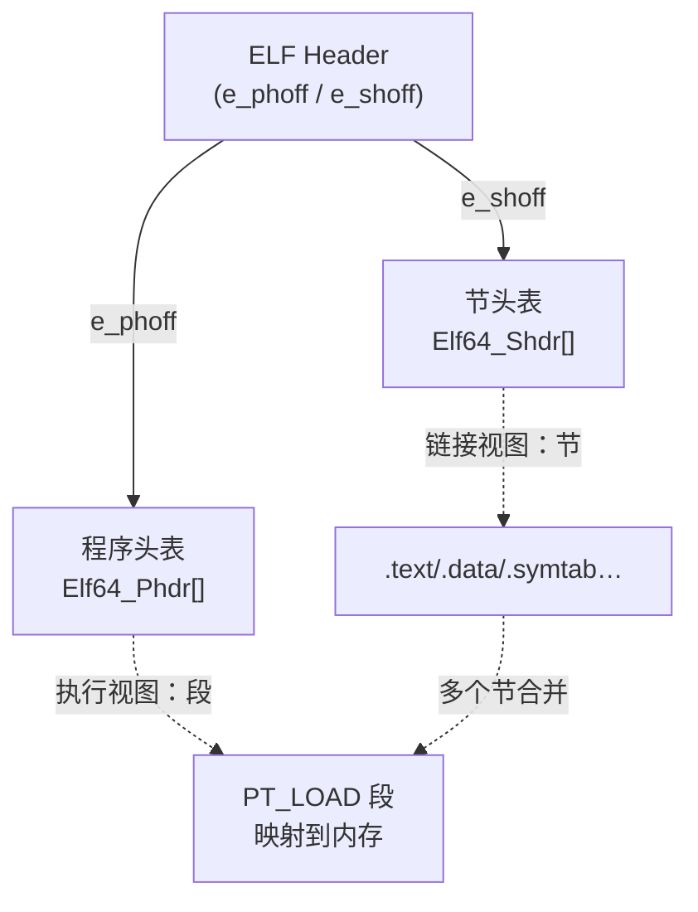
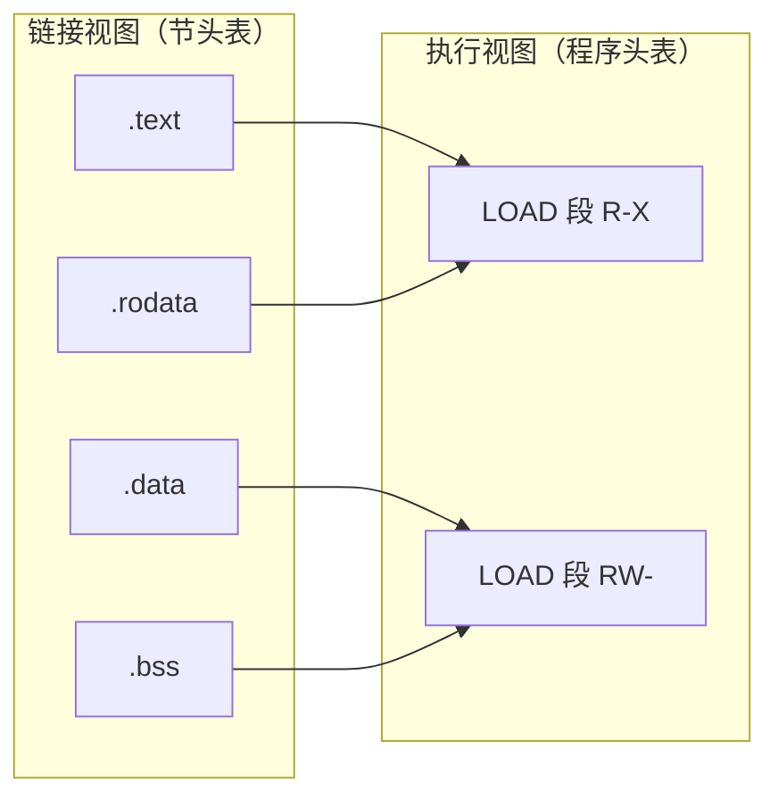
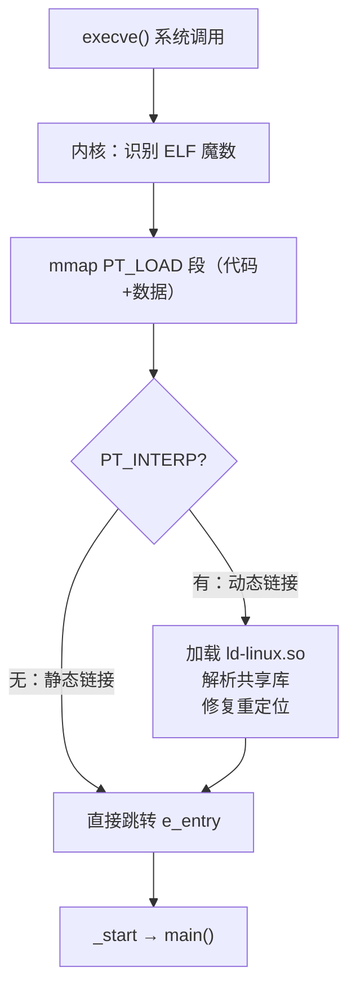

# 详解ELF文件(一)ELF文件基础

ELF（Executable and Linkable Format）是 Unix 和类 Unix 系统（如 Linux）中常见的可执行文件格式。它是用于可执行文件、目标代码、共享库和核心转储的主要格式，由 AT&T UNIX System Laboratories（USL）在 System V Release 4（SVR4）中首次引入，后来被 Linux、BSD 等各类 Unix 系统广泛采用，成为事实上的标准。

## ELF 的历史演进

要理解 ELF，有必要了解它的历史背景和演进脉络：

### a.out 时代

最早的 Unix 使用 **a.out**（assembler output）格式。a.out 结构极其简单，只有固定的三个段（text、data、bss），缺乏扩展性，不适合动态链接，也无法携带充足的调试信息。

### COFF 过渡期

为了解决 a.out 的局限，AT&T 在 System V 中引入了 **COFF**（Common Object File Format，公共目标文件格式）。COFF 支持多个命名节区（section），具有更好的可移植性，但在动态链接和调试信息方面仍有不足。

### ELF 的诞生

AT&T 在 System V Release 4（1989 年）中推出了 **ELF**，彻底取代了 a.out 和 COFF。ELF 设计更加灵活、可扩展，同时支持静态链接和动态链接，原生支持共享库，成为 Linux 2.0（1996 年）后的默认可执行格式，也被 Solaris、FreeBSD、NetBSD、OpenBSD 等系统采用。


## ELF 文件基本概念

ELF 文件主要有三种类型：

1. **可重定位文件（Relocatable File）** - 通常是 `.o` 文件，用于链接生成可执行文件或其他可重定位文件
2. **可执行文件（Executable File）** - 编译链接后的程序，可以直接执行
3. **共享目标文件（Shared Object File）** - 即动态库文件（`.so`），可在运行时被加载

此外还有第四种：

4. **核心转储文件（Core Dump File）** - 进程崩溃时内存状态的快照，供调试器分析

三种主要类型在 ELF 头部的 `e_type` 字段中区分：

| e_type | 宏名 | 类型 | 典型文件 | 程序头表 | 节头表 |
|---|---|---|---|---|---|
| 0 | ET_NONE | 未知类型 | - | - | - |
| 1 | ET_REL | 可重定位文件 | `.o` | 无 | 有 |
| 2 | ET_EXEC | 可执行文件 | `a.out` | 有 | 有（可被 strip） |
| 3 | ET_DYN | 共享对象/PIE 可执行 | `.so` / PIE 程序 | 有 | 有 |
| 4 | ET_CORE | 核心转储 | `core` | 无 | 无 |

> **注意**：现代 Linux 中用 `-fPIE -pie` 编译的可执行文件 `e_type = ET_DYN`，与共享库相同。内核和动态链接器根据是否有 `PT_INTERP` 来区分二者。

## ELF 文件整体结构

一个典型的 ELF 文件由以下四个主要部分组成：

1. **ELF头部（ELF Header）** - 描述整个文件的属性，包括文件类型、架构、入口地址等（见 [[02.ELF文件头部]]）
2. **程序头表（Program Header Table）** - 描述文件中的段（Segments）信息，用于程序执行时的内存布局（见 [[03.程序头表]]）
3. **节区（Sections）** - 包含具体的数据和代码，如 .text（代码段）、.data（数据段）等（见 [[04.节区]]）
4. **节头表（Section Header Table）** - 描述文件中各个节区的信息，用于链接过程（见 [[34.节头表]]）

下面是 ELF 文件结构的示意图：

```
+------------------+  ← 文件偏移 0
| ELF Header       |  ← 64 字节（64位）或 52 字节（32位）
+------------------+  ← e_phoff
| Program Header   |
| Table            |  ← e_phnum 个条目，每条 56B（64位）或 32B（32位）
+------------------+
| Section 1        |  .interp / .text / .data ...
+------------------+
| Section 2        |
+------------------+
| ...              |
+------------------+  ← e_shoff
| Section Header   |
| Table            |  ← e_shnum 个条目，每条 64B（64位）或 40B（32位）
+------------------+  ← 文件末尾
```

> 程序头表通常紧随 ELF 头部之后（`e_phoff = 64`），节头表通常位于文件末尾。但规范并不强制布局顺序，只要偏移量正确即可。

## 结构图示

ELF 头部是"入口"，通过 `e_phoff` 指向程序头表、`e_shoff` 指向节头表，二者再分别描述段与节：



## 各部分详解

### 1. ELF头部（ELF Header）

ELF 头部位于文件最开始处，包含了识别 ELF 文件类型和处理该文件所需的基本信息。主要字段包括：

- **e_ident** - 魔数和相关信息，用于标识这是一个 ELF 文件
- **e_type** - 文件类型（可重定位、可执行、共享对象等）
- **e_machine** - 目标架构（x86、x86_64、ARM、AArch64 等）
- **e_version** - ELF 版本
- **e_entry** - 程序入口点地址
- **e_phoff** - 程序头表在文件中的偏移量
- **e_shoff** - 节头表在文件中的偏移量
- **e_flags** - 与处理器相关的标志
- **e_ehsize** - ELF 头部大小
- **e_phentsize** - 程序头表中每个条目的大小
- **e_phnum** - 程序头表中条目的数量
- **e_shentsize** - 节头表中每个条目的大小
- **e_shnum** - 节头表中条目的数量
- **e_shstrndx** - 包含节名称字符串表的节索引

> 完整字段与字节布局见 [[02.ELF文件头部]]。

### 2. 程序头表（Program Header Table）

程序头表描述了程序执行时如何将文件映射到内存。每个程序头描述一个段（Segment）的信息，主要包括：

- **p_type** - 段类型（如可加载段、动态链接信息等）
- **p_offset** - 段在文件中的偏移量
- **p_vaddr** - 段在虚拟内存中的地址
- **p_paddr** - 段在物理内存中的地址
- **p_filesz** - 段在文件中的大小
- **p_memsz** - 段在内存中的大小
- **p_flags** - 段的权限标志（读、写、执行）
- **p_align** - 段对齐要求

> 详见 [[03.程序头表]]。

### 3. 节区（Sections）

节区包含文件中的具体内容，常见的节区包括：

- **.text** - 程序代码（见 [[05.text节]]）
- **.data** - 已初始化的全局变量和静态变量（见 [[07.data节]]）
- **.bss** - 未初始化的全局变量和静态变量（见 [[08.bss节]]）
- **.rodata** - 只读数据，如字符串常量（见 [[06.rodata节]]）
- **.symtab** - 符号表（见 [[09.symtab节]]）
- **.strtab** - 字符串表
- **.shstrtab** - 节头字符串表（见 [[10.shstrtab节]]）

> 节区分类与全貌见 [[04.节区]]。

### 4. 节头表（Section Header Table）

节头表描述了每个节区的属性，包括：

- **sh_name** - 节区名称在字符串表中的索引
- **sh_type** - 节区类型
- **sh_flags** - 节区标志
- **sh_addr** - 节区在内存中的地址
- **sh_offset** - 节区在文件中的偏移量
- **sh_size** - 节区大小
- **sh_link** - 节区链接信息
- **sh_info** - 节区附加信息
- **sh_addralign** - 节区对齐要求
- **sh_entsize** - 节区中条目的大小

> 详见 [[34.节头表]]。

## ELF 文件在链接和执行中的双重视图

ELF 格式最重要的设计思想之一是**双重视图（dual view）**，同一个文件对链接器和加载器呈现不同的结构。

1. **链接视图（Linking View）** - 以节区（Sections）为中心，主要用于链接过程
2. **执行视图（Execution View）** - 以段（Segments）为中心，主要用于程序执行



在链接过程中，链接器使用节头表来定位和处理各个节区；而在执行过程中，操作系统使用程序头表来确定如何将文件加载到内存中。

### 节与段的对应规律

链接器通常按照以下原则将节合并进段：

| 权限 | 合并的典型节 |
|---|---|
| R-X（读+执行） | `.text`、`.plt`、`.rodata`（有时）|
| R--（只读）  | `.rodata`（独立时）、`.eh_frame`  |
| RW-（读+写） | `.data`、`.bss`、`.got`、`.got.plt` |

> `.bss` 在节层面 `sh_type = SHT_NOBITS`（文件中不占空间），但在段层面通过 `p_memsz > p_filesz` 为它预留内存。

## ELF 在 Linux 内核中的加载过程

理解 ELF 文件不能脱离其加载机制。以下是 Linux 内核执行一个 ELF 文件的关键步骤：

### 第一步：execve 系统调用

用户调用 `execve()` 系统调用，内核通过二进制格式处理器链（binary format handler）识别到这是一个 ELF 文件（通过魔数 `\x7fELF`）。

### 第二步：读取 ELF 头与程序头表

内核读取 ELF 头部，确认架构、类别等基本属性，然后扫描程序头表，找出所有 `PT_LOAD` 段和 `PT_INTERP` 段。

### 第三步：映射 PT_LOAD 段到虚拟内存

内核对每个 `PT_LOAD` 段调用 `mmap()`，将文件内容映射到虚拟地址空间：
- 文件内容按 `p_offset`/`p_filesz` 映射
- 若 `p_memsz > p_filesz`，超出部分匿名映射并清零（用于 `.bss`）
- 内存权限由 `p_flags`（`PF_R`/`PF_W`/`PF_X`）决定

### 第四步：处理动态链接

若存在 `PT_INTERP` 段，内核同样将动态链接器（如 `/lib64/ld-linux-x86-64.so.2`）映射进内存，并将控制权交给动态链接器的入口点。

动态链接器负责：
- 加载所有 `DT_NEEDED` 共享库
- 解析符号引用（GOT/PLT）
- 处理重定位
- 最终跳转至程序真正入口（`_start`）

### 第五步：执行

执行流到达程序入口后，C 运行库（glibc）的 `_start` 函数完成全局构造器（`__init_array`）调用，再进入 `main()`。



## 与其他可执行格式的对比

| 特性 | ELF（Linux/Unix） | PE（Windows） | Mach-O（macOS/iOS） |
|---|---|---|---|
| 起源 | AT&T SVR4（1989） | COFF / Microsoft | NeXT / Mach 微内核 |
| 魔数 | `7F 45 4C 46`（`\x7fELF`） | `4D 5A`（`MZ`） | `FE ED FA CE`（小端 32 位）|
| 扩展名 | 无 / `.so` / `.o` | `.exe` / `.dll` / `.sys` | 无 / `.dylib` / `.o` |
| 节/段分离 | 双视图（section + segment） | 区段（section）统一 | segment > section 两层 |
| 动态库 | `.so`（共享对象） | `.dll` | `.dylib` |
| 调试格式 | DWARF（主流）| PDB / CodeView | DWARF / dSYM |
| 安全特性 | RELRO / PIE / NX | ASLR / DEP / CET | 代码签名 / SIP |
| 向后兼容 | 较简洁 | 保留 DOS MZ 头，复杂 | 相对简洁 |

## 实战：快速识别一个 ELF 文件

### 用 file 命令

```bash
file a.out                  # 识别文件类型（ELF? 32/64位? 动态/静态?）
readelf -h a.out            # 查看 ELF 头部，确认 e_type/e_machine/入口
```

```text
# 示例输出（代表性，非本机实跑）
$ file a.out
a.out: ELF 64-bit LSB pie executable, x86-64, dynamically linked,
       interpreter /lib64/ld-linux-x86-64.so.2, ...
```

`ELF 64-bit LSB` 对应头部的 `e_ident`（64 位、小端），`pie executable` 对应 `e_type = ET_DYN`。

### 用 xxd 手工验证魔数

ELF 文件的前 4 字节恒为 `7f 45 4c 46`（即 `\x7f` + ASCII `ELF`），是识别 ELF 文件的第一道关卡：

```bash
xxd a.out | head -2
```

```text
# 示例输出（代表性，非本机实跑）
00000000: 7f45 4c46 0201 0100 0000 0000 0000 0000  .ELF............
00000010: 0300 3e00 0100 0000 6010 4000 0000 0000  ..>.....`.@.....
```

逐字节解读前 16 字节（`e_ident`）：

| 偏移 | 十六进制 | 含义 |
|---|---|---|
| 0–3 | `7f 45 4c 46` | 魔数 `\x7fELF` |
| 4 | `02` | `ELFCLASS64`（64 位）|
| 5 | `01` | `ELFDATA2LSB`（小端）|
| 6 | `01` | `EV_CURRENT`（版本 1）|
| 7 | `00` | `ELFOSABI_SYSV`（System V ABI）|
| 8–15 | `00...00` | 填充字节 |

接下来偏移 16–17（`e_type`）为 `03 00`（小端） = 3 = `ET_DYN`（PIE 可执行或共享库）；偏移 18–19（`e_machine`）为 `3e 00` = 62 = `EM_X86_64`。

## ELF 文件类型的实际区分

### 静态可执行文件 vs 动态可执行文件

```bash
readelf -d a.out | grep NEEDED    # 有输出 → 动态链接；无输出 → 静态链接
ldd a.out                         # 列出所有动态依赖库
```

### 目标文件（.o）的特点

- `e_type = ET_REL`
- 无程序头表（`e_phnum = 0`）
- 有大量重定位节（`.rela.text`、`.rela.data` 等）
- `sh_addr = 0`（尚未分配地址）

### strip 后的可执行文件

`strip` 命令会删除 `.symtab`、`.strtab` 以及调试节，但保留程序运行所需的结构（程序头表、动态节等），文件体积减小但功能不受影响。

```bash
strip -s a.out              # 删除符号表和调试信息
readelf -S a.out | wc -l    # strip 后节数明显减少
```

## 常见问题与排查

### Q1：file 命令报 "not an ELF file"

- 检查文件前 4 字节是否为 `7f 45 4c 46`
- 可能是 Windows PE 文件（以 `MZ` 开头）、macOS Mach-O 或脚本文件

### Q2：执行时报 "No such file or directory"（文件明明存在）

- 通常是 `PT_INTERP` 中指定的动态链接器路径不存在
- 用 `readelf -l a.out | grep INTERP` 查看解释器路径，在交叉编译时尤为常见

### Q3：ET_EXEC 与 ET_DYN 可执行文件的区别

- `ET_EXEC` 在编译时固定加载地址（如 `0x400000`），不支持 ASLR 位置随机化
- `ET_DYN`（PIE）编译时地址无关，内核可随机化加载基址，安全性更高
- 现代发行版默认使用 `-fPIE -pie` 生成 `ET_DYN` 类型的可执行文件

## 总结

ELF 作为一种灵活、可扩展的文件格式，具有以下特点：

1. **平台无关性** - 通过 `e_ident` 中的类别、字节序字段适配不同处理器架构
2. **可扩展性** - 支持添加新的段类型和节区类型，OS 特定范围和处理器特定范围预留了扩展空间
3. **双重视图** - 链接视图（节）和执行视图（段）同时满足链接器和加载器的需求
4. **广泛应用** - 成为 Linux 和其他类 Unix 系统的标准可执行文件格式，也被嵌入式系统（ARM/RISC-V）广泛采用
5. **安全基础** - RELRO、PIE、NX 等现代安全特性均建立在 ELF 结构之上

通过深入了解 ELF 文件格式，开发者可以更好地理解程序的编译、链接和执行过程，有助于进行程序调试、性能优化和安全分析等工作。

## 相关阅读

- **四大组成**：[[02.ELF文件头部]]、[[03.程序头表]]、[[04.节区]]、[[34.节头表]]
- **核心节区**：[[05.text节]]、[[06.rodata节]]、[[07.data节]]、[[08.bss节]]、[[09.symtab节]]
- 下一篇：[[02.ELF文件头部]]

---
