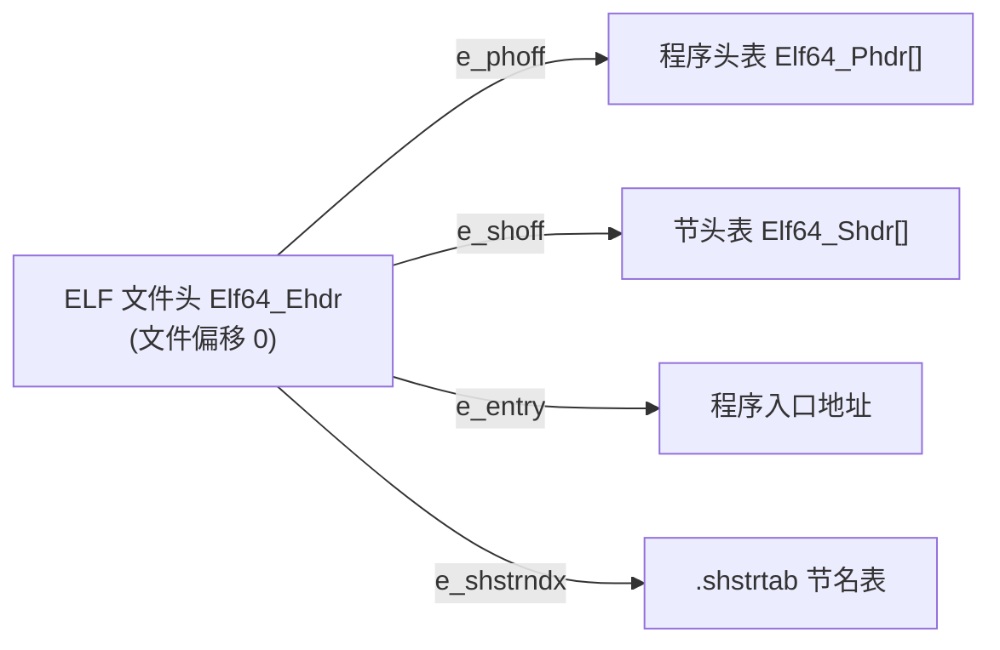

# 详解ELF文件(二)ELF文件头部

ELF（Executable and Linkable Format）文件头是 ELF 文件的第一个重要组成部分，位于文件的起始位置。它包含了识别和处理 ELF 文件所需的最基本信息——是整个 ELF 文件的"身份证"和"目录"。

## ELF 文件头概述

ELF 文件头定义了文件的基本属性、目标架构、入口地址以及指向其他重要数据结构的指针。通过读取 ELF 文件头，系统可以确定如何正确地处理这个文件。



## ELF 文件头结构

ELF 文件头有两种大小格式：

- **32 位 ELF 文件**：52 字节（`sizeof(Elf32_Ehdr) = 52`）
- **64 位 ELF 文件**：64 字节（`sizeof(Elf64_Ehdr) = 64`）

### C 结构体定义

#### 32 位（Elf32_Ehdr）

```c
typedef struct {
    unsigned char e_ident[EI_NIDENT]; /* 16字节标识数组 */
    Elf32_Half    e_type;             /* 2字节：文件类型 */
    Elf32_Half    e_machine;          /* 2字节：目标架构 */
    Elf32_Word    e_version;          /* 4字节：ELF版本 */
    Elf32_Addr    e_entry;            /* 4字节：入口点虚拟地址 */
    Elf32_Off     e_phoff;            /* 4字节：程序头表偏移 */
    Elf32_Off     e_shoff;            /* 4字节：节头表偏移 */
    Elf32_Word    e_flags;            /* 4字节：处理器特定标志 */
    Elf32_Half    e_ehsize;           /* 2字节：本头大小（52） */
    Elf32_Half    e_phentsize;        /* 2字节：程序头表项大小 */
    Elf32_Half    e_phnum;            /* 2字节：程序头表项数 */
    Elf32_Half    e_shentsize;        /* 2字节：节头表项大小 */
    Elf32_Half    e_shnum;            /* 2字节：节头表项数 */
    Elf32_Half    e_shstrndx;         /* 2字节：节名字符串表索引 */
} Elf32_Ehdr;   /* 总计 52 字节 */
```

#### 64 位（Elf64_Ehdr）

```c
typedef struct {
    unsigned char e_ident[EI_NIDENT]; /* 16字节标识数组 */
    Elf64_Half    e_type;             /* 2字节：文件类型 */
    Elf64_Half    e_machine;          /* 2字节：目标架构 */
    Elf64_Word    e_version;          /* 4字节：ELF版本 */
    Elf64_Addr    e_entry;            /* 8字节：入口点虚拟地址 */
    Elf64_Off     e_phoff;            /* 8字节：程序头表偏移 */
    Elf64_Off     e_shoff;            /* 8字节：节头表偏移 */
    Elf64_Word    e_flags;            /* 4字节：处理器特定标志 */
    Elf64_Half    e_ehsize;           /* 2字节：本头大小（64） */
    Elf64_Half    e_phentsize;        /* 2字节：程序头表项大小 */
    Elf64_Half    e_phnum;            /* 2字节：程序头表项数 */
    Elf64_Half    e_shentsize;        /* 2字节：节头表项大小 */
    Elf64_Half    e_shnum;            /* 2字节：节头表项数 */
    Elf64_Half    e_shstrndx;         /* 2字节：节名字符串表索引 */
} Elf64_Ehdr;   /* 总计 64 字节 */
```

### 32 位与 64 位字段对比

| 字段 | Elf32_Ehdr 偏移 | Elf64_Ehdr 偏移 | 32位大小 | 64位大小 |
|---|---|---|---|---|
| e_ident | 0 | 0 | 16B | 16B |
| e_type | 16 | 16 | 2B | 2B |
| e_machine | 18 | 18 | 2B | 2B |
| e_version | 20 | 20 | 4B | 4B |
| e_entry | 24 | 24 | **4B** | **8B** |
| e_phoff | 28 | 32 | **4B** | **8B** |
| e_shoff | 32 | 40 | **4B** | **8B** |
| e_flags | 36 | 48 | 4B | 4B |
| e_ehsize | 40 | 52 | 2B | 2B |
| e_phentsize | 42 | 54 | 2B | 2B |
| e_phnum | 44 | 56 | 2B | 2B |
| e_shentsize | 46 | 58 | 2B | 2B |
| e_shnum | 48 | 60 | 2B | 2B |
| e_shstrndx | 50 | 62 | 2B | 2B |
| **总大小** | | | **52B** | **64B** |

## ELF 文件头字段详解

### 1. e_ident（标识数组）- 16 字节

这是 ELF 文件头中最特殊的字段，是一段机器无关的标识字节，用于标识文件的基本属性。它独立于处理器架构和字节序之外，始终可以被正确解读：

```
偏移量  字段名          大小  说明
0-3     EI_MAG0-3       4B   魔数："0x7f", 'E', 'L', 'F'（= 0x7f454c46）
4       EI_CLASS        1B   文件类别（位数）
5       EI_DATA         1B   数据编码（字节序）
6       EI_VERSION      1B   ELF 规范版本号
7       EI_OSABI        1B   操作系统/ABI 标识
8       EI_ABIVERSION   1B   ABI 版本号
9-15    EI_PAD          7B   填充字节，保留为 0
```

> **魔数**：`7f 45 4c 46` 就是 `\x7f` + ASCII 的 `E`、`L`、`F`——任何 ELF 文件的前 4 字节恒为此值，是识别 ELF 的第一道关卡。内核、调试器、`file` 命令都首先检查这 4 字节。

#### EI_CLASS（偏移 4）— 文件类别

| 值 | 宏名 | 含义 |
|---|---|---|
| 0 | ELFCLASSNONE | 无效类别 |
| 1 | ELFCLASS32 | 32 位 ELF，虚拟地址和文件偏移均为 4 字节 |
| 2 | ELFCLASS64 | 64 位 ELF，虚拟地址和文件偏移均为 8 字节 |

#### EI_DATA（偏移 5）— 数据编码（字节序）

| 值 | 宏名 | 含义 |
|---|---|---|
| 0 | ELFDATANONE | 无效编码 |
| 1 | ELFDATA2LSB | 小端（Little-Endian），低位字节在低地址；x86/x86-64/ARM（LE 模式）使用 |
| 2 | ELFDATA2MSB | 大端（Big-Endian），高位字节在低地址；SPARC/MIPS（BE 模式）使用 |

#### EI_VERSION（偏移 6）— ELF 规范版本

目前只有一个有效值：

| 值 | 宏名 | 含义 |
|---|---|---|
| 0 | EV_NONE | 无效版本 |
| 1 | EV_CURRENT | 当前版本（唯一合法值）|

#### EI_OSABI（偏移 7）— 操作系统/ABI 标识

用于区分同一架构在不同操作系统或 ABI 下的语义差异，如系统调用约定、节类型扩展含义等：

| 值 | 宏名 | 含义 |
|---|---|---|
| 0 | ELFOSABI_NONE / ELFOSABI_SYSV | UNIX System V ABI（最通用，大多数 Linux 文件使用此值）|
| 1 | ELFOSABI_HPUX | HP-UX |
| 2 | ELFOSABI_NETBSD | NetBSD |
| 3 | ELFOSABI_LINUX / ELFOSABI_GNU | GNU/Linux |
| 6 | ELFOSABI_SOLARIS | Solaris |
| 7 | ELFOSABI_AIX | IBM AIX |
| 8 | ELFOSABI_IRIX | IRIX |
| 9 | ELFOSABI_FREEBSD | FreeBSD |
| 10 | ELFOSABI_TRU64 | Compaq TRU64 UNIX |
| 12 | ELFOSABI_OPENBSD | OpenBSD |
| 97 | ELFOSABI_ARM | ARM 架构专属 ABI |
| 255 | ELFOSABI_STANDALONE | 独立嵌入式系统（无 OS）|

> 实践中绝大多数 Linux ELF 文件的 `EI_OSABI = 0`（SYSV），即使运行在 Linux 上。只有 FreeBSD 等 BSD 系统会主动设置为对应值。

#### EI_ABIVERSION（偏移 8）— ABI 版本

配合 `EI_OSABI` 使用，区分同一 OS 下不兼容的 ABI 版本。目前大多数情况下值为 0（未指定）。

#### EI_PAD（偏移 9–15）— 填充

7 字节保留填充，值为 0，供将来 ELF 规范扩展新字段使用。

### 2. e_type（文件类型）— 2 字节，偏移 16

识别 ELF 对象的具体类型：

| 值 | 宏名 | 含义 |
|---|---|---|
| 0 | ET_NONE | 未知/无效类型 |
| 1 | ET_REL | 可重定位文件（`.o` 目标文件）|
| 2 | ET_EXEC | 可执行文件（固定加载地址）|
| 3 | ET_DYN | 共享对象或 PIE 可执行文件 |
| 4 | ET_CORE | 核心转储文件（`core`）|
| 0xFE00–0xFEFF | ET_LOOS–ET_HIOS | OS 保留范围 |
| 0xFF00–0xFFFF | ET_LOPROC–ET_HIPROC | 处理器保留范围 |

> **ET_DYN 的双重身份**：共享库（`.so`）和 PIE 可执行文件的 `e_type` 均为 `ET_DYN`。区分两者的方法：PIE 可执行文件有 `PT_INTERP` 段（指向动态链接器），而纯共享库通常没有。

### 3. e_machine（目标架构）— 2 字节，偏移 18

指定文件针对的处理器架构。以下是主要架构的完整列表：

#### 经典架构

| 值 | 宏名 | 架构 |
|---|---|---|
| 0 | EM_NONE | 未指定 |
| 1 | EM_M32 | AT&T WE 32100 |
| 2 | EM_SPARC | Sun SPARC |
| 3 | EM_386 | Intel 80386（x86 32位）|
| 4 | EM_68K | Motorola 68000 |
| 5 | EM_88K | Motorola 88000 |
| 7 | EM_860 | Intel 80860 |
| 8 | EM_MIPS | MIPS RS3000（大端）|
| 15 | EM_PARISC | HP PA-RISC |
| 18 | EM_SPARC32PLUS | 增强指令集 SPARC |
| 20 | EM_PPC | PowerPC 32位 |
| 21 | EM_PPC64 | PowerPC 64位 |
| 22 | EM_S390 | IBM System/390 |

#### 主流现代架构

| 值 | 宏名 | 架构 |
|---|---|---|
| 40 | EM_ARM | ARM 32位（AArch32）|
| 42 | EM_SH | Hitachi/Renesas SuperH |
| 43 | EM_SPARCV9 | SPARC V9 64位 |
| 50 | EM_IA_64 | Intel IA-64（Itanium）|
| 62 | EM_X86_64 | AMD x86-64（x86-64）|
| 75 | EM_VAX | DEC VAX |
| 183 | EM_AARCH64 | ARM 64位（AArch64）|
| 243 | EM_RISCV | RISC-V（32/64位，由 EI_CLASS 区分）|
| 247 | EM_BPF | Linux eBPF 虚拟机 |
| 258 | EM_LOONGARCH | 龙芯 LoongArch（龙架构）|

> **RISC-V 的特殊性**：`EM_RISCV = 243` 对 32 位和 64 位 RISC-V 均使用相同值，必须结合 `EI_CLASS` 才能区分两者。

> **EM_BPF**：Linux 内核的 eBPF 程序也被编译成 ELF 文件，`e_machine = 247`，可用 `readelf` 解析。

### 4. e_version（ELF 版本）— 4 字节，偏移 20

目前始终为 1（`EV_CURRENT`）。值 0 表示无效版本。

### 5. e_entry（程序入口点）— 4/8 字节

进程控制权转移的虚拟地址（即 `_start` 的地址）：

- 对于 `ET_EXEC` 和 `ET_DYN` 可执行文件：指向 C 运行库的 `_start`（通常不是 `main`）
- 对于共享库：通常为 0（无入口）
- 对于 `ET_REL` 目标文件：通常为 0（尚未链接）

> 注意：Linux 内核对动态链接程序会先将控制权交给 `PT_INTERP` 指定的动态链接器，动态链接器初始化完成后才跳转至 `e_entry`。

### 6. e_phoff（程序头表偏移）— 4/8 字节

程序头表在文件中的字节偏移。对于 64 位 ELF，标准值为 64（紧跟 ELF 头部之后）。若文件无程序头表，此字段为 0（目标文件）。

### 7. e_shoff（节头表偏移）— 4/8 字节

节头表在文件中的字节偏移。节头表通常位于文件末尾，链接器在生成文件时最后写入。若文件无节头表，此字段为 0。

### 8. e_flags（处理器特定标志）— 4 字节

携带与目标处理器相关的标志。多数架构下为 0，但某些架构有重要标志：

#### ARM（AArch32）e_flags

| 位/值 | 宏名 | 含义 |
|---|---|---|
| bits 23:20 | EF_ARM_EABIMASK | ARM EABI 版本（0=旧，5=EABI v5）|
| bit 0x400 | EF_ARM_INTERWORK | 支持 ARM/Thumb 混合 |
| bit 0x800 | EF_ARM_APCS_FLOAT | 使用 FP 寄存器传参 |

#### RISC-V e_flags

| 值 | 宏名 | 含义 |
|---|---|---|
| 0x0001 | EF_RISCV_RVC | 使用压缩指令扩展（C） |
| 0x0006 | EF_RISCV_FLOAT_ABI | 浮点 ABI（00=软，10=单精度，11=双精度）|
| 0x0008 | EF_RISCV_RVE | 使用 E 扩展（嵌入式）|

### 9. e_ehsize（ELF 头大小）— 2 字节

值固定：32 位为 52，64 位为 64。

### 10. e_phentsize 与 e_phnum

- `e_phentsize`：每个程序头表项的字节大小（32 位为 32，64 位为 56）
- `e_phnum`：程序头表的条目数量

> **特殊值 `e_phnum = 0xffff`（PN_XNUM）**：当程序头数量超过 0xfffe 时，`e_phnum` 被设置为 `PN_XNUM (0xffff)`，实际数量存储在节头表的第 0 项（`sh_info` 字段）。这是 ELF 的扩展机制，用于超大程序头表。

### 11. e_shentsize 与 e_shnum

- `e_shentsize`：每个节头表项的字节大小（32 位为 40，64 位为 64）
- `e_shnum`：节头表的条目数量

> **特殊值 `e_shnum = 0`**：同样有扩展机制，超大节头表时 `e_shnum = 0`，实际数量存储在节头第 0 项（`sh_size` 字段）。

### 12. e_shstrndx（节名字符串表索引）— 2 字节

指向 `.shstrtab` 节的索引，用于解析所有节的名称：

- 正常值：0 到 `e_shnum - 1` 之间的索引
- 特殊值 `SHN_UNDEF (0)`：文件无节名字符串表
- 特殊值 `SHN_XINDEX (0xffff)`：实际索引超过 0xfffe，存储在第 0 节头的 `sh_link` 字段中

## 实际示例

### readelf 输出逐行解析

```text
# 示例输出（代表性，非本机实跑）
$ readelf -h a.out
ELF Header:
  Magic:   7f 45 4c 46 02 01 01 00 00 00 00 00 00 00 00 00
  Class:                             ELF64
  Data:                              2's complement, little endian
  Version:                           1 (current)
  OS/ABI:                            UNIX - System V
  ABI Version:                       0
  Type:                              EXEC (Executable file)
  Machine:                           Advanced Micro Devices X86-64
  Version:                           0x1
  Entry point address:               0x400430
  Start of program headers:          64 (bytes into file)
  Start of section headers:          6936 (bytes into file)
  Flags:                             0x0
  Size of this header:               64 (bytes)
  Size of program headers:           56 (bytes)
  Number of program headers:         9
  Size of section headers:           64 (bytes)
  Number of section headers:         30
  Section header string table index: 27
```

逐字段对照：

| readelf 输出行 | 对应字段 | 值含义 |
|---|---|---|
| Magic 前16字节 | e_ident | 02=64位；01=小端；01=版本1；00=SYSV ABI |
| Class: ELF64 | e_ident[EI_CLASS] | ELFCLASS64 |
| Data: little endian | e_ident[EI_DATA] | ELFDATA2LSB |
| OS/ABI: System V | e_ident[EI_OSABI] | ELFOSABI_NONE |
| Type: EXEC | e_type | ET_EXEC = 2 |
| Machine: X86-64 | e_machine | EM_X86_64 = 62 |
| Entry point: 0x400430 | e_entry | _start 的虚拟地址 |
| Start of program headers: 64 | e_phoff | 64 字节偏移 |
| Start of section headers: 6936 | e_shoff | 6936 字节偏移 |
| Flags: 0x0 | e_flags | x86-64 无处理器特定标志 |
| Size of this header: 64 | e_ehsize | 64 字节（64位 ELF 头）|
| Size of program headers: 56 | e_phentsize | 每项 56 字节 |
| Number of program headers: 9 | e_phnum | 9 个程序头 |
| Size of section headers: 64 | e_shentsize | 每项 64 字节 |
| Number of section headers: 30 | e_shnum | 30 个节 |
| Section header string table: 27 | e_shstrndx | 第 27 节为 .shstrtab |

### xxd 手工解析 ELF 头部前 64 字节

```bash
xxd a.out | head -4
```

```text
# 示例输出（代表性，非本机实跑）
00000000: 7f45 4c46 0201 0100 0000 0000 0000 0000  .ELF............
00000010: 0200 3e00 0100 0000 3010 4000 0000 0000  ..>.....0.@.....
00000020: 4000 0000 0000 0000 1819 0000 0000 0000  @...............
00000030: 0000 0000 4000 3800 0900 4000 1e00 1b00  ....@.8...@.....
```

按字节对照 64 位布局：

```
偏移 0x00–0x0F: e_ident
  7f 45 4c 46  → 魔数 \x7fELF
  02           → EI_CLASS = ELFCLASS64
  01           → EI_DATA  = ELFDATA2LSB（小端）
  01           → EI_VERSION = EV_CURRENT
  00           → EI_OSABI = SYSV
  00 00 00 00 00 00 00  → EI_ABIVERSION + 填充

偏移 0x10–0x11: e_type  = 02 00 → ET_EXEC (小端 = 2)
偏移 0x12–0x13: e_machine = 3e 00 → 0x3E = 62 = EM_X86_64
偏移 0x14–0x17: e_version = 01 00 00 00 → 1
偏移 0x18–0x1F: e_entry = 30 10 40 00 00 00 00 00 → 0x401030
偏移 0x20–0x27: e_phoff = 40 00 00 00 00 00 00 00 → 64（紧接头部）
偏移 0x28–0x2F: e_shoff = 18 19 00 00 00 00 00 00 → 0x1918
偏移 0x30–0x33: e_flags = 00 00 00 00 → 0（x86-64 无额外标志）
偏移 0x34–0x35: e_ehsize = 40 00 → 64
偏移 0x36–0x37: e_phentsize = 38 00 → 56（每个程序头 56B）
偏移 0x38–0x39: e_phnum = 09 00 → 9 个程序头
偏移 0x3A–0x3B: e_shentsize = 40 00 → 64（每个节头 64B）
偏移 0x3C–0x3D: e_shnum = 1e 00 → 30 个节
偏移 0x3E–0x3F: e_shstrndx = 1b 00 → 27（.shstrtab 在第 27 节）
```

### C 代码读取 ELF 头

下面是一个使用 C 语言读取 ELF 文件头的示例代码：

```c
#include <stdio.h>
#include <stdlib.h>
#include <string.h>
#include <elf.h>
#include <fcntl.h>
#include <unistd.h>

int main(int argc, char *argv[]) {
    if (argc != 2) {
        fprintf(stderr, "用法: %s <elf文件>\n", argv[0]);
        return 1;
    }

    // 打开文件
    int fd = open(argv[1], O_RDONLY);
    if (fd < 0) {
        perror("无法打开文件");
        return 1;
    }

    // 读取ELF头
    Elf64_Ehdr elf_header;
    if (read(fd, &elf_header, sizeof(elf_header)) != sizeof(elf_header)) {
        perror("读取ELF头失败");
        close(fd);
        return 1;
    }

    // 检查是否为有效的ELF文件
    if (memcmp(elf_header.e_ident, ELFMAG, SELFMAG) != 0) {
        fprintf(stderr, "不是有效的ELF文件\n");
        close(fd);
        return 1;
    }

    // 打印ELF头信息
    printf("ELF 头部:\n");
    printf("  Magic:   ");
    for (int i = 0; i < EI_NIDENT; i++) {
        printf("%02x ", elf_header.e_ident[i]);
    }
    printf("\n");

    // 文件类别
    printf("  类别:                             %s\n",
           elf_header.e_ident[EI_CLASS] == ELFCLASS32 ? "ELF32" :
           elf_header.e_ident[EI_CLASS] == ELFCLASS64 ? "ELF64" : "未知");

    // 字节序
    printf("  数据:                              %s\n",
           elf_header.e_ident[EI_DATA] == ELFDATA2LSB ? "2's complement, little endian" :
           elf_header.e_ident[EI_DATA] == ELFDATA2MSB ? "2's complement, big endian" : "未知");

    // 版本
    printf("  版本:                           %d %s\n",
           elf_header.e_ident[EI_VERSION],
           elf_header.e_ident[EI_VERSION] == EV_CURRENT ? "(current)" : "");

    // OS/ABI
    printf("  OS/ABI:                            ");
    switch (elf_header.e_ident[EI_OSABI]) {
        case ELFOSABI_SYSV:    printf("UNIX - System V\n");  break;
        case ELFOSABI_HPUX:    printf("HP-UX\n");            break;
        case ELFOSABI_NETBSD:  printf("NetBSD\n");           break;
        case ELFOSABI_GNU:     printf("GNU/Linux\n");        break;
        case ELFOSABI_SOLARIS: printf("Solaris\n");          break;
        case ELFOSABI_AIX:     printf("AIX\n");              break;
        case ELFOSABI_IRIX:    printf("IRIX\n");             break;
        case ELFOSABI_FREEBSD: printf("FreeBSD\n");          break;
        default: printf("其他 (%d)\n", elf_header.e_ident[EI_OSABI]); break;
    }

    // ABI 版本
    printf("  ABI Version:                       %d\n", elf_header.e_ident[EI_ABIVERSION]);

    // 文件类型
    printf("  类型:                              ");
    switch (elf_header.e_type) {
        case ET_NONE: printf("NONE (未知类型)\n");      break;
        case ET_REL:  printf("REL (可重定位文件)\n");   break;
        case ET_EXEC: printf("EXEC (可执行文件)\n");    break;
        case ET_DYN:  printf("DYN (共享目标文件)\n");   break;
        case ET_CORE: printf("CORE (核心转储文件)\n");  break;
        default:      printf("其他 (0x%x)\n", elf_header.e_type); break;
    }

    // 机器架构
    printf("  机器: ");
    switch (elf_header.e_machine) {
        case EM_X86_64:  printf("Advanced Micro Devices X86-64\n"); break;
        case EM_386:     printf("Intel 80386\n");                   break;
        case EM_ARM:     printf("ARM\n");                           break;
        case EM_AARCH64: printf("AArch64\n");                       break;
        case EM_RISCV:   printf("RISC-V\n");                        break;
        case EM_PPC64:   printf("PowerPC64\n");                     break;
        default:         printf("其他 (%d)\n", elf_header.e_machine); break;
    }

    printf("  版本:            0x%x\n",    elf_header.e_version);
    printf("  入口点地址:      0x%lx\n",  elf_header.e_entry);
    printf("  程序头表偏移:    %ld (bytes into file)\n", elf_header.e_phoff);
    printf("  节头表偏移:      %ld (bytes into file)\n", elf_header.e_shoff);
    printf("  标志:            0x%x\n",    elf_header.e_flags);
    printf("  本头大小:        %d (bytes)\n", elf_header.e_ehsize);
    printf("  程序头表项大小:  %d (bytes)\n", elf_header.e_phentsize);
    printf("  程序头表项数:    %d\n",      elf_header.e_phnum);
    printf("  节头表项大小:    %d (bytes)\n", elf_header.e_shentsize);
    printf("  节头表项数:      %d\n",      elf_header.e_shnum);
    printf("  节名字符串表索引: %d\n",     elf_header.e_shstrndx);

    close(fd);
    return 0;
}
```

## 各架构 ELF 头特征速查

以下是常见架构的 ELF 头关键字段取值，方便在逆向分析或交叉编译时快速识别：

| 架构 | EI_CLASS | EI_DATA | e_machine | 常见 e_flags |
|---|---|---|---|---|
| x86（32位）| ELFCLASS32 | ELFDATA2LSB | 3 (EM_386) | 0x0 |
| x86-64 | ELFCLASS64 | ELFDATA2LSB | 62 (EM_X86_64) | 0x0 |
| ARM（AArch32 LE）| ELFCLASS32 | ELFDATA2LSB | 40 (EM_ARM) | 0x5000400 (EABI v5) |
| ARM（AArch32 BE）| ELFCLASS32 | ELFDATA2MSB | 40 (EM_ARM) | — |
| AArch64 | ELFCLASS64 | ELFDATA2LSB | 183 (EM_AARCH64) | 0x0 |
| RISC-V 32位 | ELFCLASS32 | ELFDATA2LSB | 243 (EM_RISCV) | 0x4（双精度 FP ABI）|
| RISC-V 64位 | ELFCLASS64 | ELFDATA2LSB | 243 (EM_RISCV) | 0x4 |
| MIPS（BE）| ELFCLASS32 | ELFDATA2MSB | 8 (EM_MIPS) | — |
| LoongArch 64位 | ELFCLASS64 | ELFDATA2LSB | 258 (EM_LOONGARCH) | — |
| PowerPC 64位 | ELFCLASS64 | ELFDATA2MSB | 21 (EM_PPC64) | — |
| SPARC | ELFCLASS32 | ELFDATA2MSB | 2 (EM_SPARC) | — |

## 常见问题与边界情况

### e_phnum 溢出（PN_XNUM）

当一个文件的程序头数量超过 65534（0xfffe）时，ELF 规范规定 `e_phnum = 0xffff`（宏 `PN_XNUM`），而真实数量存储在节头表第 0 项的 `sh_info` 字段中。这个情况在普通程序中几乎不会出现，但在某些特殊构建场景下需要注意。

### e_shnum = 0

类似地，若节头数量超过 65535（或文件被 strip 到没有节头表），`e_shnum = 0` 且 `e_shoff = 0` 意味着无节头表；若 `e_shoff != 0` 且 `e_shnum = 0`，则实际数量存储在第 0 个节头的 `sh_size` 字段。

### e_entry 与 main() 的关系

`e_entry` 指向的是 C 运行库的 `_start`（glibc 中的 `_start` 在 `crt1.o`），而不是用户写的 `main()`。`_start` 负责设置堆栈帧、初始化 `argc`/`argv`/`environ`，再调用 `__libc_start_main`，最终调用 `main()`。

### 静态链接 vs 动态链接的头部差异

| 特征 | 静态链接 | 动态链接 |
|---|---|---|
| e_phnum | 较少（无 INTERP/DYNAMIC）| 较多（含 INTERP/DYNAMIC 等）|
| e_entry | 直接指向 `_start` | 有时指向 PLT 跳转桩 |
| e_shnum | 可能较多（含 .symtab）| 经 strip 后较少 |

## 总结

ELF 文件头是理解整个 ELF 文件结构的关键，它提供了以下重要信息：

1. **文件身份验证** - 通过魔数确认这是一个 ELF 文件
2. **架构兼容性** - 通过 `e_ident`、`e_machine` 确定目标平台、位数和字节序
3. **处理指引** - 提供程序入口点（`e_entry`）和关键数据结构位置（`e_phoff`/`e_shoff`）
4. **结构信息** - 描述程序头表和节头表的数量和条目大小
5. **OS/ABI 语义** - 通过 `EI_OSABI` 和 `e_flags` 携带平台特定信息

通过这些信息，操作系统可以正确加载和执行程序，链接器可以正确链接目标文件，调试器可以正确解析符号信息。深入理解 ELF 文件头对于系统编程、逆向工程和程序调试都非常重要。

## 相关阅读

- **头部指向的两张表**：[[03.程序头表]]（e_phoff）、[[34.节头表]]（e_shoff）
- **e_shstrndx 指向**：[[10.shstrtab节]]
- **系列起点**：[[01.ELF文件基础]]
- 上一篇：[[01.ELF文件基础]] ｜ 下一篇：[[03.程序头表]]

---

