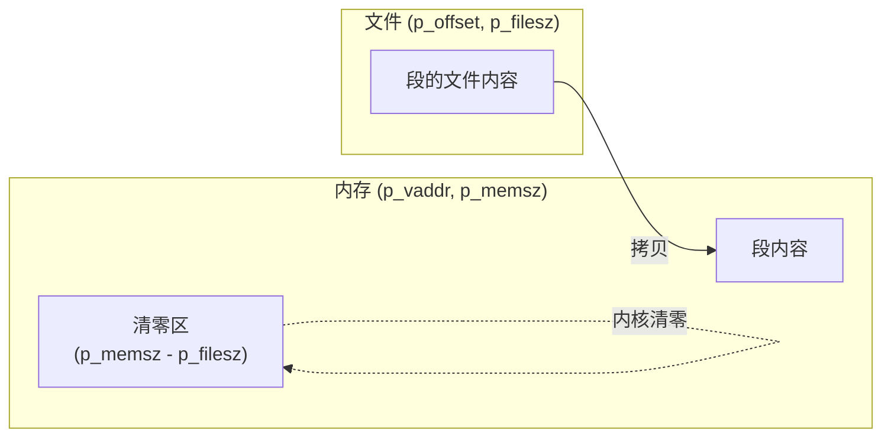
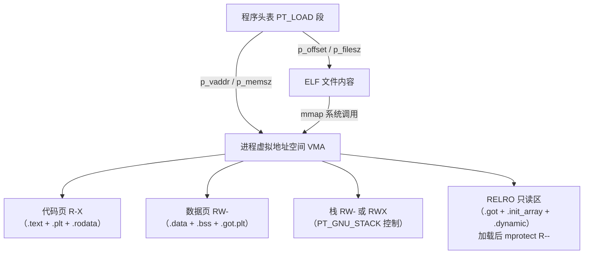

# 详解ELF文件(三)程序头表

程序头表（Program Header Table，PHT）是 ELF 文件中描述段（segments）如何映射到内存中的关键结构。它是操作系统加载器和动态链接器执行程序时唯一需要读取的元数据——节头表在执行期是可选的，而程序头表则不可缺少。

## 程序头表基本概念

程序头表由多个程序头（Program Header，也称段描述符）组成，每个程序头描述一个段（segment）的信息。这些段告诉操作系统如何将程序加载到内存中执行。

程序头表的主要属性：

- 只在可执行文件（`ET_EXEC`）和共享对象（`ET_DYN`）中存在；目标文件（`ET_REL`）通常无程序头表
- 由 ELF 头部中的 `e_phoff` 字段指定在文件中的偏移量
- 包含 `e_phnum` 个条目，每个条目大小为 `e_phentsize` 字节
- 通常紧跟 ELF 头部之后（对 64 位文件，`e_phoff = 64`）

## 程序头结构

每个程序头是一个结构体，32 位和 64 位的字段顺序有差异：

### 64 位（Elf64_Phdr）— 56 字节

```c
typedef struct {
    Elf64_Word  p_type;     /* 4字节：段类型 */
    Elf64_Word  p_flags;    /* 4字节：段标志（权限）*/
    Elf64_Off   p_offset;   /* 8字节：段在文件中的偏移 */
    Elf64_Addr  p_vaddr;    /* 8字节：段的虚拟地址 */
    Elf64_Addr  p_paddr;    /* 8字节：段的物理地址 */
    Elf64_Xword p_filesz;   /* 8字节：段在文件中的大小 */
    Elf64_Xword p_memsz;    /* 8字节：段在内存中的大小 */
    Elf64_Xword p_align;    /* 8字节：对齐方式 */
} Elf64_Phdr;   /* 总计 56 字节 */
```

### 32 位（Elf32_Phdr）— 32 字节

```c
typedef struct {
    Elf32_Word  p_type;     /* 4字节：段类型 */
    Elf32_Off   p_offset;   /* 4字节：段在文件中的偏移 */
    Elf32_Addr  p_vaddr;    /* 4字节：段的虚拟地址 */
    Elf32_Addr  p_paddr;    /* 4字节：段的物理地址 */
    Elf32_Word  p_filesz;   /* 4字节：段在文件中的大小 */
    Elf32_Word  p_memsz;    /* 4字节：段在内存中的大小 */
    Elf32_Word  p_flags;    /* 4字节：段标志（权限）*/
    Elf32_Word  p_align;    /* 4字节：对齐方式 */
} Elf32_Phdr;   /* 总计 32 字节 */
```

> **32/64 位关键差异**：`p_flags` 在 64 位里位于第二个字段（偏移 4），而 32 位里位于倒数第二个字段（偏移 24）。这个调整消除了 64 位下 `p_type` 之后的对齐填充，使结构体更紧凑。

### 字段偏移对比

| 字段 | Elf32_Phdr 偏移 | Elf64_Phdr 偏移 | 32位大小 | 64位大小 |
|---|---|---|---|---|
| p_type | 0 | 0 | 4B | 4B |
| p_flags | **24** | **4** | 4B | 4B |
| p_offset | 4 | 8 | 4B | 8B |
| p_vaddr | 8 | 16 | 4B | 8B |
| p_paddr | 12 | 24 | 4B | 8B |
| p_filesz | 16 | 32 | 4B | 8B |
| p_memsz | 20 | 40 | 4B | 8B |
| p_align | 28 | 48 | 4B | 8B |
| **总大小** | | | **32B** | **56B** |

## 各字段深入详解

### p_type — 段类型

`p_type` 是最重要的字段，决定了段的含义和加载器/链接器的处理方式。

#### 标准段类型完整列表

| 值 | 宏名 | 含义 |
|---|---|---|
| 0 | PT_NULL | 未使用的条目，忽略其他字段 |
| 1 | PT_LOAD | 可加载段，内核将其 mmap 到进程地址空间 |
| 2 | PT_DYNAMIC | 动态链接信息（对应 `.dynamic` 节）|
| 3 | PT_INTERP | 程序解释器路径（对应 `.interp` 节）|
| 4 | PT_NOTE | 辅助信息（ABI 版本、Build-ID 等）|
| 5 | PT_SHLIB | 保留，语义未指定；包含此类型的文件不符合 ABI |
| 6 | PT_PHDR | 程序头表本身的位置和大小 |
| 7 | PT_TLS | 线程局部存储（Thread-Local Storage）模板 |

#### GNU/Linux 扩展段类型（OS 特定范围 0x6474e550–）

| 值 | 宏名 | 含义 |
|---|---|---|
| 0x6474e550 | PT_GNU_EH_FRAME | GCC 异常处理帧索引（对应 `.eh_frame_hdr` 节）|
| 0x6474e551 | PT_GNU_STACK | 控制栈是否可执行；p_flags 中无 PF_X = NX 栈 |
| 0x6474e552 | PT_GNU_RELRO | 重定位后变为只读的区域（RELRO 安全特性）|
| 0x6474e553 | PT_GNU_PROPERTY | GNU 属性节（`.note.gnu.property`），用于 CET 等特性 |

#### Solaris 扩展段类型

| 值 | 宏名 | 含义 |
|---|---|---|
| 0x6ffffffa | PT_SUNWBSS | Sun 特定 BSS 段 |
| 0x6ffffffb | PT_SUNWSTACK | Sun 特定栈段 |

#### 处理器特定范围

`PT_LOPROC (0x70000000)` 到 `PT_HIPROC (0x7fffffff)` 为处理器保留范围，例如 ARM、MIPS、RISC-V 各有自己的扩展类型。

### p_flags — 段权限标志

`p_flags` 是一个位掩码，控制段加载到内存后的访问权限：

| 位 | 值 | 宏名 | 含义 |
|---|---|---|---|
| 0 | 0x1 | PF_X | 可执行（Execute）|
| 1 | 0x2 | PF_W | 可写（Write）|
| 2 | 0x4 | PF_R | 可读（Read）|
| 28–31 | 0xf0000000 | PF_MASKPROC | 处理器特定标志掩码 |
| 20–27 | 0x0ff00000 | PF_MASKOS | OS 特定标志掩码 |

常见组合：

| 组合 | 含义 | 典型段 |
|---|---|---|
| R-X（0x5）| 读+执行 | 代码段（.text + .rodata）|
| RW-（0x6）| 读+写 | 数据段（.data + .bss + .got）|
| R--（0x4）| 只读 | 只读数据段（某些配置）|
| RWX（0x7）| 读+写+执行 | 极少使用，违反 W^X 安全策略 |

> **安全意义**：现代系统通过 `PT_GNU_STACK` 控制栈权限。若其 `p_flags` 无 `PF_X`，则栈不可执行（NX/DEP 保护），这是防止栈溢出攻击的基础手段之一。

### p_offset — 文件偏移

段数据在 ELF 文件中的起始字节偏移量（从文件头算起）。对于 `PT_LOAD` 段，内核从 `p_offset` 处读取 `p_filesz` 字节。

### p_vaddr — 虚拟地址

段在进程虚拟地址空间中的期望加载地址：

- 对于 `ET_EXEC`（固定地址可执行文件）：此地址固定，内核必须按此映射
- 对于 `ET_DYN`（PIE/共享库）：此地址是相对偏移，内核可以在此基础上加随机偏移（ASLR）

### p_paddr — 物理地址

在大多数用户空间应用中，`p_paddr` 与 `p_vaddr` 相同（或被忽略），因为用户空间程序看到的是虚拟地址。此字段仅在嵌入式系统或裸机（bare-metal）环境中有意义，用于指定实际物理加载地址。

### p_filesz — 文件大小

段数据在文件中占用的字节数。对于 `SHT_NOBITS` 的节（如 `.bss`），`p_filesz` 不包含这部分——`.bss` 只有内存空间，文件中不存储。

### p_memsz — 内存大小

段加载到内存后占用的字节数。规范要求 `p_memsz >= p_filesz`，超出部分（`p_memsz - p_filesz`）在加载时由内核填充为零，这正是 `.bss` 节的实现机制。

### p_align — 对齐

段在内存和文件中的对齐要求：

- `p_align = 0` 或 `p_align = 1`：无对齐要求
- 其他值：必须是 2 的幂次，且 `p_vaddr ≡ p_offset (mod p_align)`

> 对于 `PT_LOAD` 段，`p_align` 通常等于系统页大小（x86-64 下为 `0x200000` 即 2MB，或 `0x1000` 即 4KB，取决于链接选项）。这确保了段可以被 `mmap` 映射到正确的内存页边界。

## 结构图示

每个 PT_LOAD 段把"文件中的一块"映射到"内存中的一块"。关键在于 `p_filesz` 可以小于 `p_memsz`——差额部分（典型如 [[08.bss节|.bss]]）在加载时由内核清零：



> 这正是 .data 与 .bss 能共处同一个 LOAD 段的原因：.data 部分由 `p_filesz` 覆盖（有文件内容），.bss 部分落在 `p_memsz` 超出 `p_filesz` 的清零区里。

## 各段类型深入详解

### PT_LOAD 段

这是最核心的段类型，内核通过 `mmap` 将其加载到进程虚拟地址空间。一个典型的动态链接可执行文件通常有两个 PT_LOAD 段：

**代码/只读段（R-X）**：

```
LOAD  offset=0x000000  vaddr=0x400000  filesz=0x001234  memsz=0x001234  flags=R-X  align=0x200000
```

包含：`.text`（指令）、`.rodata`（常量）、`.eh_frame`（异常处理信息）等不可写节。

**数据/读写段（RW-）**：

```
LOAD  offset=0x001e00  vaddr=0x601e00  filesz=0x000220  memsz=0x000230  flags=RW-  align=0x200000
```

包含：`.data`（已初始化全局变量）、`.bss`（未初始化全局变量，仅内存）、`.got`、`.got.plt` 等可写节。注意 `memsz > filesz`，差值即为 `.bss` 的大小。

> **现代分段趋势**：较新版本的链接器（GNU ld 2.28+，lld）可以生成 3 个或更多 PT_LOAD 段，将只读数据（`.rodata`）单独放入 R-- 段，从而更严格地控制内存权限。

### PT_DYNAMIC 段

指向 `.dynamic` 节，包含动态链接器所需的全部信息，如：

- `DT_NEEDED`：所需共享库列表（如 `libc.so.6`）
- `DT_STRTAB`/`DT_SYMTAB`：字符串表/符号表地址
- `DT_INIT`/`DT_FINI`：初始化/析构函数地址
- `DT_RELA`/`DT_REL`：重定位表地址
- `DT_PLTGOT`：PLT/GOT 地址

详见 [[18.dynamic节|.dynamic]] 节。

### PT_INTERP 段

存储动态链接器路径字符串（对应 [[35.interp节|.interp]] 节），通常是：

- Linux x86-64：`/lib64/ld-linux-x86-64.so.2`
- Linux ARM：`/lib/ld-linux-armhf.so.3`
- Linux AArch64：`/lib/ld-linux-aarch64.so.1`
- Linux RISC-V 64位：`/lib/ld-linux-riscv64-lp64d.so.1`

内核加载此段时，将字符串作为另一个 ELF 文件的路径，再次调用加载过程，将动态链接器映射进内存。

> **规范要求**：`PT_INTERP` 必须先于任何 `PT_LOAD` 段出现在程序头表中（规范要求），且一个文件最多只能有一个 `PT_INTERP` 条目。

### PT_NOTE 段

存储辅助信息，对应 `.note.*` 类节（见 [[36.note.ABI-tag节]]）。常见 Note 内容：

- `.note.ABI-tag`：指定文件所需的最低 Linux 内核版本（由 `glibc` 嵌入）
- `.note.gnu.build-id`：文件的唯一 Build ID（SHA1/MD5 哈希），用于关联 debug 文件
- `.note.gnu.property`：GNU 属性（如 `IBT`、`SHSTK` 用于 Intel CET，`X86_64_ISA_1_00` 等）

### PT_PHDR 段

描述程序头表本身的位置和大小（在文件中和内存中）。存在此段说明程序头表本身被映射进了进程地址空间，动态链接器可以通过虚拟地址访问它。

若 `PT_PHDR` 存在，规范要求它必须先于任何 `PT_LOAD` 段出现。

### PT_TLS 段（线程局部存储）

定义线程局部存储模板，对应所有带 `SHF_TLS` 标志的节（如 `.tdata`、`.tbss`）：

- `p_filesz`：TLS 数据模板（`.tdata`）的大小，有初始值
- `p_memsz`：TLS 总大小（含 `.tbss` 的清零部分）
- `p_align`：TLS 块的对齐要求

每个线程创建时，运行库会为其分配 `p_memsz` 大小的内存，将 `.tdata` 内容复制进去，再将剩余部分清零。

### PT_GNU_EH_FRAME 段

指向 [[47.eh_frame_hdr节|.eh_frame_hdr]] 节，为运行时 C++ 异常处理和栈展开（stack unwinding）提供索引。`libgcc` 和 `libunwind` 依赖此段快速定位展开信息。

若无此段，异常处理将退回到低效的线性搜索。

### PT_GNU_STACK 段

此段**没有对应的文件内容**（`p_filesz = 0`，`p_memsz = 0`，`p_offset` 无意义），仅通过 `p_flags` 向内核传递栈权限信息：

| p_flags | 含义 |
|---|---|
| `PF_R\|PF_W`（0x6）| 不可执行栈（NX 保护，现代默认）|
| `PF_R\|PF_W\|PF_X`（0x7）| 可执行栈（不安全，用于某些旧代码）|

若文件不包含 `PT_GNU_STACK`，内核默认行为取决于具体 Linux 版本和配置（通常启用 NX）。

### PT_GNU_RELRO 段

同样没有独立文件内容，而是标记在重定位完成后应被设为只读的内存区域（由动态链接器调用 `mprotect` 实现）：

典型的 RELRO 区域包含：`.got`（全局偏移表）、`.init_array`、`.fini_array`、`.dynamic` 等。RELRO 分为两种强度：

- **Partial RELRO**（`-Wl,-z,relro`）：仅保护部分 GOT，`.got.plt` 仍可写
- **Full RELRO**（`-Wl,-z,relro,-z,now`）：全部 GOT 只读，需要 PLT 在启动时立即解析所有符号

```bash
# 检查是否启用 RELRO
readelf -l a.out | grep GNU_RELRO
checksec --file=a.out          # checksec 工具一键检查安全特性
```

### PT_GNU_PROPERTY 段

对应 `.note.gnu.property` 节，用于传递各类 GNU 属性，包含 Intel CET（Control-flow Enforcement Technology）所需的 IBT（间接分支跟踪）和 SHSTK（影子栈）标志，以及 `-z,lto-type` 等链接器属性。

### PT_GNU_PROPERTY 属性体系

`.note.gnu.property` 节通过 `PT_GNU_PROPERTY` 程序头暴露给内核和动态链接器。其格式是一段 NOTE 结构，Note 的 `type` 为 `NT_GNU_PROPERTY_TYPE_0`（值 5），`namesz=4`，名字为 `"GNU\0"`，数据体是一系列连续的属性条目，每条属性格式为：

```
Elf_Word  pr_type;     /* 属性类型 */
Elf_Word  pr_datasz;   /* 数据长度（字节，4字节对齐） */
uint8_t   pr_data[];   /* 属性数据 */
uint8_t   pr_padding[];/* 4字节对齐填充 */
```

#### x86 / x86-64 属性（GNU_PROPERTY_X86_*）

| 属性类型 | 宏名 | 含义 |
|---|---|---|
| `0xc0000002` | `GNU_PROPERTY_X86_ISA_1_USED` | 程序使用到的 x86 ISA 特性集（信息性）|
| `0xc0000000` | `GNU_PROPERTY_X86_ISA_1_NEEDED` | 运行所需最低 x86 ISA（加载器可据此拒绝不支持的 CPU）|
| `0xc0000001` | `GNU_PROPERTY_X86_FEATURE_1_AND` | **CET 相关特性位掩码**（AND 语义：全部段须同时具备方为有效）|

`GNU_PROPERTY_X86_FEATURE_1_AND` 的位定义：

| 位 | 含义 |
|---|---|
| bit 0（0x1）| **IBT**（Indirect Branch Tracking）：所有间接跳转目标须有 `ENDBR32/ENDBR64` 前缀，对应 Intel CET 的前向 CFI |
| bit 1（0x2）| **SHSTK**（Shadow Stack）：函数返回地址同时写入硬件影子栈，对应 Intel CET 的后向 CFI |
| bit 2（0x4）| `LAM_U48`：Linear Address Masking，用户态指针高位可存 tag（Intel LAM 特性）|
| bit 3（0x8）| `LAM_U57`：同上，57 位 LA 变体 |

链接器在合并目标文件时对 `GNU_PROPERTY_X86_FEATURE_1_AND` 使用 **AND** 规约——只有全部输入文件都支持某特性，最终可执行文件才声明该特性；有一个不支持则该位清零。这保证了"整个程序可安全启用 CET"这一保守语义。

#### AArch64 属性（GNU_PROPERTY_AARCH64_FEATURE_1_AND）

| 属性类型 | 宏名 | 值 |
|---|---|---|
| `0xc0000000` | `GNU_PROPERTY_AARCH64_FEATURE_1_AND` | AArch64 CET 等效特性（AND 语义）|

位定义：

| 位 | 含义 |
|---|---|
| bit 0（0x1）| **BTI**（Branch Target Identification）：间接跳转目标须有 `BTI` 指令，防止 ROP/JOP，对应 ARMv8.5-A 特性 |
| bit 1（0x2）| **PAC**（Pointer Authentication）：函数入口/出口对返回地址签名验证，对应 ARMv8.3-A 的 PACIA/AUTIA 指令 |
| bit 2（0x4）| **GCS**（Guarded Control Stack）：ARMv9.4-A 硬件影子栈（类比 x86 SHSTK）|

内核在 `execve` 时读取 `PT_GNU_PROPERTY` 中的 AArch64 属性；若程序声明了 BTI，内核在 `mmap` 代码段时使用 `VM_ARM64_BTI` 标志，使 CPU 在该内存区域强制执行 BTI 约束。

#### 读取 GNU_PROPERTY 的命令

```bash
# 查看 .note.gnu.property 中的所有属性
readelf -n a.out | grep -A 20 "GNU Properties"

# 宽格式完整输出（包含十六进制属性数据）
readelf -n --wide a.out

# 示例输出（x86-64，启用 CET）
# Properties: x86 feature: IBT, SHSTK

# 通过 objdump 查看（含原始数据）
objdump -j .note.gnu.property -s a.out
```

示例输出解读：

```text
Displaying notes found in: .note.gnu.property
  Owner                Data size    Description
  GNU                  0x00000010   NT_GNU_PROPERTY_TYPE_0
      Properties: x86 feature: IBT, SHSTK
```

其中 `Data size = 0x10`（16 字节）= `pr_type(4) + pr_datasz(4) + pr_data(4，值=0x3 即 IBT|SHSTK) + padding(4)`。

#### 对现代 CFI 防护的影响

| 机制 | 平台 | 前向 CFI | 后向 CFI | 内核感知 | 动态链接器行为 |
|---|---|---|---|---|---|
| IBT | x86 (CET) | `ENDBR64` 限制间接跳转目标 | — | 读 `GNU_PROPERTY_X86_FEATURE_1_AND` bit0 | 若 ld.so 未设 IBT 则降级 |
| SHSTK | x86 (CET) | — | 硬件影子栈保护返回地址 | 读 bit1 | 若目标程序声明 SHSTK，ld.so 启用影子栈 |
| BTI | AArch64 | `BTI c/j/jc` 标记合法目标 | — | `mmap` 时设 `VM_ARM64_BTI` | — |
| PAC | AArch64 | — | 返回地址指针认证 | — | — |

编译器生成支持 CET 的代码时需要 `-fcf-protection=full`（x86）或 `-mbranch-protection=standard`（AArch64），链接时相应属性才会写入 `GNU_PROPERTY`。若链接链中有任意一个目标文件不支持（例如第三方汇编代码），AND 规约会将对应位清零，内核和 ld.so 不会为该进程启用对应保护。

```bash
# 检查可执行文件是否完整支持 IBT + SHSTK
readelf -n a.out | grep "x86 feature"
# 输出含 "IBT, SHSTK" 则完整支持；仅含 "IBT" 则影子栈未启用

# 检查 AArch64 BTI/PAC
readelf -n a.out | grep "AArch64 feature"
# 期望输出: "BTI, PAC"
```

## 程序头表与内存映射的关系



内核在 `execve()` 期间对每个 `PT_LOAD` 段执行：

```c
// 内核伪代码，简化示意
for each PT_LOAD phdr:
    mmap(phdr.p_vaddr & ~(page_size-1),          // 对齐到页
         phdr.p_memsz + (phdr.p_vaddr & (page_size-1)),
         prot_from_flags(phdr.p_flags),
         MAP_PRIVATE | MAP_FIXED,
         fd,
         phdr.p_offset & ~(page_size-1));
    // 若 p_memsz > p_filesz，额外 mmap 匿名页填充 .bss
```

## 段类型与标志速查

| p_type | 含义 | 对应节 |
|---|---|---|
| PT_LOAD | 可加载段 | .text/.rodata/.data/.bss |
| PT_DYNAMIC | 动态链接信息 | [[18.dynamic节\|.dynamic]] |
| PT_INTERP | 解释器路径 | [[35.interp节\|.interp]] |
| PT_NOTE | 辅助信息 | [[36.note.ABI-tag节\|.note.*]] |
| PT_TLS | 线程局部存储模板 | .tdata / .tbss |
| PT_GNU_EH_FRAME | 异常帧索引 | [[47.eh_frame_hdr节\|.eh_frame_hdr]] |
| PT_GNU_STACK | 栈权限控制 | 无（仅 p_flags 有效）|
| PT_GNU_RELRO | 重定位后只读区 | .got / .init_array 等 |

| p_flags | 权限 |
|---|---|
| PF_R (4) | 读 |
| PF_W (2) | 写 |
| PF_X (1) | 执行 |

## 示例分析

### readelf -l 输出解读

```text
# 示例输出（代表性，非本机实跑）
$ readelf -l a.out

Elf file type is DYN (Position-Independent Executable file)
Entry point 0x1060
There are 13 program headers, starting at offset 64

Program Headers:
  Type           Offset   VirtAddr           PhysAddr           FileSiz  MemSiz   Flg Align
  PHDR           0x000040 0x0000000000000040 0x0000000000000040 0x0002d8 0x0002d8 R   0x8
  INTERP         0x000318 0x0000000000000318 0x0000000000000318 0x00001c 0x00001c R   0x1
      [Requesting program interpreter: /lib64/ld-linux-x86-64.so.2]
  LOAD           0x000000 0x0000000000000000 0x0000000000000000 0x000610 0x000610 R   0x1000
  LOAD           0x001000 0x0000000000001000 0x0000000000001000 0x0001c5 0x0001c5 R E 0x1000
  LOAD           0x002000 0x0000000000002000 0x0000000000002000 0x000128 0x000128 R   0x1000
  LOAD           0x002de8 0x0000000000003de8 0x0000000000003de8 0x000258 0x000268 RW  0x1000
  DYNAMIC        0x002df8 0x0000000000003df8 0x0000000000003df8 0x0001e0 0x0001e0 RW  0x8
  NOTE           0x000338 0x0000000000000338 0x0000000000000338 0x000050 0x000050 R   0x8
  GNU_EH_FRAME   0x002018 0x0000000000002018 0x0000000000002018 0x000044 0x000044 R   0x4
  GNU_STACK      0x000000 0x0000000000000000 0x0000000000000000 0x000000 0x000000 RW  0x10
  GNU_RELRO      0x002de8 0x0000000000003de8 0x0000000000003de8 0x000218 0x000218 R   0x1
  ...
```

逐段解读：

1. **PHDR**：程序头表本身位于 `vaddr=0x40`，大小 `0x2d8`（13 × 56 = 728 = 0x2d8），被映射进内存
2. **INTERP**：偏移 `0x318`，内容为 `/lib64/ld-linux-x86-64.so.2`（28字节）
3. **第1个 LOAD（R）**：加载 ELF 头和程序头表本身，只读
4. **第2个 LOAD（R-E）**：代码段，包含 `.text`；注意 x86-64 新版 ld 有时将只读和代码分开
5. **第3个 LOAD（R）**：只读数据（`.rodata`）单独一段
6. **第4个 LOAD（RW）**：数据段，`FileSiz=0x258`，`MemSiz=0x268`，差值 `0x10 = 16字节` 为 `.bss`
7. **DYNAMIC**：在数据段内，指向 `.dynamic` 节
8. **GNU_STACK**：`p_flags=RW`（无 X），即 NX 栈；`filesz=memsz=0`，无实际文件内容
9. **GNU_RELRO**：标记 `vaddr=0x3de8` 开始的 `0x218` 字节在重定位后变为只读

### 第4个 LOAD 段的 p_filesz vs p_memsz

```
LOAD  offset=0x2de8  vaddr=0x3de8  filesz=0x258  memsz=0x268  RW
```

- 文件中 `0x2de8` 到 `0x2de8+0x258` = 初始化数据（`.data`）
- 内存额外 `0x268-0x258 = 0x10` 字节 = `.bss` 区（内核清零）

### 用 C 语言读取程序头表

```c
#include <stdio.h>
#include <stdlib.h>
#include <string.h>
#include <elf.h>
#include <fcntl.h>
#include <unistd.h>
#include <sys/stat.h>
#include <sys/mman.h>

int main(int argc, char *argv[]) {
    if (argc != 2) {
        fprintf(stderr, "用法: %s <elf文件>\n", argv[0]);
        return 1;
    }

    int fd = open(argv[1], O_RDONLY);
    if (fd < 0) { perror("无法打开文件"); return 1; }

    struct stat st;
    fstat(fd, &st);
    char *map = mmap(NULL, st.st_size, PROT_READ, MAP_PRIVATE, fd, 0);
    if (map == MAP_FAILED) { perror("mmap 失败"); close(fd); return 1; }

    Elf64_Ehdr *ehdr = (Elf64_Ehdr *)map;
    if (memcmp(ehdr->e_ident, ELFMAG, SELFMAG) != 0) {
        fprintf(stderr, "非 ELF 文件\n");
        munmap(map, st.st_size); close(fd); return 1;
    }
    if (ehdr->e_ident[EI_CLASS] != ELFCLASS64) {
        fprintf(stderr, "仅支持 64 位 ELF\n");
        munmap(map, st.st_size); close(fd); return 1;
    }

    printf("程序头表：%d 个条目（偏移 %ld，每条 %d 字节）\n",
           ehdr->e_phnum, ehdr->e_phoff, ehdr->e_phentsize);

    Elf64_Phdr *phdr = (Elf64_Phdr *)(map + ehdr->e_phoff);

    for (int i = 0; i < ehdr->e_phnum; i++) {
        const char *type_str;
        switch (phdr[i].p_type) {
            case PT_NULL:          type_str = "NULL";        break;
            case PT_LOAD:          type_str = "LOAD";        break;
            case PT_DYNAMIC:       type_str = "DYNAMIC";     break;
            case PT_INTERP:        type_str = "INTERP";      break;
            case PT_NOTE:          type_str = "NOTE";        break;
            case PT_PHDR:          type_str = "PHDR";        break;
            case PT_TLS:           type_str = "TLS";         break;
            case PT_GNU_EH_FRAME:  type_str = "GNU_EH_FRAME"; break;
            case PT_GNU_STACK:     type_str = "GNU_STACK";   break;
            case PT_GNU_RELRO:     type_str = "GNU_RELRO";   break;
            default:               type_str = "UNKNOWN";     break;
        }

        char flags[4] = "---";
        if (phdr[i].p_flags & PF_R) flags[0] = 'R';
        if (phdr[i].p_flags & PF_W) flags[1] = 'W';
        if (phdr[i].p_flags & PF_X) flags[2] = 'E';

        printf("[%2d] %-14s  off=0x%06lx  vaddr=0x%016lx  "
               "filesz=0x%05lx  memsz=0x%05lx  %s  align=0x%lx\n",
               i, type_str,
               (unsigned long)phdr[i].p_offset,
               (unsigned long)phdr[i].p_vaddr,
               (unsigned long)phdr[i].p_filesz,
               (unsigned long)phdr[i].p_memsz,
               flags,
               (unsigned long)phdr[i].p_align);

        if (phdr[i].p_type == PT_INTERP) {
            printf("     解释器路径: %s\n", map + phdr[i].p_offset);
        }
    }

    munmap(map, st.st_size);
    close(fd);
    return 0;
}
```

## 程序头表与节区头表的区别

| 对比维度 | 程序头表（PHT）| 节头表（SHT）|
|---|---|---|
| 视图 | 执行视图（加载器/动态链接器）| 链接视图（链接器/调试器）|
| 存在范围 | 可执行文件 + 共享库（必须有）| 所有 ELF 文件（可执行文件可 strip 后无）|
| 粒度 | 段（粗粒度，多个节合并）| 节（细粒度）|
| 运行时必要性 | 必须（内核靠它加载）| 可选（strip 可删除）|
| 主要用户 | 内核、动态链接器 | 静态链接器、调试器 |

> 节头表的细节见 [[34.节头表]]。

## 实战：安全特性检查

通过程序头表可以快速检查可执行文件的安全特性：

```bash
# 检查 NX（不可执行栈）
readelf -l a.out | grep GNU_STACK  # Flg 列无 E 即为 NX

# 检查 RELRO
readelf -l a.out | grep GNU_RELRO  # 有此段 = 至少 Partial RELRO

# 检查 PIE（地址随机化基础）
readelf -h a.out | grep "Type:"    # ET_DYN = PIE

# 用 checksec 一键检查所有安全特性（需安装 checksec 工具）
checksec --file=a.out
```

典型输出：

```text
# 示例输出（代表性，非本机实跑）
RELRO        STACK CANARY  NX    PIE    RPATH   RUNPATH
Full RELRO   Canary found  NX enabled  PIE enabled  No RPATH  No RUNPATH
```

## 总结

程序头表是 ELF 文件执行视图的核心，深入理解它能帮助：

1. **理解加载机制**：知道 Linux 内核如何通过 mmap 将文件映射到进程地址空间
2. **分析安全特性**：通过 `PT_GNU_STACK`、`PT_GNU_RELRO` 等段了解程序的安全加固程度
3. **逆向分析**：通过各段类型快速定位代码、数据、动态链接信息
4. **嵌入式开发**：理解 `p_paddr`、TLS 等对裸机和 RTOS 环境的意义
5. **性能调优**：理解段对齐对 TLB 命中率的影响

## 相关阅读

- **前置概念**：[[01.ELF文件基础]]、[[02.ELF文件头部]]
- **对照的链接视图**：[[34.节头表]]、[[04.节区]]
- **段内典型节**：[[05.text节]]、[[07.data节]]、[[08.bss节]]、[[18.dynamic节]]、[[35.interp节]]
- 上一篇：[[02.ELF文件头部]] ｜ 下一篇：[[04.节区]]
