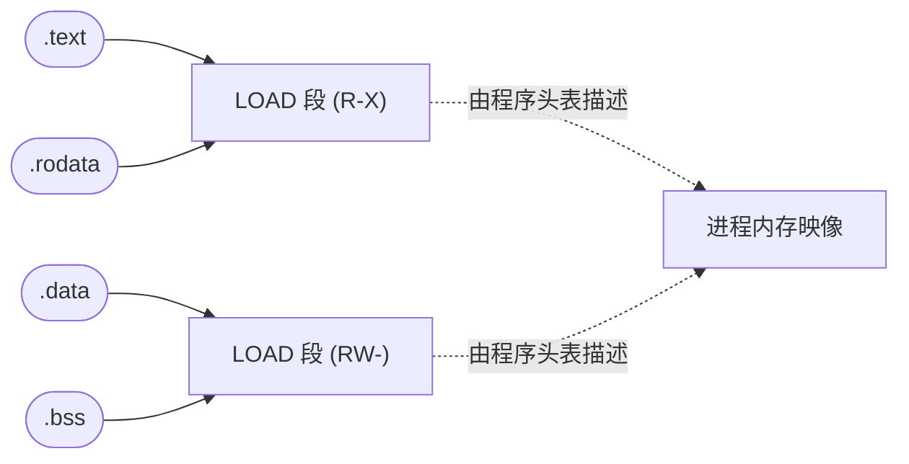
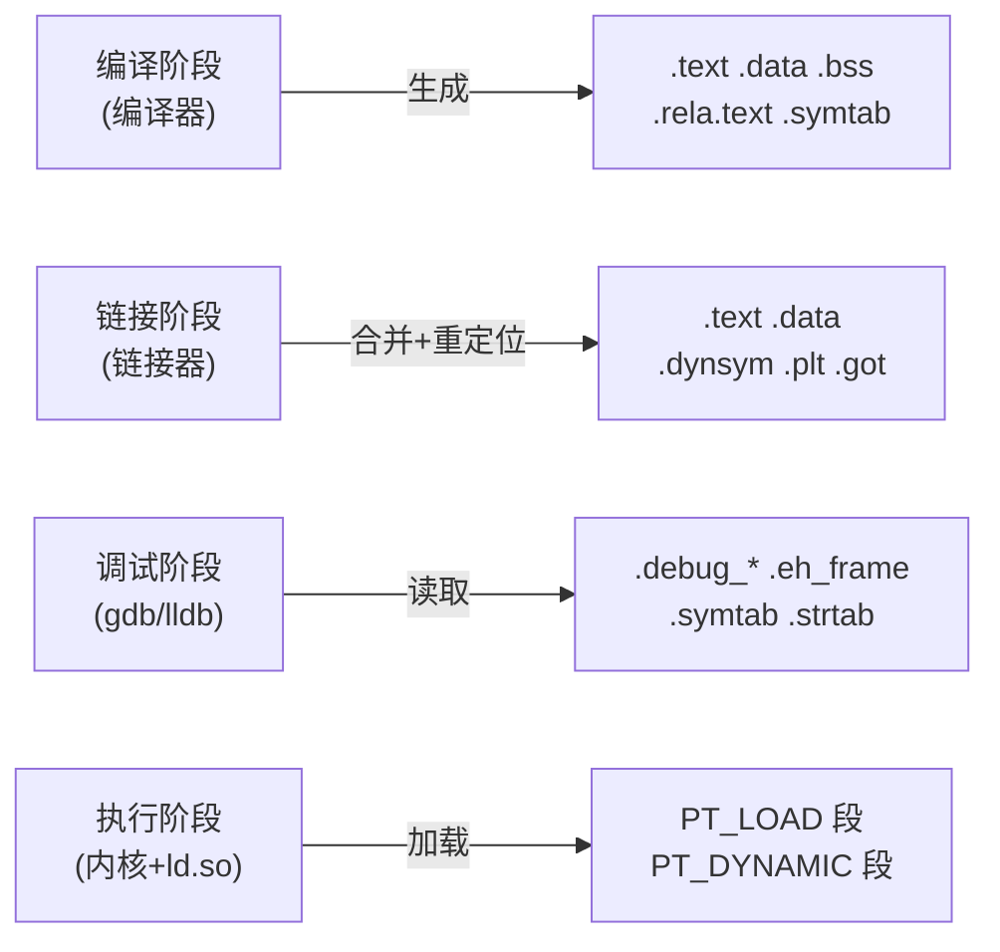

# 详解ELF文件(四)节区

节区（Sections）是 ELF 文件中用于组织和存储不同类型数据的基本单元，是链接视角（Linking View）下的核心概念。节区在链接、调试、静态分析过程中起着关键作用，是理解 ELF 文件内部结构不可缺少的部分。

## 节区基本概念

### 节（Section）与段（Segment）的根本区别

ELF 文件存在两套完全不同的描述方式：

- **节（Section）**：链接视角下的细粒度逻辑单元，描述"这块数据是什么"（代码？符号？重定位信息？）
- **段（Segment）**：执行视角下的粗粒度内存映射单元，描述"这块内存如何加载"（可读？可写？可执行？）

| 维度 | 节（Section）| 段（Segment）|
|---|---|---|
| 使用方 | 链接器、调试器、目标文件分析工具 | 操作系统内核、动态链接器 |
| 描述结构 | 节头表（SHT）| 程序头表（PHT）|
| 粒度 | 细（每类数据一个节）| 粗（多个节合并为一段）|
| 运行时必要性 | 可 strip，非运行时必要 | 运行时必须，不可删除 |
| 目标文件中 | 有 | 无（`.o` 无程序头表）|

多个节在链接/加载时按权限合并为段。典型对应关系：

```
.text    ─┐
.plt     ─┤→ LOAD 段（R-X）
.rodata  ─┘

.data    ─┐
.bss     ─┤→ LOAD 段（RW-）
.got.plt ─┘
```

### 节区命名约定

ELF 规范定义了一批以 `.` 开头的标准节名，如 `.text`、`.data`、`.bss`。用户也可以创建自定义节。规范保留了以 `.` 开头的名称，工具通常也使用这个前缀。

## 节区结构

每个节区由一个**节头（Section Header，Elf64_Shdr）**描述，节头数组构成节头表。节头本身存储在文件中，指向实际节数据：

```
节头表（数组）         节数据（分散在文件中）
┌──────────────┐       ┌──────────┐
│ Shdr[0]  NULL│       │          │
├──────────────┤  ┌───>│ .text    │
│ Shdr[1]  ────┼──┘    │ (代码)  │
├──────────────┤        └──────────┘
│ Shdr[2]  ────┼──┐    ┌──────────┐
├──────────────┤  └───>│ .data    │
│ ...          │        │ (数据)  │
└──────────────┘        └──────────┘
```

每个节区由节头描述，节区头包含以下重要字段（详见 [[34.节头表]]）：

1. **sh_name** - 节区名称在 `.shstrtab` 字符串表中的索引
2. **sh_type** - 节区类型（如 `SHT_PROGBITS`、`SHT_SYMTAB` 等）
3. **sh_flags** - 节区标志（如 `SHF_WRITE`、`SHF_ALLOC`、`SHF_EXECINSTR` 等）
4. **sh_addr** - 节区在内存中的虚拟地址（0 表示不被加载）
5. **sh_offset** - 节区在文件中的偏移量
6. **sh_size** - 节区的大小（字节）
7. **sh_link** - 节区链接信息（与其他节区的关系）
8. **sh_info** - 节区的附加信息
9. **sh_addralign** - 节区对齐要求
10. **sh_entsize** - 节区中条目的大小（如果节区包含固定大小的条目）

## 节区类型（sh_type）完整参考

`sh_type` 字段定义了节区的语义和结构。以下是完整的类型列表：

### 标准类型

| sh_type 值 | 宏名 | 含义 |
|---|---|---|
| 0 | SHT_NULL | 非活跃节，无关联数据；节头表第 0 项始终为此类型 |
| 1 | SHT_PROGBITS | 程序定义的信息：代码、数据、字符串等 |
| 2 | SHT_SYMTAB | 完整符号表（`.symtab`），可被 strip |
| 3 | SHT_STRTAB | 字符串表（`.strtab`、`.shstrtab`、`.dynstr`）|
| 4 | SHT_RELA | 带显式加数（addend）的重定位表（64位常用）|
| 5 | SHT_HASH | 符号哈希表（`.hash`，SystemV 经典格式）|
| 6 | SHT_DYNAMIC | 动态链接信息（`.dynamic`）|
| 7 | SHT_NOTE | 提示信息（`.note.*`）|
| 8 | SHT_NOBITS | 无文件内容的节（`.bss`），`sh_size` 表示内存大小 |
| 9 | SHT_REL | 不带加数的重定位表（32位常用）|
| 10 | SHT_SHLIB | 保留，语义未指定 |
| 11 | SHT_DYNSYM | 动态链接符号表（`.dynsym`），运行时必须 |
| 14 | SHT_INIT_ARRAY | 初始化函数指针数组（`.init_array`）|
| 15 | SHT_FINI_ARRAY | 析构函数指针数组（`.fini_array`）|
| 16 | SHT_PREINIT_ARRAY | 预初始化函数指针数组（`.preinit_array`）|
| 17 | SHT_GROUP | 节组（Section Group），用于 C++ 模板实例化去重 |
| 18 | SHT_SYMTAB_SHNDX | 扩展符号表节索引（`e_shnum > 65535` 时使用）|

### OS 特定类型（GNU/Linux 扩展）

| sh_type 值 | 宏名 | 含义 |
|---|---|---|
| 0x6ffffff6 | SHT_GNU_HASH | GNU 哈希表（`.gnu.hash`），比 SHT_HASH 更高效 |
| 0x6ffffffd | SHT_VERDEF / SHT_GNU_verdef | 版本定义（`.gnu.version_d`）|
| 0x6ffffffe | SHT_VERNEED / SHT_GNU_verneed | 版本依赖（`.gnu.version_r`）|
| 0x6fffffff | SHT_VERSYM / SHT_GNU_versym | 版本符号表（`.gnu.version`）|

## 节区标志（sh_flags）完整参考

`sh_flags` 是位掩码，可以组合使用：

| 值（十六进制）| 宏名 | 含义 |
|---|---|---|
| 0x1 | SHF_WRITE | 节区在进程运行时可写 |
| 0x2 | SHF_ALLOC | 节区在进程运行时占用内存（不含此标志的节不被加载）|
| 0x4 | SHF_EXECINSTR | 节区包含可执行机器指令 |
| 0x10 | SHF_MERGE | 节区中的数据元素可合并以消除重复（如相同字符串常量）|
| 0x20 | SHF_STRINGS | 节区包含以 `\0` 结尾的字符串，配合 SHF_MERGE 使用 |
| 0x40 | SHF_INFO_LINK | `sh_info` 字段包含节头表索引 |
| 0x80 | SHF_LINK_ORDER | 节区需要按特定顺序与其关联节保持相对位置 |
| 0x100 | SHF_OS_NONCONFORMING | 需要 OS 特定处理，链接器不识别则报错 |
| 0x200 | SHF_GROUP | 节区是节组的成员 |
| 0x400 | SHF_TLS | 节区包含线程局部存储（Thread-Local Storage）|
| 0x800 | SHF_COMPRESSED | 节区数据已压缩（不可与 SHF_ALLOC 同时使用）|
| 0x0ff00000 | SHF_MASKOS | OS 特定语义位掩码 |
| 0xf0000000 | SHF_MASKPROC | 处理器特定语义位掩码 |

常见节区的 `sh_flags` 组合：

| 节区 | sh_flags 组合 | 含义 |
|---|---|---|
| `.text` | A+X（ALLOC+EXECINSTR）| 运行时占内存，含可执行指令 |
| `.rodata` | A（ALLOC）| 运行时占内存，只读 |
| `.data` | A+W（ALLOC+WRITE）| 运行时占内存，可写 |
| `.bss` | A+W（ALLOC+WRITE）| 运行时占内存，可写，无文件内容 |
| `.symtab` | 无（通常）| 链接时用，不加载到运行时内存 |
| `.strtab` | 无或 MS（MERGE+STRINGS）| 链接时用 |
| `.debug_*` | 无 | 调试信息，不加载 |

> **`SHF_MERGE + SHF_STRINGS`**：链接器可以将多个相同的只读字符串常量合并为一个，减少可执行文件体积。GCC 的 `-fmerge-constants` 选项利用此机制。

## 常见节区详细说明

### 1. 代码相关节区

#### .text 节（见 [[05.text节]]）

- **sh_type**：`SHT_PROGBITS`
- **sh_flags**：`SHF_ALLOC | SHF_EXECINSTR`
- 存储编译后的机器指令，是程序执行的核心
- 加载到 R-X 段，防止运行时被修改（W^X 原则）

#### .plt 节（Procedure Linkage Table）

- **sh_type**：`SHT_PROGBITS`
- **sh_flags**：`SHF_ALLOC | SHF_EXECINSTR`
- 过程链接表，存储动态链接函数的跳转桩代码
- 每个被调用的外部函数在 PLT 中有一个小型跳转桩

#### .plt.got 节

- PLT 的一种变体，用于 GOT 驱动的函数调用
- 在 Full RELRO 场景中，与普通 `.plt` 略有差异

#### .rodata 节（见 [[06.rodata节]]）

- **sh_type**：`SHT_PROGBITS`
- **sh_flags**：`SHF_ALLOC`（仅读）
- 存储只读数据：字符串字面量、`const` 全局变量、switch 跳转表等
- 加载到只读段，防止被意外修改

### 2. 数据相关节区

#### .data 节（见 [[07.data节]]）

- **sh_type**：`SHT_PROGBITS`
- **sh_flags**：`SHF_ALLOC | SHF_WRITE`
- 存储已初始化的全局变量和静态变量（非零初始值）
- 文件中占用空间，加载时直接映射到 RW 段

#### .bss 节（见 [[08.bss节]]）

- **sh_type**：`SHT_NOBITS`（文件中不占空间）
- **sh_flags**：`SHF_ALLOC | SHF_WRITE`
- 存储未初始化的全局变量和静态变量（或初始化为 0 的变量）
- 文件中 `sh_size > 0` 但无文件内容（节省文件空间）；加载时在内存中分配并清零

#### .data.rel.ro 节

- **sh_type**：`SHT_PROGBITS`
- 包含在重定位前可写、重定位后变为只读的数据（如 vtable）
- 与 `PT_GNU_RELRO` 段配合实现 RELRO 保护

#### .tdata 和 .tbss 节（线程局部存储）

- **sh_flags**：包含 `SHF_TLS`
- `.tdata`：线程局部有初始值数据；`.tbss`：线程局部零初始化数据
- 每个线程拥有独立副本，由 `PT_TLS` 段描述

### 3. 符号相关节区

#### .symtab 节（见 [[09.symtab节]]）

- **sh_type**：`SHT_SYMTAB`
- 完整符号表，包含程序中所有符号（函数、变量、标签等）
- `sh_link` 指向 `.strtab`（符号名字符串表）
- 可被 `strip` 命令删除（不影响运行）

#### .strtab 节

- **sh_type**：`SHT_STRTAB`
- 配合 `.symtab` 存储符号名称字符串
- 以 `\0` 分隔每个字符串，索引 0 处始终为空字符串 `""`

#### .shstrtab 节（见 [[10.shstrtab节]]）

- **sh_type**：`SHT_STRTAB`
- 专门存储所有节区名称的字符串表
- 由 ELF 头部的 `e_shstrndx` 字段定位

#### .dynsym 节（见 [[15.dynsym节]]）

- **sh_type**：`SHT_DYNSYM`
- **sh_flags**：`SHF_ALLOC`（运行时可见）
- 动态链接符号表，是 `.symtab` 的子集，只含动态链接必需的符号
- 运行时动态链接器使用此表解析未定义符号，不能被 strip

#### .dynstr 节（见 [[16.dynstr节]]）

- **sh_type**：`SHT_STRTAB`
- **sh_flags**：`SHF_ALLOC`
- 配合 `.dynsym` 存储动态符号名称字符串

### 4. 重定位相关节区

#### .rela.text 节（见 [[23.rela.text节]]）

- **sh_type**：`SHT_RELA`
- 包含 `.text` 节中需要重定位的条目（带显式 addend）
- `sh_link` 指向符号表，`sh_info` 指向被重定位的节

#### .rel.text 节（见 [[22.rel.text节]]）

- **sh_type**：`SHT_REL`
- 与 `.rela.text` 类似，但不含显式 addend（隐式加数从被重定位地址读取）
- 32位 ELF 常用 `.rel.*`；64位 ELF 常用 `.rela.*`

#### .rela.dyn 和 .rela.plt 节

- 运行时动态链接器使用的重定位表
- `.rela.dyn`：数据段（`.got`）中的重定位
- `.rela.plt`：PLT 条目（`.got.plt`）中的重定位

### 5. 动态链接相关节区

#### .dynamic 节（见 [[18.dynamic节]]）

- **sh_type**：`SHT_DYNAMIC`
- **sh_flags**：`SHF_ALLOC | SHF_WRITE`
- 包含动态链接信息数组（`Elf64_Dyn[]`），每项含 `d_tag` + `d_val/d_ptr`
- 同时被 `PT_DYNAMIC` 段引用

#### .got 节（Global Offset Table）

- **sh_type**：`SHT_PROGBITS`
- **sh_flags**：`SHF_ALLOC | SHF_WRITE`
- 全局偏移表，存储全局数据地址（PIE 模式下实现地址无关访问）
- Full RELRO 后变为只读

#### .got.plt 节

- 配合 PLT 实现延迟绑定（lazy binding）
- 每个外部函数在 `.got.plt` 中有一个条目，首次调用后被动态链接器填写实际地址

#### .hash 节（见 [[37.hash节]]）

- **sh_type**：`SHT_HASH`
- 经典 SystemV 符号哈希表，供动态链接器快速查找符号
- 已被更高效的 `.gnu.hash` 部分取代

#### .gnu.hash 节

- **sh_type**：`SHT_GNU_HASH`
- GNU 扩展的 Bloom filter + 哈希表实现，比经典 `.hash` 查找更快
- 现代 Linux 工具链默认生成

### 6. 版本控制节区

#### .gnu.version 节

- **sh_type**：`SHT_VERSYM`（= `0x6fffffff`）
- 为 `.dynsym` 中每个符号记录版本号，与 `.gnu.version_r`/`.gnu.version_d` 配合

#### .gnu.version_r 节

- **sh_type**：`SHT_VERNEED`
- 记录本文件依赖的外部符号版本需求（如需要 `GLIBC_2.17` 的符号）

#### .gnu.version_d 节

- **sh_type**：`SHT_VERDEF`
- 记录本文件导出的符号版本定义（共享库提供版本控制时使用）

### 7. 初始化与析构节区

#### .init 节

- **sh_type**：`SHT_PROGBITS`
- **sh_flags**：`SHF_ALLOC | SHF_EXECINSTR`
- 包含程序初始化代码，在 `main()` 前执行
- 由 C 运行库调用

#### .fini 节

- 类似 `.init`，在 `exit()` 时执行析构代码

#### .init_array 节

- **sh_type**：`SHT_INIT_ARRAY`
- 存储函数指针数组，C++ 全局对象构造函数、`__attribute__((constructor))` 函数均注册于此
- 比 `.init` 节更灵活，支持优先级

#### .fini_array 节

- **sh_type**：`SHT_FINI_ARRAY`
- 析构函数指针数组，`__attribute__((destructor))` 函数注册于此

#### .ctors 和 .dtors 节（旧式）

- 旧版 GCC 使用的构造/析构函数列表，现已被 `.init_array`/`.fini_array` 取代

### 8. 调试相关节区

#### .debug_* 节（DWARF 调试信息）

- **sh_flags**：无 `SHF_ALLOC`（不加载到运行时内存）
- 包含 DWARF 格式的调试信息，供 `gdb`、`lldb` 等调试器使用

| 节名 | 内容 |
|---|---|
| `.debug_info` | 核心 DIE（调试信息条目）树，描述类型、变量、函数 |
| `.debug_abbrev` | DIE 缩写表（用于压缩 `.debug_info`）|
| `.debug_line` | 指令地址到源代码行号的映射 |
| `.debug_str` | 调试信息用字符串表 |
| `.debug_loc` | 变量位置列表（DWARF 4）|
| `.debug_ranges` | 非连续代码范围（DWARF 4）|
| `.debug_aranges` | 地址范围加速索引 |
| `.debug_pubnames` | 公共符号名索引 |
| `.debug_frame` | 调用帧信息（CFI），用于栈展开 |

#### .debug 节（旧式，见 [[24.debug节]]）

- 早期 DWARF/stabs 格式的调试信息，现代工具链已使用 `.debug_*` 系列替代

#### .line 节（见 [[25.line节]]）

- 旧式行号信息，DWARF `.debug_line` 的前身

### 9. 异常处理节区

#### .eh_frame 节（见 [[46.eh_frame节]]）

- **sh_type**：`SHT_PROGBITS`
- **sh_flags**：`SHF_ALLOC`
- 包含调用帧信息（Call Frame Information），用于 C++ 异常处理和栈展开
- 格式类似 DWARF `.debug_frame`，但在运行时可访问

#### .eh_frame_hdr 节（见 [[47.eh_frame_hdr节]]）

- `.eh_frame` 的索引头，供 `PT_GNU_EH_FRAME` 段引用，加速查找

### 10. 注释和辅助节区

#### .note.ABI-tag 节（见 [[36.note.ABI-tag节]]）

- **sh_type**：`SHT_NOTE`
- 记录文件要求的最低 Linux 内核 ABI 版本

#### .note.gnu.build-id 节

- **sh_type**：`SHT_NOTE`
- 存储文件的唯一 Build ID（通常为 SHA1 哈希的前 20 字节）
- 用于关联分离的 debug 文件（`.debug`/`debuginfo` 包）

#### .note.gnu.property 节

- **sh_type**：`SHT_NOTE`
- GNU 属性，包含 Intel CET 支持标志、ABI 要求等

#### .comment 节

- **sh_type**：`SHT_PROGBITS`
- 编译器版本信息字符串（如 `GCC: (Ubuntu 11.4.0) 11.4.0`）
- 无 `SHF_ALLOC`，不加载到运行时

## 节区类型与标志速查

不同节区由 `sh_type` 与 `sh_flags` 共同刻画其身份：

| 节 | sh_type | sh_flags | 典型用途 |
|---|---|---|---|
| .text | SHT_PROGBITS | ALLOC+EXECINSTR | 代码 |
| .rodata | SHT_PROGBITS | ALLOC | 只读常量 |
| .data | SHT_PROGBITS | ALLOC+WRITE | 已初始化全局变量 |
| .bss | SHT_NOBITS | ALLOC+WRITE | 未初始化全局变量 |
| .symtab | SHT_SYMTAB | 无 | 链接符号表 |
| .dynsym | SHT_DYNSYM | ALLOC | 动态链接符号表 |
| .strtab | SHT_STRTAB | 无 | 符号名字符串 |
| .dynstr | SHT_STRTAB | ALLOC | 动态符号名字符串 |
| .shstrtab | SHT_STRTAB | 无 | 节名字符串 |
| .rela.* | SHT_RELA | INFO_LINK | 带加数的重定位 |
| .rel.* | SHT_REL | INFO_LINK | 不带加数的重定位 |
| .dynamic | SHT_DYNAMIC | ALLOC+WRITE | 动态链接信息 |
| .got | SHT_PROGBITS | ALLOC+WRITE | 全局偏移表 |
| .plt | SHT_PROGBITS | ALLOC+EXECINSTR | 过程链接表 |
| .hash | SHT_HASH | ALLOC | 符号哈希表 |
| .gnu.hash | SHT_GNU_HASH | ALLOC | GNU 符号哈希表 |
| .init_array | SHT_INIT_ARRAY | ALLOC+WRITE | 构造函数指针 |
| .fini_array | SHT_FINI_ARRAY | ALLOC+WRITE | 析构函数指针 |
| .eh_frame | SHT_PROGBITS | ALLOC | 异常帧信息 |
| .debug_* | SHT_PROGBITS | 无 | DWARF 调试信息 |
| .note.* | SHT_NOTE | ALLOC | 辅助信息 |

## 节区与段的关系

在链接过程中，多个功能相似的节区会被合并到一个段中。例如：

1. **代码段（Text Segment）** - 通常包含 .text、.plt、.rodata 等只读节区
2. **数据段（Data Segment）** - 通常包含 .data、.bss、.got 等读写节区

这种合并优化了内存布局，减少了内存页的数量。



## 节区的重要特性

### .bss 节区的特殊性

[[08.bss节|.bss 节区]]（Block Started by Symbol）是一个特殊的节区，它在文件中不占用空间（`sh_type = SHT_NOBITS`），但在内存中需要分配空间。这是因为它只存储未初始化的全局变量和静态变量，这些变量在程序加载时会被自动初始化为 0。

这种设计的优点：

1. 减少可执行文件的大小（大量零值不需要存储）
2. 提高加载效率（无需从文件读取，直接清零）
3. 简化程序初始化过程

`.bss` 的大小由节头 `sh_size` 记录，但 `sh_offset` 通常指向文件中无实际内容的位置（或指向下一节的起始位置）。在 PT_LOAD 段中，`p_memsz - p_filesz` 正好等于 `.bss` 的大小。

### 节区对齐

节区通常需要按照特定的边界对齐，以提高内存访问效率。对齐要求由 `sh_addralign` 字段指定：

- `sh_addralign = 0` 或 `1`：无特殊对齐要求
- 其他值：必须是 2 的幂次（1、2、4、8、16...）

例如：
- `.text` 通常 16 字节对齐（便于指令解码器）
- `.data` 通常 8 字节对齐（64位数据对齐）
- `.rodata` 通常 4 或 8 字节对齐

### 节区的 sh_link 与 sh_info 关联

不同类型节区的 `sh_link` 和 `sh_info` 字段有不同含义：

| sh_type | sh_link | sh_info |
|---|---|---|
| SHT_SYMTAB / SHT_DYNSYM | 关联字符串表的节索引 | 第一个全局符号的索引 |
| SHT_RELA / SHT_REL | 关联符号表的节索引 | 被重定位的节的索引 |
| SHT_HASH / SHT_GNU_HASH | 关联符号表的节索引 | 0 |
| SHT_DYNAMIC | 关联字符串表的节索引 | 0 |
| SHT_GROUP | 关联符号表的节索引 | 组签名符号的索引 |
| SHT_INIT_ARRAY / SHT_FINI_ARRAY | 0 | 0 |

## 实战：列出所有节区

### readelf 命令

```bash
readelf -S a.out            # 列出节头表（所有节区）
readelf -S -W a.out         # 宽格式输出（不截断地址）
objdump -h a.out            # 另一种查看节区的方式
size -A a.out               # 按节列出大小
```

```text
# 示例输出（代表性，非本机实跑）
$ readelf -S a.out
There are 31 section headers, starting at offset 0x3710:

Section Headers:
  [Nr] Name              Type             Address           Offset
       Size              EntSize          Flags  Link  Info  Align
  [ 0]                   NULL             0000000000000000  00000000
       0000000000000000  0000000000000000           0     0     0
  [ 1] .interp           PROGBITS         0000000000000318  00000318
       000000000000001c  0000000000000000   A       0     0     1
  [ 2] .note.gnu.property NOTE            0000000000000338  00000338
       0000000000000030  0000000000000000   A       0     0     8
  [ 3] .note.gnu.build-id NOTE            0000000000000368  00000368
       0000000000000024  0000000000000000   A       0     0     4
  [ 4] .note.ABI-tag     NOTE             000000000000038c  0000038c
       0000000000000020  0000000000000000   A       0     0     4
  [ 5] .gnu.hash         GNU_HASH         00000000000003b0  000003b0
       0000000000000024  0000000000000000   A       6     0     8
  [ 6] .dynsym           DYNSYM           00000000000003d8  000003d8
       0000000000000090  0000000000000018   A       7     1     8
  [ 7] .dynstr           STRTAB           0000000000000468  00000468
       0000000000000078  0000000000000000   A       0     0     1
  [14] .text             PROGBITS         0000000000001060  00001060
       0000000000000175  0000000000000000  AX       0     0    16
  [16] .rodata           PROGBITS         0000000000002000  00002000
       0000000000000012  0000000000000000   A       0     0     4
  [24] .data             PROGBITS         0000000000004000  00003000
       0000000000000010  0000000000000000  WA       0     0     8
  [25] .bss              NOBITS           0000000000004010  00003010
       0000000000000008  0000000000000000  WA       0     0     4
  [26] .comment          PROGBITS         0000000000000000  00003010
       000000000000002b  0000000000000001  MS       0     0     1
  [29] .symtab           SYMTAB           0000000000000000  00003040
       0000000000000378  0000000000000018          30    17     8
  [30] .shstrtab         STRTAB           0000000000000000  000033a0
       000000000000011a  0000000000000000           0     0     1
```

### 列标含义对照

| 列名 | 对应字段 | 说明 |
|---|---|---|
| Nr | — | 节索引（从 0 开始）|
| Name | sh_name | 节名称（从 .shstrtab 中查找）|
| Type | sh_type | 节类型 |
| Address | sh_addr | 内存虚拟地址（0=不加载）|
| Offset | sh_offset | 文件偏移 |
| Size | sh_size | 节大小（字节）|
| EntSize | sh_entsize | 条目大小（0=无固定条目）|
| Flags | sh_flags | A=ALLOC, X=EXECINSTR, W=WRITE, M=MERGE, S=STRINGS |
| Link | sh_link | 关联节索引 |
| Info | sh_info | 附加信息 |
| Align | sh_addralign | 对齐（2^n）|

### 查看节区内容

```bash
# 以十六进制转储指定节
readelf -x .rodata a.out      # 查看 .rodata 节内容
readelf -x .text a.out        # 查看 .text 节内容

# 反汇编
objdump -d a.out              # 反汇编所有可执行节
objdump -j .text -d a.out     # 只反汇编 .text 节

# 查看字符串内容
strings a.out                 # 列出所有可打印字符串
readelf -p .rodata a.out      # 打印节中的字符串
```

```text
# 示例输出（代表性，非本机实跑）
$ readelf -x .rodata a.out

Hex dump of section '.rodata':
  0x00002000 01000200 48656c6c 6f2c2057 6f726c64  ....Hello, World
  0x00002010 210a00                               !..
```

## 节区在不同阶段的作用



1. **编译阶段** - 编译器生成各种节区，如 `.text`、`.data`、`.bss`、`.rela.text`、`.symtab`
2. **链接阶段** - 链接器合并相同类型的节区，解析符号引用，生成重定位信息、GOT/PLT
3. **调试阶段** - 调试器使用 `.debug_*`、`.symtab` 等节区进行源代码级调试
4. **执行阶段** - 内核根据程序头表加载 `PT_LOAD` 段（即多个节合并后的段）

## 特殊节索引

ELF 规范定义了几个特殊节索引值，不对应实际节：

| 值 | 宏名 | 含义 |
|---|---|---|
| 0 | SHN_UNDEF | 未定义，表示符号未定义（待外部解析）|
| 0xff00 | SHN_LORESERVE | 保留范围下界 |
| 0xff01–0xff1f | SHN_LOPROC–SHN_HIPROC | 处理器特定 |
| 0xff20–0xff3f | SHN_LOOS–SHN_HIOS | OS 特定 |
| 0xfff1 | SHN_ABS | 绝对值符号，地址不参与重定位 |
| 0xfff2 | SHN_COMMON | 公共符号（未分配存储的外部符号）|
| 0xffff | SHN_XINDEX | 实际索引在 SYMTAB_SHNDX 节中（超大节表时使用）|

## 节头表

节头表（Section Header Table）包含了所有节区的描述信息。它是一个 `Elf64_Shdr` 结构数组，每个元素描述一个节区。

通过节区头表，链接器可以：

1. 定位各个节区在文件中的位置
2. 获取节区的大小和属性
3. 理解节区之间的关系（通过 `sh_link`/`sh_info`）
4. 进行符号解析和重定位

> 节头表的结构、字段与读取方法详见 [[34.节头表]]。

## 总结

节区是 ELF 文件组织数据的基本单位，不同类型的节区承载着程序的不同信息。关键要点：

1. **节区 vs 段**：节区是链接视角的细粒度单元，段是执行视角的粗粒度单元；多个节区合并为一个段
2. **sh_type 定义语义**：决定链接器和调试器如何解读节区数据
3. **sh_flags 定义属性**：`ALLOC` 决定是否加载，`WRITE` 决定是否可写，`EXECINSTR` 决定是否可执行
4. **SHT_NOBITS 的特殊性**：`.bss` 无文件内容但有内存大小，是节省空间的关键机制
5. **sh_link/sh_info 建立关联**：节区之间通过这两个字段形成逻辑关系网络

## 相关阅读

- **承载结构**：[[34.节头表]]、[[03.程序头表]]、[[02.ELF文件头部]]
- **数据/代码节**：[[05.text节]]、[[06.rodata节]]、[[07.data节]]、[[08.bss节]]
- **符号与字符串**：[[09.symtab节]]、[[10.shstrtab节]]
- 上一篇：[[03.程序头表]] ｜ 下一篇：[[05.text节]]
