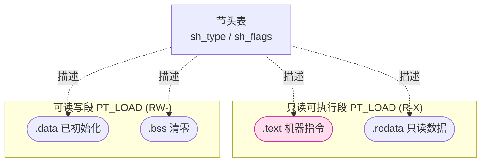

# 详解ELF文件(五).text节

.text节是ELF（Executable and Linkable Format）文件中最重要的节区之一，它存储了程序的机器指令代码。理解.text节对于程序分析、逆向工程和系统安全等领域都至关重要。

## .text节基本概念

.text节是ELF文件中用于存储编译后机器指令的代码节。它是程序执行的主要部分，包含了CPU可以直接执行的二进制指令。

名称来源于汇编传统："text"在早期汇编语言中专指程序的可执行代码部分，与存储数据的"data"段相对。这一命名约定沿用至今，是所有类Unix系统和ELF格式的惯例。

## 节头属性

.text 节的"身份"由节头表中的 `sh_type` 与 `sh_flags` 决定，对比同组数据节如下（高亮为本节）：

| 节 | sh_type | sh_flags | 占文件空间 |
|---|---|---|---|
| **.text** | **SHT_PROGBITS** | **SHF_ALLOC \| SHF_EXECINSTR (AX)** | **是** |
| .rodata | SHT_PROGBITS | SHF_ALLOC (A) | 是 |
| .data | SHT_PROGBITS | SHF_ALLOC \| SHF_WRITE (WA) | 是 |
| .bss | SHT_NOBITS | SHF_ALLOC \| SHF_WRITE (WA) | 否 |

`SHF_EXECINSTR` 标志正是 .text 区别于其它数据节的关键——它使该节在加载后落入可执行段（`PT_LOAD` 中 `p_flags` 含 `PF_X`）。

### sh_addralign 与函数对齐

节头字段 `sh_addralign` 指定了节的最低对齐要求（必须是2的幂次）。x86-64 上 .text 的典型对齐为 **16字节**（一个缓存行的四分之一），这与 CPU 指令预取单元和分支预测器的工作粒度相匹配。

具体到函数级别，GCC/Clang 默认会将**每个函数的入口点**对齐到 16 字节边界。可以通过 `-falign-functions=N` 显式控制，`N=0` 表示依赖目标平台默认值。对齐空隙通常用 `0x90`（x86 NOP）或 `0x0f 0x1f ...`（多字节 NOP，通过单条指令消费多字节，避免多条单字节 NOP 产生的解码压力）填充。

## .text节的主要特性

### 1. 存储内容

- 存储编译后的机器代码指令
- 包含程序的所有可执行逻辑
- 不含用户数据（字符串常量等放入 [[06.rodata节|.rodata]]）

### 2. 内存属性

- **只读属性**：.text节在内存中被映射为只读区域，防止程序意外修改自己的指令
- **可执行属性**：具有执行权限（`SHF_EXECINSTR`），CPU可以从中读取并执行指令
- **不可写属性**：尝试写入.text节会导致段错误（segmentation fault，SIGSEGV）

### 3. 指令编码格式

.text 节中存储的是目标架构的机器码二进制流：

| 架构 | 指令宽度 | 字节序 | 典型特征 |
|---|---|---|---|
| x86-64 | 可变长（1~15字节）| 小端 | REX前缀、ModRM、SIB等编码复杂 |
| AArch64 | 固定4字节 | 小端（通常）| 统一32位指令，条件码编码在指令内 |
| RISC-V | 固定4字节（RV32I），压缩指令2字节（C扩展） | 小端 | 可选压缩指令集 |
| MIPS | 固定4字节 | 大端或小端 | 延迟槽（delay slot）设计 |

## .text节在ELF文件中的位置

在典型的ELF文件中，.text节通常位于文件的前部，紧跟在ELF文件头之后。它的位置和大小信息存储在节区头表（Section Header Table，见 [[34.节头表]]）中对应的条目里。

## .text节的结构

.text节本质上是一个二进制数据块，包含了一系列机器指令。这些指令按照目标处理器的指令集编码，例如x86-64或ARM指令集。

在.text节中，指令按照函数的组织方式进行排列。通常，函数的机器代码是连续存储的，函数之间可能有对齐填充。

## 结构图示

.text 与同为只读的 .rodata 在执行视图中被并入同一个只读可执行段（PT_LOAD, R-X），与可写的 .data/.bss 分属不同段：



## .text节与其他节的关系

### 1. 与.rodata节的关系

- .text节可能引用 [[06.rodata节|.rodata节]] 中的只读数据（如字符串常量）
- 在执行视图中，它们可能被合并到同一个只读可执行的段中

### 2. 与符号表的关系

- 符号表（[[09.symtab节|.symtab]]）中包含了.text节中函数和代码标签的信息
- 重定位表（如 [[22.rel.text节|.rel.text]]）包含了.text节中需要重定位的位置信息

### 3. 与程序头表的关系

- 在可执行文件中，.text节通常被包含在PT_LOAD类型的段中
- [[03.程序头表]]描述了.text节在内存中的加载位置和属性

## .text节如何被合并进 PT_LOAD 段

理解"节"（section）与"段"（segment）的二元关系是掌握 ELF 加载机制的核心。

### 节与段的双重视角

ELF 文件同时维护两种视图：
- **链接视图**（Linking View）：以节为单位，供链接器使用，由节头表描述
- **执行视图**（Execution View）：以段为单位，供加载器使用，由程序头表描述

一个 `PT_LOAD` 段可以包含多个节，节到段的映射由链接器根据节的 `sh_flags` 自动完成：具有 `SHF_ALLOC | SHF_EXECINSTR` 的节归入可执行段，具有 `SHF_ALLOC | SHF_WRITE` 的节归入可读写段。

### PT_LOAD 段的程序头字段

```text
# 示例输出（代表性，非本机实跑）
$ readelf -l a.out
  Type           Offset   VirtAddr           PhysAddr           FileSiz  MemSiz   Flg  Align
  LOAD           0x000000 0x0000000000000000 0x0000000000000000 0x000560 0x000560 R    0x1000
  LOAD           0x001000 0x0000000000001000 0x0000000000001000 0x0001c5 0x0001c5 R E  0x1000
  LOAD           0x002000 0x0000000000002000 0x0000000000002000 0x000190 0x000190 R    0x1000
  LOAD           0x002e10 0x0000000000003e10 0x0000000000003e10 0x000220 0x000228 RW   0x1000
```

其中含 `E`（`PF_X = 1`）标志的 `LOAD` 段包含 .text；`Flg = R E` 对应权限 `PF_R | PF_X`。`p_align = 0x1000`（4 KB）是 x86 的页大小，ELF 规范要求 `p_vaddr % p_align == p_offset % p_align`。

### 段权限（p_flags）与内存页保护

`PT_LOAD` 段的 `p_flags` 直接映射到操作系统的内存保护位：

| p_flags | POSIX mprotect | 含义 |
|---|---|---|
| `PF_R` (4) | `PROT_READ` | 可读 |
| `PF_W` (2) | `PROT_WRITE` | 可写 |
| `PF_X` (1) | `PROT_EXEC` | 可执行 |
| `PF_R\|PF_X` (5) | `PROT_READ\|PROT_EXEC` | .text 所在段 |
| `PF_R\|PF_W` (6) | `PROT_READ\|PROT_WRITE` | .data/.bss 所在段 |

内核在 `mmap()` 时将 `p_flags` 转换为对应的页表权限位（x86-64 的 U/S、R/W、NX 位）。

### 链接脚本中的 .text 布局

默认链接脚本（GNU ld）对 .text 的典型安排如下：

```ld
/* 示例：GNU ld 默认链接脚本片段（节选，非完整） */
SECTIONS
{
  .text           :
  {
    *(.text.unlikely .text.*_unlikely .text.unlikely.*)
    *(.text.exit .text.exit.*)
    *(.text.startup .text.startup.*)
    *(.text.hot .text.hot.*)
    *(SORT(.text.sorted.*))
    *(.text .stub .text.* .gnu.linkonce.t.*)
  }
}
```

这一安排将冷代码（unlikely/exit）放在前部，热代码（hot/startup）紧跟，最后是普通 .text。

## .text节的典型布局

在实际的ELF文件中，.text节通常包含以下内容：

1. **程序入口点**：_start函数或main函数的代码
2. **用户定义函数**：程序员编写的所有函数代码
3. **库函数调用**：对标准库函数的调用代码
4. **初始化代码**：程序启动时执行的初始化代码
5. **对齐填充**：为了满足处理器对齐要求而添加的填充字节

## .text.*子节与 -ffunction-sections

### 默认行为：所有函数共享同一个 .text

编译器默认将同一编译单元（`.c` 文件）的所有函数打包进单个 `.text` 节。链接器无法拆分一个节，因此**即使只用了其中一个函数，整个编译单元的 .text 都会被链入**。

### -ffunction-sections：每函数独立节

使用 `-ffunction-sections` 编译时，GCC/Clang 会为每个函数生成独立的 `.text.<function_name>` 子节：

```bash
gcc -ffunction-sections -c foo.c -o foo.o
readelf -S foo.o | grep '\.text'
```

```text
# 示例输出（代表性，非本机实跑）
  [ 1] .text.foo         PROGBITS   0000000000000000 000040 000015 00  AX  0   0 16
  [ 3] .text.bar         PROGBITS   0000000000000000 000060 000020 00  AX  0   0 16
```

配合链接器的 `--gc-sections` 选项，链接器可以精确丢弃未被引用的函数节，实现**函数级别的死代码消除**：

```bash
gcc -ffunction-sections -Wl,--gc-sections -o a.out foo.o main.o
```

### 热/冷代码分区（Hot/Cold Split）

基于 PGO（Profile-Guided Optimization）的编译器（GCC `-fprofile-use`、Clang PGO）可以将函数内部的冷路径（如错误处理、低频分支）拆分出来，放入 `.text.cold.*` 或 `.text.unlikely.*` 子节：

```text
# 示例：PGO 编译后的节名（代表性，非本机实跑）
.text.hot.process_request      # 高频热路径
.text.cold.handle_oom_error    # 低频冷路径（OOM处理）
.text.startup.init_module      # 仅启动时执行一次
.text.exit.cleanup_handler     # 仅退出时执行
```

这样做的好处：热代码集中在连续内存，改善指令缓存局部性（i-cache locality），减少 iTLB miss。BOLT（Binary Optimization and Layout Tool）等二进制优化器在链接后进一步做基本块级重排，可带来约 5~15% 的性能提升。

## .text节的安全特性

### 1. NX（No-eXecute）保护

NX 位（x86 的 XD 位、ARM 的 XN 位）在硬件 MMU 级别阻止对非可执行页的执行：

- 操作系统将栈、堆、.data/.bss 映射页的 NX 位置 1
- CPU 尝试从这些页取指令时触发 #PF（page fault），内核将其转换为 SIGSEGV
- 攻击者无法简单地把 shellcode 注入栈/堆并跳转执行

NX 保护配合 ELF 的 `PT_GNU_STACK` 程序头：若该段的 `p_flags` 不含 `PF_X`，内核将栈映射为不可执行。

```bash
readelf -l a.out | grep GNU_STACK
```

```text
# 示例输出（代表性，非本机实跑）
  GNU_STACK      0x000000 0x0000000000000000 0x0000000000000000 0x000000 0x000000 RW  0x10
```

`Flg = RW`（无 `E`）即表示栈不可执行，NX 保护已启用。

### 2. ASLR（Address Space Layout Randomization）

ASLR 由内核在 `execve()` 时随机化各段的加载基址：

- 栈、堆、共享库的基址每次运行均不同
- 对于**非 PIE 可执行文件**，.text 固定加载到链接时决定的地址（通常 `0x400000`），**ASLR 不影响主程序代码地址**
- 对于 **PIE 可执行文件**（`-fPIE -pie`），.text 的加载基址也被随机化，彻底消除硬编码地址

```bash
# 查看二进制是否为 PIE
file a.out
readelf -h a.out | grep Type
```

```text
# 示例输出（代表性，非本机实跑）
  Type: DYN (Position-Independent Executable file)
```

`Type: DYN` 表示 PIE，`Type: EXEC` 表示非 PIE。

### 3. PIE（Position-Independent Executable）

PIE 使 .text 中的代码以 PC 相对寻址访问数据（`rip-relative` 在 x86-64 上），而非绝对地址。编译选项：

```bash
gcc -fPIE -pie -o a.out foo.c
```

PIE 的底层机制是编译器生成 PIC 代码，所有跨节/全局符号引用通过 PLT/GOT 间接跳转或 PC 相对偏移完成，从而支持任意基址加载。

### 4. RELRO（Relocation Read-Only）

RELRO 保护 GOT（Global Offset Table）和其它动态链接数据结构在解析完成后变为只读，防止攻击者覆写 GOT 条目劫持控制流：

- **Partial RELRO**：`.got` 区域在启动后设为只读，`.got.plt` 仍可写（允许延迟绑定）
- **Full RELRO**（`-z relro -z now`）：强制立即绑定所有符号，`.got.plt` 也变为只读

```bash
# 查看 RELRO 状态
checksec --file=a.out           # 需安装 checksec 工具
readelf -l a.out | grep GNU_RELRO
```

RELRO 与 .text 的关联：攻击者即便通过漏洞获得任意写能力，也无法覆写 GOT 来重定向 .text 中的函数调用目标。

### 5. 代码签名与完整性验证

在更高安全等级的场景（移动操作系统、安全启动）中，.text 的只读属性配合代码签名机制（如 Android APK 的 v2/v3 签名、iOS 的代码签名）可验证代码完整性，防止运行时篡改。

## 实战：分析.text节

### 1. readelf：查看节头与十六进制内容

```bash
readelf -S a.out                # 查看所有节，确认 .text 的地址/大小/标志
readelf -x .text a.out          # 以十六进制显示 .text 内容
readelf -l a.out                # 查看程序头（段），确认 .text 所在的 PT_LOAD 段权限
```

```text
# 示例输出（代表性，非本机实跑）
$ readelf -S a.out
  [Nr] Name      Type       Address          Off    Size   ES Flg Lk Inf Al
  [14] .text     PROGBITS   0000000000001060 001060 000175 00  AX  0   0 16
```

`Flg` 列的 `A`=SHF_ALLOC、`X`=SHF_EXECINSTR，正对应上表的 `sh_flags`。`Al=16` 表示节的起始地址按 16 字节对齐。

### 2. objdump：反汇编 .text

```bash
objdump -d a.out                # 反汇编所有可执行代码
objdump -d -j .text a.out       # 只反汇编 .text 节
objdump -d -M intel a.out       # 使用 Intel 语法（AT&T 语法是 Linux 默认）
objdump -d --no-show-raw-insn a.out   # 不显示原始字节，只看助记符
```

```text
# 示例输出（代表性）
0000000000001149 <add>:
    1149: 55                    push   %rbp
    114a: 48 89 e5              mov    %rsp,%rbp
    114d: 89 7d fc              mov    %edi,-0x4(%rbp)
    1150: 8b 45 fc              mov    -0x4(%rbp),%eax
    1153: 5d                    pop    %rbp
    1154: c3                    ret
    1155: 66 2e 0f 1f 84 00 00  cs nopw 0x0(%rax,%rax,1)  <- 对齐填充
    115c: 00 00 00
```

`cs nopw 0x0(%rax,%rax,1)` 是一条 9 字节的多字节 NOP，用于将下一函数对齐到 16 字节边界。

### 3. nm：查看 .text 中的函数符号

```bash
nm a.out                        # 大写 T 表示位于 .text 的全局函数
nm -n a.out | grep ' T '        # 按地址排序，只看全局代码符号
nm -S a.out | grep ' T '        # 显示符号大小
```

```text
# 示例输出（代表性，非本机实跑）
0000000000001149 T add
0000000000001155 T main
0000000000001060 T _start
```

符号类型说明：`T` = 全局函数（在 .text）、`t` = 局部函数（static）、`U` = 未定义（外部引用）。

### 4. size：查看各节大小

```bash
size a.out                      # 显示 text/data/bss 大小（字节）
size -A a.out                   # 显示每个节的详细大小
```

```text
# 示例输出（代表性）
   text    data     bss     dec     hex filename
   1591     600       8    2199     897 a.out
```

`text` 列包含 .text、.rodata、.init、.fini 等所有只读/可执行节的总大小，不仅仅是 .text 节本身。

### 5. 查看函数级别的大小与边界

```bash
# 利用 nm 输出的符号地址计算函数大小
nm -n --size-sort a.out | grep ' T '
# 或用 objdump 的 --syms 选项
objdump -t a.out | grep '\.text'
```

## .text节在不同阶段的作用

### 1. 编译阶段

- 编译器将源代码翻译为机器指令
- 生成包含机器代码的.text节
- 应用函数对齐、指令选择、内联等优化
- 若开启 `-ffunction-sections`，为每个函数生成独立的 `.text.<name>` 子节

### 2. 链接阶段

- 链接器解析符号引用，填写重定位项（函数调用、PC相对寻址等）
- 将多个目标文件的 .text 节合并到输出文件的单一 .text 节
- 根据链接脚本将 .text 分配到 PT_LOAD 段，设置 `p_flags = PF_R | PF_X`
- 若启用 `--gc-sections`，丢弃未被引用的 `.text.*` 子节

### 3. 加载阶段

- 加载器（内核 `exec()` 或动态链接器）读取程序头，找到含 .text 的 `PT_LOAD` 段
- `mmap()` 将该段映射到进程地址空间，权限为 `PROT_READ | PROT_EXEC`
- 若为 PIE，加载基址由内核随机选择

### 4. 执行阶段

- CPU从.text节读取并执行指令
- 程序逻辑在.text节的指令控制下运行
- 任何对 .text 页的写操作触发内核 SIGSEGV

## .text节的优化

现代编译器和链接器会对.text节进行多种优化：

### 1. 指令优化

GCC/Clang 的 `-O2`/`-O3` 级别启用大量指令层优化：
- 常量折叠（constant folding）、强度削减（strength reduction）
- 循环展开（loop unrolling）、向量化（auto-vectorization，使用 SIMD 指令）
- 尾调用优化（tail-call optimization）将尾调用变为跳转而非调用

### 2. 函数内联

`-O1` 以上默认启用内联，消除函数调用开销（保存/恢复寄存器、栈帧建立）。
可用 `__attribute__((always_inline))` 强制内联，`__attribute__((noinline))` 阻止内联。

### 3. 死代码消除（Dead Code Elimination）

结合 `-ffunction-sections` 和 `--gc-sections`，链接器丢弃从入口点不可达的整个函数节，显著减小 .text 大小。

### 4. 代码布局优化（Code Layout Optimization）

- **-fprofile-use（PGO）**：依据运行时 profile 将热函数集中排列，改善指令缓存命中率
- **BOLT / Propeller**：二进制后处理工具，对函数和基本块做更精细的重排
- **链接时优化（LTO，`-flto`）**：跨编译单元内联和优化，生成更紧凑的 .text

### 5. 对齐与填充策略

```text
# 查看不同对齐策略对 .text 大小的影响（代表性）
$ gcc -O2 -falign-functions=1 -o a_noalign.out foo.c  # 最小对齐
$ gcc -O2 -falign-functions=64 -o a_align64.out foo.c  # 64 字节对齐（缓存行）
$ size a_noalign.out a_align64.out
   text    data     bss     dec     hex filename
   1480     600       8    2088     828 a_noalign.out
   1648     600       8    2256     8d0 a_align64.out
```

## 32位与64位差异

| 特性 | 32位（i386）| 64位（x86-64）|
|---|---|---|
| 默认加载基址 | `0x08048000`（非PIE）| `0x400000`（非PIE）|
| 函数调用约定 | cdecl：参数压栈 | System V AMD64 ABI：前6个整数参数用寄存器（rdi/rsi/rdx/rcx/r8/r9）|
| 相对寻址 | 无 RIP 相对寻址，通常用 `call` + PIC prologue | RIP 相对寻址（`mov (%rip+offset), %rax`）|
| 地址范围 | 最大 4GB | 虚拟地址空间 128TB（用户空间），.text 典型在低 2GB |
| 指令密度 | 相近 | REX 前缀略增大体积，但寄存器更多降低溢出压力 |

## 常见问题与陷阱

### 1. 修改 .text 内容（运行时打补丁）

某些调试器或热补丁框架需要在运行时修改 .text 中的指令（如将函数头部替换为跳转指令）。这需要先通过 `mprotect()` 将页权限改为 `PROT_READ | PROT_WRITE`，写入后恢复 `PROT_READ | PROT_EXEC`。在多核环境中还需要 flush i-cache（`__builtin___clear_cache()`）。

### 2. .text 节大小超限

嵌入式目标（如 ARM Cortex-M）的 B/BL 指令相对跳转范围有限（±4MB 对于 ARM 模式、±16MB 对于 Thumb-2 的 BL）。当 .text 超过这一范围时，链接器会报 "relocation truncated to fit" 错误，需插入 "veneers"（跳转桥）或拆分代码节。

### 3. 自修改代码（Self-Modifying Code）

将 .text 映射为可写并在运行时修改指令是合法但危险的技术，用于 JIT 编译器（如 V8、LuaJIT）。现代 CPU 的 i-cache 与 d-cache 分离，需要明确的指令缓存同步才能保证一致性。

## 相关阅读

- **前置概念**：[[04.节区]]、[[34.节头表]]、[[03.程序头表]]
- **同处只读段**：[[06.rodata节]]
- **代码的符号与重定位**：[[09.symtab节]]、[[22.rel.text节]]
- 上一篇：[[04.节区]] ｜ 下一篇：[[06.rodata节]]

## 总结

.text节是ELF文件的核心组成部分，它存储了程序的可执行机器代码。其 `SHF_EXECINSTR` 标志使其与其它节区截然不同，并决定了它在加载时被映射进带有 `PF_X` 权限的 `PT_LOAD` 段。从函数对齐填充、`-ffunction-sections` 子节、热/冷代码分区，到 NX、ASLR、PIE、RELRO 等安全机制，.text 节的设计贯穿了性能与安全的双重考量。
