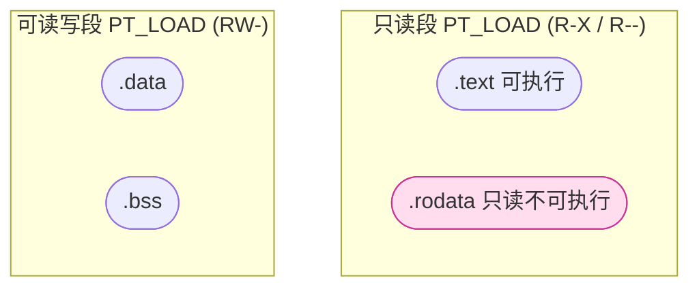

# 详解ELF文件(六).rodata节

.rodata节（Read-Only Data Section）是ELF文件中专门用于存储只读数据的重要节区。它在程序运行时保护关键数据不被意外修改，是程序安全机制的重要组成部分。

## .rodata节基本概念

.rodata节是ELF文件中的一个标准节区，用于存储程序中不需要修改的数据。这些数据在程序编译时就被确定，并且在程序运行期间保持不变。名称"rodata"是"read-only data"的缩写，直接描述了该节区的核心属性。

## 节头属性

.rodata 在节头表中的标志只有 `SHF_ALLOC`、没有 `SHF_WRITE` 也没有 `SHF_EXECINSTR`，这正是"只读数据"的定义（高亮为本节）：

| 节 | sh_type | sh_flags | 占文件空间 |
|---|---|---|---|
| .text | SHT_PROGBITS | SHF_ALLOC \| SHF_EXECINSTR (AX) | 是 |
| **.rodata** | **SHT_PROGBITS** | **SHF_ALLOC (A)** | **是** |
| .data | SHT_PROGBITS | SHF_ALLOC \| SHF_WRITE (WA) | 是 |
| .bss | SHT_NOBITS | SHF_ALLOC \| SHF_WRITE (WA) | 否 |

注意：与 [[05.text节|.text]] 相比，.rodata **没有** `SHF_EXECINSTR`；与 [[07.data节|.data]] 相比，它**没有** `SHF_WRITE`。这两点缺失共同决定了它"只能读、不能写、不能执行"的内存映射属性。

`sh_addralign` 字段同样适用于 .rodata：字符串常量通常 1 字节对齐，浮点数常量按类型大小对齐（`double` 为 8 字节），整型常量表（如跳转表）通常 4 或 8 字节对齐。

## .rodata节存储的内容

### 1. 字符串常量

程序中定义的字符串字面量，例如：

```c
printf("Hello, World!\n");
char *msg = "This is a constant string";
```

注意：`msg` 指针变量本身存储在 [[07.data节|.data节]]（因为它是可变指针），但指针所指向的字符串数据 `"This is a constant string"` 存储在 .rodata。

### 2. const修饰的全局变量和静态变量

使用const关键字声明的变量，例如：

```c
const int MAX_SIZE = 100;
const double PI = 3.141592653589793;
static const char VERSION[] = "1.0.0";
```

### 3. switch语句的跳转表

编译器为 switch 语句生成的跳转表（jump table）存储在 .rodata 中：

```c
int classify(int x) {
    switch (x) {
        case 0: return 100;
        case 1: return 200;
        case 2: return 300;
        default: return -1;
    }
}
```

当 case 值足够密集时，编译器会生成一张以 case 值为索引的地址表（或偏移表），存储在 .rodata。若表项包含需要重定位的函数指针，则可能转入 `.data.rel.ro`（详见后文）。

### 4. 浮点数常量

```c
double circumference(double r) {
    return 2 * 3.141592653589793 * r;   // 浮点字面量存入 .rodata
}
```

### 5. C++虚函数表（vtable）

在C++程序中，虚函数表（vtable）逻辑上是只读的，但由于包含函数指针等可重定位项，**实际上存储在 `.data.rel.ro` 而非纯 .rodata**（详见后文）。type_info 对象的名称字符串部分则在 .rodata。

### 6. 复合字面量与常量数组

```c
static const int FIBONACCI[] = {0, 1, 1, 2, 3, 5, 8, 13, 21, 34};
static const char WEEKDAYS[][4] = {"Mon","Tue","Wed","Thu","Fri","Sat","Sun"};
```

## .rodata节的内存属性

### 1. 只读属性

.rodata节在内存中被映射为只读区域，任何试图修改.rodata节中数据的操作都会导致段错误（segmentation fault）。

### 2. 共享属性

在多个进程运行同一个程序时，.rodata节通常可以被共享，因为它是只读的，不会被修改。内核将 .rodata 所在的 `PT_LOAD` 段以 `MAP_SHARED`（或多进程共享同一物理页）方式映射，多个进程的虚拟地址映射到同一物理页框，节省内存。

### 3. 执行属性

.rodata节通常不具有执行权限，只包含数据而非代码。

## .rodata节的安全特性

### 1. 数据保护

通过将常量数据存储在只读区域，防止程序意外修改这些数据，提高程序的稳定性。

### 2. 防止缓冲区溢出攻击

只读属性使得攻击者难以通过缓冲区溢出等方式修改关键数据（如函数指针表、错误码字符串等）。

### 3. 内存优化

多个进程可以共享.rodata节的内容，节省系统内存。

## .rodata节在执行视图中的位置

在可执行文件的执行视图中，.rodata节通常与 [[05.text节|.text节]] 一起被合并到一个只读段中。这是因为它们都具有只读属性，可以被映射到相同的内存区域。

典型的内存布局：

```
低地址
+------------------+
|     .text        |  只读可执行
+------------------+
|     .rodata      |  只读
+------------------+
|     .data        |  可读写
+------------------+
|     .bss         |  可读写（初始为0）
+------------------+
高地址
```

需要注意的是，某些链接器（如 GNU ld 默认配置）会将 .text 与 .rodata 放入**同一个** `PT_LOAD` 段（`p_flags = PF_R | PF_X`），而另一些配置（如 `-z separate-code`）会将 .rodata 放入独立的只读段（`p_flags = PF_R`），从而避免 .rodata 具有执行权限（更严格的安全策略）。

## 结构图示

.rodata 与 .text 同属只读段，但**没有** `EXECINSTR` 标志（不可执行），这是它与 .text 的关键差异：



## .rodata.*子节：编译器生成的细分节

开启 `-fmerge-constants`（GCC 默认启用）后，编译器会将 .rodata 进一步细分为多个子节，方便链接器做常量合并（merging）：

### .rodata.str*：字符串常量子节

命名格式为 `.rodata.strN.M`，其中 `N` 是字符宽度（字节），`M` 是对齐字节数：

| 子节名 | 含义 |
|---|---|
| `.rodata.str1.1` | 单字节字符（`char`）字符串，1 字节对齐 |
| `.rodata.str1.8` | 单字节字符（`char`）字符串，8 字节对齐 |
| `.rodata.str2.2` | 双字节字符（`wchar_t` on Windows）字符串 |
| `.rodata.str4.4` | 四字节字符（UTF-32）字符串 |

这些子节带有 `SHF_MERGE | SHF_STRINGS` 标志，使链接器可以**跨编译单元合并相同的字符串**（甚至合并后缀：`"hello"` 可以是 `"say hello"` 的后缀，只存一份）。

### .rodata.cst*：数值常量子节

命名格式为 `.rodata.cstN`，`N` 是常量大小（字节）：

| 子节名 | 含义 |
|---|---|
| `.rodata.cst4` | 4 字节常量（如 `float`，`int32`）|
| `.rodata.cst8` | 8 字节常量（如 `double`，`int64`）|
| `.rodata.cst16` | 16 字节常量（如 128 位向量常量）|
| `.rodata.cst32` | 32 字节常量（如 256 位 AVX 向量常量）|

这些子节带有 `SHF_MERGE` 标志，链接器可合并内容相同的常量，避免重复存储。

```bash
# 查看目标文件中的 .rodata.* 子节（代表性，非本机实跑）
$ readelf -S foo.o | grep rodata
  [ 4] .rodata.str1.1    PROGBITS   00000000 000080 00000e 01 AMS  0   0  1
  [ 6] .rodata.cst8      PROGBITS   00000000 000090 000008 08  AM  0   0  8
```

`Flg` 列的 `M`=SHF_MERGE、`S`=SHF_STRINGS。

### 链接器如何合并这些子节

GNU ld 的默认链接脚本将所有 .rodata.* 归并入输出 .rodata：

```ld
/* GNU ld 默认链接脚本片段（节选） */
.rodata         : { *(.rodata .rodata.* .gnu.linkonce.r.*) }
```

LLD 直接在代码中处理后缀剥离（strip suffix），效果相同。

## 字符串合并（-fmerge-constants）深度解析

字符串合并是减小二进制大小的重要优化。

### GCC 的后缀合并

GCC 启用 `-fmerge-constants` 后，能检测字符串之间的后缀关系：

```c
// 两个字符串
const char *a = "say hello";  // "say hello\0"
const char *b = "hello";      // "hello\0"
```

GCC 只在 .rodata 中存储 `"say hello\0"` 一份，让 `b` 指向其中 `"hello"` 的起始位置（偏移 4），**节省 6 字节**。Clang 默认不做后缀合并，两个字符串独立存储。

### 合并的限制

- 跨动态库（`.so`）的合并不适用，每个 DSO 独立维护自己的 .rodata
- 含 NUL 字节的二进制数据不应作为字符串合并
- 使用 `-fno-merge-constants` 可完全禁用合并（调试或某些嵌入式场景）

## 跳转表（Jump Table）详解

`switch` 语句是 .rodata 中跳转表的最常见来源。

### 密集型 switch：地址跳转表

当 case 值连续或密集时，编译器生成以 case 偏移量为索引的地址表（或相对偏移表），存储在 .rodata：

```c
// 示例 C 代码
void dispatch(int op) {
    switch (op) {
        case 0: do_add(); break;
        case 1: do_sub(); break;
        case 2: do_mul(); break;
    }
}
```

```text
# 示例反汇编输出（代表性，非本机实跑）
dispatch:
    cmpl   $2, %edi
    ja     .Ldefault           # op > 2 跳转到 default
    leaq   .Ljumptable(%rip), %rax
    movslq (%rax,%rdi,4), %rcx  # 读取 .rodata 中的偏移量
    addq   %rax, %rcx
    jmpq   *%rcx               # 间接跳转

.section .rodata
.Ljumptable:
    .long .Lcase0 - .Ljumptable  # 相对偏移，避免重定位
    .long .Lcase1 - .Ljumptable
    .long .Lcase2 - .Ljumptable
```

注意：现代编译器倾向于存储**相对偏移**（`int32` 而非指针）以避免重定位需求，使跳转表可以留在纯 .rodata（无需 .data.rel.ro）。

### 稀疏型 switch：二分查找或 if-else 链

当 case 值非常稀疏时，编译器通常生成二分查找树（一系列比较跳转），不产生 .rodata 跳转表。

## .data.rel.ro：只读但需要重定位的数据

这是 .rodata 的近亲，理解它们的界线对于 C++ 程序分析至关重要。

### 定义

`.data.rel.ro`（Read-Only after Relocation）节存储**逻辑上只读但在加载时需要动态链接器填写地址的数据**。这类数据在加载期短暂可写，待所有重定位项处理完毕后，RELRO 机制将其设为只读。

### 典型内容

| 数据类型 | 原因 |
|---|---|
| C++ vtable | 包含虚函数指针，需重定位到函数实际地址 |
| C++ type_info 对象 | 包含类型名称指针和基类指针 |
| 含绝对地址的跳转表 | 使用绝对函数地址的 switch 表 |
| 函数指针常量数组 | `static const void (*table[])(void) = {f1, f2, f3};` |

### 与纯 .rodata 的对比

```text
# 示例：用 nm 查看 vtable 的位置（代表性，非本机实跑）
$ nm --demangle a.out | grep vtable
0000000000003d68 V vtable for Base      <- 在 .data.rel.ro
0000000000003d88 V vtable for Derived   <- 在 .data.rel.ro

$ readelf -S a.out | grep -E 'rodata|rel\.ro'
  [17] .rodata           PROGBITS   ... A    <- 纯只读，无重定位
  [24] .data.rel.ro      PROGBITS   ... WA   <- 加载时可写，RELRO 后只读
```

### RELRO 保护 .data.rel.ro

Full RELRO（`-z relro -z now`）在动态链接完成后将 `.data.rel.ro` 所在的页 `mprotect` 为 `PROT_READ`，阻止攻击者覆写 vtable 指针来劫持虚函数调用。

## .rodata节与其他节的关系

### 1. 与.text节的关系

- [[05.text节|.text节]]存储可执行代码
- .rodata节存储只读数据
- 在执行视图中，它们通常被合并到同一个只读段中

### 2. 与.data节的关系

- [[07.data节|.data节]]存储可读写的数据
- .rodata节存储只读数据
- 它们在内存中被映射到不同的段，具有不同的访问权限

### 3. 与.bss节的关系

- [[08.bss节|.bss节]]存储未初始化的数据
- .rodata节存储已初始化的只读数据
- 两者在内存中具有完全不同的属性

### 4. 与 .data.rel.ro 的关系

如上所述，.data.rel.ro 是 .rodata 的"可重定位版本"，存储逻辑只读但需动态重定位的数据（vtable 等）。

## 实战：分析.rodata节

### 1. readelf：查看只读数据内容

```bash
readelf -S a.out                  # 确认 .rodata 的位置（Flg 仅 A）
readelf -x .rodata a.out          # 以十六进制+ASCII 显示 .rodata 内容
readelf -p .rodata a.out          # 以字符串形式显示 .rodata 内容
```

```text
# 示例输出（代表性，非本机实跑）
$ readelf -x .rodata a.out
Hex dump of section '.rodata':
  0x00002000 01000200 48656c6c 6f2c2057 6f726c64 ....Hello, World
  0x00002010 2100                                !.
```

右侧 ASCII 区清晰可见字符串常量 `Hello, World!`，这是 .rodata 最典型的内容。

### 2. objdump：显示节内容与反汇编对比

```bash
objdump -s -j .rodata a.out       # 只显示 .rodata 节的原始内容
objdump -d a.out                  # 反汇编，从中可以看到 .text 如何引用 .rodata
```

```text
# 示例输出（代表性，非本机实跑）
$ objdump -d a.out | grep -A5 'lea'
    1155:  48 8d 35 a4 0e 00 00   lea    0xea4(%rip),%rsi   # 2000 <.rodata>
```

`lea 0xea4(%rip), %rsi` 是 x86-64 的 RIP 相对寻址，将 .rodata 中字符串的运行时地址加载到 `%rsi` 寄存器，传给 `printf`。

### 3. 提取并查看 .rodata 二进制

```bash
objcopy -O binary --only-section=.rodata a.out rodata.bin
hexdump -C rodata.bin
strings rodata.bin               # 提取所有可打印字符串
```

### 4. 查看字符串常量子节（目标文件）

```bash
readelf -S foo.o | grep rodata   # 查看编译后目标文件中的 .rodata.* 子节
objdump -s foo.o                 # 显示所有节的原始内容
```

### 5. 查看 .data.rel.ro（C++ vtable）

```bash
readelf -S a.out | grep rel.ro   # 确认 .data.rel.ro 的存在
nm --demangle a.out | grep vtable  # 查看 vtable 符号及位置
objdump -s -j .data.rel.ro a.out   # 查看 vtable 内容（函数指针值）
```

## .rodata节在不同阶段的作用

### 1. 编译阶段

- 编译器识别程序中的常量数据（字符串字面量、const 全局变量、字面量常量）
- 根据类型和大小将它们分配到 `.rodata.str*`、`.rodata.cst*` 或普通 `.rodata` 子节
- 对字符串子节设置 `SHF_MERGE | SHF_STRINGS` 标志，允许后续合并

### 2. 链接阶段

- 链接器根据 `SHF_MERGE`/`SHF_STRINGS` 标志对字符串和常量做去重合并
- 将所有 `.rodata.*` 输入节归并到输出 `.rodata` 节
- 分配虚拟地址，确保对齐要求满足
- 将 .rodata 纳入只读 `PT_LOAD` 段（`p_flags = PF_R` 或 `PF_R | PF_X`）

### 3. 加载阶段

- 加载器将.rodata节映射到只读内存区域（`PROT_READ`，不含 `PROT_WRITE` 和 `PROT_EXEC`）
- .data.rel.ro 先以 `PROT_READ | PROT_WRITE` 映射，动态链接器填写重定位后，RELRO 机制将其改为 `PROT_READ`

### 4. 执行阶段

- 程序可以读取.rodata节中的数据
- 任何修改操作都会导致段错误（SIGSEGV）

## .rodata节的优化

### 1. 字符串合并（-fmerge-constants）

如前所述，GCC 默认启用，可在编译单元内和链接时合并相同或重叠的字符串常量。

### 2. 数据对齐

.rodata节中的数据会按照处理器的要求进行对齐，提高访问效率：
- 字符串通常不需要特殊对齐（`sh_addralign = 1`）
- 浮点常量按类型大小对齐（`double` 为 8）
- SIMD 常量需要 16/32/64 字节对齐

### 3. 链接时常量传播（LTO）

启用链接时优化（`-flto`）时，编译器可以在链接阶段看到所有编译单元的常量，进行更激进的合并和内联，减少 .rodata 引用次数。

## .rodata节的特殊情况

### 1. 嵌入式系统：XIP（Execute-In-Place）

在嵌入式系统（如 ARM Cortex-M）中，Flash（ROM）通常直接映射到地址空间。此时 .rodata 和 .text 可以直接在 Flash 中访问，无需复制到 RAM，称为 XIP（Execute In Place）。链接脚本中 .rodata 的 VMA 和 LMA 相同，均指向 Flash 地址范围。

### 2. 编译器差异

不同编译器对常量的处理略有差异：
- GCC：默认 `-fmerge-constants`，支持后缀字符串合并
- Clang：默认 `-fmerge-all-constants`（更激进），但不支持后缀合并
- MSVC：将字符串常量放入 `.rdata` 节（PE 格式的等价物）

### 3. 调试信息

调试版本可能在 `.rodata` 中包含文件名字符串（用于 `__FILE__` 宏）、函数名字符串（用于 `__func__` 宏）等额外信息。

## 实际示例

考虑以下C代码：

```c
#include <stdio.h>

const int global_const = 42;
const char *message = "Hello, World!";
static const double pi = 3.14159;

int main() {
    const int local_const = 100;
    printf("%s\n", message);
    printf("Global const: %d, Local const: %d\n", global_const, local_const);
    return 0;
}
```

在这个例子中：

- `"Hello, World!"` 字符串常量存储在 .rodata（子节 `.rodata.str1.1`）
- `global_const` 和 `pi` 存储在 .rodata（子节 `.rodata.cst4` 和 `.rodata.cst8`）
- `message` 指针变量本身存储在 [[07.data节|.data节]]（因为它是可变指针，只是恰好指向 .rodata）
- `local_const` 存储在栈上（局部变量）

## 总结

.rodata节是ELF文件中用于存储只读数据的重要节区。它保护程序中的常量数据不被意外修改，提高程序的安全性和稳定性。通过将只读数据与可读写数据分离，操作系统可以为不同的数据设置适当的内存保护属性，这是现代程序安全机制的重要组成部分。

编译器通过 `.rodata.str*`（字符串）和 `.rodata.cst*`（数值常量）子节进行精细化分类，配合链接器的 `SHF_MERGE`/`SHF_STRINGS` 合并机制，可以显著减小二进制大小。对于含重定位项的逻辑只读数据（vtable、函数指针表），则使用 `.data.rel.ro` 节，配合 RELRO 机制在运行时设为只读，兼顾灵活性与安全性。

## 相关阅读

- **前置概念**：[[04.节区]]、[[34.节头表]]
- **同处只读段**：[[05.text节]]
- **可写数据对比**：[[07.data节]]、[[08.bss节]]
- 上一篇：[[05.text节]] ｜ 下一篇：[[07.data节]]
