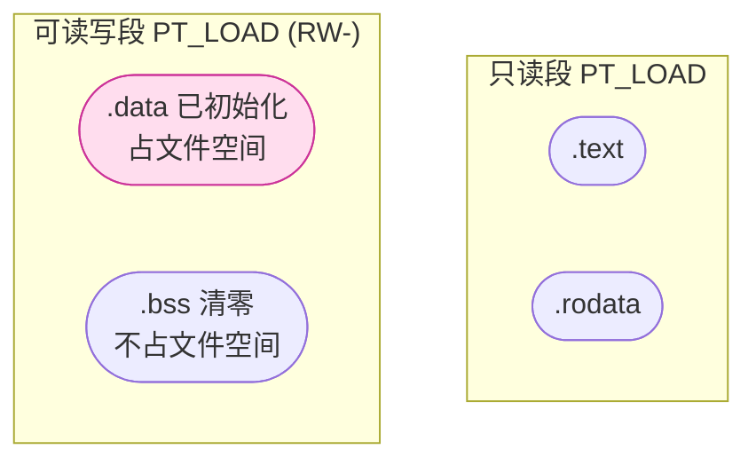

# 详解ELF文件(七).data节

.data节是ELF（Executable and Linkable Format）文件中的一个重要节区，专门用于存储已初始化的全局变量和静态变量。它是程序数据存储的核心部分之一。

## .data节基本概念

.data节是ELF文件中用于存储程序中已显式初始化的全局变量和静态变量的节区。这些变量在程序编译时就被赋予了初始值，并且这些初始值会**完整地存储在可执行文件中**——这是 .data 节与 .bss 节最本质的区别。

## 节头属性

.data 的标志为 `SHF_ALLOC | SHF_WRITE`、类型为 `SHT_PROGBITS`（占文件空间），与 .bss 的 `SHT_NOBITS` 形成对照（高亮为本节）：

| 节 | sh_type | sh_flags | 占文件空间 |
|---|---|---|---|
| .text | SHT_PROGBITS | SHF_ALLOC \| SHF_EXECINSTR (AX) | 是 |
| .rodata | SHT_PROGBITS | SHF_ALLOC (A) | 是 |
| **.data** | **SHT_PROGBITS** | **SHF_ALLOC \| SHF_WRITE (WA)** | **是** |
| .bss | SHT_NOBITS | SHF_ALLOC \| SHF_WRITE (WA) | 否 |

关键点：`SHT_PROGBITS` 类型意味着节的内容直接存储在 ELF 文件中（由 `sh_offset` 和 `sh_size` 定位）；`SHF_WRITE` 标志使该节在加载后落入可读写段（`PT_LOAD` 中 `p_flags = PF_R | PF_W`）。

`sh_addralign` 对 .data 同样重要：结构体中的字段通常需要自然对齐（`int` 4字节、`double` 8字节），链接器会保证 .data 节的起始地址满足其中最大对齐要求。

## .data节存储的内容

### 1. 已初始化的全局变量

在程序中定义并初始化的全局变量，例如：

```c
int global_var = 42;
char message[] = "Hello, World!";
double pi = 3.141592653589793;
```

注意：`message` 是字符数组（可修改），内容存储在 .data；若写 `const char *message = "..."` 则指针在 .data，字符串内容在 [[06.rodata节|.rodata]]。

### 2. 已初始化的静态变量

包括文件作用域的静态变量和函数内的静态变量，例如：

```c
static int file_static = 100;
void function() {
    static int func_static = 200;
}
```

### 3. 非零初始化的数组和结构体

```c
int numbers[5] = {1, 2, 3, 4, 5};
struct Person {
    char name[20];
    int age;
} person = {"张三", 25};
```

### 4. 函数指针

```c
typedef void (*handler_t)(int);
handler_t signal_handler = my_handler;  // 全局函数指针初始化为非NULL
```

## .data节的内存属性

### 1. 读写属性

.data节在内存中被映射为可读可写的区域，程序在运行时可以修改这些变量的值。

### 2. 初始化特性

.data节中的数据在程序启动时由操作系统从可执行文件中加载到内存，确保变量具有正确的初始值。

### 3. 生命周期

.data节中的变量具有与程序相同的生命周期，从程序启动到程序结束一直存在。

## 初始值如何存储在文件中

这是 .data 节最核心的机制：**初始值以二进制形式直接写入 ELF 文件**，存放在 `sh_offset` 指定的文件偏移处，占用 `sh_size` 字节的磁盘空间。

### 文件中的字节布局

```c
// 源码
int a = 42;        // 0x0000002A，小端存储 = 2A 00 00 00
int b = 256;       // 0x00000100，小端存储 = 00 01 00 00
double d = 1.0;    // IEEE 754: 3F F0 00 00 00 00 00 00（大端），小端反转
```

```text
# 示例输出（代表性，非本机实跑）
$ readelf -x .data a.out
Hex dump of section '.data':
  0x00004000 2a000000 00010000 0000000000f03f  *...........?.
```

`2a000000` → `int a = 42`；`00010000` → `int b = 256`；`000000000000f03f` → `double d = 1.0`（little-endian IEEE 754）。

### 加载器如何将文件字节映射到内存

内核在 `execve()` 时调用 `mmap()`，将包含 .data 的 `PT_LOAD` 段从文件映射到进程地址空间：

```text
mmap(p_vaddr, p_filesz, PROT_READ|PROT_WRITE, MAP_PRIVATE|MAP_FIXED, fd, p_offset)
```

关键参数含义：
- `MAP_PRIVATE`：私有映射，对内存的修改不会写回文件（写时复制，COW）
- `p_vaddr`：变量在运行时的虚拟地址（对应 ELF 中符号的地址值）
- `p_filesz`：从文件中读取的字节数（等于 .data 节的大小）
- `p_offset`：.data 段在文件中的起始偏移

## 写时复制（COW）机制

### COW 的基本原理

当操作系统将 .data 节映射为 `MAP_PRIVATE` 时，初始阶段多个进程（如 `fork()` 后的父子进程）**共享同一套物理页框**，这些页标记为只读（COW 保护）。当任意一个进程尝试写入时：

1. MMU 检测到写操作触发缺页异常（page fault，#PF）
2. 内核在页错误处理中为写操作进程分配**新的物理页**
3. 将原页内容复制到新页，修改该进程的页表项指向新页
4. 将新页的权限设为可读写，允许写操作继续执行
5. 原物理页保持不变，其他共享进程继续使用

### COW 对 .data 的意义

```text
进程A fork进程B 后：
  进程A .data 页 ──→ 物理页X（data初始值）
  进程B .data 页 ──→ 物理页X（共享，COW保护）

进程B 修改 global_var：
  触发 #PF → 内核分配物理页Y → 复制X→Y → 进程B.data 页 → 物理页Y
  进程A .data 页仍指向物理页X（不受影响）
```

这使得 `fork()` 极其廉价：即使子进程的 .data 很大，只有实际被修改的页才会发生物理复制。

### 与 .rodata 的对比

.rodata 因为不可写，不会触发 COW，所有进程永远共享同一物理页，效率更高。这是尽量使用 `const` 的重要底层理由之一。

## .data节与.bss节的区别

### 1. 存储内容差异

- .data节：存储已初始化且初始值非零的变量
- [[08.bss节|.bss节]]：存储未初始化或初始化为零的变量

### 2. 文件空间占用

- .data节：在可执行文件中占用实际的磁盘空间，因为需要存储初始值
- .bss节：在可执行文件中只占用元数据空间，记录需要分配的内存大小

### 3. 加载过程

- .data节：加载时需要从文件中读取初始值到内存
- .bss节：加载时只需要分配内存并清零

## .data节在执行视图中的位置

在可执行文件的执行视图中，.data节通常与 [[08.bss节|.bss节]] 一起被合并到一个可读写段中。这是因为它们都具有可读写的属性。

典型的内存布局：

```
低地址
+------------------+
|     .text        |  只读可执行
+------------------+
|     .rodata      |  只读
+------------------+
|     .data        |  可读写（已初始化）
+------------------+
|     .bss         |  可读写（初始为0）
+------------------+
高地址
```

## 结构图示

.data 与 .bss 同处可读写段，区别在于 .data **占用文件空间**（存初始值），而 .bss 不占（加载时清零）：



## PT_LOAD 段的 p_filesz 与 p_memsz

可读写 `PT_LOAD` 段的程序头字段体现了 .data 与 .bss 的本质区别：

```text
# 示例输出（代表性，非本机实跑）
$ readelf -l a.out | grep -A5 'LOAD.*RW'
  LOAD  0x002e10  0x0000000000003e10  0x0000000000003e10
        0x000220  0x000228  RW  0x1000
        ^FileSiz  ^MemSiz
```

- `FileSiz (p_filesz) = 0x220`：从文件中 mmap 的字节数，对应 .data 节大小
- `MemSiz (p_memsz) = 0x228`：在内存中占用的字节数，多出的 `0x8` 即 .bss 节大小

加载器将 `[p_vaddr + p_filesz, p_vaddr + p_memsz)` 这段额外内存清零，这就是 .bss 变量的零初始化来源。

## .data节的内存管理

### 1. 内存分配

在程序加载时，操作系统会为.data节分配足够的内存空间，并将文件中的初始值复制到该内存区域（通过 `mmap` 私有映射实现）。

### 2. 访问权限

.data节具有读写权限（`PROT_READ | PROT_WRITE`），程序可以随时读取和修改其中的数据。

### 3. 共享特性

与 [[06.rodata节|.rodata节]] 不同，.data节不能在多个进程间简单共享，因为每个进程都可能修改其中的数据（实际由写时复制 COW 机制处理）。

## .sdata 与小数据区

在某些架构（MIPS、PowerPC、RISC-V）上，链接器支持"小数据区"（Small Data Area，SDA）优化：

### 原理

这些架构设有专用的"全局数据指针"寄存器（如 MIPS 的 `$gp`、PowerPC 的 `r2`），用于通过 16 位有符号偏移直接寻址靠近该指针的数据，从而用 **1 条指令**访问小数据，而无需 2 条指令（先加载高位地址，再加低位偏移）。

### 节名称

| 节名 | 内容 |
|---|---|
| `.sdata` | 已初始化的"小"全局/静态变量（可写，类比 .data）|
| `.sbss` | 未初始化的"小"全局/静态变量（可写，类比 .bss）|
| `.srodata` | 只读的"小"全局/静态常量（只读，类比 .rodata）|

### 控制阈值

GCC 通过 `-G N` 选项控制"小于等于 N 字节的对象放入小数据区"，默认值因目标平台而异（MIPS 默认 8）：

```bash
mips-linux-gnu-gcc -G 8 -o a.out foo.c   # 8字节以下对象放入 .sdata/.sbss
mips-linux-gnu-gcc -G 0 -o a.out foo.c   # 禁用小数据区
```

x86-64 没有全局指针寄存器，因此**不使用** .sdata，所有数据统一放入 .data。

## 实战：分析.data节

### 1. readelf：查看已初始化数据

```bash
readelf -S a.out                # 确认 .data 的位置（Flg = WA）
readelf -x .data a.out          # 以十六进制显示 .data 的初始值
readelf -l a.out                # 查看 .data 所在的 PT_LOAD 段，对比 FileSiz 和 MemSiz
```

```text
# 示例输出（代表性，非本机实跑）
$ readelf -x .data a.out
Hex dump of section '.data':
  0x00004000 2a000000 00000000 0a000000 00000000 *...............
```

开头的 `2a000000` 正是小端序的整型初始值 `42`（0x2a）——这就是 .data "把初始值写进文件"的直接体现。

### 2. size：对比各节大小

```bash
size a.out
```

```text
# 示例输出（代表性）
   text    data     bss     dec     hex filename
   1591     600       8    2199     897 a.out
```

`data` 列计入文件体积，而 `bss` 不占文件、只记内存大小。

### 3. objdump：显示节内容

```bash
objdump -s -j .data a.out
```

```text
# 示例输出（代表性，非本机实跑）
Contents of section .data:
 4000 2a000000 00000000 0a000000 00000000  *...............
```

### 4. nm：查看 .data 中的变量符号

```bash
nm a.out | grep ' D '      # 大写 D：全局已初始化变量（.data）
nm a.out | grep ' d '      # 小写 d：局部/静态已初始化变量（.data）
```

```text
# 示例输出（代表性，非本机实跑）
0000000000004000 D global_var
0000000000004008 d file_static
```

符号类型字母说明：`D` = 全局 .data 变量、`d` = 静态 .data 变量、`B` = 全局 .bss 变量、`R` = 全局 .rodata 常量。

### 5. 对比添加变量前后的文件大小变化

```bash
# 添加一个 1MB 的已初始化全局数组，文件会增大 1MB
echo 'int big[262144] = {1};' > big.c
gcc big.c -o big_data.out
ls -lh big_data.out     # 文件大了约 1MB

# 改成未初始化（.bss），文件不会增大
echo 'int big[262144];' > big.c
gcc big.c -o big_bss.out
ls -lh big_bss.out      # 文件几乎没变化
```

## .data节在不同阶段的作用

### 1. 编译阶段

- 编译器识别程序中已初始化的全局变量和静态变量
- 将这些变量的初始值和相关信息放入.data节
- 零初始化的变量被优化到 [[08.bss节|.bss节]]

### 2. 链接阶段

- 链接器处理.data节的重定位（见 [[12.rela.data节]]）
- 合并不同目标文件中的.data节
- 在 .data 与 .bss 之间填充对齐字节
- 将 .data 纳入可读写 `PT_LOAD` 段

### 3. 加载阶段

- 加载器通过 `mmap(MAP_PRIVATE)` 将 .data 映射为私有可写页
- 初始内容来自 ELF 文件（CoW 惰性复制）
- `.bss` 对应的额外内存（`p_memsz - p_filesz`）被清零

### 4. 执行阶段

- 程序可以读取和修改.data节中的数据
- 变量在整个程序执行期间保持有效

## .data节的优化

### 1. 数据对齐

.data节中的数据会按照处理器的要求进行对齐，提高访问效率。

### 2. 变量重排序

编译器可能会重新排列变量的存储顺序，以减少内存碎片和提高缓存效率。GCC 的 `-fdata-sections` 选项为每个变量生成独立的 `.data.<name>` 子节，配合 `--gc-sections` 可以消除未使用的全局变量。

```bash
gcc -fdata-sections -Wl,--gc-sections -o a.out foo.c
```

### 3. 常量分离

编译器会将真正的常量数据移到 [[06.rodata节|.rodata节]]，减少.data节的大小。将可以设为 `const` 的全局变量改为 `const` 是减小 .data、增大 .rodata 的直接手段，同时还能获得内存共享与 COW 优化的好处。

### 4. LTO（链接时优化）

启用 `-flto` 时，编译器在链接阶段可以看到所有编译单元的全局变量，可能通过内联消除对某些全局变量的需求，从而减小 .data 大小。

## .data 的安全考虑

### 1. 缓冲区溢出防护

由于.data节是可写的，字符数组等可写缓冲区需要防止缓冲区溢出攻击：
- 使用带边界检查的函数（`strncpy` 而非 `strcpy`）
- 启用 FORTIFY_SOURCE（`-D_FORTIFY_SOURCE=2`）自动插入缓冲区大小检查

### 2. 函数指针保护

全局函数指针变量存储在 .data，是常见的攻击目标。若函数指针可以改为 `const`（只初始化一次），应移至 .rodata 或 `.data.rel.ro` 以获得 RELRO 保护。

### 3. 数据执行保护（DEP）

.data 所在的 `PT_LOAD` 段的 `p_flags` 不含 `PF_X`，保证内核将这些页映射为不可执行（NX 位）。这是防止攻击者在 .data 中注入并执行 shellcode 的硬件级保护。

## 实际示例

考虑以下C代码：

```c
#include <stdio.h>

// 已初始化的全局变量 - 存储在.data节
int global_initialized = 100;
char greeting[] = "Hello, World!";
double pi = 3.14159;

// 未初始化的全局变量 - 存储在.bss节
int global_uninitialized;

// 已初始化的静态变量 - 存储在.data节
static int static_initialized = 200;

void function() {
    // 已初始化的局部静态变量 - 存储在.data节
    static int local_static = 300;

    // 普通局部变量 - 存储在栈上，不在.data节
    int local_var = 400;

    printf("global_initialized: %d\n", global_initialized);
    printf("static_initialized: %d\n", static_initialized);
    printf("local_static: %d\n", local_static);
}

int main() {
    global_initialized = 500;
    function();
    return 0;
}
```

在这个例子中：

- `global_initialized`、`greeting`、`pi`、`static_initialized`和`local_static`存储在.data节
- `global_uninitialized`存储在 [[08.bss节|.bss节]]
- `local_var`存储在栈上，不在任何节中

## 32位与64位差异

| 特性 | 32位（i386）| 64位（x86-64）|
|---|---|---|
| 数据指针大小 | 4 字节 | 8 字节 |
| 默认数据段加载基址 | `0x0804a000` 附近（非PIE）| `0x601000` 附近（非PIE）|
| 结构体对齐 | `double` 可以 4 字节对齐（i386 ABI）| `double` 8 字节对齐（x86-64 ABI）|
| 函数指针大小 | 4 字节 | 8 字节，全局函数指针在 .data 占用更多空间 |

## 总结

.data节是ELF文件中用于存储已初始化全局变量和静态变量的重要节区。它与.text节、.rodata节和.bss节共同构成了程序的内存映像。理解.data节的结构和作用对于程序分析、调试和优化都具有重要意义。

其核心特征：初始值以二进制原样写入 ELF 文件（`SHT_PROGBITS`），加载时通过 `mmap(MAP_PRIVATE)` 映射为私有可写页，依赖写时复制（COW）机制在多进程间高效共享物理内存直到发生写操作。

## 相关阅读

- **前置概念**：[[04.节区]]、[[34.节头表]]
- **未初始化数据对比**：[[08.bss节]]
- **只读数据对比**：[[06.rodata节]]
- **数据的重定位**：[[12.rela.data节]]、[[11.rel.data节]]
- 上一篇：[[06.rodata节]] ｜ 下一篇：[[08.bss节]]
