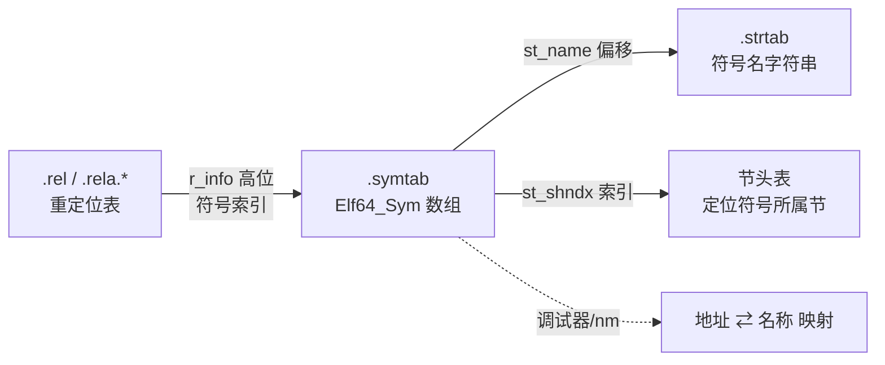

# 详解ELF文件(九).symtab节

.symtab节（符号表节）是ELF（Executable and Linkable Format）文件中一个关键的数据结构，用于存储程序中定义和引用的符号信息。它是链接器和调试器工作的重要依据。

## .symtab节基本概念

.symtab节是ELF文件中的符号表节，它记录了程序中所有符号的信息，包括函数名、全局变量名、文件名等。每个符号关联着特定的信息，如符号的类型、绑定属性、所在节以及地址等。

可以把符号表想象成程序的"通讯录"：它帮助编译器、链接器和调试器找到程序中各种符号的位置和属性信息。

## .symtab节存储的内容

.symtab节主要包含以下类型的符号信息：

### 1. 函数符号

程序中定义和声明的函数，包括：

- 用户定义的函数
- 库函数的声明
- 入口函数（如main函数）

### 2. 变量符号

程序中的各种变量，包括：

- 全局变量
- 静态变量
- 外部变量声明

### 3. 其他符号

- 文件符号（表示源文件本身）
- 节符号（表示各个节区）
- 特殊符号（如_start等）

## .symtab节的结构

.symtab节是一个符号表数组，每个表项都是一个符号描述结构体。在64位系统中，这个结构体定义如下：

```c
typedef struct {
    Elf64_Word    st_name;    // 符号名称在字符串表中的索引
    unsigned char st_info;    // 符号类型和绑定信息
    unsigned char st_other;   // 符号的可见性
    Elf64_Half    st_shndx;   // 符号所在节区的索引
    Elf64_Addr    st_value;   // 符号的值（地址或偏移量）
    Elf64_Xword   st_size;    // 符号的大小
} Elf64_Sym;
```

每个表项在 64 位下占 **24 字节**，字节布局如下：

```
偏移   字段        大小   说明
0      st_name     4      → .strtab 中的字符串偏移
4      st_info     1      → 高4位=绑定(Bind) | 低4位=类型(Type)
5      st_other    1      → 可见性(Visibility)，低2位有效
6      st_shndx    2      → 所属节索引（SHN_UNDEF/SHN_ABS/SHN_COMMON…）
8      st_value    8      → 符号的值或地址
16     st_size     8      → 符号大小
                  ────
                   24 字节
```

> **32/64 位差异（易踩坑）**：`Elf32_Sym` 不只是字段变窄，**字段顺序也不同**——32 位是 `name, value, size, info, other, shndx`，而 64 位把 `value/size` 放到了末尾：
>
> ```c
> typedef struct {
>     Elf32_Word    st_name;   // 偏移 0，4字节
>     Elf32_Addr    st_value;  // 偏移 4，4字节
>     Elf32_Word    st_size;   // 偏移 8，4字节
>     unsigned char st_info;   // 偏移12，1字节
>     unsigned char st_other;  // 偏移13，1字节
>     Elf32_Half    st_shndx;  // 偏移14，2字节
> } Elf32_Sym;                 // 共 16 字节
> ```
>
> 为何 64 位把单字节的 `st_info`/`st_other` 提前？这是为了避免在 4 字节 `st_name` 之后直接跟 8 字节的 `st_value` 时产生填充字节：`name(4)+info(1)+other(1)+shndx(2)=8` 字节，使 `st_value` 的偏移恰好对齐到 8 字节边界，整体零填充。

### 1. st_name字段

该字段存储符号名称在.strtab节（字符串表节）中的索引值，而不是直接存储字符串。索引值为 0 时表示符号没有名字（如第 0 号占位符号）。

> 注意：.symtab 的 st_name 索引的是 `.strtab`，而 .dynsym 的 st_name 索引的是 `.dynstr`，二者不可混淆。

### 2. st_info字段

该字段把**绑定信息**（高 4 位）和**类型信息**（低 4 位）打包进一个字节，通过以下宏拆解/组合：

```c
/* ELF32 与 ELF64 的宏定义完全相同 */
#define ELF32_ST_BIND(info)        ((info) >> 4)
#define ELF32_ST_TYPE(info)        ((info) & 0xf)
#define ELF32_ST_INFO(bind, type)  (((bind) << 4) + ((type) & 0xf))

#define ELF64_ST_BIND(info)        ((info) >> 4)
#define ELF64_ST_TYPE(info)        ((info) & 0xf)
#define ELF64_ST_INFO(bind, type)  (((bind) << 4) + ((type) & 0xf))
```

#### 绑定（Bind）完整取值

绑定决定了符号在链接时的可见范围与优先级：

| 值 | 宏 | 含义 |
|---|---|---|
| 0 | STB_LOCAL | 本地符号，仅本目标文件可见，不参与跨文件符号解析 |
| 1 | STB_GLOBAL | 全局符号，跨文件可见，是链接时符号解析的主要对象 |
| 2 | STB_WEAK | 弱符号，可被同名强符号覆盖；若无强符号则使用弱定义 |
| 10 | STB_GNU_UNIQUE | GNU 扩展：确保整个进程地址空间中该符号只有一个实例，多用于 C++ 模板静态成员 |
| 10–12 | STB_LOOS–STB_HIOS | 操作系统特定范围 |
| 13–15 | STB_LOPROC–STB_HIPROC | 处理器特定范围 |

> **STB_GNU_UNIQUE** 是 GNU 工具链为解决 C++ 跨 DSO（Dynamic Shared Object）模板实例化重复问题而引入的扩展，值为 10（与 `STB_LOOS` 重合）。动态链接器确保进程中该名字只绑定到一个定义，避免 C++ 静态局部变量、type_info 对象在多个 DSO 中各有一份的问题。

#### 类型（Type）完整取值

| 值 | 宏 | 含义 |
|---|---|---|
| 0 | STT_NOTYPE | 类型未指定，常见于外部引用或汇编定义的符号 |
| 1 | STT_OBJECT | 数据对象（变量、数组、全局结构体等） |
| 2 | STT_FUNC | 函数或可执行代码；链接器会为共享库中的 STT_FUNC 自动生成 PLT 条目 |
| 3 | STT_SECTION | 节符号，通常绑定为 STB_LOCAL，用于重定位引用所属节 |
| 4 | STT_FILE | 源文件名符号；绑定为 STB_LOCAL，st_shndx = SHN_ABS，排在其他本地符号之前 |
| 5 | STT_COMMON | 未初始化公共块，等价于 SHN_COMMON 中的符号 |
| 6 | STT_TLS | 线程本地存储（Thread-Local Storage）实体；st_value 存的是 TLS 偏移量，不是虚拟地址 |
| 10 | STT_GNU_IFUNC | GNU 间接函数（Indirect Function）：运行时由动态链接器调用此符号指向的函数以获取实际实现地址，用于 CPU 特性分发（如 glibc 的 `memcpy`） |
| 10–12 | STT_LOOS–STT_HIOS | 操作系统特定范围 |
| 13–15 | STT_LOPROC–STT_HIPROC | 处理器特定范围 |

> **STT_GNU_IFUNC** 的运行机制：链接器把该符号的重定位类型设为 `R_X86_64_IRELATIVE`（或对应平台的等价类型），动态链接器在程序启动时调用该地址处的 resolver 函数，resolver 根据 CPU 能力（如 AVX、SSE4.2 等）返回最优实现的地址，填入 GOT/PLT，后续调用直接跳到最优实现。

### 3. st_other字段

该字段的低 2 位表示符号**可见性**（Visibility），控制动态链接时的导出行为；高 6 位目前保留，应置零。

访问宏：

```c
#define ELF32_ST_VISIBILITY(o)  ((o) & 0x3)
#define ELF64_ST_VISIBILITY(o)  ((o) & 0x3)
```

#### 可见性（Visibility）完整取值

| 值 | 宏 | 含义 |
|---|---|---|
| 0 | STV_DEFAULT | 默认：受绑定属性约束，STB_GLOBAL/STB_WEAK 对外可见且可被抢占 |
| 1 | STV_INTERNAL | 处理器特定含义，限制性最强；实际上等价于 STV_HIDDEN |
| 2 | STV_HIDDEN | 隐藏：名字对其他组件不可见，链接到 .so 或可执行文件时被转为 STB_LOCAL |
| 3 | STV_PROTECTED | 受保护：对外可见，但不可被外部抢占；对本模块内的引用必须解析到本模块定义 |

**可见性约束传播规则（gABI）：**

1. 非 STV_DEFAULT 的可见性应用于符号引用时，意味着该引用的定义必须由当前可执行文件或共享对象内部提供。
2. 若对同一名字的多处引用/定义具有不同的非默认可见性，链接器必须将**最严格**的可见性传播到最终符号。约束由弱到强顺序为：`STV_PROTECTED < STV_HIDDEN < STV_INTERNAL`。

**STV_HIDDEN 对动态导出的影响：**

```c
// 通过 GCC 属性标注，等价于 STV_HIDDEN
__attribute__((visibility("hidden")))
int internal_helper(void) { ... }

// 推荐做法：在编译时用 -fvisibility=hidden 将所有符号默认隐藏，
// 再用 __attribute__((visibility("default"))) 显式导出公共 API
```

### 4. st_shndx字段

该字段表示符号所在的节区索引。几个特殊值很常见：

| 特殊值 | 数值 | 含义 |
|---|---|---|
| SHN_UNDEF | 0 | 未定义：符号在本文件中只有引用没有定义，需在链接时由其他文件解析 |
| SHN_ABS | 0xfff1 | 绝对值：符号值不参与重定位，始终保持不变（如 STT_FILE 符号） |
| SHN_COMMON | 0xfff2 | 公共块：C 语言未初始化全局变量的暂定义，尚未分配存储空间；st_value 表示对齐约束 |
| SHN_XINDEX | 0xffff | 扩展索引：真实节索引超过 0xff00 放不进 2 字节，实际值存于对应的 SHT_SYMTAB_SHNDX 节 |
| SHN_LORESERVE | 0xff00 | 保留区间起点 |

> **SHN_XINDEX 使用场景**：当 ELF 文件节数超过 65280（SHN_LORESERVE）时，`st_shndx` 不够用，需要一个与 .symtab 并行的 `SHT_SYMTAB_SHNDX` 节存储扩展索引。

### 5. st_value字段

该字段表示符号的值，语义随文件类型而不同：

- **可重定位文件（.o）**：
  - 若 `st_shndx != SHN_COMMON`：st_value 是相对于所在节起始的字节偏移
  - 若 `st_shndx == SHN_COMMON`：st_value 表示符号的对齐要求（2 的幂次方），类似 `sh_addralign`
- **可执行文件 / 共享库（.so）**：st_value 是符号的虚拟地址（VA）
- **TLS 符号（STT_TLS）**：st_value 是相对于 TLS 模板块起点的偏移，而非虚拟地址

### 6. st_size字段

该字段表示符号的大小（字节数）：对于函数表示函数代码的长度，对于变量表示变量占用的字节数，未知时为 0。

## 结构图示

符号表是「重定位 → 符号 → 字符串/节」这条解析链的枢纽：



## .symtab节与.strtab节的关系

.symtab节中的符号名称并不直接存储在符号表中，而是存储在.strtab节（字符串表节）中。.symtab节通过st_name字段索引到.strtab节中的具体字符串。

这种设计避免了字符串存储的重复和浪费，提高了空间利用率。

> 注意区分：存符号名的是 **.strtab**，存节名的是 **.shstrtab**（见 [[10.shstrtab节]]），二者是不同的字符串表，别混淆。

### .strtab 符号名字符串表

`.strtab` 是与 `.symtab` 配套的字符串表节，存储所有符号的名称字符串。

#### 节头属性

| 字段 | 值 | 说明 |
|---|---|---|
| `sh_type` | `SHT_STRTAB`（3）| 字符串表类型 |
| `sh_flags` | 0（无 `SHF_ALLOC`）| 运行时不加载到内存，只供链接/调试工具读取 |
| `sh_entsize` | 0 | 变长字符串，无固定条目大小 |
| `sh_link` | 0 | 无关联节 |
| `sh_info` | 0 | 无附加信息 |
| `sh_addralign` | 1 | 字节对齐即可 |

与 `.symtab` 节头的 `sh_link` 字段相对应：`.symtab` 的 `sh_link` 指向本节的节索引，链接器通过此关联关系知道该去哪里查找符号名。

#### `Elf64_Sym.st_name` 指向规则

`st_name` 是一个无符号 32 位整数，表示该符号名在 `.strtab` 节数据中的**字节偏移**（从节起始处算起）：

```
.strtab 节数据（示意）：
偏移  内容
0     \0                  ← 索引 0 始终是空字符串（st_name=0 的符号无名字）
1     a d d \0            ← "add"，st_name=1
5     m a i n \0          ← "main"，st_name=5
10    g l o b a l _ i n i t \0  ← st_name=10
...
```

规范要求：
- 偏移 0 处始终为 `\0`（空字符串）；
- 所有字符串以 `\0` 结尾；
- `st_name = 0` 的符号（如第 0 号占位符号、无名节符号）名字为空串 `""`。

#### 与 `.dynstr` 的结构差异

`.strtab` 和 `.dynstr` 都是 `SHT_STRTAB` 类型，内部编码完全相同（连续 `\0` 分隔的字符串序列），主要差异在于用途和运行时属性：

| 维度 | `.strtab` | `.dynstr` |
|---|---|---|
| 配套符号表 | `.symtab`（`SHT_SYMTAB`）| `.dynsym`（`SHT_DYNSYM`）|
| `sh_flags` | 无 `SHF_ALLOC` | 有 `SHF_ALLOC`（运行时驻内存）|
| 可被 strip 删除 | 是（随 `.symtab` 一起删）| 否（动态链接器必需）|
| 包含的符号名 | 全部符号（含本地、静态、调试用）| 仅动态导出/导入符号名及依赖库名 |
| `DT_STRTAB` 动态标签 | 无 | `.dynamic` 中 `DT_STRTAB` 指向本节运行时地址 |

`.dynstr` 除存储符号名外，还存储 `DT_NEEDED`（依赖库名如 `libc.so.6`）、`DT_RPATH`/`DT_RUNPATH`（搜索路径）、`DT_SONAME`（本库名）等字符串，这些字符串同样通过偏移引用。

#### `readelf -p .strtab` 实战

```bash
# 打印 .strtab 节中的字符串（每行一个，带偏移）
readelf -p .strtab a.out

# 查看节头，确认 sh_type 和大小
readelf -S a.out | grep -E "strtab|dynstr"

# 用 strings 也能快速浏览（但不显示偏移）
strings -a -t d a.out  # -t d 打印十进制偏移

# 十六进制查看原始内容（含 \0 分隔符）
readelf -x .strtab a.out
```

示例输出（代表性，非本机实跑）：

```text
$ readelf -p .strtab elftest.o

String dump of section '.strtab':
  [     1]  elftest.c
  [    11]  msg
  [    15]  global_init
  [    27]  global_bss
  [    38]  add
  [    42]  main
```

左侧方括号内为十进制字节偏移，与对应符号的 `st_name` 字段值完全一致——例如 `msg` 的 `st_name = 11`，意味着从 `.strtab` 第 11 字节开始读到下一个 `\0` 即为 `"msg"`。

## .symtab节与.dynsym节的区别

ELF文件中存在两种符号表：

1. **.symtab节**：静态链接符号表，包含完整的符号信息，主要用于链接和调试
2. **[[15.dynsym节|.dynsym节]]**：动态链接符号表，是.symtab的子集，仅包含需要动态链接的符号

主要区别：

| 对比项 | .symtab | .dynsym |
|---|---|---|
| 符号范围 | 全部符号（本地+全局+静态+调试） | 仅动态链接所需符号（子集） |
| 节标志 | 无 SHF_ALLOC，运行时不驻留内存 | 有 SHF_ALLOC，运行时驻留内存 |
| 对应字符串表 | .strtab | .dynstr |
| 可被 strip 删除 | 是（`strip --strip-debug` 或 `strip -s`） | 否（动态链接器运行时必需） |
| 主要用途 | 静态链接、调试、nm/gdb 等工具 | 动态链接器运行时符号解析、dlsym |
| sh_type | SHT_SYMTAB | SHT_DYNSYM |

> `strip --strip-debug` 仅删 .symtab 与 .strtab，保留 .dynsym；`strip -s` 则同时删除二者（但 .dynsym 仍保留）。

## 符号解析规则与强/弱符号

### 强/弱符号的定义

在 C 中，默认函数和已初始化的全局变量是**强符号（STB_GLOBAL 定义）**；用 `__attribute__((weak))` 标注或声明时默认弱引用的是**弱符号（STB_WEAK）**。

```c
// 强符号：普通函数与已初始化全局变量
int strong_var = 42;
void strong_func(void) { }

// 弱符号：用 weak 属性声明
__attribute__((weak)) int weak_var = 0;
__attribute__((weak)) void weak_func(void) { }
```

### 链接器解析优先级

根据 gABI 规范，链接器处理重名符号的优先级从高到低：

```
优先级 1（最高）：STB_GLOBAL 已定义（st_shndx ≠ SHN_UNDEF、SHN_COMMON）
优先级 2        ：SHN_COMMON（暂定义/公共符号）
优先级 3（最低）：STB_WEAK 已定义
─────────────────
（未参与优先级）  ：SHN_UNDEF（未解析引用）
```

**具体规则：**

1. **强-强冲突**：两个 STB_GLOBAL 同名定义 → 链接器报 `multiple definition` 错误（除非两者均为 SHN_ABS 且值相同）。
2. **强覆盖弱**：同名强定义 + 弱定义 → 使用强定义，弱定义静默忽略，不报错。
3. **多弱共存**：多个 STB_WEAK 同名定义 → 任取一个，不报错（行为由链接器决定，通常取先出现的）。
4. **COMMON 与强定义共存**：COMMON 被强定义覆盖，COMMON 的空间被丢弃。
5. **COMMON 与弱定义共存**：采用 COMMON，弱定义被忽略。
6. **归档库（.a）中的弱符号**：链接器**不会**为满足弱引用而提取归档成员；只有强 STB_GLOBAL 未定义引用才驱动归档成员提取。

### COMMON 符号详解

C 语言中，未初始化全局变量在 GCC 10 之前默认编译成 COMMON 符号（`-fcommon`）：

```c
// foo.c
int common_var;   // COMMON 符号：st_shndx = SHN_COMMON, st_value = 对齐值

// bar.c
int common_var;   // 同名 COMMON 符号：不报重复定义错误！
                  // 链接后取最大的 st_size，对齐取最大值
```

COMMON 符号的关键特性：
- `st_shndx = SHN_COMMON`，`st_info` 通常为 `STB_GLOBAL | STT_OBJECT`。
- `st_value` 不是地址，而是**对齐约束**（alignment requirement）。
- `st_size` 是期望的字节数；多个同名 COMMON 符号链接时取**最大的 st_size**。
- 链接完成后，COMMON 符号被分配到 .bss 节（或 .data 节，若被另一定义覆盖）。
- **GCC 10+ 和 Clang 11+ 默认 `-fno-common`**，将未初始化全局变量编译成真正的强定义（放入 .bss），重复定义会报错。用 `-fcommon` 可恢复旧行为。

### 多重定义与 --allow-multiple-definition

某些场景（如 mock 替换、测试桩）需要故意覆盖符号：

```bash
# 允许多重强定义（取第一个遇到的）
ld --allow-multiple-definition ...
gcc -Wl,--allow-multiple-definition ...
```

> 不推荐在生产代码中使用，会掩盖真实的链接错误。

## .symtab节的作用

### 1. 链接过程中的作用

- 符号解析：链接器通过符号表解析不同目标文件之间的符号引用
- 地址重定位：链接器使用符号表信息进行地址重定位

### 2. 调试过程中的作用

- 调试器通过符号表将机器地址映射到源代码中的函数和变量名
- 支持源代码级别的调试

### 3. 程序分析中的作用

- 逆向工程中用于理解程序结构
- 性能分析工具使用符号表提供可读的分析结果

## 实战：读取 .symtab 节

以下面这个 `elftest.c` 编译出的目标文件为例：

```c
const char *msg = "hello elf";
int global_init = 42;       // 已初始化全局 → .data
int global_bss;             // 未初始化全局 → COMMON/.bss
int add(int a, int b){ return a + b; }
int main(){ return add(global_init, global_bss); }
```

### 1. readelf：最直观地查看符号表

```bash
readelf -s elftest.o        # 查看符号表（symtab/dynsym）
readelf -S elftest.o        # 查看所有节，确认 .symtab 的位置与大小
readelf -s --wide elftest.o # 宽格式，完整显示长符号名
```

```text
# 示例输出（代表性，非本机实跑）
Symbol table '.symtab' contains 12 entries:
   Num:    Value          Size Type    Bind   Vis      Ndx Name
     0: 0000000000000000     0 NOTYPE  LOCAL  DEFAULT  UND
     1: 0000000000000000     0 FILE    LOCAL  DEFAULT  ABS elftest.c
     2: 0000000000000000     0 SECTION LOCAL  DEFAULT    1 .text
     7: 0000000000000000     8 OBJECT  GLOBAL DEFAULT    5 msg
     8: 0000000000000000     4 OBJECT  GLOBAL DEFAULT    3 global_init
     9: 0000000000000004     4 OBJECT  GLOBAL DEFAULT  COM global_bss
    10: 0000000000000000    23 FUNC    GLOBAL DEFAULT    1 add
    11: 0000000000000017    18 FUNC    GLOBAL DEFAULT    1 main
```

对照前面的字段说明即可读懂：`Type` 来自 `ELF64_ST_TYPE(st_info)`，`Bind` 来自 `ELF64_ST_BIND(st_info)`，`Ndx` 就是 `st_shndx`（`UND`=未定义、`COM`=COMMON、`ABS`=绝对）。

第 0 号符号（Num:0）是强制存在的**空符号（null entry）**，所有字段均为 0，作为占位符，其存在使得"索引 0 = 无名字"约定成立。

### 2. nm：更精简的符号清单

```bash
nm elftest.o                # 列出符号（大写=全局，小写=本地）
nm -g elftest.o             # 只看全局符号
nm -a elftest.o             # 包含调试符号
nm -n elftest.o             # 按地址排序
nm -C elftest.o             # 解码 C++ name mangling（等价于管道 c++filt）
nm -u elftest.o             # 只看未定义符号（UND）
nm -D libc.so.6             # 查看动态符号（相当于 --dynamic）
```

```text
# 示例输出（代表性）
0000000000000000 T add
0000000000000000 D global_init
0000000000000004 C global_bss
0000000000000017 T main
0000000000000000 D msg
```

#### nm 符号类型字母完整参考

| 字母 | 含义 |
|---|---|
| `A` / `a` | 绝对符号（SHN_ABS），大写=全局，小写=本地，下同 |
| `B` / `b` | .bss 节（未初始化数据） |
| `C` / `c` | COMMON 符号（SHN_COMMON，未初始化全局） |
| `D` / `d` | .data 节（已初始化数据） |
| `G` / `g` | 小数据节（small-data section，某些架构） |
| `I` | 间接引用（另一符号） |
| `i` | ELF GNU_IFUNC 符号（STT_GNU_IFUNC） |
| `N` | 调试符号 |
| `n` | 只读数据节（某些实现） |
| `p` | 栈展开节（unwind section） |
| `R` / `r` | .rodata 节（只读数据） |
| `S` / `s` | 小 BSS 节（small BSS，某些架构） |
| `T` / `t` | .text 节（代码） |
| `U` | 未定义符号（SHN_UNDEF），恒大写（引用无本地之分） |
| `u` | GNU_UNIQUE 符号（STB_GNU_UNIQUE） |
| `V` / `v` | 弱对象符号（weak object，有定义） |
| `W` / `w` | 弱符号，未与目标对象关联（若无强定义则解析为 0/null） |
| `?` | 未知类型 |

### 3. objdump：连同节信息一起看

```bash
objdump -t elftest.o        # 显示符号表（等价于 nm -a）
objdump -T libc.so.6        # 显示动态符号表（等价于 nm -D）
```

### 4. c++filt：解码 C++ name mangling

C++ 编译器会对函数名进行 name mangling 以支持重载。nm/readelf 输出的 mangled 名可用 `c++filt` 还原：

```bash
nm libfoo.so | c++filt
# 或单独解码
c++filt _ZN3Foo3barEi
# 输出：Foo::bar(int)
```

### 5. 查看 C++ 中的符号版本

```bash
# 示例输出（代表性，非本机实跑）
$ nm -D /lib/x86_64-linux-gnu/libc.so.6 | grep printf
0000000000064e10 T printf@@GLIBC_2.2.5
0000000000064e10 T printf@GLIBC_2.2.5
```

`@@` 表示默认版本（静态链接时优先选用），`@` 表示历史兼容版本。

## 符号版本化（Symbol Versioning）

符号版本化是 GNU 工具链（自 glibc 2.1 起）引入的机制，允许同一共享库同时提供同名符号的多个版本，解决 ABI 向后兼容问题。

### 版本表示法

```text
name@VERSION      # 非默认（旧）版本，用于运行时向后兼容
name@@VERSION     # 默认版本，静态链接时优先选用
```

### 在汇编层的标注（.symver 伪指令）

```c
// 通过内联汇编在 C 代码中标注符号版本
__asm__(".symver old_memcpy, memcpy@GLIBC_2.2.5");   // 旧版本
__asm__(".symver new_memcpy, memcpy@@GLIBC_2.14");   // 当前默认版本
```

### 相关节区

| 节区 | 类型 | 作用 |
|---|---|---|
| .gnu.version | SHT_GNU_versym | 与 .dynsym 一一对应，存每个符号的版本索引 |
| .gnu.version_d | SHT_GNU_verdef | 本库定义的版本列表（版本树） |
| .gnu.version_r | SHT_GNU_verneed | 依赖库的版本需求列表 |

版本字符串（如 `GLIBC_2.2.5`）本身存储在 .dynstr 节中，.gnu.version_d/.gnu.version_r 通过偏移引用。

### 版本脚本（linker version script）

```text
# libfoo.map — 控制导出符号及其版本归属
LIBFOO_2.0 {
    global:
        foo_new_api;
    local:
        *;          # 其余全部隐藏
};

LIBFOO_1.0 {
    global:
        foo_old_api;
} LIBFOO_2.0;       # LIBFOO_1.0 继承自 LIBFOO_2.0
```

```bash
gcc -shared -Wl,--version-script=libfoo.map -o libfoo.so foo.o
```

## .symtab节在不同文件类型中的存在

### 1. 目标文件（.o文件）

- 包含完整的.symtab节
- 用于后续的链接过程

### 2. 可执行文件

- 通常包含.symtab节
- 主要用于调试目的
- 可以通过strip命令移除以减小文件大小

### 3. 共享库文件（.so文件）

- 包含.symtab节用于调试
- 包含 [[15.dynsym节|.dynsym节]] 用于动态链接

### strip 对两张符号表的影响

```bash
strip --strip-debug a.out       # 删除 .symtab/.strtab（保留 .dynsym/.dynstr）
strip -s a.out                  # 等价于 --strip-all，同上（.dynsym 不可删）
eu-strip -f a.out.dbg a.out     # 分离调试信息到独立文件（elfutils）
objcopy --only-keep-debug a.out a.out.dbg   # 提取调试信息
```

## .symtab节的生成过程

### 1. 编译阶段

- 编译器为每个源文件生成符号信息
- 将符号信息存储在目标文件的.symtab节中

### 2. 链接阶段

- 链接器合并多个目标文件的符号表
- 解析符号引用，进行地址重定位
- 生成最终可执行文件的符号表

## 实际示例

考虑以下C代码：

```c
#include <stdio.h>

// 全局变量符号
int global_var = 42;
static int static_var = 100;

// 函数声明符号
void external_function();

// 函数定义符号
void my_function() {
    static int local_static = 200;
    printf("Hello from my_function\n");
}

// 主函数符号
int main() {
    my_function();
    external_function();
    return 0;
}
```

在这个例子中，.symtab节会包含以下符号：

- `global_var`：全局变量符号（STT_OBJECT / STB_GLOBAL）
- `static_var`、`local_static`：静态变量符号（STB_LOCAL）
- `my_function`、`main`：函数符号（STT_FUNC / STB_GLOBAL）
- `external_function`：外部函数声明符号（st_shndx = SHN_UNDEF，待链接解析）
- 文件符号（STT_FILE，表示当前源文件）

`external_function` 因为只有声明、没有定义，其 `st_shndx` 为 `SHN_UNDEF`，正是 [[22.rel.text节|重定位表]] 需要处理的对象。

## .symtab节的安全考虑

### 1. 信息泄露

- 符号表包含程序的详细结构信息
- 可能被攻击者用于分析程序漏洞
- 发布版本通常会移除符号表

### 2. 符号表保护

- 可以使用 `strip` 命令移除符号表
- 有助于减小文件大小并增加逆向工程难度

## 相关阅读

- **前置概念**：[[04.节区]]、[[34.节头表]]
- **字符串存储**：[[10.shstrtab节]]（节名表，与符号名所在的 .strtab 相区别）、[[16.dynstr节]]
- **动态符号对比**：[[15.dynsym节]]
- **依赖符号表的重定位**：[[11.rel.data节]]、[[14.rela.dyn节]]、[[22.rel.text节]]
- 上一篇：[[08.bss节]] ｜ 下一篇：[[10.shstrtab节]]

## 总结

.symtab节是ELF文件中存储符号信息的关键节区，它为链接器、调试器和分析工具提供了程序符号的详细信息。通过符号表，各种工具能够理解程序的结构，进行符号解析、地址重定位和调试等工作。

理解.symtab节的结构和作用对于程序开发、调试和安全分析都具有重要意义。它是连接高级语言代码和机器代码的重要桥梁，使得程序的构建、执行和维护成为可能。
