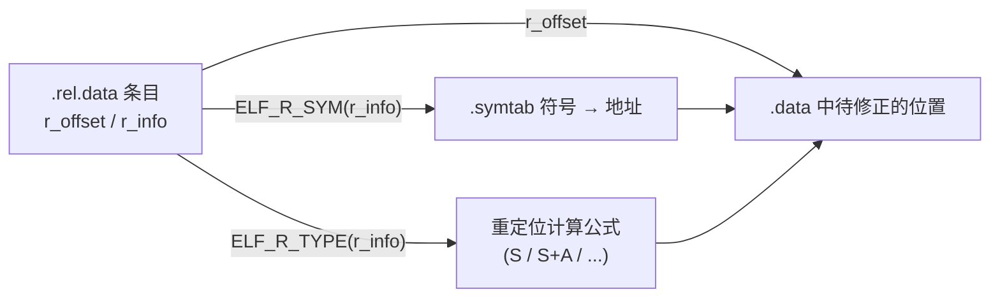

# 详解ELF文件(十一).rel.data节

.rel.data节（数据重定位节）是ELF（Executable and Linkable Format）文件中用于存储数据段重定位信息的重要节区。它在链接过程中起着关键作用，帮助链接器正确处理数据段中的地址引用。

## .rel.data节基本概念

.rel.data节是ELF文件中的重定位表节，专门用于存储 [[07.data节|.data节]]（已初始化数据段）中需要重定位的信息。当目标文件引用了其他文件中定义的符号（如全局变量、函数等）时，编译器无法确定这些符号的最终地址，因此会生成重定位条目，记录需要在链接时修正的位置。

重定位（Relocation）本质上是一张"施工指令表"：每条指令告诉链接器"**在哪个位置（r_offset）、用哪个符号（ELF_R_SYM）、按照哪种公式（ELF_R_TYPE）填写最终地址**"。.rel.data 专门针对 .data 节中的地址字段，而 .rel.text 针对代码段，两者合力让链接器将分散编译的目标文件拼接为一个完整可执行程序。

## .rel.data节的产生背景

在编译和链接过程中，当一个目标文件中的数据引用了其他目标文件中的符号时，就需要进行重定位。例如：

```c
// file1.c
extern int global_var;  // 声明外部变量
int array[10] = {&global_var};  // 数组初始化包含外部变量地址

// file2.c
int global_var = 42;  // 定义全局变量
```

在file1.c编译成目标文件时，编译器不知道global_var的最终地址，因此会在.rel.data节中生成重定位条目。

> **x86-64 注意**：在 x86-64 Linux 工具链中，即使名称含 `.rel.data`，实际生成的通常是 **`.rela.data`**（带显式 addend）——因为 x86-64 psABI 规定只使用 RELA 格式。REL 格式的 `.rel.data` 常见于 32 位 x86（i386）目标文件。

## .rel.data节的结构

### 节头属性

.rel.data 节在节头表中的关键属性：

| 字段 | 含义 |
|---|---|
| `sh_type` | `SHT_REL`（值 9） |
| `sh_link` | 关联的符号表节索引（通常指向 .symtab） |
| `sh_info` | 被重定位节的节索引（即 .data 节） |
| `sh_entsize` | 单条目大小（Elf32_Rel = 8B，Elf64_Rel = 16B） |
| `sh_flags` | 通常为 0（目标文件中无 ALLOC，不驻留内存） |
| `sh_addralign` | 4（32位）或 8（64位） |

### 完整结构体定义（含字段偏移）

.rel.data节包含一系列重定位条目，每个条目描述一个需要重定位的位置。

#### 32 位 ELF（Elf32_Rel，8 字节）

```c
typedef struct {
    Elf32_Addr r_offset;  // 偏移 0，大小 4B：需要重定位的位置相对于节的偏移量
    Elf32_Word r_info;    // 偏移 4，大小 4B：重定位类型和符号表索引
} Elf32_Rel;              // 总大小：8 字节
```

字段偏移与大小一览：

| 字段 | 字节偏移 | 大小 | 类型 |
|---|---|---|---|
| `r_offset` | 0 | 4 | `Elf32_Addr`（uint32_t） |
| `r_info` | 4 | 4 | `Elf32_Word`（uint32_t） |

#### 64 位 ELF（Elf64_Rel，16 字节）

```c
typedef struct {
    Elf64_Addr  r_offset;  // 偏移 0，大小 8B：需要重定位的虚拟地址或节内偏移
    Elf64_Xword r_info;    // 偏移 8，大小 8B：重定位类型和符号表索引
} Elf64_Rel;               // 总大小：16 字节
```

字段偏移与大小一览：

| 字段 | 字节偏移 | 大小 | 类型 |
|---|---|---|---|
| `r_offset` | 0 | 8 | `Elf64_Addr`（uint64_t） |
| `r_info` | 8 | 8 | `Elf64_Xword`（uint64_t） |

> 对比带显式 addend 的 Elf64_Rela（24 字节），REL 格式节省了 1/3 空间，但代价是 addend 必须预先写入被修正位置（隐式 addend）。

#### 对比：Rela 结构（见 [[12.rela.data节]]）

```c
// 包含显式加数的重定位条目（见 [[12.rela.data节]]）
typedef struct {
    Elf64_Addr   r_offset;  // 偏移 0，大小 8B：需要重定位的位置相对于节的偏移量
    Elf64_Xword  r_info;    // 偏移 8，大小 8B：重定位类型和符号表索引
    Elf64_Sxword r_addend;  // 偏移 16，大小 8B：有符号加数（显式存储）
} Elf64_Rela;               // 总大小：24 字节
```

### 1. r_offset字段

该字段表示需要重定位的位置：

- **可重定位文件（.o）**：相对于被重定位节（.data）起始位置的字节偏移。
- **可执行文件/共享库**：需要修改的存储单元的虚拟地址。

对于 .rel.data，r_offset 指向 .data 节中某个需要填写地址的字段（例如一个全局指针变量的内容槽）。

### 2. r_info字段

该字段把**符号表索引**和**重定位类型**打包在一起，但 32 位与 64 位的拆分方式不同：

```c
// 32 位：高 24 位是符号索引，低 8 位是类型
#define ELF32_R_SYM(i)   ((i) >> 8)
#define ELF32_R_TYPE(i)  ((unsigned char)(i))
#define ELF32_R_INFO(s,t) (((s) << 8) + (unsigned char)(t))

// 64 位：高 32 位是符号索引，低 32 位是类型
#define ELF64_R_SYM(i)   ((i) >> 32)
#define ELF64_R_TYPE(i)  ((i) & 0xffffffffL)
#define ELF64_R_INFO(s,t) (((Elf64_Xword)(s) << 32) + ((t) & 0xffffffffL))
```

> **常见误区**：很多资料只记得"低 8 位类型"，那只对 32 位成立；64 位是按 32/32 拆分的。符号索引指向 [[09.symtab节|.symtab]]（或动态重定位时的 [[15.dynsym节|.dynsym]]）。符号索引为 0 表示该重定位不依赖具体符号（如 `R_X86_64_RELATIVE`）。

**r_info 的 64 位示例**：若 `readelf -r` 输出 `Info = 000a00000001`，则：
- 高 32 位 `0x0000000a` = 10 → 符号表第 10 项
- 低 32 位 `0x00000001` = 1 → `R_X86_64_64`

### 3. r_addend字段（仅在Rela结构中存在）

该字段提供一个显式的加数，用于重定位计算。REL 类型没有此字段，加数被隐式存放在被修改的位置里（即链接器读取 r_offset 指向内存的当前值作为 addend）。

**隐式 addend 的含义**：对于 REL 格式，链接器在执行重定位前，先读取被修正位置处已有的值，将其用作 addend，再叠加符号地址写回。这要求编译器在生成目标文件时，把初始 addend 预先写入对应的 .data 字段；若 addend 为 0，则对应字段初始化为全零。

## 结构图示

重定位条目是一条"在哪改、改成谁、怎么改"的指令：



## 重定位计算记号体系

理解重定位公式的前提是掌握统一的记号体系（System V gABI 定义）：

| 记号 | 含义 |
|---|---|
| **S** | Symbol value，重定位引用的符号的运行时地址 |
| **A** | Addend，加数（REL 中为隐式读取，RELA 中为 r_addend） |
| **P** | Place，被修正存储单元的地址（r_offset 在运行时对应的虚拟地址） |
| **B** | Base address，模块的加载基址（仅 PIE/共享库有意义，位置无关代码相对基址为 0） |
| **G** | GOT entry offset，符号在 GOT 中的偏移 |
| **GOT** | Global Offset Table 的地址 |
| **L** | PLT 项地址（过程链接表） |
| **Z** | 符号的大小（`sz` 字段） |
| **DTPOFF** | 线程局部存储（TLS）动态线程指针偏移 |
| **TPOFF** | TLS 线程指针偏移（Initial Exec 模型） |

## 静态链接重定位类型（.rel.data 中常见）

.rel.data 在链接时被消解，以下是静态链接场景中常见的类型（以 i386 为主，因为 x86-64 使用 RELA 格式）：

### i386 常见 R_386_* 类型

| 类型 | 值 | 字段大小 | 计算公式 | 用途 |
|---|---|---|---|---|
| `R_386_NONE` | 0 | — | 无 | 占位/标记 |
| `R_386_32` | 1 | word32 | S + A | 32 位绝对地址（数据指针初始化） |
| `R_386_PC32` | 2 | word32 | S + A − P | 32 位 PC 相对地址 |
| `R_386_GOT32` | 3 | word32 | G + A | GOT 相对偏移 |
| `R_386_PLT32` | 4 | word32 | L + A − P | PLT 相对偏移 |
| `R_386_COPY` | 5 | — | 复制 | 从共享库复制数据变量 |
| `R_386_GLOB_DAT` | 6 | word32 | S | GOT 项写入符号地址 |
| `R_386_JMP_SLOT` | 7 | word32 | S | PLT 跳转槽 |
| `R_386_RELATIVE` | 8 | word32 | B + A | PIE/共享库的相对重定位 |

在 32 位目标文件中，.rel.data 最常见 `R_386_32`（绝对指针初始化）和 `R_386_RELATIVE`（PIE 模式下的相对地址初始化）。

### x86-64 静态目标文件（实为 .rela.data）中的类型

| 类型 | 值 | 字段大小 | 计算公式 | .rel.data 场景用途 |
|---|---|---|---|---|
| `R_X86_64_64` | 1 | word64 | S + A | 64 位绝对地址（`int *p = &var;`） |
| `R_X86_64_32` | 10 | word32 | S + A | 截断为 32 位绝对地址（零扩展） |
| `R_X86_64_32S` | 11 | word32s | S + A | 截断为 32 位绝对地址（符号扩展） |
| `R_X86_64_PC32` | 2 | word32 | S + A − P | 32 位 PC 相对地址 |

> **x86-64 上 .rel.data 实际消失**：GCC/Clang 在 x86-64 上只产生 RELA 格式，`.rel.data` 节在 x86-64 目标文件中实际上以 `.rela.data` 呈现；工具链不会生成 `SHT_REL` 类型的数据段重定位节。

## REL 与 RELA 的区别

| | REL（.rel.*） | RELA（.rela.*） |
|---|---|---|
| 结构体（32位） | `Elf32_Rel`（8B） | `Elf32_Rela`（12B） |
| 结构体（64位） | `Elf64_Rel`（16B） | `Elf64_Rela`（24B） |
| 加数 addend | 隐式存于被改位置 | 显式 r_addend 字段 |
| 典型架构 | x86（32位 i386） | x86-64、AArch64（64位） |
| 计算（绝对地址） | `*P = S + (读取r_offset处的值)` | `*P = S + A` |
| 内存利用率 | 较高（无额外 addend 字段） | 较低（每条多 4/8 字节） |
| 被改位置初始值 | 须预写 addend（编译器负责） | 无约束（可为全零） |

> 详见 [[12.rela.data节]]。

### 为何不同架构选择不同格式

- **i386 选 REL**：历史原因；32 位时代存储成本高，节省 4 字节/条目有意义；且 .data 的初始值（通常是 0 或偏移量）本就需要存在被重定位字段中，天然可作 addend。
- **x86-64 / AArch64 选 RELA**：64 位地址已经占 8 字节，再多 8 字节（addend）开销相对小；RELA 语义更清晰，被修正字段初始值无需包含 addend，减少了调试困惑；psABI 规范明确要求。
- **混用问题**：同一 ELF 文件内 REL 和 RELA 节可共存（如 i386 .rel.dyn 与 .rel.plt），但同一节只能是一种格式。

## .rel.data节与其他重定位节的区别

| 节 | 重定位对象 | 时机 | 格式 |
|---|---|---|---|
| [[22.rel.text节\|.rel.text]] | 代码段（.text）引用 | 链接时 | SHT_REL（i386）/ SHT_RELA（x86-64） |
| **.rel.data** | 数据段（.data）引用 | 链接时 | SHT_REL（i386） |
| [[12.rela.data节\|.rela.data]] | 数据段（.data）引用 | 链接时 | SHT_RELA（x86-64、AArch64） |
| [[19.rel.plt节\|.rel.plt]] | 过程链接表（函数） | 运行时（延迟绑定） | SHT_REL / SHT_RELA |
| [[13.rel.dyn节\|.rel.dyn]] | 动态数据引用 | 运行时（加载） | SHT_REL / SHT_RELA |

## .rel.data节的作用

### 1. 链接过程中的作用

- 记录.data节中需要重定位的位置
- 提供重定位类型和相关符号信息
- 帮助链接器计算最终地址
- 链接完成后，.rel.data 节本身通常被丢弃（链接器消费它，不写入最终可执行文件）

### 2. 地址修正流程

链接器处理 .rel.data 条目的完整步骤：

1. 读取条目的 `r_offset`，定位到 .data 节中的待修正字节位置。
2. 用 `ELF_R_SYM(r_info)` 从 .symtab 中查找符号，获取符号的最终地址 `S`。
3. 对于 REL：从 `r_offset` 指向的内存读取当前值作为 `A`（隐式 addend）。
4. 按 `ELF_R_TYPE(r_info)` 指定的公式计算最终值（如 `S + A`）。
5. 将计算结果写回 `r_offset` 指向的位置。

### 3. 地址修正举例

假设 .data 节偏移 0x10 处有一个 8 字节指针，初始值（隐式 addend）为 0，引用符号 `external_var`（地址 `S = 0x601020`），类型 `R_X86_64_64`：

```
最终写入值 = S + A = 0x601020 + 0 = 0x601020
```

若初始值（addend）为 `0x4`（表示偏移 4 字节处），则写入 `0x601024`。

## 实战：查看 .rel.data

可以使用以下工具分析.rel.data节：

```bash
# 查看目标文件所有重定位节（含 .rel.data 和 .rela.data）
readelf -r target_file.o

# 仅显示 .data 相关重定位（通过节名过滤）
objdump -r -j .data target_file.o

# 以十六进制原始字节查看
readelf -x .rel.data target_file.o

# 反汇编时显示重定位（用于 .text）
objdump -dr target_file.o
```

```text
# 示例输出（代表性，非本机实跑）
$ readelf -r file1.o
Relocation section '.rela.data' at offset 0x2e0 contains 3 entries:
  Offset          Info           Type           Sym. Value    Sym. Name + Addend
000000000000  000a00000001 R_X86_64_64       0000000000000000 external_var + 0
000000000010  000b00000001 R_X86_64_64       0000000000000000 external_function + 0
000000000018  000c00000001 R_X86_64_64       0000000000000000 other_symbol + 8
```

**输出字段解读**：
- `Offset`：在 .data 节中的字节偏移（被修正的指针所在位置）
- `Info`：原始 r_info 值（64 位）；高32位=符号索引，低32位=重定位类型
- `Type`：重定位类型名称（由低32位解析）
- `Sym. Value`：目标文件中符号的值（未定义符号为 0）
- `Sym. Name + Addend`：符号名 + 加数（RELA 格式才有加数，此为 .rela.data）

第三行 `other_symbol + 8` 表示：最终写入地址 = other_symbol 的运行时地址 + 8（即指向该结构体内偏移 8 字节处）。

## .rel.data节在不同文件类型中的存在

### 1. 目标文件（.o文件）

- 包含.rel.data节（或 .rela.data）
- 用于后续链接过程中的重定位
- `sh_flags` 无 `SHF_ALLOC`，不占运行时内存

### 2. 可执行文件

- 通常不包含.rel.data节
- 所有重定位已在链接时完成，节被消费后丢弃
- 若启用 PIE（`-fPIE -pie`），未被消解的相对重定位会转化为 `.rela.dyn` 中的 `R_X86_64_RELATIVE` 条目

### 3. 共享库文件

- 可能包含 [[13.rel.dyn节|.rel.dyn]] 节用于动态重定位
- 不包含.rel.data节（已在静态链接阶段消解或转为动态重定位）

### 4. 静态库（.a 文件）

- 静态库是 ar 归档，内部每个 .o 保留自己的 .rel.data 节
- 链接器在把 .o 纳入链接时处理它

## 实际示例

考虑以下C代码：

```c
// file1.c
extern int external_var;
extern void external_function(void);

// 初始化为外部变量地址的全局数组
int *ptr_array[2] = {&external_var, NULL};

// 包含外部函数地址的函数指针数组
void (*func_ptr_array[2])(void) = {external_function, NULL};

// 包含外部变量的结构体
struct data {
    int *ptr;
    int value;
} struct_var = {&external_var, 100};

// file2.c
int external_var = 42;
void external_function(void) {
    // 函数实现
}
```

在编译file1.c为目标文件时，编译器会生成.rel.data节（在 x86-64 上实为 .rela.data），其中包含以下重定位条目：

1. ptr_array[0]中external_var地址的重定位（偏移 0）
2. func_ptr_array[0]中external_function地址的重定位（偏移 16）
3. struct_var.ptr中external_var地址的重定位（偏移 32）

`ptr_array[1]`（NULL）和 `func_ptr_array[1]`（NULL）无需重定位，保持零值即可。

## .rel.data节的生成过程

### 1. 编译阶段

- 编译器检测到对未定义符号的引用（或在 PIE 模式下对本文件内符号的绝对地址引用）
- 为这些引用在 .data 中生成占位符（REL：写入初始 addend；RELA：写零）
- 在.rel.data 或 .rela.data 节中创建重定位条目

### 2. 链接阶段

- 链接器读取所有输入目标文件的 .rel.data 节
- 根据符号表解析符号地址（跨文件、跨库）
- 对每个条目按公式计算并写回 .data 中对应位置
- .rel.data 节本身不再写入输出文件（已被消费）

### 3. 链接阶段的例外

若链接为共享库或 PIE，部分 .rel.data 条目（如对可抢占符号的绝对地址引用）无法在静态链接时确定最终地址，这些条目会被转换为 .rel.dyn（或 .rela.dyn）中的动态重定位，由运行时的动态链接器处理。

## .rel.data 与 PIE/PIC 的关系

| 构建模式 | .data 中的指针初始化 | 产生何种重定位 | 消解时机 |
|---|---|---|---|
| 普通可执行（-no-pie） | 直接绝对地址 | .rel.data（静态） | 链接时 |
| PIE 可执行（-pie） | 需运行时修正 | .rela.dyn 中 R_X86_64_RELATIVE | 加载时 |
| 共享库（-shared） | 需运行时修正 | .rela.dyn 中 R_X86_64_RELATIVE 或 GLOB_DAT | 加载时 |

PIE 程序中，对本模块内符号的指针初始化也会产生 `R_X86_64_RELATIVE` 动态重定位，因为加载地址要等到运行时才能确定。

## .rel.data节的安全考虑

### 1. 信息泄露

- .rel.data节包含程序的重定位信息（符号名、偏移）
- 可能被攻击者用于分析程序结构
- `strip` 命令会移除目标文件中的 .rel.data 和 .symtab（发布版本中通常执行）

### 2. 重定位保护

- **RELRO（Relocation Read-Only）**：`-z relro -z now` 将 GOT 等重定位目标设为只读，防止在 .rela.dyn 处理后篡改重定位数据
- **ASLR + PIE**：使加载基址随机化，即使知道相对偏移也无法预测绝对地址

### 3. 针对重定位的攻击面

GOT 覆盖（GOT overwrite）是常见的利用手法，通过修改动态重定位后的 GOT 表项来劫持控制流，这也是 RELRO 技术的防护目标。.rel.data 本身不驻留运行时内存，因此直接针对它的攻击主要发生在编译/链接阶段（供应链攻击）。

## 总结

.rel.data节是ELF文件中用于处理数据段重定位的重要节区。它记录了.data节中需要在链接时修正的地址引用，帮助链接器生成正确的可执行文件。理解.rel.data节的结构和作用对于程序链接、调试和安全分析都具有重要意义。

核心要点回顾：
- .rel.data 使用无显式 addend 的 `Elf32_Rel`（8B）/ `Elf64_Rel`（16B） 结构；
- 32 位：r_info 高 24 位=符号索引，低 8 位=类型；64 位：高 32 位=符号索引，低 32 位=类型；
- addend 隐式存于被修正位置，链接器读取后使用；
- x86-64 实际使用 .rela.data（RELA 格式），i386 使用 .rel.data（REL 格式）；
- 链接完成后 .rel.data 被消费丢弃，不出现在最终可执行文件中。

通过重定位机制，多个目标文件可以正确地链接在一起，形成完整的可执行程序。这是现代链接器和加载器工作的基础，也是程序模块化设计的关键支撑技术。

## 相关阅读

- **加数版本**：[[12.rela.data节]]
- **重定位依赖的符号表**：[[09.symtab节]]
- **同类重定位节**：[[22.rel.text节]]、[[13.rel.dyn节]]、[[19.rel.plt节]]
- **重定位对象**：[[07.data节]]
- 上一篇：[[10.shstrtab节]] ｜ 下一篇：[[12.rela.data节]]
