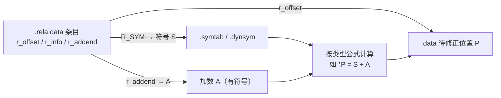

# 详解ELF文件(十二).rela.data节

.rela.data节是ELF（Executable and Linkable Format）文件格式中的一个重要组成部分，属于重定位表的一种。它与 [[11.rel.data节|.rel.data]] 功能相同，但采用带显式加数的 RELA 格式，是 x86-64 等 64 位平台上数据段重定位的实际形式。

## 1. 基本概念

.rela.data节包含对 [[07.data节|.data节]] 中数据的重定位信息。在目标文件中，当全局变量或静态变量的初始值依赖于其他模块中定义的符号时，就需要进行重定位。

"rela"是"relocation with addend"的缩写，核心特征是每条重定位条目携带一个**显式 addend 字段（r_addend）**，使得链接器在计算最终地址时无需读取被修正位置的当前内容，语义更清晰、调试更友好。

.rela.data 节头的 `sh_type` 为 `SHT_RELA`（值 4），区别于 .rel.data 的 `SHT_REL`（值 9）。

## 2. 与.rel.data的区别

.rela.data和 [[11.rel.data节|.rel.data]] 都是重定位表，但它们使用的数据结构略有不同：

- .rel.data使用REL类型的重定位条目（`SHT_REL`）
- .rela.data使用RELA类型的重定位条目（`SHT_RELA`），它比REL类型多了addend字段

这个addend字段允许重定位操作直接应用一个立即数到目标位置，而不需要像REL那样读取被改位置的隐式 addend，提供了更直接的重定位能力。

| | REL（.rel.data） | RELA（.rela.data） |
|---|---|---|
| 节类型 sh_type | `SHT_REL` = 9 | `SHT_RELA` = 4 |
| 加数来源 | 隐式存于被改位置（编译器预写） | 显式 r_addend 字段 |
| 计算（以 R_*_64 为例） | `*P = S + (读 r_offset 处的值)` | `*P = S + A` |
| 条目大小（32位 ELF） | 8 字节 | 12 字节 |
| 条目大小（64位 ELF） | 16 字节 | 24 字节 |
| 典型平台 | x86（32位 i386）、部分 ARM32 | x86-64、AArch64、RISC-V、PowerPC64 |
| 被改位置的初始值 | 须预写 addend | 无约束（可为全零） |

## 3. 数据结构（完整字段偏移）

.rela.data节由Elf32_Rela或Elf64_Rela结构体数组组成，具体结构如下：

### 32 位 ELF（Elf32_Rela，12 字节）

```c
typedef struct {
    Elf32_Addr  r_offset;   // 偏移 0，大小 4B：需要重定位的位置（相对节起始的偏移）
    Elf32_Word  r_info;     // 偏移 4，大小 4B：重定位类型和符号表索引
    Elf32_Sword r_addend;   // 偏移 8，大小 4B：有符号加数（显式存储）
} Elf32_Rela;               // 总大小：12 字节
```

| 字段 | 字节偏移 | 大小 | 类型说明 |
|---|---|---|---|
| `r_offset` | 0 | 4 | `Elf32_Addr`（uint32_t）— 节内字节偏移或 VA |
| `r_info` | 4 | 4 | `Elf32_Word`（uint32_t）— 打包了 SYM 和 TYPE |
| `r_addend` | 8 | 4 | `Elf32_Sword`（int32_t）— **有符号**加数 |

### 64 位 ELF（Elf64_Rela，24 字节）

```c
typedef struct {
    Elf64_Addr   r_offset;  // 偏移 0，大小 8B：需要重定位的位置
    Elf64_Xword  r_info;    // 偏移 8，大小 8B：重定位类型和符号表索引
    Elf64_Sxword r_addend;  // 偏移 16，大小 8B：有符号加数（显式存储）
} Elf64_Rela;               // 总大小：24 字节
```

| 字段 | 字节偏移 | 大小 | 类型说明 |
|---|---|---|---|
| `r_offset` | 0 | 8 | `Elf64_Addr`（uint64_t）— 节内字节偏移或 VA |
| `r_info` | 8 | 8 | `Elf64_Xword`（uint64_t）— 打包了 SYM 和 TYPE |
| `r_addend` | 16 | 8 | `Elf64_Sxword`（int64_t）— **有符号**加数（可为负） |

### r_info 的拆分宏

`r_info` 的拆解与 [[11.rel.data节]] 相同——64 位下高 32 位为符号索引、低 32 位为重定位类型：

```c
// 32 位（高 24 位 = 符号索引，低 8 位 = 类型）
#define ELF32_R_SYM(i)    ((i) >> 8)
#define ELF32_R_TYPE(i)   ((unsigned char)(i))
#define ELF32_R_INFO(s,t) (((s) << 8) + (unsigned char)(t))

// 64 位（高 32 位 = 符号索引，低 32 位 = 类型）
#define ELF64_R_SYM(i)    ((i) >> 32)
#define ELF64_R_TYPE(i)   ((i) & 0xffffffffL)
#define ELF64_R_INFO(s,t) (((Elf64_Xword)(s) << 32) + ((t) & 0xffffffffL))
```

**示例解读**：`readelf -r` 输出 `Info = 000a00000001`（64 位十六进制）：
- 高 32 位 = `0x0000000a` = 10 → .symtab 第 10 个符号
- 低 32 位 = `0x00000001` = 1 → 类型 `R_X86_64_64`

## 重定位计算记号体系

理解所有重定位公式必须掌握统一记号（System V gABI 定义）：

| 记号 | 全称与含义 |
|---|---|
| **S** | Symbol value — 被引用符号的运行时（最终）地址 |
| **A** | Addend — 加数（RELA 中为 r_addend，REL 中为读取 r_offset 处现有值） |
| **P** | Place — 被修正存储单元的运行时地址（对应 r_offset） |
| **B** | Base address — 模块的加载基址；静态链接或非 PIE 时为 0 |
| **G** | GOT entry offset — 符号对应 GOT 条目相对于 GOT 起始的偏移 |
| **GOT** | Global Offset Table 本身的地址 |
| **L** | PLT entry address — 符号的 PLT 条目地址 |
| **Z** | 符号的大小（`st_size` 字段） |
| **DTPOFF** | TLS 动态线程指针偏移（Double Thread Pointer Offset） |
| **TPOFF** | TLS 线程指针偏移（Thread Pointer Offset，Initial Exec 模型） |

## 4. 完整重定位类型表（x86-64，.rela.data 场景）

以下是 x86-64 psABI 定义的重定位类型，着重标注在 .rela.data（数据段静态重定位）中可能出现的类型：

### 基础数据重定位

| 类型 | 值 | 字段 | 计算公式 | .rela.data 用途 |
|---|---|---|---|---|
| `R_X86_64_NONE` | 0 | — | 无 | 占位 |
| `R_X86_64_64` | 1 | word64 | S + A | **最常见**：64 位绝对地址初始化（`int *p = &var;`） |
| `R_X86_64_PC32` | 2 | word32 | S + A − P | PC 相对 32 位（少见于纯数据） |
| `R_X86_64_32` | 10 | word32 | S + A | 32 位零扩展绝对地址 |
| `R_X86_64_32S` | 11 | word32s | S + A | 32 位符号扩展绝对地址（须能符号扩展到64位） |
| `R_X86_64_16` | 12 | word16 | S + A | 16 位绝对地址 |
| `R_X86_64_8` | 14 | word8 | S + A | 8 位绝对地址 |
| `R_X86_64_SIZE32` | 32 | word32 | Z + A | 32 位符号大小（调试信息） |
| `R_X86_64_SIZE64` | 33 | word64 | Z + A | 64 位符号大小 |

### GOT / PLT 相关（通常在 .text 重定位中，偶见于数据段函数指针）

| 类型 | 值 | 字段 | 计算公式 | 说明 |
|---|---|---|---|---|
| `R_X86_64_GOT32` | 3 | word32 | G + A | GOT 条目相对偏移 |
| `R_X86_64_PLT32` | 4 | word32 | L + A − P | PLT 条目 PC 相对偏移 |
| `R_X86_64_GOTPCREL` | 9 | word32 | G + GOT + A − P | GOT 条目的 PC 相对地址 |

### 动态重定位类型（出现在 .rela.dyn，此处作对比参考）

| 类型 | 值 | 计算公式 | 场景 |
|---|---|---|---|
| `R_X86_64_COPY` | 5 | — | 从共享库复制全局变量初始值到可执行文件 BSS |
| `R_X86_64_GLOB_DAT` | 6 | S | 写符号地址到 GOT 条目 |
| `R_X86_64_JUMP_SLOT` | 7 | S | PLT 跳转槽（延迟绑定） |
| `R_X86_64_RELATIVE` | 8 | B + A | PIE/共享库相对重定位（无需符号） |
| `R_X86_64_IRELATIVE` | 37 | indirect(B+A) | IFUNC 间接函数（见下文） |

### TLS（线程本地存储）重定位

| 类型 | 值 | 计算公式 | 说明 |
|---|---|---|---|
| `R_X86_64_DTPMOD64` | 16 | TLS 模块索引 | TLS GD/LD 模型第一个 GOT 条目 |
| `R_X86_64_DTPOFF64` | 17 | DTPOFF | TLS GD/LD 模型第二个 GOT 条目 |
| `R_X86_64_TPOFF64` | 18 | S + A − TPOFF | Initial Exec 模型 64 位偏移 |
| `R_X86_64_TLSGD` | 19 | word32 | General Dynamic TLS（.text 中） |
| `R_X86_64_TLSLD` | 20 | word32 | Local Dynamic TLS（.text 中） |
| `R_X86_64_DTPOFF32` | 21 | DTPOFF | Local Dynamic 模型偏移（.text 中） |
| `R_X86_64_GOTTPOFF` | 22 | word32 | Initial Exec 的 GOT PC 相对地址 |
| `R_X86_64_TPOFF32` | 23 | S + A − TPOFF | Local Exec 模型 32 位偏移 |

## 其他架构的对应类型

### i386（R_386_*，使用 REL 格式 .rel.data）

| i386 类型 | x86-64 对应类型 | 计算公式 |
|---|---|---|
| `R_386_32` | `R_X86_64_32` | S + A（32 位绝对地址） |
| `R_386_PC32` | `R_X86_64_PC32` | S + A − P |
| `R_386_GLOB_DAT` | `R_X86_64_GLOB_DAT` | S |
| `R_386_RELATIVE` | `R_X86_64_RELATIVE` | B + A |
| `R_386_COPY` | `R_X86_64_COPY` | 复制 |
| `R_386_IRELATIVE` | `R_X86_64_IRELATIVE` | indirect(B+A) |

### AArch64（R_AARCH64_*，使用 RELA 格式 .rela.data）

| AArch64 类型 | 值 | 计算公式 | 对应 x86-64 类型 |
|---|---|---|---|
| `R_AARCH64_NONE` | 0 | — | `R_X86_64_NONE` |
| `R_AARCH64_ABS64` | 257 | S + A | `R_X86_64_64` |
| `R_AARCH64_ABS32` | 258 | S + A（32位） | `R_X86_64_32` |
| `R_AARCH64_PREL64` | 260 | S + A − P | — |
| `R_AARCH64_PREL32` | 261 | S + A − P（32位） | `R_X86_64_PC32` |
| `R_AARCH64_COPY` | 1024 | 复制 | `R_X86_64_COPY` |
| `R_AARCH64_GLOB_DAT` | 1025 | S | `R_X86_64_GLOB_DAT` |
| `R_AARCH64_JUMP_SLOT` | 1026 | S | `R_X86_64_JUMP_SLOT` |
| `R_AARCH64_RELATIVE` | 1027 | B + A | `R_X86_64_RELATIVE` |
| `R_AARCH64_TLS_DTPMOD` | 1028 | TLS 模块索引 | `R_X86_64_DTPMOD64` |
| `R_AARCH64_TLS_DTPREL` | 1029 | DTPOFF | `R_X86_64_DTPOFF64` |
| `R_AARCH64_TLS_TPREL` | 1030 | S + A − TPOFF | `R_X86_64_TPOFF64` |
| `R_AARCH64_IRELATIVE` | 1032 | indirect(B+A) | `R_X86_64_IRELATIVE` |

## 结构图示



## 5. 作用场景

.rela.data节主要应用于以下情况：

### 5.1 跨模块指针初始化

当初始化的全局变量或静态变量的初始值是其他全局变量的地址时：

```c
extern int external_var;
int *ptr_to_external = &external_var;  // 产生 R_X86_64_64 条目
```

### 5.2 函数指针数组

```c
extern void func_a(void);
extern void func_b(void);
void (*dispatch[])(void) = { func_a, func_b };  // 每个非 NULL 元素产生一条 R_X86_64_64
```

### 5.3 同模块符号的绝对地址（PIE 模式）

即使在同一编译单元中，若以绝对方式初始化指针，在 PIE 模式下也需要重定位：

```c
int local_var = 42;
int *ptr_to_local = &local_var;  
// 非 PIE：链接时直接填绝对地址，无需运行时重定位
// PIE：静态链接后转为 .rela.dyn 中的 R_X86_64_RELATIVE
```

### 5.4 带偏移的结构体成员地址

```c
struct Foo { int a; int b; };
extern struct Foo g_foo;
int *pb = &g_foo.b;  // 产生 R_X86_64_64，addend = offsetof(Foo, b) = 4
```

这里 `r_addend = 4`，最终地址 = `&g_foo + 4`。这正是 RELA 的优势所在：addend 可以精确记录结构体偏移，而无需修改 .data 节的初始内容。

## 6. 在链接过程中的角色

在链接过程中，链接器会：

1. 读取.rela.data节中的重定位条目
2. 解析引用的符号：通过 `ELF64_R_SYM(r_info)` 在 .symtab 中查找，获得符号的最终地址 `S`
3. 获取加数：直接使用 `r_addend`（无需读取被改位置的内容）
4. 根据重定位类型和符号地址计算正确的值（如 `S + A`）
5. 将计算结果写入相应的 .data 节位置（r_offset 处）
6. .rela.data 节本身不出现在最终可执行文件中（链接器处理后丢弃）

### 6.1 链接时 vs. 运行时

.rela.data 是**静态重定位**，在链接时（`ld`）处理。与之对比的是动态重定位（.rela.dyn），在程序加载时由动态链接器（`ld-linux.so`）处理。

| | .rela.data（静态） | .rela.dyn（动态） |
|---|---|---|
| 处理时机 | 链接时（ld） | 加载时（ld-linux.so） |
| 驻留内存 | 否（无 SHF_ALLOC） | 是（有 SHF_ALLOC） |
| 目标文件类型 | .o（可重定位文件） | .so 或 PIE 可执行文件 |
| 符号来源 | .symtab | .dynsym |
| 消解后状态 | 从输出文件中丢弃 | 保留在文件中供运行时使用 |

## 7. 与其他节的关系

- [[07.data节|.data]]：存储已初始化的全局和静态C变量（重定位的修改目标）
- [[08.bss节|.bss]]：存储未初始化的全局和静态C变量（零初始化，不含指针，通常不需要重定位）
- [[09.symtab节|.symtab]]：符号表，提供重定位所需的符号地址（链接时）
- [[15.dynsym节|.dynsym]]：动态符号表（运行时）
- [[23.rela.text节|.rela.text]]：代码段的重定位信息（与 .rela.data 并列）
- [[14.rela.dyn节|.rela.dyn]]：动态重定位表（运行时处理的"孪生兄弟"）

## 8. 实际应用示例

考虑以下C代码：

```c
int global_var = 42;
int *ptr_to_global = &global_var;     // 可能产生 .rela.data 条目（同模块，常为 RELATIVE）
extern int external_var;
int *ptr_to_external = &external_var;  // 几乎肯定产生 .rela.data 条目（跨模块）
```

在这个例子中，ptr_to_external的初始化需要在链接时进行重定位，因为external_var的地址只有在链接时才能确定。

### 较复杂的结构体示例

```c
// file_a.c
extern int arr[];
extern void callback(int);

struct Config {
    int *data_ptr;
    void (*fn)(int);
    int offset;
};

struct Config g_cfg = {
    .data_ptr = &arr[3],    // R_X86_64_64, addend = 3 * sizeof(int) = 12
    .fn       = callback,   // R_X86_64_64, addend = 0
    .offset   = 100,        // 无重定位（已知常量）
};
```

链接器读取 .rela.data 后，把 `&arr + 12` 和 `callback` 的地址写入 g_cfg 的相应字段；整型常量 100 无需重定位，编译时已直接写入目标文件的 .data 节。

## 9. 实战：查看 .rela.data

```bash
# 查看目标文件所有重定位节（含 .rela.data）
readelf -r file.o

# 仅查看 .data 段的重定位（按节名过滤）
objdump -r -j .data file.o

# 查看节头表，确认 .rela.data 的 sh_link 和 sh_info
readelf -S file.o

# 以十六进制原始字节查看 .rela.data 内容
readelf -x .rela.data file.o
```

```text
# 示例输出（代表性，非本机实跑）
$ readelf -r file.o
Relocation section '.rela.data' at offset 0x2e0 contains 1 entry:
  Offset          Info           Type           Sym. Value    Sym. Name + Addend
000000000008  000a00000001 R_X86_64_64       0000000000000000 external_var + 0
```

**字段详解**：
- `Offset 0x8`：在 .data 节中第 8 字节处的 8 字节字段需要被修正
- `Info 000a00000001`：高 32 位 `0xa` = 符号表第 10 项（external_var），低 32 位 `1` = `R_X86_64_64`
- `R_X86_64_64`：64 位绝对地址，公式 `S + A`
- `external_var + 0`：链接时用 external_var 的地址 + addend(0) 写入该位置

若输出为 `external_var + 4`，则表示 addend = 4，最终地址指向 external_var 后 4 字节。

```text
# 示例：查看节头确认关联关系（代表性，非本机实跑）
$ readelf -S file.o | grep -A4 '\.rela\.data'
  [Nr] Name              Type             Address           Offset
  [ 5] .rela.data        RELA             0000000000000000  000002e0
       Size: 0x18   EntSize: 0x18  Link: 9  Info: 3  Align: 8
# Link=9 → 关联 .symtab（第9节）；Info=3 → 被重定位的是第3节（.data）
```

## 总结

.rela.data节作为链接过程中的重要组成部分，确保了程序中全局变量和静态变量能够正确地引用其他模块中的符号。它与 .rel.data 的唯一本质差异是显式的加数字段，这让 64 位平台的重定位计算更直接，是构建复杂程序不可或缺的一部分。

核心要点回顾：
- 结构体大小：Elf32_Rela = 12B，**Elf64_Rela = 24B**（比 REL 各多 4/8 字节）；
- r_addend 是**有符号**整数（`Elf32_Sword`/`Elf64_Sxword`），可为负，常用于结构体成员偏移；
- x86-64 上 .rela.data 中最常见 `R_X86_64_64`（值 1，`S + A`）；
- AArch64 对应 `R_AARCH64_ABS64`（值 257，`S + A`），编号不同但语义相同；
- 链接后 .rela.data 被消费丢弃，不影响运行时；
- PIE/共享库中无法在静态链接时确定的绝对地址会转移到 .rela.dyn。

## 相关阅读

- **无加数版本**：[[11.rel.data节]]
- **符号来源**：[[09.symtab节]]
- **代码段对应物**：[[23.rela.text节]]
- **动态数据重定位**：[[14.rela.dyn节]]
- 上一篇：[[11.rel.data节]] ｜ 下一篇：[[13.rel.dyn节]]
