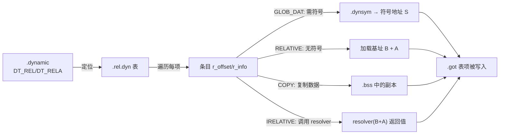

# 详解ELF文件(十三).rel.dyn节

.rel.dyn节是ELF（Executable and Linkable Format）文件格式中一个重要的重定位节，主要用于动态链接时的数据重定位。

## 1. 基本概念

.rel.dyn节是动态链接重定位表的一部分，包含了需要在程序运行时进行重定位的数据信息。与 [[19.rel.plt节|.rel.plt节]] 不同，.rel.dyn主要用于除函数调用以外的数据重定位。

它与 [[11.rel.data节|.rel.data]] 的关键区别：.rel.data 在**链接时**由链接器处理并消失，而 .rel.dyn 保留到**运行时**由动态链接器处理（因此带 `SHF_ALLOC` 属性、驻留内存）。

.rel.dyn 节的 `sh_type` 为 `SHT_REL`（值 9），`sh_flags` 包含 `SHF_ALLOC`（值 2），这意味着它在程序加载时会被映射到内存，动态链接器能够直接访问它。

### 动态重定位的本质

动态重定位是"延迟确认地址"的机制——共享库（.so）和位置无关可执行文件（PIE）在编译时不知道自己将被加载到哪个虚拟地址，因此无法在链接时填写所有绝对地址。.rel.dyn 就是一张"运行时施工单"，动态链接器（`ld-linux.so`）在 `execve` 后、`main` 前按表施工，把所有待修正位置填写为正确的运行时地址。

## 2. 作用和功能

.rel.dyn节的主要作用包括：

1. **数据重定位**：处理全局变量、静态变量等数据的地址重定位
2. **动态链接支持**：在程序加载时，动态链接器使用.rel.dyn中的信息来修正符号引用
3. **GOT表更新**：重定位信息通常指向 [[17.got节|.got]]（Global Offset Table）表中的条目，动态链接器根据这些信息更新GOT表项
4. **PIE 基址修正**：对于 PIE 可执行文件，`R_*_RELATIVE` 类型条目数量最多，用于将内嵌地址加上实际加载基址

## 3. 与.rel.plt的区别

- **.rel.dyn**：处理数据引用的重定位，主要针对全局数据变量，加载时**一次性全部完成**（eager binding）
- **[[19.rel.plt节|.rel.plt]]**：处理函数调用的重定位，主要针对外部函数引用，支持**延迟绑定**（lazy binding，首次调用时才解析）

延迟绑定通过 PLT stub + GOT 机制实现：函数第一次调用时才触发动态链接器的符号解析，后续调用直接跳 GOT 表中已填写的地址。数据引用无法延迟绑定，必须在程序进入 `main` 前完成，所以 .rel.dyn 的重定位是急切（eager）的。

## 4. 数据结构

.rel.dyn节使用 `Elf32_Rel`（32 位 ELF）或 `Elf64_Rel`（64 位 ELF）结构体数组（x86 32 位使用 REL；x86-64 虽然大多使用 RELA，但早期或特定工具链可能生成 REL 格式的 .rel.dyn）：

### 32 位 ELF（Elf32_Rel，8 字节）

```c
typedef struct {
    Elf32_Addr r_offset;  // 偏移 0，大小 4B：需要重定位的虚拟地址（通常是 GOT 表中的地址）
    Elf32_Word r_info;    // 偏移 4，大小 4B：重定位类型和符号表索引
} Elf32_Rel;              // 总大小：8 字节
```

| 字段 | 字节偏移 | 大小 | 说明 |
|---|---|---|---|
| `r_offset` | 0 | 4 | 可执行文件/共享库中被修正的**虚拟地址**（区别于 .o 文件中的节偏移） |
| `r_info` | 4 | 4 | 高24位=符号索引，低8位=类型（32位ELF） |

### 64 位 ELF（Elf64_Rel，16 字节）

```c
typedef struct {
    Elf64_Addr  r_offset;  // 偏移 0，大小 8B：需要重定位的虚拟地址
    Elf64_Xword r_info;    // 偏移 8，大小 8B：重定位类型和符号表索引
} Elf64_Rel;               // 总大小：16 字节
```

> 注意：在 .rel.dyn 中，`r_offset` 是**运行时虚拟地址**，而非节内偏移——这与目标文件（.o）中的 .rel.data 不同。动态链接器直接把 `r_offset` 作为要写入的内存地址。

其中：

- **r_offset**：需要重定位的位置，对于可执行文件或共享库，通常是GOT表中的地址
- **r_info**：包含重定位类型和符号表索引（符号索引指向 [[15.dynsym节|.dynsym]]，而非 .symtab）
- REL 格式的隐式 addend：动态链接器在执行重定位前读取 r_offset 处的当前值作为 addend

## 5. 常见重定位类型

在.rel.dyn节中常见的重定位类型包括（以 i386 为例，x86-64 通常使用 .rela.dyn）：

### i386 主要动态重定位类型

| 类型 | 值 | 字段 | 计算公式 | 说明 |
|---|---|---|---|---|
| `R_386_NONE` | 0 | — | 无 | 占位 |
| `R_386_32` | 1 | word32 | S + A | 32 位绝对地址 |
| `R_386_COPY` | 5 | — | 复制 | 从共享库复制变量到可执行文件 BSS |
| `R_386_GLOB_DAT` | 6 | word32 | S | 把符号地址写入 GOT 项 |
| `R_386_JMP_SLOT` | 7 | word32 | S | PLT 跳转槽（在 .rel.plt 中） |
| `R_386_RELATIVE` | 8 | word32 | B + A | **最常见**：PIE/共享库相对重定位 |
| `R_386_TLS_DTPMOD32` | 35 | word32 | TLS 模块索引 | TLS GD/LD 模型 |
| `R_386_TLS_DTPOFF32` | 36 | word32 | DTPOFF | TLS GD/LD 偏移 |
| `R_386_TLS_TPOFF32` | 37 | word32 | TLS_TP − TPOFF | TLS IE/LE 偏移 |
| `R_386_IRELATIVE` | 42 | word32 | indirect(B+A) | IFUNC 间接函数 |

### x86-64 动态重定位类型对比（参见 .rela.dyn，此处作参考）

| x86-64 类型 | 值 | 计算公式 | i386 对应 |
|---|---|---|---|
| `R_X86_64_GLOB_DAT` | 6 | S | `R_386_GLOB_DAT` |
| `R_X86_64_RELATIVE` | 8 | B + A | `R_386_RELATIVE` |
| `R_X86_64_COPY` | 5 | 复制 | `R_386_COPY` |
| `R_X86_64_IRELATIVE` | 37 | indirect(B+A) | `R_386_IRELATIVE` |

> `R_X86_64_RELATIVE` 不需要符号（符号索引为 0），只需把"加载基址 B"加到隐式 addend 上——这是 PIE 可执行文件启动时数量最多的重定位。

## 重要重定位类型深度解析

### GLOB_DAT（全局数据符号绑定）

```
*GOT_entry = S
```

`R_386_GLOB_DAT` / `R_X86_64_GLOB_DAT`（类型 6）用于将解析后的符号地址写入 GOT 条目，专门用于外部数据符号（全局变量）。

工作过程：
1. 动态链接器在 .dynsym 中查找符号名
2. 通过 DT_NEEDED 找到提供该符号的共享库并加载它
3. 将符号的运行时地址写入 r_offset 指向的 GOT 条目

之后代码通过 GOT 间接访问该全局变量。

### RELATIVE（相对重定位，无需符号查找）

```
*P = B + A    （隐式 addend：A = 读取 r_offset 处的值）
```

`R_386_RELATIVE` / `R_X86_64_RELATIVE`（类型 8）是性能最高的动态重定位类型——它**不需要符号查找**（r_info 中符号索引为 0），直接把加载基址 `B` 加到隐式 addend 上。

大量出现在 PIE 可执行文件和共享库中，对应每一个指向本模块内部的指针初始化。例如字符串指针数组、虚函数表（vtable）等。

### COPY（数据复制重定位，可执行文件专用）

`R_386_COPY` / `R_X86_64_COPY`（类型 5）是 ELF 动态链接中一个特殊的重定位类型，**只能出现在可执行文件（ET_EXEC 或 ET_DYN 即 PIE）中，不能出现在共享库中**。

**产生原因**：当非 PIC 可执行文件引用了共享库中定义的全局变量时，编译器无法通过 GOT 间接访问（因为非 PIC 代码直接生成绝对地址访问），必须将变量的副本复制到可执行文件自身的 .bss 段中。

**执行过程**：
1. 链接器在可执行文件的 .bss 段中为该变量分配空间（大小与共享库中定义一致）
2. 生成 `R_COPY` 重定位条目，r_offset 指向 .bss 中的副本
3. 运行时动态链接器从共享库中找到该变量的原始地址
4. **逐字节复制**原始变量的初始值到 .bss 副本中
5. 共享库中的 `R_GLOB_DAT` 也被修改为指向可执行文件的副本（保证两者用同一份数据）

**COPY 的代价**：
- 若共享库更新了变量的默认值，可执行文件不会自动获得新值（因为复制发生在运行时加载时，读的是当前共享库的 .data 值）
- 若多个可执行文件各自持有副本，内存中就有多份相同数据
- 这也是 PIC/PIE 大力推广的原因：PIE + GLOB_DAT 无需 COPY，直接通过 GOT 共享一份数据

### IRELATIVE（间接函数重定位，IFUNC 机制）

```
*P = call (B + A)()    即：先执行地址为 (B+A) 的 resolver 函数，把其返回值写入 P
```

`R_386_IRELATIVE` / `R_X86_64_IRELATIVE`（类型 42/37）与 `R_*_RELATIVE` 类似，但多一层间接调用——它不是直接写 `B + A`，而是**调用地址 `B + A` 处的一个 resolver 函数**，把该函数的返回值写入 `*P`。

**用途**：GNU 间接函数（`STT_GNU_IFUNC`），允许在运行时根据 CPU 特性选择最优的函数实现。glibc 中的 `memcpy`、`strlen` 等函数就通过此机制在 AVX2、SSE4 等不同 CPU 上选择最快实现。

**示例（GCC 属性语法）**：

```c
// 定义一个 IFUNC resolver
void *resolve_my_func(void) {
    if (cpu_has_avx2())
        return my_func_avx2;
    else
        return my_func_generic;
}

// 声明为 IFUNC
void my_func(void) __attribute__((ifunc("resolve_my_func")));
```

编译器会为 `my_func` 的 GOT 条目生成 `R_*_IRELATIVE` 重定位，加载时动态链接器调用 resolver，把返回的实际函数地址写入 GOT。

**处理顺序**：IRELATIVE 必须在所有 RELATIVE 重定位之后处理（因为 resolver 函数本身可能依赖于 RELATIVE 已完成的重定位）。

## 6. 工作原理



具体流程：

1. 程序加载时，动态链接器读取 [[18.dynamic节|.dynamic]] 节中的信息，找到.rel.dyn节的位置（通过 `DT_REL` 和 `DT_RELSZ`）
2. 遍历.rel.dyn节中的每个重定位条目
3. 根据重定位类型和符号信息，计算正确的地址值
4. 将计算结果写入r_offset指定的位置（通常是 [[17.got节|.got]] 表中的条目）

## 7. .dynamic 节中的相关标签

动态链接器通过 .dynamic 节（用 `readelf -d` 查看）定位 .rel.dyn：

| 标签 | 值 | 含义 |
|---|---|---|
| `DT_REL` | 17 | .rel.dyn 的地址 |
| `DT_RELSZ` | 18 | .rel.dyn 的总字节大小 |
| `DT_RELENT` | 19 | 每条 REL 条目的大小（通常 8 或 16） |
| `DT_PLTREL` | 20 | PLT 使用 REL 还是 RELA |
| `DT_PLTRELSZ` | 2 | PLT 重定位表总大小 |
| `DT_JMPREL` | 23 | .rel.plt 的地址 |

若同时存在 `DT_REL` 和 `DT_RELA`，处理顺序由动态链接器实现决定（glibc 先处理 RELA）。

```text
# 示例输出（代表性，非本机实跑）
$ readelf -d a.out | grep -E 'REL|RELA'
 0x0000000000000011 (RELA)               0x400388
 0x0000000000000012 (RELASZ)             72 (bytes)
 0x0000000000000013 (RELAENT)            24 (bytes)
 0x0000000000000002 (PLTRELSZ)           48 (bytes)
 0x0000000000000014 (PLTREL)             RELA
 0x0000000000000017 (JMPREL)             0x4003d0
```

（注：此例文件使用 RELA，即实为 .rela.dyn；32 位程序会显示 `REL` 而非 `RELA`）

## 8. 实际应用示例

考虑以下代码：

```c
extern int global_var;           // 外部全局变量
int *ptr_to_global = &global_var; // 指向外部全局变量的指针

// 在另一个文件中
int global_var = 42;
```

在这种情况下，链接器无法在编译时确定global_var的最终地址，因此会在.rel.dyn节中创建一个重定位条目。在程序加载时，动态链接器会更新GOT表中相应的条目，使其指向global_var的实际地址。

### PIE 程序中的 RELATIVE 大量出现

```c
// 这段代码在 PIE 可执行文件中...
const char *messages[] = {
    "hello",   // &"hello"  需要 R_X86_64_RELATIVE（内部字符串字面量地址）
    "world",   // &"world"  需要 R_X86_64_RELATIVE
    NULL,
};
```

编译为 PIE 后，每个字符串指针都会产生一条 `R_X86_64_RELATIVE`（在 .rela.dyn 中），因为字符串本身在 .rodata 节中，其地址在加载前未知。

## 9. 实战：查看 .rel.dyn

```bash
# 查看重定位信息（含 .rel.dyn / .rela.dyn）
readelf -r a.out

# 查看节头表，找到 .rel.dyn 节（确认 sh_type 为 SHT_REL）
readelf -S a.out

# 查看 .dynamic 节，确认 DT_REL 指向 .rel.dyn
readelf -d a.out

# 结合反汇编查看重定位应用（-R 显示动态重定位）
objdump -R a.out

# 用 objdump -d 查看 GOT/PLT 区域（了解重定位目标）
objdump -d -j .got a.out
```

```text
# 示例输出（代表性，非本机实跑）
$ readelf -r a.out
Relocation section '.rela.dyn' at offset 0x5b0 contains 8 entries:
  Offset          Info           Type           Sym. Value    Sym. Name + Addend
000000003db8  000000000008 R_X86_64_RELATIVE                    1140
000000003fc0  000200000006 R_X86_64_GLOB_DAT 0000000000000000 __libc_start_main@GLIBC_2.34 + 0
```

注意 `R_X86_64_RELATIVE` 的 `Sym. Name` 为空——它不依赖符号，`Info` 高32位为0（符号索引=0），只把加载基址加到 addend（此处为 `0x1140`）上。

```text
# 示例：objdump -R 显示动态重定位（代表性，非本机实跑）
$ objdump -R a.out
a.out:     file format elf64-x86-64
DYNAMIC RELOCATION RECORDS
OFFSET           TYPE              VALUE
0000000000404018 R_X86_64_JUMP_SLOT  printf@GLIBC_2.2.5
0000000000404020 R_X86_64_GLOB_DAT   __libc_start_main@GLIBC_2.34
```

## 10. RELR：现代相对重定位压缩格式

随着 PIE 程序普及，.rel.dyn 中的 `R_*_RELATIVE` 条目数量爆炸性增长（一个 1 MB 的 PIE 可能有几千条），传统的 REL/RELA 格式每条占 8/24 字节，浪费大量内存和文件空间。

为此，现代工具链引入了 **RELR**（Relative Relocation，压缩格式），使用位图编码大量连续的 RELATIVE 重定位：

- **节名**：`.relr.dyn`，节类型 `SHT_RELR`
- **动态标签**：`DT_RELR`（值 36）、`DT_RELRSZ`（值 35）、`DT_RELRENT`（值 37）
- **编码规则**：
  - 偶数条目：直接表示一个需要 RELATIVE 重定位的地址（同时设置 base 指针）
  - 奇数条目（最低位为 1）：位图，表示从 base 开始连续地址中哪些需要重定位（每位对应一个指针大小的位置）
- **效果**：65 个连续 RELATIVE 重定位在 RELA 中需要 `24×65 = 1560` 字节，在 RELR 中仅需约 24 字节（压缩比约 98%）

**工具链支持状态**：

| 工具/库 | 支持版本 | 启用方式 |
|---|---|---|
| LLD | 全面支持 | `--pack-dyn-relocs=relr` |
| GNU binutils ld | 2.38+ | `-z pack-relative-relocs` |
| glibc | 2.36+ | 依赖工具链生成的 RELR |
| musl libc | 1.2.3+ | 自动识别 |
| Android bionic | 较早支持 | 默认启用 |

RELR 不替代 REL/RELA，只是把其中的 RELATIVE 类型单独压缩存储；其他类型（GLOB_DAT、COPY 等）仍保留在 .rel.dyn/.rela.dyn 中。动态链接器按顺序先处理 RELR，再处理 REL/RELA。

## 总结

.rel.dyn节作为动态链接的重要组成部分，确保了程序能够正确引用其他模块中的数据符号，是现代动态链接机制的核心之一。它与 .rel.plt 一道，分别承担"数据"与"函数"两类运行时重定位。

核心要点回顾：
- .rel.dyn 是**运行时**重定位表，带 `SHF_ALLOC`，驻留内存；
- x86 32 位使用 REL 格式（8B/条目），x86-64 通常使用 RELA 格式（24B/条目，即 .rela.dyn）；
- 最常见类型：`R_*_RELATIVE`（无符号查找，PIE 中大量出现）、`R_*_GLOB_DAT`（外部全局变量）；
- `R_*_COPY` 是可执行文件专用的特殊类型，将共享库变量复制到本地 BSS；
- `R_*_IRELATIVE` 支持 GNU IFUNC（间接函数），用于 CPU 特性检测选优；
- 现代系统推荐使用 RELR（.relr.dyn）压缩大量的 RELATIVE 重定位，节省约 98% 空间。

## 相关阅读

- **加数版本**：[[14.rela.dyn节]]
- **函数重定位对应物**：[[19.rel.plt节]]
- **重定位目标**：[[17.got节]]
- **驱动者与符号来源**：[[18.dynamic节]]、[[15.dynsym节]]
- 上一篇：[[12.rela.data节]] ｜ 下一篇：[[14.rela.dyn节]]
