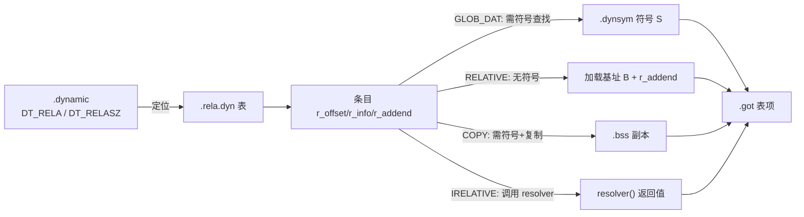

# 详解ELF文件(十四).rela.dyn节

.rela.dyn节是ELF（Executable and Linkable Format）文件格式中的一个重要组成部分，属于动态链接重定位表的一种。它在动态链接过程中发挥着关键作用，是 64 位系统上动态数据重定位的实际形式。

## 1. 基本概念

.rela.dyn节是动态链接重定位表的一部分，用于存储数据引用的重定位信息。"rela"表示它使用的是RELA类型的重定位条目，与 [[13.rel.dyn节|.rel.dyn]] 节使用的REL类型不同，RELA类型包含了显式的加数（addend）字段。

.rela.dyn 是"在运行时处理的 [[12.rela.data节|.rela.data]]"——两者数据结构完全相同（`Elf64_Rela`），区别仅在于：
- .rela.data 在**链接时**处理，处理完后丢弃（无 `SHF_ALLOC`）
- .rela.dyn 在**程序加载时**由动态链接器处理，始终驻留内存（有 `SHF_ALLOC`）

.rela.dyn 节的 `sh_type` 为 `SHT_RELA`（值 4），`sh_flags` 包含 `SHF_ALLOC`（值 2），`sh_link` 指向 [[15.dynsym节|.dynsym]]（动态符号表），`sh_info` 通常为 0（与 .rela.data 不同，后者 sh_info 指定被重定位的节）。

## 2. 与.rel.dyn的区别

.rel.dyn和.rela.dyn都是用于动态链接的重定位表，但它们有以下关键区别：

1. **数据结构不同**：
    - .rel.dyn使用REL类型的重定位条目，包含两个字段：r_offset和r_info（8/16字节）
    - .rela.dyn使用RELA类型的重定位条目，在REL的基础上增加了一个r_addend字段（12/24字节）
2. **addend 来源**：
    - REL：隐式 addend，动态链接器在执行重定位前读取 r_offset 处当前值
    - RELA：显式 r_addend 字段，被修正内存可为任意初始值（通常为全零）
3. **内存占用**：
    - RELA 类型由于包含额外的 addend 字段，每个条目相比 REL 类型多 4（32位）/ 8（64位）字节
    - 在64位系统中，`Elf64_Rela` 结构体大小为 **24字节**，`Elf64_Rel` 为 16 字节
4. **架构偏好**：
    - x86-64、AArch64、RISC-V、PowerPC64 等主流 64 位架构使用 .rela.dyn
    - i386（x86 32位）、部分旧 ARM32 使用 .rel.dyn

| | .rel.dyn | .rela.dyn |
|---|---|---|
| sh_type | `SHT_REL` = 9 | `SHT_RELA` = 4 |
| 条目大小（32位） | 8 字节 | 12 字节 |
| 条目大小（64位） | 16 字节 | **24 字节** |
| addend 来源 | 隐式（读取 r_offset 处） | 显式 r_addend 字段 |
| 典型架构 | i386、ARM32 | **x86-64**、AArch64、RISC-V |

## 3. 数据结构（完整字段偏移）

.rela.dyn节由 `Elf32_Rela` 或 `Elf64_Rela` 结构体数组组成，具体结构如下：

### 32 位 ELF（Elf32_Rela，12 字节）

```c
typedef struct {
    Elf32_Addr  r_offset;   // 偏移 0，大小 4B：需要重定位的虚拟地址（通常是GOT中的地址）
    Elf32_Word  r_info;     // 偏移 4，大小 4B：重定位类型和符号表索引
    Elf32_Sword r_addend;   // 偏移 8，大小 4B：有符号加数
} Elf32_Rela;               // 总大小：12 字节
```

### 64 位 ELF（Elf64_Rela，24 字节）

```c
typedef struct {
    Elf64_Addr   r_offset;   // 偏移 0，大小 8B：需要重定位的虚拟地址
    Elf64_Xword  r_info;     // 偏移 8，大小 8B：重定位类型和符号表索引
    Elf64_Sxword r_addend;   // 偏移 16，大小 8B：有符号加数（可为负）
} Elf64_Rela;                // 总大小：24 字节
```

| 字段 | 字节偏移（64位） | 大小 | 说明 |
|---|---|---|---|
| `r_offset` | 0 | 8 | 被修正的运行时**虚拟地址**（非节内偏移） |
| `r_info` | 8 | 8 | 高 32 位=符号索引（→.dynsym），低 32 位=类型 |
| `r_addend` | 16 | 8 | 有符号加数，直接参与公式计算 |

各字段说明：

- **r_offset**：需要重定位的位置，对于可执行文件或共享库，通常是 [[17.got节|.got]] 表中的地址；动态链接器直接将其作为内存写入地址
- **r_info**：包含重定位类型和符号表索引（符号索引指向 [[15.dynsym节|.dynsym]]）；64 位下 `ELF64_R_SYM(i)=i>>32`、`ELF64_R_TYPE(i)=i&0xffffffff`
- **r_addend**：加数，用于计算重定位值；对于 `R_X86_64_RELATIVE`，r_addend 是目标的"链接时虚拟地址"（加上加载基址 B 后得到运行时地址）

## 重定位计算记号体系

所有重定位公式均使用 System V gABI 定义的统一记号：

| 记号 | 含义 |
|---|---|
| **S** | Symbol value — 被引用符号的运行时地址（动态链接器解析） |
| **A** | Addend — r_addend 字段的值 |
| **P** | Place — r_offset 处的运行时虚拟地址 |
| **B** | Base address — 模块的实际加载基址（PIE/共享库在 ASLR 下每次不同） |
| **G** | GOT entry offset — 符号的 GOT 条目相对于 GOT 起始的偏移 |
| **GOT** | .got 节的地址 |
| **L** | PLT 条目地址 |
| **Z** | 符号大小 |
| **DTPOFF** | TLS 动态线程指针偏移 |
| **TPOFF** | TLS 线程指针偏移（Initial Exec 模型） |

## 4. 完整重定位类型表（x86-64 .rela.dyn）

### 动态重定位类型（.rela.dyn 中实际出现的类型）

| 类型 | 值 | 字段 | 计算公式 | 详细说明 |
|---|---|---|---|---|
| `R_X86_64_NONE` | 0 | — | 无 | 占位，无效果 |
| `R_X86_64_64` | 1 | word64 | S + A | 64 位绝对地址（共享库数据段中的绝对指针） |
| `R_X86_64_COPY` | 5 | — | 复制 | **仅限可执行文件**：从共享库复制变量到本地 BSS |
| `R_X86_64_GLOB_DAT` | 6 | word64 | S | 外部全局变量绑定：把符号地址写入 GOT 条目 |
| `R_X86_64_RELATIVE` | 8 | word64 | B + A | **最常见**：PIE/共享库相对重定位，无需符号查找 |
| `R_X86_64_DTPMOD64` | 16 | word64 | TLS 模块索引 | TLS General Dynamic 模型：模块索引 |
| `R_X86_64_DTPOFF64` | 17 | word64 | DTPOFF | TLS General Dynamic 模型：动态偏移 |
| `R_X86_64_TPOFF64` | 18 | word64 | S + A − TPOFF | TLS Initial Exec 模型：线程指针偏移 |
| `R_X86_64_TPOFF32` | 23 | word32 | S + A − TPOFF | TLS Local Exec 模型（32位） |
| `R_X86_64_IRELATIVE` | 37 | word64 | indirect(B+A) | IFUNC 间接函数，调用 resolver 写入结果 |

### 各类型深度解析

#### R_X86_64_RELATIVE（最高频）

```
*P = B + A
```

- **符号索引 = 0**（无需查符号），r_info 低 32 位 = 8
- addend（r_addend）= 链接时确定的"如果从地址 0 加载，目标值应该是多少"
- B 是实际加载基址（ASLR 随机化后的值）
- **典型来源**：编译器生成的指向本模块内部数据/函数的指针（字符串指针、vtable、函数指针数组等）

#### R_X86_64_GLOB_DAT（外部符号绑定）

```
*GOT_entry = S
```

- 动态链接器在 .dynsym 中按符号名查找，找到对应的共享库并解析地址
- 写入 r_offset 指向的 GOT 槽（4/8 字节）
- 后续代码通过 `mov reg, [GOT + offset]` 间接获取变量地址

#### R_X86_64_COPY（数据复制，可执行文件专用）

```
memcpy(r_offset, &symbol_in_lib, sizeof(symbol))
```

- **只出现在 ET_EXEC 或 PIE (ET_DYN) 类型的可执行文件中**，绝不出现在共享库
- 执行顺序：在所有其他重定位完成后再执行 COPY（需要先找到 lib 中符号的地址）
- 目的：非 PIC 代码直接用绝对地址访问数据，必须将数据"搬"到可执行文件自身内存空间
- 缺陷：若多个可执行文件各自 COPY 同一变量，内存中存在多副本；共享库的全局变量变成了可执行文件的私有副本

**COPY 与 GLOB_DAT 的选择**：
- 变量是**外部**的，且可执行文件是**非 PIC**：必须用 COPY
- 变量是**外部**的，且可执行文件是 **PIE/PIC**：用 GLOB_DAT，通过 GOT 间接访问
- 变量是**本模块内部**的（共享库）：用 RELATIVE

#### R_X86_64_IRELATIVE（IFUNC 间接函数）

```
*P = (*(func_ptr_t)(B + A))()
```

- addend（r_addend）= resolver 函数的链接时地址（B + A = 运行时 resolver 地址）
- 动态链接器**调用**该 resolver 函数，把返回值写入 `*P`（通常是 GOT 中的函数指针）
- 必须在所有 RELATIVE 重定位之后处理，因为 resolver 可能依赖已完成的 RELATIVE

#### TLS 相关类型

| 类型 | TLS 访问模型 | 说明 |
|---|---|---|
| `R_X86_64_DTPMOD64` + `R_X86_64_DTPOFF64` | General Dynamic (GD) | 一对 GOT 条目，适用于跨 DSO 的 TLS |
| `R_X86_64_TPOFF64` / `_TPOFF32` | Initial Exec (IE) / Local Exec (LE) | 效率更高，仅限已知线程偏移 |

## 5. 工作原理



.rela.dyn节的工作流程如下：

1. 程序加载时，动态链接器读取 [[18.dynamic节|.dynamic]] 节中的信息，找到.rela.dyn节的位置（`DT_RELA` 给出地址，`DT_RELASZ` 给出总字节大小）
2. 按顺序遍历 .rela.dyn 中的每个条目：
   - 先处理所有 RELATIVE 类型（直接写 `B + A`，速度最快）
   - 再处理 GLOB_DAT、64 等需要符号查找的类型
   - COPY 类型在所有其他类型完成后执行
   - IRELATIVE 类型最后执行（需要 RELATIVE 先完成）
3. 根据重定位类型、符号信息和加数，计算正确的地址值
4. 将计算结果写入r_offset指定的位置（通常是 [[17.got节|.got]] 表中的条目）

## 6. 常见应用场景

.rela.dyn节主要处理以下类型的数据重定位：

1. **全局变量引用**：对外部定义的全局变量的引用（`R_X86_64_GLOB_DAT`）
2. **PIE 内部地址修正**：PIE 程序中所有内部指针（`R_X86_64_RELATIVE`）
3. **共享库基址修正**：共享库加载到非预期地址时的所有内部指针（`R_X86_64_RELATIVE`）
4. **TLS 变量绑定**：线程本地存储的 GOT 条目初始化（DTPMOD64 / TPOFF64）
5. **IFUNC 解析**：glibc 等优化库的函数实现选择（`R_X86_64_IRELATIVE`）

例如：

```c
// file1.c（编译为共享库，加载到任意地址）
extern int global_var;
int *ptr = &global_var;  // 运行时产生 GLOB_DAT 重定位 → .rela.dyn

static int local_var = 42;
int *local_ptr = &local_var;  // 运行时产生 RELATIVE 重定位 → .rela.dyn

// file2.c
int global_var = 42;
```

## 7. 架构相关性

不同的处理器架构对 .rela.dyn 和 .rel.dyn 的使用有所不同：

| 架构 | 动态重定位格式 | 主要相对重定位类型 |
|---|---|---|
| x86-64（AMD64） | `.rela.dyn`（RELA） | `R_X86_64_RELATIVE`（8） |
| AArch64 | `.rela.dyn`（RELA） | `R_AARCH64_RELATIVE`（1027） |
| RISC-V 64 | `.rela.dyn`（RELA） | `R_RISCV_RELATIVE` |
| PowerPC64 | `.rela.dyn`（RELA） | `R_PPC64_RELATIVE` |
| i386 | `.rel.dyn`（REL） | `R_386_RELATIVE`（8） |
| ARM 32 | `.rel.dyn`（REL） | `R_ARM_RELATIVE` |
| MIPS | `.rel.dyn`（特殊）| `R_MIPS_REL32`（无 RELATIVE 类型，特殊处理） |

## 8. 实战：查看 .rela.dyn

```bash
# 查看所有重定位节（主要就是 .rela.dyn 和 .rela.plt）
readelf -r a.out

# 查看 .dynamic 节确认 DT_RELA 标签
readelf -d a.out

# 仅查看 .rela.dyn 节（通过 -j 限定节名）
objdump -R a.out            # -R：显示动态重定位

# 查看节头表确认 .rela.dyn 属性（sh_type=SHT_RELA, sh_flags 含 SHF_ALLOC）
readelf -S a.out
```

```text
# 示例输出（代表性，非本机实跑）
Relocation section '.rela.dyn' at offset 0x19688 contains 1301 entries:
  Offset          Info           Type           Sym. Value    Sym. Name + Addend
000000200de8  000000000008 R_X86_64_RELATIVE                    6e0
000000200df0  000000000008 R_X86_64_RELATIVE                    6a0
000000200fc8  000200000006 R_X86_64_GLOB_DAT 0000000000000000 _ITM_deregisterTMClone + 0
000000201008  000600000006 R_X86_64_GLOB_DAT 0000000000000000 __cxa_finalize@GLIBC_2.2.5 + 0
```

注意前两条 `R_X86_64_RELATIVE` 的 `Sym. Name` 为空——它们不依赖符号，只把加载基址加到 Addend（`0x6e0`、`0x6a0`）上。

```text
# 示例：readelf -d 查看 DT_RELA 相关标签（代表性，非本机实跑）
$ readelf -d a.out | grep -E 'RELA|REL[^A]'
 0x0000000000000007 (RELA)               0x400388
 0x0000000000000008 (RELASZ)             216 (bytes)
 0x0000000000000009 (RELAENT)            24 (bytes)
 0x0000000000000002 (PLTRELSZ)           48 (bytes)
 0x0000000000000014 (PLTREL)             RELA
 0x0000000000000017 (JMPREL)             0x400450
```

**字段说明**：
- `RELA 0x400388`：.rela.dyn 节在内存中的地址
- `RELASZ 216`：.rela.dyn 总字节数（= 9 条 × 24 字节）
- `RELAENT 24`：每条 RELA 条目大小（`sizeof(Elf64_Rela) = 24`）
- `PLTREL RELA`：.rela.plt 也使用 RELA 格式
- `JMPREL 0x400450`：.rela.plt 的地址（PLT 重定位单独存放）

## 9. RELR：现代压缩格式（.relr.dyn）

现代大型 PIE 程序（如 Chrome）可能有**几十万条** `R_X86_64_RELATIVE`，每条 24 字节，占用数 MB 文件空间。RELR 格式专门压缩这类条目：

### RELR 编码原理

```
字段宽度 = pointer_size（32位=4，64位=8）

偶数条目（最低位=0）：一个需要 RELATIVE 重定位的地址，同时设置 base = 此地址 + pointer_size
奇数条目（最低位=1）：位图，位 k（k≥1）=1 表示 (base + (k-1)*pointer_size) 处也需要重定位
                       处理完后 base += (64-1)*pointer_size（跳到下一个 64 指针的窗口）
```

### 压缩效果示例

```
# 传统 .rela.dyn 中 4 条连续 RELATIVE（64位，每条 24B）：
0x1000  R_X86_64_RELATIVE  0x800
0x1008  R_X86_64_RELATIVE  0x900
0x1010  R_X86_64_RELATIVE  0xA00
0x1018  R_X86_64_RELATIVE  0xB00
# 合计 96 字节

# RELR 编码后（每条 8B）：
0x1000   （偶数，表示 0x1000 需要重定位，base = 0x1008）
0b0111   （奇数位图，位1=1→0x1008，位2=1→0x1010，位3=1→0x1018）
# 合计 16 字节，压缩率 83%
```

实际效果：65 个连续 RELATIVE 在 RELA 中需 `24×65=1560` 字节，在 RELR 中仅需约 24 字节，压缩率 ~98%。

### 工具链支持

| 工具/库 | 支持版本 | 启用选项 |
|---|---|---|
| LLD | 全面支持 | `--pack-dyn-relocs=relr` |
| GNU binutils ld | 2.38+（2022） | `-z pack-relative-relocs` |
| glibc | 2.36+（2022） | 自动识别（须 binutils 2.38 生成） |
| musl libc | 1.2.3+（2022） | 自动识别 |
| Android bionic | 较早支持 | 默认启用 |

```text
# 启用 RELR 后的 readelf -d 输出（代表性，非本机实跑）
$ readelf -d a.out | grep RELR
 0x0000000000000023 (RELRSZ)             24 (bytes)
 0x0000000000000024 (RELR)               0x403a80
 0x0000000000000025 (RELRENT)            8 (bytes)
```

RELR 不替代 .rela.dyn，仅把其中的 RELATIVE 类型单独压缩；GLOB_DAT、COPY、IRELATIVE 等类型仍保留在 .rela.dyn 中。动态链接器处理顺序：先 RELR → 再 RELA/REL → 最后 PLT。

## 10. 与其他节的关系

- [[15.dynsym节|.dynsym]]：动态符号表，包含重定位所需的符号信息（.rela.dyn 中 r_info 的符号索引即指向此表）
- [[16.dynstr节|.dynstr]]：动态符号字符串表，包含 .dynsym 中符号的名称字符串
- [[17.got节|.got]]：全局偏移表，重定位的主要目标位置（GOT[0]/GOT[1]/GOT[2] 为特殊用途）
- [[18.dynamic节|.dynamic]]：包含 .rela.dyn 节位置信息（`DT_RELA`/`DT_RELASZ`）的动态段，是动态链接器的"目录"
- [[19.rel.plt节|.rel.plt]] / [[20.rela.plt节|.rela.plt]]：函数重定位表（PLT 专用），与 .rela.dyn 并列

## 11. 安全与性能考量

### 安全角度

- **RELRO**（Relocation Read-Only）：`-z relro -z now` 让动态链接器在完成所有 .rela.dyn 和 .rela.plt 重定位后，将 .got（及 .got.plt）重新 `mprotect` 为只读，防止 GOT 覆盖攻击。
- **Full RELRO vs Partial RELRO**：`-z now`（Full RELRO）禁用懒绑定，在启动时一次性完成所有 PLT 重定位，之后整个 GOT 变为只读；`-z relro`（Partial RELRO）只读保护数据 GOT，PLT GOT 仍可写。
- **ASLR + PIE**：ASLR 使每次加载的基址 B 随机，攻击者即便知道 .rela.dyn 中的 addend 也无法预测运行时地址。

### 性能角度

- **启动时间**：.rela.dyn 中 RELATIVE 条目数量越多，程序启动越慢（需逐一修正内存）。RELR 压缩减少了内存访问次数，显著改善启动时间。
- **共享库合并**：多个进程共享同一 .so 的只读页（.text、.rodata），但 .got 是各进程私有的（通过 Copy-On-Write），因此 GLOB_DAT 重定位结果每个进程独立存储。
- **BIND_NOW vs 懒绑定**：使用 `LD_BIND_NOW=1` 或 `-z now` 在启动时解析所有符号（减少首次调用延迟），代价是启动时间增加（所有 GLOB_DAT 在 main 前完成）。

## 总结

.rela.dyn节作为现代ELF文件动态链接机制的重要组成部分，特别是在64位系统中被广泛使用，确保了程序能够正确引用其他模块中的数据符号，是实现位置无关代码（PIC）和动态链接的关键技术之一。

核心要点回顾：
- 结构体：`Elf64_Rela`，**每条 24 字节**（8B r_offset + 8B r_info + 8B r_addend）；
- x86-64/AArch64 使用 .rela.dyn（RELA），i386/ARM32 使用 .rel.dyn（REL）；
- 最常见的三种类型：`R_X86_64_RELATIVE`（B+A，无符号）、`R_X86_64_GLOB_DAT`（S，需符号）、`R_X86_64_COPY`（复制，仅可执行文件）；
- `R_X86_64_IRELATIVE` 支持 GNU IFUNC，resolver 被调用返回最优函数实现地址；
- 现代优化：RELR（.relr.dyn）压缩 RELATIVE 类型，节省最多 ~98% 空间，binutils 2.38+ 和 LLD 均支持；
- 安全加固：Full RELRO（-z relro -z now）在完成 .rela.dyn 后将 .got 设为只读，防 GOT 覆盖攻击；
- 动态链接器通过 .dynamic 节的 `DT_RELA`/`DT_RELASZ`/`DT_RELAENT` 定位并处理 .rela.dyn。

## 相关阅读

- **无加数版本**：[[13.rel.dyn节]]
- **函数重定位**：[[20.rela.plt节]]
- **符号与名字**：[[15.dynsym节]]、[[16.dynstr节]]
- **目标与驱动**：[[17.got节]]、[[18.dynamic节]]
- 上一篇：[[13.rel.dyn节]] ｜ 下一篇：[[15.dynsym节]]
