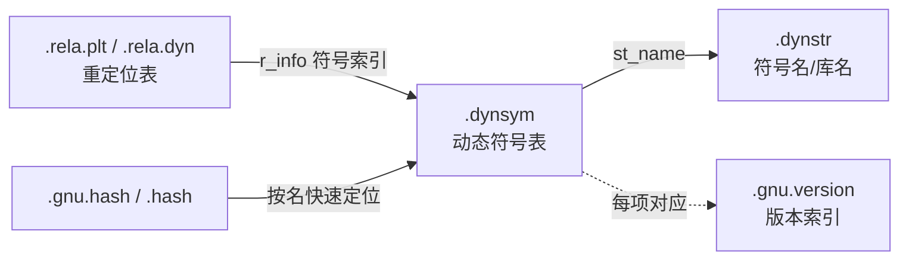
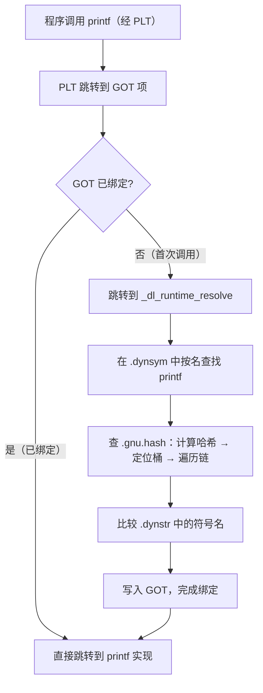

# 详解ELF文件(十五).dynsym节

.dynsym节是ELF（Executable and Linkable Format）文件格式中的动态符号表，用于存储动态链接过程中需要的符号信息。它是动态链接机制的核心组成部分之一。

## 1. 基本概念

.dynsym节是ELF文件中的动态符号表（Dynamic Symbol Table），专门用于动态链接过程中的符号导入和导出。与 [[09.symtab节|.symtab节]] 不同，.dynsym节在程序运行时依然存在于内存中，为动态链接器提供必要的符号信息。

每个 ELF 可执行文件或共享库若依赖动态链接，必须包含 .dynsym，而 .symtab 则是可选的（可被 strip 删除）。

## 2. 与.symtab的区别

.dynsym与.symtab的主要区别包括：

| 对比项 | .symtab | .dynsym |
|---|---|---|
| 符号范围 | 全部符号（本地+全局+静态+调试） | 仅动态链接所需符号（是 .symtab 的子集） |
| 节标志（sh_flags） | 无 SHF_ALLOC | 有 SHF_ALLOC，运行时驻留内存 |
| sh_type | SHT_SYMTAB | SHT_DYNSYM |
| 对应字符串表 | .strtab | .dynstr |
| 可被 strip 删除 | 是（strip --strip-debug / -s） | 否（动态链接器运行时必需） |
| 主要用途 | 静态链接、调试、nm/gdb/perf | 动态链接器运行时符号解析、dlsym |
| 含本地（STB_LOCAL）符号 | 是 | 否（第 0 项空符号除外） |
| 哈希加速 | 无 | 有 .gnu.hash / .hash 索引 |

> **子集关系**：在可执行文件和共享库中，.dynsym 中的每个符号通常也出现在 .symtab 中（.symtab 是超集）；但当 .symtab 被 strip 删除后，.dynsym 仍单独存在。

## 3. 数据结构

.dynsym节由Elf32_Sym或Elf64_Sym结构体数组组成（与 .symtab 使用完全相同的结构体），每个条目在 32 位下占 16 字节，在 64 位下占 24 字节：

```c
/* 32 位：字段顺序 name, value, size, info, other, shndx */
typedef struct {
    Elf32_Word    st_name;    // 偏移 0,  4字节：符号名在 .dynstr 中的偏移
    Elf32_Addr    st_value;   // 偏移 4,  4字节：符号的值（地址）
    Elf32_Word    st_size;    // 偏移 8,  4字节：符号大小（字节）
    unsigned char st_info;    // 偏移12,  1字节：类型+绑定（高4|低4位）
    unsigned char st_other;   // 偏移13,  1字节：可见性（低2位）
    Elf32_Half    st_shndx;   // 偏移14,  2字节：所属节索引
} Elf32_Sym;                  // 共 16 字节

/* 64 位：字段顺序 name, info, other, shndx, value, size（顺序与32位不同！） */
typedef struct {
    Elf64_Word    st_name;    // 偏移 0,  4字节：符号名在 .dynstr 中的偏移
    unsigned char st_info;    // 偏移 4,  1字节：类型+绑定
    unsigned char st_other;   // 偏移 5,  1字节：可见性
    Elf64_Half    st_shndx;   // 偏移 6,  2字节：所属节索引
    Elf64_Addr    st_value;   // 偏移 8,  8字节：符号的值（虚拟地址）
    Elf64_Xword   st_size;    // 偏移16,  8字节：符号大小
} Elf64_Sym;                  // 共 24 字节
```

> **字段顺序差异**：64 位把单字节的 `st_info`/`st_other` 提前到 `st_name` 之后，使 `st_value` 的偏移恰好对齐到 8 字节边界，零填充。

各字段说明：

- **st_name**：符号名称在 [[16.dynstr节|.dynstr]]（动态字符串表）中的偏移量（字节）
- **st_value**：在共享库和可执行文件中是符号的虚拟地址；对于 STT_TLS 符号是 TLS 偏移
- **st_size**：符号大小（字节），0 表示未知
- **st_info**：高 4 位=绑定属性（STB_*），低 4 位=符号类型（STT_*）
- **st_other**：低 2 位=可见性（STV_*），高 6 位保留置 0
- **st_shndx**：符号所在节的索引；SHN_UNDEF 表示未定义（导入），具体节号表示已定义（导出）

> 注意：.dynsym 的 st_name 索引的是 [[16.dynstr节|.dynstr]]，而 .symtab 的 st_name 索引的是 .strtab——这是两者除"是否 ALLOC"外的又一关键区别。

## 4. 符号类型和绑定属性

st_info字段包含了符号的类型和绑定属性信息，可以通过以下宏来访问：

```c
/* ELF32 与 ELF64 宏定义完全相同 */
#define ELF32_ST_BIND(i)   ((i)>>4)
#define ELF32_ST_TYPE(i)   ((i)&0xf)
#define ELF32_ST_INFO(b,t) (((b)<<4)+((t)&0xf))
#define ELF64_ST_BIND(i)   ((i)>>4)
#define ELF64_ST_TYPE(i)   ((i)&0xf)
#define ELF64_ST_INFO(b,t) (((b)<<4)+((t)&0xf))
```

### 绑定属性（STB_*）完整列表

| 值 | 宏 | .dynsym 中的意义 |
|---|---|---|
| 0 | STB_LOCAL | 仅 .dynsym 第 0 项（空符号）；正常动态符号不应是 LOCAL |
| 1 | STB_GLOBAL | 普通导出/导入符号，动态链接的主体 |
| 2 | STB_WEAK | 弱符号：若无强定义则使用弱定义；动态链接器对弱引用未解析时设值为 0 |
| 10 | STB_GNU_UNIQUE | GNU 扩展：进程全局唯一实例（用于 C++ 模板静态成员等场景） |

> .dynsym 中一般不含 STB_LOCAL 符号（本地符号对动态链接无意义），第 0 项是强制的空符号（所有字段为零）。

### 符号类型（STT_*）在动态链接中的意义

| 值 | 宏 | 动态链接意义 |
|---|---|---|
| 0 | STT_NOTYPE | 类型未指定（常见于汇编导出符号） |
| 1 | STT_OBJECT | 数据对象，copy relocation（R_X86_64_COPY）的典型目标 |
| 2 | STT_FUNC | 函数；链接器为 .so 中的 STT_FUNC 符号自动创建 PLT 条目 |
| 3 | STT_SECTION | 节符号（.dynsym 中罕见） |
| 4 | STT_FILE | 源文件名（.dynsym 中罕见） |
| 5 | STT_COMMON | 公共块（uninitialized common block） |
| 6 | STT_TLS | TLS 变量；动态链接器通过特殊重定位类型处理，不走普通 GOT |
| 10 | STT_GNU_IFUNC | GNU 间接函数：运行时 resolver 返回实际实现地址（如 glibc 的 `memcpy` 选最优实现） |

**STT_FUNC 的特殊处理**：链接器在遇到对共享库 STT_FUNC 符号的引用时，自动生成 PLT（Procedure Linkage Table）条目和对应的 GOT 项。第一次调用时触发惰性绑定，动态链接器解析符号地址并写入 GOT，后续调用直接跳转，无需再次解析。

**STT_OBJECT 与 copy relocation**：可执行文件引用共享库中的全局变量（STT_OBJECT）时，静态链接器在 .bss 段分配同等大小空间，生成 `R_X86_64_COPY` 重定位记录，动态链接器启动时将原始变量内容复制过来，可执行文件内所有引用指向本地副本。

### 可见性（STV_*）对动态导出的影响

| 值 | 宏 | 对 .dynsym 的影响 |
|---|---|---|
| 0 | STV_DEFAULT | 正常：STB_GLOBAL/STB_WEAK 符号出现在 .dynsym，可被外部访问与抢占 |
| 1 | STV_INTERNAL | 视为最严格隐藏，链接到 .so 后转为 STB_LOCAL，不导出 |
| 2 | STV_HIDDEN | 不导出到 .dynsym；源文件内引用绑定到本文件定义，不可被抢占 |
| 3 | STV_PROTECTED | 出现在 .dynsym（可被外部看到），但本模块内引用不可被外部定义抢占 |

> **`-fvisibility=hidden` 编译选项**：将所有符号默认标记为 STV_HIDDEN，只有显式 `__attribute__((visibility("default")))` 的符号才出现在 .dynsym，是缩小 .dynsym 体积、提升动态链接性能的推荐做法。

## 结构图示

.dynsym 处于动态链接的中心，向下索引名字、被哈希表加速、被重定位表与版本表引用：



## 5. 作用和功能

.dynsym节的主要作用包括：

1. **符号导入导出**：
    - 未定义的符号（符号引用）称为导入符号（st_shndx = SHN_UNDEF）
    - 已定义的符号（符号定义）称为导出符号（st_shndx 为有效节号）
2. **动态链接支持**：
    - 为动态链接器提供符号解析所需的信息
    - 与 [[14.rela.dyn节|.rela.dyn]] 和 [[20.rela.plt节|.rela.plt]] 等重定位节配合使用
3. **运行时符号查找**：
    - dlsym等函数通过.dynsym节查找符号
    - 与 [[16.dynstr节|.dynstr]]、[[37.hash节|.gnu.hash]] 等节协同工作

## 6. 哈希表加速符号查找

动态链接器在运行时需要频繁按名字查找符号。若逐条扫描 .dynsym，时间复杂度为 O(n)，性能不佳。ELF 提供两种哈希表加速：

### 传统哈希表（.hash）

`SHT_HASH` 节，结构为：

```
[ nbucket ][ nchain ]
[ bucket[0..nbucket-1] ]     ← 哈希槽数组
[ chain[0..nchain-1]   ]     ← 与 .dynsym 等长的链表索引
```

哈希函数：ELF 标准的 `elf_hash()`，将符号名映射到桶下标。

### GNU 哈希表（.gnu.hash）

`SHT_GNU_HASH` 节，引入了 Bloom 过滤器（用于快速排除不存在的符号），桶链更紧凑，仅包含已排序的已定义符号（导入符号 SHN_UNDEF 不纳入），平均查找速度比传统 .hash 快数倍，是 glibc 2.6+ 的默认选项。

```bash
readelf -d a.out | grep HASH    # 查看使用哪种哈希表
readelf --gnu-hash-dump a.out   # 查看 .gnu.hash 内容（某些 readelf 版本支持）
```

## 7. 实际应用示例

使用readelf命令可以查看.dynsym节的内容：

```bash
readelf --dyn-syms a.out        # 专门查看动态符号表（推荐）
readelf -s a.out                # -s 会同时显示 .dynsym 和 .symtab
nm -D a.out                     # 仅列出动态符号（等价于 --dynamic）
objdump -T a.out                # 动态符号表（格式略有不同）
```

```text
# 示例输出（代表性，非本机实跑）
$ readelf --dyn-syms libc.so.6

Symbol table '.dynsym' contains 2415 entries:
   Num:    Value          Size Type    Bind   Vis      Ndx Name
     0: 0000000000000000     0 NOTYPE  LOCAL  DEFAULT  UND
     1: 0000000000000000     0 OBJECT  GLOBAL DEFAULT  UND __libc_stack_end@GLIBC_2.1 (36)
     2: 0000000000000000     0 OBJECT  GLOBAL DEFAULT  UND _rtld_global@GLIBC_PRIVATE (37)
     4: 0000000000000000     0 NOTYPE  WEAK   DEFAULT  UND _IO_stdin_used
   100: 0000000000064e10   163 FUNC    GLOBAL DEFAULT   14 printf@@GLIBC_2.2.5
   101: 0000000000064e10   163 FUNC    GLOBAL DEFAULT   14 printf@GLIBC_2.2.5
```

`Name` 列里的 `@GLIBC_2.1` 后缀正是符号版本信息（来自 .gnu.version 系列节），`UND` 表示该符号在本文件中未定义、需由动态链接器解析。

第 0 号条目固定是全零的空符号（null entry），所有字段为零，这是 ELF 规范强制要求的。

## 8. 符号版本控制

在支持符号版本控制的系统中，.dynsym节还与以下节区配合使用：

### 相关节区

| 节区 | 类型 | 作用 |
|---|---|---|
| .gnu.version | SHT_GNU_versym | 与 .dynsym 一一对应的数组，存每个符号的版本 ID（16 位整数） |
| .gnu.version_d | SHT_GNU_verdef | 本库对外声明的版本树（由哪些版本组成，各版本定义了哪些符号） |
| .gnu.version_r | SHT_GNU_verneed | 依赖库的版本需求（需要 libc.so.6 提供 GLIBC_2.17 版本等） |

### 版本表示法

```text
name@VERSION      # 非默认（旧）版本，仅供运行时向后兼容
name@@VERSION     # 当前默认版本，静态链接时优先绑定到此版本
```

### 在 C 中标注版本（.symver 指令）

```c
// 通过内联汇编 .symver 指令标注符号版本
__asm__(".symver old_printf, printf@GLIBC_2.2.5");     // 向后兼容版本
__asm__(".symver new_printf, printf@@GLIBC_2.17");     // 当前默认版本
```

### readelf 查看版本信息

```bash
readelf -V a.out           # 查看 .gnu.version_r（版本需求）
readelf --dyn-syms a.out   # 符号名后的 @VERSION 来自 .gnu.version
```

## 9. .dynsym 与符号可见性控制实战

控制共享库哪些符号进入 .dynsym 是库开发的重要实践：

### 方法一：编译器属性

```c
// 导出（默认）：进入 .dynsym
__attribute__((visibility("default"))) int public_api(void) { ... }

// 隐藏：不进入 .dynsym
__attribute__((visibility("hidden"))) int internal_impl(void) { ... }
```

### 方法二：全局默认隐藏 + 显式导出

```bash
# 编译时隐藏所有符号，再显式标注导出符号
gcc -fvisibility=hidden -o libfoo.so foo.o
```

### 方法三：版本脚本

```text
# libfoo.map：精确控制哪些符号导出及其版本
LIBFOO_1.0 {
    global:
        foo_init;
        foo_process;
    local:
        *;          # 其余全部不导出
};
```

```bash
gcc -shared -Wl,--version-script=libfoo.map -o libfoo.so foo.o
```

### 实际效果对比

```bash
# 查看 .dynsym 的条目数（越少加载越快）
readelf --dyn-syms libfoo.so | wc -l

# 验证隐藏符号不在 .dynsym 中
nm -D libfoo.so | grep internal   # 应无输出
nm libfoo.so | grep internal      # 在 .symtab 中仍可见（小写 t 等）
```

## 10. 动态链接符号解析流程

当程序调用共享库函数时，动态链接器的符号查找流程为：



## 相关阅读

- **静态符号表对比**：[[09.symtab节]]
- **名字来源**：[[16.dynstr节]]
- **加速查找**：[[37.hash节]]
- **配套重定位**：[[14.rela.dyn节]]、[[20.rela.plt节]]
- **符号版本**：[[38.gnu.version节]]、[[39.gnu.version_r节]]
- 上一篇：[[14.rela.dyn节]] ｜ 下一篇：[[16.dynstr节]]
