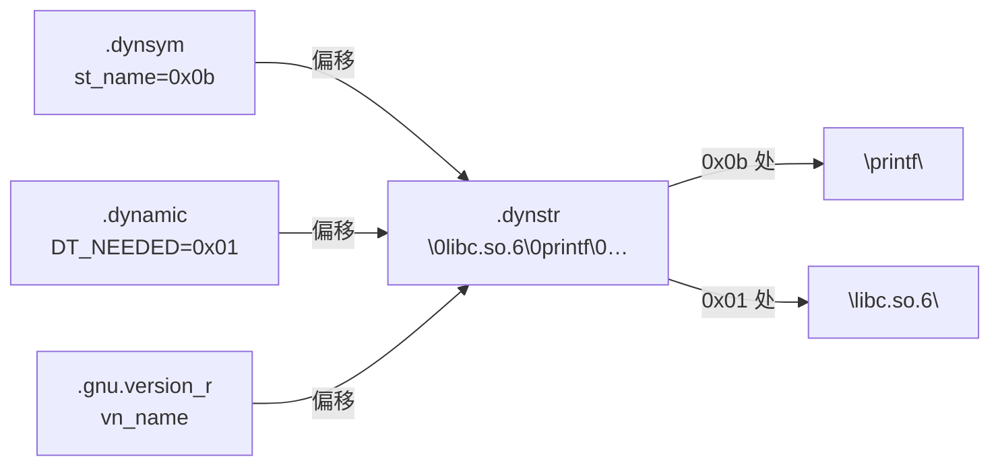

# 详解ELF文件(十六).dynstr节

.dynstr节（Dynamic String Table）是ELF（Executable and Linkable Format）文件中的动态字符串表，用于存储动态链接过程中所需的各种字符串，如动态符号名称、共享库名称和运行时搜索路径等。它是动态链接机制不可或缺的组成部分。

## 1. 基本概念

.dynstr节是一个字符串表，结构与 [[10.shstrtab节|.shstrtab]]、.strtab 完全相同：所有字符串连续存放、各以空字符 `\0` 结尾、索引即偏移量、首字节为空字符串。

它与那两个字符串表的根本区别在于**服务对象与内存属性**：

- 服务于**动态链接**（被 [[15.dynsym节|.dynsym]]、[[18.dynamic节|.dynamic]] 引用）
- 被标记为 `SHF_ALLOC`，因此在程序运行时**会加载进内存**——动态链接器必须在运行时读取它

.dynstr 节在节头表中的 `sh_type = SHT_STRTAB`，`sh_flags = SHF_ALLOC`（通常无 SHF_WRITE，因为不需要运行时修改）。对应的 .dynamic 节中有 `DT_STRTAB` 条目指向 .dynstr 的运行时地址，`DT_STRSZ` 条目记录其字节大小。

## 2. 存储的内容

.dynstr节主要存储以下几类字符串：

1. **动态符号名称**：[[15.dynsym节|.dynsym]] 中每个符号的名字，由其 `st_name` 字段按偏移索引到这里
2. **共享库名称**：[[18.dynamic节|.dynamic]] 中 `DT_NEEDED` 条目所需的依赖库名，如 `libc.so.6`
3. **SONAME**：`DT_SONAME` 指定的本库规范名（Shared Object NAME）
4. **运行时搜索路径**：`DT_RPATH` / `DT_RUNPATH` 指定的库搜索路径
5. **符号版本名称**：与 [[38.gnu.version节|.gnu.version]] 系列配合的版本字符串，如 `GLIBC_2.2.5`

这些字符串类型共享同一个 .dynstr 字节数组，通过不同的偏移值加以区分。

## 3. 字符串表结构

### 3.1 基本布局

```
偏移量  内容                说明
0x00    \0                  空字符串（索引0，ELF 规范强制第一字节为 \0）
0x01    libc.so.6\0         共享库名（DT_NEEDED 引用偏移 0x01）
0x0b    printf\0            动态符号名（.dynsym[N].st_name = 0x0b）
0x12    malloc\0            动态符号名
0x19    GLIBC_2.2.5\0       符号版本名（.gnu.version_r 引用）
0x25    libm.so.6\0         另一个依赖库名
...
```

**首字节为 `\0` 的意义**：当 st_name = 0 时，表示"无名符号"（如 .dynsym 的第 0 个空符号），而不是第一个字符串。这是 ELF 规范强制要求的约定。

### 3.2 字符串存取示例

给定 st_name = 0x0b，读取对应符号名的伪代码：

```c
// 假设 dynstr_data 是 .dynstr 节的字节数组
const char *sym_name = (const char *)dynstr_data + sym->st_name;
// sym_name 现在指向以 '\0' 结尾的字符串 "printf"
```

## 结构图示

.dynstr 是动态链接信息的"名字仓库"，被符号表与动态节同时按偏移引用：



## 4. 与其他节区的关系

### 与.dynsym的关系

[[15.dynsym节|.dynsym]] 中每个 `Elf64_Sym` 的 `st_name` 字段是一个偏移量，指向 .dynstr 中对应的符号名字符串。二者一一配合：一个存"符号的属性"，一个存"符号的名字"。

.dynsym 节头（`Elf64_Shdr`）的 `sh_link` 字段记录了 .dynstr 的节索引，明确指出"这张符号表对应的字符串表在哪里"。

### 与.dynamic的关系

[[18.dynamic节|.dynamic]] 中许多条目（`DT_NEEDED`、`DT_SONAME`、`DT_RPATH`、`DT_RUNPATH`）的值都是 .dynstr 中的偏移量。动态链接器据此得知"需要加载哪些库"。

### 与.dynamic的关键 DT_* 条目

| DT_ 标签 | 含义 | 指向 .dynstr 的内容 |
|---|---|---|
| DT_STRTAB | .dynstr 的运行时地址 | — |
| DT_STRSZ | .dynstr 的字节大小 | — |
| DT_NEEDED | 依赖库名称 | 如 `libc.so.6`，`libpthread.so.0` |
| DT_SONAME | 本库的 SONAME | 如 `libfoo.so.1` |
| DT_RPATH | 库搜索路径（旧式，优先级高） | 如 `/usr/local/lib` |
| DT_RUNPATH | 库搜索路径（新式，优先级低于 LD_LIBRARY_PATH） | 如 `$ORIGIN/../lib` |

### 与.gnu.version_r的关系

.gnu.version_r（版本需求节）中的 `vernaux.vna_name` 字段存储的是版本字符串（如 `GLIBC_2.2.5`）在 .dynstr 中的偏移量。这使得版本字符串与动态符号名共享同一字符串池，无需额外的版本专属字符串节。

### 与字符串表家族的对比

| 字符串表 | 类型 | 服务对象 | 被谁索引 | ALLOC |
|---|---|---|---|---|
| .shstrtab | SHT_STRTAB | 节区名 | 节头 sh_name（由 e_shstrndx 定位） | 否 |
| .strtab | SHT_STRTAB | 静态符号名 | .symtab st_name | 否 |
| **.dynstr** | **SHT_STRTAB** | **动态符号名/库名/版本名** | **.dynsym、.dynamic、.gnu.version_r** | **是** |

## 5. 作用和功能

1. **支撑动态符号解析**：动态链接器通过 .dynsym→.dynstr 得到符号名，再到其它已加载对象中查找定义
2. **驱动依赖加载**：通过 .dynamic 的 DT_NEEDED→.dynstr 得知依赖库名并加载
3. **支持运行时查找**：`dlopen`/`dlsym` 按名字查找符号时，名字正来自 .dynstr
4. **承载符号版本**：版本化符号（`printf@GLIBC_2.2.5`）的版本串存于此

## 6. 字符串去重与后缀共享优化

链接器在构建 .dynstr 时会对来自多个目标文件的字符串进行优化：

### 完全重复去重

若多个 .o 文件中有相同的符号名（如 `printf`），链接器只在 .dynstr 中存储一份，所有 st_name 指向同一偏移。

### 后缀共享（Tail/Suffix Merging）

若 .dynstr 中已有 `__fprintf_chk`，则 `printf` 若恰是某字符串的后缀，链接器可令其 st_name 指向已有字符串的中间位置，无需独立存储：

```
# 后缀共享示例
偏移  内容
0x00  \0
0x01  _IO_printf\0      ← 完整字符串
      ↑         ↑
      |         0x0a → 可表示结尾的 \0
      0x04 → 可令 "printf" 的 st_name = 0x04，直接复用
```

后缀共享的约束与 .shstrtab 相同：`sh_entsize = 0` 或 `1`，字符串为字节字符（非宽字符）。

### 实际体积对比

```bash
# 对比带/不带后缀合并的 .dynstr 大小
readelf -S libfoo.so | grep dynstr
# [Nr] Name      Type     Addr   Off    Size
# [nn] .dynstr   STRTAB   ...    ...    0x0350   ← 优化后更小
```

## 7. 实战：查看 .dynstr

```bash
readelf -p .dynstr a.out        # 按字符串逐条打印（推荐）
readelf -x .dynstr a.out        # 十六进制+ASCII 原始查看
readelf -d a.out                # 查看 .dynamic，其中库名/路径取自 .dynstr
objdump -s -j .dynstr a.out     # objdump 十六进制查看
```

```text
# 示例输出（代表性，非本机实跑）
$ readelf -p .dynstr a.out
String dump of section '.dynstr':
  [     1]  libc.so.6
  [     b]  __libc_start_main
  [    1d]  printf
  [    24]  GLIBC_2.2.5
  [    30]  __cxa_finalize
  [    3f]  __gmon_start__
```

```text
# 示例输出（代表性，非本机实跑）
$ readelf -d a.out
Dynamic section at offset 0x2dd8 contains 27 entries:
  Tag        Type          Name/Value
 0x0000...1  (NEEDED)      Shared library: [libc.so.6]     ← 字符串来自 .dynstr 偏移 1
 0x0000...e  (SONAME)      Library soname: [...]
 0x0000...f  (RPATH)       Library rpath: [/usr/local/lib]
```

`(NEEDED) ... [libc.so.6]` 中的库名，就是 .dynamic 通过偏移到 .dynstr 取出的字符串。

### 查看 SONAME 和 RPATH

```bash
# 查看 SONAME（共享库的规范名）
readelf -d libfoo.so | grep SONAME
# 0x000000000000000e (SONAME) Library soname: [libfoo.so.1]

# 查看 RPATH/RUNPATH（运行时库搜索路径）
readelf -d a.out | grep -E 'RPATH|RUNPATH'
# 0x000000000000000f (RPATH) Library rpath: [$ORIGIN/../lib]

# 也可用 patchelf 查看和修改
patchelf --print-soname libfoo.so
patchelf --print-rpath a.out
```

### 查看依赖关系

```bash
# 列出所有 DT_NEEDED 依赖库（来自 .dynstr）
ldd a.out
readelf -d a.out | grep NEEDED
```

## 8. 在不同文件类型中的存在

1. **可执行文件**（动态链接）：包含 .dynstr，记录依赖库与导入符号名
2. **共享库（.so）**：包含 .dynstr，记录导出/导入符号名、SONAME、版本名
3. **纯静态可执行文件 / 目标文件（.o）**：通常没有 .dynstr（无动态链接需求）

## 9. 安全与优化考虑

### 不可 strip 删除

.dynstr 因 SHF_ALLOC 必须保留，`strip` 不能删除它（删了动态链接就无法进行）。`strip -s` 删除 .symtab/.strtab，但始终保留 .dynsym/.dynstr。

### 逆向分析视角

.dynstr 暴露了以下信息，是快速了解程序行为的首要入口：

- 依赖的共享库（DT_NEEDED）
- 导入的外部函数名（st_shndx = SHN_UNDEF 的符号）
- 导出的公共 API（已定义符号）
- 运行时库搜索路径（DT_RPATH/DT_RUNPATH）

混淆工具（如 `UPX`、`strip-nondeterminism`）通常不会修改 .dynstr 内容，因为破坏它会导致动态链接失败。

### RPATH vs RUNPATH 安全差异

| 机制 | 特点 | 安全性 |
|---|---|---|
| DT_RPATH | 忽略 LD_LIBRARY_PATH，优先级最高 | 较弱：可被 rpath 注入攻击 |
| DT_RUNPATH | 优先级低于 LD_LIBRARY_PATH | 略好：可用环境变量覆盖 |
| $ORIGIN | 相对本 .so 的路径 | 推荐：便于打包发布 |

建议使用 DT_RUNPATH 配合 `$ORIGIN`，避免写死绝对路径：

```bash
gcc -Wl,-rpath,'$ORIGIN/../lib' -o myapp myapp.o
```

## 总结

.dynstr节是ELF动态链接机制的"名字仓库"，它与 [[15.dynsym节|.dynsym]]、[[18.dynamic节|.dynamic]] 紧密协作：.dynsym/.dynamic 用偏移引用，.dynstr 提供实际的字符串。与 .shstrtab、.strtab 结构相同，但因服务于运行时动态链接而必须驻留内存（SHF_ALLOC）。理解 .dynstr 对于分析动态链接、依赖关系和符号版本控制都具有重要意义。

## 相关阅读

- **引用它的符号表**：[[15.dynsym节]]
- **引用它的动态节**：[[18.dynamic节]]
- **结构相同的字符串表**：[[10.shstrtab节]]
- **符号版本**：[[38.gnu.version节]]、[[39.gnu.version_r节]]
- 上一篇：[[15.dynsym节]] ｜ 下一篇：[[17.got节]]
