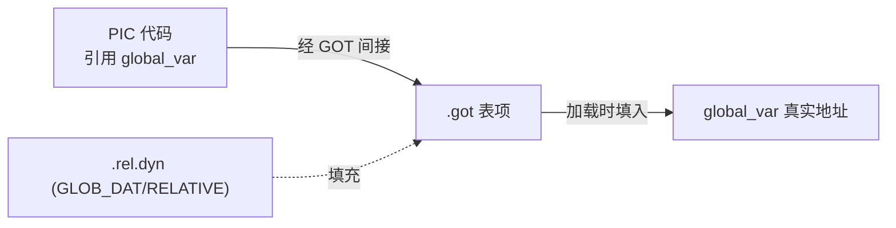

# 详解ELF文件(十七).got节

.got节（Global Offset Table，全局偏移表）是ELF（Executable and Linkable Format）文件格式中的一个重要组成部分，用于支持动态链接和位置无关代码（PIC）。

## 1. 基本概念

.got节是ELF文件中用于存储全局变量和函数地址的表，主要用于动态链接。它允许程序在运行时解析外部符号的地址，是实现位置无关代码的关键机制之一。

GOT 的核心思想是：**代码段不写死绝对地址，而是统一通过一张"地址转换表"间接访问**。代码段只需记录每个符号在该表中的相对偏移，动态链接器在加载时把真实地址填入表项，之后代码每次访问只读这张表即可——这样整个代码段对所有进程只读共享，符合 PIC/PIE 的要求。

## 2. 与.got.plt的区别

在现代ELF实现中，通常存在两个相关的节：

1. **.got**：
    - 存储数据符号（全局变量、静态变量等）的地址
    - 与 [[13.rel.dyn节|.rel.dyn]] 重定位节配合使用
2. **[[21.got.plt节|.got.plt]]**：
    - 存储函数符号的地址
    - 与 [[19.rel.plt节|.rel.plt]] 重定位节配合使用
    - 实现延迟绑定（lazy binding）

历史上 GOT 是统一的，后来才分裂为两张表，分工管理数据符号与函数符号，以支持不同的重定位策略（数据符号在加载时立即重定位，函数符号默认延迟绑定）。

## 3. 数据结构

.got节本身没有特定的结构体，它是一个地址表，每个表项通常为指针大小（32位系统为4字节，64位系统为8字节）。表的结构如下：

```
.got节地址:
  [0x00]       <第一个全局变量地址或重定位信息>
  [0x08]       <第二个全局变量地址或重定位信息>
  [0x10]       <第三个全局变量地址或重定位信息>
  ...
```

每个表项都是一个运行时地址，初始值通常为 0（或链接时的占位值），在动态链接阶段被动态链接器填入符号的真实虚拟地址。

## 4. _GLOBAL_OFFSET_TABLE_ 符号

`_GLOBAL_OFFSET_TABLE_` 是链接器为 GOT 定义的特殊外部符号，其地址即 `.got`（或 `.got.plt`，依 ABI 约定）的起始地址。编译器生成 PIC 代码时会使用该符号作为基准计算其他 GOT 表项的偏移。

- **x86（32位）**：通过 `call __x86.get_pc_thunk.bx` 把下一条指令的 PC 放入 `ebx`，再加上 `_GLOBAL_OFFSET_TABLE_` 相对 PC 的偏移，得到 GOT 基地址（即 `ebx` 指向 GOT）。
- **x86-64（64位）**：使用 `RIP`-relative addressing，`leaq _GLOBAL_OFFSET_TABLE_(%rip), %rbx` 直接得到 GOT 地址，无需手动 thunk。

```nasm
; x86 PIC 典型模式（32位共享库）
call    __x86.get_pc_thunk.bx    ; ebx = PC（下条指令地址）
addl    $_GLOBAL_OFFSET_TABLE_, %ebx   ; ebx = GOT 基址
movl    global_var@GOT(%ebx), %eax    ; eax = GOT[global_var] = &global_var
```

```nasm
; x86-64 典型模式（PIE 或共享库）
movq    global_var@GOTPCREL(%rip), %rax   ; rax = &GOT[global_var]
movl    (%rax), %edi                       ; edi = *(&global_var)
```

## 5. 工作原理与位置无关代码（PIC）

.got 是实现位置无关代码的核心——代码不直接写绝对地址，而是统一经由 GOT 间接访问，由动态链接器在加载时填入真实地址：



工作流程：

1. **编译时**：编译器为每个需要动态链接的全局变量在 .got 中预留一个表项，并在 [[13.rel.dyn节|.rel.dyn]] 节生成相应重定位条目
2. **加载时**：动态链接器读取 .rel.dyn 重定位信息，解析实际地址，写入 .got 相应位置
3. **运行时**：程序通过 .got 表项间接获取变量的实际地址

## 6. GOTPCREL 寻址与 GOT 优化

### 6.1 R_X86_64_GOTPCREL 系列重定位

在 x86-64 上，访问 GOT 表项的重定位类型为：

| 重定位类型 | 说明 |
|---|---|
| `R_X86_64_GOTPCREL` | RIP-relative，`movq symbol@GOTPCREL(%rip), %reg` |
| `R_X86_64_GOTPCRELX` | 可被优化的 GOTPCREL（无 REX 前缀） |
| `R_X86_64_REX_GOTPCRELX` | 可被优化的 GOTPCREL（有 REX 前缀） |
| `R_X86_64_CODE_4_GOTPCRELX` | Intel APX 扩展指令的 GOT 访问 |

链接器在处理 `GOTPCRELX` / `REX_GOTPCRELX` 时可执行 **GOT 松弛优化（GOT relaxation）**：如果符号在同一模块内（非跨 DSO），链接器可将 GOT 间接访问转为直接 PC-relative 访问，消除不必要的 GOT 表项，减小 .got 大小并提升性能。

### 6.2 GOT 松弛示例

```nasm
; 优化前（通过 GOT 间接访问，需要 GOT 表项）
movq    var@GOTPCREL(%rip), %rax   ; rax = &GOT[var]
movl    (%rax), %edi               ; edi = *var

; 链接器优化后（直接 PC-relative，不需要 GOT 表项）
leaq    var(%rip), %rax            ; rax = &var（直接地址）
movl    (%rax), %edi
```

AARCH64 类似地有 `R_AARCH64_ADR_GOT_PAGE` + `R_AARCH64_LD64_GOT_LO12_NC` 两条指令对共同访问 GOT 表项。

## 7. GOT 表项的重定位类型

.got 中的表项对应不同重定位语义：

| 重定位类型 | 说明 | 何时写入 |
|---|---|---|
| `R_X86_64_GLOB_DAT` | 将全局符号地址写入 GOT 表项 | 加载时（符号解析后） |
| `R_X86_64_RELATIVE` | `base + addend`，不涉及符号查找 | 加载时（纯地址调整） |
| `R_X86_64_64` | 绝对 64 位符号地址 | 加载时 |
| `R_X86_64_TPOFF64` | TLS 符号的线程指针偏移 | 加载时（TLS） |

`RELATIVE` 型重定位最常见、最高效，动态链接器不需要查符号表，只需将加载基地址加上编译时 addend 填入表项即可（DT_RELR 正是针对此类重定位做的压缩格式）。

## 8. 与重定位节的关系

| GOT 类型 | 配套重定位节 | 存储内容 |
|---|---|---|
| .got | [[13.rel.dyn节\|.rel.dyn]]（GLOB_DAT/RELATIVE） | 数据符号地址 |
| [[21.got.plt节\|.got.plt]] | [[19.rel.plt节\|.rel.plt]]（JUMP_SLOT） | 函数符号地址 |

## 9. 位置无关代码（PIC）的意义

1. **代码位置无关**：代码段可加载到任意地址执行，通过 .got 访问外部数据，不写死绝对地址
2. **地址解析**：程序按相对 .got 的偏移访问变量，动态链接器负责填充真实地址——这是共享库可被多进程共享同一份代码的前提
3. **ASLR 支持**：GOT 间接层使 ASLR（地址空间随机化布局）对共享库代码段透明；每次加载地址不同，但代码段无需修改，只需更新 GOT 表项

## 10. 实际应用示例

```c
extern int global_var;  // 外部全局变量声明
int *ptr = &global_var; // 指向外部全局变量的指针

int main() {
    int value = global_var; // 访问外部全局变量
    return 0;
}
```

在这个例子中：

1. 编译器会在 .got 节中为 `global_var` 预留一个表项
2. 在 [[13.rel.dyn节|.rel.dyn]] 节中生成 `R_X86_64_GLOB_DAT` 重定位条目
3. 动态链接器在加载时解析 `global_var` 的地址并写入 GOT 表项
4. 程序通过 `movq global_var@GOTPCREL(%rip), %rax` + `movl (%rax), %eax` 间接读取

## 11. RELRO 对 .got 的保护

**RELRO（Relocation Read-Only）** 是将已完成重定位的内存段标记为只读的安全机制，由 `PT_GNU_RELRO` 程序头实现。

### 11.1 两种 RELRO 级别对比

| 级别 | 链接参数 | .got 状态 | .got.plt 状态 | 延迟绑定 |
|---|---|---|---|---|
| 无 RELRO | — | 可写 | 可写 | 启用 |
| 部分 RELRO | `-Wl,-z,relro` | **只读**（加载后） | 仍可写 | 启用 |
| 完全 RELRO | `-Wl,-z,relro,-z,now` | **只读** | **只读** | 禁用（全量绑定） |

部分 RELRO 的原理：链接器将 `.got`（含 GLOB_DAT 表项）放置在 `PT_GNU_RELRO` 段覆盖的内存范围内；动态链接器完成加载时重定位后，调用 `mprotect()` 将该段改为 `PROT_READ`，使 .got 只读。

完全 RELRO 还会在启动时处理所有 JUMP_SLOT 重定位（等效于设置 `LD_BIND_NOW=1`），随后将整个 .got.plt 也设为只读。

### 11.2 检查二进制的 RELRO 状态

```bash
# 方法一：checksec 工具（推荐）
checksec --file=a.out

# 方法二：readelf 手动检查
readelf -l a.out | grep GNU_RELRO   # 有输出则有部分/完全 RELRO
readelf -d a.out | grep BIND_NOW    # 有输出则为完全 RELRO
```

```text
# 示例输出（代表性，非本机实跑）
$ checksec --file=/bin/ls
[*] '/bin/ls'
    Arch:     amd64-64-little
    RELRO:    Full RELRO
    Stack:    Canary found
    NX:       NX enabled
    PIE:      PIE enabled
```

### 11.3 PT_GNU_RELRO 的实现细节

`PT_GNU_RELRO` 程序头的 `p_vaddr`/`p_memsz` 指定需要变为只读的内存范围，通常涵盖：

- `.init_array`、`.fini_array`、`.dynamic`
- `.got`（包含 GLOB_DAT / RELATIVE 重定位）
- 当完全 RELRO 时，还包括 `.got.plt`

动态链接器（`ld.so`）在完成重定位后，遍历所有 `PT_GNU_RELRO` 段并调用 `mprotect(addr, size, PROT_READ)` 使其只读。若后续有写入，进程会收到 `SIGSEGV`。

## 12. GOT 改写攻击与防御

### 12.1 攻击原理

GOT 改写（GOT Overwrite）攻击是最经典的 Linux 控制流劫持手法之一。其本质是：利用任意写漏洞（如格式化字符串漏洞、堆溢出等），将 .got 或 .got.plt 中某个函数的地址替换为攻击者控制的目标地址。

```
攻击前：.got.plt[puts@plt] → 0x7f...（puts 真实地址）
攻击后：.got.plt[puts@plt] → 0x4141414141414141（攻击者控制的地址）
```

之后任何调用 `puts()` 的路径都会跳转到攻击者指定的代码，例如 `system("/bin/sh")`。

### 12.2 常见利用方式

1. **格式化字符串写 GOT**：利用 `%n` 写入任意地址，覆盖 GOT 表项
2. **堆/栈溢出写 GOT**：通过内存越界写入 GOT 区域
3. **UAF 链**：Use-After-Free 构造 fake chunk 覆盖 GOT
4. **ret2dl-resolve**：绕过 RELRO 通过伪造重定位结构劫持 `_dl_runtime_resolve` 流程

### 12.3 防御层次

| 防御机制 | 效果 | 说明 |
|---|---|---|
| 部分 RELRO | 保护 .got（GLOB_DAT） | .got.plt 仍可写，函数 GOT 仍可被改写 |
| 完全 RELRO | 保护 .got + .got.plt | 启动后全部 GOT 只读，从根本上阻断改写 |
| ASLR | 增加定位难度 | 随机化加载地址，攻击者需先泄漏地址 |
| PIE | 随机化可执行文件基址 | 与 ASLR 结合，覆盖 GOT 前需泄漏基址 |
| SafeStack/Shadow Stack | 阻止间接跳转劫持 | CFI（控制流完整性）增强防御 |

## 13. 安全考虑

.got节也是安全攻击的目标：

1. **GOT覆盖攻击**：攻击者修改 .got 节中的函数地址，将函数调用重定向到恶意代码
2. **RELRO保护**：
    - 部分RELRO：在链接时解析符号并保护 .got 节的部分内容
    - 完全RELRO：在程序启动时解析所有符号并将整个 GOT 置为只读

## 14. 实战：查看 .got

```bash
readelf -x .got a.out           # 十六进制显示 .got
readelf -S a.out                # 查看节头表，定位 .got
objdump -R a.out                # 查看动态重定位（看哪些 GOT 项被重定位）
readelf -r a.out                # 查看全部重定位（含 .rela.dyn 的 GLOB_DAT 条目）
readelf -l a.out | grep RELRO   # 检查是否有 PT_GNU_RELRO 段
```

```text
# 示例输出（代表性，非本机实跑）
$ readelf -x .got a.out
Hex dump of section '.got':
  0x00403e00 00000000 00000000 00000000 00000000 ................
  0x00403e10 00000000 00000000 30104000 00000000 ........0.@.....

$ readelf -r a.out | grep GLOB_DAT
000000403fe8  000200000006 R_X86_64_GLOB_DAT      0000000000000000 global_var + 0
```

### 14.1 GDB 中观察 GOT 被填充

```bash
# 调试时在 _dl_relocate_object 下断点，观察 GOT 写入
$ gdb ./a.out
(gdb) break _dl_relocate_object
(gdb) run
(gdb) x/4gx &global_var@got   # 查看 GOT 表项内容
```

.got节作为ELF文件动态链接机制的重要组成部分，为程序提供了访问外部符号的间接方式，是实现动态链接和位置无关代码的关键技术之一。通过与重定位节的配合，它确保了程序在运行时能够正确解析和访问所需的外部符号。

## 相关阅读

- **函数版 GOT**：[[21.got.plt节]]
- **填充 GOT 的重定位**：[[13.rel.dyn节]]、[[14.rela.dyn节]]
- **驱动者**：[[18.dynamic节]]
- 上一篇：[[16.dynstr节]] ｜ 下一篇：[[18.dynamic节]]
