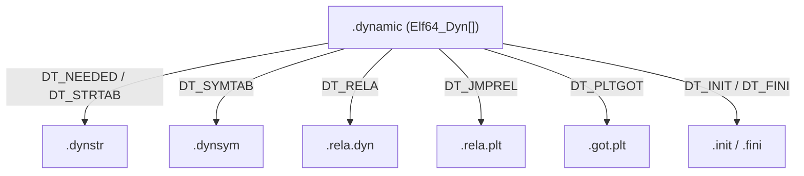

# 详解ELF文件(十八).dynamic节

.dynamic节是ELF（Executable and Linkable Format）文件格式中最重要的节之一，它包含了动态链接器在运行时所需的关键信息。该节是动态链接机制的核心组成部分。

## 1. 基本概念

.dynamic节是ELF文件中用于存储动态链接相关信息的节，它包含了动态链接器在程序加载和运行时解析外部符号所需的所有元数据。该节通常与 PT_DYNAMIC 类型的程序头段对应（见 [[03.程序头表]]）。可以把它理解为动态链接的"总目录"——动态链接器靠它找到其它所有动态节。

特殊符号 `_DYNAMIC` 标记 .dynamic 节的起始地址，由链接器定义。.dynamic 节同时具有 `SHF_WRITE` 和 `SHF_ALLOC` 标志，在运行时映射到内存，部分条目（如 DT_DEBUG）会在加载时被动态链接器回写。

## 2. 数据结构

.dynamic节由Elf32_Dyn或Elf64_Dyn结构体数组组成，具体结构如下：

```c
// 32位系统结构
typedef struct {
    Elf32_Sword d_tag;     // 标记类型（有符号32位）
    union {
        Elf32_Word d_val;  // 整数值（无符号32位）
        Elf32_Addr d_ptr;  // 虚拟地址（无符号32位）
    } d_un;
} Elf32_Dyn;

// 64位系统结构
typedef struct {
    Elf64_Sxword d_tag;    // 标记类型（有符号64位）
    union {
        Elf64_Xword d_val; // 整数值（无符号64位）
        Elf64_Addr  d_ptr; // 虚拟地址（无符号64位）
    } d_un;
} Elf64_Dyn;
```

各字段说明：

- **d_tag**：标记类型，决定如何解释 d_un 字段（是数值还是地址）；偶数 tag 通常使用 d_ptr，奇数 tag 通常使用 d_val（`DT_ENCODING=32` 以上的新式 tag 不适用此规则）
- **d_un**：联合体，包含 d_val（整数值）或 d_ptr（地址值），同一时刻只有一个字段有意义
- 数组以 `DT_NULL`（值为 0）结尾

### d_un 联合体语义详解

`d_un` 是一个 union，两个字段 `d_val`/`d_ptr` 在内存中占相同位置，差别仅在逻辑解读：

- **`d_val`**：无符号整数，常见用途：大小（字节数）、计数（条目数）、字符串表偏移、标志位集合
- **`d_ptr`**：运行时虚拟地址，常见用途：指向其它节的起始地址（.dynstr、.dynsym、.rela.dyn 等）

文件中存储的 d_ptr 是链接时的虚拟地址；若文件以非预期基址加载（如 PIE/共享库），动态链接器不会专门重定位 .dynamic 内的 d_ptr——而是在使用时根据加载基址（load bias）做偏移修正，计算方式为 `actual_addr = d_ptr + load_bias`。

## 3. 完整 d_tag 类型表

### 3.1 System V ABI 标准标签（0–37）

| d_tag | 数值 | d_un 字段 | 说明 | 指向 |
|---|---|---|---|---|
| DT_NULL | 0 | 忽略 | 标记 .dynamic 数组结束 | — |
| DT_NEEDED | 1 | d_val | 依赖共享库名在 .dynstr 中的偏移；可出现多次 | [[16.dynstr节\|.dynstr]] |
| DT_PLTRELSZ | 2 | d_val | PLT 重定位表的字节大小 | — |
| DT_PLTGOT | 3 | d_ptr | GOT/PLT 表地址（x86-64 上指向 .got.plt） | [[21.got.plt节\|.got.plt]] |
| DT_HASH | 4 | d_ptr | SysV 风格符号哈希表地址（.hash） | — |
| DT_STRTAB | 5 | d_ptr | 动态字符串表地址 | [[16.dynstr节\|.dynstr]] |
| DT_SYMTAB | 6 | d_ptr | 动态符号表地址 | [[15.dynsym节\|.dynsym]] |
| DT_RELA | 7 | d_ptr | 显式加数重定位表（Elf*_Rela）地址 | [[14.rela.dyn节\|.rela.dyn]] |
| DT_RELASZ | 8 | d_val | DT_RELA 重定位表字节大小 | — |
| DT_RELAENT | 9 | d_val | 单条 Elf*_Rela 结构大小（x86-64 为 24） | — |
| DT_STRSZ | 10 | d_val | 字符串表字节大小 | — |
| DT_SYMENT | 11 | d_val | 单条 Elf*_Sym 结构大小（x86-64 为 24） | — |
| DT_INIT | 12 | d_ptr | 初始化函数地址 | [[41.init节\|.init]] |
| DT_FINI | 13 | d_ptr | 终止函数地址 | [[42.fini节\|.fini]] |
| DT_SONAME | 14 | d_val | 本库规范名（soname）在 .dynstr 中的偏移 | [[16.dynstr节\|.dynstr]] |
| DT_RPATH | 15 | d_val | 运行时库搜索路径（已废弃，被 DT_RUNPATH 取代） | — |
| DT_SYMBOLIC | 16 | 忽略 | 符号解析优先从本库自身开始（已被 DF_SYMBOLIC 取代） | — |
| DT_REL | 17 | d_ptr | 隐式加数重定位表（Elf*_Rel）地址 | — |
| DT_RELSZ | 18 | d_val | DT_REL 重定位表字节大小 | — |
| DT_RELENT | 19 | d_val | 单条 Elf*_Rel 结构大小 | — |
| DT_PLTREL | 20 | d_val | PLT 重定位类型：值为 DT_REL(17) 或 DT_RELA(7) | — |
| DT_DEBUG | 21 | d_ptr | 调试用途；ld.so 运行时写入 `r_debug` 结构地址 | — |
| DT_TEXTREL | 22 | 忽略 | 存在则表示某重定位条目需修改只读段（非 PIC） | — |
| DT_JMPREL | 23 | d_ptr | PLT 专用重定位表地址（JUMP_SLOT 类型） | [[20.rela.plt节\|.rela.plt]] |
| DT_BIND_NOW | 24 | 忽略 | 存在则强制启动时处理所有重定位（禁用延迟绑定） | — |
| DT_INIT_ARRAY | 25 | d_ptr | 构造函数指针数组地址 | — |
| DT_FINI_ARRAY | 26 | d_ptr | 析构函数指针数组地址 | — |
| DT_INIT_ARRAYSZ | 27 | d_val | DT_INIT_ARRAY 数组字节大小 | — |
| DT_FINI_ARRAYSZ | 28 | d_val | DT_FINI_ARRAY 数组字节大小 | — |
| DT_RUNPATH | 29 | d_val | 运行时库搜索路径（.dynstr 偏移）；优先级低于 LD_LIBRARY_PATH | — |
| DT_FLAGS | 30 | d_val | 标志位集合，见 §4.1 DT_FLAGS 位详解 | — |
| DT_ENCODING | 32 | — | 边界值，此值以上不再适用奇偶 tag 语义规则 | — |
| DT_PREINIT_ARRAY | 32 | d_ptr | 仅可执行文件；预初始化函数指针数组地址 | — |
| DT_PREINIT_ARRAYSZ | 33 | d_val | DT_PREINIT_ARRAY 数组字节大小 | — |
| DT_SYMTAB_SHNDX | 34 | d_ptr | SHT_SYMTAB_SHNDX 节地址（扩展节索引） | — |
| DT_RELRSZ | 35 | d_val | DT_RELR 压缩相对重定位表字节大小 | — |
| DT_RELR | 36 | d_ptr | 压缩相对重定位表（packed relative relocations）地址 | — |
| DT_RELRENT | 37 | d_val | 单条 DT_RELR 条目大小 | — |

### 3.2 GNU/Linux OS 扩展标签（OS 特定范围）

这些 tag 落在 `0x6000000D`–`0x6FFFFFFF` 范围内：

| d_tag | 数值（十六进制） | 说明 |
|---|---|---|
| DT_GNU_HASH | 0x6FFFFEF5 | GNU 风格符号哈希表地址（比 DT_HASH 更快） |
| DT_TLSDESC_PLT | 0x6FFFFEF6 | TLS 描述符 PLT 地址 |
| DT_TLSDESC_GOT | 0x6FFFFEF7 | TLS 描述符 GOT 地址 |
| DT_RELACOUNT | 0x6FFFFFF9 | RELATIVE 型 Elf*_Rela 重定位条目数（集中排在前面） |
| DT_RELCOUNT | 0x6FFFFFFA | RELATIVE 型 Elf*_Rel 重定位条目数 |
| DT_FLAGS_1 | 0x6FFFFFFB | 扩展标志位，见 §4.2 DT_FLAGS_1 位详解 |
| DT_VERDEF | 0x6FFFFFFC | 版本定义表（.gnu.version_d）地址 |
| DT_VERDEFNUM | 0x6FFFFFFD | 版本定义表条目数 |
| DT_VERNEED | 0x6FFFFFFE | 版本需求表（.gnu.version_r）地址 |
| DT_VERNEEDNUM | 0x6FFFFFFF | 版本需求表条目数 |
| DT_VERSYM | 0x6FFFFFF0 | 符号版本表（.gnu.version）地址 |

### 3.3 处理器特定标签（0x70000000–0x7FFFFFFF）

各架构可在此范围定义私有 tag，例如 MIPS 的 `DT_MIPS_RLD_MAP`（0x70000001）用于调试，AArch64 的 `DT_AARCH64_BTI_PLT` 用于分支目标识别保护等。

## 4. DT_FLAGS 与 DT_FLAGS_1 位详解

### 4.1 DT_FLAGS（d_tag = 30）

`DT_FLAGS` 使用 d_val 存储标志位集合，覆盖 System V ABI 定义的 5 个核心标志：

| 标志名 | 位值 | 说明 |
|---|---|---|
| DF_ORIGIN | 0x1 | 对象需要 `$ORIGIN` 路径展开处理 |
| DF_SYMBOLIC | 0x2 | 符号解析优先从本库自身符号表开始（先本库后全局） |
| DF_TEXTREL | 0x4 | 存在需修改只读段的重定位条目（非 PIC 目标） |
| DF_BIND_NOW | 0x8 | 启动时处理全部重定位，禁用延迟绑定（等同 LD_BIND_NOW） |
| DF_STATIC_TLS | 0x10 | 对象使用静态 TLS 方案，不可被 dlopen 动态加载 |

### 4.2 DT_FLAGS_1（d_tag = 0x6FFFFFFB）

`DT_FLAGS_1` 是 Sun/GNU 扩展的增强标志集，包含更多运行时行为控制位：

| 标志名 | 位值（十六进制） | 说明 |
|---|---|---|
| DF_1_NOW | 0x1 | 加载时完成全部重定位（同 DF_BIND_NOW） |
| DF_1_GLOBAL | 0x2 | 将此对象的符号加入全局符号表（已废弃） |
| DF_1_GROUP | 0x4 | 对象为组成员，限制符号可见性 |
| DF_1_NODELETE | 0x8 | dlclose 不卸载此对象，保留在进程中 |
| DF_1_LOADFLTR | 0x10 | 立即加载 filtee（过滤器依赖） |
| DF_1_INITFIRST | 0x20 | 此对象的初始化函数优先于其他对象执行 |
| DF_1_NOOPEN | 0x40 | 禁止通过 dlopen 直接加载 |
| DF_1_ORIGIN | 0x80 | 需要 `$ORIGIN` 路径处理 |
| DF_1_DIRECT | 0x100 | 启用直接绑定（direct binding） |
| DF_1_INTERPOSE | 0x400 | 此对象插入其他对象符号解析路径（拦截符号） |
| DF_1_NODEFLIB | 0x800 | 忽略默认库搜索路径 |
| DF_1_NODUMP | 0x1000 | 不可被 dldump 转储 |
| DF_1_CONFALT | 0x2000 | 配置替代对象 |
| DF_1_ENDFILTEE | 0x4000 | filtee 搜索在此对象终止 |
| DF_1_DISPRELDNE | 0x8000 | 相对位移重定位已完成 |
| DF_1_DISPRELPND | 0x10000 | 相对位移重定位待完成 |
| DF_1_NODIRECT | 0x20000 | 无直接绑定 |
| DF_1_IGNMULDEF | 0x40000 | 忽略多重定义 |
| DF_1_NOKSYMS | 0x80000 | 不需要内核符号 |
| DF_1_NOHDR | 0x100000 | 无 ELF 头 |
| DF_1_EDITED | 0x200000 | 构建后已修改 |
| DF_1_NORELOC | 0x400000 | 无需重定位 |
| DF_1_SYMINTPOSE | 0x800000 | 独立符号插入 |
| DF_1_GLOBAUDIT | 0x1000000 | 建立全局审计 |
| DF_1_SINGLETON | 0x2000000 | 含单例符号 |
| DF_1_PIE | 0x8000000 | 本对象为位置无关可执行文件（PIE） |

## 5. DT_RELR：压缩相对重定位格式

PIC 对象（尤其是 PIE 和共享库）通常包含大量 `R_*_RELATIVE` 型重定位——每次加载只需将 load bias 加到编译时地址即可，无需查找符号表。

DT_RELR 是 2022 年 glibc 2.36 正式引入的压缩格式，可将相对重定位表的体积缩小约 **95%**，PIE 文件总体积可减少约 **10%**。

**编码规则**：
- **偶数条目**：直接编码一个需要重定位的虚拟地址（地址本身为偶数）
- **奇数条目**：位图，每个置位的 bit 对应前一偶数条目地址偏移处的一个需要重定位的位置

配套三个 d_tag：`DT_RELR`（表地址）、`DT_RELRSZ`（表字节大小）、`DT_RELRENT`（条目大小，通常 8 字节）。

## 6. RPATH vs RUNPATH 详解

`DT_RPATH`（tag=15）和 `DT_RUNPATH`（tag=29）都在 .dynstr 中存储以冒号分隔的目录路径，用于运行时搜索共享库。两者的关键区别：

| 特性 | DT_RPATH | DT_RUNPATH |
|---|---|---|
| 状态 | 已废弃 | 推荐使用 |
| 搜索优先级 | 高于 `LD_LIBRARY_PATH` | 低于 `LD_LIBRARY_PATH` |
| 是否影响子依赖 | 影响（传播到依赖库的搜索） | 不影响（仅当前对象） |
| 链接器参数 | `-Wl,-rpath,<path>` | `-Wl,-rpath,<path>,-z,enable-new-dtags` |
| `$ORIGIN` 展开 | 支持 | 支持 |

**`$ORIGIN` 展开**：路径中的 `$ORIGIN` 会被动态链接器展开为包含该可执行文件/共享库的目录路径，实现相对于自身的库搜索，常用于可重定位的应用包。

```bash
# 查看二进制的 RPATH/RUNPATH
readelf -d /path/to/bin | grep -E 'RPATH|RUNPATH'
chrpath -l /path/to/bin          # 用 chrpath 工具查看
patchelf --print-rpath /path/to/bin  # 用 patchelf 查看
```

## 7. LD_* 环境变量与动态链接器控制

动态链接器（ld.so）支持多个环境变量在不修改二进制的情况下控制链接行为：

| 环境变量 | 功能 |
|---|---|
| `LD_LIBRARY_PATH` | 附加库搜索目录（优先级高于 DT_RUNPATH） |
| `LD_PRELOAD` | 强制预加载指定共享库，其符号优先于所有后续库（常用于函数插桩、调试） |
| `LD_BIND_NOW` | 设为非空值时强制启动时绑定全部符号（等同 DT_BIND_NOW/DF_BIND_NOW） |
| `LD_DEBUG` | 输出调试信息（值如 `all`、`symbols`、`libs`、`bindings`、`reloc` 等） |
| `LD_DEBUG_OUTPUT` | 将 LD_DEBUG 输出重定向到文件（默认 stderr） |
| `LD_TRACE_LOADED_OBJECTS` | 类似 ldd，列出所有需要加载的共享库（不执行程序） |
| `LD_AUDIT` | 指定审计库（实现 rtld-audit 接口）进行安全/日志监控 |
| `LD_DYNAMIC_WEAK` | 允许动态符号覆盖弱符号（旧行为兼容） |

```bash
# 调试动态链接过程示例
LD_DEBUG=all LD_DEBUG_OUTPUT=/tmp/ld.log ./a.out

# 查看程序依赖的所有共享库
LD_TRACE_LOADED_OBJECTS=1 ./a.out
# 等同于
ldd ./a.out
```

安全提示：`LD_PRELOAD` 和 `LD_LIBRARY_PATH` 对 setuid/setgid 程序无效，动态链接器会在检测到权限提升时忽略这些变量。

## 8. 作用和功能

.dynamic节的主要作用包括：

1. **依赖管理**：通过 DT_NEEDED 指定依赖的共享库
2. **符号解析**：通过 DT_SYMTAB/DT_STRTAB 提供符号表与字符串表位置
3. **重定位支持**：通过 DT_RELA/DT_JMPREL 提供重定位表位置和大小
4. **初始化和终止**：通过 DT_INIT/DT_FINI 指定初始化与终止函数
5. **GOT/PLT管理**：通过 DT_PLTGOT 提供 GOT 表地址

## 9. 结构图示



## 10. 与其它节的关系

.dynamic节通过各 DT_* 条目"指挥"以下节协同工作：

1. **[[15.dynsym节|.dynsym]]**：DT_SYMTAB 指定位置、DT_SYMENT 指定表项大小
2. **[[16.dynstr节|.dynstr]]**：DT_STRTAB 指定位置、DT_STRSZ 指定大小
3. **[[14.rela.dyn节|.rela.dyn]]**：DT_RELA / DT_RELASZ / DT_RELAENT
4. **[[20.rela.plt节|.rela.plt]]**：DT_JMPREL / DT_PLTRELSZ / DT_PLTREL
5. **[[17.got节|.got]] 与 [[21.got.plt节|.got.plt]]**：DT_PLTGOT

## 11. 实战：查看 .dynamic

```bash
readelf -d a.out            # 查看 .dynamic 全部条目
```

```text
# 示例输出（代表性，非本机实跑）
$ readelf -d libc.so.6
Dynamic section at offset 0x1a3d00 contains 28 entries:
  Tag                Type        Name/Value
 0x0000000000000001 (NEEDED)    Shared library: [ld-linux-x86-64.so.2]
 0x000000000000000e (SONAME)    Library soname: [libc.so.6]
 0x0000000000000005 (STRTAB)    0x398d60
 0x0000000000000006 (SYMTAB)    0x398d60
 0x0000000000000003 (PLTGOT)    0x3ba000
 0x0000000000000014 (PLTREL)    RELA
 0x0000000000000017 (JMPREL)    0x3ba000
 0x0000000000000007 (RELA)      0x3ba000
 0x000000000000001e (FLAGS)     BIND_NOW
 0x0000000000000000 (NULL)      0x0
```

`(NEEDED) [ld-linux-x86-64.so.2]`、`(SONAME) [libc.so.6]` 中的字符串都取自 [[16.dynstr节|.dynstr]]；`(FLAGS) BIND_NOW` 表示禁用延迟绑定（配合完全 RELRO）。

```bash
# 用 patchelf 查看或修改 SONAME/RPATH
patchelf --print-soname libfoo.so
patchelf --set-soname libbar.so.1 libfoo.so

# 在 Python/LIEF 中解析 .dynamic
import lief
elf = lief.parse("/bin/ls")
for entry in elf.dynamic_entries:
    print(entry.tag, entry.value)
```

## 12. 动态链接全过程

.dynamic节在动态链接过程中的完整作用，分五个阶段：

### 阶段一：内核准备

内核执行 `execve()` 时，读取 ELF 的 `PT_INTERP` 段，将动态链接器（ld.so）映射到进程地址空间，同时映射可执行文件自身，然后将控制权交给 ld.so 的入口（`_start`），并通过辅助向量（auxv）传递 AT_PHDR、AT_ENTRY、AT_BASE 等信息。

### 阶段二：加载依赖（DT_NEEDED）

ld.so 从 .dynamic 找到所有 `DT_NEEDED` 条目，按以下顺序搜索每个依赖库：
1. `DT_RPATH`（若有，优先级最高，但已废弃）
2. `LD_LIBRARY_PATH` 环境变量（setuid 程序忽略）
3. `DT_RUNPATH`（当前对象的运行时路径）
4. `/etc/ld.so.cache`（ldconfig 生成的缓存）
5. 默认路径（`/lib`、`/usr/lib`、`/lib64`、`/usr/lib64`）

递归处理每个依赖库的 DT_NEEDED，构建依赖图，并通过 `link_map` 链表串联所有已加载对象。

### 阶段三：符号解析与查找顺序

ld.so 按照**加载顺序**（BFS 或深度优先，依实现而定）在所有已加载对象的 `.dynsym` 中查找符号：

```
可执行文件 → DT_NEEDED[0] → DT_NEEDED[1] → ... → ld.so 自身
```

若某 DSO 设置了 `DT_FLAGS: DF_SYMBOLIC`（或 `DT_FLAGS_1: DF_1_DIRECT`），该 DSO 内部引用优先从自身符号表解析，不走全局顺序。

`LD_PRELOAD` 指定的库插入到最前面，使其符号优先于所有其他库。

### 阶段四：重定位执行

按照 `DT_RELA`（数据重定位）、`DT_JMPREL`（PLT 函数重定位，若 BIND_NOW 则立即处理）、`DT_RELR`（压缩相对重定位）分别处理。写入目标地址，更新 .got、.got.plt、.data 等可写段。

完成重定位后，处理 `PT_GNU_RELRO` 段：将覆盖范围内的内存调用 `mprotect()` 设为只读（Partial RELRO 至此完成；Full RELRO 还需等 .got.plt 的 JUMP_SLOT 全部解析后才设为只读）。

### 阶段五：执行初始化函数

按依赖图的**逆拓扑顺序**（被依赖的先初始化），依次调用：

1. `DT_PREINIT_ARRAY` 中的函数（仅可执行文件，共享库忽略）
2. `DT_INIT` 指向的函数（`.init` 节）
3. `DT_INIT_ARRAY` 中的函数（按索引顺序）

全部初始化完毕后，ld.so 跳转到可执行文件的 `e_entry`（通常是 `_start`）。


.dynamic节作为ELF文件动态链接机制的核心，为程序在运行时正确加载和链接共享库提供了必要的元数据信息，是现代动态链接系统的重要基础。

### DT_AUDIT 与 ld.so 安全检查

#### DT_AUDIT / DT_DEPAUDIT 与 rtld-audit 接口

Linux ld.so 提供一套**审计钩子接口**（rtld-audit，LSB 规范），允许将一个共享库注入到动态链接过程的关键节点，进行监控、日志记录或安全检查，而无需修改被审计程序。

| d_tag | 数值（十六进制） | 说明 |
|-------|-----------------|------|
| `DT_AUDIT` | `0x6FFFFEF9` | 指向 .dynstr 中审计库路径；ld.so 在加载依赖库**之前**先加载此审计库 |
| `DT_DEPAUDIT` | `0x6FFFFEFA` | 指向 .dynstr 中审计库路径；对该对象的**所有直接依赖**同样应用审计 |

等效的环境变量为 `LD_AUDIT`（作用同 `DT_AUDIT`）、`LD_DEPAUDIT`（作用同 `DT_DEPAUDIT`）。当 ELF 文件中嵌入 `DT_AUDIT` 时，即使未设置 `LD_AUDIT`，审计库也会被强制加载。

**审计库必须导出的回调函数（rtld-audit ABI，定义于 `<link.h>`）**：

```c
/* 审计库接口（GNU rtld-audit，头文件 <link.h>）*/
unsigned int la_version(unsigned int version);          /* 版本协商，必须实现 */
unsigned int la_objopen(struct link_map *map,           /* 对象加载时调用 */
                        Lmid_t lmid, uintptr_t *cookie);
void la_objclose(uintptr_t *cookie);                   /* 对象卸载时调用 */
uintptr_t la_symbind64(Elf64_Sym *sym,                  /* 符号绑定时调用（64位）*/
                       unsigned int ndx, uintptr_t *refcook,
                       uintptr_t *defcook, unsigned int *flags,
                       const char *symname);
/* 架构特定的 pltenter/pltexit（x86-64 示例）*/
Elf64_Addr la_x86_64_gnu_pltenter(Elf64_Sym *sym, unsigned int ndx,
                                   uintptr_t *refcook, uintptr_t *defcook,
                                   La_x86_64_regs *regs, unsigned int *flags,
                                   const char *symname, long int *framesizep);
unsigned int la_x86_64_gnu_pltexit(Elf64_Sym *sym, unsigned int ndx,
                                    uintptr_t *refcook, uintptr_t *defcook,
                                    const La_x86_64_regs *inregs,
                                    La_x86_64_retval *outregs, const char *symname);
```

`la_version` 返回值若低于 ld.so 支持的最低版本则审计库被忽略。`la_symbind64` 可返回替换后的函数地址，从而实现符号级插桩（比 `LD_PRELOAD` 更精细）。

编译审计库示例：

```bash
# 编译审计库（无 main，不链接标准库）
gcc -shared -fPIC -o audit.so audit.c
# 嵌入到 ELF（需修改 .dynamic，一般通过 patchelf）
patchelf --add-needed audit.so target_binary   # 嵌入 DT_NEEDED（非 DT_AUDIT，仅示意）
# 运行时指定审计库（等效 DT_AUDIT）
LD_AUDIT=./audit.so ./target_binary
```

#### DF_GNU_1_UNIQUE 与单例符号

`DT_FLAGS_1` 中的 `DF_1_SINGLETON`（0x2000000，部分文档称 `DF_GNU_1_UNIQUE`）标志表示该库含有**唯一符号（unique symbol）**（STB_GNU_UNIQUE 绑定类型）。具有 STB_GNU_UNIQUE 的符号全局唯一、不可重复，dlclose 不会真正卸载含有此类符号的库（`DF_1_NODELETE` 语义自动应用）。该机制用于解决 C++ 静态局部变量、typeinfo 对象等"只能有一份"的场景在多个加载实例间的冲突。

```bash
# 查看符号是否为 GNU_UNIQUE
readelf -s libfoo.so | grep UNIQUE
nm -D libfoo.so | grep 'u '   # 小写 u 表示 STB_GNU_UNIQUE
```

#### AT_SECURE 与 SUID/SGID 程序的环境变量限制

动态链接器的安全策略核心是**辅助向量中的 `AT_SECURE` 标志**。内核在以下情况下将 `AT_SECURE` 置为 1 并传递给 ld.so：

- 程序设置了 setuid 位（`-rwsr-xr-x`），有效 UID ≠ 真实 UID
- 程序设置了 setgid 位，有效 GID ≠ 真实 GID
- Linux Security Module（LSM）策略要求（如 SELinux 的特定域转换）

当 `AT_SECURE == 1` 时，ld.so 的完整安全限制如下：

| 被忽略/限制的环境变量或行为 | 原因 |
|-----------------------------|------|
| `LD_PRELOAD` | 防止攻击者注入任意共享库 |
| `LD_LIBRARY_PATH` | 防止劫持库搜索路径 |
| `LD_AUDIT` / `LD_DEPAUDIT` | 防止注入审计钩子 |
| `LD_DEBUG` / `LD_DEBUG_OUTPUT` | 防止泄漏信息或写任意文件 |
| `LD_ORIGIN_PATH` | 防止伪造 `$ORIGIN` 展开路径 |
| `LD_DYNAMIC_WEAK` | 防止弱符号覆盖 |
| `LD_SHOW_AUXV` | 防止泄漏辅助向量 |
| `DT_RPATH`/`DT_RUNPATH` 中含 `$ORIGIN` | 仅当路径最终解析到安全目录才允许 |
| `DT_AUDIT`/`DT_DEPAUDIT`（ELF 内嵌） | **仍然生效**（静态嵌入 ELF 不受 AT_SECURE 屏蔽） |

**关键细节**：`DT_AUDIT`（写入 ELF 文件的 .dynamic 节）在安全模式下**不被忽略**，而 `LD_AUDIT`（环境变量）被忽略。这意味着攻击者若能修改目标二进制本身（写入 DT_AUDIT），可在 setuid 程序中注入审计代码，因此 setuid 二进制本身的文件权限保护至关重要。

```c
/* ld.so 内部检查 AT_SECURE 的伪代码 */
#include <sys/auxv.h>
unsigned long secure = getauxval(AT_SECURE);  /* 0 = 正常，1 = 安全模式 */
if (secure) {
    /* 清除 LD_PRELOAD、LD_LIBRARY_PATH 等敏感环境变量 */
    unsetenv("LD_PRELOAD");
    unsetenv("LD_LIBRARY_PATH");
    /* ... */
}
```

```bash
# 验证 AT_SECURE 的值（在普通程序中）
LD_SHOW_AUXV=1 /bin/ls 2>&1 | grep AT_SECURE
# 输出示例：AT_SECURE:   0

# SUID 程序下（su 等）AT_SECURE=1，LD_SHOW_AUXV 本身被忽略（不会输出）
```

## 相关阅读

- **对应的程序头段**：[[03.程序头表]]（PT_DYNAMIC）
- **它指向的节**：[[15.dynsym节]]、[[16.dynstr节]]、[[14.rela.dyn节]]、[[20.rela.plt节]]、[[17.got节]]、[[21.got.plt节]]
- **初始化/终止**：[[41.init节]]、[[42.fini节]]
- 上一篇：[[17.got节]] ｜ 下一篇：[[19.rel.plt节]]
