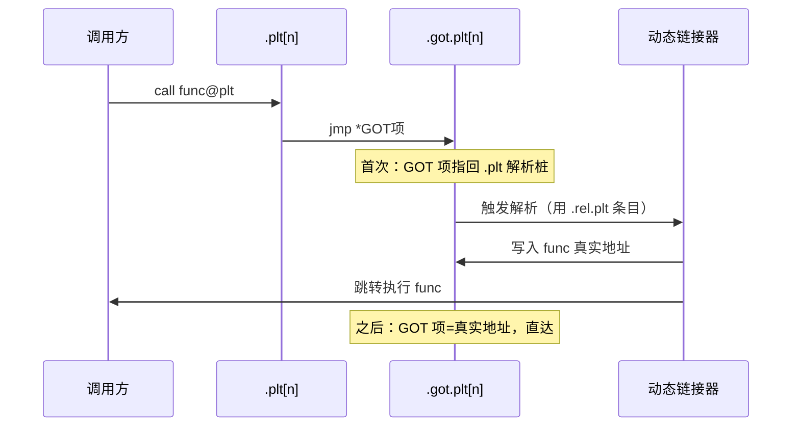
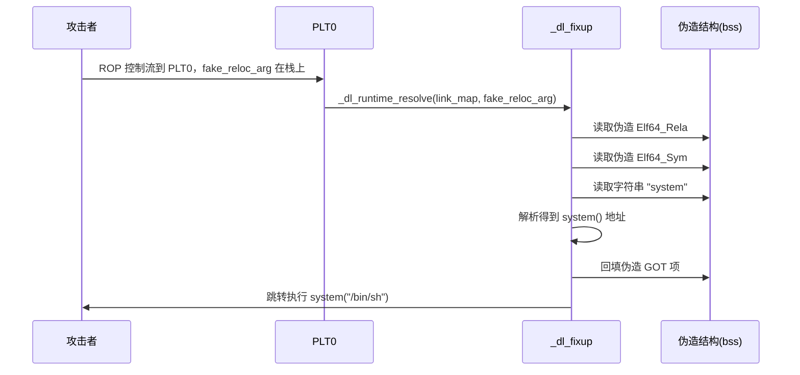

# 详解ELF文件(十九).rel.plt节

.rel.plt节是ELF（Executable and Linkable Format）文件格式中用于函数重定位的重要节区，它是实现动态链接和延迟绑定机制的关键组成部分。

## 1. 基本概念

.rel.plt节（Relocation Procedure Linkage Table）是ELF文件中用于存储函数重定位信息的节区。它专门处理外部函数调用的重定位，与处理数据重定位的 [[13.rel.dyn节|.rel.dyn节]] 相对应。该节与.plt（过程链接表）和 [[21.got.plt节|.got.plt]]（过程链接表的全局偏移表）紧密配合，实现函数调用的延迟绑定机制。

在 x86-32 体系结构上，PLT 重定位表命名为 `.rel.plt`，使用不带加数的 `Elf32_Rel` 结构体。x86-64 上则对应 `.rela.plt`（`Elf64_Rela`），但两者描述的逻辑概念完全相同，核心差异仅在于加数是否显式存储。本篇以 x86-32/通用视角为主，x86-64 具体细节参见 [[20.rela.plt节]]。

## 2. 与.rel.dyn的区别

.rel.plt和 [[13.rel.dyn节|.rel.dyn]] 节的主要区别：

1. **用途不同**：
    - .rel.dyn：处理数据符号（全局变量、静态变量等）的重定位
    - .rel.plt：处理函数符号的重定位
2. **重定位目标不同**：
    - .rel.dyn：重定位目标通常在 [[17.got节|.got]] 节中
    - .rel.plt：重定位目标在 [[21.got.plt节|.got.plt]] 节中
3. **绑定机制不同**：
    - .rel.dyn：通常在程序加载时完成重定位
    - .rel.plt：支持延迟绑定，在函数首次调用时完成重定位

## 3. 数据结构

.rel.plt节由Elf32_Rel或Elf64_Rela结构体数组组成，具体结构如下：

```c
// 32位系统（REL）
typedef struct {
    Elf32_Addr r_offset;  // 重定位入口的偏移量（GOT表项地址）
    Elf32_Word r_info;    // 重定位类型和符号表索引
} Elf32_Rel;

// 64位系统（RELA）
typedef struct {
    Elf64_Addr  r_offset;  // 重定位入口的偏移量
    Elf64_Xword r_info;    // 重定位类型和符号表索引
    Elf64_Sxword r_addend; // 加数
} Elf64_Rela;
```

各字段说明：

- **r_offset**：需要重定位的位置，对于.rel.plt节，这通常是 [[21.got.plt节|.got.plt]] 中相应函数的表项地址
- **r_info**：包含重定位类型和符号表索引（`ELF_R_SYM` 取索引、`ELF_R_TYPE` 取类型，符号指向 [[15.dynsym节|.dynsym]]）
- **r_addend**（仅在Rela类型中）：重定位计算中的加数

### 3.1 r_info 字段拆解

```c
// 32位
#define ELF32_R_SYM(i)  ((i) >> 8)
#define ELF32_R_TYPE(i) ((unsigned char)(i))
// 64位
#define ELF64_R_SYM(i)  ((i) >> 32)
#define ELF64_R_TYPE(i) ((i) & 0xffffffff)
```

以 `readelf -r` 输出的 `Info = 000300000007` 为例（64 位）：

- 符号索引 = `0x0003`，即 [[15.dynsym节|.dynsym]] 中第 3 项
- 重定位类型 = `0x00000007` = `R_X86_64_JUMP_SLOT`

## 4. 常见重定位类型

.rel.plt节几乎只用一种类型——跳转槽（JUMP_SLOT）：

| 类型 | 值 | 架构 | 作用 |
|---|---|---|---|
| R_386_JMP_SLOT | 7 | x86(32) | 把符号地址写入 GOT 表项 |
| R_X86_64_JUMP_SLOT | 7 | x86-64 | 把符号地址写入 .got.plt 表项 |
| R_ARM_JUMP_SLOT | 22 | ARM | 同上（ARM） |
| R_AARCH64_JUMP_SLOT | 1026 | ARM64 | 同上（AArch64） |

### 4.1 R_X86_64_JUMP_SLOT 的计算语义

根据 x86-64 psABI，`R_X86_64_JUMP_SLOT`（类型编号 7）的计算公式为：

```
GOT[n] = S   （S = 符号的最终运行时地址）
```

即动态链接器将目标符号的真实运行时地址直接写入 `r_offset` 所指向的 `.got.plt` 表项，`r_addend` 字段对此类型恒为 0，不参与计算。与 `R_X86_64_PC32` 等 PC 相对类型不同，JUMP_SLOT 是绝对地址回填。

## 5. 与其它节的关系

.rel.plt节与以下节紧密关联：

1. **.plt节**：存储函数调用的 stub 代码，通过跳转到 .got.plt 中的地址实现函数调用
2. **[[21.got.plt节|.got.plt]] 节**：存储函数的实际地址，.rel.plt 的 r_offset 指向其表项
3. **[[15.dynsym节|.dynsym]] 节**：通过 r_info 中的符号索引获取函数符号信息
4. **[[18.dynamic节|.dynamic]] 节**：
    - DT_JMPREL：指向.rel.plt节的地址
    - DT_PLTRELSZ：.rel.plt节的大小（字节数）
    - DT_PLTREL：重定位表类型（`DT_REL` 或 `DT_RELA`，指示当前平台使用哪种格式）
    - DT_PLTGOT：指向 .got.plt 节起始地址

### 5.1 .dynamic 中的 DT_JMPREL 等标签详解

| 动态标签 | d_un 成员 | 含义 |
|---|---|---|
| DT_JMPREL | d_ptr | .rel.plt（或 .rela.plt）的起始地址；动态链接器通过此地址定位 PLT 重定位表 |
| DT_PLTRELSZ | d_val | 整个 PLT 重定位表的字节大小；条目数 = DT_PLTRELSZ / sizeof(Elf_Rel\|Rela) |
| DT_PLTREL | d_val | 取值为 `DT_REL`(17) 或 `DT_RELA`(7)，指明 PLT 重定位条目格式 |
| DT_PLTGOT | d_ptr | 指向 .got.plt 节；在 x86/x86-64 上即 PLT 解析器使用的 GOT 起始地址 |

## 6. .got.plt 的三个特殊保留项

[[21.got.plt节|.got.plt]] 的前三个表项（`[0]`、`[1]`、`[2]`）由 ABI 保留，不存放任何函数地址：

| 索引 | 内容 | 说明 |
|---|---|---|
| `.got.plt[0]` | `_DYNAMIC` 段地址 | 由链接器在链接时写入，指向 `.dynamic` 节；动态链接器可借此自举 |
| `.got.plt[1]` | `link_map` 指针 | 由 `ld.so` 在加载时填写，指向描述当前可执行文件/共享库的 `link_map` 结构体 |
| `.got.plt[2]` | `_dl_runtime_resolve` 地址 | 由 `ld.so` 在加载时填写，指向延迟绑定解析函数入口 |

函数对应的 GOT 表项从 `.got.plt[3]` 开始，与 `.rela.plt` 中的重定位条目一一对应。

## 7. 工作原理与延迟绑定



具体流程：

1. **编译时**：编译器为每个外部函数调用生成 .plt 条目；在 .rel.plt 节为每个 .plt 条目生成重定位条目；.got.plt 相应表项初始化为指向 .plt 代码
2. **加载时**：动态链接器读取 [[18.dynamic节|.dynamic]] 节中的 DT_JMPREL 信息找到 .rel.plt 节
3. **首次调用时**：跳转到 .plt 条目 → 跳到 .got.plt 表项 → 仍指向解析代码 → 触发动态链接器解析并更新 .got.plt 表项
4. **后续调用**：.got.plt 表项已是实际地址，直接跳转执行

### 7.1 PLT0 与 PLTn Stub 汇编逐条解读

x86-32 的经典 PLT 布局（每个条目 16 字节）：

```asm
# PLT0（头部存根，负责调用解析器）
PLT0:
    pushl   GOT[1]           ; 把 link_map 压栈（作为 _dl_runtime_resolve 第一个参数）
    jmp     *GOT[2]          ; 跳转到 _dl_runtime_resolve

# PLTn（第 n 个函数的 stub，n >= 1）
PLTn:
    jmp     *GOT[n+2]        ; 首次：GOT[n+2] 初始化指向下一条 push，之后直接跳到函数
    push    $reloc_index      ; 把重定位索引压栈（作为 _dl_runtime_resolve 第二个参数）
    jmp     PLT0             ; 跳到 PLT0 触发解析
```

x86-64 的经典 PLT 布局（每个条目 16 字节）：

```asm
# PLT0
PLT0:
    pushq   GOT[1](%rip)     ; 把 link_map 压栈
    jmpq    *GOT[2](%rip)    ; 跳转到 _dl_runtime_resolve
    nopl    0x0(%rax,%rax,1) ; 填充对齐

# PLTn
PLTn:
    jmpq    *GOT[n](%rip)    ; 间接跳转：首次 → 下一条 push，之后 → 真实函数
    pushq   $reloc_index      ; 把重定位索引（reloc_arg）压栈
    jmpq    PLT0             ; 跳到 PLT0
```

**逐条指令解读：**

- `PLTn` 第一条 `jmpq *GOT[n](%rip)`：`.got.plt` 中对应项初始值为紧接其后的 `pushq` 指令地址，所以首次调用会"落穿"到第二条
- `pushq $reloc_index`：将该函数在 `.rela.plt` 中的**条目索引**（reloc_arg）压入栈，供 `_dl_fixup` 定位重定位记录
- `jmpq PLT0`：跳到 PLT 头部，将 `link_map` 也压栈，然后调用 `_dl_runtime_resolve`
- `PLT0` 的 `pushq GOT[1](%rip)`：压入 `link_map`，此时栈顶依次为 `[link_map, reloc_index, 返回地址]`
- `jmpq *GOT[2](%rip)`：跳入 glibc `_dl_runtime_resolve`

### 7.2 reloc_index 的含义与来源

`reloc_index`（也叫 `reloc_arg`）是该函数在 `.rela.plt` 重定位表中的**条目序号**，从 0 开始计数。动态链接器通过如下方式使用它：

```c
// glibc _dl_fixup 内部核心逻辑（简化）
const Elf64_Rela *reloc = (Elf64_Rela *)(DT_JMPREL_addr + reloc_arg * sizeof(Elf64_Rela));
const Elf64_Sym  *sym   = &symtab[ELF64_R_SYM(reloc->r_info)];
const char       *name  = dynstr + sym->st_name;
// 查找 name 对应的运行时地址，写入 reloc->r_offset 指向的 GOT 槽
*(void **)reloc->r_offset = resolved_addr;
```

链接器在生成 `.rela.plt` 时，按 PLT 条目顺序依次排列重定位记录，保证 PLT 第 `n` 个函数对应的 reloc_index 恰好等于 `n-1`（PLT0 不计入）。

### 7.3 _dl_runtime_resolve 完整调用链

```
PLTn (push reloc_index) → PLT0 (push link_map → jmp GOT[2])
      → _dl_runtime_resolve(link_map, reloc_index)
          → _dl_fixup(link_map, reloc_index)
              → 读取 .rela.plt[reloc_index]
              → 在 .dynsym 中查找符号
              → 在 .dynstr 中读取符号名
              → 通过 dl_lookup_symbol 在所有已加载 SO 中搜索
              → 写入 .got.plt[n]（真实地址）
          → 保存/恢复寄存器
          → 跳转到真实函数
```

## 8. 延迟绑定的意义

1. **性能优化**：程序启动时不需要解析所有函数，只在首次调用时解析
2. **资源节约**：减少启动时间、节省内存
3. **实现机制**：.plt 第一个条目是解析 stub，负责调用动态链接器；其他条目负责调用解析 stub 或直接跳转

## 9. -z lazy / -z now 与 Full RELRO

### 9.1 -z lazy（默认）

链接时使用 `-z lazy`（或不指定，默认行为），启用延迟绑定：

- `.got.plt` 表项初始为指向 PLT stub 的回填地址
- 函数首次调用时才触发 `_dl_runtime_resolve`
- `.got.plt` 段在程序运行期间保持**可写**
- 带来 GOT 覆盖攻击面

### 9.2 -z now / BIND_NOW

链接时指定 `-Wl,-z,now` 或运行时设置环境变量 `LD_BIND_NOW=1`：

- 动态链接器在程序启动阶段一次性解析所有 PLT 重定位条目
- 解析完成后，加上 `-Wl,-z,relro` 可将 `.got.plt` 映射为只读（Full RELRO）
- PLT0 的解析路径不再被调用

检测方式：

```bash
# 示例输出（代表性，非本机实跑）
$ readelf -d /bin/ls | grep -E 'BIND_NOW|FLAGS'
 0x000000000000001e (FLAGS)    BIND_NOW
 0x000000006ffffffb (FLAGS_1)  Flags: NOW PIE
```

### 9.3 Partial RELRO vs Full RELRO

| 模式 | 编译选项 | .got.plt 是否只读 | 延迟绑定 |
|---|---|---|---|
| 无 RELRO | 默认 | 可写 | 启用 |
| Partial RELRO | `-Wl,-z,relro` | 可写（仅 .got 只读） | 启用 |
| Full RELRO | `-Wl,-z,relro,-z,now` | 只读 | 禁用 |

Full RELRO 需要同时设置 `PT_GNU_RELRO` 段和 `DF_BIND_NOW` 标志，缺一不可。

### 9.4 -fno-plt：彻底消除 PLT

GCC 6.0 引入 `-fno-plt` 选项，编译器直接生成 GOT 间接调用，绕过 PLT 层：

```asm
# 有 PLT（默认）
call    printf@PLT

# -fno-plt：直接通过 GOT 调用
movq    printf@GOTPCREL(%rip), %rax
call    *%rax
```

优点：消除 PLT 跳转开销；缺点：无法使用延迟绑定，所有外部符号必须在启动时解析。

## 10. IBT/endbr64 与现代 PLT 格式

Intel CET（Control-flow Enforcement Technology）的 IBT（Indirect Branch Tracking）要求所有间接跳转目标必须以 `endbr64` 指令开头，这对 PLT 格式有重大影响。

### 10.1 IBT 启用的 PLT 双节设计

启用 `-fcf-protection=branch` 后，链接器生成两个 PLT 相关节：

- **`.plt`**：含 `endbr64` 的传统延迟绑定 stub（16 字节/条目）
- **`.plt.sec`**：含 `endbr64` 的直接 GOT 调用 stub（16 字节/条目），代码直接走 GOT 跳转

```asm
# .plt 条目（IBT 版，用于首次解析）
endbr64
pushq   $0x0             ; reloc_index
bnd jmpq <PLT0>

# .plt.sec 条目（IBT 版，正常调用走这里）
endbr64
bnd jmpq *0x2f5d(%rip)   ; 间接跳 GOT 槽
```

调用方统一跳 `.plt.sec`；首次调用时 GOT 槽初始化为 `.plt` 条目地址，触发解析；解析后 GOT 槽更新为真实函数地址（其 `endbr64` 由编译器保证存在）。

### 10.2 提议中的合并格式（24 字节/条目）

针对 `.plt` + `.plt.sec` 占用两倍空间的问题，有提案将两者合并为 24 字节条目：

```asm
# 24 字节合并 PLT 条目（提案）
endbr64               ; 4 字节，直接调用入口
jmpq    *GOT[n](%rip) ; 5 字节，首次跳 push，之后跳函数
endbr64               ; 4 字节，解析路径入口
pushq   $reloc_index  ; 5 字节
jmpq    PLT0          ; 5 字节（+ 1 字节 NOP 填充到 24）
```

此格式比当前 IBT 方案节省约 50% 的 PLT 空间。

## 11. 实战：查看 .rel.plt

```bash
readelf -r /bin/ls            # 函数重定位多出现在 .rela.plt 段
objdump -d -j .plt /bin/ls    # 反汇编 PLT stub
```

```text
# 示例输出（代表性，非本机实跑）
$ readelf -r /bin/ls
Relocation section '.rela.plt' at offset 0x4d0 contains 3 entries:
  Offset          Info           Type           Sym. Value    Sym. Name + Addend
000000405fd0  000300000007 R_X86_64_JUMP_SLO 0000000000000000 __libc_start_main@GLIBC_2.2.5 + 0
000000405fd8  000800000007 R_X86_64_JUMP_SLO 0000000000000000 __cxa_finalize@GLIBC_2.2.5 + 0
000000405fe0  000900000007 R_X86_64_JUMP_SLO 0000000000000000 puts@GLIBC_2.2.5 + 0
```

```text
# 示例输出（代表性，非本机实跑）
$ objdump -d -j .plt /bin/ls
Disassembly of section .plt:

0000000000401020 <.plt>:
  401020:  ff 35 e2 2f 00 00    pushq  0x2fe2(%rip)   # GOT[1]: link_map
  401026:  ff 25 e4 2f 00 00    jmpq   *0x2fe4(%rip)  # GOT[2]: _dl_runtime_resolve
  40102c:  0f 1f 40 00          nopl   0x0(%rax)

0000000000401030 <puts@plt>:
  401030:  ff 25 e2 2f 00 00    jmpq   *0x2fe2(%rip)  # GOT[puts]
  401036:  68 00 00 00 00       pushq  $0x0            # reloc_index=0
  40103b:  e9 e0 ff ff ff       jmpq   401020 <.plt>
```

### 11.1 objdump -dr 追踪完整调用链

```bash
# 目标文件阶段：查看代码引用外部函数时的重定位占位
objdump -dr main.o
```

```text
# 示例输出（代表性，非本机实跑）
00000000000000f0 <main>:
  ...
  10f:  e8 00 00 00 00    callq  114 <main+0x24>
                114: R_X86_64_PLT32  puts-0x4
```

`R_X86_64_PLT32` 表示链接器最终会将该 `call` 指令的 4 字节偏移修正为 `puts@PLT` 的 PC 相对偏移。

## 12. 安全考虑

.rel.plt节也是安全攻击的目标：

1. **ROP攻击**：攻击者可以利用 .plt 中的 gadgets 构造 ROP 链
2. **GOT覆盖攻击**：通过修改 .got.plt 中的函数地址实现控制流劫持
3. **RELRO保护**：
    - 部分RELRO：在链接时解析符号并保护 .got.plt 节的部分内容
    - 完全RELRO：在程序启动时解析所有符号并保护整个 .got.plt 节（关闭延迟绑定）

### 12.1 ret2dl_runtime_resolve 攻击原理

`ret2dl_runtime_resolve`（ret2dlresolve）是一种高级 ROP 技术，利用延迟绑定机制让动态链接器解析攻击者指定的任意符号（如 `system`），无需 libc 地址泄露。

**攻击前提：**

- 二进制没有 Full RELRO（`.got.plt` 可写，且 PLT0 解析路径可达）
- 有任意写原语或栈控制能力

**攻击步骤（以 x86-64 为例）：**

1. 在可写区域（如 `.bss`）伪造三个结构体：
    - 伪造 `Elf64_Rela`：`r_offset` 指向可写 GOT 项，`r_info` 编码目标符号索引
    - 伪造 `Elf64_Sym`：`st_name` 指向伪 `.dynstr` 中的字符串偏移，`st_info = 0x12`
    - 伪造字符串区：写入 `"system\x00"`

2. 控制返回地址，使程序跳转到 PLT0（跳过 `push reloc_index`），以伪造的 `reloc_arg` 直接触发：

```
ret → PLT0_push_link_map → jmp _dl_runtime_resolve(link_map, fake_reloc_arg)
```

3. `_dl_fixup` 根据 `fake_reloc_arg` 从伪造的重定位表、符号表、字符串表中读取 `"system"`，解析出其运行时地址，写入伪造的 GOT 项，然后跳转执行。

**关键约束（x86-64）：**

- `Elf64_Sym` 结构体大小为 24 字节，需要 8 字节对齐
- `VERSYM` 数组（版本符号）与 `SYMTAB` 共用同一索引但元素大小不同（分别为 2 和 24 字节），计算偏移时极易溢出导致段错误
- Full RELRO 完全免疫此攻击



.rel.plt节作为ELF文件动态链接机制的重要组成部分，为程序提供了函数调用的延迟绑定能力，是实现高效动态链接的关键技术之一。通过与 .plt 和 .got.plt 节的配合，它确保了程序在运行时能够正确解析和调用所需的外部函数。

## 相关阅读

- **加数版本**：[[20.rela.plt节]]
- **数据重定位对应物**：[[13.rel.dyn节]]
- **重定位目标**：[[21.got.plt节]]、[[17.got节]]
- **符号与驱动**：[[15.dynsym节]]、[[18.dynamic节]]
- 上一篇：[[18.dynamic节]] ｜ 下一篇：[[20.rela.plt节]]
