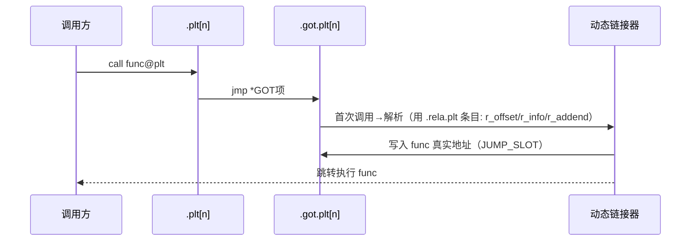

# 详解ELF文件(二十).rela.plt节

.rela.plt节是ELF（Executable and Linkable Format）文件格式中用于函数重定位的节区，它是.rela（RELA类型重定位）版本的.plt重定位表，主要用于64位系统中。

## 1. 基本概念

.rela.plt节（Relocation with Addend Procedure Linkage Table）是ELF文件中用于存储函数重定位信息的节区，采用RELA（Relocation with Addend）格式。它与 [[19.rel.plt节|.rel.plt]] 节类似，但包含了显式的加数字段，主要用于64位架构系统中——在 x86-64 上，函数重定位实际就放在 .rela.plt 里。

从 System V gABI 和 x86-64 psABI 的角度看，`.rela.plt` 就是"带加数字段的 PLT 重定位表"：动态链接器通过 `DT_JMPREL` 定位它，通过 `DT_PLTRELSZ / sizeof(Elf64_Rela)` 得到条目数，再逐条处理 `R_X86_64_JUMP_SLOT` 类型重定位，在延迟绑定时将真实地址回填进 `.got.plt` 的对应槽。

## 2. 与.rel.plt的区别

.rela.plt和 [[19.rel.plt节|.rel.plt]] 节的主要区别：

1. **数据结构不同**：
    - .rel.plt：使用REL格式，重定位信息隐含在被修改的位置中
    - .rela.plt：使用RELA格式，包含显式的加数字段
2. **适用架构不同**：
    - .rel.plt：主要用于32位系统
    - .rela.plt：主要用于64位系统
3. **大小不同**：
    - REL结构体通常为8字节（32位系统）
    - RELA结构体通常为16或24字节（64位系统）

| 特性 | .rel.plt（REL） | .rela.plt（RELA） |
|---|---|---|
| 条目大小 | 8 字节（32 位）/16 字节（64 位） | 12 字节（32 位）/24 字节（64 位） |
| 加数存储 | 隐式（存于被改位置内） | 显式 r_addend 字段 |
| 典型平台 | x86(32)、MIPS32 | x86-64、AArch64、RISC-V |
| JUMP_SLOT 加数 | 不适用（读被改位置） | 恒为 0 |
| DT_PLTREL 取值 | DT_REL（17） | DT_RELA（7） |

## 3. 数据结构

.rela.plt节由Elf64_Rela结构体数组组成，具体结构如下：

```c
// 64位系统结构
typedef struct {
    Elf64_Addr   r_offset;  // 重定位入口的偏移量（GOT表项地址）
    Elf64_Xword  r_info;    // 重定位类型和符号表索引
    Elf64_Sxword r_addend;  // 加数
} Elf64_Rela;

// 32位系统结构（如果存在）
typedef struct {
    Elf32_Addr  r_offset;  // 重定位入口的偏移量
    Elf32_Word  r_info;    // 重定位类型和符号表索引
    Elf32_Sword r_addend;  // 加数
} Elf32_Rela;
```

各字段说明：

- **r_offset**：需要重定位的位置，对于.rela.plt节，这通常是 [[21.got.plt节|.got.plt]] 中相应函数的表项地址
- **r_info**：包含重定位类型和符号表索引（`ELF64_R_SYM(i)=i>>32`、`ELF64_R_TYPE(i)=i&0xffffffff`，符号指向 [[15.dynsym节|.dynsym]]）
- **r_addend**：重定位计算中的显式加数（对 JUMP_SLOT 通常为 0）

### 3.1 r_info 字段详解

```c
// 64 位宏定义
#define ELF64_R_SYM(i)   ((i) >> 32)           // 高 32 位为符号索引
#define ELF64_R_TYPE(i)  ((i) & 0xffffffff)    // 低 32 位为重定位类型
#define ELF64_R_INFO(s, t) ((Elf64_Xword)(s) << 32 | (t))
```

以 `readelf -r` 输出的条目 `Info = 000300000007` 为例：

- `ELF64_R_SYM(0x000300000007)` = `0x0003` → .dynsym 第 3 项
- `ELF64_R_TYPE(0x000300000007)` = `0x00000007` = `R_X86_64_JUMP_SLOT`

### 3.2 条目总数计算

```c
// 动态链接器内部：计算 .rela.plt 条目数
size_t n_plt = dt_pltrelsz / sizeof(Elf64_Rela);

// 迭代所有 PLT 重定位条目
for (size_t i = 0; i < n_plt; i++) {
    const Elf64_Rela *rela = (Elf64_Rela *)dt_jmprel + i;
    // 处理 rela->r_offset、r_info、r_addend
}
```

## 4. 常见重定位类型

| 类型 | 类型编号 | 架构 | 作用 |
|---|---|---|---|
| R_X86_64_JUMP_SLOT | 7 | x86-64 | 把符号地址写入 .got.plt 表项 |
| R_AARCH64_JUMP_SLOT | 1026 | ARM64 | 同上（ARM64） |
| R_386_JMP_SLOT | 7 | x86(32) | 同上（x86 32 位） |
| R_PPC64_JMP_SLOT | 21 | PPC64 | 同上（PowerPC64） |

### 4.1 R_X86_64_JUMP_SLOT 计算公式

根据 x86-64 psABI，`R_X86_64_JUMP_SLOT` 的语义是：

```
操作：GOT[n] ← S
其中：S = 符号的最终运行时地址
     GOT[n] = r_offset 所指向的 .got.plt 表项
     r_addend 不参与计算（始终为 0）
```

这与 PC 相对类型（如 `R_X86_64_PC32` 用 `S+A-P`）有本质区别：JUMP_SLOT 是**绝对地址**直接回填。动态链接器 `_dl_fixup` 在解析完符号后，执行等效于 `*((void **)r_offset) = resolved_addr` 的操作。

## 5. 与其它节的关系

.rela.plt节与以下节紧密关联：

1. **.plt节**：存储函数调用的 stub 代码
2. **[[21.got.plt节|.got.plt]] 节**：存储函数的实际地址，.rela.plt 的 r_offset 指向其表项
3. **[[15.dynsym节|.dynsym]] 节**：通过 r_info 中的符号索引获取函数符号信息
4. **[[18.dynamic节|.dynamic]] 节**：
    - DT_JMPREL：指向.rela.plt节的地址
    - DT_PLTRELSZ：.rela.plt节的大小
    - DT_PLTREL：重定位表类型（指示为RELA类型）
    - DT_PLTGOT：指向 .got.plt 节起始地址

### 5.1 .got.plt 前三个特殊保留项

[[21.got.plt节|.got.plt]] 开头的三个表项由 ABI 保留，不存放函数地址：

| 索引 | 初始内容 | 填写时机 | 说明 |
|---|---|---|---|
| `.got.plt[0]` | `_DYNAMIC` 地址 | 静态链接时 | 指向 `.dynamic` 节，供动态链接器自举 |
| `.got.plt[1]` | `link_map` 指针 | `ld.so` 加载时 | 描述当前 SO/可执行文件的结构体指针 |
| `.got.plt[2]` | `_dl_runtime_resolve` 地址 | `ld.so` 加载时 | PLT0 调用的延迟绑定解析函数 |

从 `.got.plt[3]` 起，每个槽对应一个 `.rela.plt` 条目，即一个外部函数。初始值为该函数 PLT 条目中 `push $reloc_index` 指令的地址。

## 6. 工作原理



具体流程：

1. **编译时**：为每个外部函数调用生成 .plt 条目；在 .rela.plt 节生成重定位条目；.got.plt 初始化为指向 .plt
2. **加载时**：动态链接器读取 [[18.dynamic节|.dynamic]] 节 DT_JMPREL 找到 .rela.plt；使用 r_offset、符号信息与 r_addend 计算实际地址
3. **首次调用时**：跳转到 .plt → .got.plt → 解析代码 → 解析并更新 .got.plt 表项
4. **后续调用**：.got.plt 已含实际地址，直接跳转

## 7. 延迟绑定机制深度剖析

.rela.plt节同样是实现延迟绑定（Lazy Binding）的关键。

### 7.1 PLT0 与 PLTn x86-64 汇编详解

x86-64 标准 PLT 布局（16 字节对齐）：

```asm
# PLT0：头部存根，调用 _dl_runtime_resolve
.plt 起始:
  0x401020:  ff 35 e2 2f 00 00   pushq  0x2fe2(%rip)  # push .got.plt[1]=link_map
  0x401026:  ff 25 e4 2f 00 00   jmpq  *0x2fe4(%rip)  # jmp  .got.plt[2]=_dl_runtime_resolve
  0x40102c:  0f 1f 40 00         nopl  0x0(%rax)      # NOP 填充对齐

# PLTn（函数 puts，reloc_index=0）
.plt+0x10:
  0x401030:  ff 25 e2 2f 00 00   jmpq  *0x2fe2(%rip)  # jmp .got.plt[puts]
                                                      # 首次：指向 0x401036（下一条）
  0x401036:  68 00 00 00 00      pushq $0x0           # push reloc_index=0
  0x40103b:  e9 e0 ff ff ff      jmpq  401020 <.plt>  # jmp PLT0
```

**逐条指令解读：**

1. `PLTn` 第一条 `jmpq *GOT[n](%rip)`：
   - 首次调用：GOT[n] 存的是 `0x401036`（`pushq $0` 指令地址），所以"穿透"到下一条
   - 后续调用：GOT[n] 已被回填为 `puts` 真实地址，直接跳转，PLT 解析路径不再参与

2. `pushq $reloc_index`（此处 `$0x0`）：
   - 将该函数在 `.rela.plt` 中的**条目索引**压栈
   - `_dl_fixup` 用 `DT_JMPREL + reloc_index * 24` 定位对应 `Elf64_Rela` 条目

3. `jmpq PLT0`：跳到 PLT0，压入 `link_map`，再跳入 `_dl_runtime_resolve`

4. `PLT0 pushq GOT[1](%rip)`：将 `link_map` 压栈，此时栈布局为：
   ```
   [rsp+0]  link_map      ← PLT0 压入
   [rsp+8]  reloc_index   ← PLTn 压入
   [rsp+16] 返回地址      ← call func@plt 时压入
   ```

5. `PLT0 jmpq *GOT[2](%rip)`：跳入 `_dl_runtime_resolve(link_map, reloc_index)`

### 7.2 _dl_fixup 内核逻辑（glibc 简化版）

```c
// glibc sysdeps/x86_64/dl-machine.h / dl-runtime.c（简化）
ElfW(Addr) _dl_fixup(struct link_map *l, ElfW(Word) reloc_arg)
{
    // 1. 定位 .rela.plt 条目
    const ElfW(Sym)  *const symtab = (void *)D_PTR(l, l_info[DT_SYMTAB]);
    const char       *strtab       = (void *)D_PTR(l, l_info[DT_STRTAB]);
    const PLTREL     *const reloc  =
        (void *)(D_PTR(l, l_info[DT_JMPREL]) + reloc_arg * sizeof(PLTREL));

    // 2. 从 r_info 提取符号表索引，找到 Elf64_Sym
    const ElfW(Sym) *sym = &symtab[ELFW(R_SYM)(reloc->r_info)];
    assert(ELFW(R_TYPE)(reloc->r_info) == ELF_MACHINE_JMP_SLOT);

    // 3. 通过符号名在所有已加载 SO 中查找地址
    const char *name = strtab + sym->st_name;
    ElfW(Addr) value = _dl_lookup_symbol_x(name, l, ...);

    // 4. 回填 .got.plt 表项（JUMP_SLOT: GOT[n] = S）
    *(ElfW(Addr) *)reloc->r_offset = value;

    return value; // _dl_runtime_resolve 随后跳转到此地址
}
```

### 7.3 完整调用时序

```
用户代码 call puts@plt
    → PLTn: jmpq *GOT[puts]（首次穿透到 push）
    → PLTn: pushq $0（reloc_index=0）
    → PLTn: jmpq PLT0
    → PLT0: pushq GOT[1]（link_map）
    → PLT0: jmpq *GOT[2]（_dl_runtime_resolve）
    → _dl_runtime_resolve:
        保存所有通用寄存器和 SSE 寄存器
        mov link_map → rdi
        mov reloc_index → rsi
        call _dl_fixup(link_map, reloc_index=0)
            读取 .rela.plt[0].r_info → 符号索引 3
            symtab[3].st_name → dynstr 偏移
            dynstr + 偏移 = "puts"
            dl_lookup → libc.so 中 puts 地址（如 0x7f...a2b0）
            *(.got.plt[puts]) = 0x7f...a2b0
        return 0x7f...a2b0
        恢复寄存器
        jmpq rax（= puts 真实地址）
    → puts 函数体执行
```

## 8. -z lazy vs -z now 及 Full RELRO 详解

### 8.1 默认 -z lazy（延迟绑定）

```bash
# 查看二进制是否为延迟绑定
readelf -d binary | grep -c "BIND_NOW"
# 输出 0 表示延迟绑定（-z lazy）
```

延迟绑定下 `.got.plt` 必须保持可写，因此成为攻击面。

### 8.2 -z now（立即绑定）

```bash
# 编译时开启立即绑定
gcc -o binary main.c -Wl,-z,now

# 运行时强制（不修改二进制）
LD_BIND_NOW=1 ./binary
```

效果：动态链接器在 `main()` 执行前完成所有 `.rela.plt` 条目的解析，`.got.plt` 可随后映射为只读。

### 8.3 Full RELRO 完整保护链

```bash
gcc -o hardened main.c -Wl,-z,relro,-z,now
```

1. `PT_GNU_RELRO` 段告诉动态链接器哪些区域在初始化后变为只读
2. `DF_BIND_NOW`（`DT_FLAGS` 中）强制立即解析所有 PLT 条目
3. `.got.plt` 整体被 `mprotect(PROT_READ)` 保护

```bash
# 验证
$ checksec --file=hardened
[*] '/tmp/hardened'
    Arch:     amd64-64-little
    RELRO:    Full RELRO
    Stack:    No canary found
    NX:       NX enabled
    PIE:      No PIE (0x400000)
```

### 8.4 -fno-plt：绕过 PLT 的直接 GOT 调用

```c
// 编译选项
gcc -fno-plt -o binary main.c
```

生成的调用序列：

```asm
# 有 PLT（默认）
call    puts@PLT

# -fno-plt：直接通过 GOT 间接调用
movq    puts@GOTPCREL(%rip), %rax
call    *%rax
```

`-fno-plt` 的优缺点：
- **优点**：消除一层 PLT 跳转，减少分支预测负担；`.plt` 节可为空
- **缺点**：必须在启动时解析所有 GOT 项（等效 `-z now`），增加启动开销；无法与延迟绑定共存

## 9. IBT/endbr64 对 PLT 的影响

Intel CET 的 Indirect Branch Tracking 要求所有间接跳转目标以 `endbr64` 开头，PLT 格式因此演进。

### 9.1 IBT 启用的双节 PLT（.plt + .plt.sec）

```asm
# .plt 条目（含 endbr64，解析路径）
.plt+0x20 <puts@plt>:
  endbr64                          # 4 字节，CET 要求
  pushq   $0x0                     # reloc_index
  bnd jmpq <.plt>                  # 跳到 PLT0

# .plt.sec 条目（含 endbr64，正常调用路径）
.plt.sec+0x20 <puts@plt.sec>:
  endbr64                          # 4 字节
  bnd jmpq *0x2f5d(%rip)          # 间接跳 .got.plt[puts]
```

调用方跳到 `.plt.sec`；首次 GOT 槽初值为 `.plt` 对应条目，触发解析；解析后 GOT 槽更新为真实函数（其头部必有 `endbr64`）。

### 9.2 `.plt` 与 `.plt.sec` 的关系


## 10. 实战：查看 .rela.plt

```bash
readelf -r /bin/ls
```

```text
# 示例输出（代表性，非本机实跑）
Relocation section '.rela.plt' at offset 0x4d0 contains 3 entries:
  Offset          Info           Type           Sym. Value    Sym. Name + Addend
000000405fd0  000300000007 R_X86_64_JUMP_SLO 0000000000000000 __libc_start_main@GLIBC_2.2.5 + 0
000000405fd8  000800000007 R_X86_64_JUMP_SLO 0000000000000000 __cxa_finalize@GLIBC_2.2.5 + 0
000000405fe0  000900000007 R_X86_64_JUMP_SLO 0000000000000000 puts@GLIBC_2.2.5 + 0
```

字段含义：

- **Offset**（r_offset）：`.got.plt` 中该函数表项的运行时地址，`_dl_fixup` 将真实地址写入此处
- **Info**（r_info）：高 32 位 = 符号在 `.dynsym` 中的索引，低 32 位 = 重定位类型（7 = JUMP_SLOT）
- **Type**：`R_X86_64_JUMP_SLOT`，所有 `.rela.plt` 条目均为此类型
- **Sym. Value**：符号值，延迟绑定时初始为 0（尚未解析）
- **Sym. Name**：符号名称，动态链接器将在所有已加载 SO 中搜索此名称
- **Addend**（r_addend）：对 JUMP_SLOT 恒为 0

### 10.1 反汇编 PLT 节

```bash
objdump -d -j .plt /bin/ls
objdump -d -j .plt.sec /bin/ls   # IBT 模式下额外的节
```

```text
# 示例输出（代表性，非本机实跑）
Disassembly of section .plt:

0000000000401020 <.plt>:
  401020:  ff 35 e2 2f 00 00   pushq 0x2fe2(%rip)  # 401008: link_map
  401026:  ff 25 e4 2f 00 00   jmpq *0x2fe4(%rip)  # 401010: _dl_runtime_resolve
  40102c:  0f 1f 40 00         nopl  0x0(%rax)

0000000000401030 <puts@plt>:
  401030:  ff 25 e2 2f 00 00   jmpq *0x2fe2(%rip)  # GOT[puts]
  401036:  68 00 00 00 00      pushq $0x0           # reloc_index=0
  40103b:  e9 e0 ff ff ff      jmpq  401020 <.plt>
```

### 10.2 交叉验证：GOT 初始值

```bash
# 查看 .got.plt 初始内容（链接后，运行前）
objdump -R /bin/ls | grep puts
# 输出：0000000000405fe0 R_X86_64_JUMP_SLOT  puts@@GLIBC_2.2.5
#       此地址即 .got.plt[puts]，加载后 ld.so 将其初始化为 push 指令地址
```

## 11. 与安全的关系

.rela.plt节在安全领域也很重要：

1. **ROP攻击**：攻击者可以利用 .plt 中的 gadgets 构造 ROP 链
2. **ret2dl_runtime_resolve攻击**：通过伪造 .rela.plt 和 .dynsym 节内容，可以控制动态链接器解析任意符号，是一种高级的代码复用攻击技术
3. **RELRO保护**：
    - 部分RELRO：在链接时解析符号并保护 .got.plt 节的部分内容
    - 完全RELRO：在程序启动时解析所有符号并保护整个 .got.plt 节

### 11.1 ret2dlresolve 攻击详解（x86-64）

攻击目标：利用 `.rela.plt` 的解析流程，让 `_dl_fixup` 解析攻击者指定的符号（如 `system`）。

**所需结构（在 `.bss` 等可写区域伪造）：**

```c
// 伪造 Elf64_Rela（放在 fake_rela 地址）
Elf64_Rela fake_rela = {
    .r_offset = (uint64_t)fake_got_ptr, // 回填目标（可写地址）
    .r_info   = ELF64_R_INFO(fake_sym_idx, R_X86_64_JUMP_SLOT),
    .r_addend = 0
};

// 伪造 Elf64_Sym（放在 fake_sym 地址，需 24 字节对齐）
Elf64_Sym fake_sym = {
    .st_name  = (uint32_t)(fake_str - dynstr_base), // 指向 "system\0" 的偏移
    .st_info  = 0x12,   // STB_GLOBAL | STT_FUNC
    .st_other = 0,
    .st_shndx = 0,
    .st_value = 0,
    .st_size  = 0
};

// 伪造字符串（紧随 fake_sym 后）
char fake_str[] = "system";
```

**攻击流程：**

```
攻击者构造 ROP 链 → 控制 RSP → 跳到 PLT0+6（push link_map 后）
                 → 模拟 _dl_runtime_resolve(link_map, fake_reloc_arg)
                 → _dl_fixup 读取 .rela.plt_base + fake_reloc_arg*24 = fake_rela
                 → 提取 fake_sym_idx，定位 fake_sym
                 → 读取 fake_sym.st_name，解析 "system"
                 → 查找 system() 地址，写入 fake_got_ptr
                 → 跳转执行 system("/bin/sh")
```

**x86-64 对齐约束（常见坑）：**

- `Elf64_Sym` 大小 24 字节，`fake_sym_idx = (fake_sym_addr - dynsym_base) / 24`
- `VERSYM` 数组每项 2 字节，若 `fake_sym_idx` 过大，`VERSYM[fake_sym_idx]` 地址超界 → 段错误
- pwntools 的 `Ret2dlresolvePayload` 类可自动计算对齐，推荐使用

**防御：Full RELRO** 完全消除此攻击面（`.got.plt` 只读，PLT0 解析路径启动后不可触发）。

.rela.plt节作为64位ELF文件动态链接机制的重要组成部分，为程序提供了函数调用的延迟绑定能力，并通过显式的加数字段提供了更灵活的重定位计算方式。通过与 .plt 和 .got.plt 节的配合，它确保了程序在运行时能够正确解析和调用所需的外部函数。

## 相关阅读

- **无加数版本**：[[19.rel.plt节]]
- **数据重定位对应物**：[[14.rela.dyn节]]
- **重定位目标**：[[21.got.plt节]]、[[17.got节]]
- **符号与驱动**：[[15.dynsym节]]、[[18.dynamic节]]
- 上一篇：[[19.rel.plt节]] ｜ 下一篇：[[21.got.plt节]]
