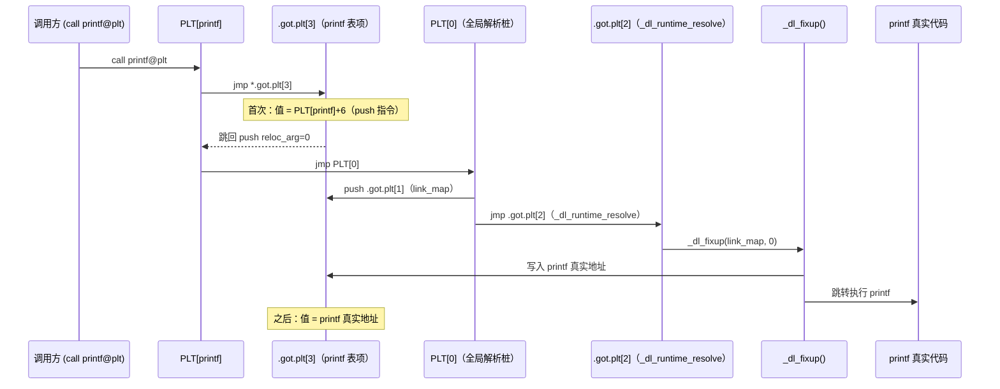
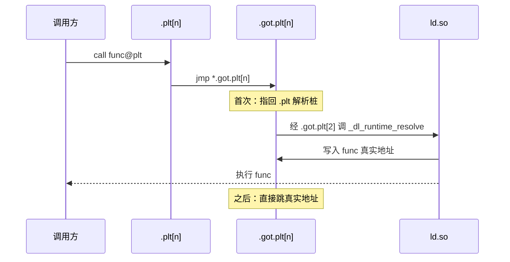

# 详解ELF文件(二十一).got.plt节

.got.plt节（Global Offset Table for Procedure Linkage Table）是ELF（Executable and Linkable Format）文件格式中用于存储函数地址的重要节区，它是实现动态链接和延迟绑定机制的关键数据结构。

## 1. 基本概念

.got.plt节是ELF文件中专门用于存储外部函数地址的全局偏移表，它与 .plt（过程链接表）紧密配合，实现函数调用的延迟绑定机制。.got.plt节是 GOT 表的一个专门部分，专门用于处理函数引用。

历史上 GOT 曾是单一的 `.got` 节，后来因性能和安全原因被分裂为两张表：

- **`.got`**：存储数据符号地址，加载时立即重定位，可受 RELRO 保护
- **`.got.plt`**：存储函数地址，默认延迟绑定（首次调用时才解析），因此需要在调用前保持可写

## 2. 与.got节的区别

.got.plt节与 [[17.got节|.got节]] 的主要区别：

| | [[17.got节\|.got]] | .got.plt |
|---|---|---|
| 存储 | 全局变量地址 | 函数地址 |
| 配套重定位 | [[13.rel.dyn节\|.rel.dyn]]（GLOB_DAT/RELATIVE） | [[19.rel.plt节\|.rel.plt]]（JUMP_SLOT） |
| 重定位时机 | 加载时（立即绑定） | 首次调用时（延迟绑定）；Full RELRO 时改为加载时 |
| 访问方式 | PIC 代码直接通过 PC-relative 间接寻址 | 必须经 .plt 跳板间接访问 |
| RELRO 保护 | 部分 RELRO 即可保护 | 需完全 RELRO 才能保护 |
| 初始值 | 0（加载时填入） | 对应 .plt 解析桩地址（首次调用后更新） |

## 3. 数据结构：前三项特殊保留条目

.got.plt节没有特定的结构体定义，它是一个地址表，每个表项通常为指针大小（32位系统为4字节，64位系统为8字节）。它的**前三项有特殊用途**，由 ABI 规范和动态链接器共同约定：

```
.got.plt:
  [0]  → .dynamic 节的虚拟地址（链接器填入；供 ld.so 定位 .dynamic）
  [1]  → 本模块的 link_map 结构指针（运行时由 ld.so 填入）
  [2]  → _dl_runtime_resolve 解析函数地址（运行时由 ld.so 填入）
  [3]  → 第一个外部函数（初始指向其 .plt 解析桩；首次调用后更新为真实地址）
  [4]  → 第二个外部函数
  ...
```

### 3.1 条目 [0]：`_DYNAMIC` 地址

- **链接时**由链接器写入 `.dynamic` 节的虚拟地址（或在 PIE/共享库中写入 0，由 ld.so 在加载时修正）
- ld.so 可通过此项快速定位 .dynamic，而无需重新解析 PT_DYNAMIC 程序头
- 在某些 ABI 中（如 s390x）`_GLOBAL_OFFSET_TABLE_` 定义为 `_DYNAMIC` 的别名，即 `.got.plt[0]` 等于 `_DYNAMIC`

### 3.2 条目 [1]：`link_map` 指针

- **初始值为 0**（链接时），由 ld.so 在加载阶段填入本模块的 `struct link_map *` 指针
- `link_map` 是 ld.so 内部维护所有已加载 DSO 的双向链表节点，包含 DSO 名称、加载基址、.dynamic 指针等关键信息
- PLT 头（PLT[0]）调用 `_dl_runtime_resolve` 时，将此值 push 到栈作为第一个参数（或放入 rdi/r10 等寄存器）

### 3.3 条目 [2]：`_dl_runtime_resolve` 地址

- **初始值为 0**（链接时），由 ld.so 在加载阶段填入 `_dl_runtime_resolve()` 函数的真实地址
- `_dl_runtime_resolve` 是 ld.so 中实现符号懒解析的汇编 trampoline，负责：
  1. 保存调用者寄存器状态（rax/rcx/rdx/rsi/rdi/r8/r9 及 xmm0–7）
  2. 调用 `_dl_fixup(link_map, reloc_arg)` 完成符号查找与 GOT 回填
  3. 恢复寄存器并直接跳转到已解析的目标函数（避免额外的调用帧）

### 3.4 条目 [3+]：函数地址表项

每个被动态链接的外部函数对应一个表项：

- **加载时初始值**：指向该函数在 .plt 中对应的解析桩（resolver stub）地址（即 PLT[n] 中 `push reloc_arg` 那条指令的地址）
- **首次调用后**：`_dl_fixup` 将真实函数地址回填此处，后续调用直接跳转

## 4. PLT 与 .got.plt 的协作：详细汇编解析

以 x86-64 为例，一个典型的 PLT 结构如下：

### 4.1 PLT[0]：全局解析桩（PLT header）

```nasm
; PLT 头（地址偏移 0x401020，以符号名 .plt 为基准）
PLT[0]:
    push  QWORD PTR [rip+0x2fe2]   ; push .got.plt[1]（link_map 指针）
    jmp   QWORD PTR [rip+0x2fe4]   ; jmp  .got.plt[2]（_dl_runtime_resolve）
    nop   DWORD PTR [rax+0x0]      ; 填充对齐
```

### 4.2 PLT[n]：单个函数的 PLT 条目

```nasm
; printf 的 PLT 条目（偏移 0x401030）
PLT[printf]:
    jmp   QWORD PTR [rip+0x2fe6]   ; jmp .got.plt[3]（初始指向下一条 push）
    push  0                        ; reloc_arg = 0（在 .rela.plt 中的索引）
    jmp   PLT[0]                   ; 跳到 PLT 头触发 _dl_runtime_resolve
```

### 4.3 首次调用的完整路径



### 4.4 后续调用的直接路径

```
call printf@plt
  → jmp *.got.plt[3]   ; .got.plt[3] 现在 = printf 真实地址
    → printf（直接执行，无任何 ld.so 介入）
```

后续调用只有 2 条指令的额外开销（一次 call + 一次 jmp），极为高效。

## 5. 与其它节的关系

.got.plt节与以下节紧密关联：

1. **.plt节**：存储函数调用的 stub 代码，通过跳转到 .got.plt 中的地址实现函数调用
2. **[[20.rela.plt节|.rela.plt]] / [[19.rel.plt节|.rel.plt]] 节**：存储函数重定位信息，指示 .got.plt 中哪些表项需要重定位（JUMP_SLOT）
3. **[[18.dynamic节|.dynamic]] 节**：DT_PLTGOT 指向 .got.plt，DT_JMPREL 指向 PLT 重定位表

## 6. .rela.plt 与 .got.plt 的对应关系

`.rela.plt` 中每条 `R_X86_64_JUMP_SLOT` 重定位描述一个 .got.plt 表项的初始化：

```c
// Elf64_Rela 结构（.rela.plt 中的每个条目）
typedef struct {
    Elf64_Addr  r_offset;   // 目标：对应 .got.plt 表项的虚拟地址
    Elf64_Xword r_info;     // 高32位=符号索引，低32位=R_X86_64_JUMP_SLOT(7)
    Elf64_Sxword r_addend;  // 通常为 0
} Elf64_Rela;
```

延迟绑定时，ld.so 用 `r_info` 中的符号索引查找 `.dynsym` 得到符号名，再在全局符号空间中搜索，最终将结果地址写入 `r_offset` 所指向的 .got.plt 表项。

## 7. 工作原理与延迟绑定



工作流程：

1. **编译时**：为每个外部函数生成 .plt 条目；在 .got.plt 预留表项并初始化为指向 .plt 解析代码
2. **加载时**：前三项被初始化为链接器相关数据；函数表项暂指向 .plt 解析代码
3. **首次调用时**：.plt → .got.plt → 解析代码 → ld.so 解析地址并回填 .got.plt 表项
4. **后续调用**：.got.plt 表项已是真实地址，直接跳转

## 8. 延迟绑定机制

.got.plt节是实现延迟绑定（Lazy Binding）的关键：

1. **性能优化**：程序启动时不解析所有函数，只在首次调用时解析
2. **资源节约**：减少启动时间、节省内存
3. **实现过程**：.plt 第一个条目是解析 stub，负责调用动态链接器；其他条目负责调用解析 stub 或直接跳转

## 9. Partial vs Full RELRO 对 .got.plt 的影响

RELRO（Relocation Read-Only）是影响 .got.plt 可写性的核心安全机制：

### 9.1 无 RELRO

```
.got.plt: 可写（SHF_WRITE）
加载时初始化前三项 → 函数项初始化为 PLT 解析桩 → 延迟绑定正常工作
```

此时 .got.plt 对整个进程生命周期均可写，是 GOT 改写攻击的主要目标。

### 9.2 部分 RELRO（Partial RELRO，`-Wl,-z,relro`）

```
.got（GLOB_DAT/RELATIVE 项）：mprotect() → 只读
.got.plt：仍然可写（因为延迟绑定需要在调用时回填）
```

部分 RELRO 保护了数据符号的 GOT，但对函数 GOT（.got.plt）无保护——攻击者仍可覆写 puts/system 等的 GOT 表项。

### 9.3 完全 RELRO（Full RELRO，`-Wl,-z,relro -Wl,-z,now`）

```
启动时处理全部 JUMP_SLOT 重定位（等同 LD_BIND_NOW）
.got.plt：mprotect() → 只读
延迟绑定：禁用
```

完全 RELRO 的代价是启动时间增加（需解析所有外部函数），但从根本上阻断了 .got.plt 改写攻击。

| RELRO 级别 | .got | .got.plt | 延迟绑定 | 安全强度 |
|---|---|---|---|---|
| 无 | 可写 | 可写 | 启用 | 无 |
| 部分 RELRO | 只读 | 可写 | 启用 | 低 |
| 完全 RELRO | 只读 | 只读 | 禁用 | 高 |

```bash
# 检查 RELRO 状态
checksec --file=/bin/ls
readelf -l /bin/ls | grep -E 'GNU_RELRO|GNU_RELR'
readelf -d /bin/ls | grep BIND_NOW
```

## 10. 实战：查看 .got.plt

```bash
readelf -x .got.plt /bin/ls
objdump -d -j .plt /bin/ls      # 对照看 .plt 如何跳转到 .got.plt
```

```text
# 示例输出（代表性，非本机实跑）
$ readelf -x .got.plt /bin/ls
Hex dump of section '.got.plt':
  0x00405fd0 006f3f00 00000000 00704000 00000000 .o?......p@.....
  0x00405fe0 00704000 00000000 70834000 00000000 .p@.....p.@.....

# [0]: 0x003f6f00 = .dynamic 地址（链接时填入）
# [1]: 0x00404070 = link_map（ld.so 运行时填入，此处为加载后的内容）
# [2]: 0x00404070 = _dl_runtime_resolve（ld.so 运行时填入）
# [3+]: 初始值为各自的 PLT 解析桩地址
```

### 10.1 用 GDB 观察延迟绑定的完整过程

```bash
$ gdb ./a.out
(gdb) disas 'puts@plt'        # 查看 PLT 条目
(gdb) x/4gx &puts@got.plt    # 查看 .got.plt 表项（调用前）
(gdb) break puts               # 在 puts 处断点触发解析
(gdb) run
# 调用 puts 后再查看
(gdb) x/4gx &puts@got.plt    # 值已变为 puts 真实地址
```

```bash
# 使用 LD_DEBUG 观察绑定时机
LD_DEBUG=bindings ./a.out 2>&1 | head -20
# 输出示例（首次调用 puts 时打印）：
#   binding file ./a.out to /lib/x86_64-linux-gnu/libc.so.6:
#   symbol `puts' [GLIBC_2.2.5]
```

## 11. 安全考虑

.got.plt节是安全攻击的重要目标：

1. **GOT覆盖攻击**：修改 .got.plt 中的函数地址，劫持控制流到恶意代码
2. **ret2dl-resolve**：在 Full RELRO 场景下，攻击者通过伪造 .rela.plt 和 .dynsym 结构欺骗 `_dl_runtime_resolve`，间接控制解析结果
3. **ROP攻击**：利用 .plt/.got.plt 构造 ROP 链
4. **RELRO保护**：
    - 部分RELRO：保护 .got（但 .got.plt 因延迟绑定仍可写）
    - 完全RELRO：启动时解析全部符号并将 .got.plt 置为只读（关闭延迟绑定）

## 12. 实际应用场景

1. **动态链接**：实现程序与共享库之间的函数调用，支持多程序共享库函数
2. **程序优化**：通过延迟绑定减少启动时间
3. **安全防护**：与 ASLR 配合增加攻击难度

.got.plt节作为ELF文件动态链接机制的重要组成部分，为程序提供了函数调用的延迟绑定能力。通过与 .plt 节和重定位表的配合，它确保了程序在运行时能够正确解析和调用所需的外部函数，是现代动态链接系统的关键技术之一。

## 相关阅读

- **数据版 GOT**：[[17.got节]]
- **配套重定位**：[[19.rel.plt节]]、[[20.rela.plt节]]
- **驱动者**：[[18.dynamic节]]
- 上一篇：[[20.rela.plt节]] ｜ 下一篇：[[22.rel.text节]]
