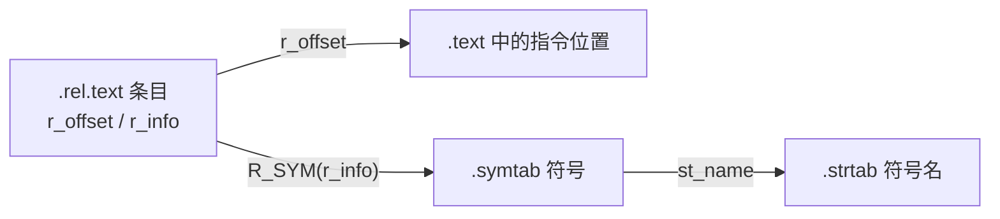

# 详解ELF文件(二十二).rel.text节

.rel.text节是ELF（Executable and Linkable Format）文件格式中用于代码重定位的重要节区，它存储了 [[05.text节|.text节]] 中需要在链接时进行地址调整的位置信息。

## 1. 基本概念

.rel.text节（Relocation for Text Section）是ELF文件中的重定位表，专门用于存储.text节中需要重定位的信息。它记录了在链接过程中需要修改的代码位置，特别是那些引用外部符号（函数或全局变量）的指令。

**.rel.text 只存在于可重定位目标文件（`.o`）中**，用于静态链接阶段（`ld` 命令）。最终可执行文件或共享库中代码段的重定位已由静态链接器消解完毕，运行时动态链接器只需处理 `.rela.dyn`（数据符号）和 `.rela.plt`（函数延迟绑定）。

在 x86-32 上使用 REL 格式（`Elf32_Rel`），在 x86-64 上实际使用 RELA 格式，即 `.rela.text`（`Elf64_Rela`）。本篇以通用/32 位视角介绍，x86-64 具体形式参见 [[23.rela.text节]]。

## 2. 作用和功能

.rel.text节的主要作用包括：

1. **代码重定位**：
    - 记录.text节中需要在链接时修改的位置
    - 为链接器提供重定位信息，以便正确解析外部符号引用
2. **符号解析支持**：
    - 配合 [[09.symtab节|.symtab]] 符号表，帮助链接器找到需要重定位的符号
    - 支持跨模块的函数调用和全局变量引用
3. **链接过程辅助**：
    - 在可重定位目标文件中必不可少
    - 在可执行文件中通常被移除（因为地址已确定）

## 3. 与.rel.data的区别

.rel.text和 [[11.rel.data节|.rel.data]] 节的主要区别：

| | .rel.text | .rel.data |
|---|---|---|
| 作用范围 | 代码段 .text | 数据段 .data |
| 重定位目标 | 指令中的符号引用 | 数据中的符号引用（全局变量初始化） |
| 典型时机 | 函数调用/跳转指令 | 全局变量初始化 |
| 典型类型 | R_386_PC32、R_X86_64_PLT32 | R_386_32、R_X86_64_64 |
| 加数来源 | 指令偏移量字节 | 数据字段内容 |

## 4. 数据结构

.rel.text节由Elf32_Rel或Elf64_Rel结构体数组组成，具体结构如下：

```c
// 32位系统结构
typedef struct {
    Elf32_Addr r_offset;  // 需要重定位的位置（相对于节区开始的偏移）
    Elf32_Word r_info;    // 重定位类型和符号表索引
} Elf32_Rel;

// 64位系统结构（带加数，对应 .rela.text）
typedef struct {
    Elf64_Addr  r_offset;  // 需要重定位的位置
    Elf64_Xword r_info;    // 重定位类型和符号表索引
    Elf64_Sxword r_addend; // 加数
} Elf64_Rela;
```

各字段说明：

- **r_offset**：需要重定位的位置，相对于节区开始的偏移量
- **r_info**：包含重定位类型和符号表索引，通过以下宏操作：
    - 32 位：ELF32_R_SYM(info)=info>>8、ELF32_R_TYPE(info)=(unsigned char)info
    - 64 位：ELF64_R_SYM(info)=info>>32、ELF64_R_TYPE(info)=info&0xffffffff
- **r_addend**（仅在Rela类型中）：重定位计算中的加数

### 4.1 REL 与 RELA 加数处理的区别

```
REL 模式（.rel.text，x86-32）：
  加数 A 隐式存储在被修改位置的现有字节中
  链接器先读出这些字节作为初始加数，再叠加计算

RELA 模式（.rela.text，x86-64）：
  加数 A 由 r_addend 字段显式提供
  被修改位置在链接前可包含任意占位内容（通常为 0）
  公式：*P = S + A - P（PC 相对）或 *P = S + A（绝对）
```

## 5. 常见重定位类型

.rel.text节中常见的重定位类型包括：

| 类型 | 计算公式 | 位宽 | 用途 |
|---|---|---|---|
| R_386_32 | S + A | 32 | x86(32) 直接 32 位绝对地址 |
| R_386_PC32 | S + A − P | 32 | x86(32) PC 相对（call/jmp） |
| R_X86_64_64 | S + A | 64 | x86-64 64 位绝对地址（.data 中常见） |
| R_X86_64_32 | S + A | 32 | x86-64 32 位零扩展绝对地址 |
| R_X86_64_32S | S + A | 32 | x86-64 32 位符号扩展绝对地址（非 PIC） |
| R_X86_64_PC32 | S + A − P | 32 | x86-64 PC 相对（局部跳转/引用 .rodata） |
| R_X86_64_PLT32 | L + A − P | 32 | x86-64 经 PLT 的外部函数调用 |
| R_X86_64_GOTPCREL | G + GOT + A − P | 32 | 经 GOT 间接引用（-fPIC 数据） |
| R_X86_64_GOTPCRELX | G + GOT + A − P | 32 | 可 relax 的 GOT 间接引用（无 REX） |
| R_X86_64_REX_GOTPCRELX | G + GOT + A − P | 32 | 可 relax 的 GOT 间接引用（含 REX 前缀） |

（符号：S=符号运行时地址，A=加数，P=被修正位置地址，L=PLT 条目地址，G=GOT 条目在 GOT 表内偏移，GOT=GOT 表基地址）

### 5.1 各类型详解

#### R_386_PC32 / R_X86_64_PC32

**PC 相对重定位**，用于 x86/x86-64 的 `call` 和相对 `jmp` 指令。链接器计算：

```
填入值 = S + A - P
```

其中 P 是指令中 4 字节偏移字段的地址（即紧接 `call` 操作码后的地址），`A` 通常为 `-4`（因为 x86 的 `call` 操作数是相对于**下一条指令**的偏移，而非当前字段），所以等效为：

```
偏移 = 目标地址 - (P + 4) = 目标地址 - 指令末尾
```

**值域**：`[-2^31, 2^31)`，超过 ±2 GiB 会引发链接错误 `relocation truncated to fit`。

#### R_X86_64_PLT32

功能等同 `R_X86_64_PC32`，但明确指示目标是通过 PLT 跳转的外部函数：

```
填入值 = L + A - P
L = 函数在 .plt 中的 stub 地址
```

编译器在 PIC 模式下对外部函数调用生成 `R_X86_64_PLT32`；若链接器确认目标是局部定义（可见性不超出模块），可以将其优化为 `R_X86_64_PC32`（直接调用，无需 PLT）。

#### R_X86_64_32 vs R_X86_64_32S

两者都将结果截断为 32 位，区别在于链接器的合法性验证：

```
R_X86_64_32：  结果必须能零扩展回原 64 位值 → 值域 [0, 2^32)
R_X86_64_32S： 结果必须能符号扩展回原 64 位值 → 值域 [-2^31, 2^31)
```

非 PIC 代码（`-fno-pic`）默认假设符号地址在低 2 GiB，生成 `R_X86_64_32S`。若地址超出此范围，链接失败，需切换到大代码模型（`-mcmodel=large`）或开启 PIC。

#### R_X86_64_GOTPCREL / GOTPCRELX / REX_GOTPCRELX

用于 PIC 代码引用全局变量或外部数据：

```
填入值 = G + GOT + A - P
     = &GOT[symbol] - P + A
```

实际效果：把"GOT 中存放 symbol 地址的那个槽"相对于当前 PC 的偏移值写入指令。

`GOTPCRELX`（无 REX 前缀）和 `REX_GOTPCRELX`（有 REX 前缀）是 x86-64 psABI 引入的**可 relax 版本**，语义与 `GOTPCREL` 相同，但允许链接器在满足条件时优化掉 GOT 间接层，详见第 8 节。

## 6. 与其它节的关系



.rel.text节与以下节紧密关联：

1. **[[05.text节|.text]] 节**：.rel.text 为 .text 提供重定位信息，r_offset 指向 .text 中的位置
2. **[[09.symtab节|.symtab]] 节**：通过 r_info 中的符号索引获取符号信息
3. **.strtab 节**：存储符号名称字符串，通过 .symtab 的 st_name 索引访问

## 7. 工作原理

.rel.text节的工作流程如下：

1. **编译时**：
    - 编译器为每个外部函数调用或全局变量引用生成占位符
    - 在.rel.text节中记录需要重定位的位置和符号信息
2. **链接时**：
    - 链接器读取.rel.text节中的重定位条目
    - 根据符号表解析符号地址
    - 计算重定位值并修改.text节中的相应位置
3. **执行时**：
    - 重定位已完成，代码可直接执行

### 7.1 目标文件中代码如何引用外部符号

编译器编译 `main.c` 时，不知道 `puts` 的最终地址，于是：

1. 在 `.text` 中生成 `call 0x0`（或 `call +0`）——地址为占位 0
2. 在 `.rela.text`（或 `.rel.text`）中插入一条条目：
   - `r_offset`：指向 `.text` 中 `call` 指令的 4 字节偏移字段起始处
   - `r_info`：类型 `R_X86_64_PLT32`，符号索引指向 `.symtab` 中 `puts` 条目
   - `r_addend`：`-4`（因 PC 相对计算从下一条指令地址开始）

3. 链接器 (`ld`) 处理时：
   - 解析 `puts` → 分配/找到 `.plt` 中的 `puts@plt` 地址（设为 `L`）
   - 计算：`(L + (-4)) - P`，其中 P 为该偏移字段地址
   - 将结果 4 字节写入 `.text` 对应位置

### 7.2 链接器消解外部引用的完整过程

```
多个 .o 文件 → 链接器合并 .text 节
  ↓
遍历合并后所有 .rela.text 条目
  ↓
对每条 r_info 中的符号：
  - 若符号在本模块定义：直接使用定义地址
  - 若符号为弱引用且未定义：填 0 或特定值
  - 若符号为外部函数引用：
    - 生成对应 .plt 条目 + .got.plt 槽 + .rela.plt 重定位条目
    - 用 .plt 条目地址（L）参与计算
  - 若符号为外部数据引用（-fPIC）：
    - 生成 .got 槽 + .rela.dyn 重定位条目
    - 用 GOT 槽地址参与 GOTPCREL 计算
  ↓
将计算结果写入 .text 对应偏移（r_offset 处）
  ↓
最终可执行文件/SO 中 .rela.text 节被丢弃（不再需要）
```

## 8. GOTPCRELX relax 优化详解

x86-64 psABI 从 2017 年起引入 `R_X86_64_GOTPCRELX` 和 `R_X86_64_REX_GOTPCRELX`，允许链接器在特定条件下**放宽（relax）GOT 间接寻址**，将其优化为直接引用。

### 8.1 优化条件

链接器可以执行 relax 当且仅当：
1. 符号在当前可执行/DSO 中**本地可见**（非动态导出的全局符号）
2. `r_addend == -4`（正常情况下编译器生成的标准加数）

### 8.2 典型 relax 变换

**`mov foo@GOTPCREL(%rip), %reg` → `lea foo(%rip), %reg`**

```
# 变换前（带 GOTPCRELX）：通过 GOT 间接取 foo 地址
  48 8b 05 XX XX XX XX   movq foo@GOTPCREL(%rip), %rax
  # 等效：rax = *GOT[foo] = &foo（多一次内存间接）

# 变换后（relax 后）：直接 PC 相对取 foo 地址
  48 8d 05 XX XX XX XX   leaq foo(%rip), %rax
  # 等效：rax = &foo（零额外内存访问）
```

**非 PIE 下可进一步 relax 为直接地址：**

```
# LLD 在非 PIE 下可能进一步优化为
  48 c7 c0 <addr32>      movq $foo, %rax
```

### 8.3 GOTPCRELX 无 REX vs REX_GOTPCRELX

| 重定位类型 | 适用指令前缀 | 举例指令 |
|---|---|---|
| R_X86_64_GOTPCRELX | 无 REX 前缀 | `movl foo@GOTPCREL(%rip), %eax` |
| R_X86_64_REX_GOTPCRELX | 有 REX 前缀（如 `48`=REX.W） | `movq foo@GOTPCREL(%rip), %rax` |

两者 relax 变换逻辑相同，区别仅在指令编码的 REX 前缀处理。

### 8.4 加数约束

若 `r_addend != -4`（如 Clang 某些情况下生成 `+0` 加数），链接器**不得** relax，否则语义错误：

```
# 不可 relax 的情况（addend = 0，加载 GOT 项中高 32 位）
  movl x@GOTPCREL+4(%rip), %reg
```

这是 `D91993 [ELF] Don't relax R_X86_64_GOTPCRELX if addend != -4` 修复的 bug。

## 9. 实战：查看 .rel.text

```bash
readelf -r main.o
objdump -dr main.o          # 反汇编时把重定位标注在指令旁
```

```text
# 示例输出（代表性，非本机实跑）
$ readelf -r main.o
Relocation section '.rela.text' at offset 0x400 contains 2 entries:
  Offset          Info           Type           Sym. Value    Sym. Name + Addend
000000000015  000a00000002 R_X86_64_PC32     0000000000000000 .rodata - 4
00000000001f  000500000004 R_X86_64_PLT32    0000000000000000 puts - 4
```

在这个例子中：

- **Offset**：对应r_offset字段，表示.text节中需要重定位的位置
- **Info**：对应r_info字段，包含符号索引和重定位类型
- **Type**：重定位类型（PC32 为相对寻址，PLT32 为经 PLT 的函数调用）
- **Sym. Name**：符号名称（`puts` 即将经 PLT 调用的库函数）

### 9.1 objdump -dr 对照解读

```bash
objdump -dr main.o
```

```text
# 示例输出（代表性，非本机实跑）
Disassembly of section .text:

0000000000000000 <main>:
   0:   55                      push   %rbp
   1:   48 89 e5                mov    %rsp,%rbp
   ...
  18:   48 8d 05 00 00 00 00    lea    0x0(%rip),%rax   # 将 .rodata 字符串地址存入 rax
                        1b: R_X86_64_PC32  .rodata-0x4  # 链接器用 PC 相对偏移回填
  1f:   48 89 c7                mov    %rax,%rdi
  22:   e8 00 00 00 00          call   27 <main+0x27>
                        23: R_X86_64_PLT32  puts-0x4    # 链接器修正为 puts@plt 的 PC 相对偏移
  ...
```

**逐行解读：**

- `1b: R_X86_64_PC32 .rodata-0x4`：
  - `r_offset=0x1b`：指向 `lea` 指令中 4 字节 RIP 偏移字段
  - 类型 `PC32`：填入值 = S（.rodata 起始）+ A（-4）- P（0x1b）
  - 链接后：`lea` 指令能正确计算出 .rodata 中字符串的地址

- `23: R_X86_64_PLT32 puts-0x4`：
  - `r_offset=0x23`：指向 `call` 的 4 字节偏移字段
  - 类型 `PLT32`：填入值 = L（puts@plt）+ A（-4）- P（0x23）
  - 链接后：`call` 指令跳到 `puts@plt` 的 PLT 条目，再经 GOT/延迟绑定调用 libc puts

### 9.2 R_X86_64_32S 场景示例

```text
# 示例输出（代表性，非本机实跑）
$ objdump -dr kernel.o  （非 PIC 内核代码）
  20:  48 c7 04 25 00 00 00 00 00 00 00 00   movq $0x0, 0x0
                        24: R_X86_64_32S  .bss        # 绝对地址，符号扩展到 64 位
```

若 `.bss` 地址超过 `0x7fffffff`（如内核虚拟地址空间高端），链接器报错：`relocation truncated to fit: R_X86_64_32S`，需改用 `-mcmodel=kernel` 或 `-mcmodel=large`。

### 9.3 完整实验流程

```bash
# 1. 编写最小测试文件
cat > /tmp/demo.c << 'EOF'
#include <stdio.h>
int main() { puts("hello"); return 0; }
EOF

# 2. 编译为目标文件
gcc -c -O0 /tmp/demo.c -o /tmp/demo.o

# 3. 查看重定位条目
readelf -r /tmp/demo.o

# 4. 反汇编+重定位对照
objdump -dr /tmp/demo.o

# 5. 链接后查看最终 .plt 和 .got.plt
gcc /tmp/demo.o -o /tmp/demo
objdump -d -j .plt /tmp/demo
readelf -r /tmp/demo          # 此时 .rela.text 已消失，剩 .rela.plt/.rela.dyn
```

## 10. 在不同文件类型中的存在情况

1. **可重定位目标文件（.o文件）**：包含.rel.text节，需要链接器进行重定位
2. **可执行文件**：通常不包含.rel.text节，重定位已在链接时完成
3. **共享库文件（.so文件）**：可能包含动态重定位（[[14.rela.dyn节|.rela.dyn]]/[[20.rela.plt节|.rela.plt]]）

### 10.1 各文件类型重定位节对比

| 文件类型 | .rela.text | .rela.plt | .rela.dyn |
|---|---|---|---|
| 可重定位目标（.o） | 存在（链接前） | 不存在 | 不存在 |
| 静态可执行文件 | 不存在（已消解） | 不存在 | 不存在 |
| 动态可执行文件（非 PIE） | 不存在 | 存在（延迟绑定） | 存在 |
| 共享库（.so，PIC） | 不存在 | 存在（延迟绑定） | 存在（代码/数据引用） |

.rel.text节作为ELF文件链接机制的重要组成部分，为程序提供了代码重定位的能力，确保了模块化编程中跨文件的函数调用和变量引用能够正确解析。通过与.text、.symtab等节的配合，它使得链接器能够正确地将多个目标文件合并成一个可执行文件。

## 相关阅读

- **加数版本（64位实际形式）**：[[23.rela.text节]]
- **数据段对应物**：[[11.rel.data节]]
- **重定位对象与符号**：[[05.text节]]、[[09.symtab节]]
- 上一篇：[[21.got.plt节]] ｜ 下一篇：[[23.rela.text节]]
