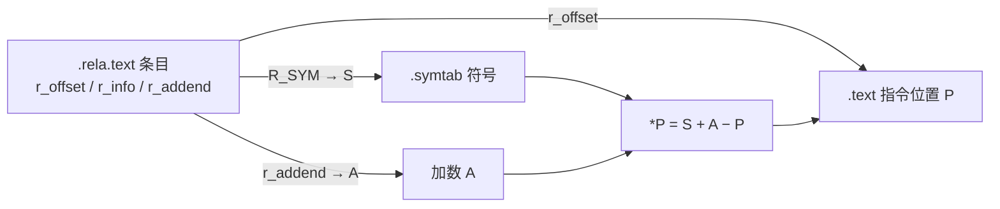

# 详解ELF文件(二十三).rela.text节

.rela.text节是ELF（Executable and Linkable Format）文件格式中用于代码重定位的重要节区，它是.rela（RELA类型重定位）版本的.text节重定位表，主要用于64位系统中。

> 说明：本系列原第 22 篇讲 [[22.rel.text节|.rel.text]]（REL 格式），本篇讲 .rela.text（RELA 格式）。x86-64 上代码段重定位实际采用的就是 .rela.text。

## 1. 基本概念

.rela.text节（Relocation with Addend for Text Section）是ELF文件中的重定位表，专门用于存储 [[05.text节|.text节]] 中需要重定位的信息。它与 [[22.rel.text节|.rel.text]] 节类似，但使用RELA格式，包含显式的加数字段，主要用于64位架构系统中。

**.rela.text 是 x86-64 上最常见的代码重定位节**，几乎每个 `.o` 目标文件中（只要有外部符号引用）都会出现。它由静态链接器（`ld`）在链接阶段处理，最终可执行文件或共享库中该节会被消除——代码段的地址在链接后已确定，无需再次重定位。

## 2. 与.rel.text的区别

.rela.text和 [[22.rel.text节|.rel.text]] 节的主要区别：

1. **数据结构不同**：
    - .rel.text：使用REL格式，重定位信息（加数）隐含在被修改的位置中
    - .rela.text：使用RELA格式，包含显式的加数字段
2. **适用架构不同**：
    - .rel.text：主要用于32位系统
    - .rela.text：主要用于64位系统
3. **大小不同**：
    - REL结构体通常为8字节（32位）/16字节（64位）
    - RELA结构体通常为12字节（32位）/24字节（64位）

| | REL（.rel.text） | RELA（.rela.text） |
|---|---|---|
| 加数 | 隐式（存于被改指令） | 显式 r_addend |
| 计算 | `*P += S` | `*P = S + A − P`（PC32 等） |
| 典型平台 | x86(32) | x86-64、AArch64 |
| 被改位置初始内容 | 含有效加数字节 | 通常为 0（占位） |
| 每条目大小 | 8/16 字节 | 12/24 字节 |

## 3. 数据结构

.rela.text节由Elf64_Rela结构体数组组成，具体结构如下：

```c
// 64位系统结构
typedef struct {
    Elf64_Addr   r_offset;  // 需要重定位的位置（相对于节区开始的偏移）
    Elf64_Xword  r_info;    // 重定位类型和符号表索引
    Elf64_Sxword r_addend;  // 加数
} Elf64_Rela;

// 32位系统结构（如果存在）
typedef struct {
    Elf32_Addr  r_offset;  // 需要重定位的位置
    Elf32_Word  r_info;    // 重定位类型和符号表索引
    Elf32_Sword r_addend;  // 加数
} Elf32_Rela;
```

各字段说明：

- **r_offset**：需要重定位的位置，相对于节区开始的偏移量
- **r_info**：包含重定位类型和符号表索引（64 位：`ELF64_R_SYM(i)=i>>32`、`ELF64_R_TYPE(i)=i&0xffffffff`，符号指向 [[09.symtab节|.symtab]]）
- **r_addend**：重定位计算中的显式加数

### 3.1 r_offset 含义辨析

`r_offset` 在 `.rela.text` 中是相对于 `.text` 节起始的**字节偏移**，指向指令中需要被链接器改写的字段（通常是 `call`/`jmp` 的 4 字节偏移操作数，或 `mov` 的立即数字段）。

链接器将多个 `.o` 文件的 `.text` 节合并后，会把每条 `.rela.text` 条目的 `r_offset` 加上对应 `.text` 片段在合并后的基地址，得到绝对偏移，再执行重定位写入。

### 3.2 r_addend 的典型取值

| 重定位类型 | 典型 r_addend 值 | 原因 |
|---|---|---|
| R_X86_64_PC32 | -4 | x86-64 call/jmp 操作数相对**下一条**指令，偏移字段末尾+4 = 下一条起始 |
| R_X86_64_PLT32 | -4 | 同上（call func@plt 的偏移字段） |
| R_X86_64_64 | 0 | 64 位绝对地址，无需偏移补偿 |
| R_X86_64_32S | 0 | 32 位绝对，同上 |
| R_X86_64_GOTPCREL | -4 | RIP 相对 GOT 引用，偏移字段同样从下一条计算 |
| R_X86_64_GOTPCRELX | -4 | 同 GOTPCREL |
| R_X86_64_REX_GOTPCRELX | -4 | 同 GOTPCREL |

## 4. 常见重定位类型

.rela.text节中常见的重定位类型包括：

| 类型 | 计算公式 | 用途 |
|---|---|---|
| R_X86_64_PC32 | S + A − P | PC 相对（局部跳转、引用 .rodata） |
| R_X86_64_PLT32 | L + A − P | 经 PLT 的外部函数调用 |
| R_X86_64_32 | S + A | 32 位绝对地址（零扩展） |
| R_X86_64_32S | S + A | 32 位绝对地址（符号扩展，非 PIC） |
| R_X86_64_64 | S + A | 64 位绝对地址 |
| R_X86_64_GOTPCREL | G + GOT + A − P | 经 GOT 间接引用（-fPIC 数据，不可 relax） |
| R_X86_64_GOTPCRELX | G + GOT + A − P | 可 relax 版 GOT 引用（无 REX 前缀） |
| R_X86_64_REX_GOTPCRELX | G + GOT + A − P | 可 relax 版 GOT 引用（含 REX 前缀，如 movq） |

（S=符号地址，A=r_addend，P=r_offset 处的运行时地址，L=PLT 条目地址，G=符号 GOT 槽在 GOT 内偏移，GOT=GOT 表运行时基地址）

### 4.1 R_X86_64_PC32 详解

最常见的代码重定位类型，用于 PC 相对指令（`call`、`jmp`、`lea %rip+offset`）：

```
填入值 = S + A - P
```

**示例**：`call puts`，假设链接后：

```
puts@plt 地址 L = 0x401030
call 偏移字段地址 P = 0x400523（即 0x400522 处 call 操作码之后的 4 字节）
A = -4（r_addend）

填入值 = 0x401030 + (-4) - 0x400523 = 0x401030 - 0x400527 = 0x509
```

链接器将 `0x00000509` 写入 `0x400523` 开始的 4 字节。执行 `call` 时，CPU 将 PC（`0x400527`，下一条指令地址）加上此偏移：`0x400527 + 0x509 = 0x401030`，即 `puts@plt`。

### 4.2 R_X86_64_PLT32 与 R_X86_64_PC32 的抉择

编译器对**外部函数**调用生成 `R_X86_64_PLT32`；链接器处理时：

- 若目标函数**局部可见**（如同文件定义、隐藏可见性）：可将 `PLT32` relax 为 `PC32`（直接 call，绕过 PLT）
- 若目标函数**需要经 PLT**（外部共享库）：将 PLT 条目地址 `L` 代入 `L + A - P` 计算

```bash
# 可以通过如下方式观察 PLT32 → PC32 的 relax
gcc -c foo.c -o foo.o        # foo.o 内对本模块函数的调用生成 PLT32
gcc foo.o -o foo             # ld 若确认目标本地，relax 为 PC32（无 PLT 条目）
```

### 4.3 R_X86_64_32S 与溢出

非 PIC 代码（`-fno-pic`）用 `R_X86_64_32S` 引用绝对地址：

```asm
# 非 PIC，内核代码片段
mov  $kernel_symbol, %rax   ; 生成 R_X86_64_32S
```

链接器验证：`(int64_t)(int32_t)(S + A) == S + A`，即值必须能符号扩展回原始 64 位值。若符号地址超过 `0x7FFFFFFF`（如内核代码通常在高端虚拟地址），链接失败：

```
ld: relocation truncated to fit: R_X86_64_32S against `.text'
```

解决：使用 `-mcmodel=kernel`（内核场景）或 `-fPIC`。

### 4.4 GOTPCREL / GOTPCRELX / REX_GOTPCRELX 三者关系

```
R_X86_64_GOTPCREL      → 经典 GOT 引用（不可 relax，已少用）
R_X86_64_GOTPCRELX     → 可 relax，针对无 REX 前缀指令（如 movl ... %eax）
R_X86_64_REX_GOTPCRELX → 可 relax，针对含 REX.W 前缀指令（如 movq ... %rax）
```

clang 默认生成 `GOTPCRELX`/`REX_GOTPCRELX`（自 LLVM 启用 `ENABLE_X86_RELAX_RELOCATIONS` 起）；GCC 可能直接生成 `PC32` 或 `GOTPCREL`，取决于 PIC 模式和优化级别。

## 5. 与其它节的关系



.rela.text节与以下节紧密关联：

1. **[[05.text节|.text]] 节**：.rela.text 为 .text 提供重定位信息，r_offset 指向 .text 中的位置
2. **[[09.symtab节|.symtab]] 节**：通过 r_info 中的符号索引获取符号信息
3. **.strtab 节**：存储符号名称字符串，通过 .symtab 的 st_name 索引访问

### 5.1 节头表（SHT）中的关联字段

`.rela.text` 节头包含：

```c
sh_type    = SHT_RELA       // 重定位节类型（带加数）
sh_flags   = 0              // 不分配内存、不执行
sh_info    = index(.text)   // 指向被重定位的节（.text 的节头索引）
sh_link    = index(.symtab) // 指向关联符号表（.symtab 节头索引）
sh_entsize = 24             // 每条 Elf64_Rela 条目 24 字节
```

`sh_info` 和 `sh_link` 将 `.rela.text` 与 `.text`、`.symtab` 绑定，链接器可直接从节头表得到这层关系而无需猜测。

## 6. 工作原理

.rela.text节的工作流程如下：

1. **编译时**：
    - 编译器为每个外部函数调用或全局变量引用生成占位符
    - 在.rela.text节中记录需要重定位的位置、符号信息和加数
2. **链接时**：
    - 链接器读取.rela.text节中的重定位条目
    - 根据符号表解析符号地址
    - 使用r_offset、符号信息和r_addend计算重定位值
    - 修改.text节中的相应位置
3. **执行时**：
    - 重定位已完成，代码可直接执行

### 6.1 编译器视角：生成 .rela.text 条目的时机

```c
// 示例 C 代码
#include <stdio.h>
extern int global_var;

int main() {
    printf("val=%d\n", global_var);  // 引用外部函数 + 外部变量
    return 0;
}
```

编译器生成（x86-64，-O0，-fPIC）：

```asm
# .text 片段（编译时，地址均为占位 0）
lea    0x0(%rip), %rdi           ; 引用 .rodata 字符串，占位 0
                                 ; → .rela.text: R_X86_64_PC32 .rodata-4
movq   0x0(%rip), %rsi           ; 引用 global_var（经 GOT），占位 0
                                 ; → .rela.text: R_X86_64_REX_GOTPCRELX global_var-4
call   0x0                       ; 调用 printf，占位 0
                                 ; → .rela.text: R_X86_64_PLT32 printf-4
```

对应 `.rela.text` 条目：

```
Offset  Info              Type                   Sym   Addend
0x07    R_X86_64_PC32     .rodata                 -     -4
0x14    R_X86_64_REX_GOTPCRELX  global_var        -     -4
0x1f    R_X86_64_PLT32    printf                  -     -4
```

### 6.2 链接器视角：消解 .rela.text 的过程

```
步骤 1：收集所有 .o 文件的 .text 和 .rela.text
步骤 2：合并 .text → 确定各 .o 在合并节中的偏移（VMA）
步骤 3：遍历每条 .rela.text 条目：
    a. 解析 r_info 中的符号索引 → 在合并 .symtab 中找到符号
    b. 确定符号地址 S（若为外部函数则为 PLT 地址 L）
    c. 计算 P = VMA(该 .o .text 起始) + r_offset
    d. 按重定位类型公式计算填入值（如 S + A - P）
    e. 将结果写入 .text 对应位置
步骤 4：外部动态符号 → 生成 .rela.plt / .rela.dyn 条目（供运行时）
步骤 5：输出可执行文件，丢弃 .rela.text（不需要了）
```

### 6.3 GOTPCRELX relax 优化

链接器在处理 `R_X86_64_GOTPCRELX`/`R_X86_64_REX_GOTPCRELX` 时，可选择性地执行 **relax（放宽）优化**，将 GOT 间接寻址转换为直接寻址：

**条件：**

1. 目标符号在本模块中**本地可见**（定义于本文件/模块，非动态导出）
2. `r_addend == -4`（编译器生成的标准加数）

**变换示例（REX_GOTPCRELX）：**

```asm
# 变换前（带 R_X86_64_REX_GOTPCRELX）
# 内存中：48 8b 05 XX XX XX XX
movq foo@GOTPCREL(%rip), %rax
# 语义：rax = *GOT[foo] = &foo（两次内存访问：1次读GOT，1次（后续）读foo）

# 变换后（relax，本地符号）
# 内存中：48 8d 05 XX XX XX XX
leaq foo(%rip), %rax
# 语义：rax = &foo（仅 PC 相对地址计算，零额外内存访问）
```

注意：`mov`→`lea` 仅改了**一个操作码字节**（`0x8b` → `0x8d`），REX 前缀和 ModRM 字节保持不变，这正是 `GOTPCRELX` 设计为"可 relax"的精妙之处。

**非 PIE 下的进一步优化：**

```asm
# LLD 在 -no-pie 下可能进一步 relax 为
movq $foo, %rax             # 直接立即数（绝对地址）
```

## 7. 实战：查看 .rela.text

```bash
readelf -r main.o
objdump -dr main.o          # 反汇编并在指令旁标注重定位
```

```text
# 示例输出（代表性，非本机实跑）
$ readelf -r main.o
Relocation section '.rela.text' at offset 0x400 contains 2 entries:
  Offset          Info           Type           Sym. Value    Sym. Name + Addend
000000000015  000a00000002 R_X86_64_PC32     0000000000000000 .rodata + 0
00000000001f  000500000004 R_X86_64_PLT32    0000000000000000 puts - 4
```

在这个例子中：

- **Offset**：对应r_offset字段，表示.text节中需要重定位的位置
- **Info**：对应r_info字段，包含符号索引和重定位类型
- **Type**：重定位类型（PC32 相对、PLT32 经 PLT 调用）
- **Sym. Name + Addend**：符号名称与显式加数（这正是 RELA 相对 REL 多出来的信息）

### 7.1 objdump -dr 完整对照

```bash
objdump -dr main.o
```

```text
# 示例输出（代表性，非本机实跑）
Disassembly of section .text:

0000000000000000 <main>:
   0:   f3 0f 1e fa          endbr64
   4:   55                   push   %rbp
   5:   48 89 e5             mov    %rsp,%rbp
   8:   48 8d 3d 00 00 00 00  lea  0x0(%rip),%rdi  # 字符串地址占位 0
                             b: R_X86_64_PC32    .rodata-0x4
   f:   e8 00 00 00 00       call   14 <main+0x14>
                            10: R_X86_64_PLT32   puts-0x4
  14:   b8 00 00 00 00       mov    $0x0,%eax
  19:   5d                   pop    %rbp
  1a:   c3                   ret
```

**逐条解读：**

- `b: R_X86_64_PC32 .rodata-0x4`：
  - `r_offset=0x0b`：`lea` 指令的 4 字节 RIP 偏移字段（紧接 `48 8d 3d` 后）
  - `r_addend=-4`（即 `.rodata + 0 - 4` 中的 `-4`）
  - 链接时：`*P = S + A - P` = `.rodata_addr + (-4) - P`
  - 效果：执行 `lea` 时 RIP = 下一条指令地址（`P + 4 = 0x0f` 处），`rdi = 0x0f + (S-P-4) = S`（.rodata 首地址）

- `10: R_X86_64_PLT32 puts-0x4`：
  - `r_offset=0x10`：`call` 指令的 4 字节偏移字段
  - `r_addend=-4`（`puts - 4` 中的 `-4`）
  - 链接时：`*P = L + (-4) - P`（L = puts@plt 地址）
  - 效果：执行 `call` 时 PC 跳到 `puts@plt`

### 7.2 readelf -SW 查看节头表关联

```bash
readelf -SW main.o | grep -E 'rela.text|text|symtab'
```

```text
# 示例输出（代表性，非本机实跑）
  [ 1] .text             PROGBITS  ... AX
  [ 5] .rela.text        RELA      ... I   sh_link=9(symtab) sh_info=1(.text)
  [ 9] .symtab           SYMTAB    ...
```

`sh_link=9` 表示本重定位节引用第 9 号节（`.symtab`）中的符号；`sh_info=1` 表示被重定位的节是第 1 号节（`.text`）。

### 7.3 跟踪 GOTPCRELX relax 前后对比

```bash
# 编译含全局变量引用（-fPIC 生成 REX_GOTPCRELX）
gcc -c -fPIC -O0 foo.c -o foo.o
objdump -dr foo.o | grep -A2 GOTPCRELX

# 链接后（若变量为本地定义，链接器执行 relax）
gcc foo.o bar.o -shared -o libfoo.so
objdump -d libfoo.so | grep -A3 '<foo>'
# 若 relax 成功，GOT 引用变为 lea，无 .rela.dyn 条目
```

## 8. 在不同文件类型中的存在情况

1. **可重定位目标文件（.o文件）**：包含.rela.text节，需要链接器进行重定位
2. **可执行文件**：通常不包含.rela.text节，重定位已在链接时完成
3. **共享库文件（.so文件）**：可能包含动态重定位（[[14.rela.dyn节|.rela.dyn]]/[[20.rela.plt节|.rela.plt]]）

### 8.1 链接前后重定位节变化对比

```
链接前（.o 文件）：
  .rela.text   ← 静态链接器消费
  （不含 .rela.plt / .rela.dyn）

链接后（可执行文件/SO）：
  .rela.text   → 已被处理，不再出现
  .rela.plt    ← 新增：PLT 延迟绑定条目（由 .rela.text PLT32 衍生）
  .rela.dyn    ← 新增：GOT 数据符号条目（由 .rela.text GOTPCREL 衍生）
```

### 8.2 静态链接的情况

静态链接（`gcc -static`）下，所有代码合并进单一可执行文件：

- `.rela.text` 在链接时完全消解
- 没有 `.rela.plt`（无动态 PLT）
- 没有 `.rela.dyn`（无动态 GOT）
- 最终二进制**零重定位节**，加载即执行

.rela.text节作为64位ELF文件链接机制的重要组成部分，为程序提供了代码重定位的能力，通过显式的加数字段提供了更灵活的重定位计算方式。通过与.text、.symtab等节的配合，它使得链接器能够正确地将多个目标文件合并成一个可执行文件。

## 相关阅读

- **无加数版本**：[[22.rel.text节]]
- **数据段对应物**：[[12.rela.data节]]
- **重定位对象与符号**：[[05.text节]]、[[09.symtab节]]
- 上一篇：[[22.rel.text节]] ｜ 下一篇：[[24.debug节]]
