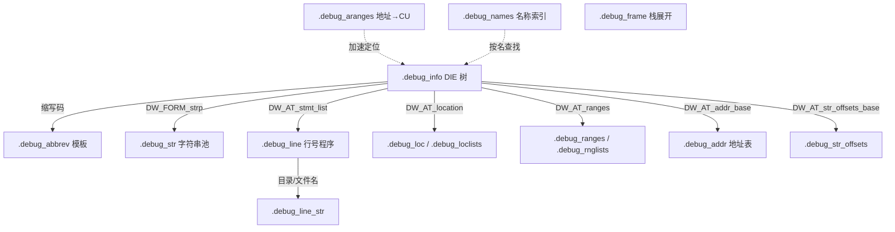

# 详解ELF文件(二十四).debug节

.debug节是ELF（Executable and Linkable Format）文件格式中用于存储调试信息的重要节区集合，它为调试器提供了源代码级别的调试支持。

## 1. 基本概念

.debug节是一组以 `.debug` 为前缀的节区，用于存储程序的调试信息。这些节区只有在使用 `-g` 选项编译时才会生成，它们为调试器（如 GDB）提供了将机器代码映射回源代码的能力。

DWARF（Debug With Arbitrary Record Formats）是目前 ELF 可执行文件与共享库中使用最广泛的调试信息标准格式，由 UNIX International Programming Languages SIG 于 1992 年在 DWARF 1 基础上制定，历经 DWARF 2（1993）、DWARF 3（2005）、DWARF 4（2010）、DWARF 5（2017）四次重大修订。绝大多数 `.debug_*` 节均属于 DWARF 标准的组成部分。

## 2. DWARF 整体架构

### 2.1 设计哲学

DWARF 的核心设计理念是"按需延迟解析"：调试节以自描述的二进制字节码编码，消费者（调试器）只读取实际需要的部分，而无须将全部信息加载进内存。具体体现在：

- **缩写机制**：公共结构模板存于 `.debug_abbrev`，`.debug_info` 中 DIE 只引用一个 ULEB128 缩写码，避免重复存储标签名和属性类型。
- **字符串池**：所有可复用字符串集中存于 `.debug_str`（DWARF5 新增 `.debug_line_str`），以偏移引用，消除大量重复字节。
- **行号状态机**：`.debug_line` 以字节码程序驱动一个寄存器状态机，每条行号映射可用 1～3 字节紧凑编码，大幅压缩映射表。
- **变长 LEB128 整数**：大量使用 ULEB128/SLEB128 编码整数，小值用 1 字节，大值自动扩展，平均每个 DIE 长度远短于固定宽度编码。

### 2.2 DWARF 版本演进

| 版本 | 发布 | 主要新增特性 |
|------|------|-------------|
| DWARF 1 | 1992 | 基础 DIE/标签/属性概念 |
| DWARF 2 | 1993 | 编译单元头部、CFA/CFI 规范（`.debug_frame`）、LEB128 |
| DWARF 3 | 2005 | 名字空间支持（`DW_TAG_namespace`）、`DW_FORM_ref_sig8`、部分 C++ 模板、`DW_AT_ranges` |
| DWARF 4 | 2010 | 类型签名（`.debug_types`）、`DW_FORM_exprloc`、`DW_FORM_flag_present`、`DW_FORM_sec_offset`、`DW_AT_main_subprogram` |
| DWARF 5 | 2017 | `unit_type` 字段、`.debug_rnglists`、`.debug_loclists`、`.debug_addr`、`.debug_str_offsets`、`.debug_line_str`、`.debug_names`、`.debug_macro`、Split DWARF 标准化、`DW_FORM_implicit_const`、`DW_FORM_addrx`、`DW_FORM_loclistx`、`DW_FORM_rnglistx` |

### 2.3 32-bit 与 64-bit DWARF 格式

DWARF 使用两种偏移宽度来适配大型程序：

- **32-bit DWARF 格式**：节内偏移使用 4 字节，`unit_length` 字段前 4 字节 < `0xfffffff0`
- **64-bit DWARF 格式**：`unit_length` 前 4 字节为 `0xffffffff`，后跟 8 字节真实长度；所有节偏移使用 8 字节

两种格式**不可在同一个编译单元内混用**（DWARF5 spec 第 7.4 节）。

## 3. .debug节的类型

### 3.1 核心节（DWARF 2/3/4/5 通用）

每个调试节区均以 `.debug_` 开头（点击进入各子节详解）：

| 节名 | 作用 | 引入版本 |
|------|------|----------|
| **[[26.debug_info节\|.debug_info]]** | DIE 树主体，程序所有调试信息的核心 | DWARF 2 |
| **[[27.debug_line节\|.debug_line]]** | 源文件行号 ↦ 机器码地址映射（行号程序） | DWARF 2 |
| **[[28.debug_abbrev节\|.debug_abbrev]]** | DIE 缩写模板，定义 tag/属性名/form | DWARF 2 |
| **[[29.debug_str节\|.debug_str]]** | 字符串池（变量名、函数名、文件路径等） | DWARF 2 |
| **[[30.debug_aranges节\|.debug_aranges]]** | 地址范围 → 编译单元的加速索引 | DWARF 2 |
| **[[31.debug_pubnames节\|.debug_pubnames]]** | 全局公开符号名称 → DIE 偏移索引 | DWARF 2 |
| **[[32.debug_frame节\|.debug_frame]]** | Call Frame Information，栈展开规则 | DWARF 2 |
| **[[33.debug_loc节\|.debug_loc]]** | 变量位置列表（运行时位置可变时使用） | DWARF 2 |
| .debug_ranges | 非连续地址范围描述（配合 DW_AT_ranges） | DWARF 3 |
| .debug_types | 类型单元（Type Unit），可跨 CU 共享类型 | DWARF 4 |
| .debug_macro | 宏定义信息（替换旧 .debug_macinfo） | DWARF 5 |

### 3.2 DWARF 5 新增节

| 节名 | 作用 | 替换/新增 |
|------|------|-----------|
| `.debug_addr` | 目标地址表，Split DWARF 时集中存地址，避免重定位 | 新增 |
| `.debug_str_offsets` | 字符串偏移索引表，配合 `DW_FORM_strx` 索引引用 | 新增 |
| `.debug_line_str` | `.debug_line` 专用字符串池（目录名/文件名） | 新增 |
| `.debug_loclists` | 位置列表新格式，消除大部分重定位 | 替换 `.debug_loc` |
| `.debug_rnglists` | 地址范围列表新格式，更紧凑 | 替换 `.debug_ranges` |
| `.debug_names` | 加速名称查找索引（替换 `.debug_pubnames`/`.debug_pubtypes`） | 替换旧加速表 |
| `.debug_macro` | 宏展开信息（新格式） | 替换 `.debug_macinfo` |

### DWARF 5 新增节

DWARF 4 存在三类主要效率问题：(1) 大量重定位条目拖慢链接速度；(2) 字符串无法跨 CU 去重；(3) 地址范围需要绝对地址，不适合 Split DWARF 的 .dwo 文件（.dwo 无重定位节）。DWARF 5 通过四个核心新节系统性解决这些问题。

#### .debug_addr — 地址表（解决 Split DWARF 中的地址重定位）

**设计动机**：在 Split DWARF（`-gsplit-dwarf`）中，大部分 DWARF 信息移入 `.dwo` 文件，而 `.dwo` 文件**没有重定位节**（`.rela.debug_*`），因此无法直接存储需要链接器重定位的绝对地址。`.debug_addr` 将所有需要重定位的地址集中到主对象文件（`.o`/可执行文件）中，`.dwo` 中通过索引（`DW_FORM_addrx`）间接引用，彻底避免 `.dwo` 内的重定位需求。

**格式结构**：`.debug_addr` 由若干地址表（Address Table）首尾相接组成，每张表对应一个编译单元（通过 `DW_AT_addr_base` 引用）：

```
address_table 格式：
  unit_length      : 4/8 字节  （32-bit 或 64-bit DWARF）
  version          : 2 字节    值为 5
  address_size     : 1 字节    每个地址的字节数（通常 8）
  segment_selector_size : 1 字节  分段体系结构用，通常 0
  addresses[]      : address_size × N 字节  地址数组（按索引访问）
```

DIE 中使用 `DW_FORM_addrx` + ULEB128 索引值，展开为 `debug_addr_base + index * address_size` 处的地址：

```
DW_AT_low_pc: DW_FORM_addrx 0   ← 索引 0，即第 0 个地址
DW_AT_high_pc: DW_FORM_addrx 1  ← 索引 1，即第 1 个地址
```

**使用场景**：所有在 `.dwo` 中引用绝对目标地址的属性均通过此机制（`DW_FORM_addrx1/2/3/4` 为固定宽度变体），包括函数地址、全局变量地址等。

```bash
readelf --debug-dump=addr program    # 查看 .debug_addr 内容
llvm-dwarfdump --debug-addr program
```

#### .debug_names — 名称加速索引（替换 .debug_pubnames）

**设计动机**：DWARF 4 的 `.debug_pubnames` 和 `.debug_pubtypes` 结构简单（线性扫描），且只覆盖"外部可见"符号，不适合调试器做快速按名查找。`.debug_names` 是 DWARF 5 设计的全新哈希加速索引，覆盖范围更广（含局部符号），支持更多查询类型。

**格式结构**：`.debug_names` 节头部之后是一个开放寻址哈希表：

```c
/* .debug_names 头部（伪代码）*/
struct debug_names_header {
    uint32_t  unit_length;            /* 总长度 */
    uint16_t  version;                /* 5 */
    uint16_t  padding;
    uint32_t  comp_unit_count;        /* 关联的 CU 数量 */
    uint32_t  local_type_unit_count;  /* 本地类型单元数 */
    uint32_t  foreign_type_unit_count;/* 外部类型单元数 */
    uint32_t  bucket_count;           /* 哈希桶数量 */
    uint32_t  name_count;             /* 索引条目数 */
    uint32_t  abbrev_table_size;      /* 缩写表字节数 */
    uint32_t  augmentation_string_size; /* 增强字符串长度 */
    char      augmentation_string[];  /* 对齐到 4 字节 */
    /* 后跟：CU 偏移列表、TU 偏移列表、外部 TU 签名、哈希桶数组、
              哈希值数组、名称表（名称字符串偏移 + Entry 偏移）、缩写表、条目池 */
};
```

查询过程：计算名称哈希 → 查桶 → 比对哈希值 → 取名称字符串（.debug_str_offsets）确认 → 获取条目池中的 DIE 偏移。每个条目携带 `DW_IDX_*` 索引属性（如 `DW_IDX_compile_unit`、`DW_IDX_die_offset`、`DW_IDX_type_unit`），允许调试器在不完整解析 `.debug_info` 的情况下定位符号。

**生成方式**：

```bash
gcc -g -gdwarf-5 -gpubnames program.c -o program   # GCC 生成 .debug_names
clang -g -gdwarf-5 -gpubnames program.c -o program
llvm-dwarfdump --debug-names program               # 查看索引内容
```

**使用场景**：调试器（LLDB、GDB 10+）按名称查找函数/类型时，优先查此节，比线性扫描 `.debug_info` 快 10~100 倍（大项目中尤为显著）。

#### .debug_rnglists — 地址范围列表新格式（替换 .debug_ranges）

**设计动机**：DWARF 4 的 `.debug_ranges` 每个范围条目由两个绝对地址组成（每条 16 字节），均需重定位；DWARF 5 的 `.debug_rnglists` 改用差分编码和多种编码形式，大幅减少体积和重定位数量。

**格式结构**：节由若干 Range List Table 组成，每张表有头部和偏移索引：

```
range list entry 类型（DW_RLE_*）：
  DW_RLE_end_of_list   (0x00)  终止符
  DW_RLE_base_addressx (0x01)  ULEB128 索引 → .debug_addr 中的基址
  DW_RLE_startx_endx   (0x02)  两个 ULEB128 → .debug_addr 中起止地址
  DW_RLE_startx_length (0x03)  ULEB128 地址索引 + ULEB128 长度
  DW_RLE_offset_pair   (0x04)  两个 ULEB128 相对于基址的偏移（最紧凑）
  DW_RLE_base_address  (0x05)  address_size 字节绝对基址（带重定位）
  DW_RLE_start_end     (0x06)  两个 address_size 字节绝对地址
  DW_RLE_start_length  (0x07)  address_size 字节地址 + ULEB128 长度
```

Split DWARF 场景中，`.dwo` 内的范围条目优先使用 `DW_RLE_startx_*`（通过 `.debug_addr` 索引），完全消除 `.dwo` 内的重定位需求。

DIE 引用方式变为 `DW_AT_ranges: DW_FORM_rnglistx N`（ULEB128 索引），通过 `DW_AT_rnglists_base` 定位所在表：

```bash
readelf --debug-dump=ranges program    # 同时支持 DWARF4 .debug_ranges 和 DWARF5 .debug_rnglists
llvm-dwarfdump --debug-rnglists program
```

#### .debug_str_offsets — 字符串偏移索引表（解决 Split DWARF 字符串引用）

**设计动机**：DWARF 4 中 `DW_FORM_strp` 直接存储 `.debug_str` 节内的 4/8 字节绝对偏移，在 `.dwo` 文件中同样存在重定位问题（`.dwo` 无重定位节）。`.debug_str_offsets` 将所有字符串偏移集中，`.dwo` 中用 `DW_FORM_strx`（ULEB128 索引）引用，主对象承担重定位。

**格式结构**：

```
string_offsets_table：
  unit_length   : 4/8 字节
  version       : 2 字节    值为 5
  padding       : 2 字节
  offsets[]     : 4/8 字节 × N  各字符串在 .debug_str 中的偏移
```

CU 头部通过 `DW_AT_str_offsets_base` 指向本 CU 在 `.debug_str_offsets` 中的起始偏移。`DW_FORM_strx N` 的解析为：`str_offsets_base + N * offset_size` 处的偏移值 → `.debug_str` 中的字符串。

`DW_FORM_strx1/2/3/4` 是固定宽度变体（1~4 字节索引），在大量短索引时比 ULEB128 更节省空间：

```bash
readelf --debug-dump=str-offsets program    # 查看 .debug_str_offsets 内容
llvm-dwarfdump --debug-str-offsets program
```

**综合效益**：这四个节协同工作，使 Split DWARF 中 `.dwo` 文件完全消除重定位节（`.rela.debug_*`），大型项目增量链接速度提升 30~50%，`.dwo` 文件可直接分发和缓存。

### 3.3 各节关系图示

DWARF 各节以 `.debug_info` 为中心相互引用：



## 4. DWARF格式

### 4.1 基本结构

DWARF 调试信息以**编译单元（Compilation Unit，CU）** 为基本组织单位。每个 CU 拥有独立的：
- 头部（包含 DWARF 版本、地址大小、缩写偏移）
- DIE 树（一棵描述该源文件所有符号/类型/行号信息的有向树）
- 在 `.debug_abbrev` 中对应的缩写表

### 4.2 主要标签类型（DW_TAG）

| 类别 | DW_TAG | 含义 |
|------|--------|------|
| **编译单元** | DW_TAG_compile_unit | 一个翻译单元（.c/.cpp 文件） |
| | DW_TAG_partial_unit | 公共代码单元（DWARF 3+） |
| | DW_TAG_type_unit | 类型单元（DWARF 4+） |
| **程序结构** | DW_TAG_subprogram | 函数/方法 |
| | DW_TAG_lexical_block | 词法块（花括号范围） |
| | DW_TAG_inlined_subroutine | 内联函数实例 |
| | DW_TAG_namespace | C++ 名字空间 |
| **数据** | DW_TAG_variable | 变量 |
| | DW_TAG_formal_parameter | 函数形参 |
| | DW_TAG_constant | 常量 |
| **类型** | DW_TAG_base_type | 基本类型（int/char…） |
| | DW_TAG_structure_type | 结构体 |
| | DW_TAG_class_type | C++ 类 |
| | DW_TAG_union_type | 联合体 |
| | DW_TAG_enumeration_type | 枚举 |
| | DW_TAG_pointer_type | 指针 |
| | DW_TAG_array_type | 数组 |
| | DW_TAG_typedef | 类型别名 |
| | DW_TAG_const_type | const 限定类型 |
| | DW_TAG_volatile_type | volatile 限定类型 |
| **成员** | DW_TAG_member | 结构体/类成员 |
| | DW_TAG_enumerator | 枚举值 |
| | DW_TAG_inheritance | 继承关系（C++） |
| **DWARF 5** | DW_TAG_call_site | 调用点（DWARF 5） |
| | DW_TAG_skeleton_unit | 骨架编译单元（Split DWARF） |

### 4.3 DWARF 表达式（DWARF Expression）

`DW_AT_location` 等属性的值可以是一段字节码表达式，由 DWARF 表达式机器（基于操作数栈）执行，用以描述变量在运行时的地址。常见操作：

| 操作码 | 语义 |
|--------|------|
| `DW_OP_addr` | 将常量地址压栈 |
| `DW_OP_reg0`…`DW_OP_reg31` | 将寄存器值压栈 |
| `DW_OP_breg0`…`DW_OP_breg31` | 寄存器值 + 有符号偏移量 |
| `DW_OP_fbreg` | 帧基址 + 有符号偏移量（最常见的局部变量定位） |
| `DW_OP_deref` | 解引用栈顶指针 |
| `DW_OP_plus_uconst` | 栈顶加无符号常量 |
| `DW_OP_stack_value` | 标记结果为值本身而非地址（优化后寄存器变量） |
| `DW_OP_piece` | 描述值的一部分（拆分跨寄存器的复杂变量） |

## 5. 与其它节的关系

1. **[[09.symtab节|.symtab]] 节**：符号表提供符号名称和地址，与 `.debug_info` 的符号信息互补；`strip --strip-debug` 会移除 `.debug_*` 但保留 `.symtab`
2. **.strtab 节**：存储符号名字符串，与 [[29.debug_str节|.debug_str]] 类似但用途不同
3. **[[05.text节|.text]] 节**：机器代码与调试信息关联，通过 [[27.debug_line节|.debug_line]] 实现地址到源码的映射
4. **.gnu_debuglink 节**：当调试信息分离到独立 `.debug` 文件时，该节存储调试文件路径和 CRC32 校验值（`objcopy --add-gnu-debuglink` 生成）

## 6. 数据结构

### 6.1 编译单元头（DWARF 4 vs DWARF 5 对比）

```c
/* DWARF 4 编译单元头（32-bit 格式） */
typedef struct {
    uint32_t unit_length;    /* 编译单元总字节数（不含自身4字节）*/
    uint16_t version;        /* DWARF 版本，值为 4 */
    uint32_t debug_abbrev_offset; /* .debug_abbrev 节内偏移 */
    uint8_t  address_size;   /* 目标机地址字节数（4 或 8）*/
    /* 紧随其后的是 DIE 序列 */
} DWARF4_CU_Header;

/* DWARF 5 编译单元头（32-bit 格式，字段顺序变化） */
typedef struct {
    uint32_t unit_length;    /* 编译单元总字节数（不含自身）*/
    uint16_t version;        /* DWARF 版本，值为 5 */
    uint8_t  unit_type;      /* 编译单元类型（DW_UT_*，DWARF5新增）*/
    uint8_t  address_size;   /* 目标机地址字节数 */
    uint32_t debug_abbrev_offset; /* .debug_abbrev 节内偏移 */
    /* 骨架/分裂CU时还有 dwo_id（uint64）*/
} DWARF5_CU_Header;
```

> 注意：DWARF 5 中 `unit_type` 和 `address_size` **先于** `debug_abbrev_offset`，顺序与 DWARF 4 不同。

`unit_type` 常见值（DWARF 5）：

| 值 | 常量名 | 含义 |
|----|--------|------|
| 0x01 | `DW_UT_compile` | 普通编译单元 |
| 0x02 | `DW_UT_type` | 类型单元 |
| 0x03 | `DW_UT_partial` | 局部单元 |
| 0x04 | `DW_UT_skeleton` | 骨架单元（Split DWARF） |
| 0x05 | `DW_UT_split_compile` | 分裂编译单元（.dwo） |
| 0x06 | `DW_UT_split_type` | 分裂类型单元（.dwo） |

### 6.2 调试信息条目（DIE）

```c
/* DIE 在字节流中的逻辑结构（伪代码）*/
struct DIE {
    ULEB128  abbrev_code;     /* 0 = 父 DIE 子序列终止符 */
    /* 紧随其后是属性值序列，顺序/类型由 .debug_abbrev 模板决定 */
    AttributeValue attrs[];
};
```

## 7. 工作原理

1. **编译时**：编译器用 `-g` 生成调试信息，组织成 DWARF 格式存入 `.debug_*` 节
2. **链接时**：链接器合并各目标文件的 `.debug_*` 节，更新绝对地址和节偏移
3. **调试时**：调试器读取 `.debug_info`（通过 `.debug_abbrev` 解析 DIE），用 `.debug_line` 定位源码行，用 `.debug_loc`/`.debug_loclists` 确定变量位置，用 `.debug_frame` 实现栈回溯

## 8. Split DWARF（分离调试信息）

### 8.1 背景与动机

大型 C++ 项目的调试信息体积往往超过代码本身，链接时处理所有 `.debug_*` 节是链接速度的主要瓶颈。Split DWARF 将大部分调试信息移出链接流程：

- **链接器端（.o → 可执行）**：只保留极小的"骨架 CU"（Skeleton CU），不处理完整 DIE 树
- **调试器端**：运行时从 `.dwo` 或 `.dwp` 文件中加载完整调试信息

实践中，Split DWARF 可使增量构建时间减少近 50%，磁盘占用下降约 35%。

### 8.2 编译选项

```bash
gcc -g -gsplit-dwarf -o hello hello.c    # 产出 hello（含骨架CU）+ hello.dwo
gcc -g -gsplit-dwarf=single -o hello hello.c  # Clang 支持：.dwo 节嵌入 .o 不另生成文件
```

### 8.3 关键属性

| 属性 | 用途 |
|------|------|
| `DW_AT_GNU_dwo_name` / `DW_AT_dwo_name` (DWARF5) | 骨架 CU 中指向对应 `.dwo` 文件路径 |
| `DW_AT_GNU_dwo_id` / `DW_AT_dwo_id` (DWARF5) | 64 位唯一编译单元标识，链接 skeleton ↔ split CU |
| `DW_AT_addr_base` | 骨架 CU 指向 `.debug_addr` 中地址表的起始偏移 |
| `DW_AT_str_offsets_base` | 骨架 CU 指向 `.debug_str_offsets` 的起始偏移 |
| `DW_AT_rnglists_base` | 骨架 CU 指向 `.debug_rnglists` 的偏移 |

### 8.4 DWARF Package File（.dwp）

多个 `.dwo` 文件可以打包成一个 DWARF Package File（`.dwp`），便于分发：

```bash
dwp -o hello.dwp hello.dwo world.dwo    # binutils dwp 工具
llvm-dwp -o hello.dwp hello.dwo world.dwo  # LLVM 工具
```

`.dwp` 是标准 ELF 文件，其中包含 `.debug_cu_index` 节用于快速定位各 CU 的数据。

## 9. 调试节压缩

### 9.1 SHF_COMPRESSED 标志与 Elf_Chdr

ELF gABI 规范定义了通用压缩机制：当节的 `sh_flags` 包含 `SHF_COMPRESSED`（值 `0x800`）时，节内容以压缩头部（`Elf64_Chdr` / `Elf32_Chdr`）开始：

```c
/* ELF 压缩头部（64-bit）*/
typedef struct {
    Elf64_Word  ch_type;       /* 压缩算法：1=ELFCOMPRESS_ZLIB, 2=ELFCOMPRESS_ZSTD */
    Elf64_Word  ch_reserved;   /* 保留，为 0 */
    Elf64_Xword ch_size;       /* 解压后的原始字节数 */
    Elf64_Xword ch_addralign;  /* 解压后数据的对齐要求 */
} Elf64_Chdr;
```

紧随 `Elf64_Chdr` 之后的是压缩数据流（zlib deflate 或 zstd）。

### 9.2 编译器/汇编器选项

```bash
gcc -g -gz=zlib  hello.c   # zlib 压缩调试节（旧 gABI 格式或 SHF_COMPRESSED）
gcc -g -gz=zstd  hello.c   # zstd 压缩（更快，需较新工具链）
gcc -g -gz=none  hello.c   # 不压缩（默认）

# 链接器也支持：
ld --compress-debug-sections=zlib
```

### 9.3 历史遗留：.zdebug_* 格式

2007 年 binutils gold 引入 `--compress-debug-sections=zlib` 时，将压缩节改名为 `.zdebug_*`（如 `.zdebug_info`）。此为非标准格式，已被 `SHF_COMPRESSED` 方案取代，但部分旧工具仍可能遇到。

### 9.4 检查是否压缩

```bash
readelf -S program | grep -E 'debug|zdebug'
# 若 Flg 列包含 'C' 即 SHF_COMPRESSED
```

## 10. 调试信息分发：strip、debuglink 与 debuginfod

### 10.1 strip 与 objcopy

```bash
strip program                            # 移除调试节与符号表
strip --strip-debug program              # 只移除 .debug_*，保留 .symtab/.strtab
objcopy --only-keep-debug program program.debug  # 提取调试信息到独立文件
objcopy --strip-debug program            # 从原文件移除调试信息
objcopy --add-gnu-debuglink=program.debug program  # 写入 .gnu_debuglink 指向调试文件
```

### 10.2 .gnu_debuglink 节

`.gnu_debuglink` 节存储与当前 ELF 关联的独立调试文件路径及其 CRC32 校验值（4 字节，对齐到 4 字节边界）。调试器（GDB 等）会在标准路径（如 `/usr/lib/debug/`）下按此名称查找调试文件。

### 10.3 debuginfod

[debuginfod](https://sourceware.org/elfutils/Debuginfod.html) 是 elfutils 2019 年引入的调试信息分发服务器：

- 以 **Build ID**（`.note.gnu.build-id`）为键索引调试信息
- 支持 Split DWARF 的 **DWO ID** 索引（`/dwoid/<ID>/debuginfo`）
- 客户端（GDB/LLDB/perf）自动从配置的服务器拉取缺失的调试文件

```bash
export DEBUGINFOD_URLS="https://debuginfod.ubuntu.com https://debuginfod.elfutils.org"
gdb ./program   # GDB 会自动联网获取调试信息
```

## 11. 实战：查看 .debug 节

### 11.1 列举所有调试节

```bash
readelf -S program | grep debug        # 列出所有 .debug_* 节的大小/偏移/标志
```

```text
# 示例输出（代表性，非本机实跑）
$ readelf -S a.out | grep debug
  [17] .debug_aranges    PROGBITS    0000000000000000  00001170  ...
  [18] .debug_info       PROGBITS    0000000000000000  000011a0  ...
  [19] .debug_abbrev     PROGBITS    0000000000000000  000013d0  ...
  [20] .debug_line       PROGBITS    0000000000000000  00001420  ...
  [21] .debug_str        PROGBITS    0000000000000000  00001570  MS ...
```

### 11.2 dump 各类调试信息

```bash
readelf --debug-dump=info    program   # dump .debug_info（DIE 树）
readelf --debug-dump=abbrev  program   # dump .debug_abbrev（缩写表）
readelf --debug-dump=decodedline program  # 解码后的行号映射表
readelf --debug-dump=rawline program   # 原始行号程序字节码
readelf --debug-dump=frames  program   # .debug_frame CFI 规则
readelf --debug-dump=loc     program   # .debug_loc 变量位置列表
readelf --debug-dump=ranges  program   # .debug_ranges / .debug_rnglists

objdump --dwarf=info    program        # objdump 等效命令
objdump --dwarf=abbrev  program
objdump --dwarf=decodedline program

llvm-dwarfdump --debug-info   program  # LLVM 工具（更友好的输出）
llvm-dwarfdump --debug-line   program
llvm-dwarfdump --debug-abbrev program
llvm-dwarfdump --verify       program  # 验证 DWARF 一致性

dwarfdump program                      # 若安装 libdwarf 工具集
```

```text
# 示例输出（代表性，非本机实跑）
$ readelf --debug-dump=info program
  Compilation Unit @ offset 0x0:
   Version: 4   Abbrev Offset: 0x0   Pointer Size: 8
 <0><b>: Abbrev Number: 1 (DW_TAG_compile_unit)
    DW_AT_producer : GNU C11 9.3.0 ... -g
    DW_AT_name     : main.c
    DW_AT_comp_dir : /home/user/project
```

## 12. 优化和剥离

调试信息可通过 `-g1/-g2/-g3` 控制详细程度；发布时可用 `strip` 移除：

```bash
# 编译控制级别
gcc -g1 program.c  # 最少调试信息（行号+函数）
gcc -g2 program.c  # 标准调试信息（默认 -g 等价于 -g2）
gcc -g3 program.c  # 包含宏定义信息

# 分离/移除
strip program                  # 移除调试信息与符号表
strip --strip-debug program    # 只移除调试信息，保留符号表
objcopy --only-keep-debug program program.debug  # 分离调试信息单独保存
```

.debug节作为ELF文件调试支持的核心组成部分，为开发者提供了强大的源代码级调试能力。通过与调试器的配合，它使得开发者能够在机器代码和源代码之间建立映射关系，大大提高了程序调试的效率和准确性。

## 相关阅读

- **DWARF 核心**：[[26.debug_info节]]、[[28.debug_abbrev节]]、[[29.debug_str节]]
- **行号与位置**：[[27.debug_line节]]、[[33.debug_loc节]]、[[25.line节]]
- **查找与展开**：[[30.debug_aranges节]]、[[31.debug_pubnames节]]、[[32.debug_frame节]]
- 上一篇：[[23.rela.text节]] ｜ 下一篇：[[25.line节]]
