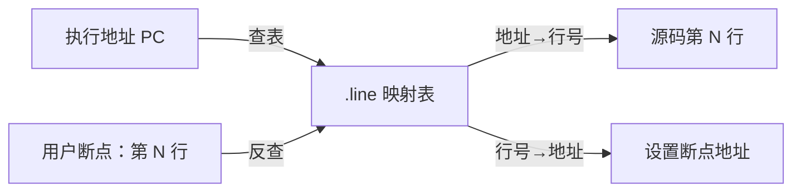
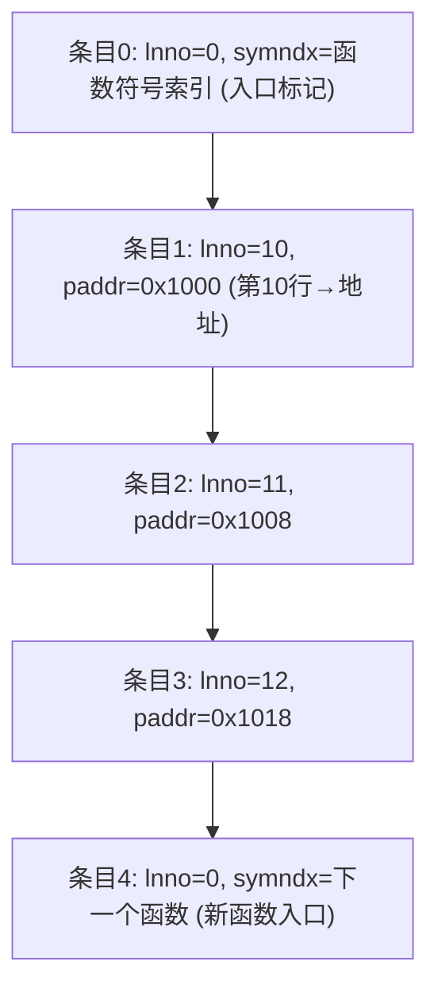

# 详解ELF文件(二十五).line节

.line节是ELF（Executable and Linkable Format）文件格式中用于存储调试信息的节区，它建立了源代码行号与机器指令地址之间的映射关系，为调试器提供了源码级调试的支持。

## 1. 基本概念

.line节（Line Number Section）是ELF文件中用于存储行号调试信息的节区，它描述了源程序代码行号与编译后机器指令之间的对应关系。这是一种较早期的行号格式，起源于 COFF（Common Object File Format）体系，后被沿用至早期 ELF 工具链。现代工具链已基本改用 [[27.debug_line节|.debug_line]]（DWARF），`.line` 仅在处理极旧版工具链产物或特定嵌入式目标时才会遇到。

## 2. 历史背景：COFF 渊源

`.line` 节的设计直接来源于 COFF（Common Object File Format）格式，该格式由 AT&T 贝尔实验室于 1983 年随 UNIX System V 一起发布，后被 Microsoft（PE 格式前身）、SCO、HP-UX 等广泛采用。

COFF 中的行号信息以**固定宽度**的"line number entry"数组存储，每条记录为 6 字节：

```text
COFF 行号条目（6 字节）：
  offset 0 (4字节): 符号索引（行号=0 时表示函数入口）或物理地址（行号>0）
  offset 4 (2字节): 源代码行号（1-based）
```

当 AT&T 定义早期 ELF 格式时，直接沿用了此结构作为 `.line` 节，因此 `.line` 本质上是 COFF 行号表在 ELF 中的直接移植。

DWARF 标准（DWARF 1，1992年）将行号信息纳入统一的 `.debug` 前缀命名体系后，`.debug_line` 成为行号信息的标准载体，`.line` 逐渐被弃用。

## 3. 作用和功能

.line节的主要作用包括：

1. **源码映射**：建立源代码行号与机器指令地址的映射关系，支持源码级单步执行
2. **调试支持**：为调试器提供断点设置的依据（将用户指定的行号转换为机器指令地址）
3. **崩溃定位**：结合符号表，在程序崩溃时提供粗粒度的源码位置信息

## 4. 与.debug_line的区别

.line节和 [[27.debug_line节|.debug_line]] 节都存储行号信息，但有以下本质区别：

| 特性 | .line | [[27.debug_line节\|.debug_line]] |
|------|-------|-----------------------------------|
| 格式标准 | COFF 遗留格式 | DWARF 2/3/4/5 标准 |
| 编码方式 | 固定宽度数组（每条6字节） | 字节码驱动的状态机程序 |
| 信息粒度 | 仅地址 ↔ 行号 | 地址 + 文件 + 行号 + 列号 + 基本块/epilogue 等标记 |
| 多文件支持 | 有限（特殊标记文件切换） | 完整文件表，支持任意 #include 跳转 |
| 压缩效率 | 无压缩，每条 6 字节 | 状态机差分编码，典型 1-3 字节/条 |
| 列号支持 | 无 | 有（DW_AT_column） |
| 内联信息 | 无 | 有（`is_stmt`、`discriminator` 等标记） |
| 逆向映射 | 需全表扫描 | 可按地址范围快速二分查找 |
| 现代使用 | 基本弃用 | 现代编译器唯一使用 |

## 5. 数据结构

### 5.1 基本条目格式

`.line` 节的条目格式直接沿用 COFF，结构非常简单：

```c
/* COFF 风格行号条目（6 字节，大多数平台小端序）*/
typedef struct {
    union {
        uint32_t l_symndx;   /* 行号=0 时：符号表索引（函数入口标记）*/
        uint32_t l_paddr;    /* 行号>0 时：该行第一条指令的物理地址 */
    } l_addr;
    uint16_t l_lnno;         /* 源代码行号（0=函数入口，其余为实际行号）*/
} LINENO;
```

### 5.2 函数入口标记约定

由于格式来自 COFF，`.line` 使用一种特殊约定来区分函数入口和普通行号条目：

- **`l_lnno == 0`**：此条目是函数入口标记，`l_addr.l_symndx` 是符号表中对应函数符号的索引
- **`l_lnno > 0`**：此条目是普通行号条目，`l_addr.l_paddr` 是该行代码的起始机器指令地址

### 5.3 增量形式（某些实现）

部分工具链（尤其是嵌入式 RTOS 相关）对 `.line` 采用增量压缩变体：

```c
/* 增量编码变体（非标准，各厂商不同）*/
typedef struct {
    uint32_t l_addr_delta;   /* 相对前条的地址增量 */
    int16_t  l_line_delta;   /* 相对前条的行号增量（可负） */
} LineEntryDelta;
```

## 6. 存储格式

.line节通常采用以下存储约定：

1. **节首条目**：`l_lnno=0` 的函数入口条目，标识后续条目所属函数
2. **地址递增**：后续条目按地址升序排列，`l_paddr` 为该行起始指令的绝对地址
3. **文件切换**：某些扩展实现在行号字段使用特殊值（如 `0xFFFF`）后跟一个文件名索引条目

## 7. 结构图示

`.line` 本质是一张"地址 ⇄ 行号"映射表，供调试器双向查找：



与 `.debug_line` 状态机相比，`.line` 是静态线性查找：



## 8. 与其它节的关系

1. **[[05.text节|.text]] 节**：`.line` 中的 `l_paddr` 对应 `.text` 中的机器指令地址
2. **[[09.symtab节|.symtab]] 节**：入口标记条目（`l_lnno=0`）通过 `l_symndx` 引用符号表中的函数符号
3. **[[24.debug节|.debug]] 节族**：作为早期行号格式，与 DWARF 体系共存或已被取代
4. **[[27.debug_line节|.debug_line]]**：`.line` 的现代替代品，信息更丰富，编码更紧凑

## 9. 工作原理

1. **编译时**：编译器跟踪源代码行号与生成指令的关系，按 COFF 规范写入 `.line` 节（固定宽度数组）
2. **链接时**：链接器更新 `l_paddr` 为最终链接地址，合并多个目标文件的 `.line` 节（按函数边界拼接）
3. **调试时**：
   - **地址→行号**：调试器线性扫描 `.line`，找到最大 `l_paddr ≤ PC` 的条目，返回对应 `l_lnno`
   - **行号→地址**：调试器扫描找到指定行号的条目，取其 `l_paddr` 作为断点地址

## 10. 现代工具链中的处理

大多数现代工具（`readelf`、`llvm-dwarfdump`）不直接支持旧式 `.line` 节的格式化输出，因为它并非 DWARF 标准的一部分。处理方法：

```bash
readelf -S program | grep '\bline\b'     # 检查是否存在 .line 节
readelf -x .line program                  # 以十六进制转储原始字节
```

若需编程处理 `.line` 节，可用 `libelf` 读取原始节数据，再手动按 6 字节结构解析。

## 11. 实战：查看 .line

```bash
readelf -S program | grep line       # 定位 .line 节
readelf -x .line program             # 十六进制查看
```

```text
# 示例输出（代表性，非本机实跑）
$ readelf -x .line program
Hex dump of section '.line':
  0x00000000 01000000 01000000 05000000 02000000 ................
  0x00000010 0a000000 03000000 12000000 04000000 ................
```

解读：每 6 字节一条：
- `01000000 0100`：地址 0x01，行号 1
- `05000000 0200`：地址 0x05，行号 2
- `0a000000 0300`：地址 0x0a，行号 3

## 12. 优化和剥离

```bash
strip program                  # 移除调试信息（含 .line）
strip --strip-debug program    # 只移除调试信息，保留符号表
```

## 13. 与 DWARF .debug_line 的迁移路径

如果您正在维护一个仍使用 `.line` 格式的老旧项目，迁移到 DWARF 调试信息的路径是：

1. **升级工具链**：使用 GCC 3.x+ 或 Clang，默认产生 DWARF `.debug_line`
2. **编译选项**：`-gdwarf-2` / `-gdwarf-4` / `-gdwarf-5` 明确指定 DWARF 版本
3. **验证**：`readelf -S a.out | grep debug_line` 确认 `.debug_line` 节存在

对于遗留目标（如某些 VxWorks/RTOS 工具链），可能仍需处理 `.line` 格式，理解其结构有助于编写自定义调试信息提取工具。

.line节作为ELF文件调试支持的早期组成部分，为开发者提供了源代码级调试的基础能力。虽然现代编译器更多使用 [[27.debug_line节|.debug_line]] 节存储行号信息，但理解 `.line` 节的 COFF 渊源和固定宽度结构，对于深入掌握 ELF 文件调试机制演进历史仍然具有重要意义。

## 相关阅读

- **现代替代品**：[[27.debug_line节]]
- **调试信息总览**：[[24.debug节]]
- **映射对象**：[[05.text节]]
- 上一篇：[[24.debug节]] ｜ 下一篇：[[26.debug_info节]]
