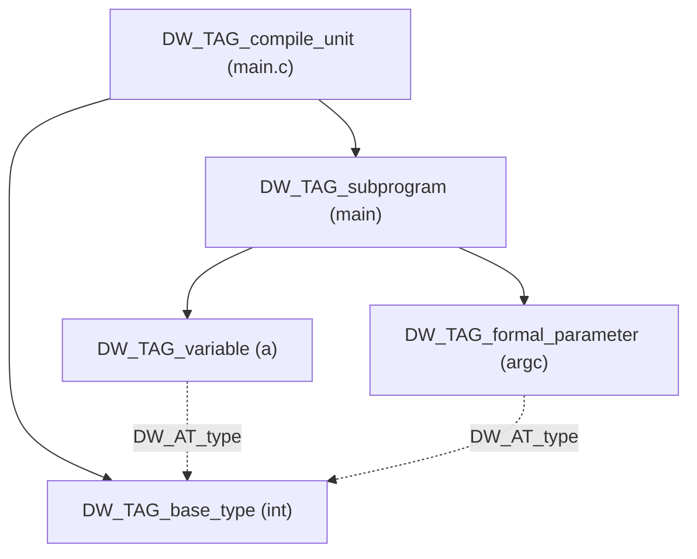
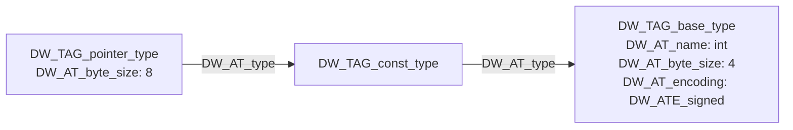
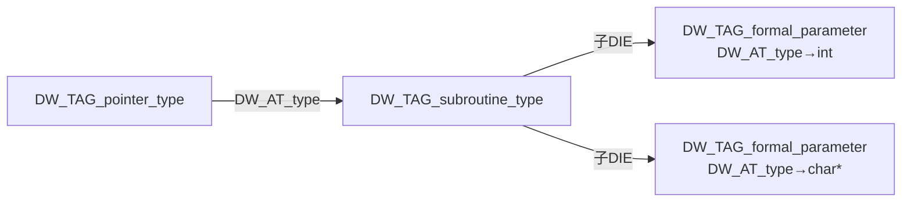

# 详解ELF文件(二十六).debug_info节

.debug_info节是ELF（Executable and Linkable Format）文件中存储DWARF调试信息的核心节区，它包含了程序的调试信息条目（DIEs），为调试器提供了源代码与机器代码之间的映射关系。

## 1. 基本概念

`.debug_info` 节（Debug Information Section）是ELF文件中存储DWARF（Debugging With Attributed Record Formats）调试信息的主要节区。它以**编译单元（Compilation Unit，CU）**为基本组织单位，每个编译单元包含一个完整的调试信息树。

整个 `.debug_info` 节由若干个 CU 首尾相接顺序排列；每个 CU 内部是一棵 **DIE（Debugging Information Entry）** 树。调试器从节首开始，反复"跳过 `unit_length` 字节"来遍历所有 CU。

## 2. 编译单元头部（CU Header）

### 2.1 DWARF 4 头部（最常见）

```text
字段名              字节数   说明
─────────────────────────────────────────────────────────────────
unit_length         4       本 CU 总字节数（不含自身 4 字节）
                            若前 4 字节 = 0xffffffff，则为 64-bit DWARF，
                            后跟 8 字节真实长度
version             2       DWARF 版本（值为 4）
debug_abbrev_offset 4/8     .debug_abbrev 节内偏移（32-bit/64-bit DWARF）
address_size        1       目标机地址字节数（通常 4 或 8）
```

### 2.2 DWARF 5 头部（字段顺序变化）

DWARF 5 将 `unit_type` 和 `address_size` 提前至 `debug_abbrev_offset` 之前，且新增了 `unit_type` 字段，使消费者可在读取缩写表之前就知道 CU 类型：

```text
字段名              字节数   说明
─────────────────────────────────────────────────────────────────
unit_length         4/12    同 DWARF 4（支持 64-bit 扩展格式）
version             2       DWARF 版本（值为 5）
unit_type           1       编译单元类型（DW_UT_*，DWARF 5 新增）
address_size        1       目标机地址字节数
debug_abbrev_offset 4/8     .debug_abbrev 节内偏移
[dwo_id]            8       仅当 unit_type = DW_UT_skeleton / DW_UT_split_compile
[type_signature]    8       仅当 unit_type = DW_UT_type / DW_UT_split_type
[type_offset]       4/8     仅当 unit_type = DW_UT_type / DW_UT_split_type
```

### 2.3 unit_type 枚举值（DWARF 5）

| 值 | 常量名 | 含义 |
|----|--------|------|
| 0x01 | `DW_UT_compile` | 普通编译单元（最常见） |
| 0x02 | `DW_UT_type` | 类型单元（可跨 CU 共享类型） |
| 0x03 | `DW_UT_partial` | 局部单元（被其他 CU 引用） |
| 0x04 | `DW_UT_skeleton` | 骨架单元（Split DWARF，留在 .o 中） |
| 0x05 | `DW_UT_split_compile` | 分裂编译单元（在 .dwo 文件中） |
| 0x06 | `DW_UT_split_type` | 分裂类型单元（在 .dwo 文件中） |

### 2.4 头部读取示例

```c
/* 伪代码：读取 DWARF4 CU 头 */
uint32_t unit_length  = read_u32(buf);  /* 偏移 0 */
uint16_t version      = read_u16(buf + 4);  /* 偏移 4 */
uint32_t abbrev_off   = read_u32(buf + 6);  /* 偏移 6 */
uint8_t  addr_size    = buf[10];            /* 偏移 10 */
/* DIE 序列从偏移 11 开始 */
```

## 3. 调试信息条目（DIE）

### 3.1 DIE 的字节流编码

DIE 在 `.debug_info` 字节流中的编码极为紧凑：

```text
[ULEB128 缩写码]  ← 值为 0 时表示子序列结束符（不是真正的 DIE）
[属性值 1]        ← 类型/大小由 .debug_abbrev 中对应模板的 DW_FORM 决定
[属性值 2]
...
[属性值 N]
```

若该 DIE 的缩写声明指示 `has_children = DW_CHILDREN_yes`，则紧随其后是子 DIE 序列，最后以一个 `abbrev_code=0` 的终止符结束子序列。

### 3.2 DIE 树的遍历



DIE 树在字节流中按**深度优先前序遍历**展开，子序列以 `0x00` 结束：

```text
字节流结构示例：
  [abbrev=1 DW_TAG_compile_unit has_children=yes]
    [attr values...]
    [abbrev=2 DW_TAG_subprogram has_children=yes]
      [attr values...]
      [abbrev=3 DW_TAG_formal_parameter has_children=no]
        [attr values...]
      [0x00]  ← DW_TAG_subprogram 子序列结束
    [0x00]  ← DW_TAG_compile_unit 子序列结束
```

## 4. 完整 DW_TAG 分类表

### 4.1 编译与链接单元

| DW_TAG | 值 | 说明 | 引入版本 |
|--------|-----|------|----------|
| `DW_TAG_compile_unit` | 0x11 | 编译单元（一个翻译单元）| DWARF 2 |
| `DW_TAG_partial_unit` | 0x3c | 局部单元（被引用的公共代码）| DWARF 3 |
| `DW_TAG_type_unit` | 0x41 | 类型单元（跨 CU 共享类型）| DWARF 4 |
| `DW_TAG_skeleton_unit` | 0x4a | 骨架单元（Split DWARF）| DWARF 5 |
| `DW_TAG_imported_unit` | 0x3d | 引用另一 partial_unit | DWARF 3 |

### 4.2 程序结构

| DW_TAG | 说明 |
|--------|------|
| `DW_TAG_subprogram` | 函数/方法（`DW_AT_low_pc`+`DW_AT_high_pc` 描述地址范围）|
| `DW_TAG_lexical_block` | 词法块（花括号范围，定义局部变量的作用域）|
| `DW_TAG_inlined_subroutine` | 内联函数的一个实例（`DW_AT_abstract_origin` 引用原始定义）|
| `DW_TAG_entry_point` | 函数的备用入口点 |
| `DW_TAG_label` | goto 标签 |
| `DW_TAG_with_stmt` | Pascal with 语句块 |
| `DW_TAG_try_block` | C++ try 块 |
| `DW_TAG_catch_block` | C++ catch 块 |
| `DW_TAG_call_site` | 调用点（DWARF 5，用于参数值追踪）|
| `DW_TAG_call_site_parameter` | 调用点处的参数（DWARF 5）|

### 4.3 数据对象

| DW_TAG | 说明 |
|--------|------|
| `DW_TAG_variable` | 变量（全局/局部/静态）|
| `DW_TAG_formal_parameter` | 函数形式参数 |
| `DW_TAG_unspecified_parameters` | 可变参数（C 的 `...`）|
| `DW_TAG_constant` | 具名常量 |
| `DW_TAG_enumerator` | 枚举值 |
| `DW_TAG_member` | 结构体/类的成员字段 |
| `DW_TAG_common_block` | Fortran COMMON 块 |
| `DW_TAG_namelist` | Fortran NAMELIST |
| `DW_TAG_namelist_item` | Fortran NAMELIST 成员 |

### 4.4 类型

| DW_TAG | 说明 |
|--------|------|
| `DW_TAG_base_type` | 基本类型（int/float/bool 等，`DW_AT_encoding` 描述 ATE_signed 等）|
| `DW_TAG_typedef` | 类型别名（`DW_AT_type` 指向原始类型）|
| `DW_TAG_pointer_type` | 指针类型 |
| `DW_TAG_reference_type` | C++ 左值引用 |
| `DW_TAG_rvalue_reference_type` | C++ 右值引用（DWARF 4）|
| `DW_TAG_const_type` | const 限定类型 |
| `DW_TAG_volatile_type` | volatile 限定类型 |
| `DW_TAG_restrict_type` | restrict 限定类型（C99）|
| `DW_TAG_atomic_type` | _Atomic 限定类型（DWARF 5）|
| `DW_TAG_array_type` | 数组类型（子 DIE 为 `DW_TAG_subrange_type` 描述维度）|
| `DW_TAG_subrange_type` | 数组下标范围 |
| `DW_TAG_string_type` | Fortran 字符串类型 |
| `DW_TAG_structure_type` | 结构体 |
| `DW_TAG_class_type` | C++ 类 |
| `DW_TAG_union_type` | 联合体 |
| `DW_TAG_enumeration_type` | 枚举类型 |
| `DW_TAG_interface_type` | Java 接口类型 |
| `DW_TAG_subroutine_type` | 函数/方法类型（函数指针的目标类型）|
| `DW_TAG_ptr_to_member_type` | C++ 成员指针类型 |
| `DW_TAG_set_type` | Pascal 集合类型 |
| `DW_TAG_file_type` | Fortran 文件类型 |
| `DW_TAG_thrown_type` | 可抛出类型（C++）|
| `DW_TAG_template_type_parameter` | C++ 模板类型参数 |
| `DW_TAG_template_value_parameter` | C++ 模板值参数 |
| `DW_TAG_generic_subrange` | Ada 泛型下标范围 |
| `DW_TAG_dynamic_type` | 动态类型（DWARF 5）|
| `DW_TAG_immutable_type` | 不可变类型（DWARF 5）|

### 4.5 C++ 专用

| DW_TAG | 说明 |
|--------|------|
| `DW_TAG_namespace` | C++ 名字空间 |
| `DW_TAG_inheritance` | 继承关系（`DW_AT_type` 指向基类，`DW_AT_data_member_location` 描述偏移）|
| `DW_TAG_friend` | friend 声明 |
| `DW_TAG_access_declaration` | using 声明（访问基类成员）|
| `DW_TAG_imported_declaration` | using 导入声明 |
| `DW_TAG_imported_module` | using namespace 指令 |

## 5. 常用 DW_AT 属性表

### 5.1 通用属性

| DW_AT | 常用 DW_FORM | 说明 |
|-------|-------------|------|
| `DW_AT_name` | `DW_FORM_strp` / `DW_FORM_string` | 符号名称（函数名、变量名、类型名）|
| `DW_AT_language` | `DW_FORM_data2` | 源语言（`DW_LANG_C99`=0x000c 等）|
| `DW_AT_producer` | `DW_FORM_strp` | 编译器标识字符串 |
| `DW_AT_comp_dir` | `DW_FORM_strp` | 编译时工作目录 |
| `DW_AT_external` | `DW_FORM_flag_present` | 是否为外部可见符号 |
| `DW_AT_declaration` | `DW_FORM_flag_present` | 仅是声明（无定义体）|
| `DW_AT_sibling` | `DW_FORM_ref4` | 下一个兄弟 DIE 的偏移（加速跳过子树）|

### 5.2 地址与范围属性

| DW_AT | 说明 |
|-------|------|
| `DW_AT_low_pc` | 代码段起始地址 |
| `DW_AT_high_pc` | 代码段结束地址（DWARF 4+：可以是相对 `low_pc` 的字节数 `DW_FORM_data*`）|
| `DW_AT_ranges` | 指向 `.debug_ranges`/`.debug_rnglists`，描述非连续地址范围 |
| `DW_AT_entry_pc` | 函数实际入口（可与 `low_pc` 不同，如函数序言后）|

### 5.3 源码位置属性

| DW_AT | 说明 |
|-------|------|
| `DW_AT_decl_file` | 声明所在文件索引（对应 `.debug_line` 文件表）|
| `DW_AT_decl_line` | 声明所在行号 |
| `DW_AT_decl_column` | 声明所在列号 |
| `DW_AT_call_file` | 调用处文件（用于内联）|
| `DW_AT_call_line` | 调用处行号 |
| `DW_AT_stmt_list` | 指向 `.debug_line` 中该 CU 行号程序的偏移 |

### 5.4 类型属性

| DW_AT | 说明 |
|-------|------|
| `DW_AT_type` | 指向类型 DIE 的偏移引用（`DW_FORM_ref4`/`ref_addr`）|
| `DW_AT_byte_size` | 类型大小（字节）|
| `DW_AT_bit_size` | 位域大小（位）|
| `DW_AT_bit_offset` | 位域偏移（DWARF 4 含义变化）|
| `DW_AT_data_bit_offset` | 位域数据偏移（DWARF 4+）|
| `DW_AT_encoding` | 基本类型编码（`DW_ATE_signed`=5, `DW_ATE_float`=4 等）|
| `DW_AT_byte_stride` | 数组元素步长（字节）|
| `DW_AT_endianity` | 字节序（`DW_END_big`/`DW_END_little`）|

### 5.5 变量/参数位置属性

| DW_AT | 常用 DW_FORM | 说明 |
|-------|-------------|------|
| `DW_AT_location` | `DW_FORM_exprloc` / `DW_FORM_sec_offset` | 变量位置（DWARF 表达式或位置列表偏移）|
| `DW_AT_data_member_location` | `DW_FORM_data1` / `DW_FORM_exprloc` | 结构体成员的字节偏移 |
| `DW_AT_frame_base` | `DW_FORM_exprloc` | 帧基址（通常为 `DW_OP_call_frame_cfa`）|
| `DW_AT_const_value` | `DW_FORM_data*` / `DW_FORM_sdata` | 常量值（枚举值、编译期常量）|
| `DW_AT_vtable_elem_location` | `DW_FORM_exprloc` | vtable 中的位置 |

### 5.6 C++ 专用属性

| DW_AT | 说明 |
|-------|------|
| `DW_AT_accessibility` | 访问权限（1=`DW_ACCESS_public`, 2=private, 3=protected）|
| `DW_AT_virtuality` | 虚函数性（`DW_VIRTUALITY_none`/`virtual`/`pure_virtual`）|
| `DW_AT_abstract_origin` | 指向抽象实例（内联函数实例引用原始 DW_TAG_subprogram）|
| `DW_AT_specification` | 指向函数/变量的声明 DIE（分离声明和定义时使用）|
| `DW_AT_inline` | 内联状态（`DW_INL_not_inlined`/`inlined`/`declared_inlined` 等）|
| `DW_AT_calling_convention` | 调用约定（`DW_CC_normal`/`DW_CC_pass_by_reference` 等）|
| `DW_AT_object_pointer` | 指向 this 参数（C++ 成员函数）|

### 5.7 DWARF 5 新增属性

| DW_AT | 说明 |
|-------|------|
| `DW_AT_str_offsets_base` | 指向 `.debug_str_offsets` 中该 CU 的字符串偏移表起始 |
| `DW_AT_addr_base` | 指向 `.debug_addr` 中该 CU 的地址表起始 |
| `DW_AT_rnglists_base` | 指向 `.debug_rnglists` 中该 CU 的范围列表起始 |
| `DW_AT_loclists_base` | 指向 `.debug_loclists` 中该 CU 的位置列表起始 |
| `DW_AT_dwo_name` | 对应 .dwo 文件的路径（Split DWARF 骨架 CU）|
| `DW_AT_main_subprogram` | 标记程序入口（`main` 函数）|

## 6. DW_FORM 编码形式完整表

`DW_FORM` 决定属性值在字节流中的编码宽度和解释方式：

### 6.1 地址形式

| DW_FORM | 字节数 | 说明 |
|---------|--------|------|
| `DW_FORM_addr` | `address_size` | 目标机绝对地址 |
| `DW_FORM_addrx` | ULEB128 | 索引到 `.debug_addr`（DWARF 5）|
| `DW_FORM_addrx1/2/3/4` | 1/2/3/4 | 固定宽度 `.debug_addr` 索引（DWARF 5）|

### 6.2 常量形式

| DW_FORM | 字节数 | 说明 |
|---------|--------|------|
| `DW_FORM_data1` | 1 | 无符号 1 字节常量 |
| `DW_FORM_data2` | 2 | 无符号 2 字节常量 |
| `DW_FORM_data4` | 4 | 无符号 4 字节常量 |
| `DW_FORM_data8` | 8 | 无符号 8 字节常量 |
| `DW_FORM_data16` | 16 | 无符号 16 字节常量（DWARF 5）|
| `DW_FORM_sdata` | SLEB128 | 有符号 LEB128 常量 |
| `DW_FORM_udata` | ULEB128 | 无符号 LEB128 常量 |
| `DW_FORM_implicit_const` | 0（值在缩写表中）| 常量编码进 .debug_abbrev（DWARF 5）|

### 6.3 字符串形式

| DW_FORM | 字节数 | 说明 |
|---------|--------|------|
| `DW_FORM_string` | N+1 | 内联 null 终止字符串 |
| `DW_FORM_strp` | 4/8 | .debug_str 节内偏移 |
| `DW_FORM_line_strp` | 4/8 | .debug_line_str 节内偏移（DWARF 5）|
| `DW_FORM_strp_sup` | 4/8 | 补充对象文件 .debug_str 偏移（DWARF 5）|
| `DW_FORM_strx` | ULEB128 | .debug_str_offsets 索引（DWARF 5）|
| `DW_FORM_strx1/2/3/4` | 1/2/3/4 | 固定宽度 .debug_str_offsets 索引（DWARF 5）|

### 6.4 引用形式

| DW_FORM | 字节数 | 说明 |
|---------|--------|------|
| `DW_FORM_ref1` | 1 | CU 内偏移（1 字节）|
| `DW_FORM_ref2` | 2 | CU 内偏移（2 字节）|
| `DW_FORM_ref4` | 4 | CU 内偏移（4 字节，最常用）|
| `DW_FORM_ref8` | 8 | CU 内偏移（8 字节）|
| `DW_FORM_ref_udata` | ULEB128 | CU 内偏移（变长）|
| `DW_FORM_ref_addr` | 4/8 | 节内绝对偏移（跨 CU 引用）|
| `DW_FORM_ref_sig8` | 8 | 8 字节类型签名（引用 .debug_types）|
| `DW_FORM_ref_sup4` | 4 | 补充文件内偏移（DWARF 5）|
| `DW_FORM_ref_sup8` | 8 | 补充文件内偏移（DWARF 5）|

### 6.5 节偏移与块形式

| DW_FORM | 字节数 | 说明 |
|---------|--------|------|
| `DW_FORM_sec_offset` | 4/8 | 某调试节内偏移（如 .debug_loc/.debug_line）|
| `DW_FORM_block1` | 1+N | 1 字节长度前缀 + N 字节数据块 |
| `DW_FORM_block2` | 2+N | 2 字节长度前缀 + N 字节数据块 |
| `DW_FORM_block4` | 4+N | 4 字节长度前缀 + N 字节数据块 |
| `DW_FORM_block` | ULEB128+N | ULEB128 长度前缀 + N 字节数据块 |
| `DW_FORM_exprloc` | ULEB128+N | DWARF 表达式（DWARF 4，语义与 block 类似但含义明确）|

### 6.6 标志形式

| DW_FORM | 字节数 | 说明 |
|---------|--------|------|
| `DW_FORM_flag` | 1 | 1 字节布尔值（0=false, 非0=true）|
| `DW_FORM_flag_present` | 0 | 零字节，属性存在即为 true（DWARF 4）|

### 6.7 特殊形式

| DW_FORM | 说明 |
|---------|------|
| `DW_FORM_indirect` | 下一个 ULEB128 是实际的 form 类型（动态确定形式）|
| `DW_FORM_loclistx` | .debug_loclists 索引（DWARF 5）|
| `DW_FORM_rnglistx` | .debug_rnglists 索引（DWARF 5）|

## 7. DWARF 表达式详解

`DW_AT_location`、`DW_AT_frame_base` 等属性值可以是一段 **DWARF 表达式**，用字节码描述变量在某一时刻的运行时位置。DWARF 表达式使用**操作数栈**执行模型：

### 7.1 常用操作码分类

```text
栈操作：
  DW_OP_lit0..DW_OP_lit31     将字面量 0-31 压栈
  DW_OP_addr    addr           将机器地址压栈（适合全局变量）
  DW_OP_const1u/s u8/s8       1 字节无符号/有符号常量压栈
  DW_OP_const2u/s u16/s16     2 字节常量压栈
  DW_OP_const4u/s u32/s32     4 字节常量压栈
  DW_OP_constu  ULEB128        无符号 LEB128 常量
  DW_OP_consts  SLEB128        有符号 LEB128 常量
  DW_OP_dup                   复制栈顶
  DW_OP_drop                  弹出并丢弃栈顶
  DW_OP_swap                  交换栈顶两个值

寄存器：
  DW_OP_reg0..DW_OP_reg31     压入通用寄存器值（对应 DWARF 寄存器编号）
  DW_OP_regx  ULEB128         压入任意寄存器值
  DW_OP_breg0..DW_OP_breg31  寄存器 + SLEB128 偏移
  DW_OP_bregx ULEB128 SLEB128 任意寄存器 + 偏移

帧基：
  DW_OP_fbreg SLEB128         帧基址 + 偏移（最常见的局部变量定位方式）
  DW_OP_call_frame_cfa        CFA（canonical frame address，用于 frame_base）

内存访问：
  DW_OP_deref                 解引用栈顶（按 address_size 字节读）
  DW_OP_deref_size u8         解引用，读指定字节数并零扩展

算术：
  DW_OP_plus                  弹出两个值，压入它们的和
  DW_OP_plus_uconst ULEB128   栈顶加无符号常量
  DW_OP_minus / DW_OP_mul / DW_OP_div 等

特殊值语义：
  DW_OP_stack_value           标记栈顶就是值本身（非地址），用于优化后的寄存器变量
  DW_OP_implicit_value N data 值嵌入表达式中（大常量或特殊值）
  DW_OP_entry_value expr      函数入口时刻的值（DWARF 5，辅助逆向传播参数值）

复合位置（拆分变量）：
  DW_OP_piece ULEB128         描述前 N 字节属于某位置
  DW_OP_bit_piece ULEB128 ULEB128 描述前 N 位，偏移 M 位
```

### 7.2 典型局部变量位置示例

```text
# 局部变量在栈上（rbp-8）：
DW_AT_location: DW_OP_fbreg -8
  → 计算：frame_base + (-8) = 变量地址

# 局部变量被优化进寄存器（rax）：
DW_AT_location: DW_OP_reg0 DW_OP_stack_value
  → 变量值即 rax 的当前内容，无内存地址

# 全局变量：
DW_AT_location: DW_OP_addr 0x601020
  → 变量地址即 0x601020
```

## 8. 类型 DIE 链

类型系统在 DWARF 中通过 `DW_AT_type` 形成一条引用链。例如，`const int *` 类型的 DIE 链：



更复杂的 `void (*)(int, char*)` 函数指针类型链：



## 9. 与其它调试节的关系

1. **[[28.debug_abbrev节|.debug_abbrev]]**：存储 DIE 缩写模板，CU 头部的 `debug_abbrev_offset` 指向对应缩写集
2. **[[29.debug_str节|.debug_str]]**：存储 DIE 属性引用的字符串，`DW_FORM_strp` 属性值是此节的偏移
3. **[[27.debug_line节|.debug_line]]**：行号信息，经 `DW_AT_stmt_list` 关联
4. **[[33.debug_loc节|.debug_loc]]**：变量位置列表，`DW_AT_location` 使用 `DW_FORM_sec_offset` 时指向此节
5. **`.debug_ranges`/`.debug_rnglists`**：`DW_AT_ranges` 指向的地址范围数据

## 10. 实战：查看 .debug_info

```bash
readelf --debug-dump=info program      # 解析 DIE 树
objdump --dwarf=info program           # 等效命令

llvm-dwarfdump --debug-info program    # LLVM 版本，输出更清晰
llvm-dwarfdump --verify program        # 验证 DWARF 结构一致性
```

```text
# 示例输出（代表性，非本机实跑）
$ readelf --debug-dump=info program
  Compilation Unit @ offset 0x0:
   Version: 4   Abbrev Offset: 0x0   Pointer Size: 8
 <0><b>: Abbrev Number: 1 (DW_TAG_compile_unit)
    DW_AT_producer : GNU C11 9.3.0 ... -g
    DW_AT_language : (DW_LANG_C99)
    DW_AT_name     : main.c
    DW_AT_comp_dir : /home/user/project
    DW_AT_low_pc   : 0x1129
    DW_AT_high_pc  : 0x1145
    DW_AT_stmt_list: 0x0
 <1><31>: Abbrev Number: 2 (DW_TAG_subprogram)
    DW_AT_external : 1
    DW_AT_name     : main
    DW_AT_decl_file: 1
    DW_AT_decl_line: 1
    DW_AT_type     : <0x7a>
    DW_AT_low_pc   : 0x1129
    DW_AT_high_pc  : 0x1145
    DW_AT_frame_base: 1 byte block: 9c      (DW_OP_call_frame_cfa)
 <2><55>: Abbrev Number: 3 (DW_TAG_variable)
    DW_AT_name     : a
    DW_AT_type     : <0x7a>
    DW_AT_location : 2 byte block: 91 78   (DW_OP_fbreg: -8)
 <1><7a>: Abbrev Number: 4 (DW_TAG_base_type)
    DW_AT_byte_size: 8
    DW_AT_encoding : 5 (signed)
    DW_AT_name     : long int
```

`<层深><CU内偏移>` 是调试器用于交叉引用（如 `DW_AT_type: <0x7a>`）的关键。

## 11. 优化和剥离

通过 `-g1/-g2/-g3` 控制调试信息详细程度；`strip` / `strip --strip-debug` 可移除。

.debug_info节作为DWARF调试信息的核心组成部分，为调试器提供了丰富的源代码级调试支持。通过编译单元和调试信息条目的树形结构组织，它建立了源代码与机器代码之间的完整映射关系，是现代软件开发中不可或缺的调试基础设施。

## 相关阅读

- **缩写模板**：[[28.debug_abbrev节]]
- **字符串/行号/位置**：[[29.debug_str节]]、[[27.debug_line节]]、[[33.debug_loc节]]
- **调试总览**：[[24.debug节]]
- 上一篇：[[25.line节]] ｜ 下一篇：[[27.debug_line节]]
