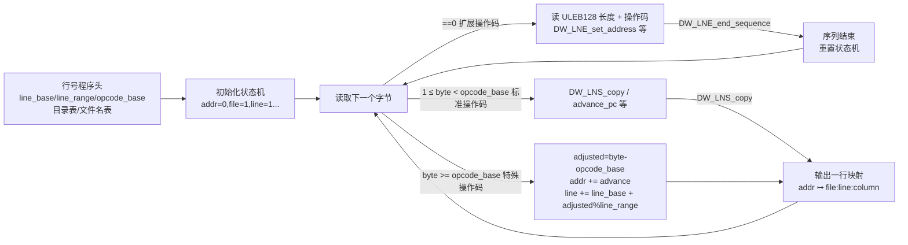

# 详解ELF文件(二十七).debug_line节

`.debug_line` 节是DWARF调试信息格式中专门用于存储源代码行号与机器指令地址之间映射关系的部分。这个节对于调试器在调试时将机器指令映射回源代码行至关重要。

## 1. 基本功能

`.debug_line` 节的主要目的是建立从机器码地址到源代码文件和行号的映射。当程序发生崩溃或调试器需要显示当前执行点的源代码时，都会使用这部分信息。它是 [[25.line节|.line]] 节的现代 DWARF 替代品，信息更丰富（含列号、文件、基本块、prologue/epilogue 标记等），通过**字节码驱动的状态机**而非静态表格实现高效压缩。

## 2. 整体结构

`.debug_line` 节由多个**行号程序（Line Number Program）**首尾相接顺序排列，每个程序对应一个编译单元（CU）。`.debug_info` 中每个 `DW_TAG_compile_unit` DIE 通过 `DW_AT_stmt_list` 属性引用本 CU 的行号程序在 `.debug_line` 节中的起始偏移。

每个行号程序由两部分组成：
1. **程序头（Line Number Program Header）**：描述状态机参数、文件/目录表
2. **操作码序列（Opcode Stream）**：驱动状态机、产生行号映射行

## 3. 行号程序头（Line Number Program Header）

### 3.1 DWARF 4 头部字段

```text
字段名                   字节数    说明
────────────────────────────────────────────────────────────────
unit_length              4/12     本程序总字节数（同 CU 头，支持 64-bit 扩展）
version                  2        DWARF 版本（值为 4）
header_length            4/8      头部剩余字节数（指向操作码序列起始）
minimum_instruction_length 1      最小指令长度（字节）
maximum_ops_per_instruction 1     每条指令最大操作数（VLIW 使用，通常为 1）
default_is_stmt          1        初始 is_stmt 寄存器值（通常为 1）
line_base                1(signed) 特殊操作码能表示的最小行号增量
line_range               1        特殊操作码表示的行号增量个数
opcode_base              1        第一个特殊操作码编号（标准操作码数量+1）
standard_opcode_lengths  N×1      每个标准操作码的操作数个数（N = opcode_base-1）
include_directories      N×str    目录表（null 终止字符串列表，以空串结束）
file_names               N×entry  文件名表（含目录索引、mtime、size）
```

### 3.2 DWARF 5 头部变化

DWARF 5 对行号程序头做了重要改变：

```text
新增字段 address_size（1字节）和 segment_selector_size（1字节），位于 version 之后
目录表格式改为"基于格式描述的表"（format+content 机制），而非固定 null 分隔字符串
文件名表格式同样改为基于内容格式描述的表
directory_entry_format_count + 多个 (DW_LNCT_*, DW_FORM_*) 对
file_name_entry_format_count  + 多个 (DW_LNCT_*, DW_FORM_*) 对
```

DWARF 5 文件名/目录表支持的内容类型（`DW_LNCT_*`）：

| 内容类型 | 说明 |
|----------|------|
| `DW_LNCT_path` | 路径字符串 |
| `DW_LNCT_directory_index` | 目录索引 |
| `DW_LNCT_timestamp` | 最后修改时间 |
| `DW_LNCT_size` | 文件大小 |
| `DW_LNCT_MD5` | 文件 MD5 哈希（16 字节，用于验证源文件一致性）|

DWARF 5 起始目录是编译目录（`DW_AT_comp_dir`），文件表第 0 个条目是主文件本身——这与 DWARF 4 中目录表和文件表均从索引 1 开始不同。

### 3.3 关键参数的含义

`line_base`、`line_range`、`opcode_base` 三个参数共同决定特殊操作码的编码范围，是理解行号程序的核心：

```text
典型 GCC 生成的值（DWARF 4）：
  line_base      = -5
  line_range     = 14
  opcode_base    = 13
  （标准操作码 DW_LNS_copy=1 ... DW_LNS_set_isa=12，共 12 个）

特殊操作码可编码的行号增量范围：
  最小：line_base = -5
  最大：line_base + line_range - 1 = -5 + 14 - 1 = 8
  即特殊操作码一次可编码 -5 到 +8 的行号变化
```

## 4. 状态机寄存器

行号状态机在执行操作码前被初始化为以下默认值，每次"提交"一行映射后部分寄存器被重置：

| 寄存器 | 初始值 | 说明 |
|--------|--------|------|
| `address` | 0 | 当前机器指令地址 |
| `op_index` | 0 | VLIW 操作索引（非 VLIW 架构恒为 0）|
| `file` | 1 | 当前源文件索引（文件名表中的序号）|
| `line` | 1 | 当前源代码行号 |
| `column` | 0 | 当前源代码列号（0 = 未知）|
| `is_stmt` | `default_is_stmt` | 当前行是否是推荐断点位置 |
| `basic_block` | false | 是否处于基本块开头 |
| `end_sequence` | false | 是否是序列结束 |
| `prologue_end` | false | 是否是函数序言结束（DWARF 3+）|
| `epilogue_begin` | false | 是否是函数尾声开始（DWARF 3+）|
| `isa` | 0 | 指令集架构标识 |
| `discriminator` | 0 | 区分同一行的不同代码路径（DWARF 3+，用于 PGO）|

## 5. 操作码详解

行号程序有三类操作码，由第一个字节的值区分：

### 5.1 扩展操作码（Extended Opcodes，DW_LNE_*）

扩展操作码以 `0x00` 开始，后跟一个 ULEB128 表示剩余字节数，再跟操作码字节和操作数。

| 操作码 | 值 | 操作数 | 说明 |
|--------|-----|--------|------|
| `DW_LNE_end_sequence` | 1 | 无 | 标记地址序列结束（将当前状态机行追加为最终条目，然后重置）|
| `DW_LNE_set_address` | 2 | address（目标地址大小）| 直接设置 address 寄存器为绝对地址 |
| `DW_LNE_define_file` | 3 | 文件名+目录索引+mtime+size | 在运行时添加文件表条目（DWARF 4 及以前）|
| `DW_LNE_set_discriminator` | 4 | ULEB128 | 设置 discriminator 寄存器（DWARF 3+）|
| `DW_LNE_lo_user` | 0x80 | — | 用户自定义扩展码下界 |
| `DW_LNE_hi_user` | 0xff | — | 用户自定义扩展码上界 |

`DW_LNE_end_sequence` 是每个地址序列的必须终止符；`DW_LNE_set_address` 通常用于序列开头建立绝对地址基准（因为后续地址增量可能很大）。

### 5.2 标准操作码（Standard Opcodes，DW_LNS_*）

标准操作码字节值在 `1` 到 `opcode_base-1` 之间，每个操作码的操作数数量由头部的 `standard_opcode_lengths` 数组指定。

| 操作码 | 值 | 操作数 | 说明 |
|--------|-----|--------|------|
| `DW_LNS_copy` | 1 | 无 | 提交当前状态机行（输出一行映射），重置 basic_block/prologue_end/epilogue_begin/discriminator |
| `DW_LNS_advance_pc` | 2 | ULEB128 op_advance | 推进 address 寄存器（按 op_advance 计算地址增量）|
| `DW_LNS_advance_line` | 3 | SLEB128 | 将 line 寄存器加上有符号增量 |
| `DW_LNS_set_file` | 4 | ULEB128 | 设置 file 寄存器为文件表索引 |
| `DW_LNS_set_column` | 5 | ULEB128 | 设置 column 寄存器 |
| `DW_LNS_negate_stmt` | 6 | 无 | 翻转 is_stmt 寄存器 |
| `DW_LNS_set_basic_block` | 7 | 无 | 将 basic_block 设为 true |
| `DW_LNS_const_add_pc` | 8 | 无 | address 加上特殊操作码 255 对应的地址增量（快速步进到最大地址范围的一半）|
| `DW_LNS_fixed_advance_pc` | 9 | uhalf（2字节）| address 加上固定的 2 字节无符号值（用于可能需要重定位的情况）|
| `DW_LNS_set_prologue_end` | 10 | 无 | 将 prologue_end 设为 true（DWARF 3+，标记序言结束）|
| `DW_LNS_set_epilogue_begin` | 11 | 无 | 将 epilogue_begin 设为 true（DWARF 3+，标记尾声开始）|
| `DW_LNS_set_isa` | 12 | ULEB128 | 设置 isa 寄存器（DWARF 3+）|

`DW_LNS_const_add_pc` 是一个优化操作：当需要大地址步进时，可先用 `DW_LNS_const_add_pc`（1字节）加上特殊操作码（1字节），合计 2 字节；而用 `DW_LNS_advance_pc` + ULEB128 + 特殊操作码至少需要 3 字节。

### 5.3 特殊操作码（Special Opcodes）

特殊操作码字节值在 `opcode_base` 到 `255` 之间，**一条操作码同时完成地址推进、行号推进、提交三个动作**，因此极为紧凑（1 字节完成全部工作）。

#### 解码公式

```text
设：opcode 为当前字节值（>= opcode_base）

adjusted_opcode    = opcode - opcode_base
operation_advance  = adjusted_opcode / line_range
line_advance       = line_base + (adjusted_opcode % line_range)

address 增量 = (operation_advance / max_ops_per_inst) * min_instruction_length
op_index 增量 = operation_advance % max_ops_per_inst

执行：
  address  += 地址增量
  op_index += op_index 增量
  line     += line_advance
  然后提交当前状态机行（等同 DW_LNS_copy）
  重置 basic_block = false, prologue_end = false, epilogue_begin = false, discriminator = 0
```

#### 编码范围与设计权衡

以典型参数（`line_base=-5, line_range=14, opcode_base=13`）为例：

```text
特殊操作码空间：256 - 13 = 243 个字节值

可编码的行号增量：-5 到 +8（共 14 个值）
可编码的操作推进：0 到 243/14 = 17（即最多 17 * min_instruction_length 字节地址步进）

特殊操作码 255（最大值）的操作推进 = (255-13)/14 = 17
→ DW_LNS_const_add_pc 每次添加 17 * min_instruction_length 字节地址步进
```

编码示例（`min_instruction_length=1, line_base=-5, line_range=14, opcode_base=13`）：

| 目标效果 | adjusted_opcode | 实际操作码字节 |
|----------|-----------------|----------------|
| 行+1, 地址+1 | 1*14 + (1-(-5)) = 14+6 = 20 | 20+13 = 33 = 0x21 |
| 行+0, 地址+0, 提交 | 0*14 + (0-(-5)) = 5 | 5+13 = 18 = 0x12 |
| 行-1, 地址+1 | 1*14 + (-1-(-5)) = 14+4 = 18 | 18+13 = 31 = 0x1f |
| 行+1, 地址+5 | 5*14 + 6 = 76 | 76+13 = 89 = 0x59 |

## 6. 状态机工作流程图



## 7. 完整实战示例解析

对于以下简单 C 程序：

```c
int main() {         // 行 1
    long a = 3;      // 行 2
    long b = 2;      // 行 3
    long c = a + b;  // 行 4
    a = 4;           // 行 5
    return 0;        // 行 6
}
```

编译后 `.debug_line` 中的行号程序头可能是：

```text
# 示例输出（代表性，非本机实跑）
$ readelf --debug-dump=rawline a.out

  Offset:                      0x0
  Length:                      71
  DWARF Version:               4
  Prologue Length:             43
  Minimum Inst Length:         1
  Max Ops per Inst:            1
  Initial value of 'is_stmt':  1
  Line Base:                  -5
  Line Range:                 14
  Opcode Base:                13

  Opcodes:
    Opcode 1 has 0 args    (DW_LNS_copy)
    Opcode 2 has 1 arg     (DW_LNS_advance_pc)
    ...
    Opcode 12 has 1 arg    (DW_LNS_set_isa)

  The Directory Table:
   1   /home/user/project

  The File Name Table:
   1  0  0  0  main.c

  Line Number Statements:
    [0x00000032]  Extended opcode 2: set Address to 0x1129  ← DW_LNE_set_address
    [0x0000003d]  Special opcode 6: advance Address by 0 to 0x1129
                  and Line by 1 to 2                        ← 特殊操作码
    [0x0000003e]  Special opcode 22: advance Address by 8 to 0x1131
                  and Line by 1 to 3
    [0x0000003f]  Special opcode 22: advance Address by 8 to 0x1139
                  and Line by 1 to 4
    [0x00000040]  Special opcode 20: advance Address by 6 to 0x113f
                  and Line by -1 to ... （行号变化）
    [0x00000041]  Advance PC by 2 to 0x1141  ← DW_LNS_advance_pc
    [0x00000043]  Special opcode 15: advance Address by 2 to 0x1143 and Line by 0
    [0x00000044]  Extended opcode 1: End of Sequence       ← DW_LNE_end_sequence
```

解码后的行号表：

```text
# 示例输出（代表性，非本机实跑）
$ readelf --debug-dump=decodedline a.out

CU: main.c:
File name      Line number  Starting address  View  Stmt
main.c                   1            0x1129     0     x
main.c                   2            0x1129     1     x
main.c                   3            0x1131     0     x
main.c                   4            0x1139     0     x
main.c                   5            0x113f     0     x
main.c                   6            0x1143     0     x
main.c                   6            0x1145     0
```

## 8. DWARF 5 行号程序变化详解

### 8.1 目录与文件名表格式

DWARF 5 将目录表和文件名表从固定格式改为基于描述符的表格格式，更具扩展性：

```text
# DWARF 5 目录表示例（readelf 输出）
The Directory Table (offset 0x...):
  Entry  Name
  0      (indirect line string, offset: 0x0): /home/user/project  ← 索引0是编译目录
  1      /usr/include

# DWARF 5 文件名表示例
The File Name Table (offset 0x...):
  Entry  Dir  Time  Size  MD5                               Name
  0      0    0     0     00000000000000000000000000000000  main.c  ← 索引0是主文件
  1      1    0     0     00000000000000000000000000000000  stdio.h
```

DWARF 4 中文件索引从 1 开始；DWARF 5 中从 0 开始，且**编译目录是目录表第 0 项**。

### 8.2 DWARF 5 新增操作码

| 操作码 | 说明 |
|--------|------|
| `DW_LNS_set_discriminator` | 在 DWARF 5 中从扩展操作码提升为标准操作码（值 13），原 opcode_base 因此变为 14 |

## 9. 与其他节的关系

- **与 [[26.debug_info节|.debug_info]] 节**：每个 CU 的 `DW_TAG_compile_unit` DIE 通过 `DW_AT_stmt_list` 属性给出该 CU 行号程序在 `.debug_line` 节中的偏移
- **与 [[29.debug_str节|.debug_str]] 节**：DWARF 4 中，文件路径可以是内联字符串；DWARF 5 中，路径字段使用 `DW_FORM_line_strp` 引用 `.debug_line_str` 节
- **与 [[05.text节|.text]] 节**：行号映射的目标地址（`address` 寄存器）对应 `.text` 节中的机器指令地址
- **与 `.debug_line_str`**：DWARF 5 新增节，专门存储行号程序中的目录名和文件名字符串

## 10. 工具支持

```bash
# 解码后的可读行号映射表（最常用）
readelf --debug-dump=decodedline a.out

# 原始行号程序字节码（含操作码序列）
readelf --debug-dump=rawline a.out

# LLVM 工具（输出格式更详细）
llvm-dwarfdump --debug-line a.out
llvm-dwarfdump --debug-line --verbose a.out  # 含操作码标注

# objdump 等效
objdump --dwarf=decodedline a.out
objdump --dwarf=rawline a.out

# 若安装 libdwarf 工具集
dwarfdump --print-lines a.out
```

`.debug_line` 节是调试过程中非常关键的一部分，它使得调试器能够准确地将执行点映射回源代码，为开发者提供良好的调试体验，也是崩溃栈回溯能显示源码行号的基础。

## 相关阅读

- **早期简单格式**：[[25.line节]]
- **关联的调试信息核心**：[[26.debug_info节]]
- **调试总览**：[[24.debug节]]
- 上一篇：[[26.debug_info节]] ｜ 下一篇：[[28.debug_abbrev节]]
