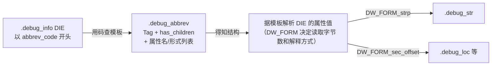

# 详解ELF文件(二十八).debug_abbrev节

`.debug_abbrev` 节是DWARF调试信息格式中的一个重要组成部分，主要用于定义 [[26.debug_info节|.debug_info]] 节中调试信息条目（DIE）的结构和属性。它的主要作用是通过提供一种缩写机制来减少调试信息的存储空间。

## 1. 基本概念和作用

`.debug_abbrev` 节存储了所有在 `.debug_info` 节中使用的调试信息条目（DIE）的"模板"或"缩写"定义。这种设计允许 DWARF 格式通过复用这些模板来压缩调试信息的大小，避免重复存储相同类型的调试信息结构。

核心思路：如果一个程序有数百个函数，每个函数 DIE 的**结构**（有哪些属性、每个属性用什么形式编码）完全相同，只是属性**值**不同。DWARF 将结构定义提取到 `.debug_abbrev`，在 `.debug_info` 中每个函数 DIE 只存一个 ULEB128 缩写码 + 各属性值，大幅减少冗余。

## 2. 数据结构详解

`.debug_abbrev` 节由多个**缩写声明（Abbreviation Declaration）**组成，每个声明包含：

```text
[ULEB128 缩写码]          ← 非 0 整数（0 表示声明列表终止）
[ULEB128 DW_TAG 标签值]   ← 如 0x11 = DW_TAG_compile_unit
[1字节 DW_CHILDREN 标志]  ← 0x01 = DW_CHILDREN_yes, 0x00 = DW_CHILDREN_no
[属性对1: ULEB128 DW_AT, ULEB128 DW_FORM]
[属性对2: ULEB128 DW_AT, ULEB128 DW_FORM]
...
[0x00, 0x00]              ← 属性列表终止符（两个 0 字节）
```

整个 `.debug_abbrev` 节以 `0x00` 终止（最后一个缩写码 = 0，标志所有声明结束）。

### 2.1 缩写码（Abbreviation Code）

- 在同一个**缩写表集**（由 CU 头部的 `debug_abbrev_offset` 定位）内，缩写码必须唯一且非零
- 缩写码不必从 1 连续排列，但通常编译器会这样做
- 不同编译单元可以（也通常会）共享同一个缩写表集（当多个 `.o` 文件合并时，链接器会追加各自的缩写表）

### 2.2 has_children 标志

| 字节值 | 常量名 | 含义 |
|--------|--------|------|
| `0x00` | `DW_CHILDREN_no` | 该 DIE 无子 DIE，下一个字节是兄弟 DIE 或父 DIE 子序列终止 |
| `0x01` | `DW_CHILDREN_yes` | 该 DIE 有子 DIE，后续子序列以 `abbrev_code=0` 结束 |

### 2.3 DW_FORM_implicit_const（DWARF 5 特殊处理）

`DW_FORM_implicit_const`（值 0x21，DWARF 5 新增）是唯一一个**在缩写声明本身存储属性值**的 form：

```text
[ULEB128 DW_AT 属性名]
[ULEB128 0x21]              ← DW_FORM_implicit_const 的编码值
[SLEB128 常量值]            ← 值直接嵌在缩写声明中！
```

当解析器在 `.debug_info` 中遇到使用了 `DW_FORM_implicit_const` 的缩写时，**不从 `.debug_info` 读取任何字节作为该属性值**，而是直接使用缩写声明中嵌入的 SLEB128 常量。

这对于所有 DIE 实例都具有相同值的属性非常有效，例如：同一编译单元内所有 `int` 类型 DIE 的 `DW_AT_byte_size` 恒为 4，`DW_AT_encoding` 恒为 `DW_ATE_signed`——将这些值编进缩写表可以为每个 DIE 实例节省若干字节。

## 3. ULEB128 与 SLEB128 编码详解

### 3.1 基本原理

LEB128（Little Endian Base 128）是 DWARF 广泛使用的变长整数编码。每字节使用 7 位存储数据，最高位（bit 7）作为"延续位"：

```text
bit 7 = 1：还有更多字节
bit 7 = 0：这是最后一个字节
```

数据按**小端序**排列（低有效字节在前）。

### 3.2 ULEB128（无符号 LEB128）编码

```text
编码算法（伪代码）：
  do {
      byte = value & 0x7f      /* 取低 7 位 */
      value >>= 7
      if (value != 0) byte |= 0x80  /* 还有更多字节，设置延续位 */
      emit(byte)
  } while (value != 0)

解码算法：
  result = 0, shift = 0
  do {
      byte = read_next_byte()
      result |= (byte & 0x7f) << shift
      shift += 7
  } while (byte & 0x80)
```

编码示例：

| 整数值 | 十六进制 | ULEB128 字节序列 | 说明 |
|--------|----------|-----------------|------|
| 0 | 0x0 | `00` | 1 字节 |
| 1 | 0x1 | `01` | 1 字节 |
| 127 | 0x7f | `7f` | 1 字节（最大单字节值）|
| 128 | 0x80 | `80 01` | 2 字节：低7位=0（+延续位），高7位=1 |
| 300 | 0x12c | `ac 02` | 2 字节：低7位=0x2c（+延续位），高7位=2 |
| 624485 | 0x98765 | `e5 8e 26` | 3 字节 |
| 16384 | 0x4000 | `80 80 01` | 3 字节 |

ULEB128 字节 `ac 02` 的解码：
```
0xac = 1010 1100 → 延续位=1，数据=010 1100 → 贡献低7位：0x2c
0x02 = 0000 0010 → 延续位=0，数据=000 0010 → 贡献次7位：0x02
结果 = 0x2c | (0x02 << 7) = 44 + 256 = 300
```

### 3.3 SLEB128（有符号 LEB128）编码

SLEB128 专为有符号整数设计，最后一字节的 bit 6 用作符号扩展位：

```text
解码算法（关键在于符号扩展）：
  result = 0, shift = 0
  do {
      byte = read_next_byte()
      result |= (byte & 0x7f) << shift
      shift += 7
  } while (byte & 0x80)
  /* 符号扩展 */
  if (shift < 64 && (byte & 0x40))  /* 最后一字节的 bit 6 = 1，表示负数 */
      result |= -(1 << shift)
```

编码示例：

| 整数值 | SLEB128 字节序列 | 说明 |
|--------|-----------------|------|
| 0 | `00` | 1 字节 |
| 1 | `01` | 1 字节 |
| -1 | `7f` | 1 字节：0x7f = 0111 1111，bit6=1→负数，符号扩展 |
| -128 | `80 7f` | 2 字节 |
| -5 | `7b` | 1 字节（常见于 line_base）|
| 128 | `80 01` | 2 字节（与 ULEB128 相同，因为符号位恰好为0）|
| -129 | `ff 7e` | 2 字节 |

SLEB128 字节 `7b` 的解码（值=-5）：
```
0x7b = 0111 1011 → 延续位=0，数据=111 1011
bit6=1 → 需要符号扩展
result = 0x7b & 0x7f = 0x7b = 123
shift = 7
符号扩展：result |= -(1 << 7) = 123 - 128 = -5  ✓
```

### 3.4 在 .debug_abbrev 中的使用场景

| 数据 | 编码方式 |
|------|----------|
| 缩写码 | ULEB128（非负整数）|
| DW_TAG 值（如 `DW_TAG_compile_unit=0x11`）| ULEB128 |
| DW_AT 值（如 `DW_AT_name=0x03`）| ULEB128 |
| DW_FORM 值（如 `DW_FORM_strp=0x0e`）| ULEB128 |
| `DW_FORM_implicit_const` 嵌入值 | SLEB128（允许负数常量）|
| has_children 标志 | 单字节（0x00 或 0x01，非 LEB128）|

## 4. 工作原理



`.debug_abbrev` 节与 `.debug_info` 节紧密配合：

1. 在 `.debug_info` 中，每个 DIE 开始时只有一个 ULEB128 缩写码（而非完整的标签和属性信息）
2. 调试器用这个缩写码在 `.debug_abbrev` 中查找对应缩写定义（按 CU 头部的 `debug_abbrev_offset` 定位缩写表集起点，再线性扫描）
3. 据查到的定义得知该 DIE 的：标签（DW_TAG）、是否有子节点（has_children）、属性名序列和对应的属性形式（DW_FORM）
4. 再据这些结构信息正确解析 `.debug_info` 中该 DIE 的实际属性值字节流

## 5. 节内字节流布局

以一个含两个缩写声明的 `.debug_abbrev` 节为例，展示其完整字节布局：

```text
偏移   字节值   含义
───────────────────────────────────────────────────────────
0x00   0x01    ULEB128: 缩写码 = 1
0x01   0x11    ULEB128: DW_TAG_compile_unit (0x11)
0x02   0x01    has_children = DW_CHILDREN_yes
0x03   0x25    ULEB128: DW_AT_producer (0x25)
0x04   0x0e    ULEB128: DW_FORM_strp (0x0e)
0x05   0x13    ULEB128: DW_AT_language (0x13)
0x06   0x05    ULEB128: DW_FORM_data2 (0x05)
0x07   0x03    ULEB128: DW_AT_name (0x03)
0x08   0x0e    ULEB128: DW_FORM_strp (0x0e)
0x09   0x11    ULEB128: DW_AT_low_pc (0x11)
0x0a   0x01    ULEB128: DW_FORM_addr (0x01)
0x0b   0x12    ULEB128: DW_AT_high_pc (0x12)
0x0c   0x01    ULEB128: DW_FORM_addr (0x01)
0x0d   0x10    ULEB128: DW_AT_stmt_list (0x10)
0x0e   0x17    ULEB128: DW_FORM_sec_offset (0x17)
0x0f   0x00    属性列表终止：DW_AT = 0
0x10   0x00    属性列表终止：DW_FORM = 0
── 第一个缩写声明结束 ──
0x11   0x02    ULEB128: 缩写码 = 2
0x12   0x2e    ULEB128: DW_TAG_subprogram (0x2e)
0x13   0x01    has_children = DW_CHILDREN_yes
0x14   0x3f    ULEB128: DW_AT_external (0x3f)
0x15   0x19    ULEB128: DW_FORM_flag_present (0x19)  ← 零字节，仅存在即有意义
0x16   0x03    ULEB128: DW_AT_name (0x03)
0x17   0x0e    ULEB128: DW_FORM_strp (0x0e)
... （更多属性对）
0xNN   0x00    属性列表终止
0xNN   0x00
── 第二个缩写声明结束 ──
0xNN   0x00    缩写表集终止（缩写码 = 0）
```

## 6. 示例：readelf 输出解读

```text
# 示例输出（代表性，非本机实跑）
$ readelf --debug-dump=abbrev program

Abbrev table for offset: 0x0
[1] DW_TAG_compile_unit  has children: yes
    DW_AT_producer   DW_FORM_strp
    DW_AT_language   DW_FORM_data2
    DW_AT_name       DW_FORM_strp
    DW_AT_comp_dir   DW_FORM_strp
    DW_AT_low_pc     DW_FORM_addr
    DW_AT_high_pc    DW_FORM_addr
    DW_AT_stmt_list  DW_FORM_sec_offset

[2] DW_TAG_subprogram   has children: yes
    DW_AT_external   DW_FORM_flag_present
    DW_AT_name       DW_FORM_strp
    DW_AT_decl_file  DW_FORM_data1
    DW_AT_decl_line  DW_FORM_data1
    DW_AT_type       DW_FORM_ref4
    DW_AT_low_pc     DW_FORM_addr
    DW_AT_high_pc    DW_FORM_addr
    DW_AT_frame_base DW_FORM_exprloc

[3] DW_TAG_variable     has children: no
    DW_AT_name       DW_FORM_strp
    DW_AT_decl_file  DW_FORM_data1
    DW_AT_decl_line  DW_FORM_data1
    DW_AT_type       DW_FORM_ref4
    DW_AT_location   DW_FORM_exprloc

[4] DW_TAG_base_type    has children: no
    DW_AT_byte_size  DW_FORM_data1
    DW_AT_encoding   DW_FORM_data1
    DW_AT_name       DW_FORM_strp
```

在这个例子中：
- 缩写 [1] 定义了编译单元的结构（7 个属性）
- 缩写 [2] 定义了函数（子程序）的结构（8 个属性）
- 缩写 [3] 定义了变量（5 个属性，无子 DIE）
- 缩写 [4] 定义了基本类型（3 个属性，无子 DIE）

`.debug_info` 中每个对应 DIE 只需写"缩写码（1 字节）+ 各属性的值"，不再重复存储属性名和形式。

## 7. DW_FORM_implicit_const 示例（DWARF 5）

以 `DW_AT_encoding` 对于 `int` 类型 DIE 恒为 `DW_ATE_signed`（值 5）为例：

```text
# .debug_abbrev 中（DWARF 5 版本）
[5] DW_TAG_base_type    has children: no
    DW_AT_byte_size    DW_FORM_data1            ← 占 .debug_info 中 1 字节
    DW_AT_encoding     DW_FORM_implicit_const   ← 值 5 嵌在缩写表中
                       SLEB128 值: 5             ← DW_ATE_signed = 5
    DW_AT_name         DW_FORM_strp             ← 占 .debug_info 中 4/8 字节

# 对应的 .debug_info 中 DIE：
[abbrev_code=5]   ← 1 字节 ULEB128
[byte_size=4]     ← 1 字节（DW_FORM_data1）
                  ← encoding 无字节！值 5 来自缩写表
[name_offset=0x120]  ← 4 字节（DW_FORM_strp 32-bit）
```

相比 `DW_FORM_data1`，使用 `DW_FORM_implicit_const` 为每个 `int` 类型 DIE 节省 1 字节，当有大量相同类型时效果明显。

## 8. 与其他节的关系

- **与 [[26.debug_info节|.debug_info]] 节**：最主要的关系。`.debug_abbrev` 为 `.debug_info` 中的 DIE 提供结构模板；CU 头部的 `debug_abbrev_offset` 字段指定该 CU 使用的缩写表集在 `.debug_abbrev` 中的起始偏移
- **与 [[29.debug_str节|.debug_str]] 节**：当属性形式为 `DW_FORM_strp` 时，属性值是指向 `.debug_str` 的偏移；此偏移存在 `.debug_info` 中，而 `.debug_abbrev` 中只是声明"该属性使用 `DW_FORM_strp` 形式"
- **与 `.debug_line_str`（DWARF 5）**：`DW_FORM_line_strp` 的使用同理，值在 `.debug_info`，形式在 `.debug_abbrev`

## 9. 多 CU 共享缩写表的机制

多个编译单元（CU）可以共享同一个 `.debug_abbrev` 节内的缩写表，只要它们具有相同的缩写结构需求。实现方式：

- CU 头部 `debug_abbrev_offset` 字段指向 `.debug_abbrev` 节内某个位置
- 若两个 CU 的 `debug_abbrev_offset` 值相同，则它们共享同一缩写表集
- 链接时，链接器会合并各 `.o` 文件的 `.debug_abbrev` 内容，并调整各 CU 头部的 `debug_abbrev_offset` 以保持正确引用

一个典型的大型程序中，同一个编译器版本和选项编译出的所有 `.c` 文件可能都使用相同的基本 DIE 结构，因此这些 CU 可能共享大部分缩写表。

## 10. 实战：查看 .debug_abbrev

```bash
readelf --debug-dump=abbrev program    # readelf 格式化输出
objdump --dwarf=abbrev program         # objdump 等效
llvm-dwarfdump --debug-abbrev program  # LLVM 工具
```

查看原始字节并与格式化输出对照：

```bash
readelf -x .debug_abbrev program       # 十六进制转储
```

## 11. 实际应用：体积压缩效果

通过使用 `.debug_abbrev` 节，DWARF 实现了高效的调试信息存储：

**无缩写机制（假设）**：每个 DIE 需要存储完整的属性名（4字节枚举值）和属性形式（1字节），再加属性值。一个有 6 个属性的函数 DIE，假设各属性名各需 4 字节，每个 DIE 就要多存 6×4=24 字节的属性名元数据。若程序有 1000 个函数，即浪费 24KB 仅用于属性名。

**有缩写机制（DWARF 实际）**：这 24 字节的属性名元数据在 `.debug_abbrev` 中只存一次，`.debug_info` 中每个函数 DIE 只多 1 字节（ULEB128 缩写码）。1000 个函数共节省约 23KB。

这种设计大大减少了调试信息的大小，同时保持了信息的完整性和可解析性，使调试器能够准确地重构程序的结构和符号信息。

## 相关阅读

- **被它描述的主节**：[[26.debug_info节]]
- **字符串存储**：[[29.debug_str节]]
- **调试总览**：[[24.debug节]]
- 上一篇：[[27.debug_line节]] ｜ 下一篇：[[29.debug_str节]]
