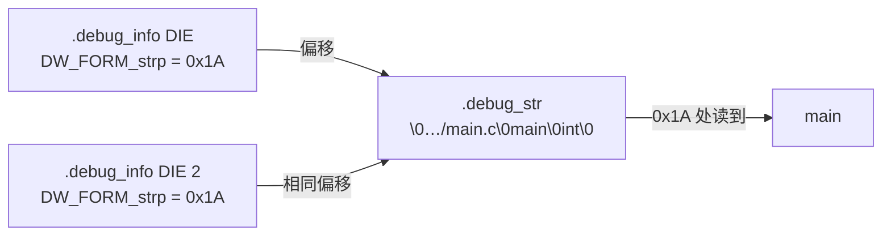
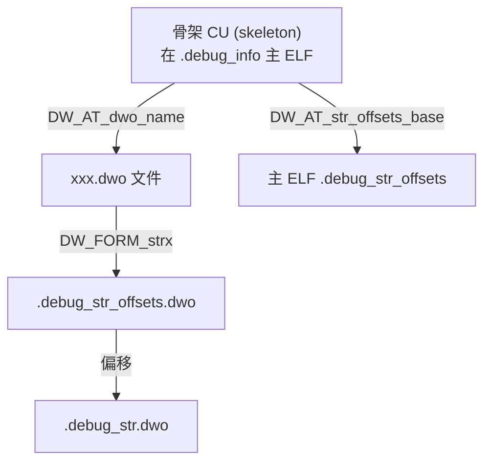

# 详解ELF文件(二十九).debug_str节

.debug_str节是DWARF调试信息格式中的一个辅助部分，专门用于存储字符串表。它作为一个集中管理字符串资源的区域，被其他调试信息节（主要是 [[26.debug_info节|.debug_info]] 节）引用。

## 1. 基本概念和作用

.debug_str节的主要作用是集中存储调试信息中使用的字符串，避免在 .debug_info 等节中重复存储相同的字符串，从而节省存储空间。它采用字符串表的形式，通过偏移量来引用特定的字符串——这与 [[10.shstrtab节|.shstrtab]]、[[16.dynstr节|.dynstr]] 是同一种设计思路，只是服务于调试信息。

典型存储的字符串包括：
- 函数名、变量名、类型名（如 `main`、`argc`、`int`）
- 源文件路径（如 `/home/user/project/main.c`）
- 编译单元所使用的编译器（如 `GNU C17 12.3.0`）
- C++ 的限定名（如 `std::vector<int>::push_back`）
- 命名空间名称

## 2. 数据结构

.debug_str节的结构非常简单：

- 它是一个连续的字节序列
- 字符串依次排列，每个以 null 字符（`\0`）结尾
- 字符串之间紧密排列，没有填充或对齐要求
- 通过从节开始计算的字节偏移量来引用特定字符串
- 允许多个属性引用同一偏移（字符串去重）

```
.debug_str节内容示例：
Offset
0x00000000: "/home/user/project/main.c\0"
0x0000001A: "main\0"
0x0000001F: "int\0"
0x00000023: "argc\0"
0x00000028: "GNU C17 12.3.0\0"
```

字符串去重示例：假设有两个编译单元都使用了类型名 `int`，.debug_str 中只存储一份，两个 DIE 的 `DW_FORM_strp` 属性都指向同一偏移 `0x0000001F`。

## 3. 结构图示



## 4. 工作原理

1. 当 .debug_info 节中的某个 DIE 需要包含字符串值时（如函数名、变量名、文件路径），它不直接存储完整字符串
2. 而是存储一个指向 .debug_str 节中字符串位置的偏移量（属性形式为 `DW_FORM_strp`）
3. 调试器解析 .debug_info 时，遇到需要字符串的地方，就据偏移到 .debug_str 查找，直到遇到 null 字符

## 5. DW_FORM 字符串引用形式详解

DWARF 标准中与 .debug_str 相关的属性形式（form）经历了多个版本的演化，理解这些区别对于阅读 DWARF 数据至关重要。

### 5.1 DW_FORM_strp（DWARF 2–5）

- 值为 .debug_str 节中的字节偏移（32 位 DWARF 用 4 字节，64 位 DWARF 用 8 字节）
- 最经典的字符串引用方式，需要链接时重定位
- 不可用于 Split DWARF .dwo 文件（.dwo 不允许重定位）

```
# .debug_info 中的属性示例（DWARF4/DWARF5 non-split）
DW_AT_name: (DW_FORM_strp) .debug_str[0x001a] → "main"
```

### 5.2 DW_FORM_strx / strx1 / strx2 / strx3 / strx4（DWARF 5）

- 值是 .debug_str_offsets 节中的**索引**，而非直接偏移
- 间接引用链：`DW_FORM_strx` → `.debug_str_offsets` → `.debug_str`
- 优点：无需重定位；多 CU 共享同一字符串偏移表，更利于压缩
- `strx1`/`strx2`/`strx3`/`strx4` 分别用 1/2/3/4 字节存储索引值

```
# DWARF5 中的属性示例
DW_AT_name: (DW_FORM_strx1) index 0x01  # 通过 .debug_str_offsets 解引用
```

### 5.3 DW_FORM_line_strp（DWARF 5）

- 值为 .debug_line_str 节中的偏移（与 DW_FORM_strp 类似，但指向另一张表）
- .debug_line_str 专门存储 .debug_line（行号表）使用的字符串（目录名、文件名）
- 仅用于非 Split DWARF 场景（.dwo 文件内改用 `DW_FORM_strx`）

### 5.4 DW_FORM_string（内联字符串）

- 字符串内容直接嵌入 .debug_info，无需跳转 .debug_str
- 适用于极短字符串（通常编译器会自动选择更省空间的形式）

### 5.5 各形式对比总表

| Form | 指向的节 | DWARF 版本 | 可用于 .dwo | 需要重定位 |
|------|----------|-----------|------------|----------|
| `DW_FORM_strp` | `.debug_str` | 2–5 | 否 | 是 |
| `DW_FORM_strx`/`strx1`–`strx4` | `.debug_str`（经 `.debug_str_offsets`） | 5 | 是 | 否 |
| `DW_FORM_line_strp` | `.debug_line_str` | 5 | 否 | 是 |
| `DW_FORM_string` | 内联于 .debug_info | 2–5 | 是 | 否 |

## 6. DWARF 5 新增：.debug_str_offsets 节

### 6.1 作用

.debug_str_offsets 是 DWARF 5 引入的配套节，它是一个偏移量数组，每个元素是 .debug_str 中某个字符串的字节偏移。CU 通过 `DW_AT_str_offsets_base` 属性指向本 CU 在 .debug_str_offsets 中的起始位置。

### 6.2 头部格式

DWARF5 的 .debug_str_offsets 节每个贡献段（contribution）有自己的头部：

```
字段名                  大小
unit_length            4 字节（32 位 DWARF）或 12 字节（64 位）
version                2 字节（值为 5）
padding                2 字节（保留，置 0）
[随后是偏移量数组]
```

### 6.3 访问流程

```
DW_FORM_strx(idx)
       │
       ▼
CU 的 DW_AT_str_offsets_base  →  .debug_str_offsets 偏移数组
       │（base + idx * 4）
       ▼
.debug_str_offsets[idx]  →  .debug_str 中的字节偏移
       │
       ▼
.debug_str 中的 null 终止字符串
```

### 6.4 示例

```text
# 示例输出（代表性，非本机实跑）
$ llvm-dwarfdump --debug-str-offsets a.out
.debug_str_offsets contents:
  Contribution size = 12, Format = DWARF32, Version = 5
  [    0] 0x00000000 "/home/user/project"
  [    1] 0x00000013 "main.c"
  [    2] 0x0000001a "main"
```

## 7. DWARF 5 新增：.debug_line_str 节

### 7.1 设计动机

.debug_line 节（行号表）的头部需要存储大量目录路径和文件名，DWARF 5 将这类字符串单独放入 .debug_line_str，使行号表头部可以用 `DW_FORM_line_strp` 引用，避免在 .debug_str 中混入大量路径字符串，同时方便链接器对路径字符串单独合并去重。

### 7.2 与 .debug_str 的区别

| | .debug_str | .debug_line_str |
|--|--|--|
| 存储内容 | 所有 DIE 属性字符串 | .debug_line 头部目录/文件名 |
| 引用形式 | DW_FORM_strp / strx | DW_FORM_line_strp |
| Split DWARF | .debug_str.dwo | 无 .debug_line_str.dwo |

## 8. Split DWARF 中的字符串机制

### 8.1 概念背景

Split DWARF（由 `-gsplit-dwarf` 编译选项开启）将调试信息分离为：
- **骨架文件**（skeleton）：留在主 ELF 中，体积很小
- **DWO 文件**（.dwo）：包含完整 DIE 调试信息，供调试器单独加载

### 8.2 .debug_str.dwo

- .dwo 文件有自己独立的字符串表 .debug_str.dwo
- .dwo 文件内不允许使用 `DW_FORM_strp`（因为 .dwo 禁止重定位）
- 所有字符串引用必须使用 `DW_FORM_strx` 系列形式，通过 .debug_str_offsets.dwo 间接访问
- 这样设计的好处：多个 .dwo 文件打包时（DWP package），只需调整 .debug_str_offsets 中的偏移，字符串本身不需要复制，实现跨文件的字符串合并

### 8.3 骨架 CU 与 DWO 字符串表的关系



### 8.4 字符串去重与 DWP 打包

当多个 .dwo 文件被 `llvm-dwp` 或 `dwp` 工具打包为 .dwp（DWARF Package）时：
1. 各 .dwo 的 .debug_str.dwo 被合并，重复字符串只保留一份
2. 各 .dwo 的 .debug_str_offsets.dwo 被调整，指向合并后的全局偏移
3. 最终 .dwp 中的 .debug_str 对所有 .dwo 共享

## 9. 与其他节的关系

- **与 [[26.debug_info节|.debug_info]] 节**：最主要的关系，许多 DIE 属性值是对 .debug_str 字符串的引用
- **与 [[27.debug_line节|.debug_line]] 节**：文件名等字符串也可能存于此（DWARF5 另设 .debug_line_str）
- **与 [[28.debug_abbrev节|.debug_abbrev]] 节**：abbrev 定义了哪些属性以 DW_FORM_strp 形式引用 .debug_str
- **与字符串表家族**：和 [[10.shstrtab节|.shstrtab]]、[[16.dynstr节|.dynstr]] 结构相同，用途不同

## 10. 实战：查看 .debug_str

### 10.1 readelf 查看

```bash
readelf -p .debug_str program        # 逐条打印字符串（-p = --string-dump）
readelf -p .debug_line_str program   # 查看行号字符串表（DWARF5）
readelf --debug-dump=str program     # 同上，DWARF 专用选项
```

```text
# 示例输出（代表性，非本机实跑）
$ readelf -p .debug_str program
String dump of section '.debug_str':
  [     0]  /home/user/project/main.c
  [    1a]  main
  [    1f]  int
  [    23]  argc
  [    28]  GNU C17 12.3.0 -mtune=generic -march=x86-64 -gdwarf-5
```

### 10.2 objdump 查看

```bash
objdump -s -j .debug_str program     # 十六进制 + ASCII 双栏显示
objdump --dwarf=str program          # 解析为 DWARF 字符串格式
```

### 10.3 llvm-dwarfdump 查看（推荐，支持 DWARF5）

```bash
llvm-dwarfdump --debug-str program           # 查看 .debug_str
llvm-dwarfdump --debug-str-offsets program   # 查看 .debug_str_offsets
llvm-dwarfdump --debug-line-str program      # 查看 .debug_line_str
```

```text
# 示例输出（代表性，非本机实跑）
$ llvm-dwarfdump --debug-str a.out
.debug_str contents:
  [ 0] ""
  [ 1] "/home/user/project"
  [14] "main.c"
  [1b] "main"
  [20] "GNU C17 12.3.0"
```

### 10.4 通过 .debug_info 追踪字符串引用

```bash
# 查看 .debug_info 引用了哪些 .debug_str 偏移
readelf --debug-dump=info program | grep DW_FORM_strp
```

## 11. 优势与局限

### 11.1 优势

1. **节省空间**：避免重复存储相同字符串；同一名称（如类型名 `int`）全局只存一份
2. **便于维护**：字符串集中存储，修改方便
3. **提高效率**：调试器可快速通过偏移定位字符串
4. **支持去重**：链接器可在链接时合并多个 .o 文件的 .debug_str，消除跨编译单元的重复项

### 11.2 局限

1. **引用依赖**：.debug_info 与 .debug_str 必须同步，单独 strip 某个节会导致损坏
2. **DWARF5 前无排序索引**：只能顺序扫描（DWARF5 通过 .debug_str_offsets 优化了访问，但本质仍是线性数组）
3. **Split DWARF 复杂性**：.dwo 场景下 .debug_str.dwo 与主 ELF .debug_str 分离，工具链需正确关联

.debug_str节虽然看似简单，但在DWARF调试信息体系中发挥着重要作用，它有效地支持了调试信息的紧凑存储和高效检索。

## 相关阅读

- **引用它的主节**：[[26.debug_info节]]、[[28.debug_abbrev节]]
- **同类字符串表**：[[10.shstrtab节]]、[[16.dynstr节]]
- **调试总览**：[[24.debug节]]
- 上一篇：[[28.debug_abbrev节]] ｜ 下一篇：[[30.debug_aranges节]]
