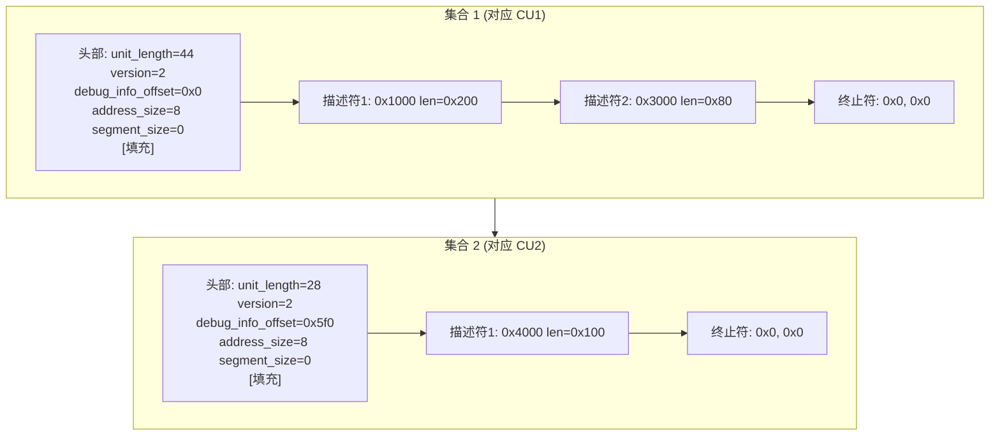

# 详解ELF文件(三十).debug_aranges节

.debug_aranges节是DWARF调试信息格式中的一个重要部分，全称是"Address Ranges"（地址范围）。它的主要作用是提供内存地址与编译单元（Compilation Unit）之间的快速映射关系。

## 1. 基本概念和作用

.debug_aranges节用于建立程序内存地址与对应的调试信息编译单元之间的映射关系。它允许调试器快速确定给定的程序计数器（PC）值属于哪个编译单元，从而可以直接跳转到相应的调试信息，而不需要遍历所有的编译单元来查找匹配的地址范围。

**使用场景举例**：
- GDB 在断点命中时，已知 PC 值，需要快速找到对应的编译单元以定位源文件和行号
- 调试器显示调用栈时，需要将每个返回地址映射到对应的函数所在编译单元
- crash 分析工具（如 LLDB、addr2line）将崩溃地址映射到源码位置

## 2. 完整数据结构

.debug_aranges节由一系列"集合（set）"组成，每个集合对应一个编译单元。

### 2.1 集合头部格式（Header）

每个集合以一个固定格式的头部开始（DWARF 2/3/4 一致，DWARF 5 此节格式不变）：

```
字段名                     大小           说明
unit_length                4 字节         本集合（含头部）的总字节数（不含 unit_length 自身）
                                          64 位 DWARF：先写 0xffffffff，再写 8 字节长度
version                    2 字节         始终为 2（即使在 DWARF4/5 中此字段仍为 2）
debug_info_offset          4/8 字节       指向 .debug_info 中对应 CU 头部的偏移量
address_size               1 字节         目标地址大小（字节数），如 4（32 位）或 8（64 位）
segment_selector_size      1 字节         段选择子大小，无分段架构（x86-64）为 0
[对齐填充（padding）]       可变           见下文说明
```

### 2.2 对齐填充（tuple 对齐）

头部之后，第一个地址范围描述符的起始位置**必须对齐到 tuple 大小的整数倍**。

- 当 `segment_selector_size == 0` 时，一个 tuple 由（起始地址 + 长度）组成，大小 = `address_size × 2`
- 当 `segment_selector_size > 0` 时，一个 tuple 由（段选择子 + 起始地址 + 长度）组成，大小更大
- 头部固定为 11 字节（4+2+4+1+1）或 23 字节（64 位），通常需要补几个 0x00 字节才能对齐

**示例（address_size=8，无段）**：
- tuple 大小 = 8×2 = 16 字节
- 头部 11 字节，填充 5 字节 → 第一个 tuple 从偏移 16 开始

```
# 内存布局示意
Offset  内容
0x00    unit_length  (4字节)
0x04    version = 2  (2字节)
0x06    debug_info_offset  (4字节)
0x0A    address_size = 8  (1字节)
0x0B    segment_selector_size = 0  (1字节)
0x0C    [4字节填充 0x00 0x00 0x00 0x00]  ← 对齐到 16 字节边界
0x10    第一个描述符：起始地址 (8字节)
0x18    第一个描述符：长度     (8字节)
0x20    第二个描述符：起始地址 (8字节)
...
0xNN    终止符：0x0000000000000000  (8字节)
0xNN+8  终止符：0x0000000000000000  (8字节)
```

### 2.3 地址范围描述符

头部（含填充）之后跟随若干描述符，每个描述符代表该编译单元覆盖的一段地址区间：

```
字段名           大小（address_size=8）    说明
beginning_address  8 字节                  区间起始地址（包含）
length             8 字节                  区间长度（字节数）
```

- 若 segment_selector_size > 0，描述符前还有 `segment_selector_size` 字节的段选择子
- **一个编译单元可以有多个描述符**，适用于代码热/冷分离（-freorder-blocks-and-partition）或编译单元产生不连续代码段的情形
- 列表以**全零终止符**结束（起始地址和长度均为 0）

### 2.4 完整结构示意图



## 3. 结构图示（查询流程）


## 4. 工作原理

1. 当调试器需要查找某个程序地址（如 PC 值）对应的调试信息时，先查询 .debug_aranges 节
2. 顺序扫描各集合的描述符，找到包含该地址的区间（`beginning_address ≤ PC < beginning_address + length`）
3. 一旦找到匹配范围，就获得指向相应编译单元的 `debug_info_offset`
4. 用该偏移量直接访问 .debug_info 节中的对应编译单元头部
5. 从 CU 头部出发解析完整 DIE 树，获取源文件、行号、函数等完整调试信息

### 4.1 与线性扫描的性能对比

| 方法 | 时间复杂度 | 说明 |
|------|-----------|------|
| 无 .debug_aranges，遍历 .debug_info | O(N × 区间检查) | N 为 CU 数量，大型程序可有数千个 CU |
| 有 .debug_aranges，线性扫描 | O(M) | M 为区间总数，通常远小于逐 DIE 遍历 |
| 结合排序+二分查找（调试器内部缓存） | O(log M) | 调试器加载后可对区间排序并二分 |

## 5. 与其他节的关系

- **与 [[26.debug_info节|.debug_info]] 节**：最重要的关系，每个集合头部的 `debug_info_offset` 都直接指向 .debug_info 中一个 CU 的起始偏移
- **与 [[27.debug_line节|.debug_line]] 节**：找到 CU 后，行号信息在 .debug_line 中，地址范围帮助快速定位所属 CU
- **与 [[31.debug_pubnames节|.debug_pubnames]]**：两者是互补索引——.debug_aranges 按地址查，.debug_pubnames 按名字查
- **与 .debug_info CU 头部**：DWARF 规范要求 .debug_aranges 中的 `debug_info_offset` 必须精确指向 CU 的 `unit_length` 字段起始处

## 6. 实战：查看 .debug_aranges

### 6.1 readelf 查看

```bash
readelf --debug-dump=aranges program
```

```text
# 示例输出（代表性，非本机实跑）
$ readelf --debug-dump=aranges program

Contents of the .debug_aranges section:

  Length:                   44
  Version:                   2
  Offset into .debug_info:   0x00000000
  Pointer Size:              8
  Segment Size:              0

    Address            Length
    00000000000011e9   0000000000000161
    000000000000134a   000000000000001e
    000000000000136a   0000000000000011
    0000000000000000   0000000000000000    # 终止符

  Length:                   28
  Version:                   2
  Offset into .debug_info:   0x000005f0
  Pointer Size:              8
  Segment Size:              0

    Address            Length
    0000000000001400   0000000000000080
    0000000000000000   0000000000000000    # 终止符
```

### 6.2 objdump 查看

```bash
objdump --dwarf=aranges program
```

### 6.3 llvm-dwarfdump 查看

```bash
llvm-dwarfdump --debug-aranges program
```

### 6.4 检查是否生成了该节

```bash
readelf -S program | grep aranges     # 查看节是否存在
```

## 7. GCC 默认不生成的原因

GCC 在编译时**默认不生成** .debug_aranges 节（即使加了 `-g`），需要显式指定：

```bash
gcc -g -faranges foo.c -o foo       # 生成 .debug_aranges
gcc -g foo.c -o foo                 # 不生成（默认行为）
```

**GCC 为何默认省略？**

1. **调试器可以自行重建**：GDB 等调试器会在首次加载调试信息时扫描所有 CU 的 `DW_AT_low_pc`/`DW_AT_high_pc`/`DW_AT_ranges` 属性，在内存中构建等效的地址-CU 映射，无需 .debug_aranges
2. **体积收益不明显**：对于中小型程序，.debug_aranges 节的大小并不小（对齐填充也占空间），而调试器内存加载一次后可缓存
3. **可能引入维护问题**：若 .debug_aranges 与 .debug_info 的实际 CU 范围不一致（如链接优化后），可能导致调试错误
4. **DWARF 5 有更好的替代方案**（见下文）

Clang/LLVM 则默认生成 .debug_aranges（使用 `-g` 时），因为 LLDB 依赖它加速查找。

## 8. DWARF 5 趋势：.debug_names 的替代

DWARF 5 引入了更强大的 .debug_names 加速节，它不仅提供名字→CU 的映射，也通过 `DW_IDX_compile_unit` 属性隐含了地址→CU 的索引能力。更重要的是，.debug_names 提供哈希表结构，查找效率比 .debug_aranges 的线性扫描高得多。

从趋势看：
- LLDB 和新版 GDB 优先使用 .debug_names
- .debug_aranges 逐渐成为向后兼容的备选
- 对于 DWARF 5 大型项目，推荐用 `-gdwarf-5 -glldb` 或 `-fdebug-names` 生成 .debug_names

## 9. 注意事项

需要注意的是，并非所有的编译器都会生成 .debug_aranges 节。有些编译器可能省略它，而让调试器通过遍历 .debug_info 中的编译单元来查找地址信息。此外，在某些优化场景下，地址范围信息可能会变得复杂（代码重排、内联）：

- **代码内联（inlining）**：内联函数的代码属于调用者 CU，但调试信息仍指向被内联函数的原始 CU，.debug_aranges 中记录的是最终链接地址所属的 CU
- **热/冷分区（-freorder-blocks-and-partition）**：一个函数的代码段可能被分裂到不同地址，导致同一 CU 有多个不连续区间，需要多个描述符
- **LTO（Link-Time Optimization）**：链接时优化可能重组代码，生成的 .debug_aranges 信息由链接器负责更新

.debug_aranges节的设计目标是为了提高调试器查找调试信息的效率，特别是在大型程序中，它可以显著加快地址到调试信息的映射速度。

## 相关阅读

- **映射目标**：[[26.debug_info节]]
- **按名查找的对应物**：[[31.debug_pubnames节]]
- **调试总览**：[[24.debug节]]
- 上一篇：[[29.debug_str节]] ｜ 下一篇：[[31.debug_pubnames节]]
