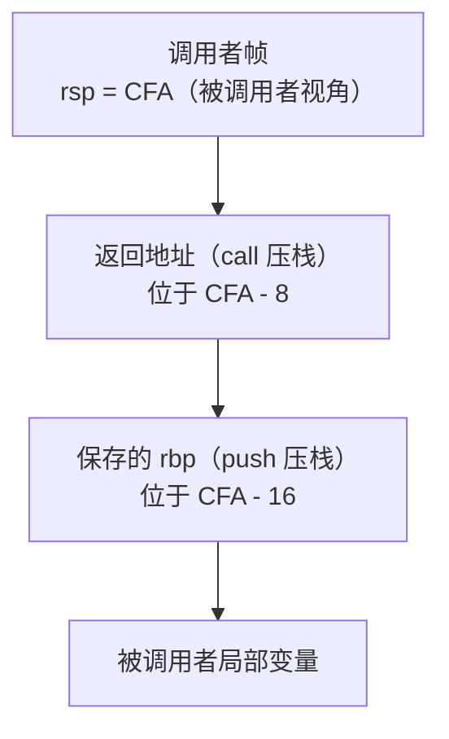
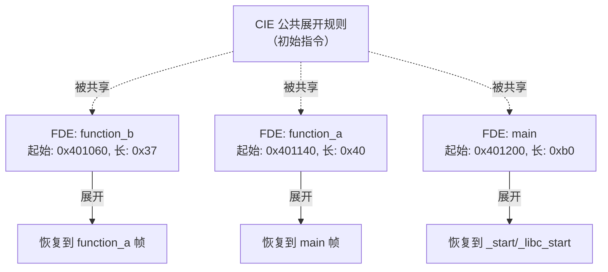

# 详解ELF文件(三十二).debug_frame节

.debug_frame节是DWARF调试信息格式中专门用于存储调用栈帧信息的部分。它包含了描述函数调用栈帧布局和栈展开（unwind）规则的数据，对于调试器进行栈回溯和异常处理至关重要。

## 1. 基本概念和作用

.debug_frame节的主要作用是描述程序执行过程中函数调用栈的结构和布局，以及如何从当前栈帧恢复到上一个栈帧的规则。这对于以下场景非常重要：

- **栈回溯（Stack Backtrace）**：调试器显示函数调用链（`backtrace`/`bt` 命令）
- **异常处理**：在发生异常时正确展开调用栈（与 .eh_frame 互补）
- **调试信息**：恢复函数调用时的寄存器状态（用于查看上层栈帧的局部变量）
- **性能分析**：Perf、gprof 等工具进行准确的调用栈采样

## 2. CFI：Call Frame Information 核心机制

DWARF 将栈帧信息统称为 **CFI（Call Frame Information，调用帧信息）**。CFI 的核心思想是：在程序的每个 PC（程序计数器）位置，都可以精确描述如何计算 CFA（Canonical Frame Address，规范帧地址）以及如何恢复各个寄存器的值。

### 2.1 CFA（Canonical Frame Address，规范帧地址）

CFA 是 DWARF 定义的一个**虚拟基准地址**，代表"进入当前函数时调用者栈指针的值"。

- 在 x86-64 上，函数刚进入时（执行第一条指令前），CFA = `rsp + 8`（因为 `call` 指令已将返回地址 push 到栈上，使 rsp 减 8）
- 随着 prologue 中 push 指令或 sub rsp 指令的执行，rsp 不断变化，但 CFA 可通过不同方式计算（如 `rbp + 16`）
- 返回地址保存在 `CFA - 8`（即调用者 rsp 所指位置）



### 2.2 CFI 规则表

CFI 可以理解为一张"虚拟表格"，每行对应一个 PC 范围，每列对应一个寄存器（或 CFA），单元格描述如何恢复该寄存器：

| PC 区间 | CFA | rsp | rbp | rip（返回地址） |
|---------|-----|-----|-----|----------------|
| fn_start–fn_start+1 | rsp+8 | - | - | CFA-8 |
| fn_start+1–fn_start+4 | rsp+16 | - | CFA-16 | CFA-8 |
| fn_start+4–fn_end | rbp+16 | - | CFA-16 | CFA-8 |

这张表不是显式存储的，而是通过 CIE 的初始规则 + FDE 的增量指令动态重建。

## 3. 完整数据结构

.debug_frame 节由一系列 **CIE（Common Information Entry）** 和 **FDE（Frame Description Entry）** 交错组成。

### 3.1 CIE（公共信息条目）完整格式

CIE 定义了一组公共默认规则，被多个 FDE 共享引用：

```
字段名                      大小          说明
length                      4 字节        本 CIE 的字节数（不含 length 自身）
                                          64 位 DWARF：先 0xffffffff 再 8 字节长度
CIE_id                      4/8 字节      在 .debug_frame 中值为 0xffffffff（区分 CIE/FDE）
                                          在 .eh_frame 中 CIE 的值为 0x00000000
version                     1 字节        1（DWARF 2）或 3（DWARF 3）或 4（DWARF 4）
augmentation                变长          null 结尾字符串，描述扩展数据（.debug_frame 通常为 ""）
address_size (v4+)          1 字节        目标地址大小（DWARF 4 新增）
segment_selector_size (v4+) 1 字节        段选择子大小（DWARF 4 新增）
code_alignment_factor       ULEB128       代码对齐因子（advance_loc 指令的乘数）
data_alignment_factor       SLEB128       数据对齐因子（offset 指令的乘数，x86-64 通常为 -8）
return_address_register     1/ULEB128     返回地址所在的"虚拟寄存器列号"（x86-64 为 16，即 rip）
[augmentation_data_length]  ULEB128       扩展数据长度（若 augmentation 含 'z'）
[augmentation_data]         变长          扩展数据（见 .eh_frame 的 'R'/'P'/'L' 字符含义）
initial_instructions        变长          初始 CFI 指令序列（DW_CFA_* 字节码）
[padding]                   变长          NOP 填充（DW_CFA_nop）至对齐边界
```

**x86-64 典型 CIE 解码示例**：

```text
# 示例输出（代表性，非本机实跑）
CIE
  length:                  16
  CIE_id:                  0xffffffff
  version:                 1
  augmentation:            ""
  code_alignment_factor:   1
  data_alignment_factor:   -8
  return_address_register: 16 (rip)
  DW_CFA_def_cfa: r7 (rsp) ofs 8     ← 初始规则：CFA = rsp + 8
  DW_CFA_offset: r16 (rip) at cfa-8  ← 初始规则：rip 在 CFA-8
  DW_CFA_nop                          ← 填充对齐
  DW_CFA_nop
```

### 3.2 FDE（帧描述条目）完整格式

FDE 描述某个函数（或代码段）的展开规则，引用一个 CIE：

```
字段名                      大小          说明
length                      4/8 字节      本 FDE 的字节数（不含 length 自身）
CIE_pointer                 4/8 字节      .debug_frame：相对节头的 CIE 字节偏移（绝对偏移）
                                          .eh_frame：相对 CIE_pointer 字段本身的偏移（相对偏移）
initial_location            address_size  函数起始地址（该 FDE 覆盖的代码区间起点）
address_range               address_size  函数代码长度（字节数）
[augmentation_data_length]  ULEB128       （若 augmentation 含 'z'）
[augmentation_data]         变长
instructions                变长          增量 CFI 指令序列（DW_CFA_* 字节码）
[padding]                   变长          NOP 填充至对齐边界
```

**典型 FDE 解码示例**：

```text
# 示例输出（代表性，非本机实跑）
FDE  cie=0x00000000  pc=0x0000000000401140..0x0000000000401180
  DW_CFA_advance_loc: 1 to 0x0000000000401141
  DW_CFA_def_cfa_offset: 16           ← push rbp 后：CFA = rsp + 16
  DW_CFA_offset: r6 (rbp) at cfa-16  ← rbp 已保存在 CFA-16
  DW_CFA_advance_loc: 3 to 0x0000000000401144
  DW_CFA_def_cfa_register: r6 (rbp)  ← mov rbp, rsp 后：CFA 改用 rbp 计算
  DW_CFA_advance_loc: 48 to 0x0000000000401174
  DW_CFA_def_cfa: r7 (rsp) ofs 8     ← epilogue：恢复为 rsp 计算
  DW_CFA_nop
```

### 3.3 CIE 与 FDE 的关系结构



## 4. DW_CFA_* 指令完整说明

CFI 指令是一组紧凑的字节码，分为以下几大类：

### 4.1 编码说明

部分指令使用**高 2 位作为操作码，低 6 位嵌入操作数**（节省空间）：

| 高 2 位 | 含义 |
|---------|------|
| `01` | `DW_CFA_advance_loc`，低 6 位为 delta |
| `10` | `DW_CFA_offset`，低 6 位为寄存器号 |
| `11` | `DW_CFA_restore`，低 6 位为寄存器号 |
| `00` | 独立操作码，下一字节为完整操作码 |

### 4.2 PC 推进指令

| 指令 | 格式 | 说明 |
|------|------|------|
| `DW_CFA_advance_loc(delta)` | 操作码（高2位=01），delta 嵌入低 6 位 | PC += delta × code_alignment_factor |
| `DW_CFA_advance_loc1` | 操作码 + 1 字节 delta | PC 推进，delta 为 uint8 |
| `DW_CFA_advance_loc2` | 操作码 + 2 字节 delta | PC 推进，delta 为 uint16 |
| `DW_CFA_advance_loc4` | 操作码 + 4 字节 delta | PC 推进，delta 为 uint32 |
| `DW_CFA_set_loc(addr)` | 操作码 + 绝对地址 | 直接设置 PC 为指定地址 |

### 4.3 CFA 定义指令（最常用）

| 指令 | 操作数 | 说明 |
|------|--------|------|
| `DW_CFA_def_cfa(reg, offset)` | ULEB128 寄存器号 + ULEB128 偏移 | CFA = reg + offset |
| `DW_CFA_def_cfa_sf(reg, offset)` | ULEB128 寄存器号 + SLEB128 偏移 | CFA = reg + (signed_offset × data_align) |
| `DW_CFA_def_cfa_register(reg)` | ULEB128 寄存器号 | 改变 CFA 计算的基址寄存器，保留当前偏移 |
| `DW_CFA_def_cfa_offset(offset)` | ULEB128 偏移 | 改变 CFA 计算的偏移，保留当前寄存器 |
| `DW_CFA_def_cfa_offset_sf(offset)` | SLEB128 有符号偏移 | 同上，有符号版本 |
| `DW_CFA_def_cfa_expression(expr)` | DW_FORM_block DWARF 表达式 | 用 DWARF 表达式计算 CFA（DWARF 3+） |

### 4.4 寄存器规则指令

| 指令 | 操作数 | 语义 |
|------|--------|------|
| `DW_CFA_offset(reg, n)` | 低6位=reg（或ULEB128），ULEB128 factored_offset | reg 上一值保存在 *(CFA + n×data_align) |
| `DW_CFA_offset_sf(reg, n)` | ULEB128 reg，SLEB128 有符号 offset | 同上，有符号因子版本 |
| `DW_CFA_val_offset(reg, n)` | ULEB128 reg，ULEB128 offset | reg 的值（非地址）= CFA + n×data_align |
| `DW_CFA_register(reg1, reg2)` | ULEB128 reg1，ULEB128 reg2 | reg1 上一值现在在 reg2 中 |
| `DW_CFA_expression(reg, expr)` | ULEB128 reg，block 表达式 | reg 上一值保存的地址由表达式计算 |
| `DW_CFA_val_expression(reg, expr)` | ULEB128 reg，block 表达式 | reg 的值由表达式直接计算 |
| `DW_CFA_restore(reg)` | 高2位=11，低6位=reg | 将 reg 规则恢复为 CIE 中的初始规则 |
| `DW_CFA_restore_extended(reg)` | 操作码 + ULEB128 reg | 同上，寄存器号超过 63 时使用 |
| `DW_CFA_undefined(reg)` | ULEB128 reg | reg 在此 PC 处没有定义值（不可展开） |
| `DW_CFA_same_value(reg)` | ULEB128 reg | reg 值未被修改（不需要恢复） |

### 4.5 状态保存/恢复指令

| 指令 | 说明 |
|------|------|
| `DW_CFA_remember_state` | 将当前所有寄存器规则和 CFA 规则压入虚拟栈 |
| `DW_CFA_restore_state` | 从虚拟栈弹出并恢复之前保存的规则集 |

这对指令常用于信号处理函数（signal trampoline）、异常处理 landing pad 等非标准 prologue/epilogue 场景，以及编译器生成的特殊函数。

### 4.6 其他指令

| 指令 | 说明 |
|------|------|
| `DW_CFA_nop` | 空操作，用于对齐填充 |
| `DW_CFA_GNU_window_save` | GNU/SPARC 扩展：保存寄存器窗口 |
| `DW_CFA_GNU_args_size(size)` | GNU 扩展：当前 call 参数大小（供 GDB 使用） |

### 4.7 指令执行流程示例（x86-64 函数 prologue）

以典型的 x86-64 有帧函数 prologue 为例，演示 CFI 指令如何随 PC 推进描述寄存器状态变化：

```asm
; 函数入口前，CIE 初始规则已定义：CFA = rsp + 8, rip = [CFA-8]
0x401140:  push rbp         ; rsp -= 8，即 rsp = rsp_orig - 8
; DW_CFA_advance_loc: 1
; DW_CFA_def_cfa_offset: 16   ← CFA = rsp + 16（因为 push 使 rsp 减 8）
; DW_CFA_offset: r6 (rbp) at cfa-16  ← rbp 旧值在栈上 CFA-16 处

0x401141:  mov rbp, rsp     ; rbp = rsp（此后可通过 rbp 稳定访问帧）
; DW_CFA_advance_loc: 3
; DW_CFA_def_cfa_register: r6 (rbp)  ← CFA 改用 rbp + 16（rbp 更稳定）

0x401144:  sub rsp, 0x20    ; 为局部变量分配栈空间
; (CFA 已不依赖 rsp，此操作不需新的 CFI 指令)

...  ; 函数体

0x401178:  pop rbp          ; 恢复 rbp，rsp += 8
; DW_CFA_advance_loc: ...
; DW_CFA_def_cfa: r7 (rsp) ofs 8  ← epilogue：CFA 重回 rsp + 8

0x401179:  ret
```

## 5. 与 .eh_frame 节的区别（深度对比）

.debug_frame 与 [[46.eh_frame节|.eh_frame]] 格式极为相似，但定位和使用场景不同：

### 5.1 核心区别表

| 对比项 | .debug_frame | .eh_frame |
|--------|-------------|-----------|
| 主要用途 | 调试时栈回溯 | 运行时 C++ 异常展开（`throw`/`catch`） |
| 是否 SHF_ALLOC | 否（不载入运行时内存） | 是（载入内存，`__EH_FRAME_BEGIN__` 链接符号） |
| strip 影响 | `strip -g` 会删除 | `strip -g` 保留（运行时异常处理需要） |
| 生成时机 | 仅编译时显式加 `-g` | 默认生成（与优化无关） |
| CIE 的 CIE_id 字段 | `0xffffffff`（32 位 DWARF）标识 CIE | `0x00000000` 标识 CIE |
| FDE 的 CIE_pointer | 从节起始处的绝对偏移 | 相对于 CIE_pointer 字段本身的偏移（PE-relative） |
| augmentation 字符串 | 通常为 `""` | 通常含 `z`、`R`、`P`、`L` 等扩展字符 |
| 地址编码（FDE） | 绝对地址（需重定位） | 可使用 DW_EH_PE 编码（pcrel，避免重定位） |
| 关联的 header 节 | 无 | .eh_frame_hdr（含二分查找表，供 libunwind 加速） |

### 5.2 augmentation 字符串说明（.eh_frame 专有）

.eh_frame 的 CIE augmentation 字符串各字符含义：

| 字符 | 含义 |
|------|------|
| `z` | 表示存在 augmentation 数据长度字段（必须是第一个字符） |
| `R` | augmentation 数据中含 FDE 地址编码方式（DW_EH_PE_* 编码） |
| `P` | augmentation 数据中含 personality 函数指针（C++ 异常处理函数） |
| `L` | augmentation 数据中含 LSDA（Language Specific Data Area）指针编码 |

### 5.3 FDE CIE_pointer 编码差异（关键差异）

```
.debug_frame 中的 FDE：
  CIE_pointer = 0x00000010  ← 绝对偏移（从 .debug_frame 节开头算起第 0x10 字节处是 CIE）

.eh_frame 中的 FDE（CIE_pointer 字段位于偏移 0x20）：
  CIE_pointer = 0x00000020  ← 相对偏移（从 CIE_pointer 字段位置 0x20 往回 0x20 字节）
                               → 实际 CIE 位于 0x20 - 0x20 = 0x00 处
```

## 6. x86-64 ABI 中的 CFI 约定

x86-64 System V ABI（psABI）规定了 CFI 的默认约定，所有遵循 ABI 的代码都必须遵守：

1. **函数入口前**（执行 call 的一侧）：CFA = rsp + 8（返回地址已 push）
2. **callee-saved 寄存器**：rbp、rbx、r12–r15 若被修改，必须在 prologue 中保存并在 FDE 中记录
3. **返回地址**：始终在 `CFA - 8`（即原始 rsp 所指位置）
4. **帧对齐**：调用 call 指令前 rsp 必须对齐到 16 字节（含返回地址后 rsp 对齐到 16-8=8 字节边界）

## 7. 实战：查看 .debug_frame

### 7.1 readelf 查看

```bash
readelf --debug-dump=frames program      # 查看 .debug_frame
readelf --debug-dump=frames-interp program  # 查看解释后的帧规则矩阵
```

```text
# 示例输出（代表性，非本机实跑）
$ readelf --debug-dump=frames program

Contents of the .debug_frame section:

00000000 0000000c ffffffff CIE
  Version:               1
  Augmentation:          ""
  Code alignment factor: 1
  Data alignment factor: -8
  Return address column: 16
  DW_CFA_def_cfa: r7 (rsp) ofs 8
  DW_CFA_offset: r16 (rip) at cfa-8
  DW_CFA_nop

00000010 00000024 00000000 FDE cie=00000000 pc=0000000000401140..0000000000401180
  DW_CFA_advance_loc: 1 to 0x0000000000401141
  DW_CFA_def_cfa_offset: 16
  DW_CFA_offset: r6 (rbp) at cfa-16
  DW_CFA_advance_loc: 3 to 0x0000000000401144
  DW_CFA_def_cfa_register: r6 (rbp)
  DW_CFA_advance_loc: 48 to 0x0000000000401174
  DW_CFA_def_cfa: r7 (rsp) ofs 8
  DW_CFA_nop
```

### 7.2 llvm-dwarfdump 查看

```bash
llvm-dwarfdump --debug-frame program
llvm-dwarfdump --debug-frame --verbose program  # 含字节码偏移
```

### 7.3 查看 .eh_frame

```bash
readelf --debug-dump=frames program  # 同时显示 .eh_frame
readelf -e program | grep eh_frame   # 确认 SHF_ALLOC 标志
objdump --dwarf=frames program
```

## 8. 注意事项

1. **发布版本可能被移除**：release 版本中 .debug_frame 通常被 `strip -g` 移除，但 .eh_frame 保留
2. **-fomit-frame-pointer 的影响**：省略 rbp 作为帧指针时，CFA 始终通过 rsp + 偏移计算，FDE 中的指令更多
3. **汇编代码需手写 CFI 指令**：用 `.cfi_*` 汇编伪指令显式标注，如 `.cfi_startproc`、`.cfi_def_cfa_offset`、`.cfi_endproc`
4. **尾调用优化（TCO）**：尾调用跳转不 push 返回地址，需特殊 CFI 处理
5. **信号处理函数（signal trampoline）**：需要 `DW_CFA_remember_state`/`DW_CFA_restore_state` 保护状态

```bash
# 手写汇编中使用 CFI 伪指令示例
foo:
    .cfi_startproc
    push rbp
    .cfi_def_cfa_offset 16
    .cfi_offset rbp, -16
    mov rbp, rsp
    .cfi_def_cfa_register rbp
    ...
    pop rbp
    .cfi_def_cfa rsp, 8
    ret
    .cfi_endproc
```

.debug_frame节是实现高质量调试体验的关键部分，它使得调试器能够准确地重建函数调用链，为开发者提供强大的调试能力。

## 相关阅读

- **运行时异常展开对应物**：[[46.eh_frame节]]、[[47.eh_frame_hdr节]]
- **调试总览**：[[24.debug节]]
- 上一篇：[[31.debug_pubnames节]] ｜ 下一篇：[[33.debug_loc节]]
