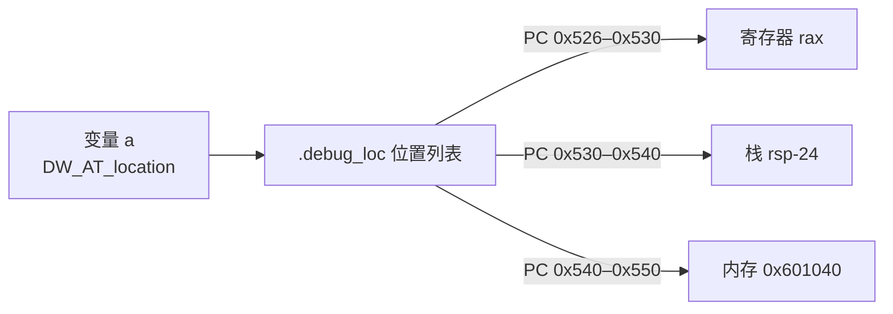

# 详解ELF文件(三十三).debug_loc节

.debug_loc节是DWARF调试信息格式中专门用于存储变量位置信息的部分。它描述了在程序执行过程中变量在不同代码位置时的存储位置，这对于调试器正确显示变量值至关重要。

## 1. 基本概念和作用

.debug_loc节的主要作用是存储位置列表（Location Lists），这些列表描述了变量在不同代码地址范围内的存储位置。由于变量可能在程序执行的不同阶段存储在不同位置（如寄存器、栈、内存等），因此需要一个机制来描述这些变化——这是优化后代码能正确调试的关键。

**典型场景**：
- 编译器优化将局部变量分配到寄存器，函数执行到一半又将其溢出（spill）到栈上
- 函数参数在 prologue 中可能位于参数寄存器（rdi/rsi），之后被存储到栈帧
- 内联展开导致变量位置与原始源码不一致
- 寄存器分配（register coloring）使同一变量在不同 PC 区间使用不同寄存器

## 2. 位置列表格式（DWARF 2/3/4）

### 2.1 引用方式

[[26.debug_info节|.debug_info]] 中的 DIE 通过 `DW_AT_location` 属性引用位置信息，有两种形式：

| 形式 | 说明 |
|------|------|
| `DW_FORM_exprloc` | 属性值直接内嵌一段 DWARF 表达式（适用于变量位置不随 PC 变化的情况） |
| `DW_FORM_sec_offset` | 属性值为 .debug_loc 中位置列表的字节偏移（适用于变量位置随 PC 变化的情况） |

### 2.2 位置列表条目格式

.debug_loc 节由若干位置列表组成，每个位置列表由多个条目依次排列，每个条目格式如下：

```
字段名                大小（address_size=8）  说明
beginning_address     8 字节                  区间起始地址
ending_address        8 字节                  区间结束地址（不含）
location_expr_length  2 字节                  后续 DWARF 表达式的字节长度
location_expression   变长                    DWARF 位置表达式（DW_OP_* 字节码）
```

### 2.3 特殊条目

| 条目类型 | beginning_address | ending_address | 说明 |
|---------|-------------------|----------------|------|
| 正常条目 | 区间起始（含） | 区间结束（不含） | 变量在此 PC 区间的位置 |
| 基址选择条目 | `0xffffffffffffffff`（最大值） | 新基址 | 后续所有条目的地址基址更新为此值 |
| 终止条目 | `0x0000000000000000` | `0x0000000000000000` | 本位置列表结束 |

**基址选择（base address selection）机制**：  
对于位置分散的代码（如热/冷代码分离），所有地址都写绝对值会导致大量重定位。DWARF 用"基址选择条目"更新一个基准值，后续条目的地址改为相对于该基址的偏移，减少重定位次数。

### 2.4 完整结构示意

```
.debug_loc 节内容（变量 a 的位置列表起始于偏移 0x00）：

偏移    内容
0x00    beginning_addr=0x400526 ending_addr=0x400530 expr_len=1 [DW_OP_reg0 (rax)]
0x12    beginning_addr=0x400530 ending_addr=0x400540 expr_len=2 [DW_OP_fbreg -24]
0x24    beginning_addr=0x400540 ending_addr=0x400550 expr_len=5 [DW_OP_addr 0x601040]
0x36    beginning_addr=0x0      ending_addr=0x0       (终止符)
```

## 3. 结构图示

同一个变量在不同 PC 区间可能位于不同地方——位置列表正是这张"随地址变化的位置表"：



## 4. DWARF 表达式：DW_OP_* 完整分类

DWARF 表达式是一种基于栈的小型字节码语言，用于描述变量的地址或值。执行后，栈顶元素即为变量的位置（地址）或值。

### 4.1 常量入栈操作

| 操作码 | 格式 | 语义 |
|--------|------|------|
| `DW_OP_lit0`–`DW_OP_lit31` | 单字节 | 将 0–31 压栈 |
| `DW_OP_const1u` | 操作码 + 1 字节无符号 | 将 1 字节无符号整数压栈 |
| `DW_OP_const2u` | 操作码 + 2 字节无符号 | 将 2 字节无符号整数压栈 |
| `DW_OP_const4u` | 操作码 + 4 字节无符号 | 将 4 字节无符号整数压栈 |
| `DW_OP_const8u` | 操作码 + 8 字节无符号 | 将 8 字节无符号整数压栈 |
| `DW_OP_const1s` | 操作码 + 1 字节有符号 | 同上，有符号版本 |
| `DW_OP_constu` | 操作码 + ULEB128 | 将无符号 LEB128 整数压栈 |
| `DW_OP_consts` | 操作码 + SLEB128 | 将有符号 LEB128 整数压栈 |
| `DW_OP_addr` | 操作码 + address_size 字节 | 将绝对地址压栈（需重定位） |
| `DW_OP_addrx` | 操作码 + ULEB128 索引 | 通过 .debug_addr 索引获取地址（DWARF5，无重定位） |
| `DW_OP_constx` | 操作码 + ULEB128 索引 | 通过 .debug_addr 索引获取常量（DWARF5） |

### 4.2 寄存器操作

| 操作码 | 格式 | 语义 |
|--------|------|------|
| `DW_OP_reg0`–`DW_OP_reg31` | 单字节 | 变量值就在寄存器 0–31 中（不是地址，是值） |
| `DW_OP_regx(n)` | 操作码 + ULEB128 | 变量值在第 n 号寄存器中 |
| `DW_OP_breg0(offset)`–`DW_OP_breg31(offset)` | 操作码 + SLEB128 offset | 压入 reg_n + offset（栈/帧相对地址） |
| `DW_OP_bregx(n, offset)` | 操作码 + ULEB128 n + SLEB128 offset | 压入 reg_n + offset |
| `DW_OP_fbreg(offset)` | 操作码 + SLEB128 | 压入 frame_base + offset（frame_base 由 DW_AT_frame_base 定义） |

**DW_OP_reg* 与 DW_OP_breg* 的区别**：
- `DW_OP_reg0`：表示"变量的**值**就在 rax 寄存器中"（结合 `DW_OP_stack_value` 使用）
- `DW_OP_breg0(offset)`：表示"变量**存储地址**是 rax + offset"（栈偏移寻址）

### 4.3 栈操作

| 操作码 | 语义 |
|--------|------|
| `DW_OP_dup` | 复制栈顶元素 |
| `DW_OP_drop` | 弹出并丢弃栈顶 |
| `DW_OP_pick(n)` | 将从栈顶数第 n 个元素复制到栈顶 |
| `DW_OP_over` | 复制第 2 个元素到栈顶（等价于 `pick(1)`） |
| `DW_OP_swap` | 交换栈顶两个元素 |
| `DW_OP_rot` | 将栈顶第三个元素旋转到栈顶 |
| `DW_OP_deref` | 解引用：栈顶地址 → 该地址处的值（机器字大小） |
| `DW_OP_deref_size(n)` | 操作码 + 1 字节 n：解引用并取 n 字节 |
| `DW_OP_xderef` / `DW_OP_xderef_size(n)` | 带段选择的解引用（分段架构） |

### 4.4 算术与逻辑操作

| 操作码 | 语义（均作用于栈顶元素） |
|--------|--------------------------|
| `DW_OP_abs` | 取绝对值 |
| `DW_OP_and` | 按位 AND（top-1 & top） |
| `DW_OP_div` | 有符号除法 |
| `DW_OP_minus` | 减法（top-1 - top） |
| `DW_OP_mod` | 取余 |
| `DW_OP_mul` | 乘法 |
| `DW_OP_neg` | 取反（符号取反） |
| `DW_OP_not` | 按位 NOT |
| `DW_OP_or` | 按位 OR |
| `DW_OP_plus` | 加法 |
| `DW_OP_plus_uconst(n)` | 栈顶 + 无符号常量 n |
| `DW_OP_shl` | 左移（top-1 << top） |
| `DW_OP_shr` | 逻辑右移 |
| `DW_OP_shra` | 算术右移（符号扩展） |
| `DW_OP_xor` | 按位 XOR |

**比较操作**（结果 0 或 1 压栈）：

| 操作码 | 语义 |
|--------|------|
| `DW_OP_le` | top-1 ≤ top |
| `DW_OP_ge` | top-1 ≥ top |
| `DW_OP_eq` | top-1 == top |
| `DW_OP_lt` | top-1 < top |
| `DW_OP_gt` | top-1 > top |
| `DW_OP_ne` | top-1 != top |

**控制流**：

| 操作码 | 格式 | 语义 |
|--------|------|------|
| `DW_OP_skip` | 操作码 + 2 字节有符号偏移 | 无条件跳转（相对当前位置） |
| `DW_OP_bra` | 操作码 + 2 字节有符号偏移 | 弹出栈顶，若非 0 则跳转 |

### 4.5 类型化值（DWARF 5 新增）

DWARF 5 引入了有类型的栈值，以支持更精确的值描述（如 float、int32 等）：

| 操作码 | 格式 | 语义 |
|--------|------|------|
| `DW_OP_const_type(base_type_die, value)` | 操作码 + ULEB128 DIE 偏移 + block | 将有类型常量压栈 |
| `DW_OP_regval_type(reg, base_type_die)` | 操作码 + ULEB128 reg + ULEB128 DIE | 将寄存器值以指定类型压栈 |
| `DW_OP_deref_type(size, base_type_die)` | 操作码 + 1 字节大小 + ULEB128 DIE | 解引用并以指定类型解读 |
| `DW_OP_convert(base_type_die)` | 操作码 + ULEB128 DIE | 类型转换 |
| `DW_OP_reinterpret(base_type_die)` | 操作码 + ULEB128 DIE | 位模式重解释（reinterpret_cast） |

### 4.6 复合位置与值描述

| 操作码 | 格式 | 语义 |
|--------|------|------|
| `DW_OP_piece(size)` | 操作码 + ULEB128 字节数 | 声明当前栈顶描述的位置占变量的 size 字节（用于拆分存储） |
| `DW_OP_bit_piece(bit_size, bit_offset)` | 操作码 + 2×ULEB128 | 以位为单位描述变量片段 |
| `DW_OP_stack_value` | 单字节 | 声明栈顶值**就是变量的值**（而非地址），不需要再解引用 |
| `DW_OP_implicit_value(size, bytes)` | 操作码 + ULEB128 + block | 变量的值由 block 中的字节直接给出（隐式值） |
| `DW_OP_implicit_pointer(die_offset, offset)` | 操作码 + 4/8 字节 DIE 偏移 + SLEB128 | 指向另一个变量（用于被优化掉的指针变量） |
| `DW_OP_entry_value(expr)` | 操作码 + ULEB128 len + block | 返回函数进入时表达式的值（用于跨函数追踪参数） |

### 4.7 位置表达式示例

```text
# 变量在 rax 中（值语义）
DW_OP_reg0 (rax)
→ 或等价于（值在寄存器中，不是地址）

# 变量在 rbp - 24 处的栈上
DW_OP_fbreg -24
→ 等价于 DW_OP_breg6(-24) 当 frame_base = rbp

# 变量被编译器拆成两半，高 4 字节在 rax，低 4 字节在 rbx
DW_OP_reg0 (rax) DW_OP_piece 4
DW_OP_reg3 (rbx) DW_OP_piece 4

# 变量值 = 常量 42（被编译器优化为常数）
DW_OP_lit10  DW_OP_const1u 32  DW_OP_plus  DW_OP_stack_value
→ 等价于 push 10, push 32, add → 栈顶=42，stack_value 声明这是值
```

## 5. 工作原理

1. **与 [[26.debug_info节|.debug_info]] 节关联**：变量 DIE 通过 `DW_AT_location` 属性（`DW_FORM_sec_offset`）引用 .debug_loc 中的位置列表
2. **地址范围映射**：每个位置列表条目定义变量在特定代码地址范围内的存储位置
3. **动态位置描述**：随着程序执行，变量可能在寄存器、栈或内存中移动，位置列表准确描述这些变化
4. **调试器解析**：调试器在特定 PC 处询问变量位置时，搜索位置列表找到覆盖当前 PC 的条目，执行其 DWARF 表达式，得到地址或值

## 6. 实际应用示例

```c
void example_function(int x) {
    // x 进入时在参数寄存器 rdi，可能被溢出到栈
    int a = x + 10;    // a 可能在寄存器 rax
    int b = a * 2;     // a 仍在寄存器，b 在 rcx
    printf("%d %d\n", a, b);  // a、b 被压入栈
    // a、b 超出作用域
}
```

对于变量 `a`，.debug_loc 可能包含：

```
PC 0x400526–0x400530: DW_OP_reg0 (rdi)              # a 由 x（rdi）推导，等价于 rdi+10 的值
PC 0x400530–0x400540: DW_OP_reg0 (rax)              # 计算结果在 rax
PC 0x400540–0x400560: DW_OP_fbreg -8               # 溢出到栈帧 rbp-8
PC 0x400560–0x400590: DW_OP_const1u 42 DW_OP_stack_value  # 常量传播后值已知
```

## 7. .debug_ranges 节（关联节）

在 DWARF 2/3/4 中，还有一个 .debug_ranges 节，用于描述编译单元或函数的不连续地址范围（类似 .debug_loc 的地址范围描述符）。

### 7.1 引用方式

CU 或子程序 DIE 通过 `DW_AT_ranges`（`DW_FORM_sec_offset`）属性引用 .debug_ranges。

### 7.2 格式

格式与 .debug_loc 的地址部分相同：起始地址、结束地址对，以全零终止；同样支持基址选择条目。

## 8. DWARF 5 重大改进：.debug_loclists

### 8.1 设计动机

DWARF 4 的 .debug_loc 存在以下问题：
- 每个地址条目都需要重定位（8 字节地址），重定位条目多，链接慢
- 多个 CU 共用一个 .debug_loc 节，偏移量是全局的，难以并行链接
- 地址编码固定为 `address_size` 字节，浪费空间

### 8.2 DW_LLE_* 条目类型（.debug_loclists 专用）

DWARF 5 定义了全新的 `DW_LLE_*` 条目类型集合，比旧格式灵活得多：

| DW_LLE 条目 | 操作数 | 说明 |
|------------|--------|------|
| `DW_LLE_end_of_list` | 无 | 位置列表终止符 |
| `DW_LLE_base_addressx` | ULEB128 .debug_addr 索引 | 通过 .debug_addr 更新基址（无重定位） |
| `DW_LLE_startx_endx` | 2×ULEB128 .debug_addr 索引 | 用 .debug_addr 索引指定区间（无重定位） |
| `DW_LLE_startx_length` | ULEB128 索引 + ULEB128 长度 | 起始用索引，长度用 LEB128（节省空间） |
| `DW_LLE_offset_pair` | 2×ULEB128 偏移 | 相对当前基址的偏移对（最常见） |
| `DW_LLE_default_location` | 块长度 + DWARF 表达式 | 不在任何区间时的默认位置 |
| `DW_LLE_base_address` | 绝对地址 | 更新基址为绝对地址（需重定位） |
| `DW_LLE_start_end` | 2×绝对地址 | 绝对起止地址（需重定位） |
| `DW_LLE_start_length` | 绝对地址 + ULEB128 长度 | 绝对起始 + LEB128 长度 |

### 8.3 .debug_loclists 节头部格式

DWARF 5 的 .debug_loclists 节有自己的头部（每个 CU 一个贡献）：

```
字段名                大小          说明
unit_length           4/8 字节      本贡献的字节长度
version               2 字节        值 5
address_size          1 字节        目标地址字节数
segment_selector_size 1 字节        段选择子大小（通常 0）
offset_entry_count    4 字节        偏移量数组中的条目数
[offset array]        4/8×count 字节 可选：位置列表偏移量数组
[位置列表数据]        变长
```

### 8.4 引用方式变化

DWARF 5 中，`DW_AT_location` 可以使用新的 `DW_FORM_loclistx`（索引形式，无重定位）代替 `DW_FORM_sec_offset`。

```
DW_AT_location (DW_FORM_loclistx) 0x03
  → 通过 DW_AT_loclists_base 找到 .debug_loclists 中的偏移数组起点
  → 偏移数组[3] 得到位置列表在节内的偏移
  → 解析该位置列表的 DW_LLE_* 条目
```

## 9. .debug_rnglists（.debug_ranges 的 DWARF 5 替代）

与 .debug_loclists 并列，DWARF 5 用 .debug_rnglists 替代 .debug_ranges，格式结构类似，条目类型为 `DW_RLE_*`：

| DW_RLE 条目 | 说明 |
|------------|------|
| `DW_RLE_end_of_list` | 范围列表终止符 |
| `DW_RLE_base_addressx` | 通过 .debug_addr 更新基址 |
| `DW_RLE_startx_endx` | 用 .debug_addr 索引指定区间 |
| `DW_RLE_startx_length` | 索引起始 + LEB128 长度 |
| `DW_RLE_offset_pair` | 相对基址的偏移对 |
| `DW_RLE_base_address` | 绝对基址 |
| `DW_RLE_start_end` | 绝对起止地址 |
| `DW_RLE_start_length` | 绝对起始 + LEB128 长度 |

引用方式：`DW_AT_ranges` 属性使用 `DW_FORM_rnglistx`（索引）或 `DW_FORM_sec_offset`。

### 新旧对比总表

| 旧节（DWARF 4及以前） | 新节（DWARF 5） | 引用 form（旧） | 引用 form（新） |
|--------------------|----------------|-----------------|-----------------|
| .debug_loc | .debug_loclists | DW_FORM_sec_offset | DW_FORM_loclistx |
| .debug_ranges | .debug_rnglists | DW_FORM_sec_offset | DW_FORM_rnglistx |

## 10. 实战：查看位置信息

### 10.1 查看 .debug_loc（DWARF 2/3/4）

```bash
readelf --debug-dump=loc program          # 查看 .debug_loc
objdump --dwarf=loc program
```

```text
# 示例输出（代表性，非本机实跑）
$ readelf --debug-dump=loc program

Contents of the .debug_loc section:

    Offset   Begin    End      Expression
    00000000 00400526 00400530 (DW_OP_reg0 (rax))
    00000000 00400530 00400540 (DW_OP_fbreg: -24)
    00000000 00400540 00400550 (DW_OP_addr: 601040)
    00000000 <End of list>
```

### 10.2 查看 .debug_loclists（DWARF 5）

```bash
readelf --debug-dump=loc program          # binutils 2.38+ 自动处理 loclists
llvm-dwarfdump --debug-loclists program
```

```text
# 示例输出（代表性，非本机实跑）
$ llvm-dwarfdump --debug-loclists a.out

.debug_loclists contents:
  offset = 0x00000000: locations list header: length = 0x00000038, format = DWARF32,
    version = 0x0005, addr_size = 0x08, seg_size = 0x00, offset_entry_count = 0x00000003

  0x0000000c:
    [0x0000000000401140, 0x0000000000401145): DW_OP_reg5 (rdi)
    [0x0000000000401145, 0x0000000000401160): DW_OP_fbreg -20
    DW_LLE_end_of_list (0x00000030)
```

### 10.3 查看 .debug_ranges / .debug_rnglists

```bash
readelf --debug-dump=Ranges program       # 注意大写 R
llvm-dwarfdump --debug-rnglists program
```

### 10.4 结合 .debug_info 追踪

```bash
# 找到变量 DIE 并看其 DW_AT_location 引用的偏移
readelf --debug-dump=info program | grep -A5 "DW_TAG_variable"
# 然后用该偏移在 .debug_loc 中定位对应位置列表
```

## 11. 实际意义

1. **精确的变量定位**：确保调试器在正确位置找到变量值，即使编译器进行了激进的寄存器分配
2. **优化代码支持**：即使 `-O2`/`-O3` 下变量在寄存器间跳转，调试器仍能正确显示
3. **生命周期管理**：准确描述变量在不同代码位置的有效性（变量尚未初始化 vs 已释放时不显示脏值）
4. **结构体/数组分割**：大型数据结构被分配到多个寄存器时，`DW_OP_piece` 可描述拼接关系

.debug_loc节是DWARF调试信息中较为复杂的部分之一，它使得调试器能够在程序执行的任何时刻准确地定位和显示变量的值，即使这些变量在执行过程中改变了存储位置。

## 相关阅读

- **引用它的主节**：[[26.debug_info节]]
- **栈帧/展开信息**：[[32.debug_frame节]]
- **调试总览**：[[24.debug节]]
- 上一篇：[[32.debug_frame节]] ｜ 下一篇：[[34.节头表]]
