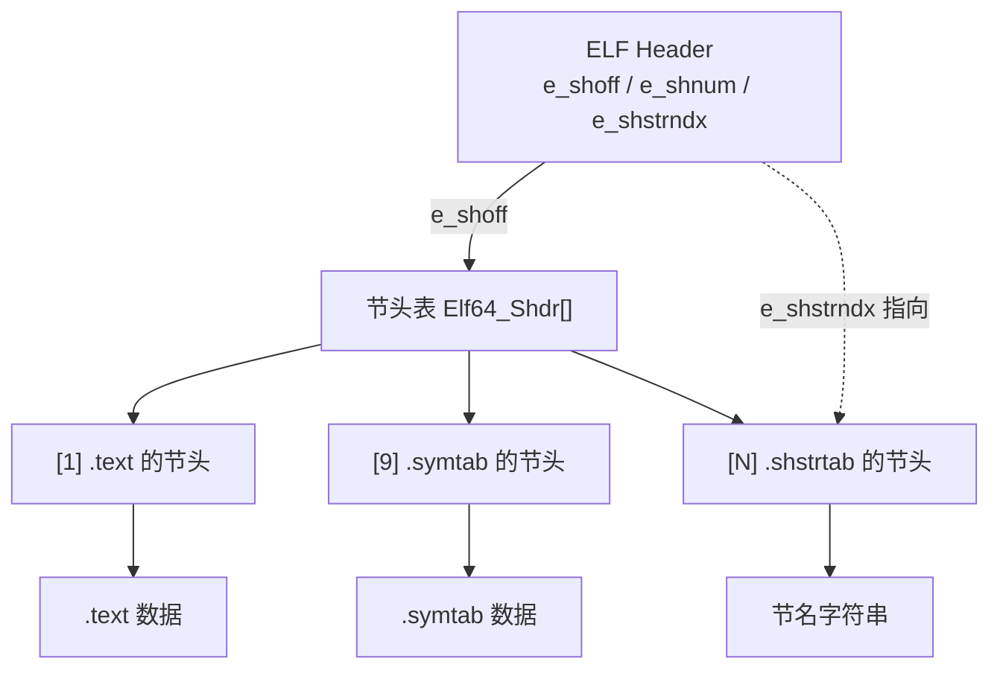

# 详解ELF文件(三十四)节头表

节头表（Section Header Table，SHT）是 ELF 文件中描述所有节区详细信息的核心数据结构，是链接视图的骨架。它主要服务于链接器（静态链接阶段）和调试器（运行时/离线分析阶段），而不是内核加载器。

## 1. 基本概念和作用

节头表是一个结构体数组，每个数组元素对应文件中的一个节区，描述该节区的各种属性。它的主要作用包括：

- 描述每个节区的位置（`sh_offset`）、大小（`sh_size`）和类型（`sh_type`）
- 提供节区在内存中的虚拟地址（`sh_addr`）
- 定义节区的访问属性（`sh_flags`：可读、可写、可执行）
- 建立节区之间的关联关系（`sh_link`、`sh_info`）
- 为调试器提供节名（通过 `.shstrtab`）和结构信息

节头表在 ELF 文件中的位置由 ELF 头部的 `e_shoff`（偏移）、`e_shnum`（条目数）、`e_shentsize`（每项大小）字段确定。

## 2. 数据结构

节头表由一系列节头（Section Header）结构体组成，根据架构不同分为 32 位和 64 位两种结构：

### 32 位节头结构（Elf32_Shdr）

```c
typedef struct {
    uint32_t sh_name;      /* 节区名称在 .shstrtab 中的偏移索引 */
    uint32_t sh_type;      /* 节区类型 */
    uint32_t sh_flags;     /* 节区属性标志（32位） */
    uint32_t sh_addr;      /* 节区在内存中的虚拟地址 */
    uint32_t sh_offset;    /* 节区在文件中的偏移量 */
    uint32_t sh_size;      /* 节区大小（字节）*/
    uint32_t sh_link;      /* 关联节区的节头表索引 */
    uint32_t sh_info;      /* 附加信息 */
    uint32_t sh_addralign; /* 地址对齐要求（2的幂）*/
    uint32_t sh_entsize;   /* 固定大小条目的大小（0=无固定条目）*/
} Elf32_Shdr;  /* 总计 40 字节 */
```

### 64 位节头结构（Elf64_Shdr）

```c
typedef struct {
    uint32_t sh_name;      /* 节区名称在 .shstrtab 中的偏移索引（4字节）*/
    uint32_t sh_type;      /* 节区类型（4字节）*/
    uint64_t sh_flags;     /* 节区属性标志（8字节，64位扩展）*/
    uint64_t sh_addr;      /* 节区在内存中的虚拟地址（8字节）*/
    uint64_t sh_offset;    /* 节区在文件中的偏移量（8字节）*/
    uint64_t sh_size;      /* 节区大小（字节）（8字节）*/
    uint32_t sh_link;      /* 关联节区的节头表索引（4字节）*/
    uint32_t sh_info;      /* 附加信息（4字节）*/
    uint64_t sh_addralign; /* 地址对齐要求（8字节）*/
    uint64_t sh_entsize;   /* 固定大小条目的大小（8字节）*/
} Elf64_Shdr;  /* 总计 64 字节 */
```

> **32/64 位差异总结**：字段顺序完全相同，仅 `sh_flags`、`sh_addr`、`sh_offset`、`sh_size`、`sh_addralign`、`sh_entsize` 由 4 字节扩展为 8 字节；每个节头 32 位为 **40 字节**、64 位为 **64 字节**。

### 32/64 位字段偏移对比

| 字段 | Elf32_Shdr 偏移 | Elf64_Shdr 偏移 | 32位大小 | 64位大小 |
|---|---|---|---|---|
| sh_name | 0 | 0 | 4B | 4B |
| sh_type | 4 | 4 | 4B | 4B |
| sh_flags | 8 | 8 | **4B** | **8B** |
| sh_addr | 12 | 16 | **4B** | **8B** |
| sh_offset | 16 | 24 | **4B** | **8B** |
| sh_size | 20 | 32 | **4B** | **8B** |
| sh_link | 24 | 40 | 4B | 4B |
| sh_info | 28 | 44 | 4B | 4B |
| sh_addralign | 32 | 48 | **4B** | **8B** |
| sh_entsize | 36 | 56 | **4B** | **8B** |
| **总大小** | | | **40B** | **64B** |

## 3. 关键字段详解

### sh_name — 节区名称索引

该字段是一个无符号 32 位整数，存储节区名称在 `.shstrtab` 字符串表中的**字节偏移**（注意：不是索引号，而是偏移）。

通过以下步骤解析节名：

1. 读取 ELF 头 `e_shstrndx`，获得 `.shstrtab` 节在节头表中的索引
2. 用该索引读取 `.shstrtab` 节头，获取其 `sh_offset`（文件中的偏移）
3. 在文件中 `sh_offset + sh_name` 处读取以 `\0` 结尾的字符串，即节名

特殊值：

- `sh_name = 0`：节名为空字符串 `""`（节头表第 0 项的标准值）

### sh_type — 节区类型

`sh_type` 是对节区内容语义的分类，决定了链接器和调试器如何解读节区数据。

#### 标准类型完整列表

| 值 | 宏名 | 含义 |
|---|---|---|
| 0 | SHT_NULL | 无效节，节头表第 0 项始终为此类型 |
| 1 | SHT_PROGBITS | 程序定义内容（代码、数据等）|
| 2 | SHT_SYMTAB | 完整符号表（`.symtab`），可 strip |
| 3 | SHT_STRTAB | 字符串表（以 `\0` 分隔）|
| 4 | SHT_RELA | 带显式加数的重定位表（64位 ELF 常用）|
| 5 | SHT_HASH | SystemV 格式符号哈希表（`.hash`）|
| 6 | SHT_DYNAMIC | 动态链接信息（`.dynamic`）|
| 7 | SHT_NOTE | 提示/辅助信息（`.note.*`）|
| 8 | SHT_NOBITS | 无文件内容（`.bss`）；`sh_size` 表示内存大小 |
| 9 | SHT_REL | 不带显式加数的重定位表（32位 ELF 常用）|
| 10 | SHT_SHLIB | 保留，未定义语义 |
| 11 | SHT_DYNSYM | 动态链接符号表（`.dynsym`），运行时必须 |
| 14 | SHT_INIT_ARRAY | 初始化函数指针数组（`.init_array`）|
| 15 | SHT_FINI_ARRAY | 析构函数指针数组（`.fini_array`）|
| 16 | SHT_PREINIT_ARRAY | 预初始化函数指针数组（`.preinit_array`）|
| 17 | SHT_GROUP | 节组（C++ 模板去重）|
| 18 | SHT_SYMTAB_SHNDX | 扩展符号节索引（超大节表时使用）|
| 0x60000000 | SHT_LOOS | OS 特定范围下界 |
| 0x6fffffff | SHT_HIOS | OS 特定范围上界 |
| 0x70000000 | SHT_LOPROC | 处理器特定范围下界 |
| 0x7fffffff | SHT_HIPROC | 处理器特定范围上界 |
| 0x80000000 | SHT_LOUSER | 应用程序保留范围下界 |
| 0xffffffff | SHT_HIUSER | 应用程序保留范围上界 |

#### GNU/Linux OS 特定类型

| 值 | 宏名 | 含义 |
|---|---|---|
| 0x6ffffff6 | SHT_GNU_HASH | GNU 高效符号哈希表（`.gnu.hash`）|
| 0x6ffffffd | SHT_GNU_verdef | GNU 版本定义（`.gnu.version_d`）|
| 0x6ffffffe | SHT_GNU_verneed | GNU 版本依赖（`.gnu.version_r`）|
| 0x6fffffff | SHT_GNU_versym | GNU 版本符号表（`.gnu.version`）|

#### SHT_SYMTAB vs SHT_DYNSYM 对比

| 特性 | SHT_SYMTAB（.symtab）| SHT_DYNSYM（.dynsym）|
|---|---|---|
| 完整性 | 完整（含静态/局部符号）| 精简（仅动态链接所需）|
| 运行时必要 | 否（可 strip 删除）| 是（不可删除）|
| sh_flags | 通常无 SHF_ALLOC | SHF_ALLOC |
| 内存加载 | 不加载 | 加载到进程地址空间 |

### sh_flags — 节区属性标志

`sh_flags` 是位掩码，各位含义如下：

| 值（十六进制）| 宏名 | 含义 |
|---|---|---|
| 0x1 | SHF_WRITE | 节区在进程运行时可写 |
| 0x2 | SHF_ALLOC | 节区在进程运行时占用内存（不含此标志的节不映射）|
| 0x4 | SHF_EXECINSTR | 节区包含可执行机器指令 |
| 0x10 | SHF_MERGE | 数据可合并消除重复（如相同字符串常量）|
| 0x20 | SHF_STRINGS | 节区含以 `\0` 结尾的字符串，配合 SHF_MERGE 使用 |
| 0x40 | SHF_INFO_LINK | `sh_info` 字段包含节头表索引 |
| 0x80 | SHF_LINK_ORDER | 节区在输出时需与关联节（`sh_link`）保持相对顺序 |
| 0x100 | SHF_OS_NONCONFORMING | 需要 OS 特定处理；链接器不识别则报错 |
| 0x200 | SHF_GROUP | 节区是某个节组（SHT_GROUP）的成员 |
| 0x400 | SHF_TLS | 节区包含线程局部存储（TLS）数据 |
| 0x800 | SHF_COMPRESSED | 节区数据已压缩（ELF 1.1 规范，不可与 SHF_ALLOC 同时用）|
| 0x0ff00000 | SHF_MASKOS | OS 特定标志掩码 |
| 0xf0000000 | SHF_MASKPROC | 处理器特定标志掩码 |

常见节区标志组合速查：

| 节区 | sh_flags | 助记 |
|---|---|---|
| .text | 0x6（AX）| Alloc + eXecute |
| .rodata | 0x2（A）| Alloc only |
| .data | 0x3（WA）| Write + Alloc |
| .bss | 0x3（WA）| Write + Alloc |
| .symtab | 0x0 | 不加载 |
| .strtab | 0x0 | 不加载 |
| .dynsym | 0x2（A）| Alloc（运行时可见）|
| .rela.* | 0x40（I）| SHF_INFO_LINK（带节索引）|
| .debug_* | 0x0 | 不加载 |

> **`SHF_COMPRESSED`**：用于非 ALLOC 节（通常是 `.debug_*` 调试信息节）的压缩存储。启用压缩后，节数据开头有一个 `Elf64_Chdr` 压缩头，记录压缩类型（ELFCOMPRESS_ZLIB 或 ELFCOMPRESS_ZSTD）和原始大小。

### sh_addr — 节区虚拟地址

若节区在进程执行时出现在内存镜像中（`SHF_ALLOC`），`sh_addr` 表示其在进程虚拟地址空间中的地址。否则值为 0。

- 链接后的可执行文件：`sh_addr` 为分配的虚拟地址
- 目标文件（`.o`）：`sh_addr = 0`（尚未链接，地址待分配）
- PIE 文件：`sh_addr` 为相对偏移（基址为 0 时的地址）

### sh_offset — 节区文件偏移

节区在文件中的字节偏移：

- 对于 `SHT_NOBITS` 节（如 `.bss`）：`sh_offset` 是名义偏移，但该偏移处无实际内容；通常指向下一个节的起始位置
- 节头表第 0 项（SHT_NULL）：`sh_offset = 0`

### sh_size — 节区大小

节区的字节大小：

- 对于 `SHT_NOBITS`（`.bss`）：`sh_size` 表示在内存中占用的大小（非零），但文件中不占空间
- 对于其他类型：`sh_size` 字节的数据从 `sh_offset` 处开始

**特殊用途**：当 `e_shnum = 0`（节头表超过 65535 个条目时的扩展机制），节头表第 0 项的 `sh_size` 字段存储实际的节头表条目数。

### sh_link 和 sh_info — 节区关联

这两个字段的含义依赖节区类型，用于建立节区之间的有向关联。常见解读：

| sh_type | sh_link | sh_info |
|---|---|---|
| SHT_SYMTAB / SHT_DYNSYM | 关联字符串表（`.strtab`/`.dynstr`）的节索引 | 第一个全局符号条目的索引 |
| SHT_RELA / SHT_REL | 关联符号表的节索引 | 被重定位的目标节的索引 |
| SHT_HASH / SHT_GNU_HASH | 关联符号表（`.dynsym`）的节索引 | 0 |
| SHT_DYNAMIC | 关联字符串表（`.dynstr`）的节索引 | 0 |
| SHT_GROUP | 关联符号表的节索引 | 组签名符号的索引 |
| SHT_NOTE | 0 | 0 |
| SHT_INIT_ARRAY / SHT_FINI_ARRAY | 0 | 0 |

`readelf -S` 输出中的 `Lk`（sh_link）和 `Inf`（sh_info）列直接展示这些关联：

```text
# 示例输出（代表性，非本机实跑）
  [Nr] Name      Type    Flg Lk  Inf
  [ 6] .dynsym   DYNSYM   A   7    1   ← sh_link=7指向.dynstr, sh_info=1(第1个全局符号)
  [ 7] .dynstr   STRTAB   A   0    0
  [19] .rela.plt RELA    AI   6   25   ← sh_link=6指向.dynsym, sh_info=25指向.plt节
```

### sh_addralign — 节区对齐

节区在内存中的对齐约束：

- 值为 0 或 1：无对齐要求
- 其他值：必须是 2 的幂次（2、4、8、16 等）
- 约束：`sh_addr % sh_addralign == 0`

典型对齐值：

| 节区 | 常见 sh_addralign | 原因 |
|---|---|---|
| .text | 16 | 指令缓存行对齐 |
| .data | 8 | 64 位数据对齐 |
| .bss | 4 或 8 | 变量类型对齐 |
| .symtab | 8 | 64位结构体 |
| .eh_frame | 8 | 指针对齐 |

### sh_entsize — 条目大小

若节区包含固定大小的条目表（如符号表、重定位表），此字段记录每条条目的字节大小；否则为 0。

常见值：

| 节区 | sh_entsize |
|---|---|
| .symtab / .dynsym（32位）| 16（`sizeof(Elf32_Sym) = 16`）|
| .symtab / .dynsym（64位）| 24（`sizeof(Elf64_Sym) = 24`）|
| .rela.*（32位）| 12（`sizeof(Elf32_Rela) = 12`）|
| .rela.*（64位）| 24（`sizeof(Elf64_Rela) = 24`）|
| .rel.*（32位）| 8（`sizeof(Elf32_Rel) = 8`）|
| .rel.*（64位）| 16（`sizeof(Elf64_Rel) = 16`）|
| .dynamic（32位）| 8（`sizeof(Elf32_Dyn) = 8`）|
| .dynamic（64位）| 16（`sizeof(Elf64_Dyn) = 16`）|
| .hash / .gnu.hash | 4（每项 32 位）|
| .note.*（变长节）| 0 |

> 节头表数组的大小 = `e_shnum × e_shentsize`（即 `e_shnum × 64` 对 64 位 ELF）。

## 结构图示

节头表是一个索引数组，每一项描述一个节；ELF 头部用 `e_shstrndx` 指出哪一项是节名字符串表：



## 4. 与 ELF 头部的关系

ELF 头部包含几个与节头表相关的字段：

| ELF 头字段 | 含义 |
|---|---|
| e_shoff | 节头表在文件中的偏移量（字节）|
| e_shnum | 节头表中的条目数量（0 = 超大节表，见扩展机制）|
| e_shentsize | 每个节头的大小（字节）；64位 ELF 为 64 |
| e_shstrndx | `.shstrtab` 节在节头表中的索引（`SHN_XINDEX=0xffff` 时见扩展机制）|

> ELF 头部完整字段见 [[02.ELF文件头部]]。

### 节头表与 ELF 头的超大扩展机制

当节头表条目数超过 65535（`SHN_LORESERVE = 0xff00`）时：

- `e_shnum = 0`，真实数量存储在**第 0 个节头**的 `sh_size` 字段
- `e_shstrndx = SHN_XINDEX (0xffff)`，真实索引存储在**第 0 个节头**的 `sh_link` 字段

第 0 个节头（SHT_NULL）的特殊用途总结：

| 字段 | 正常情况 | 超大扩展时含义 |
|---|---|---|
| sh_size | 0 | 真实节头表条目数（当 `e_shnum = 0`）|
| sh_link | 0 | `.shstrtab` 真实索引（当 `e_shstrndx = SHN_XINDEX`）|
| sh_info | 0 | 程序头表真实条目数（当 `e_phnum = PN_XNUM`，即 `0xffff`）|

## 5. 实际应用示例

### readelf 查看节头表

```bash
readelf -S a.out            # 显示节头表（简洁格式）
readelf -S -W a.out         # 宽格式（地址不截断）
readelf --section-headers a.out  # 同上，长选项
```

```text
# 示例输出（代表性，非本机实跑）
$ readelf -S a.out
There are 30 section headers, starting at offset 0x1a80:

Section Headers:
  [Nr] Name              Type            Addr     Off    Size   ES Flg Lk Inf Al
  [ 0]                   NULL            00000000 000000 000000 00      0   0  0
  [ 1] .interp           PROGBITS        08048154 000154 000013 00   A  0   0  1
  [ 2] .note.ABI-tag     NOTE            08048168 000168 000020 00   A  0   0  4
  [ 3] .note.gnu.build-i NOTE            08048188 000188 000024 00   A  0   0  4
  [ 4] .gnu.hash         GNU_HASH        080481ac 0001ac 000020 00   A  5   0  4
  [ 5] .dynsym           DYNSYM          080481cc 0001cc 000050 10   A  6   1  4
  [ 6] .dynstr           STRTAB          0804821c 00021c 000049 00   A  0   0  1
  [ 7] .gnu.version      VERSYM          08048266 000266 00000a 02   A  5   0  2
  [ 8] .gnu.version_r    VERNEED         08048270 000270 000030 00   A  6   1  4
  [ 9] .rel.dyn          REL             080482a0 0002a0 000008 08   A  5   0  4
  [10] .rel.plt          REL             080482a8 0002a8 000018 08  AI  5  23  4
  ...
  [27] .symtab           SYMTAB          00000000 0009f0 0004b0 10      28  51  4
  [28] .strtab           STRTAB          00000000 000ea0 0002d7 00      0   0  1
  [29] .shstrtab         STRTAB          00000000 001177 000109 00      0   0  1
```

重要字段解读：

| 节 | Lk | Inf | 含义 |
|---|---|---|---|
| .dynsym（[5]）| 6（.dynstr）| 1（第1个全局符号）| sh_link 指向字符串表 |
| .gnu.version（[7]）| 5（.dynsym）| 0 | 版本号与动态符号表对应 |
| .rel.plt（[10]）| 5（.dynsym）| 23（.plt 节）| 重定位目标节 |
| .symtab（[27]）| 28（.strtab）| 51（第51个全局符号）| 全符号表 |

`Lk`（sh_link）列体现了节间关联：例如 `.dynsym` 的 Lk=6 指向 `.dynstr`。

### 手工计算节头表位置（64位 ELF 示例）

```text
# 示例输出（代表性，非本机实跑）
$ readelf -h a.out | grep -E "section header|e_shoff|e_shnum|e_shentsize"
  Start of section headers:          14672 (bytes into file)
  Size of section headers:           64 (bytes)
  Number of section headers:         31
  Section header string table index: 30
```

计算：
- 节头表起始位置：文件第 14672 字节（0x3950）
- 节头表总大小：31 × 64 = 1984 字节
- `.shstrtab` 节头位置：14672 + 30 × 64 = 16592 字节（0x40D0）

### C 代码遍历节头表

```c
#include <stdio.h>
#include <stdlib.h>
#include <string.h>
#include <elf.h>
#include <fcntl.h>
#include <unistd.h>
#include <sys/stat.h>
#include <sys/mman.h>

void print_shtype(uint32_t type) {
    switch (type) {
        case SHT_NULL:          printf("NULL");          break;
        case SHT_PROGBITS:      printf("PROGBITS");      break;
        case SHT_SYMTAB:        printf("SYMTAB");        break;
        case SHT_STRTAB:        printf("STRTAB");        break;
        case SHT_RELA:          printf("RELA");          break;
        case SHT_HASH:          printf("HASH");          break;
        case SHT_DYNAMIC:       printf("DYNAMIC");       break;
        case SHT_NOTE:          printf("NOTE");          break;
        case SHT_NOBITS:        printf("NOBITS");        break;
        case SHT_REL:           printf("REL");           break;
        case SHT_DYNSYM:        printf("DYNSYM");        break;
        case SHT_INIT_ARRAY:    printf("INIT_ARRAY");    break;
        case SHT_FINI_ARRAY:    printf("FINI_ARRAY");    break;
        case SHT_GNU_HASH:      printf("GNU_HASH");      break;
        default:                printf("0x%x", type);   break;
    }
}

int main(int argc, char *argv[]) {
    if (argc != 2) {
        fprintf(stderr, "用法: %s <elf文件>\n", argv[0]);
        return 1;
    }

    int fd = open(argv[1], O_RDONLY);
    if (fd < 0) { perror("无法打开文件"); return 1; }

    struct stat st;
    fstat(fd, &st);
    char *map = mmap(NULL, st.st_size, PROT_READ, MAP_PRIVATE, fd, 0);
    if (map == MAP_FAILED) { perror("mmap"); close(fd); return 1; }

    Elf64_Ehdr *ehdr = (Elf64_Ehdr *)map;
    if (memcmp(ehdr->e_ident, ELFMAG, SELFMAG) != 0 ||
        ehdr->e_ident[EI_CLASS] != ELFCLASS64) {
        fprintf(stderr, "需要 64 位 ELF\n");
        munmap(map, st.st_size); close(fd); return 1;
    }

    /* 获取节头表 */
    Elf64_Shdr *shdrs = (Elf64_Shdr *)(map + ehdr->e_shoff);

    /* 获取 .shstrtab 节，用于解析节名 */
    Elf64_Shdr *shstrtab_shdr = &shdrs[ehdr->e_shstrndx];
    const char *shstrtab = map + shstrtab_shdr->sh_offset;

    printf("节头表共 %d 个条目（偏移 0x%lx，每条 %d 字节）\n",
           ehdr->e_shnum, ehdr->e_shoff, ehdr->e_shentsize);
    printf("\n%-4s %-20s %-15s %-18s %-8s %-8s %3s %2s %2s %2s\n",
           "Nr", "Name", "Type", "Address", "Offset", "Size", "Flg", "Lk", "Inf", "Al");

    for (int i = 0; i < ehdr->e_shnum; i++) {
        Elf64_Shdr *sh = &shdrs[i];

        /* 标志字符串 */
        char flags[8] = "-------";
        int fi = 0;
        if (sh->sh_flags & SHF_ALLOC)     flags[fi++] = 'A';
        if (sh->sh_flags & SHF_WRITE)     flags[fi++] = 'W';
        if (sh->sh_flags & SHF_EXECINSTR) flags[fi++] = 'X';
        if (sh->sh_flags & SHF_MERGE)     flags[fi++] = 'M';
        if (sh->sh_flags & SHF_STRINGS)   flags[fi++] = 'S';
        if (sh->sh_flags & SHF_INFO_LINK) flags[fi++] = 'I';
        if (sh->sh_flags & SHF_TLS)       flags[fi++] = 'T';
        flags[fi] = '\0';

        printf("[%2d] %-20s ", i, shstrtab + sh->sh_name);
        print_shtype(sh->sh_type);
        printf(" %016lx %06lx %06lx %3s %2d %2d %2ld\n",
               sh->sh_addr, sh->sh_offset, sh->sh_size,
               flags, sh->sh_link, sh->sh_info, sh->sh_addralign);
    }

    munmap(map, st.st_size);
    close(fd);
    return 0;
}
```

## 6. 特殊节头条目

### 第 0 个节头（SHN_UNDEF）

节头表的第一个条目（索引 0）始终是 `SHT_NULL` 类型的哑条目，所有字段通常为 0。它有两个作用：

1. `sh_name = 0` 对应 `.shstrtab` 开头的空字符串，用于表示无名节
2. 作为超大节头表的扩展存储（见上文）

### 节的特殊索引值

在符号表、重定位等结构中引用节时，使用以下特殊值：

| 值 | 宏名 | 含义 |
|---|---|---|
| 0 | SHN_UNDEF | 引用外部/未定义符号，待链接时解析 |
| 0xff00 | SHN_LORESERVE | 保留范围下界 |
| 0xff01–0xff1f | SHN_LOPROC–SHN_HIPROC | 处理器特定 |
| 0xff20–0xff3f | SHN_LOOS–SHN_HIOS | OS 特定 |
| 0xfff1 | SHN_ABS | 绝对值，不受重定位影响 |
| 0xfff2 | SHN_COMMON | FORTRAN COMMON 块 / C 弱符号 |
| 0xffff | SHN_XINDEX | 真实索引超过保留范围，在 SYMTAB_SHNDX 节中查找 |

## 7. 与程序头表的区别

节头表主要用于链接视图，而 [[03.程序头表]] 用于执行视图：

| 对比维度 | 节头表（SHT）| 程序头表（PHT）|
|---|---|---|
| 视图 | 链接视图 | 执行视图 |
| 使用方 | 链接器、调试器 | 内核、动态链接器 |
| 存在阶段 | 所有 ELF 文件（`.o`/`.so`/可执行）| 可执行+共享库（无 `.o`）|
| 是否可删除 | 可执行文件 strip 后可无节头表 | 执行时必须存在 |
| 粒度 | 细（每类数据一个节）| 粗（多节合并为段）|
| 主要字段 | sh_type, sh_flags, sh_offset | p_type, p_flags, p_vaddr |

可执行文件和共享库必须有程序头表，但节头表在执行时可以被移除（`strip -s` 可删除符号相关节，`strip --remove-section=.shstrtab` 极端情况下可删整个节名字符串表）。

## 8. 工具支持

### 查看节头表

```bash
readelf -S a.out           # 节头表（简洁）
readelf -SW a.out          # 节头表（宽格式，不截断）
objdump -h a.out           # 另一种查看方式
```

### 查看单个节内容

```bash
readelf -x <节名或索引> a.out   # 以十六进制转储节内容
readelf -p <节名> a.out         # 以字符串形式打印节内容（适合 STRTAB）
objdump -j <节名> -s a.out      # objdump 方式查看节内容
```

```text
# 示例输出（代表性，非本机实跑）
$ readelf -p .shstrtab a.out

String dump of section '.shstrtab':
  [     1]  .symtab
  [     9]  .strtab
  [    11]  .shstrtab
  [    1b]  .interp
  ...
```

### 符号与节关联分析

```bash
nm -S a.out               # 列出符号及其大小和节
readelf -s a.out           # 读取 .symtab 内容
readelf --dyn-syms a.out   # 读取 .dynsym 内容
```

### 节操作工具

```bash
strip -s a.out             # 删除 .symtab, .strtab 等非运行时节
strip --only-keep-debug a.out -o a.dbg   # 只保留调试信息
objcopy --only-section=.text a.out text.bin  # 提取单个节
```

## 相关阅读

- **前置概念**：[[04.节区]]、[[02.ELF文件头部]]
- **对照的执行视图**：[[03.程序头表]]
- **被节头索引的字符串表**：[[10.shstrtab节]]
- **典型节类型**：[[09.symtab节]]、[[15.dynsym节]]、[[18.dynamic节]]
- 上一篇：[[33.debug_loc节]] ｜ 下一篇：[[35.interp节]]
