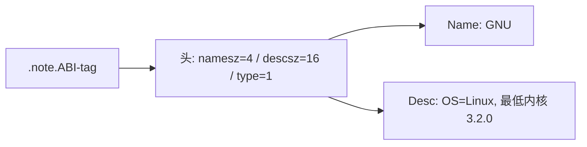
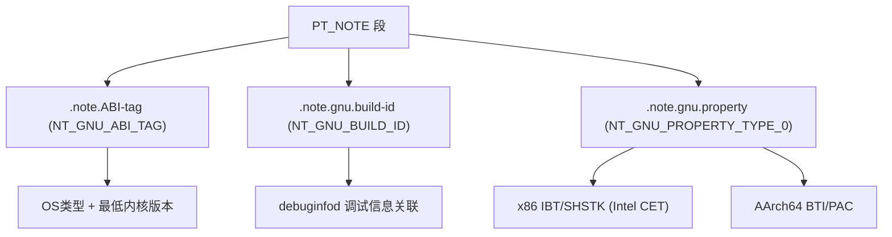

# 详解ELF文件(三十六).note.ABI-tag节

`.note.ABI-tag` 节是ELF（Executable and Linkable Format）文件中的一个特殊注释节，用于声明ELF映像文件预期运行时的ABI（Application Binary Interface）信息。它包含了目标操作系统及其运行时版本的信息。本文以 `.note.ABI-tag` 为切入点，系统介绍 ELF note 机制的完整体系。

## 1. 基本概念和作用

`.note.ABI-tag` 节的主要作用是标识可执行文件所要求的运行时ABI环境，告诉操作系统该程序需要什么样的系统环境：

- 操作系统类型（如 Linux）
- 最低兼容的内核版本
- ABI 版本信息

这对于确保程序在合适的系统环境中运行非常重要，特别是在不同版本的 Linux 发行版之间。它是 PT_NOTE 程序段（见 [[03.程序头表]]）所覆盖的众多 note 之一。

## 2. ELF Note 通用格式详解

在深入 `.note.ABI-tag` 之前，必须先理解 **ELF note 的通用二进制格式**，因为所有 note 节（`.note.*`）都遵循同一套布局规范，由 System V gABI 定义。

### 2.1 节类型与程序头类型

ELF 标准定义了两种承载 note 数据的容器：

| 容器 | 类型常量 | 说明 |
|------|---------|------|
| **节（Section）** | `SHT_NOTE` = 7 | 用 `readelf -S` 可见；链接器视角 |
| **段（Segment）** | `PT_NOTE` = 4 | 用 `readelf -l` 可见；加载器视角 |

通常，同一块 note 数据既是一个 `SHT_NOTE` 节，也被某个 `PT_NOTE` 段覆盖，两者并不冲突——它们是对同一物理数据的两种描述视角。

### 2.2 Elf32_Nhdr / Elf64_Nhdr 结构

每条 note 条目以一个**固定大小的头部**开始，之后跟可变长度的 name 和 desc 字段：

```c
/* 32 位与 64 位共用同一头部结构（字段均为 32 位 Word） */
typedef struct {
    Elf32_Word  n_namesz;   /* name 字段的字节数（含 '\0' 终止符） */
    Elf32_Word  n_descsz;   /* desc 字段的字节数 */
    Elf32_Word  n_type;     /* note 类型（含义由 name 命名空间决定） */
} Elf32_Nhdr;

typedef struct {
    Elf64_Word  n_namesz;   /* 同上，Elf64_Word 仍为 uint32_t */
    Elf64_Word  n_descsz;
    Elf64_Word  n_type;
} Elf64_Nhdr;
```

> 注意：`Elf64_Word` 是 `uint32_t`（4 字节），不是 8 字节。32 位和 64 位 ELF 的 note 头部结构完全相同，都是 12 字节。

### 2.3 字段详解

#### n_namesz — 名称长度

`n_namesz` 是 name 字段的**字节长度，包含 `'\0'` 终止符**。

- 若 name 为 `"GNU"`（3 字符），则 `n_namesz = 4`（含终止符）
- 若 name 为 `"CORE"`（4 字符），则 `n_namesz = 5`（含终止符）
- 若 `n_namesz = 0`，则该 note 无命名空间（使用系统默认集合）

name 字段紧随头部之后，以 `'\0'` 结尾，并**按 4 字节对齐填充**（padding 不计入 `n_namesz`）。

#### n_descsz — 描述符长度

`n_descsz` 是 desc 字段的字节长度。desc 数据紧随对齐后的 name 之后，同样**按 4 字节对齐填充**（padding 不计入 `n_descsz`）。若无描述数据，`n_descsz = 0`。

#### n_type — note 类型

`n_type` 是 note 的语义类型。**同一个 `n_type` 值在不同命名空间（name）下含义不同**，工具必须同时检查 name 和 type 才能正确解析。

### 2.4 内存布局与 4 字节对齐

一个完整 note 条目在内存/文件中的布局：

```
偏移  内容                    大小
────────────────────────────────────────────────────
 0    Elf32_Nhdr              12 字节（固定）
      ├── n_namesz            4 字节
      ├── n_descsz            4 字节
      └── n_type              4 字节
────────────────────────────────────────────────────
12    name 字段               n_namesz 字节
      + 填充字节              ALIGN_UP(n_namesz, 4) - n_namesz 字节
────────────────────────────────────────────────────
??    desc 字段               n_descsz 字节
      + 填充字节              ALIGN_UP(n_descsz, 4) - n_descsz 字节
────────────────────────────────────────────────────
??    下一条 note 头部（若有）
```

计算下一条 note 的起始地址（C 代码）：

```c
/* 通用 note 解析模板 */
void *memory;         /* 指向节或段数据起始 */
Elf32_Nhdr *note = (Elf32_Nhdr *)memory;

void *name = (char *)note + sizeof(*note);
void *desc = (char *)name + ALIGN_UP(note->n_namesz, 4);
Elf32_Nhdr *next = (Elf32_Nhdr *)((char *)desc + ALIGN_UP(note->n_descsz, 4));
```

其中 `ALIGN_UP(x, 4) = (x + 3) & ~3`。

### 2.5 具体对齐示例

以 `"GNU\0"` 为 name（`n_namesz = 4`）、16 字节 desc 为例：

```
字节索引   内容
00-03      n_namesz = 4
04-07      n_descsz = 16
08-11      n_type   = 1 (NT_GNU_ABI_TAG)
12-15      "GNU\0"  (name, 4 字节, 恰好对齐, 无 padding)
16-31      desc 数据 (16 字节, 恰好对齐, 无 padding)
32         下一条 note（若有）
```

以 `"CORE\0"` 为 name（`n_namesz = 5`）、144 字节 desc 为例：

```
字节索引   内容
00-03      n_namesz = 5
04-07      n_descsz = 144 (0x90)
08-11      n_type   = 1 (NT_PRSTATUS)
12-16      "CORE\0" (name, 5 字节)
17-19      padding  (3 字节，补齐到 8 = ALIGN_UP(5,4)=8)
20-163     desc 数据 (144 字节, 无需额外 padding, 144 % 4 = 0)
164        下一条 note
```

## 3. .note.ABI-tag 具体结构

`.note.ABI-tag` 是承载 `NT_GNU_ABI_TAG` note 的节，使用 `"GNU"` 命名空间。

### 3.1 数据结构

Note Header（注释头）

- `n_namesz`：`4`（`"GNU\0"` 的长度）
- `n_descsz`：`16`（4 × 4 字节的 OS/版本描述）
- `n_type`：`NT_GNU_ABI_TAG = 1`

Name / Descriptor 字段

- **Name**：操作系统标识字符串 `"GNU\0"`
- **Descriptor**（NT_GNU_ABI_TAG）：4 个 32 位字 = OS 描述符 + ABI 主/次/子次版本号

```
.note.ABI-tag 结构示例：
Namesz: 4   Descsz: 16   Type: NT_GNU_ABI_TAG (1)
Name: "GNU\0"
Desc: 0x0 0x3 0x2 0x0   → Linux, 最低内核 3.2.0
```

### 3.2 NT_GNU_ABI_TAG Descriptor 内容

desc 字段为 4 个小端 `uint32_t`，含义依次为：

```c
struct {
    uint32_t os;           /* OS 类型（见下表） */
    uint32_t major;        /* 最低兼容内核主版本号 */
    uint32_t minor;        /* 最低兼容内核次版本号 */
    uint32_t subminor;     /* 最低兼容内核子次版本号 */
};
```

### 3.3 结构图示



## 4. 注释类型与 OS 描述符

类型固定为 `NT_GNU_ABI_TAG`（值 `1`）。OS 描述符常见取值（`os` 字段）：

| 值 | 常量 | OS |
|---|------|-----|
| 0 | `ELF_NOTE_OS_LINUX` | Linux |
| 1 | `ELF_NOTE_OS_GNU` | GNU Hurd |
| 2 | `ELF_NOTE_OS_SOLARIS2` | Solaris |
| 3 | `ELF_NOTE_OS_FREEBSD` | FreeBSD |
| 4 | `ELF_NOTE_OS_NETBSD` | NetBSD |

绝大多数 Linux 程序的 `.note.ABI-tag` 均为 `os=0`（Linux）。

## 5. 其他重要 GNU Note 类型

GNU 工具链在 ELF 中定义了多种 note，均使用 `"GNU\0"` 命名空间，通过 `n_type` 区分。

### 5.1 NT_GNU_BUILD_ID（type=3）—— 构建标识

#### 所在节：`.note.gnu.build-id`

Build ID 是由链接器计算并写入 ELF 的**唯一二进制指纹**，用于将可执行文件与其调试信息文件精确关联，即使两者已物理分离。

**生成方式**：GNU ld 2.18+ 支持 `--build-id` 选项，默认算法为 `sha1`：

```bash
gcc -Wl,--build-id=sha1 -o prog prog.c   # 显式指定 SHA1（默认）
gcc -Wl,--build-id=md5  -o prog prog.c   # MD5（128 位）
gcc -Wl,--build-id=uuid -o prog prog.c   # 随机 UUID（128 位）
gcc -Wl,--build-id=none -o prog prog.c   # 禁用 build-id
```

**内容**：`sha1` 模式下，desc 字段为 160 位（20 字节）的 SHA1 哈希，计算范围覆盖 ELF 头部和各节内容中的"规范部分"（normative parts）；任何影响代码或数据的改动都会产生不同的 build-id。

**desc 字段布局**（`sha1` 模式）：

```
n_namesz = 4   ("GNU\0")
n_descsz = 20  (SHA1 = 160 bit = 20 字节)
n_type   = 3   (NT_GNU_BUILD_ID)
name: "GNU\0"
desc: <20字节原始哈希值，十六进制表示如 "4b6fa83c..." >
```

#### 与 debuginfod 的关联

`debuginfod` 是 elfutils 提供的调试信息服务器，基于 build-id 建立索引。GDB、`eu-addr2line` 等调试工具可自动通过 `DEBUGINFOD_URLS` 环境变量指定的服务器下载对应二进制的调试信息和源码，无需手动安装 `*-debuginfo` 包：

```bash
# GDB 自动使用 debuginfod 下载缺失的调试信息
export DEBUGINFOD_URLS="https://debuginfod.elfutils.org/"
gdb /bin/ls
```

`file` 命令也能读取 build-id：

```bash
$ file /bin/ls
/bin/ls: ELF 64-bit LSB pie executable, x86-64, ..., BuildID[sha1]=2f...
```

### 5.2 NT_GNU_PROPERTY_TYPE_0（type=5）—— GNU 属性/能力标记

#### 所在节：`.note.gnu.property`

`.note.gnu.property` 节携带 `NT_GNU_PROPERTY_TYPE_0` note，用于声明二进制文件**支持的硬件安全特性**，由编译器、汇编器和链接器共同维护。这是 GNU 对 Linux gABI 的扩展，定义于 GNU Extensions to gABI。

**关键规则**：链接器对属性执行**按位与（AND）合并**——只有当**所有**输入目标文件均声明支持某特性时，最终输出文件才声明支持该特性。任何一个目标文件缺少某标志位，链接结果中该位即为 0。

#### x86 / Intel CET（控制流强制技术）

Intel CET（Control-flow Enforcement Technology）是 Intel 提出的 CPU 级别控制流完整性方案，包含两个子功能：

| 特性 | 常量 | 编译选项 | CPU 要求 |
|------|------|---------|---------|
| **IBT**（间接分支跟踪） | `GNU_PROPERTY_X86_FEATURE_1_IBT` | `-fcf-protection=branch` | Tigerlake+ |
| **SHSTK**（影子栈） | `GNU_PROPERTY_X86_FEATURE_1_SHSTK` | `-fcf-protection=return` | Tigerlake+ |

IBT 要求所有合法间接跳转目标在入口处带有 `ENDBR64`（x86-64）或 `ENDBR32`（x86-32）指令，违反即触发 `#CP` 异常。

运行时行为：glibc 的 `rtld` 读取 `.note.gnu.property`，若所有共享对象均支持 IBT/SHSTK，则通过 `arch_prctl(ARCH_CET_ENABLE, ...)` 启用 CET；否则禁用，以保持向后兼容性。

#### AArch64 BTI / PAC

| 特性 | 常量 | 编译选项 | 说明 |
|------|------|---------|------|
| **BTI**（分支目标标识） | `GNU_PROPERTY_AARCH64_FEATURE_1_BTI` | `-mbranch-protection=bti` | 合法跳转目标须有 `BTI` 指令 |
| **PAC**（指针鉴权） | `GNU_PROPERTY_AARCH64_FEATURE_1_PAC` | `-mbranch-protection=pac-ret` | 用密钥对返回地址签名/验证 |
| **GCS**（保护控制栈） | `GNU_PROPERTY_AARCH64_FEATURE_1_GCS` | `-mbranch-protection=gcs` | 类似 x86 SHSTK，Linux 6.6+ |

内核在映射带有 `GNU_PROPERTY_AARCH64_FEATURE_1_BTI` 的 ELF 时，使用 `PROT_BTI` 标志保护对应内存页，违反 BTI 约束触发运行时异常。

#### GNU property 的二进制格式

`.note.gnu.property` 节内的 desc 字段本身又是一个**属性列表**，每个属性的格式为：

```c
struct gnu_property {
    uint32_t pr_type;    /* 属性类型 */
    uint32_t pr_datasz;  /* 属性数据字节数 */
    /* 属性数据，对齐到 4（32位ELF）或 8（64位ELF） */
};
```

x86 的 `GNU_PROPERTY_X86_FEATURE_1_AND` 属性：

```
pr_type   = 0xc0000002  (GNU_PROPERTY_X86_FEATURE_1_AND)
pr_datasz = 4
data      = 0x00000003  (bit0=IBT, bit1=SHSTK)
```

### 5.3 NT_GNU_GOLD_VERSION（type=4）

记录链接时使用的 GNU Gold 链接器版本字符串。desc 字段为可读版本字符串（如 `"gold 1.11"`），无 `'\0'` 终止符。

### 5.4 NT_GNU_HWCAP（type=2）

声明二进制期望的硬件能力（hardware capability）集合，由动态链接器和加载器参考，功能与 `DT_AUXILIARY` 类似但更精确。现代工具链较少生成此类型。

### Core Dump Note 体系

ELF core 文件（`core` / `core.PID`）是另一个大量使用 note 机制的场景。core 文件使用 `"CORE"` 和 `"LINUX"` 命名空间。

### 核心 Note 类型

| `n_type` | 常量 | 名称域 | 内容摘要 |
|---------|------|--------|----------|
| 1 | `NT_PRSTATUS` | `CORE` | `prstatus` 结构：信号号、PID、PPID、寄存器快照（含 `%rip`/`%rsp`）|
| 3 | `NT_PRPSINFO` | `CORE` | `prpsinfo` 结构：进程状态、UID/GID、可执行文件名、参数前缀 |
| 6 | `NT_PRFPREG` | `CORE` | 浮点/FPU 寄存器快照 |
| 0x46494c45 | `NT_FILE` | `CORE` | VMA → 文件映射表（Start/End/PageOffset + 文件名） |
| 0x6 | `NT_AUXV` | `CORE` | 进程辅助向量（`auxv`），记录 `AT_PHDR`、`AT_ENTRY`、`AT_EXECFN` 等 |
| 0x202 | `NT_PRXFPREG` | `LINUX` | x86 扩展 FPU 寄存器（`xfpregs`） |
| 0x205 | `NT_X86_XSTATE` | `LINUX` | AVX/XSAVE 状态 |

#### NT_PRSTATUS — 进程/线程寄存器状态（详细格式）

`NT_PRSTATUS` 是 core 文件最重要的 note，其 desc 字段为 `struct elf_prstatus`：

```c
/* x86-64 Linux 的 elf_prstatus 结构（/usr/include/sys/procfs.h）*/
struct elf_prstatus {
    struct elf_siginfo pr_info;    /* 信号信息：si_signo、si_code、si_errno */
    short  pr_cursig;              /* 导致 core 的当前信号号 */
    unsigned long pr_sigpend;      /* 未决信号集 */
    unsigned long pr_sighold;      /* 阻塞信号集 */
    pid_t  pr_pid;                 /* 进程 PID */
    pid_t  pr_ppid;                /* 父进程 PID */
    pid_t  pr_pgrp;                /* 进程组 ID */
    pid_t  pr_sid;                 /* 会话 ID */
    struct timeval pr_utime;       /* 用户态累计 CPU 时间 */
    struct timeval pr_stime;       /* 内核态累计 CPU 时间 */
    struct timeval pr_cutime;      /* 子进程用户态 CPU 时间 */
    struct timeval pr_cstime;      /* 子进程内核态 CPU 时间 */
    elf_gregset_t pr_reg;          /* 通用寄存器快照（见下）*/
    int    pr_fpvalid;             /* 是否有浮点寄存器信息 */
};

/* x86-64 通用寄存器集（顺序与 ptrace PTRACE_GETREGS 相同）*/
typedef unsigned long elf_greg_t;
typedef elf_greg_t elf_gregset_t[23]; /* 23 个寄存器 */
/* 顺序：r15, r14, r13, r12, rbp, rbx, r11, r10, r9, r8,
          rax, rcx, rdx, rsi, rdi, orig_rax,
          rip, cs, eflags, rsp, ss, fs_base, gs_base */
```

#### NT_PRPSINFO — 进程基本信息

```c
struct elf_prpsinfo {
    char   pr_state;       /* 进程状态（'R'=运行,'S'=睡眠,'Z'=僵尸等）*/
    char   pr_sname;       /* 状态名称字符 */
    char   pr_zomb;        /* 是否为僵尸进程 */
    char   pr_nice;        /* nice 值 */
    unsigned long pr_flag; /* 进程标志 */
    uid_t  pr_uid;         /* 用户 ID */
    gid_t  pr_gid;         /* 组 ID */
    pid_t  pr_pid, pr_ppid, pr_pgrp, pr_sid;
    char   pr_fname[16];   /* 可执行文件名（截断到 15 字节）*/
    char   pr_psargs[80];  /* 命令行参数（截断到 79 字节）*/
};
```

#### NT_AUXV — 辅助向量

desc 字段为进程启动时内核传递的 `auxv` 数组（`Elf64_auxv_t[]`），保存进程创建时的关键参数，是崩溃现场重建的重要依据：

| `a_type` | 常量 | 重要性 |
|---------|------|--------|
| 0 | `AT_NULL` | 数组终止符 |
| 3 | `AT_PHDR` | 程序头表内存地址（重建加载基址） |
| 9 | `AT_ENTRY` | 程序入口点地址 |
| 7 | `AT_BASE` | 动态链接器加载基址 |
| 25 | `AT_RANDOM` | 栈上 16 字节随机值地址（ASLR 种子） |
| 23 | `AT_SECURE` | 安全模式标志（setuid 程序） |
| 31 | `AT_EXECFN` | 可执行文件路径字符串地址 |
| 33 | `AT_SYSINFO_EHDR` | vDSO（虚拟动态共享对象）加载地址 |

#### NT_FILE — 完整格式（共享库映射）

`NT_FILE` 是调试 stripped core 的核心工具，记录崩溃时所有文件映射的 VMA → 文件路径对应关系：

```
NT_FILE desc 格式：
  uint64_t  num_files;          /* 映射条目数 N */
  uint64_t  page_size;          /* 页大小（用于 page_offset 单位）*/
  /* 以下重复 N 次（3 × uint64_t 数组）：*/
  uint64_t  start[N];           /* VMA 起始地址 */
  uint64_t  end[N];             /* VMA 结束地址 */
  uint64_t  page_offset[N];     /* 在文件中的页偏移（文件偏移 = page_offset × page_size）*/
  /* 紧跟 N 个 null 结尾的文件路径字符串，顺序与上面数组一致 */
  char      filenames[];        /* 路径字符串序列（如 /lib/x86_64-linux-gnu/libc.so.6\0...）*/
```

**`NT_FILE` 的重要性**：当 core 文件中只有 stripped 程序映像（无调试符号）时，调试器通过 `NT_FILE` 找到原始共享库路径，再结合 `debuginfod` 或本地 debuginfo 包还原符号。GDB `info sharedlibrary` 的数据正是来源于此。

```bash
# 解析 NT_FILE 的 Python 示例（pyelftools）
from elftools.elf.elffile import ELFFile

with open('core', 'rb') as f:
    elf = ELFFile(f)
    for seg in elf.iter_segments():
        if seg.header.p_type == 'PT_NOTE':
            for note in seg.iter_notes():
                if note.n_name == 'CORE' and note.n_type == 0x46494c45:  # NT_FILE
                    print("NT_FILE 映射：")
                    # note.n_desc 为原始字节，需手动解析
```

#### readelf -n core 提取崩溃现场实战

```bash
# 查看所有 note（核心分析起点）
readelf -n core

# 查看详细信息（含信号信息和寄存器）
readelf -n core | grep -A20 "NT_PRSTATUS"
```

```text
# 示例输出（代表性，非本机实跑）
$ readelf -n core

Notes at offset 0x00000468 with length 0x000005ec:
  Owner   Data size   Description
  CORE    0x00000150  NT_PRSTATUS (prstatus structure)
    info.si_signo: 11   ← SIGSEGV（段错误）
    info.si_code:  1    ← SEGV_MAPERR（地址未映射）
    info.si_errno: 0
    cursig:        11
    pid:           12345
    ppid:          12344
    ...
    registers:
      r15      0x0000000000000000   r14      0x0000000000000000
      ...
      rip      0x00007f1234abcdef   ← 崩溃时的 PC
      rsp      0x00007ffd12345670   ← 栈指针

  CORE    0x00000088  NT_PRPSINFO (prpsinfo structure)
    state:  0   sname:  R
    zomb:   0   nice:   0
    pid:  12345  ppid: 12344
    uid:   1000  gid:   1000
    fname: myapp
    psargs: ./myapp arg1 arg2

  CORE    0x00000128  NT_AUXV (auxiliary vector)
    AT_ENTRY:   0x0000000000401080
    AT_SYSINFO_EHDR: 0x00007ffce000
    ...

  CORE    0x000003e0  NT_FILE (mapped files)
    num_files: 12
    page_size: 4096
       Start                  End         Page Offset
    0x0000000000400000 0x0000000000401000 0x0000000000000000
      /home/user/myapp
    0x00007f1230000000 0x00007f12301c5000 0x0000000000000000
      /lib/x86_64-linux-gnu/libc.so.6
    ...
```

#### GDB core 分析实战

```bash
# 用 GDB 打开 core（需要原始可执行文件）
gdb ./myapp core

# GDB 自动读取 NT_PRSTATUS/NT_FILE/NT_AUXV，重建崩溃现场：
(gdb) backtrace          # 调用栈（依赖 .eh_frame 或帧指针）
(gdb) info registers     # 查看寄存器（来自 NT_PRSTATUS.pr_reg）
(gdb) info sharedlibrary # 查看所有共享库（来自 NT_FILE）
(gdb) x/10i $rip-20      # 查看崩溃点附近指令

# 多线程 core：切换线程查看各自的 NT_PRSTATUS
(gdb) info threads       # 列出所有线程（每个对应一个 NT_PRSTATUS）
(gdb) thread 2           # 切换到线程 2
(gdb) backtrace          # 查看线程 2 的调用栈

# 配合 debuginfod 自动下载符号
(gdb) set debuginfod enabled on
(gdb) file /bin/myapp    # 即使本地无 debuginfo，GDB 会自动下载
```

#### 多线程 core dump

多线程进程（`pthreads`）的 core 文件在单个 `PT_NOTE` 段中包含**多组** `NT_PRSTATUS`，每组对应一个线程，消费者通过顺序出现的 `NT_PRSTATUS` 确定线程边界：

```
PT_NOTE 段内容（多线程示例）：
  [NT_PRPSINFO]            主进程信息（1 条）
  [NT_PRSTATUS / 线程 1]   线程 1 寄存器状态
  [NT_PRSTATUS / 线程 2]   线程 2 寄存器状态
  [NT_PRSTATUS / 线程 3]   线程 3 寄存器状态
  [NT_FILE]                文件映射表（1 条）
  [NT_AUXV]                辅助向量（1 条）
```

## 7. 实战：查看 note 内容

### 7.1 查看所有 note（readelf -n）

```bash
readelf -n /bin/ls                          # 显示所有 note（含 ABI-tag、build-id、property）
readelf -n libssl.so                        # 查看共享库的 note
readelf -n core                             # 查看 core dump 的 note
```

```text
# 示例输出（代表性，非本机实跑）
$ readelf -n /bin/ls
Displaying notes found in: .note.gnu.property
  Owner   Data size   Description
  GNU     0x00000010  NT_GNU_PROPERTY_TYPE_0
      Properties: x86 feature: IBT, SHSTK

Displaying notes found in: .note.gnu.build-id
  Owner   Data size   Description
  GNU     0x00000014  NT_GNU_BUILD_ID (unique build ID bitstring)
    Build ID: 4b6fa83c5bd12b9a3c3c33fbac96aa8f3dc61f5a

Displaying notes found in: .note.ABI-tag
  Owner   Data size   Description
  GNU     0x00000010  NT_GNU_ABI_TAG (ABI version tag)
    OS: Linux, ABI: 3.2.0
```

### 7.2 查看节头信息（readelf -S）

```bash
readelf -S /bin/ls | grep -E '\.note'
```

```text
# 示例输出（代表性，非本机实跑）
  [ 1] .note.gnu.property NOTE   0000...  00000028  ...  0  0  8
  [ 2] .note.gnu.build-id NOTE   0000...  00000024  ...  0  0  4
  [ 3] .note.ABI-tag      NOTE   0000...  00000020  ...  0  0  4
```

### 7.3 十六进制转储（readelf -x / objdump -s）

```bash
readelf -x .note.ABI-tag /bin/ls            # 十六进制转储
objdump -s -j .note.ABI-tag /bin/ls        # 同功能，另一种格式
objdump -s -j .note.gnu.build-id /bin/ls   # 查看 build-id 原始字节
```

```text
# 示例输出（代表性，非本机实跑）— .note.ABI-tag 的十六进制内容
$ readelf -x .note.ABI-tag /bin/ls
  0x00000000 04000000 10000000 01000000  ............
             ^ namesz=4  ^ descsz=16  ^ type=1(NT_GNU_ABI_TAG)
  0x0000000c 474e5500 00000000 02000000  GNU.........
             ^ "GNU\0"  ^ OS=0(Linux)  ^ major=2
  0x00000018 06000000 00000000           ........
             ^ minor=6   ^ subminor=0   → Linux 2.6.0
```

### 7.4 用 file 命令快速获取 build-id

```bash
file /bin/ls
# 输出示例：/bin/ls: ELF 64-bit ... BuildID[sha1]=4b6fa83c...
```

### 7.5 查看 PT_NOTE 段

```bash
readelf -l /bin/ls | grep NOTE            # 查看 PT_NOTE 段偏移和覆盖范围
```

```text
# 示例输出（代表性，非本机实跑）
  Type           Offset   VirtAddr           PhysAddr           FileSiz  MemSiz   Flg Align
  NOTE           0x0002e4 0x00000000004002e4 0x00000000004002e4 0x000068 0x000068 R   0x4
```

## 8. 与其他节的关系

- **与 .note 系列**：`.note.ABI-tag` 是 note 节的一种特定类型，同类还有 `.note.gnu.build-id`、`.note.gnu.property`
- **与 [[03.程序头表]]**：被 `PT_NOTE` 段覆盖，加载时可被内核读取
- **与程序加载**：加载器据此验证程序的 ABI/内核版本兼容性



## 9. 工作原理与意义

### 9.1 完整处理流程

1. **编译阶段**：各编译单元贡献 `.note.gnu.property` 中的属性位；编译器根据 `-fcf-protection` 等选项决定写入哪些特性标志
2. **链接阶段**：链接器合并所有输入文件的属性（AND 语义）；生成 `.note.gnu.build-id`（对输出内容哈希）；根据目标平台生成 `.note.ABI-tag`
3. **加载阶段**：内核读取 `PT_NOTE` 中的 `NT_GNU_ABI_TAG`，验证当前内核版本 ≥ 声明的最低版本；`rtld` 读取 `NT_GNU_PROPERTY_TYPE_0`，决定是否启用 IBT/SHSTK/BTI/PAC
4. **调试阶段**：GDB/lldb 读取 `NT_GNU_BUILD_ID`，向 debuginfod 查询并下载对应调试符号

### 9.2 静态编译的情况

即使静态编译的程序也可能包含 `.note.ABI-tag`，因为静态程序仍需与内核进行系统调用交互，受 syscall ABI 约束。`glibc` 的静态库会贡献 ABI-tag 节。

### 9.3 版本不满足时的行为

- Linux 内核在解析 ELF 时若发现 `NT_GNU_ABI_TAG` 中声明的最低内核版本高于当前内核，**不会**直接拒绝加载（内核实际上并不强制检查此 note），但工具链（如 `glibc`）可能在运行时根据此信息拒绝启动或降级行为
- 主要消费者是**发行版打包工具**和**兼容性检查脚本**，用于确认二进制是否适合目标系统

`.note.ABI-tag` 节虽然看起来简单，但它在确保程序兼容性和正确运行方面发挥着重要作用。

## 相关阅读

- **承载它的程序段**：[[03.程序头表]]（PT_NOTE）
- 上一篇：[[35.interp节]] ｜ 下一篇：[[37.hash节]]
