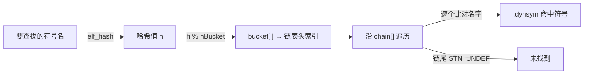
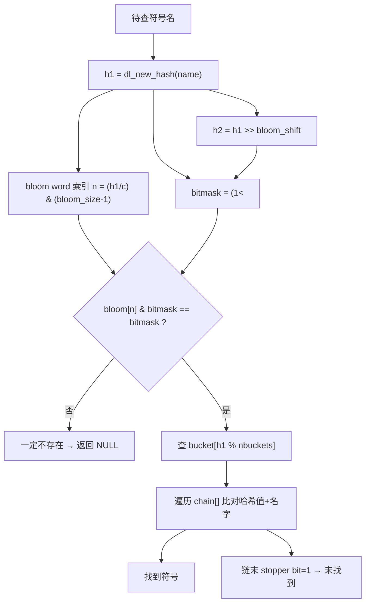

# 详解ELF文件(三十七).hash节

.hash节是ELF（Executable and Linkable Format）文件中的一个重要节区，用于存储符号哈希表。它主要用于加速动态链接过程中符号的查找，提高符号解析的效率。ELF规范定义了两种哈希节：经典的 SysV `.hash`（DT_HASH）和现代 GNU 扩展的 `.gnu.hash`（DT_GNU_HASH）。本文对两者都作深入讲解。

## 1. 基本概念和作用

.hash节的主要作用是提供一种快速查找符号的方法。在动态链接过程中，当程序需要解析外部符号时，链接器可以通过哈希表快速定位符号，而不需要遍历整个 [[15.dynsym节|.dynsym]] 符号表。

.hash节的特点包括：

- 提高符号查找效率
- 减少动态链接时间
- 支持快速符号解析

## 2. SysV .hash 节

### 2.1 数据结构

SysV `.hash` 节的内存布局是一个紧凑的线性结构，可以用以下 C 结构体描述：

```c
struct elf_hash_table {
    uint32_t nbucket;      // bucket 数组大小（桶数）
    uint32_t nchain;       // chain  数组大小（等于 .dynsym 符号总数）
    uint32_t bucket[nbucket]; // 每个桶存放链表头的 .dynsym 索引
    uint32_t chain[nchain];   // 冲突链，chain[i] 指向同 hash 的下一个符号
};
```

关键约束：

- **nchain 必须等于 .dynsym 的符号数**（含第 0 个哑符号 `STN_UNDEF`）。动态链接器通过 nchain 而不是节头来确定符号表的条目数。
- bucket[] 和 chain[] 中存储的都是 `.dynsym` 的索引（`Elf32_Word` / `Elf64_Word`，均为 32 位）。
- 特殊值 `STN_UNDEF`（0）既是链尾标志，也是 `.dynsym[0]`（保留哑条目）的索引。

```
.hash节结构示例：
哈希表头部:  nBucket: 3   nChain: 5
Bucket数组:  bucket[0]: 2   bucket[1]: 0   bucket[2]: 4
Chain数组:   chain[0]:1  chain[1]:STN_UNDEF  chain[2]:3  chain[3]:STN_UNDEF  chain[4]:STN_UNDEF
```

### 2.2 SysV elf_hash 算法

ELF 规范（System V gABI）定义了如下哈希函数，称为 `elf_hash`（又称 SysV hash）：

```c
unsigned long elf_hash(const unsigned char *name) {
    unsigned long h = 0, g;

    while (*name) {
        h = (h << 4) + *name++;          // 每个字节左移 4 位后累加
        if ((g = h & 0xf0000000))        // 取最高 4 位
            h ^= g >> 24;               // 折叠到低 8 位
        h &= ~g;                         // 清除最高 4 位，防止溢出
    }
    return h;
}
```

算法特性分析：

- 以 0 为初始值，对每个字节执行"左移4 + 累加 + 高4位折叠"操作。
- 折叠策略（`h ^= g >> 24; h &= ~g`）将高 4 位的信息混入低 8 位，防止高位溢出导致两个不同字符串映射到相同哈希值。
- 结果是 32 位无符号整数（`unsigned long` 在 ABI 中保证有效位不超过 32 位）。
- 与 djb2、FNV 相比，elf_hash 的雪崩效果较弱，这也是后来 GNU 换用更优哈希函数的原因之一。

### 2.3 完整符号查找步骤

```
1. 计算 h = elf_hash(symname)
2. 计算桶索引 i = h % nbucket
3. 取链表头 idx = bucket[i]
4. 若 idx == STN_UNDEF (0) → 未找到，返回
5. 比较 dynsym[idx].st_name 对应的字符串：
   - 若名字匹配 → 命中，返回 dynsym[idx]
   - 否则 idx = chain[idx]，回到步骤 4
```



查找的最坏时间复杂度是 O(链长)，平均取决于哈希碰撞率与 nBucket 的选取。链接器通常把 nBucket 设为接近符号数的质数以尽量均匀分布。

### 2.4 DT_HASH 动态条目

[[18.dynamic节|.dynamic]] 节中的 `DT_HASH` 条目（类型 3）保存 `.hash` 节在内存中的运行时地址（虚拟地址）。动态链接器通过 `DT_HASH` 找到哈希表，从而无需依赖节头（运行时节头已不可用）。

```text
# 示例（readelf -d 输出片段）
 0x0000000000000004 (HASH)    0x400298
```

## 3. .gnu.hash 节

### 3.1 为什么需要 .gnu.hash

SysV `.hash` 存在两个主要瓶颈：

1. **elf_hash 质量一般**：碰撞率略高，使链长分布不均。
2. **无早退机制**：查找一个不存在的符号必须遍历完整个 bucket 链，无法提前确定"一定不存在"。

GNU hash（`.gnu.hash`，也称 DT_GNU_HASH）通过以下改进大幅提速：

- 换用更优的 `dl_new_hash`（djb2 变体）函数。
- 新增 **Bloom 过滤器**（bloom filter）：可在 O(1) 时间内以极低的假阳性率排除"不存在"的符号，避免进入链表遍历。
- 要求哈希符号在 `.dynsym` 中按 `hash % nbuckets` 值**排序**，使同桶符号连续存放，提高缓存友好性。
- 用"高31位 + 末位标志位"取代 chain 链表指针，减少随机跳转。

### 3.2 .gnu.hash 节的完整结构

```c
struct gnu_hash_table {
    uint32_t nbuckets;      // 桶数
    uint32_t symoffset;     // .dynsym 中第一个被哈希符号的索引（symndx）
                            // 索引 [0, symoffset) 的符号不在哈希表内（通常是 STB_LOCAL）
    uint32_t bloom_size;    // Bloom 过滤器字数（maskwords）；必须是 2 的幂
    uint32_t bloom_shift;   // Bloom 的第二个 hash 的移位量（shift2）
    // 以下数组紧跟其后：
    uintN_t  bloom[bloom_size]; // N=32(ELF32) 或 64(ELF64)
    uint32_t buckets[nbuckets];
    uint32_t chain[];       // 长度 = dynsym_count - symoffset
};
```

各字段详解：

| 字段 | 别名 | 说明 |
|---|---|---|
| `nbuckets` | — | 哈希桶数，链接器通常按符号数的某比例选取 |
| `symoffset` | `symndx` | `.dynsym` 中第一个参与哈希的符号索引；`[0, symoffset)` 的符号（通常 STB_LOCAL）不放入哈希表 |
| `bloom_size` | `maskwords` | Bloom 过滤器数组长度，**必须是 2 的幂**，链接器据此选取掩码 `bloom_size - 1` |
| `bloom_shift` | `shift2` | 计算第二个 Bloom bit 位置时的右移量 |
| `bloom[]` | — | Bloom 过滤器位数组，32 位或 64 位 word，取决于 ELFCLASS |
| `buckets[]` | — | 每桶存放该桶第一个符号在 `.dynsym` 中的索引（0 表示空桶） |
| `chain[]` | `hashval[]` | 对应 `.dynsym[symoffset..end]` 的哈希值数组；最低位为链尾标志 |

### 3.3 dl_new_hash 算法

GNU hash 换用 djb2 变体（又名 DJB hash）：

```c
uint32_t dl_new_hash(const uint8_t *name) {
    uint32_t h = 5381;
    for (; *name; name++) {
        h = (h << 5) + h + *name;   // h = h * 33 + c
    }
    return h;
}
```

与 `elf_hash` 相比，`dl_new_hash` 的雪崩效果更好，碰撞率更低，且没有折叠操作，执行效率更高（少一次条件分支）。

### 3.4 Bloom 过滤器原理

Bloom 过滤器是一种概率型数据结构：**可以确定某个元素"一定不存在"，但无法确定"一定存在"**（有一定假阳性率）。

**插入阶段（链接器）**：对 `.dynsym` 中每个被哈希的符号名，计算：

```c
h1 = dl_new_hash(name);
h2 = h1 >> bloom_shift;               // 第二个哈希值
c  = sizeof(bloom_word) * 8;          // 每个 word 的位数（32 或 64）
n  = (h1 / c) & (bloom_size - 1);     // 选取哪个 bloom word（bloom_size 是 2 的幂）
bit1 = 1UL << (h1 % c);
bit2 = 1UL << (h2 % c);
bloom[n] |= bit1 | bit2;              // 置两个 bit
```

**查找阶段（动态链接器）**：

```c
h1 = dl_new_hash(symname);
h2 = h1 >> bloom_shift;
c  = sizeof(bloom_word) * 8;
n  = (h1 / c) & (bloom_size - 1);
bitmask = (1UL << (h1 % c)) | (1UL << (h2 % c));
if ((bloom[n] & bitmask) != bitmask)
    return NULL;    // 两个 bit 有一个为 0 → 符号肯定不存在，直接返回
// 否则可能存在，继续查 bucket/chain
```

Bloom 过滤器的核心价值：大量符号查找请求中，不存在的情况（如查找一个库根本没有导出的符号）占多数。Bloom 过滤器以极小的内存代价（几十个 word）过滤掉绝大多数"不存在"查询，性能提升非常显著。



### 3.5 chain[] 末位标志位（stopper bit）

`.gnu.hash` 的 chain 数组不再存放符号的 `.dynsym` 索引（和 SysV `.hash` 不同），而是存放每个符号哈希值的**高 31 位**，外加最低位（LSB）作为链尾标志：

```c
// 每个 chain[i] 的语义：
chain[i] = (dl_new_hash(symname[symoffset + i]) & ~1u)  // 高31位哈希
          | is_last_in_bucket;                             // LSB: 1=链尾
```

这样在遍历同桶的符号时，可以先比较哈希值（廉价的整数比较），再比较字符串（昂贵的 strcmp），并可以通过 LSB 知道链尾而无需用索引 0 哨兵。

### 3.6 符号排序要求

`.gnu.hash` 要求 `.dynsym` 中所有被哈希的符号（索引 `[symoffset, end]`）必须按 `dl_new_hash(name) % nbuckets` 值**升序排序**。同桶的符号在 `.dynsym` 中连续存放，使 chain 数组天然无洞，并改善 CPU 缓存行利用率。

### 3.7 .gnu.hash 完整查找流程

```
1. h1 = dl_new_hash(symname)
2. 查 Bloom 过滤器：若 miss → 直接返回"不存在"
3. idx = buckets[h1 % nbuckets]
4. 若 idx == 0 → 空桶，未找到
5. 循环：
   a. h_stored = chain[idx - symoffset]
   b. 若 (h_stored & ~1u) == (h1 & ~1u)（高31位匹配）
      → strcmp(dynsym[idx].name, symname)
        若相等 → 找到，返回 dynsym[idx]
   c. 若 (h_stored & 1) → 链末（stopper bit），退出循环 → 未找到
   d. idx++，继续
```

### 3.8 DT_GNU_HASH 动态条目

```text
# 示例（readelf -d 输出片段）
 0x000000006ffffef5 (GNU_HASH)    0x400298
```

类型值为 `0x6ffffef5`（DT_GNU_HASH）。动态链接器若同时看到 `DT_HASH` 和 `DT_GNU_HASH`，优先使用 `DT_GNU_HASH`。

## 4. 工作原理对比

### 4.1 SysV .hash 查找流程（简洁版）

1. 计算待查找符号名称的哈希值
2. 使用哈希值对 bucket 数组大小取模，得到 bucket 索引
3. 从 bucket 数组获取链表起始的符号索引
4. 沿 chain 数组遍历链表，比较符号名称直到命中或到达链尾（STN_UNDEF）

### 4.2 两种哈希节深度对比

| 比较维度 | .hash（SysV） | .gnu.hash（GNU） |
|---|---|---|
| 哈希函数 | `elf_hash`（碰撞率较高） | `dl_new_hash`（djb2 变体，质量更好） |
| 早退机制 | 无 | Bloom 过滤器（O(1) 排除不存在符号） |
| chain 存储内容 | `.dynsym` 符号索引 | 符号哈希高31位 + stopper LSB |
| 符号排序要求 | 无 | 必须按 `hash%nbuckets` 排序 |
| 缓存友好性 | 一般（链表跳转随机） | 好（同桶符号连续存放） |
| 本地符号 | 全部包含（nchain=全部符号数） | 只哈希全局符号（[symoffset, end]） |
| ELF32 entsize | 4 | 4 |
| ELF64 entsize | 4 | 0（bloom 为 64 位，混合 entsize） |
| 现状 | 兼容性保留 | 现代发行版默认 |
| 动态条目 | DT_HASH (3) | DT_GNU_HASH (0x6ffffef5) |

## 5. --hash-style 链接器选项

GNU ld 和 gold 支持通过 `--hash-style` 选项控制生成哪种哈希节：

```bash
ld --hash-style=sysv  # 只生成 .hash（DT_HASH），兼容旧 ld.so
ld --hash-style=gnu   # 只生成 .gnu.hash（DT_GNU_HASH），最小化体积
ld --hash-style=both  # 同时生成两者，兼顾兼容性与性能（glibc 自身使用）
```

现代 Linux 发行版（Fedora、Ubuntu 等）的 GCC 默认链接标志通常为 `--hash-style=gnu`，但 glibc 本身为了支持非 GNU ld.so 会用 `--hash-style=both`。可以通过以下命令确认：

```bash
# 查看系统 /bin/ls 使用了哪种哈希节
readelf -d /bin/ls | grep -E 'HASH'
```

## 6. 实战：查看哈希节

### 6.1 readelf 工具

```bash
readelf -x .hash a.out          # 十六进制转储 .hash 节
readelf -x .gnu.hash a.out      # 十六进制转储 .gnu.hash 节
readelf -d a.out                # .dynamic 中的 DT_HASH / DT_GNU_HASH 条目（含地址）
readelf -I a.out                # 显示哈希表直方图（bucket 利用率统计）
```

```text
# 示例输出（代表性，非本机实跑）
$ readelf -I /bin/ls
Histogram for `.gnu.hash' bucket list length (total of 13 buckets):
 Length  Number     % of total  Coverage
      0  3          ( 23.1%)
      1  5          ( 38.5%)     35.7%
      2  3          ( 23.1%)     78.6%
      3  2          ( 15.4%)    100.0%
```

`readelf -I` 输出的直方图显示了各桶的链长分布，`Coverage` 列显示了累计命中率。理想情况下大多数桶链长为 0 或 1。

### 6.2 十六进制查看 .hash

```text
# 示例输出（代表性，非本机实跑）
$ readelf -x .hash a.out
Hex dump of section '.hash':
  0x00400298 03000000 08000000 00000000 01000000 ................
  0x004002a8 02000000 00000000 03000000 04000000 ................
```

前两个 uint32 为 nbucket=3, nchain=8；后跟 bucket[3] 再跟 chain[8]。

### 6.3 解析 .gnu.hash 结构

```bash
# 用 readelf -x 查看 .gnu.hash 节原始字节，手动解析 4 字段头部
readelf -x .gnu.hash /bin/ls
```

```text
# 示例输出（代表性，非本机实跑）
$ readelf -x .gnu.hash /bin/ls
Hex dump of section '.gnu.hash':
  0x00400250 0d000000 01000000 01000000 05000000  ................
  0x00400260 00000000 00000000 00000000 00000000  ................
  ...
# 前 4 个 uint32: nbuckets=13, symoffset=1, bloom_size=1, bloom_shift=5
```

## 7. 与其他节的关系

- **与 [[15.dynsym节|.dynsym]] 节**：.hash 和 .gnu.hash 都只是 .dynsym 的索引加速结构；bucket/chain 中存储的是 .dynsym 索引
- **与 [[16.dynstr节|.dynstr]] 节**：符号名称存储在 .dynstr，哈希计算和名字比对都基于 .dynstr 中的字符串
- **与 [[18.dynamic节|.dynamic]] 节**：DT_HASH 指向 .hash 的运行时地址；DT_GNU_HASH 指向 .gnu.hash；链接器优先使用 DT_GNU_HASH

## 8. 实际意义

1. **性能优化**：.gnu.hash 的 Bloom 过滤器可将"符号不存在"的查找从 O(链长) 缩短为 O(1)，显著提高程序启动速度
2. **内存效率**：.gnu.hash 不存储本地符号（只哈希全局符号），节省 chain 数组空间
3. **缓存友好**：同桶符号在 .dynsym 中连续存放，减少 cache miss
4. **动态链接**：两种哈希节都是动态链接机制的核心组成部分

.hash节虽然对最终用户不可见，但它是动态链接机制中不可或缺的一部分。通过提供高效的符号查找机制，它大大提高了程序的启动速度和运行效率，特别是在需要链接大量共享库的复杂应用程序中。

## 相关阅读

- **被加速查找的符号表**：[[15.dynsym节]]
- **符号名来源**：[[16.dynstr节]]
- **指向它的动态条目**：[[18.dynamic节]]（DT_HASH/DT_GNU_HASH）
- 上一篇：[[36.note.ABI-tag节]] ｜ 下一篇：[[38.gnu.version节]]
