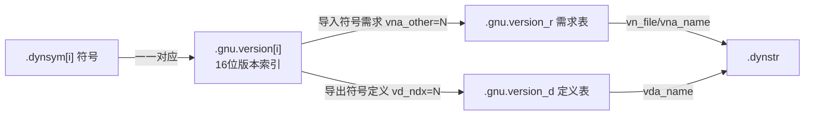

# 详解ELF文件(三十八).gnu.version节

.gnu.version节是ELF（Executable and Linkable Format）文件中的一个重要节区，用于存储符号版本信息。它是GNU工具链实现符号版本控制机制的关键组成部分，主要用于支持共享库的向后兼容性。

## 1. 基本概念和作用

.gnu.version节的主要作用是为动态符号表（[[15.dynsym节|.dynsym]] 节）中的每个符号提供版本信息。它实现了符号版本控制机制，确保程序在运行时能够使用正确的符号版本，从而实现共享库的向后兼容性。

符号版本控制的主要目的包括：

- 支持共享库的多个版本共存
- 确保程序使用编译时依赖的符号版本
- 实现向后兼容性，避免因库更新导致的程序崩溃

## 2. 数据结构

### 2.1 Elf_Versym 类型

`.gnu.version` 节的元素类型是 `Elf_Versym`，实际上是 16 位无符号整数：

```c
// ELF 规范定义
typedef Elf32_Half  Elf32_Versym;   // uint16_t，2 字节
typedef Elf64_Half  Elf64_Versym;   // uint16_t，2 字节
```

节类型为 `SHT_GNU_versym`（值 `0x6fffffff`），节头字段 `sh_link` 指向 `.dynsym` 节的节头索引，`sh_entsize` 为 2（每个条目 2 字节）。

### 2.2 节结构

.gnu.version节由一系列16位的版本索引值组成，每个值对应 .dynsym 节中的一个符号：

- 每个元素是16位的版本索引（`Elf32_Versym` / `Elf64_Versym`）
- **数组大小与 .dynsym 节中的符号数量完全相同**（包含第 0 个哑符号）
- 通过数组索引与 .dynsym 节中的符号建立一一对应关系
- 节大小 = `.dynsym` 符号数 × 2 字节

```
.gnu.version节结构示例：
版本索引数组（Elf_Versym[]）：
  [0]: 0  (*local*)         ← dynsym[0] 哑符号
  [1]: 1  (*global*)        ← 无版本的全局符号
  [2]: 3  → .gnu.version_r 条目（导入：GLIBC_2.4）
  [3]: 2  → .gnu.version_r 条目（导入：GLIBC_2.2.5）
  [4]: 4  → .gnu.version_d 条目（导出：MYLIB_1.0）
```

## 3. 版本索引含义

`.gnu.version` 节中每个 16 位值（`Elf_Versym`）的含义分为以下几类：

### 3.1 特殊保留值

| 值 | 符号常量 | 含义 |
|---|---|---|
| 0 | `VER_NDX_LOCAL` | 本地符号（STB_LOCAL），不参与版本控制，对外不可见 |
| 1 | `VER_NDX_GLOBAL` | 全局符号，无版本标注（使用默认/基础版本） |

### 3.2 版本引用索引（值 ≥ 2）

- 对于**导入符号**（`STB_UNDEF`）：索引指向 [[39.gnu.version_r节|.gnu.version_r]] 中某个 `Vernaux.vna_other` 字段相等的条目。
- 对于**导出符号**（有定义的全局符号）：索引指向 [[40.gnu.version_d节|.gnu.version_d]] 中某个 `Verdef.vd_ndx` 字段相等的条目。

### 3.3 高位 HIDDEN 标志（0x8000）

`Elf_Versym` 的最高位（bit 15）具有特殊含义，称为 **HIDDEN 标志**：

```c
#define VERSYM_VERSION  0x7fff   // 低 15 位：实际版本索引
#define VERSYM_HIDDEN   0x8000   // 最高位：隐藏标志
```

若 bit 15 置 1，则该符号是非默认版本（即 `foo@VER` 而非 `foo@@VER`）。动态链接器在版本匹配时提取低 15 位作为实际索引：

```c
// glibc dl-version.c 内部处理
Elf_Versym versym = versym_arr[sym_idx];
uint16_t   ndx    = versym & VERSYM_VERSION;   // 低15位：版本索引
bool       hidden = versym & VERSYM_HIDDEN;    // 最高位：是否隐藏
```

这意味着理论上版本索引的有效范围是 0–32767（0x7fff），实际使用通常远小于此。

### 3.4 版本索引的完整语义表

```
Versym 值         含义
─────────────────────────────────────────────────────
0x0000            VER_NDX_LOCAL  → 本地符号，不可外部访问
0x0001            VER_NDX_GLOBAL → 全局符号，无显式版本
0x0002–0x7fff     版本索引 N → 查 .gnu.version_r 或 .gnu.version_d
0x8000            0x8000|0 = HIDDEN LOCAL（少见）
0x8002–0xffff     0x8000|N = 非默认版本（foo@VER，隐藏版本）
```

## 4. 结构图示

.gnu.version 是一座桥：把 .dynsym 的每个符号与"需求/定义"两张版本表关联起来：



## 5. DT_VERSYM 动态条目

[[18.dynamic节|.dynamic]] 节中用 `DT_VERSYM`（类型 `0x6ffffff0`）条目指向 `.gnu.version` 节在内存中的运行时地址。动态链接器通过此条目定位版本索引数组：

```text
# 示例（readelf -d 输出片段）
 0x000000006ffffff0 (VERSYM)    0x4006b8
```

无 `DT_VERSYM` 时，意味着二进制文件不使用符号版本控制，动态链接器不做版本匹配检查。

## 6. 符号版本表示法

### 6.1 两种 @ 符号的含义

在符号版本控制中，符号可以有以下表示法：

| 表示法 | 含义 | Elf_Versym bit 15 |
|---|---|---|
| `foo` | 无版本符号 | — |
| `foo@VER` | 非默认（旧/兼容）版本；静态链接不绑定到此版本 | bit 15 = 1（HIDDEN） |
| `foo@@VER` | 默认版本；静态链接绑定到此版本；一个符号只能有一个 `@@` | bit 15 = 0 |

### 6.2 汇编器 .symver 指令

`.symver` 汇编器指令用于在 `.o` 文件中直接给符号打版本标签，让链接器将其放入对应版本节点：

```c
// 在 C 文件里内嵌汇编，定义多版本实现
__asm__(".symver foo_v1, foo@MYLIB_1.0");    // 非默认旧版本
__asm__(".symver foo_v2, foo@@MYLIB_2.0");   // 默认新版本（@@）

int foo_v1(void) { return 1; }   // MYLIB_1.0 版本实现
int foo_v2(void) { return 2; }   // MYLIB_2.0 版本实现（默认）
```

链接时同时提供版本脚本（version script）：

```
# mylib.map
MYLIB_2.0 {
    global: foo;
    local: *;
};
MYLIB_1.0 {
    global: foo;
};
```

编译命令：

```bash
gcc -shared -Wl,--version-script=mylib.map -o libmylib.so mylib.o
```

### 6.3 glibc memcpy 的多版本实现

glibc 是符号版本控制最典型的使用案例。以 `memcpy` 为例：

- `memcpy@GLIBC_2.2.5`：glibc 2.2.5 时代的实现，历史兼容版本（HIDDEN）
- `memcpy@@GLIBC_2.14`：glibc 2.14 引入的新实现（带 SSE 优化），默认版本

编译于旧环境的程序会在其 `.gnu.version_r` 中记录 `GLIBC_2.2.5` 需求，运行于新 glibc 时仍会绑定到 `memcpy@GLIBC_2.2.5`，不会因接口语义变化而崩溃。

## 7. 与其他节的关系

### 与 [[15.dynsym节|.dynsym]] 节

- .gnu.version 中的每个元素对应 .dynsym 中的一个符号，通过索引位置一一对应
- 节头 `sh_link` 字段即指向 .dynsym 的节头索引

### 与 [[39.gnu.version_r节|.gnu.version_r]] 节

- 包含程序依赖的外部符号版本定义；.gnu.version 中的索引（低 15 位）与该节 `Vernaux.vna_other` 对应

### 与 [[40.gnu.version_d节|.gnu.version_d]] 节

- 包含本模块定义的符号版本；.gnu.version 中的索引（低 15 位）与该节 `Verdef.vd_ndx` 对应

## 8. 工作原理

1. 程序编译时，链接器为每个动态符号分配版本信息
2. 版本信息存储在 .gnu.version 节中，与 .dynsym 节中的符号一一对应
3. 程序运行时，动态链接器读取 `DT_VERSYM` 找到 .gnu.version 数组
4. 对于每个待解析符号，取其 `Elf_Versym`（低 15 位为版本索引）
5. 到 .gnu.version_r（需求方）或 .gnu.version_d（提供方）中查找对应版本定义
6. 比较版本名称（`vna_name` / `vda_name`），确保运行时库提供了所需版本
7. 版本不匹配且非 `VER_FLG_WEAK` 时，动态链接器报错退出

## 9. 实战：查看 .gnu.version

```bash
readelf -V a.out            # 显示全部版本节（version/version_r/version_d）
readelf --version-info a.out # 同上，长格式
objdump -T a.out             # 显示动态符号表，含版本标注（如 GLIBC_2.2.5）
```

```text
# 示例输出（代表性，非本机实跑）
$ readelf -V /bin/ls
Version symbols section '.gnu.version' contains 203 entries:
 Addr: 0x400286  Offset: 000286  Link: 5 (.dynsym)
  000:   0 (*local*)    1 (*global*)   2 (GLIBC_2.2.5)   3 (GLIBC_2.3)
  004:   4 (GLIBC_2.4)  1 (*global*)   1 (*global*)      2 (GLIBC_2.2.5)
```

每个条目正对应同位置的 .dynsym 符号——这就是"一一对应"的直观体现。

```text
# 示例输出（代表性，非本机实跑）
# objdump -T 可显示每个动态符号的版本字符串
$ objdump -T /bin/ls | head -20
/bin/ls:     file format elf64-x86-64

DYNAMIC SYMBOL TABLE:
0000000000000000      DF *UND*  0000000000000000  GLIBC_2.2.5 free
0000000000000000      DF *UND*  0000000000000000  GLIBC_2.4   dcgettext
0000000000000000      DF *UND*  0000000000000000  GLIBC_2.2.5 __cxa_finalize
```

`GLIBC_2.2.5`、`GLIBC_2.4` 等字符串即来自 `.gnu.version_r` 中的版本名称（`vna_name`）。

## 10. 实际意义

- **向后兼容性**：允许新版本库支持旧版本程序
- **版本管理**：提供细粒度的符号版本控制，支持库的渐进式更新
- **错误预防**：防止符号版本不匹配导致的运行时错误

.gnu.version节是GNU工具链实现符号版本控制的核心机制，通过为每个动态符号提供版本信息，它确保了程序在运行时能够使用正确的符号版本，从而实现了共享库的向后兼容性和稳定运行。

## 相关阅读

- **对应的符号表**：[[15.dynsym节]]
- **版本需求（导入）**：[[39.gnu.version_r节]]
- **版本定义（导出）**：[[40.gnu.version_d节]]
- 上一篇：[[37.hash节]] ｜ 下一篇：[[39.gnu.version_r节]]
