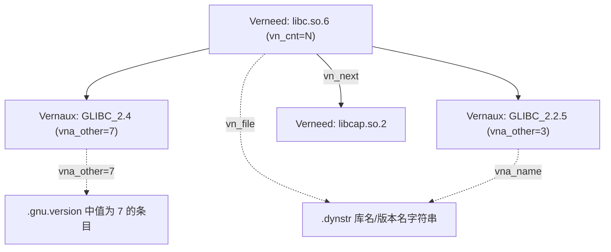

# 详解ELF文件(三十九).gnu.version_r节

.gnu.version_r节是ELF（Executable and Linkable Format）文件中的一个重要节区，全称是"Version Needs"（版本需求）。它是GNU工具链实现符号版本控制机制的关键组成部分，主要用于描述程序运行时所依赖的外部库的版本需求。

## 1. 基本概念和作用

.gnu.version_r节的主要作用是记录程序运行时所依赖的外部共享库及其所需的版本信息。它与 [[38.gnu.version节|.gnu.version]] 节和 [[40.gnu.version_d节|.gnu.version_d]] 节共同构成了GNU符号版本控制系统：

- [[38.gnu.version节|.gnu.version]]：为每个动态符号指定版本索引
- [[40.gnu.version_d节|.gnu.version_d]]：定义本模块提供的符号版本（导出）
- **.gnu.version_r：定义本模块依赖的外部符号版本（导入）**

`.gnu.version_r` 节只存在于**使用者侧**（可执行文件或共享库），而 `.gnu.version_d` 只存在于**提供者侧**（共享库）。一个共享库同时使用其他库时，两者都可以出现。

.gnu.version_r节使得程序能够明确指定它需要哪些外部库的哪些版本，从而确保程序在运行时能够正确链接到兼容的库版本。

## 2. 节的基本属性

| 属性 | 值 |
|---|---|
| 节类型（sh_type） | `SHT_GNU_verneed`（`0x6ffffffe`） |
| sh_link | 指向 `.dynstr` 节的节头索引 |
| sh_info | Verneed 条目总数（即依赖的库数量） |
| sh_entsize | 0（变长链表，无固定条目大小） |
| 动态条目 | `DT_VERNEED` + `DT_VERNEEDNUM` |

## 3. 数据结构

.gnu.version_r节由一系列版本需求条目组成，每个条目描述一个依赖的共享库（Verneed），其下挂若干具体版本（Vernaux）。所有字段均以小端字节序存储（x86/x86-64）。

### 3.1 版本需求头结构（Elf32_Verneed / Elf64_Verneed）

```c
typedef struct {
    Elf32_Half  vn_version;  // 结构版本号，当前固定为 1
    Elf32_Half  vn_cnt;      // 紧随其后的 Vernaux 条目数
    Elf32_Word  vn_file;     // 库文件名在 .dynstr 中的字节偏移
    Elf32_Word  vn_aux;      // 第一个 Vernaux 相对本 Verneed 起始的字节偏移
    Elf32_Word  vn_next;     // 下一个 Verneed 相对本 Verneed 起始的字节偏移；0 表示链末
} Elf32_Verneed;             // 大小：16 字节（ELF32 与 ELF64 相同）
```

各字段详解：

| 字段 | 大小 | 说明 |
|---|---|---|
| `vn_version` | 2 字节 | 当前必须为 1；未来版本格式变化时会更新 |
| `vn_cnt` | 2 字节 | 本 Verneed 下 Vernaux 的数量（即该库有多少个所需版本） |
| `vn_file` | 4 字节 | `.dynstr` 中库 SONAME 字符串的字节偏移（对应 `DT_NEEDED` 中的库名） |
| `vn_aux` | 4 字节 | 相对本结构起始地址的偏移，指向第一个 `Vernaux`；通常为 16（紧跟其后） |
| `vn_next` | 4 字节 | 相对本结构起始地址的偏移，指向下一个 `Verneed`；**0 表示链表结束** |

### 3.2 版本需求辅助结构（Elf32_Vernaux / Elf64_Vernaux）

```c
typedef struct {
    Elf32_Word  vna_hash;    // 版本名称的 ELF 哈希值（elf_hash 计算）
    Elf32_Half  vna_flags;   // 标志位（VER_FLG_WEAK 等）
    Elf32_Half  vna_other;   // 版本索引（与 .gnu.version 中的值对应）；高位可含 HIDDEN 标志
    Elf32_Word  vna_name;    // 版本名字符串在 .dynstr 中的字节偏移
    Elf32_Word  vna_next;    // 下一个 Vernaux 相对本 Vernaux 起始的字节偏移；0 表示链末
} Elf32_Vernaux;             // 大小：16 字节（ELF32 与 ELF64 相同）
```

各字段详解：

| 字段 | 大小 | 说明 |
|---|---|---|
| `vna_hash` | 4 字节 | `elf_hash(version_name)` 的哈希值，供动态链接器快速比对（先比 hash 再比字符串） |
| `vna_flags` | 2 字节 | 标志位；`VER_FLG_WEAK`(2) 表示弱版本需求，找不到时只警告不退出 |
| `vna_other` | 2 字节 | 版本索引 N（低 15 位）；与 `.gnu.version[i] & 0x7fff` 对应。高位 `0x8000` 为 HIDDEN 标志 |
| `vna_name` | 4 字节 | `.dynstr` 中版本名（如 `GLIBC_2.2.5`）的字节偏移 |
| `vna_next` | 4 字节 | 相对本结构起始地址的偏移，指向同一 Verneed 下一个 Vernaux；0 表示链末 |

### 3.3 vna_flags 标志位

```c
#define VER_FLG_BASE  0x1   // 基础版本（通常不出现在 Vernaux，只出现在 Verdef）
#define VER_FLG_WEAK  0x2   // 弱版本需求：若目标库缺少此版本，只告警，不终止加载
```

`VER_FLG_WEAK` 在 `Vernaux` 中的实际使用场景：链接时显式指定了一个未必存在的版本需求（如可选特性）。常见于 glibc 自身在跨平台编译时兼容不同 ABI 版本的处理。

## 4. 结构图示

一个 Verneed（一个库）下挂多个 Vernaux（该库的多个版本需求）；`vna_other` 回连 .gnu.version 的索引：



## 5. DT_VERNEED / DT_VERNEEDNUM 动态条目

[[18.dynamic节|.dynamic]] 节中通过两个条目描述 `.gnu.version_r`：

| 条目 | 类型值 | 含义 |
|---|---|---|
| `DT_VERNEED` | `0x6ffffffe` | `.gnu.version_r` 节的运行时虚拟地址 |
| `DT_VERNEEDNUM` | `0x6fffffff` | Verneed 链表中的条目总数 |

动态链接器通过 `DT_VERNEED` 找到链表起始地址，通过 `DT_VERNEEDNUM` 知道有多少个 Verneed 条目需要遍历。

```text
# 示例（readelf -d 输出片段）
 0x000000006ffffffe (VERNEED)    0x4002e4
 0x000000006fffffff (VERNEEDNUM) 0x2
```

## 6. 链表遍历算法

动态链接器遍历 `.gnu.version_r` 的伪代码如下：

```c
// 从 DT_VERNEED 获取起始地址
Verneed *vn = (Verneed *) (base + verneed_addr);

for (int i = 0; i < verneednum; i++) {
    // vn_file 是 .dynstr 中库名的偏移
    const char *libname = dynstr + vn->vn_file;

    // 找到系统中已加载的对应库（通过 DT_NEEDED 已加载）
    struct link_map *dep = find_library(libname);

    // 遍历该库的所有版本需求
    Vernaux *va = (Vernaux *)((char *)vn + vn->vn_aux);
    for (int j = 0; j < vn->vn_cnt; j++) {
        const char *version_name = dynstr + va->vna_name;
        uint16_t    ndx          = va->vna_other & 0x7fff;

        // 在 dep（依赖库）的 .gnu.version_d 中查找对应版本
        bool found = check_version_in_dep(dep, version_name, va->vna_hash);
        if (!found) {
            if (va->vna_flags & VER_FLG_WEAK) {
                warn("version `%s' not found (weak)", version_name);
            } else {
                fatal("version `%s' not found (required by %s)", version_name, libname);
            }
        }

        // 前进到下一个 Vernaux
        if (va->vna_next == 0) break;
        va = (Vernaux *)((char *)va + va->vna_next);
    }

    // 前进到下一个 Verneed
    if (vn->vn_next == 0) break;
    vn = (Verneed *)((char *)vn + vn->vn_next);
}
```

关键点：

1. 遍历基于**相对偏移**（`vn_next`/`vna_next`）而非绝对指针，因此节可以放在任意地址。
2. 版本比较先用 `vna_hash`（elf_hash 值）快速过滤，再用字符串 `strcmp` 确认。
3. `vna_other`（版本索引）用于与 `.gnu.version[sym_idx] & 0x7fff` 对应，建立"符号 → 版本"的反向映射。

## 7. 工作原理

1. 程序编译链接时，链接器分析程序依赖的外部符号及其版本
2. 将这些版本需求信息存储在 .gnu.version_r 节中
3. 程序运行时，动态链接器读取 .gnu.version_r 节
4. 根据其中的信息检查系统中是否存在满足需求的库版本
5. 如果找不到合适的版本，则报告版本不匹配错误

## 8. 实战：查看 .gnu.version_r

```bash
readelf -V a.out            # 版本需求出现在 "Version needs section"
readelf --version-info a.out # 同上，长格式
```

```text
# 示例输出（代表性，非本机实跑）
$ readelf -V /bin/ls
Version needs section '.gnu.version_r' contains 2 entries:
 Addr: 0x4002e4  Offset: 0002e4  Link: 6 (.dynstr)
  000000: Version: 1  File: libcap.so.2  Count: 1
  0x0010:   Name: CAP_2.25  Flags: none  Version: 4
  0x0020: Version: 1  File: libc.so.6  Count: 14
  0x0030:   Name: GLIBC_2.4   Flags: none  Version: 7
  0x0040:   Name: GLIBC_2.3.4 Flags: none  Version: 6
  0x0050:   Name: GLIBC_2.3   Flags: none  Version: 5
  0x0060:   Name: GLIBC_2.2.5 Flags: none  Version: 3
```

字段含义：

- `File:` = `Verneed.vn_file` → `.dynstr` 中的库 SONAME
- `Count:` = `Verneed.vn_cnt` → 该库下有多少个 Vernaux
- `Name:` = `Vernaux.vna_name` → `.dynstr` 中的版本名
- `Flags:` = `Vernaux.vna_flags`（none / weak）
- `Version:` = `Vernaux.vna_other & 0x7fff`（版本索引 N）

`File:` 即 Verneed.vn_file（库名），`Name:` 即 Vernaux.vna_name（所需版本），都取自 [[16.dynstr节|.dynstr]]。

## 9. 与其他节的关系

- **与 [[16.dynstr节|.dynstr]] 节**：vn_file 和 vna_name 字段指向 .dynstr 中的字符串
- **与 [[38.gnu.version节|.gnu.version]] 节**：vna_other 字段（低 15 位）与 .gnu.version 中的版本索引关联；通过 ndx = `versym[i] & 0x7fff` 来匹配
- **与 [[18.dynamic节|.dynamic]] 节**：DT_VERNEED / DT_VERNEEDNUM 指向本节
- **与 [[40.gnu.version_d节|.gnu.version_d]] 节**：动态链接器在依赖库的 .gnu.version_d 中查找 Vernaux.vna_name 对应的 Verdef，完成版本兼容性验证
- **与动态链接器**：用本节信息验证依赖库的版本兼容性

## 10. 实际意义与常见问题

- **兼容性检查**：确保运行时依赖的库版本满足要求
- **错误诊断**：版本不匹配时给出明确信息

### 10.1 版本不匹配错误

当出现类似以下错误时，通常与本节相关：

```
/lib/x86_64-linux-gnu/libc.so.6: version `GLIBC_2.14' not found (required by ./a.out)
```

错误的完整含义：

- `a.out` 的 `.gnu.version_r` 中记录了对 `libc.so.6` 中 `GLIBC_2.14` 版本的需求
- 当前系统的 `libc.so.6` 的 `.gnu.version_d` 中没有 `GLIBC_2.14` 这个版本定义（glibc 版本太旧）

### 10.2 排查方法

```bash
# 查看程序需要哪些版本
readelf -V ./a.out | grep "Version needs" -A 999

# 查看系统库提供哪些版本
readelf -V /lib/x86_64-linux-gnu/libc.so.6 | grep "Version def" -A 999

# 查看具体符号绑定的版本
objdump -T ./a.out | grep GLIBC

# 找出是哪个目标文件引入了高版本需求（常见原因：用了 memcpy 等 GLIBC_2.14 符号）
objdump -T ./a.out | grep "GLIBC_2.14"
```

### 10.3 降版本编译

若需在旧 glibc 上运行，可以在链接时手动降低版本绑定：

```c
// 强制使用 GLIBC_2.2.5 版本的 memcpy（适用于发行版打包场景）
__asm__(".symver memcpy, memcpy@GLIBC_2.2.5");
```

或者使用 `--wrap` 选项或编译环境隔离（sysroot / musl libc 等）。

.gnu.version_r节是GNU符号版本控制系统的重要组成部分，它通过明确记录程序对外部库版本的需求，确保了程序在不同系统环境下的兼容性和稳定性。

## 相关阅读

- **版本索引数组**：[[38.gnu.version节]]
- **版本定义（导出，对偶）**：[[40.gnu.version_d节]]
- **字符串与驱动**：[[16.dynstr节]]、[[18.dynamic节]]
- 上一篇：[[38.gnu.version节]] ｜ 下一篇：[[40.gnu.version_d节]]
