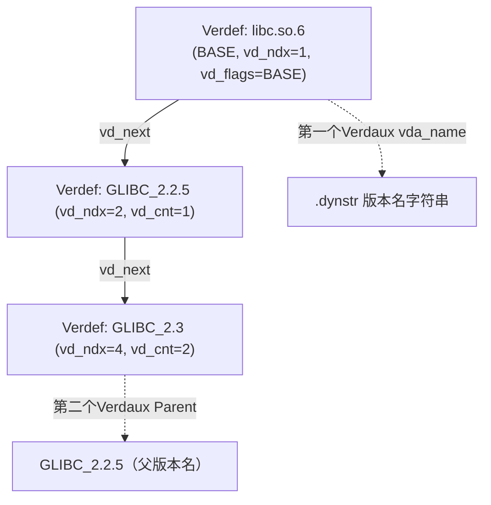
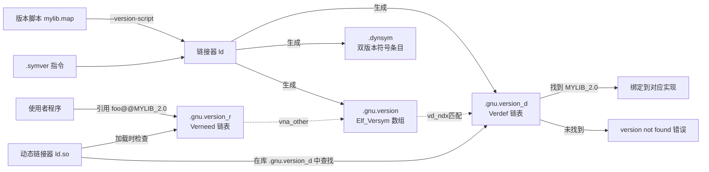

# 详解ELF文件(四十).gnu.version_d节

.gnu.version_d节是ELF（Executable and Linkable Format）文件中的一个重要节区，全称是"Version Definition"（版本定义）。它是GNU工具链实现符号版本控制机制的关键组成部分，主要用于定义共享库自身提供的符号版本信息。

## 1. 基本概念和作用

.gnu.version_d节的主要作用是记录共享库自身定义的符号版本信息。它与 [[38.gnu.version节|.gnu.version]] 节和 [[39.gnu.version_r节|.gnu.version_r]] 节共同构成了GNU符号版本控制系统：

- [[38.gnu.version节|.gnu.version]]：为每个动态符号指定版本索引
- **.gnu.version_d：定义本模块提供的符号版本（导出）**
- [[39.gnu.version_r节|.gnu.version_r]]：定义本模块依赖的外部符号版本（导入）

`.gnu.version_d` 节通常**只出现在共享库（.so）**中，可执行文件一般没有（除非用版本脚本显式导出版本定义）。`.gnu.version_r` 则是使用者侧的版本需求。

.gnu.version_d节使得共享库能够提供多个版本的符号实现，确保向后兼容性并支持库的渐进式更新。

## 2. 节的基本属性

| 属性 | 值 |
|---|---|
| 节类型（sh_type） | `SHT_GNU_verdef`（`0x6ffffffd`） |
| sh_link | 指向 `.dynstr` 节的节头索引 |
| sh_info | Verdef 条目总数（即本模块定义了多少个版本） |
| sh_entsize | 0（变长链表，无固定条目大小） |
| 动态条目 | `DT_VERDEF` + `DT_VERDEFNUM` |

## 3. 数据结构

.gnu.version_d节由一系列版本定义条目组成，每个条目（Verdef）描述一个版本，其下挂辅助条目（Verdaux）记录版本名与父版本。

### 3.1 版本定义结构（Elf32_Verdef / Elf64_Verdef）

```c
typedef struct {
    Elf32_Half  vd_version;  // 结构版本号，当前固定为 1
    Elf32_Half  vd_flags;    // 标志位（VER_FLG_BASE / VER_FLG_WEAK）
    Elf32_Half  vd_ndx;      // 版本索引（与 .gnu.version 中的 Elf_Versym 对应）
    Elf32_Half  vd_cnt;      // 紧随其后的 Verdaux 条目数（含父版本）
    Elf32_Word  vd_hash;     // 版本名称的 elf_hash 值（快速比较用）
    Elf32_Word  vd_aux;      // 第一个 Verdaux 相对本 Verdef 起始的字节偏移
    Elf32_Word  vd_next;     // 下一个 Verdef 相对本 Verdef 起始的字节偏移；0 表示链末
} Elf32_Verdef;              // 大小：20 字节（ELF32 与 ELF64 相同）
```

各字段详解：

| 字段 | 大小 | 说明 |
|---|---|---|
| `vd_version` | 2 字节 | 当前必须为 1 |
| `vd_flags` | 2 字节 | 见 3.3 节标志位说明 |
| `vd_ndx` | 2 字节 | 本版本的索引 N（低 15 位有效），与 `.gnu.version[i] & 0x7fff` 对应。**N=1 保留给 BASE 版本**，用户定义从 2 开始 |
| `vd_cnt` | 2 字节 | 本 Verdef 后 Verdaux 的数量：第 1 个是版本自身名称，第 2 个起是父版本（Parent） |
| `vd_hash` | 4 字节 | `elf_hash(version_name)` 的值，动态链接器可先比哈希再比字符串，加速匹配 |
| `vd_aux` | 4 字节 | 相对本结构起始地址的偏移，指向第一个 `Verdaux`；通常为 20（紧跟其后） |
| `vd_next` | 4 字节 | 相对本结构起始地址的偏移，指向下一个 `Verdef`；**0 表示链表结束** |

### 3.2 版本辅助结构（Elf32_Verdaux / Elf64_Verdaux）

```c
typedef struct {
    Elf32_Word  vda_name;    // 版本名称字符串在 .dynstr 中的字节偏移
    Elf32_Word  vda_next;    // 下一个 Verdaux 相对本 Verdaux 起始的字节偏移；0 表示链末
} Elf32_Verdaux;             // 大小：8 字节（ELF32 与 ELF64 相同）
```

各字段详解：

| 字段 | 大小 | 说明 |
|---|---|---|
| `vda_name` | 4 字节 | `.dynstr` 中版本名称（如 `GLIBC_2.2.5`）或库 SONAME（如 `libc.so.6`，BASE 版本）的字节偏移 |
| `vda_next` | 4 字节 | 相对本结构的偏移，指向同一 Verdef 下的下一个 Verdaux（父版本）；0 表示没有更多父版本 |

**Verdaux 的语义**：

- **第一个 Verdaux**（`vd_aux` 指向）：版本自身的名称（如 `GLIBC_2.3`）
- **后续 Verdaux**（通过 `vda_next` 链接）：父版本名称，体现版本继承关系（如 `GLIBC_2.3` 继承自 `GLIBC_2.2.6`）

### 3.3 vd_flags 标志位含义

| 标志常量 | 值 | 含义 |
|---|---|---|
| `VER_FLG_BASE` | `0x1` | 基础版本：表示库文件名本身（SONAME），每个共享库必须有且仅有一个 BASE 版本，索引固定为 1（`VD_NDX_GLOBAL`） |
| `VER_FLG_WEAK` | `0x2` | 弱版本定义：提示动态链接器此版本是可选的，外部引用此版本失败时不致命 |

`VER_FLG_BASE` 的版本条目不对应任何实际符号版本，它代表"库本身"，用于表示模块标识。例如 `libc.so.6` 的 BASE Verdef 的 `vda_name` 指向字符串 `"libc.so.6"`。

## 4. 版本索引

`vd_ndx` 字段定义了版本索引，这些索引在以下地方被引用：

- [[38.gnu.version节|.gnu.version]] 节中的 `Elf_Versym`（低 15 位）
- [[39.gnu.version_r节|.gnu.version_r]] 节中的 `Vernaux.vna_other`（低 15 位）—— 其他模块引用本库时，其 vna_other 值来自本节的 vd_ndx

索引分配规则：

- `vd_ndx = 1`：保留给 BASE 版本（VER_FLG_BASE），对应 `VER_NDX_GLOBAL`
- `vd_ndx >= 2`：用户定义的版本，链接器按出现顺序分配

## 5. 结构图示

每个 Verdef 是一个版本，通过 Parent（也是一条 Verdaux）形成继承链，使新版本兼容旧版本：



## 6. 版本继承机制（Parent）

`.gnu.version_d` 通过 Parent Verdaux 实现版本的继承树，使动态链接器知道版本之间的兼容关系。

版本继承的规则：

- 若程序请求的是旧版本（如 `GLIBC_2.2.5`），而库定义了更新版本（如 `GLIBC_2.4`，且 `GLIBC_2.4` 的 Parent 链包含 `GLIBC_2.2.5`），则认为库满足需求。
- 继承树通过 Verdaux 链表表达：每个 Verdef 的第一个 Verdaux 是自身名，后续 Verdaux 是父版本名（可有多个父版本）。

glibc 的完整版本继承树示例（简化）：

```
GLIBC_2.5
  └─ Parent: GLIBC_2.4
       └─ Parent: GLIBC_2.3.4
            └─ Parent: GLIBC_2.3
                 └─ Parent: GLIBC_2.2.6
                      └─ Parent: GLIBC_2.2.5
```

这种树形结构意味着：声明依赖 `GLIBC_2.2.5` 的旧程序在任何提供了 `GLIBC_2.x`（x ≥ 2.2.5）的系统上都能找到匹配的版本。

```text
# 示例输出（代表性，非本机实跑）
# glibc 中 readelf -V 的版本继承示例
$ readelf -V /lib/x86_64-linux-gnu/libc.so.6
Version definition section '.gnu.version_d' contains 35 entries:
 Addr: 0x1473c  Offset: 0x01473c  Link: 5 (.dynstr)
  000000: Rev: 1  Flags: BASE  Index: 1  Cnt: 1  Name: libc.so.6
  0x001c: Rev: 1  Flags: none  Index: 2  Cnt: 1  Name: GLIBC_2.2.5
  0x0038: Rev: 1  Flags: none  Index: 3  Cnt: 2  Name: GLIBC_2.2.6
  0x0054:   Parent 1: GLIBC_2.2.5
  0x005c: Rev: 1  Flags: none  Index: 4  Cnt: 2  Name: GLIBC_2.3
  0x0078:   Parent 1: GLIBC_2.2.6
```

## 7. 链表遍历算法

动态链接器在验证版本时，会遍历目标库的 `.gnu.version_d` 来查找需求方（`.gnu.version_r`）所声明的版本是否存在：

```c
// from DT_VERDEF obtain start address
Verdef *vd = (Verdef *)(base + verdef_addr);

for (int i = 0; i < verdefnum; i++) {
    // 第一个 Verdaux 存版本名
    Verdaux *da = (Verdaux *)((char *)vd + vd->vd_aux);
    const char *vd_name = dynstr + da->vda_name;

    // 快速匹配：先比 hash，再比字符串
    if (vd->vd_hash == wanted_hash &&
        strcmp(vd_name, wanted_version) == 0) {
        return vd->vd_ndx;   // 找到，返回版本索引
    }

    // 下一个 Verdef
    if (vd->vd_next == 0) break;
    vd = (Verdef *)((char *)vd + vd->vd_next);
}
return -1;   // 未找到
```

注意：Parent 版本（后续 Verdaux）仅用于表达继承关系，动态链接器遍历时一般不递归进 Parent，而是按需求方（Verneed）的版本名直接比对每个 Verdef 的主名称。

## 8. 工作原理

1. 共享库编译时，编译器根据版本脚本（version script）生成版本定义信息
2. 链接器将这些信息存储在 .gnu.version_d 节中
3. 程序使用该共享库时，动态链接器读取 .gnu.version_d 节
4. 根据版本信息正确解析符号引用

## 9. DT_VERDEF / DT_VERDEFNUM 动态条目

[[18.dynamic节|.dynamic]] 节中通过两个条目描述 `.gnu.version_d`：

| 条目 | 类型值 | 含义 |
|---|---|---|
| `DT_VERDEF` | `0x6ffffffc` | `.gnu.version_d` 节的运行时虚拟地址 |
| `DT_VERDEFNUM` | `0x6ffffffd` | Verdef 链表中的条目总数 |

```text
# 示例（readelf -d 输出片段）
 0x000000006ffffffc (VERDEF)    0x1473c
 0x000000006ffffffd (VERDEFNUM) 0x23
```

## 10. 版本脚本与 .symver 的配合

### 10.1 版本脚本（version script）

链接器通过**版本脚本**（`--version-script=xxx.map`）生成 `.gnu.version_d` 节。版本脚本语法示例：

```ld
# mylib.map
MYLIB_2.0 {
    global:
        foo;        # 导出为 MYLIB_2.0 版本（默认版本，@@）
        bar;
    local:
        *;          # 其余符号设为本地（不导出）
};

MYLIB_1.0 {
    global:
        foo;        # 保留旧版本 foo@MYLIB_1.0（兼容性）
};
```

此版本脚本生成两个 Verdef 条目：`MYLIB_2.0`（vd_ndx=2）和 `MYLIB_1.0`（vd_ndx=3），加上 BASE 版本（vd_ndx=1）。

链接命令：

```bash
gcc -shared -Wl,--version-script=mylib.map -o libmylib.so.2 mylib.o
```

### 10.2 .symver 汇编指令与版本定义的关系

在 C 源文件中，用 `.symver` 指令把具体实现函数绑定到特定版本节点：

```c
// 旧版本实现（保留兼容性）
__asm__(".symver foo_old, foo@MYLIB_1.0");
int foo_old(void) { return 42; }

// 新版本实现（默认版本）
__asm__(".symver foo_new, foo@@MYLIB_2.0");
int foo_new(void) { return 100; }
```

最终 `.dynsym` 中会有两个 `foo` 符号：
- `foo@MYLIB_1.0`（HIDDEN bit 置 1，非默认）
- `foo@@MYLIB_2.0`（HIDDEN bit 为 0，默认）

`.gnu.version` 中对应条目分别为 `0x8003`（`0x8000 | 3`）和 `0x0002`（`2`）。

### 10.3 glibc 的版本定义实践

glibc 拥有复杂的版本继承树，每新增一批接口就创建一个新 Verdef 并继承上一个。以 `memcpy` 为例（简化）：

```
GLIBC_2.14  { memcpy; }   // 新版本（SSE2 优化），默认版本
GLIBC_2.2.5 { memcpy; }   // 旧版本（兼容性保留）
```

动态链接器在 glibc 的 `.gnu.version_d` 中可以同时看到两个 `memcpy` 的版本定义，根据调用方的 `.gnu.version_r` 声明决定绑定到哪个实现。

## 11. 实战：查看 .gnu.version_d

```bash
readelf -V /lib/x86_64-linux-gnu/libc.so.6   # 版本定义出现在共享库中
readelf --version-info /lib/x86_64-linux-gnu/libc.so.6
```

```text
# 示例输出（代表性，非本机实跑）
Version definition section '.gnu.version_d' contains 35 entries:
 Addr: 0x1473c  Offset: 0x01473c  Link: 5 (.dynstr)
  000000: Rev: 1  Flags: BASE  Index: 1  Cnt: 1  Name: libc.so.6
  0x001c: Rev: 1  Flags: none  Index: 2  Cnt: 1  Name: GLIBC_2.2.5
  0x0038: Rev: 1  Flags: none  Index: 3  Cnt: 2  Name: GLIBC_2.2.6
  0x0054:   Parent 1: GLIBC_2.2.5
  0x005c: Rev: 1  Flags: none  Index: 4  Cnt: 2  Name: GLIBC_2.3
  0x0078:   Parent 1: GLIBC_2.2.6
```

`Flags: BASE` 的就是基础版本（库名本身）；`Parent` 行体现继承关系。

```bash
# 查看自定义共享库的版本定义
objdump -T libmylib.so | grep "@"   # 显示带版本的符号导出
```

```text
# 示例输出（代表性，非本机实跑）
$ objdump -T libmylib.so
libmylib.so:     file format elf64-x86-64

DYNAMIC SYMBOL TABLE:
0000000000001139 g    DF .text  0000000000000009  MYLIB_1.0   foo
0000000000001142 g    DF .text  0000000000000009  MYLIB_2.0   foo
```

## 12. 符号版本化整体流程（综合）



## 13. 与其他节的关系

- **与 [[16.dynstr节|.dynstr]] 节**：vda_name 字段指向 .dynstr 中的字符串
- **与 [[38.gnu.version节|.gnu.version]] 节**：vd_ndx 与 .gnu.version 中的版本索引关联
- **与 [[18.dynamic节|.dynamic]] 节**：DT_VERDEF 和 DT_VERDEFNUM 条目指向本节

## 14. 实际意义

- **向后兼容性**：允许共享库提供多个版本的符号实现，旧程序继续可用
- **版本管理**：细粒度符号版本控制，支持库的渐进式更新
- **错误预防**：防止符号版本不匹配导致的运行时错误

.gnu.version_d节是GNU符号版本控制系统的核心组成部分之一，它通过定义共享库提供的符号版本，确保了程序与库之间的版本兼容性。这对于维护大型软件系统的稳定性和向后兼容性具有重要意义。

## 相关阅读

- **版本索引数组**：[[38.gnu.version节]]
- **版本需求（导入，对偶）**：[[39.gnu.version_r节]]
- **字符串与驱动**：[[16.dynstr节]]、[[18.dynamic节]]
- 上一篇：[[39.gnu.version_r节]] ｜ 下一篇：[[41.init节]]
