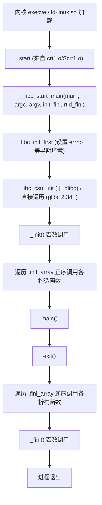
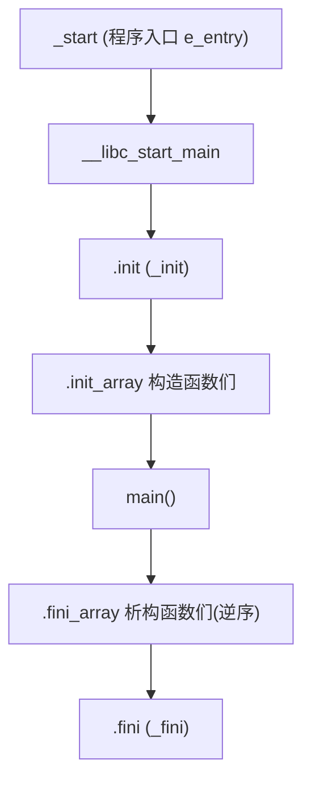

# 详解ELF文件(四十一).init节

.init节是ELF（Executable and Linkable Format）文件中的一个重要节区，用于存放程序初始化代码。它在程序的main()函数执行之前由系统自动调用，负责执行各种初始化任务。

## 1. 基本概念和作用

.init节的主要作用是存储程序启动时需要执行的初始化代码。这些代码在main()函数执行之前运行，用于完成以下任务：

- 执行全局对象的构造函数（C++）
- 初始化库和运行时环境
- 设置程序运行所需的初始状态
- 调用通过特殊属性标记的初始化函数

.init节是程序生命周期中非常重要的一个环节，它确保了程序在执行主逻辑之前完成所有必要的准备工作。

## 2. 数据结构和特征

.init节具有以下特征：

- 节类型：SHT_PROGBITS
- 节标志：SHF_ALLOC | SHF_EXECINSTR（可分配且可执行，与 [[05.text节|.text]] 同属可执行）
- 包含一小段可执行的机器指令（符号 `_init`）

`readelf` 输出示例：

```text
# 示例输出（代表性，非本机实跑）
$ readelf -S a.out | grep -A5 '\.init'
  [ 9] .init             PROGBITS         0000000000401000  00001000
       0000000000000017  0000000000000000  AX       0     0     4
```

字段含义：
- `PROGBITS`：节包含程序定义的原始二进制数据
- `AX`：`A`（SHF_ALLOC，装载进内存）+ `X`（SHF_EXECINSTR，可执行）
- 对齐为 4 字节

## 3. C 运行时启动全景：crt 目标文件链

理解 .init 节，必须先理解 C 运行时（CRT）由哪些目标文件拼装而成。链接器的典型拼接顺序为：

```
crt1.o  crti.o  crtbegin.o  [用户.o] [库]  crtend.o  crtn.o
```

各文件职责如下表：

| 文件 | 来自 | 职责 |
|---|---|---|
| `crt1.o` / `Scrt1.o` | glibc/musl | 提供 `_start` 符号（ELF 入口点 `e_entry`）；`Scrt1.o` 用于 PIE/共享库 |
| `rcrt1.o` | glibc | `-static-pie` 时使用 |
| `gcrt1.o` | glibc | `-pg` 性能剖析时使用 |
| `crti.o` | glibc | 向 `.init` 节贡献 **函数序言**（`_init` 的 prologue），向 `.fini` 节贡献 `_fini` 的 prologue |
| `crtn.o` | glibc | 向 `.init` 节贡献 **函数尾声**（`_init` 的 epilogue），向 `.fini` 节贡献 `_fini` 的 epilogue |
| `crtbegin.o` / `crtbeginS.o` | GCC | 标记 C++ 构造函数列表开头（旧式 `.ctors`）；`crtbeginS.o` 用于共享库/PIE |
| `crtbeginT.o` | GCC | 用于完全静态链接 |
| `crtend.o` / `crtendS.o` | GCC | 标记 C++ 析构函数列表结尾（旧式 `.ctors`/`.dtors`） |

### 3.1 `.init` 节是如何被"拼合"的

`.init` 节并非单一目标文件提供，而是由多个碎片按链接顺序**拼接**成完整函数：

```
.init 节最终内容 = [crti.o 的序言] + [crtbegin.o 贡献的代码] + [用户代码] + [crtn.o 的尾声]
```

- `crti.o` 的 `.init` 片段：只含函数入口指令（`push %rbp; mov %rsp,%rbp` 之类的序言）
- `crtn.o` 的 `.init` 片段：只含 `ret` 或等价的尾声指令
- 链接器将所有来自不同目标文件的 `.init` 片段**按序拼合**，形成一个可调用的完整函数 `_init`

这种"碎片拼接"机制是 System V ABI 的历史设计，允许各个目标文件在 `_init` 中插入自己的初始化代码段。

## 4. 程序启动完整调用链

从内核 execve 到 main 的完整路径如下：



### 4.1 _start 的职责

`_start`（定义在 `crt1.o`）是 ELF `e_entry` 指向的第一条指令。它的核心任务极为精简：

```asm
# 示例输出（代表性，非本机实跑）
# x86-64 _start 大致汇编
_start:
    xor    %ebp, %ebp            # 标记调用栈底
    mov    %rdx, %r9             # rtld_fini（动态链接器的清理函数）
    pop    %rsi                  # argc
    mov    %rsp, %rdx            # argv
    and    $-16, %rsp            # 16 字节对齐栈
    push   %rax
    push   %rsp
    lea    __libc_csu_fini(%rip),%r8
    lea    __libc_csu_init(%rip),%rcx
    mov    main(%rip),%rdi
    call   __libc_start_main@PLT
    hlt                          # 永远不应该到达这里
```

### 4.2 __libc_start_main 参数说明

```c
// glibc 旧版原型（概念参考）
int __libc_start_main(
    int (*main)(int, char **, char **),  // 用户 main
    int argc,
    char **argv,
    void (*init)(void),                  // __libc_csu_init（旧）
    void (*fini)(void),                  // __libc_csu_fini（旧）
    void (*rtld_fini)(void),             // ld-linux.so 的清理
    void *stack_end
);
```

在 **glibc 2.34** 之后，`init` 与 `fini` 参数被废弃：`_start` 直接传入 `NULL`，动态链接器和 glibc 自行通过 `DT_INIT_ARRAY` 等动态标签驱动构造/析构，不再依赖这两个函数指针。

### 4.3 __libc_csu_init 的历史角色（glibc < 2.34）

旧版 glibc 中，`__libc_csu_init`（位于 `csu/elf-init.c`）做了两件事：

1. 调用 `_init()`，即 .init 节的内容
2. 遍历 `__init_array_start` 到 `__init_array_end`，正序调用每一个函数指针

```c
// 旧 __libc_csu_init 伪代码
void __libc_csu_init(int argc, char **argv, char **envp) {
    _init();                                    // 1. 调用 _init
    size_t n = __init_array_end - __init_array_start;
    for (size_t i = 0; i < n; i++)
        __init_array_start[i](argc, argv, envp); // 2. 遍历 .init_array
}
```

glibc 2.34 将此逻辑内化到 `csu/libc-start.c`，`__libc_csu_init` 符号从 `libc.a` / `libc_nonshared.a` 中彻底删除。

## 5. _init 符号：从 crti.o + crtn.o 拼合而来

`_init` 并非一个完整的函数存在于某个单独的源文件，而是由链接时拼合形成：

```text
crti.o 中的 .init 片段（序言）：
    _init:
        sub  $0x8, %rsp        # 函数序言

crtn.o 中的 .init 片段（尾声）：
        add  $0x8, %rsp
        ret                    # 函数尾声
```

中间可插入 `crtbegin.o` 等文件向 `.init` 贡献的代码（例如调用 `__do_global_ctors_aux`）。链接器将所有来自各 `.o` 的 `.init` 片段按排列顺序无缝拼合，最终得到一个完整的 `_init` 函数体。

## 6. DT_INIT：动态链接器的入口

在动态链接可执行文件和共享库的 `.dynamic` 节中，存在一个 `DT_INIT` 动态标签，其值为 `_init` 函数的虚拟地址：

```text
# 示例输出（代表性，非本机实跑）
$ readelf -d a.out | grep INIT
 0x000000000000000c (INIT)               0x401000
 0x0000000000000019 (INIT_ARRAY)         0x403000
 0x000000000000001b (INIT_ARRAYSZ)       0x10 (bytes)
```

动态链接器（`ld-linux.so`）在将共享库映射入进程地址空间后，会依次：

1. 查找 `DT_INIT` 并调用该地址（即 `_init`）
2. 查找 `DT_INIT_ARRAY` 与 `DT_INIT_ARRAYSZ`，正序遍历指针数组

**关键规则（System V ABI 规范）**：若一个对象同时含有 `DT_INIT` 和 `DT_INIT_ARRAY`，则 `DT_INIT` 指向的函数**先于** `DT_INIT_ARRAY` 中的函数执行。

## 7. 程序生命周期中的位置

.init 只是整条启动—退出链中的一环，配合 [[43.init_array节|.init_array]]、[[42.fini节|.fini]]、[[44.fini_array节|.fini_array]] 共同完成：



## 8. 与.init_array节的关系

现代ELF文件中，用户初始化函数通常存储在 [[43.init_array节|.init_array]] 节中，而不是直接放在 .init：

- .init节：包含编译器生成的初始化代码（`_init`）
- .init_array节：包含初始化函数指针数组

执行顺序的精确语义：

| 顺序 | 内容 | 备注 |
|---|---|---|
| 1 | `DT_INIT` → `_init()` | 由 crti.o + crtn.o 拼合的函数体 |
| 2 | `DT_INIT_ARRAY` 数组，正序 | 现代 GCC 用 `.init_array.N` 存优先级变体 |
| 3 | `main()` | 用户程序主函数 |

## 9. C++全局对象初始化

在C++程序中，.init 机制（及其驱动的 .init_array）负责调用全局对象的构造函数：

```cpp
class MyClass {
public:
    MyClass() { /* 构造函数 */ }
    ~MyClass() { /* 析构函数 */ }
};

MyClass globalObject; // 在 main 执行前，其构造函数已被初始化机制调用

int main() { return 0; }
```

C++ 全局对象的构造函数指针由编译器写入 `.init_array`（现代）或 `.ctors`（旧式），`_init` / `__libc_csu_init` 负责遍历并调用它们。

## 10. 自定义初始化函数

可以通过特殊属性定义在初始化阶段执行的函数：

```c
#include <stdio.h>

__attribute__((constructor))
void my_init_function(void) {
    printf("在main之前执行\n");
}

int main() {
    printf("main函数执行\n");
    return 0;
}
```

编译后，`my_init_function` 的地址会被放入 `.init_array`，在 `_init` 之后、`main` 之前由运行时调用。

## 11. 共享库中的 .init

共享库同样可以包含 `.init` 节。动态链接器在 `dlopen` 或程序加载时，对每个共享库：

1. 执行 `DT_INIT`（如果存在）
2. 正序执行 `DT_INIT_ARRAY`

在 `dlclose` 时，则执行对应的 `DT_FINI_ARRAY`（逆序）和 `DT_FINI`。

## 12. 实战：查看与调试 .init

### 12.1 readelf / objdump 查看

```bash
readelf -S a.out | grep '\.init'         # 查看节信息（Flg = AX）
objdump -d -j .init a.out                # 反汇编 .init
readelf -d a.out | grep 'INIT'           # 查看 DT_INIT 动态标签
```

```text
# 示例输出（代表性，非本机实跑）
$ objdump -d -j .init a.out
Disassembly of section .init:

0000000000401000 <_init>:
  401000:       sub    $0x8,%rsp
  401004:       mov    0x2fed(%rip),%rax   # got 中的 __gmon_start__ 地址
  40100b:       test   %rax,%rax
  40100d:       je     401014 <_init+0x14>
  40100f:       call   *%rax              # 若 __gmon_start__ 已定义，则调用它
  401011:       nop
  401012:       add    $0x8,%rsp
  401013:       ret
```

### 12.2 GDB 断点观察

```bash
gdb ./a.out
(gdb) info address _init       # 查看 _init 符号地址
(gdb) break _init              # 在 _init 设断点
(gdb) run
(gdb) backtrace                # 查看调用栈，可见 __libc_start_main → _init
```

通过 GDB 断点可以验证：_init 确实在 main 之前、__libc_start_main 调用期间被执行。

### 12.3 区分可执行文件与共享库的 .init

```bash
# 可执行文件
readelf -d ./a.out | grep 'INIT'

# 共享库
readelf -d ./libfoo.so | grep 'INIT'
```

## 13. 与其他节的关系

- **与 [[42.fini节|.fini]] 节**：.init 在启动时初始化，.fini 在退出时清理，构成生命周期两端
- **与 [[05.text节|.text]] 节**：都含可执行代码，但 .init 专用于初始化
- **与 [[43.init_array节|.init_array]] 节**：.init（`_init`）执行完毕后、main 之前，运行时继续遍历 .init_array
- **与 [[18.dynamic节|.dynamic]] 节**：`DT_INIT` 标签指向 `_init` 的虚拟地址，动态链接器靠此驱动 .init

## 14. 为何现代工具链倾向弃用 .init 直接写入

现代编译器（GCC 4.7+ 以及 Clang）不再鼓励向 `.init` 节中直接注入代码，改用 `.init_array`，原因：

1. **碎片拼合脆弱**：`.init` 由多个 `.o` 文件的片段拼合而成，顺序错误会导致函数序言/尾声不完整
2. **缺少专用节类型**：`.init` 是 `SHT_PROGBITS` 而非专用类型，工具链无法静态分析其结构
3. **无哨兵/无大小字段**：遍历依赖 `__init_array_start` / `__init_array_end` 符号，更加安全和标准
4. **System V ABI 推荐**：`DT_INIT_ARRAY` / `SHT_INIT_ARRAY` 是 gABI 的官方首选方案

## 15. 实际意义

- **程序初始化**：确保 main() 执行前完成必要初始化，支持 C++ 全局对象自动构造
- **运行时环境设置**：初始化运行时库和系统环境
- **库初始化**：共享库可定义自己的初始化代码

.init节是程序启动过程中的关键组成部分，它确保了程序在执行main()函数之前完成所有必要的初始化工作。这对于支持C++全局对象、库初始化和自定义启动代码非常重要，是程序正确运行的基础。

## 相关阅读

- **对应的终止节**：[[42.fini节]]
- **现代初始化数组**：[[43.init_array节]]、[[45.ctors节]]
- **驱动者**：[[18.dynamic节]]（DT_INIT）
- 上一篇：[[40.gnu.version_d节]] ｜ 下一篇：[[42.fini节]]
