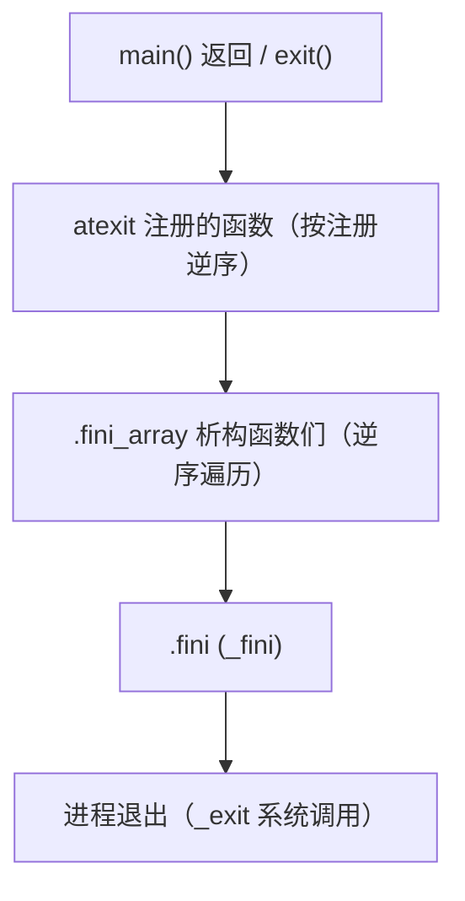
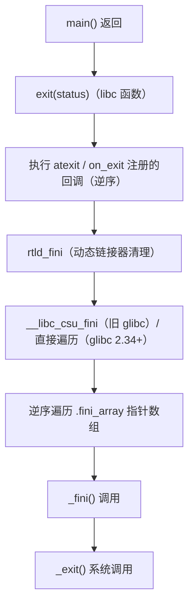

# 详解ELF文件(四十二).fini节

.fini节是ELF（Executable and Linkable Format）文件中的一个重要节区，用于存放程序终止代码。它在程序的main()函数执行之后、程序正常退出之前由系统自动调用，负责执行各种清理工作。

## 1. 基本概念和作用

.fini节的主要作用是存储程序结束时需要执行的清理代码。这些代码在main()函数执行完毕后、程序正常退出之前运行，用于完成以下任务：

- 执行全局对象的析构函数（C++）
- 清理程序使用的资源
- 关闭打开的文件和网络连接
- 执行用户定义的清理函数
- 释放动态分配的内存

.fini节与 [[41.init节|.init]] 节相对应，.init 节在程序开始时执行初始化，而 .fini 节在程序结束时执行清理工作。

## 2. 数据结构和特征

.fini节具有以下特征：

- 节类型：SHT_PROGBITS
- 节标志：SHF_ALLOC | SHF_EXECINSTR（可分配且可执行）
- 包含一小段可执行的机器指令（符号 `_fini`）

`readelf` 输出示例：

```text
# 示例输出（代表性，非本机实跑）
$ readelf -S a.out | grep -A5 '\.fini '
  [10] .fini             PROGBITS         0000000000401140  00001140
       000000000000000d  0000000000000000  AX       0     0     4
```

字段含义与 .init 节完全对称：`PROGBITS`、`AX`（可分配 + 可执行）。

## 3. _fini 符号：同样由 crti.o + crtn.o 拼合

与 `_init` 的拼合机制完全对称，`_fini` 也是由多个目标文件的 `.fini` 片段按链接顺序拼合而成：

```
.fini 节最终内容 = [crti.o 的 .fini 序言] + [crtend.o 等贡献的代码] + [crtn.o 的 .fini 尾声]
```

- `crti.o` 的 `.fini` 片段：`_fini` 的函数序言（`sub $0x8,%rsp`）
- `crtn.o` 的 `.fini` 片段：`_fini` 的函数尾声（`add $0x8,%rsp; ret`）
- `crtend.o` 可向 `.fini` 节中插入调用 `__do_global_dtors_aux` 的代码（旧式 `.dtors` 机制）

### 3.1 crt 目标文件链全景（终止侧）

在终止阶段，crt 目标文件链的职责分配如下：

| 文件 | 来自 | 对终止的贡献 |
|---|---|---|
| `crti.o` | glibc | 提供 `_fini` 函数序言片段 |
| `crtbegin.o` / `crtbeginS.o` | GCC | 旧式：向 `.fini` 插入 `__do_global_dtors_aux` 的调用 |
| `crtend.o` / `crtendS.o` | GCC | 提供 `.dtors` 尾哨兵（`0`），标记析构函数列表结束 |
| `crtn.o` | glibc | 提供 `_fini` 函数尾声片段（`ret`） |

## 4. 在程序生命周期中的位置



**关键执行顺序（System V ABI 规范）**：若对象同时含有 `DT_FINI_ARRAY` 和 `DT_FINI`，则 `DT_FINI_ARRAY` 中的函数**先于** `DT_FINI`（即 `_fini`）执行——这与初始化侧 `DT_INIT` 先于 `DT_INIT_ARRAY` 正好相反。

完整退出顺序：

| 顺序 | 内容 | 备注 |
|---|---|---|
| 1 | `atexit()` 注册的函数 | 按注册的逆序执行（LIFO） |
| 2 | `DT_FINI_ARRAY` 逆序 | .fini_array 中的析构函数 |
| 3 | `DT_FINI` → `_fini()` | 最后执行，来自 .fini 节 |
| 4 | `_exit()` 系统调用 | 真正退出内核 |

## 5. DT_FINI：动态链接器的退出入口

`.dynamic` 节中的 `DT_FINI` 动态标签保存 `_fini` 的虚拟地址：

```text
# 示例输出（代表性，非本机实跑）
$ readelf -d a.out | grep FINI
 0x000000000000000d (FINI)               0x401140
 0x000000000000001a (FINI_ARRAY)         0x403010
 0x000000000000001c (FINI_ARRAYSZ)       0x8 (bytes)
```

动态链接器（`ld-linux.so`）在进程退出时或 `dlclose` 共享库时，会先遍历 `DT_FINI_ARRAY`（逆序），再调用 `DT_FINI` 指向的 `_fini`。

## 6. 完整调用链：退出侧



### 6.1 __libc_csu_fini 的历史角色（glibc < 2.34）

旧版 glibc 中，`__libc_csu_fini`（也来自 `csu/elf-init.c`）做了两件事：

```c
// 旧 __libc_csu_fini 伪代码
void __libc_csu_fini(void) {
    // 逆序遍历 .fini_array
    size_t n = __fini_array_end - __fini_array_start;
    while (n > 0) {
        n--;
        __fini_array_start[n]();      // 逆序调用析构函数
    }
    _fini();                          // 最后调用 _fini
}
```

glibc 2.34 移除了 `__libc_csu_fini` 符号，将逻辑内化到 `csu/libc-start.c`，同时 `_start` 不再向 `__libc_start_main` 传递 fini 参数。

## 7. 与.fini_array节的关系

现代ELF文件中，用户析构函数通常存储在 [[44.fini_array节|.fini_array]] 节中，而不是直接放在 .fini：

- .fini节：包含编译器生成的终止代码（`_fini`）
- .fini_array节：包含析构函数指针数组

精确执行语义：

| 顺序 | 内容 | 备注 |
|---|---|---|
| 先 | `DT_FINI_ARRAY` 逆序遍历 | 析构顺序与构造顺序镜像对称 |
| 后 | `DT_FINI` → `_fini()` | .fini 节的函数体 |

## 8. C++全局对象析构

```cpp
class MyClass {
public:
    MyClass() { /* 构造函数 */ }
    ~MyClass() { /* 析构函数，程序结束时被终止机制调用 */ }
};

MyClass globalObject;

int main() { return 0; }  // 返回后，globalObject 的析构函数被调用
```

C++ 全局对象的析构函数指针由编译器放入 `.fini_array`（现代）或 `.dtors`（旧式），在 `_fini` 之前由运行时逆序调用。

## 9. 自定义析构函数

```c
#include <stdio.h>

__attribute__((destructor))
void my_fini_function(void) {
    printf("在程序退出前执行\n");
}

int main() {
    printf("main函数执行\n");
    return 0;
}
```

`my_fini_function` 的地址会被放入 `.fini_array`，在 `_fini` 之前、`exit()` 返回之前被执行。

## 10. 共享库中的 .fini

共享库同样可以有 `.fini` 节。关键场景：

- `dlopen` 打开共享库：先执行 `DT_INIT_ARRAY`，再执行 `DT_INIT`（`_init`）
- `dlclose` 关闭共享库：先执行 `DT_FINI_ARRAY`（逆序），再执行 `DT_FINI`（`_fini`）

多个共享库的初始化/终止顺序由动态链接器按依赖关系拓扑排序，终止时以构造顺序的逆序执行。

## 11. 实战：查看 .fini

### 11.1 readelf / objdump 查看

```bash
readelf -S a.out | grep '\.fini'
objdump -d -j .fini a.out
readelf -d a.out | grep FINI
```

```text
# 示例输出（代表性，非本机实跑）
$ objdump -d -j .fini a.out
Disassembly of section .fini:

0000000000401140 <_fini>:
  401140:       sub    $0x8,%rsp
  401144:       add    $0x8,%rsp
  401148:       ret
```

可以看到 `_fini` 在没有旧式 `.dtors` 注入时非常简短：仅序言 + 尾声，函数体为空。

### 11.2 GDB 断点观察

```bash
gdb ./a.out
(gdb) break _fini         # 在 _fini 设断点
(gdb) run
(gdb) continue            # 执行到 main 返回后的清理阶段
(gdb) backtrace           # 查看调用栈
```

典型调用栈（旧 glibc）：
```text
#0  _fini ()
#1  __libc_csu_fini ()
#2  __run_exit_handlers ()
#3  exit ()
#4  __libc_start_main ()
```

### 11.3 构造析构顺序验证实验

```c
#include <stdio.h>

__attribute__((constructor(101))) void c1(void){ printf("[构造101]\n"); }
__attribute__((constructor(102))) void c2(void){ printf("[构造102]\n"); }
__attribute__((destructor(101)))  void d1(void){ printf("[析构101]\n"); }
__attribute__((destructor(102)))  void d2(void){ printf("[析构102]\n"); }

int main(){ printf("[main]\n"); return 0; }
```

```text
# 示例输出（代表性，非本机实跑）
[构造101]
[构造102]
[main]
[析构102]
[析构101]
```

验证：.fini_array 逆序执行，高优先级数值（102）的析构函数先于低优先级（101）运行——与构造顺序镜像对称。

## 12. 为何 .fini 的函数体通常很简单

在现代工具链（GCC 4.7+，使用 `.init_array`/`.fini_array` 机制）下，`_fini` 函数体几乎为空：析构函数均通过 `.fini_array` 机制调用，而非注入 `.fini` 节的中间段。`.fini` 节仅保留 `crti.o` 提供的序言和 `crtn.o` 提供的尾声，中间没有任何实质代码。

这与旧式 `.ctors`/`.dtors` 机制下 `crtend.o` 向 `.fini` 注入 `__do_global_dtors_aux` 调用不同——旧机制确实会让 `_fini` 的函数体包含可观的逻辑。

## 13. 与其他节的关系

- **与 [[41.init节|.init]] 节**：构成程序生命周期的开始与结束
- **与 [[05.text节|.text]] 节**：都含可执行代码，但 .fini 专用于终止
- **与 [[44.fini_array节|.fini_array]] 节**：.fini 在 .fini_array 所有函数执行完毕后才被调用
- **与 [[18.dynamic节|.dynamic]] 节**：`DT_FINI` 标签指向 `_fini` 的虚拟地址

## 14. 实际意义

- **资源清理**：确保退出前完成必要的资源清理，支持 C++ 全局对象自动析构
- **程序终止处理**：保证程序优雅退出
- **库清理**：共享库可定义自己的清理代码（卸载前执行）

.fini节是程序生命周期中的关键组成部分，它确保了程序在正常退出前完成所有必要的清理工作。这对于资源管理、C++全局对象析构和自定义清理操作非常重要，是程序正确终止的基础。

## 相关阅读

- **对应的初始化节**：[[41.init节]]
- **现代析构数组**：[[44.fini_array节]]、[[50.dtors节]]
- **驱动者**：[[18.dynamic节]]（DT_FINI）
- 上一篇：[[41.init节]] ｜ 下一篇：[[43.init_array节]]
