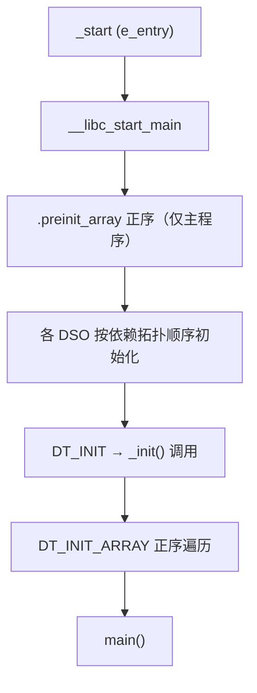
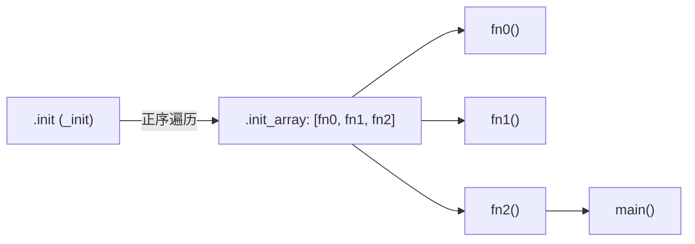

# 详解ELF文件(四十三).init_array节

.init_array节是ELF（Executable and Linkable Format）文件中的一个重要节区，用于存放程序初始化函数指针数组。这些函数在main()函数执行之前由系统自动调用，负责执行各种初始化任务。

## 1. 基本概念和作用

.init_array节的主要作用是存储需要在程序主函数执行前调用的初始化函数指针数组：

- 执行C++全局对象的构造函数
- 调用通过 `__attribute__((constructor))` 标记的函数
- 执行用户自定义的初始化函数

.init_array节是现代ELF文件中推荐使用的初始化机制，相比传统的 [[45.ctors节|.ctors]] 节更加灵活和标准化。它是 System V gABI 正式规范的组成部分，由 HP-UX 工程师首创，glibc 早在 1999 年即完成实现，GCC 4.7 起全面默认切换。

## 2. 数据结构和特征

.init_array节具有以下特征：

- 节类型：**SHT_INIT_ARRAY**（0x0000000e）
- 节标志：SHF_ALLOC | SHF_WRITE（可分配且可写——位于可写段，便于 RELRO 保护）
- 包含函数指针数组，每个指针指向一个 `void(void)` 初始化函数
- 指针宽度与目标平台相同（32 位系统为 4 字节，64 位系统为 8 字节）

```text
# 示例输出（代表性，非本机实跑）
$ readelf -S a.out | grep -A6 'init_array'
  [19] .init_array       INIT_ARRAY       0000000000403000  00003000
       0000000000000010  0000000000000008  WA       0     0     8
```

字段含义：
- `INIT_ARRAY`：专用节类型（区别于 `.init` 的 `PROGBITS`）
- `WA`：`W`（SHF_WRITE 可写）+ `A`（SHF_ALLOC 装载进内存）
- `0x10`（16 字节） = 2 个函数指针（各 8 字节）

## 3. .preinit_array：比 .init_array 更早的机制

在 .init_array 之前还存在一个更早的初始化机制：`.preinit_array`。

### 3.1 节特征

- 节类型：`SHT_PREINIT_ARRAY`
- 动态标签：`DT_PREINIT_ARRAY` + `DT_PREINIT_ARRAYSZ`
- 执行时机：在**所有** DSO（动态共享对象）的 `.init_array` 之前，进程的 preinit 阶段执行

### 3.2 谁使用 .preinit_array

**主要使用者是编译器运行时和 Sanitizer**：

- AddressSanitizer（ASan）
- ThreadSanitizer（TSan）
- MemorySanitizer（MSan）

这些工具需要在任何 libc 函数（`malloc`、`pthread_create`、`sigaction` 等）被调用之前设置好影子内存（shadow memory）。而 `.init_array` 中的构造函数执行时 libc 可能已经初始化并运行，太晚了。

### 3.3 重要限制

- `.preinit_array` **只对主可执行文件有效**；共享库不可使用此机制
- musl libc 不支持 `DT_PREINIT_ARRAY`

```text
# 示例输出（代表性，非本机实跑）
$ readelf -d ./sanitized_binary | grep -i preinit
 0x0000000000000020 (PREINIT_ARRAY)     0x402f00
 0x0000000000000021 (PREINIT_ARRAYSZ)   0x8 (bytes)
```

## 4. 初始化完整执行顺序



关键顺序规则（System V gABI）：
1. `DT_PREINIT_ARRAY` 先于所有 DSO 初始化（仅主程序）
2. `DT_INIT`（`_init`）先于 `DT_INIT_ARRAY`
3. `DT_INIT_ARRAY` 按索引正序遍历
4. 多个 DSO 依依赖图拓扑顺序初始化（被依赖者先初始化）

## 5. 结构图示

.init（_init）负责正序遍历这张指针数组并逐个调用：



## 6. 与.init节的关系

.init_array节与 [[41.init节|.init]] 节协同工作：

- .init节：包含编译器生成的初始化代码（`_init`）
- .init_array节：包含初始化函数指针数组

.init 节通常会遍历并**正序**调用 .init_array 中的所有函数。

## 7. 优先级机制详解

### 7.1 基本用法

通过 `__attribute__((constructor(N)))` 指定优先级：

```c
#include <stdio.h>

__attribute__((constructor))         void f1(void){ printf("f1（无优先级）\n"); }
__attribute__((constructor(101)))    void f2(void){ printf("f2 (101)\n"); }
__attribute__((constructor(102)))    void f3(void){ printf("f3 (102)\n"); }

int main(){ printf("main\n"); return 0; }
```

```text
# 示例输出（代表性，非本机实跑）
f2 (101)
f3 (102)
f1（无优先级）
main
```

输出顺序：优先级数值越小越早执行；不指定时等同于最低优先级（65535）。

### 7.2 优先级范围与限制

| 优先级范围 | 说明 |
|---|---|
| 0 – 100 | **保留给实现**（编译器、libc、sanitizer 等）。使用时会触发 `-Wprio-ctor-dtor` 警告（默认为错误）|
| 101 – 65534 | 用户代码可用范围 |
| 65535 | 等同于不指定优先级（`__attribute__((constructor))` 无参数形式）|

GCC 诊断示例：
```text
# 示例输出（代表性，非本机实跑）
warning: constructor priorities from 0 to 100 are reserved for the implementation
         [-Wprio-ctor-dtor]
```

### 7.3 链接器如何处理优先级

GCC 编译含优先级的构造函数时，会将函数指针放入名为 `.init_array.NNNN` 的专用输入节（如 `.init_array.00101`、`.init_array.00102`）。链接器将这些输入节排序后合并为输出的 `.init_array` 节：

```text
.init_array = .init_array.00101  .init_array.00102  ...  .init_array（无优先级）
```

通过 `objdump -s -j .init_array.00101 a.o` 可以观察到单个对象文件中的优先级节。

## 8. 动态标签：DT_INIT_ARRAY / DT_INIT_ARRAYSZ

链接器在 `.dynamic` 节中生成两个动态标签来描述 .init_array：

| 标签 | 值 | 类型 | 含义 |
|---|---|---|---|
| `DT_INIT_ARRAY` | 25（0x19） | `d_ptr` | .init_array 节的虚拟地址 |
| `DT_INIT_ARRAYSZ` | 27（0x1b） | `d_val` | .init_array 节的字节大小 |
| `DT_PREINIT_ARRAY` | 32（0x20） | `d_ptr` | .preinit_array 的虚拟地址 |
| `DT_PREINIT_ARRAYSZ` | 33（0x21） | `d_val` | .preinit_array 的字节大小 |

动态链接器通过这四个标签驱动初始化，无需额外的符号查找。

```text
# 示例输出（代表性，非本机实跑）
$ readelf -d a.out | grep -E 'INIT|PREINIT'
 0x000000000000000c (INIT)               0x401000
 0x0000000000000019 (INIT_ARRAY)         0x403000
 0x000000000000001b (INIT_ARRAYSZ)       0x10 (bytes)
```

## 9. __init_array_start / __init_array_end 符号

链接器还会合成两个特殊符号，供 C 运行时代码遍历 .init_array：

```c
// 由链接器定义，C 代码中的声明
extern void (*__init_array_start[])(void);
extern void (*__init_array_end[])(void);
```

旧式 `__libc_csu_init` 通过这两个符号遍历数组；新式 glibc 2.34+ 直接使用 `DT_INIT_ARRAY` 动态标签。

## 10. C++全局对象构造函数

```cpp
class MyClass {
public:
    MyClass() { printf("MyClass构造函数被调用\n"); }
    ~MyClass() { printf("MyClass析构函数被调用\n"); }
};

MyClass globalObject;

int main() { printf("main函数执行\n"); return 0; }
```

输出：先打印构造函数、再 main、最后析构函数。

C++ 编译器会为每个全局对象的构造函数生成一个包装函数（wrapper），并将其指针写入 `.init_array`。析构函数则通过 `__cxa_atexit` 注册（而非 `.fini_array`），在程序退出时按构造逆序调用。

### 10.1 __cxa_atexit 与 .fini_array 的区别

C++ 全局对象的析构并非直接写入 `.fini_array`，而是在构造时调用 `__cxa_atexit` 注册析构函数：

```cpp
// 编译器生成的伪代码（概念）
void __global_MyClass_ctor_wrapper(void) {
    globalObject.MyClass::MyClass();   // 调用构造函数
    __cxa_atexit([](void *p){ ((MyClass*)p)->~MyClass(); },
                 &globalObject,
                 __dso_handle);        // 注册析构
}
// 此函数指针放入 .init_array
```

这样可以精确记录构造顺序，并保证"后构造先析构"的 LIFO 语义，优于 `.fini_array` 的简单逆序遍历。

## 11. 自定义初始化函数与优先级

通过 `__attribute__((constructor))` 定义；可加优先级控制顺序：

```c
#include <stdio.h>

__attribute__((constructor))         void f1(void){ printf("f1\n"); }
__attribute__((constructor(101)))    void f2(void){ printf("f2 (101)\n"); }
__attribute__((constructor(102)))    void f3(void){ printf("f3 (102)\n"); }

int main(){ printf("main\n"); return 0; }
```

> 优先级数值越小越早执行；不指定时默认最低优先级（最后执行）。范围通常 0–65535（0–100 保留给实现）。

## 12. 手动注册初始化函数

```c
void my_custom_init(void) { printf("自定义初始化\n"); }

__attribute__((section(".init_array")))
void (*init_func_ptr)(void) = my_custom_init;   // 手动塞进 .init_array
```

注意：直接写入 `.init_array` 时，函数指针位于无优先级后缀的节，等同于优先级 65535。

## 13. glibc 2.34 前后的差异

### 13.1 旧式（glibc < 2.34）

```
_start → __libc_start_main(main, __libc_csu_init, __libc_csu_fini, ...)
              ↓
         __libc_csu_init() {
             _init();                          // 调用 .init
             for (fn in __init_array_start..end)
                 fn(argc, argv, envp);          // 正序遍历 .init_array
         }
```

### 13.2 新式（glibc 2.34+）

```
_start → __libc_start_main(main, NULL, NULL, ...)
              ↓
         内部直接通过 DT_INIT_ARRAY 动态标签定位并遍历
         （__libc_csu_init / __libc_csu_fini 符号已删除）
```

旧式构造函数接收 `(int argc, char **argv, char **envp)` 三个参数（glibc 扩展，不是 POSIX），新式构造函数签名通常只是 `void(void)`。

## 14. 实战：查看 .init_array

```bash
readelf -S a.out | grep init_array       # Type = INIT_ARRAY, Flg = WA
objdump -s -j .init_array a.out          # 查看指针数组内容
readelf -d a.out | grep INIT_ARRAY       # 查看动态标签
nm a.out | grep '__init_array'           # 查看边界符号
```

```text
# 示例输出（代表性，非本机实跑）
$ objdump -s -j .init_array a.out
Contents of section .init_array:
 403000 00114000 00000000 10114000 00000000  ..@.......@.....

# 两个 8 字节指针（小端）：
# 0x0000000000401100 → 第一个构造函数
# 0x0000000000401110 → 第二个构造函数
```

### 14.1 GDB 观察 .init_array 遍历

```bash
gdb ./a.out
(gdb) info address __init_array_start
(gdb) info address __init_array_end
(gdb) x/4gx &__init_array_start      # 以 64 位十六进制查看前 4 个指针
(gdb) break *0x401100                 # 在第一个构造函数处设断点
(gdb) run
```

## 15. 安全考虑

- 逆向工程中，.init_array 常被关注：修改其中指针可实现**函数 Hook**或恶意代码在 main 前执行
- 反调试代码常放在此处，先于 main 运行检测
- **RELRO 保护**：Full RELRO 将 .init_array 所在的数据段设为只读，防止运行时篡改指针
  ```bash
  checksec --file=a.out   # 查看 RELRO 状态
  ```
- Sanitizer（ASan/TSan 等）通过 `.preinit_array` 在更早阶段钩住内存分配函数

.init_array节是现代ELF程序中重要的初始化机制，它提供了一种标准化和灵活的方式来管理程序启动时的初始化工作，通过支持 C++ 全局对象构造、用户自定义初始化函数以及优先级控制，成为程序正确运行的基础组件之一。

## 相关阅读

- **执行它的节**：[[41.init节]]
- **对应的析构数组**：[[44.fini_array节]]
- **旧式等价物**：[[45.ctors节]]
- 上一篇：[[42.fini节]] ｜ 下一篇：[[44.fini_array节]]
