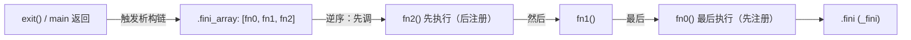
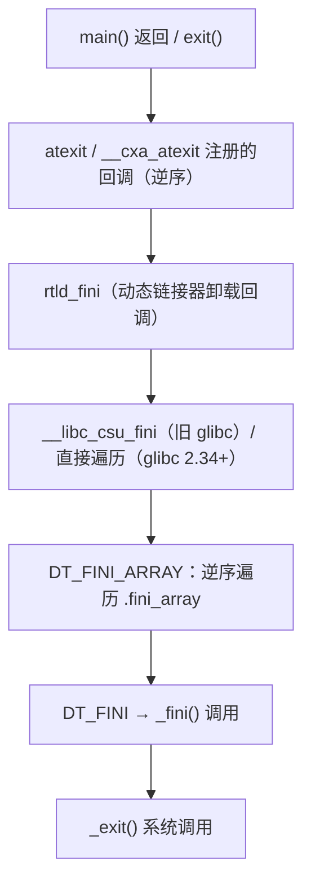

# 详解ELF文件(四十四).fini_array节

.fini_array节是ELF（Executable and Linkable Format）文件中的一个重要节区，用于存放程序终止函数指针数组。这些函数在main()函数执行完毕后、程序正常退出之前由系统自动调用，负责执行各种清理工作。

## 1. 基本概念和作用

.fini_array节的主要作用是存储需要在程序主函数执行后调用的析构函数指针数组：

- 执行C++全局对象的析构函数
- 调用通过 `__attribute__((destructor))` 标记的函数
- 执行用户自定义的清理函数

.fini_array节是现代ELF文件中推荐使用的程序终止机制，相比传统的 [[42.fini节|.fini]] 节更加灵活和标准化。它与 [[43.init_array节|.init_array]] 构成一对对称的初始化/终止机制。

## 2. 数据结构和特征

.fini_array节具有以下特征：

- 节类型：**SHT_FINI_ARRAY**（0x0000000f）
- 节标志：SHF_ALLOC | SHF_WRITE（可分配且可写）
- 包含函数指针数组，每个指针指向一个 `void(void)` 析构函数
- 指针宽度与目标平台相同（32 位为 4 字节，64 位为 8 字节）

```text
# 示例输出（代表性，非本机实跑）
$ readelf -S a.out | grep -A6 'fini_array'
  [20] .fini_array       FINI_ARRAY       0000000000403010  00003010
       0000000000000008  0000000000000008  WA       0     0     8
```

字段含义：
- `FINI_ARRAY`：专用节类型（与 `.fini` 的 `PROGBITS` 不同）
- `WA`：可写 + 可分配
- `0x8`（8 字节）= 1 个函数指针（64 位系统）

## 3. 结构图示（逆序执行是关键）

**逆序**遍历是 .fini_array 最重要的特性——与 .init_array 的正序正好相反，从而实现"后构造的先析构"：



## 4. 完整终止调用链



### 4.1 glibc 2.34 前后差异

**旧式（glibc < 2.34）**：`__libc_csu_fini` 负责逆序遍历 `.fini_array`，然后调用 `_fini()`：

```c
// 旧 __libc_csu_fini 伪代码
void __libc_csu_fini(void) {
    size_t n = __fini_array_end - __fini_array_start;
    while (n > 0) {
        n--;
        __fini_array_start[n]();      // 逆序调用
    }
    _fini();                          // 最后调用 _fini
}
```

**新式（glibc 2.34+）**：`__libc_csu_fini` 符号已从 `libc.a`/`libc_nonshared.a` 中删除。glibc 内部通过 `DT_FINI_ARRAY` 动态标签定位并直接遍历，无需中间符号。

## 5. 与.fini节的关系

.fini_array节与 [[42.fini节|.fini]] 节协同工作：

精确执行顺序（System V gABI 规范）：

| 顺序 | 内容 | 备注 |
|---|---|---|
| 先执行 | `DT_FINI_ARRAY` 逆序遍历 | 析构顺序与构造顺序镜像对称 |
| 后执行 | `DT_FINI` → `_fini()` | 最后执行，来自 .fini 节 |

这与初始化侧完全相反：初始化时 `DT_INIT`（.init）先，`DT_INIT_ARRAY` 后。

## 6. 动态标签：DT_FINI_ARRAY / DT_FINI_ARRAYSZ

链接器在 `.dynamic` 节中生成两个动态标签：

| 标签 | 值 | 类型 | 含义 |
|---|---|---|---|
| `DT_FINI_ARRAY` | 26（0x1a） | `d_ptr` | .fini_array 节的虚拟地址 |
| `DT_FINI_ARRAYSZ` | 28（0x1c） | `d_val` | .fini_array 节的字节大小 |

```text
# 示例输出（代表性，非本机实跑）
$ readelf -d a.out | grep FINI
 0x000000000000000d (FINI)               0x401140
 0x000000000000001a (FINI_ARRAY)         0x403010
 0x000000000000001c (FINI_ARRAYSZ)       0x8 (bytes)
```

## 7. __fini_array_start / __fini_array_end 符号

链接器同样合成边界符号供 C 运行时代码遍历：

```c
extern void (*__fini_array_start[])(void);
extern void (*__fini_array_end[])(void);
```

旧版 glibc 使用这两个符号进行逆序遍历；新版直接使用 `DT_FINI_ARRAY` 动态标签。

## 8. 优先级机制与逆序语义

### 8.1 基本用法

通过 `__attribute__((destructor(N)))` 指定优先级：

```c
#include <stdio.h>
__attribute__((destructor))         void g1(void){ printf("g1（无优先级）\n"); }
__attribute__((destructor(101)))    void g2(void){ printf("g2 (101)\n"); }
__attribute__((destructor(102)))    void g3(void){ printf("g3 (102)\n"); }
int main(){ printf("main\n"); return 0; }
```

```text
# 示例输出（代表性，非本机实跑）
main
g3 (102)
g2 (101)
g1（无优先级）
```

### 8.2 优先级与逆序的联合效果

.fini_array 中函数的存储顺序与 .init_array 相同（数值小的先放），但执行时是**逆序**遍历。因此：

| 存储顺序（低位地址到高位） | 执行顺序（逆序） |
|---|---|
| g2 (101) 在前 | g1（无优先级）最先析构 |
| g3 (102) 居中 | g3 (102) 居中析构 |
| g1（无优先级，65535）在后 | g2 (101) 最后析构 |

**结论**：数值越大的优先级，析构越早——与构造顺序正好镜像对称。这保证了初始化与清理的对称性。

### 8.3 优先级范围

| 优先级范围 | 说明 |
|---|---|
| 0 – 100 | 保留给实现（触发 `-Wprio-ctor-dtor` 警告） |
| 101 – 65534 | 用户代码可用 |
| 65535 | 等同于不指定 |

### 8.4 链接器处理优先级节

GCC 将带优先级的析构函数指针放入 `.fini_array.NNNN` 节：

```text
.fini_array.00101  →  g2 (101)
.fini_array.00102  →  g3 (102)
.fini_array         →  g1（无优先级）
```

链接器合并后的最终 `.fini_array`：`[g2, g3, g1]`，执行时逆序：`g1` → `g3` → `g2`。

## 9. C++全局对象析构与 __cxa_atexit

### 9.1 C++ 析构的注册方式

C++ 全局对象的析构函数**并非**直接写入 `.fini_array`，而是在构造时通过 `__cxa_atexit` 注册：

```cpp
// 编译器生成的伪代码（概念）
void __global_MyClass_ctor_wrapper(void) {
    globalObject.MyClass::MyClass();        // 构造
    __cxa_atexit(
        [](void *p){ ((MyClass*)p)->~MyClass(); },  // 析构回调
        &globalObject,
        __dso_handle                        // 所属 DSO 的句柄
    );
}
```

`__cxa_atexit` 维护一个独立的链表，按 LIFO 顺序调用，这比 `.fini_array` 的简单逆序更精确。

### 9.2 __dso_handle 的作用

`__dso_handle` 是由链接器合成的符号，唯一标识一个 DSO（动态共享对象）。当 `dlclose` 卸载某个共享库时，`__cxa_atexit` 注册的析构函数会**只调用属于该 DSO 的析构函数**，不影响其他库。

```cpp
class MyClass {
public:
    MyClass() { printf("构造\n"); }
    ~MyClass() { printf("析构\n"); }
};
MyClass globalObject;
int main(){ printf("main\n"); return 0; }
```

输出：构造 → main → 析构。

## 10. 自定义析构函数与优先级

```c
#include <stdio.h>
__attribute__((destructor))         void g1(void){ printf("g1\n"); }
__attribute__((destructor(101)))    void g2(void){ printf("g2 (101)\n"); }
__attribute__((destructor(102)))    void g3(void){ printf("g3 (102)\n"); }
int main(){ printf("main\n"); return 0; }
```

> 注意：.fini_array 中函数**逆序执行**，故优先级数值越小，反而越晚执行——这与 .init_array 相反，正好保证初始化与清理对称。

## 11. 手动注册析构函数

```c
void my_custom_fini(void) { printf("自定义析构\n"); }

__attribute__((section(".fini_array")))
void (*fini_func_ptr)(void) = my_custom_fini;
```

注意：直接写入 `.fini_array` 时无优先级，等同于优先级 65535，存储于数组末尾，执行时最先被调用（逆序）。

## 12. 共享库中的 .fini_array

共享库拥有独立的 `.fini_array`。动态链接器行为：

- `dlopen`：按依赖拓扑顺序对每个 DSO 执行其 `DT_INIT`→`DT_INIT_ARRAY`
- `dlclose`：对被卸载的 DSO 逆序执行其 `DT_FINI_ARRAY`→`DT_FINI`

多库场景：若程序依赖 libA.so（libA 依赖 libB.so），初始化顺序为 libB → libA → 主程序；析构顺序为主程序 → libA → libB。

## 13. 实战：查看 .fini_array

### 13.1 readelf / objdump 查看

```bash
readelf -S a.out | grep fini_array       # Type = FINI_ARRAY, Flg = WA
objdump -s -j .fini_array a.out          # 查看指针内容
readelf -d a.out | grep FINI             # 查看动态标签
nm a.out | grep '__fini_array'           # 查看边界符号
```

```text
# 示例输出（代表性，非本机实跑）
$ objdump -s -j .fini_array a.out
Contents of section .fini_array:
 403010 00214000 00000000                    .!@.....

# 单个 8 字节指针（小端）：0x0000000000402100 → 析构函数
```

### 13.2 GDB 观察逆序执行

```bash
gdb ./a.out
(gdb) info address __fini_array_start
(gdb) info address __fini_array_end
(gdb) x/4gx &__fini_array_start      # 查看指针数组
(gdb) break *0x402100                 # 在析构函数处设断点
(gdb) run
(gdb) continue                        # 执行到 exit() 阶段
```

### 13.3 构造析构顺序完整实验

```c
#include <stdio.h>

__attribute__((constructor(101))) void c1(void){ printf("[构造101]\n"); }
__attribute__((constructor(102))) void c2(void){ printf("[构造102]\n"); }
__attribute__((destructor(101)))  void d1(void){ printf("[析构101]\n"); }
__attribute__((destructor(102)))  void d2(void){ printf("[析构102]\n"); }

int main(){ printf("[main]\n"); return 0; }
```

```text
# 示例输出（代表性，非本机实跑）
[构造101]
[构造102]
[main]
[析构102]
[析构101]
```

构造：101 → 102（正序）；析构：102 → 101（逆序）——完美镜像对称。

## 14. 安全考虑

1. **程序流劫持**：修改 .fini_array 指针可控制退出时执行流（GDB / 内存写入漏洞）
2. **反调试**：可利用本节在退出阶段执行反调试检查（清理反调试痕迹）
3. **持久化**：恶意代码可能借此在程序退出时触发（如 shellcode 清理痕迹）
4. **RELRO 保护**：Full RELRO 将 .fini_array 所在数据段设为只读，防止运行时篡改
   ```bash
   checksec --file=a.out   # 查看 RELRO 状态：Full RELRO / Partial RELRO / No RELRO
   ```
5. **格式化字符串 + .fini_array 组合攻击**：经典 CTF 利用路径，通过任意写将 .fini_array[0] 覆盖为 shellcode 地址

.fini_array节是现代ELF程序中重要的终止机制，它提供了一种标准化和灵活的方式来管理程序退出时的清理工作，通过支持 C++ 全局对象析构、用户自定义析构函数以及（逆序）优先级控制，成为程序优雅退出的基础组件之一。

## 相关阅读

- **执行它的节**：[[42.fini节]]
- **对应的初始化数组**：[[43.init_array节]]
- **旧式等价物**：[[50.dtors节]]
- 上一篇：[[43.init_array节]] ｜ 下一篇：[[45.ctors节]]
