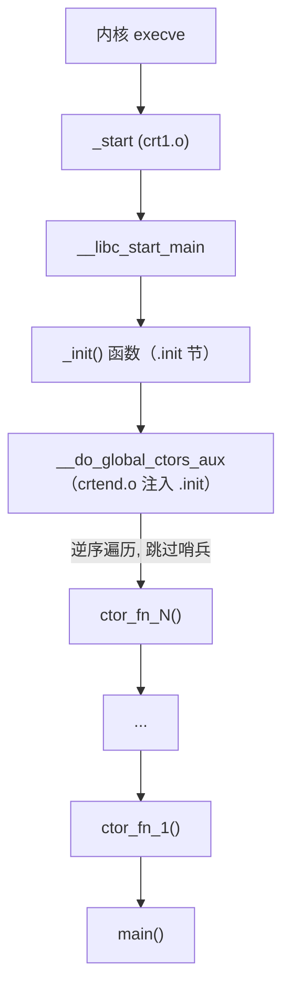

# 详解ELF文件(四十五).ctors节

.ctors节是ELF（Executable and Linkable Format）文件中的一个节区，全称是"constructors"（构造函数）。它用于存放程序全局构造函数的指针数组，在main()函数执行之前由系统自动调用。它是 [[43.init_array节|.init_array]] 的**前身**，现代工具链已基本改用后者。

## 1. 基本概念和作用

.ctors节的主要作用是存储程序中需要在main()函数执行前调用的全局构造函数指针数组：

- 执行C++全局对象的构造函数
- 调用通过 `__attribute__((constructor))` 标记的函数
- 执行用户自定义的初始化函数

需要注意的是，现代的ELF文件通常使用 [[43.init_array节|.init_array]] 节替代 .ctors 节，但 .ctors 仍可能出现在旧系统、旧编译器或某些运行时（crtbegin.o/crtend.o）的产物中。

## 2. 数据结构和特征

.ctors节具有以下特征：

- 节类型：**SHT_PROGBITS**（不同于 .init_array 的 `SHT_INIT_ARRAY`）
- 节标志：SHF_ALLOC | SHF_WRITE（可分配且可写）
- 包含函数指针数组，并带有**特殊的首尾哨兵项**（这是与 .init_array 最显著的区别）

### 2.1 哨兵布局（Sentinel Layout）

```
.ctors 节内存布局（链接后）：
┌─────────────────────────────────────────────────────┐
│ [crtbegin.o 贡献] 0xffffffff (头哨兵 / -1)          │  ← 标记数组开始
│ [用户.o 贡献]     &ctor_fn_N  ...                   │  ← 各构造函数指针
│                   &ctor_fn_2                         │
│                   &ctor_fn_1                         │
│ [crtend.o 贡献]   0x00000000  (尾哨兵 / 0)          │  ← 标记数组结束
└─────────────────────────────────────────────────────┘
```

在 64 位系统上，哨兵值扩展为 8 字节：
- 头哨兵：`0xffffffffffffffff`（即 -1 的补码）
- 尾哨兵：`0x0000000000000000`

## 3. 历史背景：crtbegin.o 与 crtend.o 的职责

.ctors 机制完全依赖 GCC 提供的 `crtbegin.o` 和 `crtend.o` 两个目标文件：

### 3.1 crtbegin.o 的职责

`crtbegin.o` 向 `.ctors` 节贡献**头哨兵**（-1），同时定义 `__CTOR_LIST__` 符号：

```c
// crtbegin.o 中的伪代码（概念）
// 向 .ctors 写入头哨兵
static void *__CTOR_LIST__[]
    __attribute__((section(".ctors"))) = { (void *)(-1) };

// 标识构造函数列表起始的符号
void (*__CTOR_LIST__[])(void) __attribute__((section(".ctors")));
```

- `crtbeginS.o`：用于生成共享库（PIC）时替代 `crtbegin.o`
- `crtbeginT.o`：用于完全静态链接时

### 3.2 crtend.o 的职责

`crtend.o` 向 `.ctors` 节贡献**尾哨兵**（0），并在 `.init` 节插入 `__do_global_ctors_aux` 的调用：

```c
// crtend.o 中的伪代码（概念）
// 向 .ctors 写入尾哨兵
static void *__CTOR_END__[]
    __attribute__((section(".ctors"))) = { NULL };

// 在 .init 节插入，由 _init 调用
static void __do_global_ctors_aux(void) {
    // 从 __CTOR_END__ 往 __CTOR_LIST__ 方向逆序遍历
    // 跳过哨兵值，调用每一个非 NULL 的函数指针
    func_ptr *p = __CTOR_END__ - 1;
    while (*p != (func_ptr)(-1)) {  // 遇到头哨兵 -1 停止
        (*p)();                      // 调用构造函数
        p--;
    }
}
```

同样地，`.dtors` 机制由 `crtbegin.o`（头哨兵）和 `crtend.o`（尾哨兵 + `__do_global_dtors_aux`）提供。

### 3.3 链接顺序与节片段拼合

```
链接器命令（概念）：
ld crt1.o crti.o crtbegin.o [用户.o] -lgcc crtend.o crtn.o

.ctors 输出节拼合：
  crtbegin.o:.ctors → [ 0xffffffff ]        ← 头哨兵
  用户.o:.ctors     → [ &ctor_fn_1 ]        ← 用户构造函数
  用户.o:.ctors     → [ &ctor_fn_2 ]
  ...
  crtend.o:.ctors   → [ 0x00000000 ]        ← 尾哨兵

.init 输出节拼合（用于调用 __do_global_ctors_aux）：
  crti.o:.init      → _init 函数序言
  crtbegin.o:.init  → （可能插入 __gmon_start__ 调用等）
  crtend.o:.init    → call __do_global_ctors_aux ← 关键！
  crtn.o:.init      → _init 函数尾声 (ret)
```

## 4. 与.init_array的关键区别

| 特性 | .ctors（旧式） | [[43.init_array节\|.init_array]]（新式） |
|---|---|---|
| 节类型 | SHT_PROGBITS（通用） | SHT_INIT_ARRAY（专用） |
| 哨兵项 | 有（-1 头哨兵、0 尾哨兵） | 无（节大小 DT_INIT_ARRAYSZ 界定范围） |
| 执行顺序 | **逆序**（从后往前，跳过哨兵） | **正序**（从前往后） |
| 遍历代码 | `__do_global_ctors_aux`（注入 .init） | 动态链接器直接通过 DT_INIT_ARRAY 驱动 |
| crtbegin/crtend 依赖 | 强依赖（提供哨兵和遍历代码） | 不需要（标准化机制，工具链无关） |
| 现状 | GCC 4.7 之前默认；之后兼容保留 | GCC 4.7+ 默认 |
| 新架构支持 | 仅历史兼容（AArch64、RISC-V 不提供） | 全平台支持 |
| 动态标签 | 无专用标签 | DT_INIT_ARRAY + DT_INIT_ARRAYSZ |

## 5. 结构图示


## 6. 执行时机和流程



完整流程说明：

1. 内核加载程序，控制权到 `_start`（来自 `crt1.o`）
2. `_start` 调用 `__libc_start_main`
3. `__libc_start_main` 调用 `__libc_csu_init`（旧 glibc）
4. `__libc_csu_init` 调用 `_init()`（即 .init 节的内容）
5. `_init` 函数体中包含 `__do_global_ctors_aux` 的调用（由 `crtend.o` 注入 .init 节）
6. `__do_global_ctors_aux` **逆序**遍历 `.ctors` 数组，跳过头哨兵（-1），遇到尾哨兵（0）前停止，依次调用每个构造函数
7. 执行 `main()`

## 7. C++全局对象与自定义构造函数

```c
#include <stdio.h>
__attribute__((constructor))
void my_ctor(void) { printf("构造函数在main之前执行\n"); }
int main(){ printf("main\n"); return 0; }
```

（C++ 全局对象的构造函数同样经由此机制在 main 前调用。)

## 8. 逆序执行的原因

.ctors 采用逆序执行有其设计逻辑：

链接时，目标文件按命令行顺序排列（`a.o b.o c.o`），对应构造函数指针在 `.ctors` 中的顺序为 `[a_ctor, b_ctor, c_ctor]`。逆序执行意味着 `c_ctor` 先、`a_ctor` 后。

当析构时（`.dtors` 正序），`a_dtor` 先、`c_dtor` 后——正好与构造顺序相反，满足 LIFO 语义。

然而，.init_array 采用**正序**执行，构造顺序与链接顺序相同，行为更直观。这是两种机制在语义上最显著的差异：

```
.ctors 的语义（逆序构造）：
  链接顺序：a.o b.o c.o
  构造顺序：c → b → a
  析构顺序：a → b → c

.init_array 的语义（正序构造）：
  链接顺序：a.o b.o c.o
  构造顺序：a → b → c
  析构顺序：c → b → a（.fini_array 逆序）
```

## 9. 与.dtors节的关系

.ctors节与 [[50.dtors节|.dtors]] 节（destructors，析构函数）相对应：

- .ctors：存储构造函数指针，在 main() 之前执行（**逆序**）
- .dtors：存储析构函数指针，在 main() 之后执行（**正序**）

注意：.dtors 的正序等同于 .ctors 逆序构造的"构造顺序"，实现了 LIFO 对称。

二者是旧式机制，对应新式的 .init_array / [[44.fini_array节|.fini_array]]（.fini_array 采用逆序，行为与 .dtors 的正序效果相同，但实现方式不同）。

## 10. GCC 4.7 迁移史

### 10.1 问题的提出（2010）

HP-UX 工程师率先发现 `.init`/`.ctors` 机制存在的问题：

1. **碎片拼合脆弱**：`_init` 函数由多个 `.o` 文件的 `.init` 片段拼合而成，顺序错误会导致函数不完整
2. **哨兵值丑陋**：`0xffffffff` 和 `0x00000000` 作为魔法值混在函数指针数组中，容易误解
3. **无专用节类型**：`.ctors` 使用 `SHT_PROGBITS`（通用类型），工具链无法静态识别其用途
4. **crtbegin/crtend 强依赖**：每个目标都需要 GCC 提供的 `crtbegin.o`/`crtend.o`，移植性差

### 10.2 迁移过程

- **glibc**：1999 年即实现 `DT_INIT_ARRAY` 支持
- **2010 年**：Mike Hommey 提案迁移到 `.init_array`（Firefox 项目驱动）
- **GNU ld**：更新内部链接脚本，将 `.ctors`、`.ctors.N`、`.init_array`、`.init_array.N` 混合输入节合并到同一输出节，实现向后兼容
- **gold 链接器**：增加默认开启的 `--ctors-in-init-array` 选项
- **GCC 4.7（2012）**：完成迁移，ELF 目标默认使用 `.init_array`/`.fini_array`

### 10.3 新架构不再支持 .ctors

AArch64、RISC-V 等新架构的 GCC 后端**从未提供** `.ctors`/`.dtors` 支持，直接使用 `.init_array`/`.fini_array`。仅在旧 x86/x86-64 目标上，GCC 出于向后兼容才保留 `.ctors` 相关代码路径（由预处理器条件保护）。

## 11. 实战：查看 .ctors

```bash
readelf -S a.out | grep ctors
objdump -s -j .ctors a.out
```

```text
# 示例输出（代表性，非本机实跑）
$ objdump -s -j .ctors a.out
Contents of section .ctors:
 403000 ffffffff ffffffff 00114000 00000000  ..........@.....
 403010 10114000 00000000 00000000 00000000  ..@.............

# 解析：
# 403000: ffffffffffffffff  → 头哨兵（64 位平台的 -1）
# 403008: 0000000000401100  → 第一个构造函数地址（小端字节序）
# 403010: 0000000000401110  → 第二个构造函数地址
# 403018: 0000000000000000  → 尾哨兵（NULL）
```

### 11.1 与 .init_array 输出对比

```text
# 示例输出（代表性，非本机实跑）
# 旧式 .ctors（SHT_PROGBITS，含哨兵）：
$ readelf -S old_binary | grep -A3 '.ctors'
  [18] .ctors   PROGBITS   0x403000   00003000   0x18   0x00   WA   0  0  8

# 新式 .init_array（SHT_INIT_ARRAY，无哨兵）：
$ readelf -S new_binary | grep -A3 'init_array'
  [19] .init_array   INIT_ARRAY   0x403000   00003000   0x10   0x08   WA   0  0  8
```

节大小差异：旧式含两个哨兵（额外 16 字节），新式无哨兵（纯函数指针数组）。

### 11.2 GDB 观察旧式 .ctors 遍历

```bash
gdb ./old_binary
(gdb) info address __CTOR_LIST__        # 头哨兵地址
(gdb) info address __CTOR_END__         # 尾哨兵地址
(gdb) break __do_global_ctors_aux       # 在遍历函数处设断点
(gdb) run
(gdb) backtrace                         # 观察调用栈
```

## 12. 在现代工具链中遇到 .ctors 的情形

尽管 GCC 4.7+ 默认使用 `.init_array`，仍有场景会产生 `.ctors` 节：

1. **旧目标文件混链**：将旧 GCC（< 4.7）编译的 `.o` 与新 GCC 编译的 `.o` 混合链接
2. **嵌入式工具链**：某些嵌入式目标（裸机、RTOS）仍沿用 `.ctors` 机制
3. **静态库**：静态库（`.a`）可能包含使用 `.ctors` 的旧目标文件
4. **手动 `__attribute__((section(".ctors")))`**：开发者显式指定节名的代码
5. **GNU ld 的兼容合并**：GNU ld 的内部链接脚本会将 `.ctors` 和 `.ctors.N` 合并进 `.init_array` 输出节，在输出文件层面实现透明兼容

## 13. 现代替代方案与意义

虽然 .ctors 仍存在，但现代 ELF 更倾向使用 [[43.init_array节|.init_array]]（标准化、工具支持好、语义清晰）。两种机制的对比总结：

| 维度 | .ctors（旧） | .init_array（新） |
|---|---|---|
| 设计年代 | 1990s（GCC 早期） | 1999（HP-UX/gABI） |
| 节类型 | SHT_PROGBITS | SHT_INIT_ARRAY |
| 构造顺序 | 逆序 | 正序 |
| 哨兵 | -1（头）/ 0（尾） | 无 |
| 遍历代码来源 | crtend.o 注入 .init | 动态链接器内置 |
| 优先级语法 | 不直接支持（靠链接顺序） | `.init_array.NNNN` 节名优先级 |
| 新平台（AArch64 等） | 不支持 | 唯一选择 |

了解 .ctors 对于理解程序启动过程、维护旧代码以及分析历史产物仍然重要。

## 相关阅读

- **现代替代品**：[[43.init_array节]]
- **对应的析构节**：[[50.dtors节]]
- **执行它的节**：[[41.init节]]
- 上一篇：[[44.fini_array节]] ｜ 下一篇：[[46.eh_frame节]]
