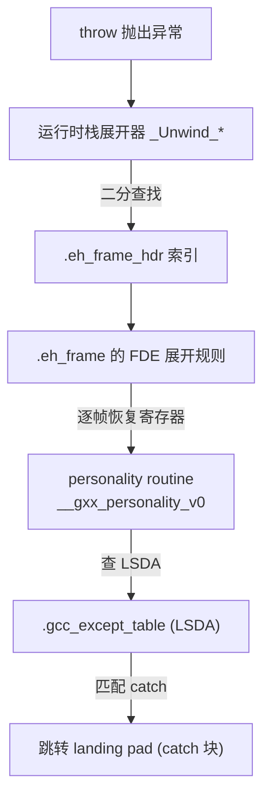

# 详解ELF文件(四十六).eh_frame节

.eh_frame节是ELF（Executable and Linkable Format）文件中的一个重要节区，全称是"Exception Handling Frame"（异常处理帧）。它用于存储异常处理和栈回溯所需的信息，在程序运行时发挥关键作用。

## 1. 基本概念和作用

.eh_frame节的主要作用是提供异常处理和栈回溯所需的信息：

- 支持C++异常处理机制（配合 [[48.gcc_except_table节|.gcc_except_table]]）
- 实现程序运行时的栈回溯（stack unwinding）
- 为调试器（GDB、LLDB）提供栈帧信息
- 在程序崩溃时帮助生成调用栈信息（如 backtrace()）

.eh_frame节与 [[32.debug_frame节|.debug_frame]] 节功能相似，但 .eh_frame 节在程序运行时可用（带有 SHF_ALLOC 标志），而 .debug_frame 节主要用于调试。

### 1.1 历史与标准

.eh_frame 格式由 GCC 团队扩展自 DWARF 的 `.debug_frame`，并被 LSB（Linux Standard Base）采纳为规范，具体见 LSB Core Generic 第 11.6 节 "Exception Frames"。Itanium C++ ABI 定义了两阶段展开协议与 `_Unwind_*` API，所有遵循该 ABI 的平台（x86-64、ARM、RISC-V 等）均使用此格式。

## 2. 数据结构和特征

.eh_frame节具有以下特征：

- 节类型：SHT_PROGBITS
- 节标志：SHF_ALLOC（可分配到内存中，运行时可用）
- 包含 CIE（Common Information Entry，公共信息条目）和 FDE（Frame Descriptor Entry，帧描述符条目）

整个 .eh_frame 节就是一系列 CFI（Call Frame Information）记录的线性拼接，每个 CFI 包含恰好一个 CIE 后跟若干 FDE。节的边界由节头中的 sh_size 决定，不需要额外的终止标记（但长度为 0 的条目用作终止符，可选）。

## 3. CIE（公共信息条目）完整字段详解

CIE 是 .eh_frame 的"共享公共头"，多个 FDE 可共享同一个 CIE，节省空间。

### 3.1 CIE 字段布局

```c
/* CIE 结构（伪代码，字段宽度视平台而定） */
struct CIE {
    uint32_t  length;           // 本 CIE 后续内容字节数（不含此字段）
                                // 0xffffffff 表示 64-bit DWARF 扩展格式
    uint32_t  CIE_id;           // 固定为 0，区别于 FDE（FDE 此字段非 0）
    uint8_t   version;          // 版本号，通常为 1（DWARF2）或 3（DWARF3）
    char      augmentation[];   // 以 NUL 结尾的增强字符串（如 "zR", "zPLR"）
    // 若 augmentation[0]=='z'，后续才有 code_alignment_factor 等：
    uleb128   code_alignment_factor;  // 代码对齐因子，advance_loc delta 乘以它
    sleb128   data_alignment_factor;  // 数据对齐因子（通常 x86-64 为 -8）
    uleb128   return_address_register; // 返回地址寄存器编号（x86-64 为 16=rip）
    // 若 augmentation 包含 'z'：
    uleb128   augmentation_data_length; // augmentation_data 字节数
    uint8_t   augmentation_data[];      // augmentation 参数字节序列
    uint8_t   initial_instructions[];   // DW_CFA_* 指令序列（初始寄存器状态）
    uint8_t   padding[];                // NOP 填充，使总长度对齐到指针大小
};
```

### 3.2 关键字段说明

**length**：4 字节，记录从下一个字段（CIE_id）到本记录末尾的字节数。用于跳过整条记录。

**CIE_id**：4 字节，CIE 中固定为 `0x00000000`；FDE 中该字段为"距 CIE 起始位置的偏移"（称为 CIE pointer），用于区分两种记录类型。

**version**：1 字节。通常为 `1`（DWARF2 兼容）或 `3`（引入带符号 data_alignment_factor）。

**augmentation**：NUL 结尾字符串，控制增强数据的存在与含义（详见第 4 节）。

**code_alignment_factor**：ULEB128。`DW_CFA_advance_loc` 操作数 delta 乘以该因子得到字节偏移。x86-64 通常为 1（每个代码单元 1 字节）。

**data_alignment_factor**：SLEB128。`DW_CFA_offset` 操作数乘以该因子得到字节偏移。x86-64 通常为 -8（栈向下增长，每个 slot 8 字节）。

**return_address_register**：ULEB128。保存返回地址的寄存器列号。x86-64 下为 16（对应 `rip`）。

**augmentation_data_length + augmentation_data**：仅当 augmentation[0]=='z' 时存在。前者为 ULEB128 长度，后者为增强参数字节序列，字节含义由 augmentation 字符串其余字符决定（见第 4 节）。

**initial_instructions**：DW_CFA_* 字节码序列，定义所有 FDE 共享的初始寄存器规则（通常设 CFA = RSP+8，RIP 保存于 CFA-8）。

### 3.3 典型 CIE 示例（x86-64 "zR"）

```
# 示例输出（代表性，非本机实跑）
CIE at offset 0x00000000:
  Length:                   20
  CIE_id:                   0x00000000
  Version:                  1
  Augmentation:             "zR"
  Code alignment factor:    1
  Data alignment factor:    -8
  Return address reg:       16 (rip)
  Augmentation data length: 1
  Augmentation data:        1b        (R: DW_EH_PE_pcrel|DW_EH_PE_sdata4)
  Initial instructions:
    DW_CFA_def_cfa: r7 (rsp) ofs 8
    DW_CFA_offset: r16 (rip) at cfa-8
    DW_CFA_nop
    DW_CFA_nop
```

## 4. FDE（帧描述符条目）完整字段详解

每个 FDE 描述一段连续代码（通常对应一个函数）的栈展开规则。

### 4.1 FDE 字段布局

```c
struct FDE {
    uint32_t  length;            // 本 FDE 后续内容字节数
    uint32_t  CIE_pointer;       // 相对于本字段地址，指向所属 CIE 的偏移
                                 // 注意：是 FDE 中此字段地址 减去 CIE 地址
    encoded   PC_begin;          // 函数起始地址（编码方式见 CIE 的 R 字符）
    encoded   PC_range;          // 函数代码长度（字节数）
    // 若 CIE augmentation 包含 'z'：
    uleb128   augmentation_data_length;
    uint8_t   augmentation_data[];  // 若含 'L'：LSDA 指针（指向 .gcc_except_table）
    uint8_t   call_frame_instructions[]; // DW_CFA_* 指令序列
    uint8_t   padding[];
};
```

### 4.2 关键字段说明

**CIE_pointer**：FDE 中 length 字段之后的第一个字段，值为"从本字段地址到其关联 CIE 起始的字节偏移"（正向偏移，向节头方向），非 0 值是区分 FDE 与 CIE 的标志。

**PC_begin / PC_range**：函数入口地址及代码长度，编码方式由 CIE augmentation 的 'R' 字符指定（见 DW_EH_PE_* 编码）。展开器据此定位"当前 PC 属于哪个 FDE"。

**augmentation_data（LSDA 指针）**：当 CIE augmentation 含 'L' 时，FDE 增强数据包含一个指向本函数 LSDA（即 .gcc_except_table 对应条目）的指针，personality routine 通过 `_Unwind_GetLanguageSpecificData()` 取得。

**call_frame_instructions**：差分化的 DW_CFA_* 指令流，在 CIE initial_instructions 基础上描述本函数内部各 PC 处的寄存器规则变化。

### 4.3 典型 FDE 示例

```
# 示例输出（代表性，非本机实跑）
FDE at offset 0x00000018 (cie offset 0x00000000):
  Length:                   52
  CIE_pointer:              0x0000009c     -> CIE at 0x00000000
  PC begin:                 0x00400690     (pcrel+sdata4 -> 0x00400690)
  PC range:                 0x00000070
  Augmentation data length: 0
  Instructions:
    DW_CFA_advance_loc: 4 to 0x400694
    DW_CFA_def_cfa_offset: 16
    DW_CFA_offset: r6 (rbp) at cfa-16
    DW_CFA_advance_loc: 3 to 0x400697
    DW_CFA_def_cfa_register: r6 (rbp)
    DW_CFA_advance_loc: 100 to 0x4006fb
    DW_CFA_def_cfa: r7 (rsp) ofs 8
    DW_CFA_nop
```

## 5. augmentation 字符串详解

augmentation 字符串控制 CIE/FDE 的扩展字段，是区分 .eh_frame 与 .debug_frame 的核心特征。

### 5.1 各字符含义

| 字符 | 位置 | 含义 |
|------|------|------|
| `z` | 必须首位 | 表示存在 augmentation_data_length 字段；未知字符无法忽略，故 z 使解析器可跳过 |
| `R` | CIE aug_data | 后跟 1 字节 DW_EH_PE_* 编码，指定 FDE 中 PC_begin 和 PC_range 的编码方式 |
| `P` | CIE aug_data | 后跟 1 字节编码 + personality routine 指针；personality 负责语言层 catch 匹配 |
| `L` | CIE aug_data（1 字节编码）；FDE aug_data（指针） | LSDA 指针编码（CIE）及实际 LSDA 指针（FDE） |
| `S` | CIE aug_data | 表示本 CIE 描述信号处理栈帧，展开时 PC 语义略有不同 |

> 字符顺序决定 augmentation_data 中参数的顺序。例如 `"zPLR"` 则 aug_data 依次是：P 的编码+指针、L 的编码、R 的编码。

### 5.2 常见 augmentation 组合

- `""`（空）：最简单，无任何扩展，用于 C 代码或无异常处理的场景。
- `"zR"`：x86-64 最常见组合，紧凑 PC 指针编码（通常 `DW_EH_PE_pcrel|DW_EH_PE_sdata4`）。
- `"zPLR"`：完整 C++ 异常处理，包含 personality routine 指针、LSDA 指针、紧凑 PC 编码。

## 6. DW_EH_PE_* 指针编码

DW_EH_PE（DWARF Exception Header Pointer Encoding）用一个字节编码指针的"值类型"与"基址"。

### 6.1 低4位：值类型（value format）

| 值 | 名称 | 含义 |
|----|------|------|
| 0x00 | DW_EH_PE_absptr | 原始绝对指针（平台指针宽度） |
| 0x01 | DW_EH_PE_uleb128 | ULEB128 无符号 |
| 0x02 | DW_EH_PE_udata2 | 2 字节无符号 |
| 0x03 | DW_EH_PE_udata4 | 4 字节无符号 |
| 0x04 | DW_EH_PE_udata8 | 8 字节无符号 |
| 0x09 | DW_EH_PE_sleb128 | SLEB128 有符号 |
| 0x0a | DW_EH_PE_sdata2 | 2 字节有符号 |
| 0x0b | DW_EH_PE_sdata4 | 4 字节有符号 |
| 0x0c | DW_EH_PE_sdata8 | 8 字节有符号 |
| 0xff | DW_EH_PE_omit | 字段省略 |

### 6.2 高4位：基址修饰符（application modifier）

| 值 | 名称 | 基址 |
|----|------|------|
| 0x00 | （无修饰）| 绝对值 |
| 0x10 | DW_EH_PE_pcrel | 相对当前数据的地址 |
| 0x20 | DW_EH_PE_textrel | 相对 .text 节起始 |
| 0x30 | DW_EH_PE_datarel | 相对 .eh_frame_hdr 起始 |
| 0x40 | DW_EH_PE_funcrel | 相对函数起始 |
| 0x50 | DW_EH_PE_aligned | 对齐到指针大小 |
| 0x80 | DW_EH_PE_indirect | 以计算值为地址再解引用 |

> 实践中 x86-64 最常见编码 `0x1b = DW_EH_PE_pcrel | DW_EH_PE_sdata4`，4字节有符号相对于存放该指针的地址，生成位置无关代码（PIC/PIE）。

## 7. DW_CFA_* 指令完整分类

DW_CFA_* 指令是 .eh_frame 的核心，构成一个寄存器规则的"差分虚拟机"。展开器从 CIE initial_instructions 开始执行，再执行 FDE 的 call_frame_instructions，逐步重建目标 PC 处的寄存器状态。

### 7.1 概念：CFA（Canonical Frame Address）

CFA 是栈展开的基准地址，定义为"被调函数入口时调用方 RSP 的值"（即 call 指令执行完毕、返回地址已压栈时，调用方 RSP 所指的地址）。所有寄存器恢复规则都以 CFA 为基准表达偏移。

x86-64 函数入口处：`CFA = RSP + 8`（因为 call 压了 8 字节返回地址）。

### 7.2 位置推进指令

| 指令 | 操作 | 说明 |
|------|------|------|
| `DW_CFA_advance_loc(delta)` | loc += delta × code_align | 高 2 位为 0x01，低 6 位为 delta，最大 63 代码单元 |
| `DW_CFA_advance_loc1` | loc += operand × code_align | 1 字节操作数，扩展 delta 范围 |
| `DW_CFA_advance_loc2` | loc += operand × code_align | 2 字节操作数 |
| `DW_CFA_advance_loc4` | loc += operand × code_align | 4 字节操作数 |
| `DW_CFA_set_loc(addr)` | loc = addr | 直接设置绝对地址（encoded，用 R 字符指定格式） |

### 7.3 CFA 定义指令

| 指令 | 操作 | 典型用途 |
|------|------|---------|
| `DW_CFA_def_cfa(reg, offset)` | CFA = reg + offset | 函数序言：进入时 CFA = RSP + 8 |
| `DW_CFA_def_cfa_register(reg)` | 更换 CFA 寄存器，offset 不变 | push rbp; mov rbp, rsp 之后切换 CFA 到 RBP |
| `DW_CFA_def_cfa_offset(offset)` | 更新 CFA offset，寄存器不变 | 每次 push 后偏移增大 |
| `DW_CFA_def_cfa_sf(reg, sf)` | CFA = reg + sf × data_align | 有符号因式化版本 |
| `DW_CFA_def_cfa_offset_sf(sf)` | 有符号因式化偏移 | 同上，仅更新偏移 |
| `DW_CFA_def_cfa_expression(expr)` | CFA = DWARF 表达式结果 | 复杂栈帧（如 alloca 后） |

### 7.4 寄存器保存/恢复规则

| 指令 | 规则 | 含义 |
|------|------|------|
| `DW_CFA_offset(reg, off)` | reg 在 CFA + off×data_align | 寄存器已保存到栈上 |
| `DW_CFA_offset_extended(reg, off)` | 同上，reg 号为 ULEB128 | 大编号寄存器 |
| `DW_CFA_offset_extended_sf(reg, sf)` | 有符号因式化版本 | |
| `DW_CFA_register(reg1, reg2)` | reg1 当前值在 reg2 | 寄存器到寄存器 |
| `DW_CFA_expression(reg, expr)` | reg 值在表达式所指地址 | 复杂情形 |
| `DW_CFA_val_expression(reg, expr)` | reg 的值由表达式直接给出 | 值而非地址 |
| `DW_CFA_undefined(reg)` | reg 无法恢复 | 已丢弃（如易失寄存器被覆盖） |
| `DW_CFA_same_value(reg)` | reg 未改变 | 被调用者保存但本函数未使用 |
| `DW_CFA_val_offset(reg, off)` | reg 值 = CFA + off×data_align | 值而非地址 |
| `DW_CFA_restore(reg)` | 恢复为 CIE 初始状态 | 函数尾声恢复现场 |
| `DW_CFA_restore_extended(reg)` | 同上，ULEB128 编号 | 大编号寄存器 |

### 7.5 状态栈

| 指令 | 含义 |
|------|------|
| `DW_CFA_remember_state` | 将当前所有寄存器规则压栈 |
| `DW_CFA_restore_state` | 弹出恢复规则（用于尾声与序言有交叉的复杂函数） |

### 7.6 杂项

| 指令 | 含义 |
|------|------|
| `DW_CFA_nop` | 无操作，填充对齐 |

### 7.7 典型 x86-64 函数序言对应的 CFI 序列

```
# 函数入口（call 已压 rip）：
# CIE 初始规则：DW_CFA_def_cfa rsp+8, rip at cfa-8

DW_CFA_advance_loc: 1    # push rbp（1字节指令）
DW_CFA_def_cfa_offset: 16     # RSP 减了 8，CFA = RSP+16
DW_CFA_offset: rbp at cfa-16  # rbp 保存于 rsp+0 = cfa-16

DW_CFA_advance_loc: 3    # mov rbp, rsp（3字节指令）
DW_CFA_def_cfa_register: rbp  # 改用 rbp 定义 CFA

# 函数尾声（pop rbp; ret）：
DW_CFA_advance_loc: ...
DW_CFA_def_cfa: rsp+8   # 恢复为 RSP 基准
DW_CFA_restore: rbp      # rbp 恢复为初始状态（未保存，但 rbp 已 pop）
```

## 8. 异常展开流程（与 .eh_frame_hdr、.gcc_except_table 协作）



## 9. 两阶段栈展开机制

Itanium C++ ABI 规定了两阶段展开协议，libunwind/libgcc_s 实现之：

### 9.1 第一阶段：搜索阶段（Search Phase）

`_Unwind_RaiseException()` 被调用，标志位设为 `_UA_SEARCH_PHASE`：

1. 从抛出异常的帧开始，向上遍历调用栈
2. 对每一帧，调用该帧的 personality routine（通过 FDE augmentation 的 P 字段找到）
3. Personality routine 读取本帧的 LSDA，查找 call site table
4. 若找到匹配 catch，personality 返回 `_URC_HANDLER_FOUND`
5. 若遍历完所有帧仍未找到，调用 `std::terminate()`

### 9.2 第二阶段：清理阶段（Cleanup Phase）

找到处理帧后，标志位改为 `_UA_CLEANUP_PHASE`，重新从抛出帧向上遍历：

1. 对每个跳过的帧，执行 cleanup（析构局部对象）
2. Personality 返回 `_URC_INSTALL_CONTEXT`
3. 展开器调用 `_Unwind_SetIP()` 将 PC 指向 landing pad，跳入 catch 块
4. Catch 块执行后（若不 rethrow），异常流程结束

### 9.3 _Unwind_* API 核心函数

| 函数 | 用途 |
|------|------|
| `_Unwind_RaiseException(exn)` | 抛出异常，启动两阶段展开 |
| `_Unwind_Resume(exn)` | 从 landing pad 继续展开（cleanup 后调用） |
| `_Unwind_ForcedUnwind(exn, stop, arg)` | 强制展开（如 `longjmp`、`pthread_cancel`） |
| `_Unwind_GetIP(ctx)` | 获取当前展开帧的 PC |
| `_Unwind_SetIP(ctx, ip)` | 设置目标 PC（跳转 landing pad） |
| `_Unwind_GetRegionStart(ctx)` | 获取当前 FDE 的 PC_begin |
| `_Unwind_GetLanguageSpecificData(ctx)` | 取本帧 LSDA 指针 |
| `_Unwind_GetGR(ctx, n)` | 读寄存器 n 的值（展开后） |
| `_Unwind_SetGR(ctx, n, v)` | 写寄存器 n（向 landing pad 传参） |
| `_Unwind_Backtrace(cb, arg)` | 枚举调用栈（backtrace 实现基础） |

## 10. 与 .debug_frame 节的区别

| 特性 | .eh_frame | [[32.debug_frame节\|.debug_frame]] |
| --- | --- | --- |
| 运行时可用性 | 是（SHF_ALLOC，映射到进程地址空间） | 否（仅在调试器读取文件时访问） |
| 主要用途 | 异常处理 + 运行时 backtrace | 调试器单步/回溯 |
| 默认生成 | 总是生成（无论 -g） | 仅带 -g 时生成 |
| CIE_id 字段语义 | 0 = CIE（FDE 中为与节头距离） | 0xffffffff = CIE |
| augmentation | 支持 zRPLS 增强 | 无 augmentation 机制 |
| 指针编码 | DW_EH_PE_* 紧凑编码（支持 pcrel 等） | 绝对地址 |
| strip 影响 | strip --strip-debug 不删（运行需要）| strip 会删除 |

## 11. 实战：查看与解析 .eh_frame

### 11.1 基本查看命令

```bash
readelf --debug-dump=frames a.out       # 解析所有 CIE/FDE，逐字段显示
readelf --debug-dump=frames-interp a.out # 以"解释后"形式显示展开规则
readelf -wf a.out                       # 同 --debug-dump=frames
objdump --dwarf=frames a.out            # objdump 风格解析
objdump -s -j .eh_frame a.out           # 原始十六进制
readelf -x .eh_frame a.out              # 同上（readelf 风格）
```

### 11.2 示例输出分析

```text
# 示例输出（代表性，非本机实跑）
$ readelf --debug-dump=frames a.out

The section .eh_frame contains:

00000000 0000001c 00000000 CIE "zR" cf=1 df=-8 ra=16
  DW_CFA_def_cfa: r7 (rsp) ofs 8
  DW_CFA_offset: r16 (rip) at cfa-8
  DW_CFA_nop
  DW_CFA_nop

00000020 00000044 00000024 FDE cie=00000000 pc=004006b0..00400715
  DW_CFA_advance_loc: 1 to 004006b1
  DW_CFA_def_cfa_offset: 16
  DW_CFA_offset: r6 (rbp) at cfa-16
  DW_CFA_advance_loc: 3 to 004006b4
  DW_CFA_def_cfa_register: r6 (rbp)
  DW_CFA_advance_loc: 97 to 00400715
  DW_CFA_def_cfa: r7 (rsp) ofs 8
  DW_CFA_nop
```

解读：CIE 中 `cf=1` 即 code_alignment_factor=1，`df=-8` 即 data_alignment_factor=-8，`ra=16` 即 return_address_register=16(rip)；第一个 FDE 覆盖 `0x4006b0` 到 `0x400714` 的代码。

### 11.3 用 GDB 利用 .eh_frame 回溯

```bash
gdb ./a.out
(gdb) run
...
(gdb) backtrace     # GDB 内部使用 .eh_frame 展开栈帧
(gdb) info frame    # 显示当前帧的 CFA/寄存器信息
```

### 11.4 Python 脚本：利用 pyelftools 解析 CIE/FDE

```python
from elftools.elf.elffile import ELFFile

with open('a.out', 'rb') as f:
    elf = ELFFile(f)
    if elf.has_dwarf_info():
        dwarf = elf.get_dwarf_info()
        for cfi in dwarf.CFI_entries():
            if cfi.__class__.__name__ == 'CIE':
                print(f"CIE augmentation: {cfi['augmentation']}")
            else:  # FDE
                print(f"FDE covers PC 0x{cfi['initial_location']:x}")
```

## 12. .eh_frame 与 C++ 异常处理实例

### 12.1 代码示例

```cpp
void function_a() { throw std::runtime_error("异常发生"); }
void function_b() { function_a(); }
int main() {
    try { function_b(); }
    catch (const std::exception& e) { std::cout << e.what(); }
    return 0;
}
```

当异常抛出时：

1. `__cxa_throw()` 调用 `_Unwind_RaiseException()`
2. 搜索阶段：遍历 function_a → function_b → main 的帧，在 main 找到匹配 catch
3. 清理阶段：逐帧执行析构，最终跳转到 main 的 catch landing pad
4. 整个过程 .eh_frame 提供每帧的 CFA 和寄存器恢复规则，.gcc_except_table 提供 landing pad 位置与类型匹配信息

### 12.2 编译控制

```bash
gcc -fno-exceptions a.cpp -o a.out    # 禁用异常，不需要 personality/LSDA
                                       # 但仍生成 .eh_frame 供 backtrace 使用
gcc -fno-asynchronous-unwind-tables a.c -o a.out  # 禁止为 C 代码生成 .eh_frame
gcc -fasynchronous-unwind-tables a.c -o a.out     # 强制生成（默认已开启）
```

## 相关阅读

- **索引加速**：[[47.eh_frame_hdr节]]
- **异常处理表（LSDA）**：[[48.gcc_except_table节]]
- **调试版对应物**：[[32.debug_frame节]]
- 上一篇：[[45.ctors节]] ｜ 下一篇：[[47.eh_frame_hdr节]]
