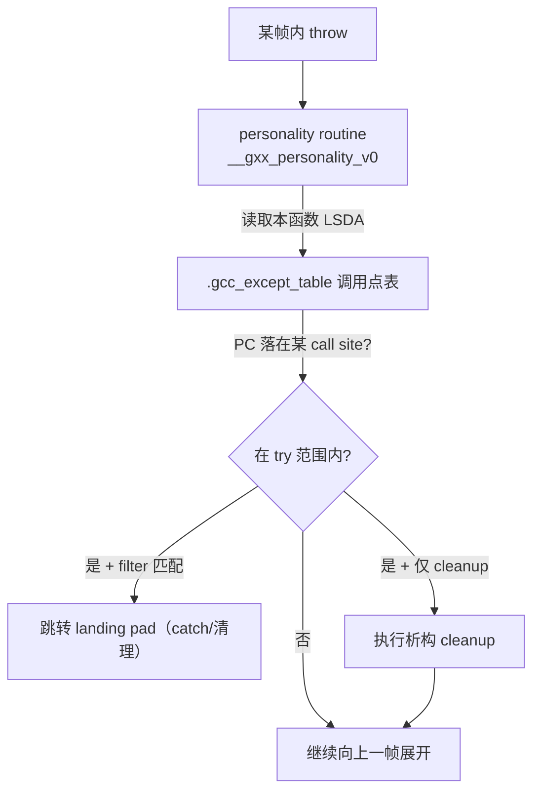

# 详解ELF文件(四十八).gcc_except_table节

`.gcc_except_table` 是 ELF 文件中用于存储 C++ 异常处理相关信息的节区。它也被称为 LSDA（Language Specific Data Area，语言特定数据区域），是异常展开过程中"决定如何 catch"的那张表。

## 1. 基本概念

`.gcc_except_table` 节包含与 try-catch-finally 控制流块相关的异常信息。它与 [[46.eh_frame节|.eh_frame]] 节配合使用：.eh_frame 负责"怎么逐帧展开栈"，而 .gcc_except_table 负责"在某一帧里，异常发生处是否在某个 try 块内、该跳到哪个 catch"。其角色类似于 Java 字节码中的异常表。

名称中的 "gcc" 表明这是 GCC 工具链为 C++ Itanium ABI 实现的数据区，Clang（使用相同 ABI 的情况下）同样生成此格式的数据，但放在同名节中。

## 2. 主要功能

- 存储函数中可以捕获哪些异常的信息
- 记录 try-catch 块的位置和范围（call site table）
- 提供清理代码信息（如栈展开时调用对象析构函数）
- 在异常处理过程中协助运行时系统找到合适的着陆垫（landing pad）

## 3. LSDA 完整格式详解

`.gcc_except_table` 节（即 LSDA）的完整结构分为四层，从头到尾依次为：LSDA 头部 → 调用点表（Call Site Table）→ 动作表（Action Table）→ 类型表（Type Table，反向存储）。

### 3.1 LSDA 头部

```c
/* LSDA 头部（伪代码） */
struct LSDA_header {
    uint8_t  lpStartEncoding;   // landing pad 基址的编码（DW_EH_PE_*）
    // 若 lpStartEncoding != DW_EH_PE_omit：
    encoded  lpStart;           // landing pad 基址（通常省略，基址从 FDE PC_begin 取）
    uint8_t  ttypeEncoding;     // 类型表（@TType）条目编码（DW_EH_PE_*）
    // 若 ttypeEncoding != DW_EH_PE_omit：
    uleb128  ttypeOffset;       // 从此字段末尾到类型表末尾的字节偏移
    uint8_t  callSiteEncoding;  // 调用点表条目编码（DW_EH_PE_*）
    uleb128  callSiteTableSize; // 调用点表总字节数
};
```

**lpStartEncoding**：通常为 `DW_EH_PE_omit`（0xff），省略 lpStart 字段，landing pad 基址由 `_Unwind_GetRegionStart(ctx)` 取得（即当前 FDE 的 PC_begin）。

**ttypeEncoding**：类型表中每个 `std::type_info*` 指针的编码方式。常见值 `DW_EH_PE_absptr`（8字节绝对指针）或 `DW_EH_PE_indirect|DW_EH_PE_pcrel|DW_EH_PE_sdata4`（间接 pcrel 4字节，用于 PIC）。值为 `DW_EH_PE_omit` 表示无类型表（无 catch 只有 cleanup）。

**ttypeOffset**：ULEB128，从该字段末尾到类型表末尾（不是开头！）的字节偏移。类型表是从高地址向低地址增长的（反向存储），需要通过此偏移定位其末尾地址，再向前读取条目。

**callSiteEncoding**：调用点表中偏移量/长度字段的编码，通常 `DW_EH_PE_uleb128` 或 `DW_EH_PE_udata4`。

**callSiteTableSize**：调用点表的总字节数，用于确定表的边界。

### 3.2 调用点表（Call Site Table）

调用点表紧跟 LSDA 头部，是 LSDA 的核心结构，每个条目对应一段代码范围：

```c
struct CallSiteEntry {
    encoded  cs_start;      // 本 call site 起始地址相对 lpStart 的偏移
    encoded  cs_len;        // 本 call site 长度（字节数）
    encoded  cs_lp;         // landing pad 相对 lpStart 的偏移（0 = 无 landing pad）
    uleb128  cs_action;     // 动作索引（0 = cleanup only，正数 = 动作表 1-based 索引）
};
```

**cs_start / cs_len**：描述一段代码范围 `[lpStart + cs_start, lpStart + cs_start + cs_len)`。若当前 PC 落在此范围内，则本 call site 适用。

**cs_lp**：若为 0，表示此范围内无 landing pad（异常直接向上传播，若有析构则需要通过其他 call site 处理）。非 0 则为跳转目标相对 lpStart 的偏移，即 catch 块或 cleanup 代码的入口。

**cs_action**：
- 0：本 call site 只做 cleanup（如析构局部对象），无 catch 匹配。personality 调用 cleanup 后继续展开。
- 非 0：指向动作表中的第一个动作条目（1-based，实际偏移 = cs_action - 1）。

### 3.3 动作表（Action Table）

动作表紧跟调用点表，描述每个 call site 可能匹配的异常类型链（链表结构）：

```c
struct ActionEntry {
    sleb128  filter;     // 过滤值（见下方说明）
    sleb128  next;       // 到链中下一个 ActionEntry 的字节偏移（0 = 链结束）
};
```

**filter 字段的含义**：

| filter 值 | 含义 |
|-----------|------|
| 0 | cleanup（析构），无类型匹配，总是执行 |
| 正整数 n | 匹配类型：类型表中第 n 个条目（`@TType[-n]`，从类型表末尾倒数第 n 个） |
| 负整数 m | 异常规格（exception specification）：仅允许类型表中特定条目集合通过；`m` 指向异常规格表 |

**next 字段**：从当前 ActionEntry 的 next 字段地址加上 next 值，得到下一个 ActionEntry 的地址。next == 0 表示链结束。一个 landing pad 对应的多个 catch 子句形成一条单向链，personality routine 沿链逐个尝试类型匹配。

### 3.4 类型表（Type Table / @TType）

类型表存储 `catch` 子句捕获的类型指针（`std::type_info*`）。重要特征：**类型表从 LSDA 末尾向低地址方向增长**（反向存储），`ttypeOffset` 指向类型表末尾（即 LSDA 末尾）：

```
LSDA 内存布局（从低到高）：
  LSDA 头部
  调用点表
  动作表
  ... （空隙，字节填充）
  @TType[n]    ← 第 n 个类型（最后一个 catch 的类型）
  @TType[n-1]
  ...
  @TType[1]    ← 第 1 个类型（第一个 catch 的类型）
  @TType[0]    ← 通常为 NULL（catch(...)）
  ← ttypeOffset 指向这里（类型表末尾，也是 LSDA 的末尾）
```

动作表中 filter=n 的条目对应 `@TType[-n]`（即从类型表末尾向前偏移 n 个条目位置）。

**`catch (...)` 的处理**：filter=0 或类型表条目为 NULL 指针（`nullptr`）时，表示捕获所有异常类型（不进行类型匹配）。

### 3.5 完整 LSDA 布局示意图

```
+---------------------------+  <-- LSDA 起始（FDE 的 LSDA 指针所指）
| lpStartEncoding           |  1字节
| [lpStart]                 |  可选，通常省略
| ttypeEncoding             |  1字节
| [ttypeOffset]             |  ULEB128，可选
| callSiteEncoding          |  1字节
| callSiteTableSize         |  ULEB128
+---------------------------+  <-- 调用点表开始
| CallSiteEntry[0]          |  cs_start, cs_len, cs_lp, cs_action
| CallSiteEntry[1]          |
| ...                       |
+---------------------------+  <-- 动作表开始（紧跟调用点表）
| ActionEntry[0]            |  filter, next
| ActionEntry[1]            |
| ...                       |
+---------------------------+
| （填充）                  |
+---------------------------+  <-- 类型表（反向，向低地址生长）
| @TType[N]                 |  ← 低地址（此处为第 N 个类型条目）
| ...                       |
| @TType[1]                 |
| @TType[0] (NULL for ...)  |
+---------------------------+  <-- LSDA 末尾（ttypeOffset 所指）
```

## 4. 工作原理与两阶段展开



### 4.1 搜索阶段（Phase 1）

personality routine（`__gxx_personality_v0`）以 `actions == _UA_SEARCH_PHASE` 被调用：

1. 调用 `_Unwind_GetIP(ctx)` 获取当前帧的 PC
2. 调用 `_Unwind_GetLanguageSpecificData(ctx)` 取 LSDA 指针
3. 解析 LSDA 头部，确定 lpStart = `_Unwind_GetRegionStart(ctx)`
4. 线性扫描调用点表，寻找 `lpStart + cs_start <= PC < lpStart + cs_start + cs_len` 的条目
5. 若找到且 cs_action != 0，遍历动作链，逐个用 `__cxa_begin_catch` 逻辑做类型匹配（`std::type_info::__do_catch`）
6. 任意动作匹配则返回 `_URC_HANDLER_FOUND`；均不匹配则返回 `_URC_CONTINUE_UNWIND`

### 4.2 清理阶段（Phase 2）

以 `actions == _UA_CLEANUP_PHASE | _UA_HANDLER_FRAME`（处理帧）或 `_UA_CLEANUP_PHASE`（清理帧）调用：

1. 再次查找 LSDA，定位 call site 条目
2. 若为处理帧（已在 Phase 1 标记为 HANDLER_FOUND）：
   - `_Unwind_SetGR(ctx, __builtin_eh_return_data_regno(0), exception_object)` 传递异常对象
   - `_Unwind_SetGR(ctx, __builtin_eh_return_data_regno(1), switchValue)` 传递 catch 分支选择值
   - `_Unwind_SetIP(ctx, lpStart + cs_lp)` 设置跳转目标为 landing pad
   - 返回 `_URC_INSTALL_CONTEXT`，展开器据此跳入 landing pad
3. 若为清理帧（cs_action == 0 或存在 cleanup 动作）：
   - 同样设置 IP 为 cleanup landing pad，执行析构代码
   - Cleanup 代码末尾调用 `_Unwind_Resume(exn)` 继续展开

### 4.3 personality routine 返回值含义

| 返回值 | 含义 |
|--------|------|
| `_URC_CONTINUE_UNWIND` | 本帧无处理器，继续向上 |
| `_URC_HANDLER_FOUND` | 搜索阶段找到 catch 处理器 |
| `_URC_INSTALL_CONTEXT` | 清理阶段完成，已设置目标 IP，跳入 landing pad |
| `_URC_FATAL_PHASE1_ERROR` | 搜索阶段致命错误 |
| `_URC_FATAL_PHASE2_ERROR` | 清理阶段致命错误 |
| `_URC_END_OF_STACK` | 已到栈顶，未找到处理器，调用 `std::terminate()` |

## 5. 具体示例：C++ 代码到 LSDA 的对应关系

### 5.1 带多个 catch 的函数

```cpp
void foo() {
    try {
        may_throw();     // call site 1
    } catch (int& e) {
        handle_int(e);   // landing pad 1 分支 1
    } catch (std::runtime_error& e) {
        handle_re(e);    // landing pad 1 分支 2
    }
    
    try {
        may_throw2();    // call site 2
    } catch (...) {
        cleanup();       // landing pad 2（catch-all）
    }
}
```

对应的 LSDA 结构（伪表示）：

```
调用点表：
  cs[0]: start=A, len=B, lp=LP1, action=1  (may_throw 的调用范围)
  cs[1]: start=C, len=D, lp=LP2, action=3  (may_throw2 的调用范围)
  cs[2]: start=E, len=F, lp=0,   action=0  (catch 块自身，无 landing pad)

动作表：
  action[1]: filter=1, next=+N  (匹配 int)
  action[2]: filter=2, next=0   (匹配 runtime_error，链结束)
  action[3]: filter=0, next=0   (catch-all，无类型匹配)

类型表：
  @TType[2] = &typeid(std::runtime_error)
  @TType[1] = &typeid(int)
```

### 5.2 带 cleanup（析构函数）的函数

```cpp
void bar() {
    std::string s = "hello";  // 局部对象，异常时需析构
    may_throw();
}
```

生成的 LSDA 调用点表中，`may_throw()` 对应的 call site 条目 cs_action=0（cleanup only），landing pad 指向 `s` 的析构 cleanup 代码。Personality routine 在 Phase 2 执行 cleanup，完成后调用 `_Unwind_Resume` 继续向上展开。

## 6. 与其他节的关系

- 与 [[46.eh_frame节|.eh_frame]] 和 [[47.eh_frame_hdr节|.eh_frame_hdr]] 协作完成异常处理：.eh_frame 知道"如何回到调用者"，.gcc_except_table 知道"回到哪里（landing pad）"
- 通常作为只读数据存在（常并入只读段），节属性 SHF_ALLOC 无 SHF_WRITE
- 与 C++ 的 `__gxx_personality_v0` 符号紧密相关，后者是 personality routine，负责语言相关的异常处理逻辑
- `_Unwind_GetLanguageSpecificData(ctx)` 通过 FDE 的 augmentation data（'L' 字符）取得本节中对应函数的 LSDA 指针

## 7. 实战：查看 .gcc_except_table

### 7.1 基本查看命令

```bash
readelf -x .gcc_except_table a.out      # 十六进制查看（最原始）
objdump -s -j .gcc_except_table a.out   # objdump 十六进制 + ASCII
readelf -S a.out | grep gcc_except      # 查看节属性（大小、偏移）
```

### 7.2 使用 llvm-readobj 解析 LSDA（更友好）

```bash
llvm-readobj --elf-output-style=GNU --exception-tables a.out
# 部分版本的 llvm-readobj 可以解析 .gcc_except_table 并按人类可读格式输出
```

### 7.3 配合 readelf 查看 FDE 的 LSDA 指针

```bash
readelf --debug-dump=frames a.out | grep -A5 "FDE"
# 在 FDE 的 augmentation data 中找到 LSDA 指针
```

```text
# 示例输出（代表性，非本机实跑）
FDE cie=00000000 pc=004006b0..004007c0
  Augmentation data:     c0 07 40 00 00 00 00 00   <- LSDA 指针指向 .gcc_except_table
  DW_CFA_advance_loc: 4 to 004006b4
  ...
```

### 7.4 手动解码 LSDA 示例（Python + pyelftools）

```python
# 示例：从 .gcc_except_table 中提取 call site 表
from elftools.elf.elffile import ELFFile
import struct, io

def read_uleb128(data, offset):
    result, shift = 0, 0
    while True:
        byte = data[offset]; offset += 1
        result |= (byte & 0x7f) << shift
        if not (byte & 0x80):
            break
        shift += 7
    return result, offset

with open('a.out', 'rb') as f:
    elf = ELFFile(f)
    sect = elf.get_section_by_name('.gcc_except_table')
    if sect:
        data = sect.data()
        print(f"Section size: {len(data)} bytes")
        # 读取 lpStartEncoding
        lp_enc = data[0]
        print(f"lpStartEncoding: 0x{lp_enc:02x}")
```

## 8. 特殊说明与边界情况

### 8.1 -fno-exceptions 的影响

GCC 编译器在编译带有异常处理的 C++ 程序时会自动生成此节。如果没有使用异常处理机制，或使用 `-fno-exceptions` 禁用了异常，则不会生成此节：

```bash
gcc -fno-exceptions foo.cpp -o foo  # .gcc_except_table 不生成
                                    # 但 .eh_frame 依然生成（用于 backtrace）
```

### 8.2 noexcept 与 nothrow 的影响

- `noexcept` 函数：若真的抛出异常，`std::terminate()` 被调用，GCC 会省略该函数的 LSDA（因为不需要 catch 路径）
- 但若函数内部有局部对象需要析构（cleanup），即使是 `noexcept`，GCC 可能仍生成 LSDA（cleanup 条目）

### 8.3 .gcc_except_table 可能分散

`.gcc_except_table` 中的数据按函数分散存储，有时多个函数的 LSDA 数据连续排列，有时因链接器合并策略被分拆到不同位置。personality routine 通过 FDE 中的 LSDA 指针精确定位每个函数的 LSDA，不依赖数据在节内的排列顺序。

总的来说，`.gcc_except_table` 是 C++ 异常处理机制在 ELF 文件层面的具体体现，它是连接编译期（try-catch 布局）与运行期（栈展开找 catch）的关键桥梁。

## 相关阅读

- **栈展开主节**：[[46.eh_frame节]]
- **展开加速索引**：[[47.eh_frame_hdr节]]
- 上一篇：[[47.eh_frame_hdr节]] ｜ 下一篇：[[49.jcr节]]
