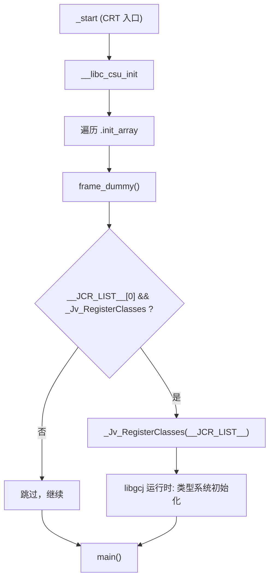

# 详解ELF文件(四十九).jcr节

`.jcr` 节（Java Class Registration section）是 ELF 文件中的一个特殊节区，主要用于 Java 相关的初始化和类注册。它是一个历史遗留节，现代工具链已基本不再生成。

## 1. 基本概念

`.jcr` 节全称是 "Java Class Registration"，即 Java 类注册节。它主要出现在使用 GCJ（GNU Compiler for Java）或与 JNI（Java Native Interface）混合编译的程序中，用于把本地代码里编译进来的 Java 类登记到运行时。

### 1.1 历史背景：GCJ 简史

GCJ（GNU Compiler for Java）是 GCC 工具链的一个子项目，目标是将 Java 语言编译为原生机器码而非 JVM 字节码，从而绕过 JVM 启动开销、提升运行速度，并与 C/C++ 代码无缝互操作。GCJ 于 1998 年前后被集成进 GCC，使用 GNU Classpath 作为标准类库的开源实现。

GCJ 编译 Java 源文件（`.java`）或字节码文件（`.class`/`.jar`）并生成标准 ELF 目标文件，这些目标文件中的 Java 类在运行前须向 GCJ 运行时（`libgcj`）登记，以建立 Java 反射所需的元数据。

**GCJ 演进时间线：**

| 时期 | 事件 |
|------|------|
| 1998 年前后 | GCJ 纳入 GCC 主线 |
| 2001 年 | Anthony Green 提交 `.jcr` 机制补丁，取代逐类单独注册构造函数 |
| 2012 年 | `TARGET_USE_JCR_SECTION` 宏引入，允许非 Java 目标关闭 JCR 节支持 |
| ~2015 年 | GCJ 开发停滞，进入维护模式 |
| 2016-09-30 | GCJ 从 GCC trunk 移除 |
| GCC 7.1（2017）| 正式对外宣告 GCJ 不再是 GCC 的一部分 |

> GCJ 被移除的直接原因是 Sun/Oracle 于 2006 年将 JDK 以 GPL 协议开源为 OpenJDK，GNU Classpath 失去了存在的必要性，GCJ 随之失去社区驱动力。

### 1.2 早期的逐类注册方式（前 .jcr 时代）

在 `.jcr` 机制出现之前，GCJ 为每个编译单元生成一个独立的**注册构造函数**，这个构造函数逐一调用 `_Jv_RegisterClass`（注意：单数，不带 `es`）。若一个 `.java` 文件中包含 10 个类，就会为该文件生成一个构造函数，在程序启动时将 10 个类指针一一传递给运行时。

这种方式的缺点在于：
- 每个编译单元都产生额外的函数代码与调试信息，膨胀明显；
- 调试信息、展开信息（`.eh_frame`）为每个微小构造函数都分配条目，浪费 linker 资源；
- 总体而言，剥离后的 `libgcj` 在 x86 Linux 上比新方案大约 110 KB。

Anthony Green 在 2001 年的补丁中将这些零散的注册函数整合为一张集中的指针表——即 `.jcr` 节——由 `crtstuff.c` 的 `frame_dummy` 统一处理，大幅减少了代码量。

## 2. 主要功能

- 存储 Java 类注册信息（一张待注册类的指针列表）
- 支持 GCJ/JNI 环境下 Java 类与本地代码的交互
- 在程序初始化阶段（与构造函数同期）注册 Java 类

## 3. 数据结构

- 节类型：`SHT_PROGBITS`
- 节标志：`SHF_ALLOC | SHF_WRITE`
- 内容是一张指针数组，符号 `__JCR_LIST__` 标记其起始，`__JCR_END__` 标记其结尾，以 NULL 结尾

### 3.1 节头属性

| 字段 | 值 |
|------|----|
| `sh_type` | `SHT_PROGBITS` (1) |
| `sh_flags` | `SHF_ALLOC \| SHF_WRITE` |
| `sh_addralign` | 等于指针大小（4 或 8） |
| `sh_entsize` | 0（无固定条目大小） |

### 3.2 符号定义（crtstuff.c 中）

`__JCR_LIST__` 定义于 `crtbegin.o` 的 `.jcr` 贡献段开头：

```c
STATIC void *__JCR_LIST__[]
  __attribute__ ((unused, section(JCR_SECTION_NAME), aligned(sizeof(func_ptr))))
  = { 0 };
```

`__JCR_END__` 定义于 `crtend.o` 的 `.jcr` 贡献段末尾：

```c
STATIC void *__JCR_END__[]
  __attribute__ ((unused, section(JCR_SECTION_NAME)))
  = { 0 };
```

链接器将所有目标文件的 `.jcr` 贡献段合并后，`__JCR_LIST__` 是整个数组的起始，`__JCR_END__` 紧随数组末尾（值为 NULL）。实际待注册的类指针由编译器在每个 Java 编译单元的 `.jcr` 输入节中填入。

### 3.3 内存布局示例

```
__JCR_LIST__  →  [ NULL ]          ← 来自 crtbegin.o，占位（起始哨兵）
                  [ &ClassA ]       ← 来自 a.o
                  [ &ClassB ]
                  [ &ClassC ]       ← 来自 b.o
                  [ NULL ]          ← 来自 crtend.o，NULL 终止符 (__JCR_END__)
```

运行时通过 `__JCR_LIST__[0]` 非空判断，决定是否触发注册。

## 4. 结构图示

.jcr 的处理时机与构造函数同期，由启动代码（crtstuff 的 `frame_dummy`）触发：


## 5. 在 GCC 中的实现

### 5.1 crtstuff.c 与 frame_dummy

在 GCC 中，`.jcr` 节与 `crtstuff.c` 文件相关联。这个文件是 GCC 运行时系统的一部分，用于支持 C++ 文件作用域对象的构造和析构，同时也负责设置异常处理和 Java 类注册（JCR）信息。

`frame_dummy` 函数是 `crtstuff.c` 中最关键的启动钩子，它被放进 `.init_array` 节（或早期的 `.init` 节），在 `main` 执行前被调用。其中处理 JCR 的核心片段如下（GCC 4.x 时代）：

```c
static void __attribute__((used))
frame_dummy (void)
{
#ifdef USE_EH_FRAME_REGISTRY
  /* 注册 .eh_frame 中的异常处理信息 */
  static struct object object;
  if (__register_frame_info)
    __register_frame_info (__EH_FRAME_BEGIN__, &object);
#endif

#ifdef JCR_SECTION_NAME
  /* 若 .jcr 列表非空且运行时可用，则批量注册 Java 类 */
  if (__JCR_LIST__[0] && _Jv_RegisterClasses)
    _Jv_RegisterClasses (__JCR_LIST__);
#endif /* JCR_SECTION_NAME */
}
```

> 注意：`_Jv_RegisterClasses` 声明为 `weak`（弱引用），允许非 Java 程序在不链接 `libgcj` 的情况下正常构建——此时该符号为 NULL，条件判断直接跳过注册步骤。

```c
extern void _Jv_RegisterClasses (void *classes) TARGET_ATTRIBUTE_WEAK;
```

### 5.2 frame_dummy 进入 .init_array

早期的 `frame_dummy` 通过 `.init` 节触发，后来被移入 `.init_array`，这样做的优点是：
- 调用约定更统一（`void (*)()`，无需 `.init` 的 epilog 处理）；
- 链接顺序不依赖 `crti.o`/`crtn.o` 对 `.init` 节的拼接机制；
- 与 `.init_array` 机制（见 [[43.init_array节]]）保持一致。

`frame_dummy` 通过如下属性将自身注册到 `.init_array`：

```c
void (*__frame_dummy_init_array_entry[]) (void)
  __attribute__ ((section (".init_array"), aligned (sizeof (void *))))
  = { frame_dummy };
```

### 5.3 TARGET_USE_JCR_SECTION 宏

GCC 2012 年引入 `TARGET_USE_JCR_SECTION`（取代裸 `JCR_SECTION_NAME` 检查），允许嵌入式/裸机目标通过 `#define TARGET_USE_JCR_SECTION 0` 彻底关闭 JCR 支持，避免 `.jcr` 节出现在单片机固件中占用 RAM。

GCC 7 清除 GCJ 时，`JCR_SECTION_NAME` 和 `TARGET_USE_JCR_SECTION` 均被加入 `gcc/system.h` 的**废弃宏（poisoned macros）**列表，使用时会触发编译告警。

## 6. 与其他节的关系

### 6.1 与 .init_array 的关系

`.jcr` 和 [[43.init_array节|.init_array]] 在启动时机上高度相关：

| 方面 | .jcr | .init_array |
|------|------|-------------|
| 触发者 | `frame_dummy`（本身在 `.init_array` 中） | `__libc_csu_init` / `_start` |
| 内容 | Java 类指针 | 通用 `void (*)(void)` 函数指针 |
| 类型 | `SHT_PROGBITS` | `SHT_INIT_ARRAY` |
| 现代化 | 已绝迹 | 现行标准 |

可以说，`.jcr` 是搭车于 `.init_array`/`.init` 机制运行的，而非独立的启动框架。

### 6.2 与其他节的关系总览

1. [[45.ctors节|.ctors]] 节：同为启动期处理的地址列表，处理时机相近
2. [[50.dtors节|.dtors]] 节：与构造相对应的析构函数指针列表
3. [[41.init节|.init]] 节：.jcr 的注册动作在初始化阶段被触发

## 7. 实战：查看 .jcr

```bash
readelf -S a.out | grep jcr             # 查看节信息
readelf -s a.out | grep JCR             # 查看 __JCR_LIST__ 符号
objdump -s -j .jcr a.out               # 查看内容（十六进制转储）
```

在含有 `.jcr` 节的老旧二进制中，输出示例如下：

```text
# 示例输出（代表性，非本机实跑）
$ readelf -S a.out | grep jcr
  [12] .jcr   PROGBITS  0804935c 00035c 000004 00  WA  0  0  4

$ readelf -s a.out | grep JCR
    31: 0804935c  0 OBJECT  LOCAL  DEFAULT  12 __JCR_LIST__
    32: 08049360  0 OBJECT  LOCAL  DEFAULT  12 __JCR_END__

$ objdump -s -j .jcr a.out
Contents of section .jcr:
 804935c 00000000                             ....
```

若 `.jcr` 不存在（现代工具链），上述命令均无输出。

## 8. 工作原理与现状

### 8.1 完整启动时序



### 8.2 与 CNI（Compiled Native Interface）的关系

GCJ 还提供了 CNI（Compiled Native Interface），作为 JNI 的高性能替代，允许 C++ 方法直接操作 GCJ 编译的 Java 对象而无需 JNI 封装开销。使用 CNI 的代码同样依赖 `.jcr` 机制确保 Java 类在本地方法调用前已完成注册。

### 8.3 现状总结

> 现状：随着 GCJ 在 GCC 7 中被移除，`.jcr` 节在现代 Linux 程序中几乎绝迹。了解它主要用于阅读老旧二进制或理解 crtstuff 启动机制。

| 状态维度 | 说明 |
|----------|------|
| GCC 支持 | GCC 6 及之前支持；GCC 7 起废弃 |
| 链接脚本 | 早期 GNU ld 脚本含 `KEEP (*(.jcr))`，现代版本已移除 |
| 现代二进制 | 几乎不含 `.jcr` 节，`frame_dummy` 中 JCR 路径已被条件编译移除 |
| 复活尝试 | GitHub 项目 `Zopolis4/gcj` 正在尝试将 GCJ 重整回 GCC，重新引入 `.jcr` 相关宏 |

总的来说，`.jcr` 节是连接 Java 和本地代码的历史性桥梁，虽然不像 `.text`、`.data` 那样常见，但在特定（且日渐稀少）的场景中有其作用。

## 相关阅读

- **同期处理的构造列表**：[[45.ctors节]]
- **触发它的初始化节**：[[41.init节]]
- **现代初始化机制**：[[43.init_array节]]
- 上一篇：[[48.gcc_except_table节]] ｜ 下一篇：[[50.dtors节]]
