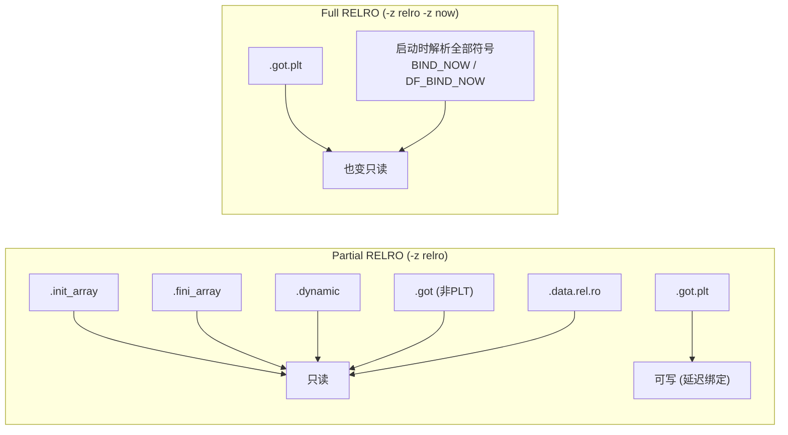

# 详解ELF文件(五十一).data.rel.ro节

`.data.rel.ro` 节（Read-Only Data After Relocation）是 ELF 文件中的一个特殊节区，用于存储在重定位完成后应设为只读的数据。它是 RELRO 安全机制的核心载体。

## 1. 基本概念

`.data.rel.ro` 节全称是 "Read-Only Data After Relocation"，它是一个特殊的数据节：包含需要重定位的初始化数据，但在重定位完成后会被设置为只读状态——兼顾"需要被动态链接器写入"与"运行期不可被攻击者篡改"两个看似矛盾的需求。

与 .rodata（链接时已知、无需重定位的只读数据）不同，`.data.rel.ro` 中的数据在链接时无法确定最终值，需要运行时动态链接器填入重定位后的地址；但一旦填写完毕，这些数据的语义就不应再改变（如 C++ 虚函数表、全局 const 指针等）。

## 2. 主要功能

- 存储需要重定位的初始化数据（如指向其它符号的常量指针、虚函数表等）
- 在程序加载和重定位完成后，将这部分数据设为只读，提高安全性
- 防止攻击者修改这些重要数据（特别是虚函数表改写攻击）
- 配合 PT_GNU_RELRO 程序头实现 RELRO 安全机制

## 3. 节的属性特征

```bash
# 示例输出（代表性，非本机实跑）
$ readelf -S a.out | grep data.rel.ro
  [17] .data.rel.ro      PROGBITS        0000000000003d60 002d60
       0000000000000050  0000000000000000  WA       0     0     8
```

| 属性 | 值 | 说明 |
|------|----|------|
| 节类型 | SHT_PROGBITS | 普通程序数据 |
| SHF_ALLOC | 是 | 加载到内存 |
| SHF_WRITE | 是（加载时） | 动态链接器需要写入重定位值 |
| SHF_EXECINSTR | 否 | 不含可执行代码 |
| 运行期权限 | 变为只读 | 经 mprotect 后不可写 |

注意：节头中 SHF_WRITE 仍置位，这是因为 ELF 节头描述的是静态属性。真正的运行期只读由 PT_GNU_RELRO 程序头 + 动态链接器的 mprotect 调用实现，是加载时动态施加的。

## 4. 放入 .data.rel.ro 的内容

### 4.1 C++ 虚函数表（vtable）

C++ 虚函数表是 `.data.rel.ro` 中最典型的内容。vtable 本身是一个函数指针数组，指针的值（虚函数地址）在链接时是相对偏移，需要加载时重定位为绝对地址；但 vtable 内容在运行期绝不应改变，因此非常适合放入 .data.rel.ro。

```cpp
// 以下 C++ 代码会产生 .data.rel.ro 中的 vtable
class Base {
public:
    virtual void foo() {}
    virtual void bar() {}
    virtual ~Base() {}
};

class Derived : public Base {
public:
    void foo() override {}
};
```

链接器将 `_ZTV4Base`（Base 的 vtable）和 `_ZTV7Derived` 放入 `.data.rel.ro`，其中每个虚函数指针条目均有重定位项。

### 4.2 含指针的全局 const 对象

```cpp
// 以下全局常量指向另一个符号，需要重定位
extern int g_value;
const int* const g_ptr = &g_value;    // 放入 .data.rel.ro

// 指向函数的全局常量指针
extern void callback();
void (* const g_cb)() = callback;     // 放入 .data.rel.ro
```

纯整数常量（如 `const int x = 42;`）不含指针，无需重定位，放入 `.rodata`。

### 4.3 GOT 的部分条目

在 Partial RELRO 下，不经过 PLT 的全局变量的 GOT 条目（`.got` 节，非 `.got.plt`）在重定位后被保护为只读。这些 GOT 条目由链接器安排落入 PT_GNU_RELRO 覆盖范围，其中不属于延迟绑定的部分与 `.data.rel.ro` 共同处于 RELRO 保护下。

### 4.4 .data.rel.ro.local

链接器有时还生成 `.data.rel.ro.local`，用于存储只被本翻译单元引用的重定位后只读数据（internal linkage 的 vtable、局部 const 指针等），可减少动态符号表体积。

```bash
# 示例输出（代表性，非本机实跑）
$ readelf -S a.out | grep data.rel
  [15] .data.rel.ro.local PROGBITS  ...
  [16] .data.rel.ro       PROGBITS  ...
```

## 5. RELRO 完整机制详解

### 5.1 PT_GNU_RELRO 程序头

RELRO 通过 PT_GNU_RELRO 程序头标识需要在重定位后设为只读的内存范围。

```bash
# 示例输出（代表性，非本机实跑）
$ readelf -l a.out | grep -A3 GNU_RELRO
  GNU_RELRO      0x0000000000002d60 0x0000000000003d60 0x0000000000003d60
                 0x00000000000002a0 0x00000000000002a0  R      0x1
```

PT_GNU_RELRO 的 p_vaddr 和 p_memsz 描述受保护内存范围，必须是页对齐的（向上取整），以便 mprotect 以整页粒度操作。

### 5.2 mprotect 调用时机

```
程序加载流程：
1. 内核将 LOAD 段（含 .data.rel.ro）映射为 PROT_READ|PROT_WRITE
2. 动态链接器（ld.so）解析并应用所有重定位，填写 .data.rel.ro 中的指针
3. 动态链接器读取 PT_GNU_RELRO，调用：
      mprotect(page_start, page_aligned_size, PROT_READ)
4. 之后 .data.rel.ro 所在页变为只读，任何写入触发 SIGSEGV
```

关键：mprotect 发生在 `_dl_relocate_object()` 完成之后、用户代码执行之前（main 被调用前）。

### 5.3 Partial RELRO vs Full RELRO



| RELRO 级别 | 链接器标志 | .got 保护 | .got.plt 保护 | 延迟绑定 | 启动开销 |
|------------|------------|-----------|---------------|----------|---------|
| No RELRO | 无 | 否 | 否 | 保留 | 无 |
| Partial RELRO | `-z relro` | 是 | 否 | 保留 | 微小 |
| Full RELRO | `-z relro -z now` | 是 | 是 | 关闭 | 明显增加（所有符号预绑定） |

Partial RELRO 是 GCC 的**默认配置**（现代 Linux 发行版几乎都默认启用）。Full RELRO 需显式指定，Fedora 23+ 的所有系统包均编译为 Full RELRO。

### 5.4 安全意义

RELRO 防御的核心威胁是 **GOT 改写攻击**：攻击者利用任意写漏洞覆盖 `.got.plt` 中的函数指针，劫持控制流。Full RELRO 使 `.got.plt` 在运行时不可写，彻底消除此类攻击面。

此外，保护 `.data.rel.ro` 中的 vtable 可防御 **vtable 改写攻击**（覆盖 C++ 虚函数指针）。

即使启用 Full RELRO，仍存在绕过路径：
- 已加载共享库的 GOT 只享有 Partial RELRO（因为 libc 等库自身的 GOT 不在主程序的 PT_GNU_RELRO 范围内）
- 可写的 `.data`、`.bss` 中的函数指针仍是攻击面
- glibc < 2.34 的 `__malloc_hook`、`__free_hook` 等钩子仍可写

## 6. 结构图示


## 7. 与其他节的关系

1. 与 [[07.data节|.data]]：`.data` 在运行时始终可写；`.data.rel.ro` 重定位后变只读。
2. 与 [[06.rodata节|.rodata]]：不需重定位的只读数据放 `.rodata`，需重定位的放 `.data.rel.ro`。
3. 与 [[17.got节|.got]]：`.got`（非 PLT 部分）在 Partial RELRO 下也进入只读保护范围。
4. 与 [[21.got.plt节|.got.plt]]：Full RELRO 才将 `.got.plt` 也置只读。
5. 与 [[18.dynamic节|.dynamic]]：`.dynamic` 段也在 PT_GNU_RELRO 保护范围内（Partial RELRO 即保护）。
6. 与 [[43.init_array节|.init_array]] / [[44.fini_array节|.fini_array]]：这两个节也在 PT_GNU_RELRO 范围，防止函数指针被覆盖。

## 8. 实战：查看 .data.rel.ro 与 RELRO

### 8.1 查看节信息

```bash
readelf -S a.out | grep -E "data.rel|relro"
readelf -l a.out | grep GNU_RELRO        # 查看 RELRO 段
readelf -d a.out | grep BIND_NOW         # 检测 Full RELRO
```

```text
# 示例输出（代表性，非本机实跑）
$ readelf -l a.out | grep GNU_RELRO
  GNU_RELRO  0x002dd0 0x...3dd0 0x...3dd0 0x000230 0x000230 R   0x1
```

### 8.2 使用 checksec 检测 RELRO 级别

```bash
checksec --file=a.out
# 或 pwntools 附带的 checksec
python3 -c "import pwn; print(pwn.ELF('./a.out').checksec())"
```

```text
# 示例输出（代表性，非本机实跑）
$ checksec --file=a.out
[*] '/path/to/a.out'
    Arch:     amd64-64-little
    RELRO:    Full RELRO
    Stack:    Canary found
    NX:       NX enabled
    PIE:      PIE enabled
```

### 8.3 查看 vtable 在 .data.rel.ro 中的布局

```bash
readelf -x .data.rel.ro a.out           # 十六进制查看
nm -n a.out | grep _ZTV                 # 查找 vtable 符号
objdump -d a.out | grep -A5 "_ZTV"      # 反汇编查看 vtable 引用
```

### 8.4 编译时控制 RELRO 级别

```bash
# Partial RELRO（GCC 默认）
gcc -Wl,-z,relro  -o a.out a.c

# Full RELRO
gcc -Wl,-z,relro,-z,now -o a.out a.c

# 关闭 RELRO（不推荐，仅用于分析对比）
gcc -Wl,-z,norelro -o a.out a.c
```

## 9. 实际意义

在现代 Linux 系统中，大多数 GCC 编译的程序默认启用 Partial RELRO，其中就包括 `.data.rel.ro` 的处理。它通过"重定位后置只读"提高安全性，特别是在防止 GOT 改写等内存攻击方面，是现代 ELF 安全机制的关键实现之一。

对 C++ 程序而言，`.data.rel.ro` 中存储的 vtable 是面向对象多态机制的基础，一旦被篡改将导致任意代码执行；RELRO 对 vtable 的保护是抵御 C++ 特定攻击（如 vtable hijacking）的重要防线。

## 相关阅读

- **被保护的对象**：[[17.got节]]、[[21.got.plt节]]、[[18.dynamic节]]
- **可写数据对比**：[[07.data节]]、[[06.rodata节]]
- **被保护的初始化数组**：[[43.init_array节]]、[[44.fini_array节]]
- 上一篇：[[50.dtors节]] ｜ 下一篇：[[52.comment节]]
