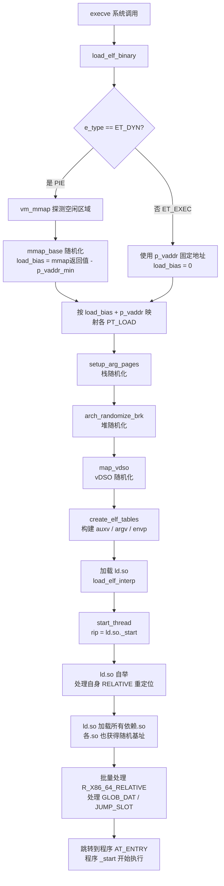

# 详解ELF文件(五十四).ELF与ASLR与PIE全景

> [!abstract] TL;DR
> ASLR（地址空间布局随机化）由内核实施，PIE（位置无关可执行文件）是编译器层面的配合——只有两者同时启用，可执行文件的代码段才能随机化。内核通过 mmap 基址随机化为 ET_DYN 类型的 PIE 选择加载地址；PIE 依赖大批 `R_X86_64_RELATIVE` 重定位在 ld.so 启动阶段完成自举。`mmap_min_addr`、`/proc/<pid>/maps`、vDSO 随机化等机制共同构成 Linux 的多层地址随机化体系；信息泄漏（info-leak）攻击通过刺探某一随机化区域的基址，再推算其他区域，是绕过 ASLR 的核心手法。

## 概述与定位

地址空间布局随机化（ASLR，Address Space Layout Randomization）是现代 Linux 内核最重要的漏洞利用缓解手段之一。其核心思想是：每次进程启动时，将代码、堆、栈、共享库等区域映射到随机选择的虚拟地址，使攻击者无法通过硬编码地址完成 ROP（Return-Oriented Programming）或 GOT 覆写等利用手法。

然而，内核的 ASLR 能力和 ELF 文件的格式特性之间存在深刻的耦合：

- **ET_EXEC 类型**的普通可执行文件（非 PIE）在链接时地址已固定，ASLR 对其代码段**无效**。
- **ET_DYN 类型**的 PIE 可执行文件，每次加载到内核随机分配的基址，代码段才真正随机化。
- **共享库**（`.so`）天生就是 ET_DYN，其加载地址随 mmap 基址随机化而随机。

因此，理解 ASLR 必须同时理解 ELF 文件类型、PIE 编译选项、动态链接器的重定位机制，以及内核的地址分配算法。本篇从 ELF 格式层面出发，完整展开这套机制，并分析其防御局限性。

## 原理与机制

### ELF 文件类型与可随机化性

ELF 文件头中的 `e_type` 字段决定了文件的本质类型，这是 ASLR 能否作用于代码段的关键：

| e_type | 数值 | 含义 | 代码段可随机化？ |
|--------|------|------|--------------|
| ET_NONE | 0 | 无类型 | - |
| ET_REL | 1 | 可重定位文件（.o） | - |
| ET_EXEC | 2 | 可执行文件（非 PIE） | **否**——链接时地址固定 |
| ET_DYN | 3 | 共享目标/PIE 可执行文件 | **是**——内核动态分配基址 |
| ET_CORE | 4 | 核心转储文件 | - |

PIE 可执行文件被编译为 `e_type = ET_DYN`，与共享库的 ELF 类型完全相同，这意味着内核用同样的代码路径加载它们，共享库加载机制天然支持随机化基址。

**ET_EXEC 的地址固定**：链接器为 ET_EXEC 分配固定的虚拟地址（x86-64 默认从 `0x400000` 开始），写入每个 `PT_LOAD` 段的 `p_vaddr`。内核加载时使用 `MAP_FIXED` 精确映射到这些地址——ASLR 无法干预。

**ET_DYN 的地址浮动**：ET_DYN 文件的 `PT_LOAD` 段 `p_vaddr` 是**相对偏移**，内核（或 ld.so）选定 `load_bias`（加载偏移量）后，实际地址 = `load_bias + p_vaddr`。

### PIE 编译与代码生成

PIE 的编译器标志：
```bash
gcc -fpie -pie source.c -o prog_pie    # 生成 PIE（推荐写法）
gcc -fPIE -pie source.c -o prog_pie    # 大写 PIE：适用于共享库场景的更保守代码
gcc source.c -o prog_non_pie           # 默认生成非 PIE（某些发行版改了默认值）
```

`-fpie` 使编译器生成**位置无关代码（PIC）**：

- **全局变量访问**：通过 `%rip` 相对寻址到 GOT（Global Offset Table）
- **函数调用**：本模块内的调用用 `%rip` 相对 `call` 指令；跨模块调用通过 PLT
- **立即数地址**：不再硬编码绝对地址，改用 PC 相对偏移

```asm
; 非 PIE（ET_EXEC）：全局变量访问
mov eax, DWORD PTR [0x601040]     ; 硬编码绝对地址

; PIE（ET_DYN）：全局变量通过 RIP 相对 + GOT
lea rax, [rip + _GLOBAL_OFFSET_TABLE_]
mov rdx, QWORD PTR [rax + global_var@GOTPCREL]
mov eax, DWORD PTR [rdx]
```

### ET_DYN 基址随机化：内核选基址算法

内核为 ET_DYN 选择加载基址的过程发生在 `load_elf_binary` 中：

```c
// 简化的内核逻辑（fs/binfmt_elf.c）
if (loc->elf_ex.e_type == ET_DYN) {
    // 为整个 ELF 找一块连续虚拟地址区域
    // 大小 = 最后一个 PT_LOAD 段末尾 - 第一个 PT_LOAD 段起始
    total_size = phdr_addr_max - phdr_addr_min;
    
    // 通过 mmap 系统调用找空闲区域（PROT_NONE 探测性映射）
    // 内核的 mmap 地址分配器会在 mmap_base 附近选地址
    // mmap_base 本身已经被 ASLR 随机化（randomize_va_space >= 1）
    load_addr = vm_mmap(NULL, 0, total_size,
                        PROT_NONE, MAP_PRIVATE|MAP_ANONYMOUS, 0);
    // load_bias = load_addr - 第一个 PT_LOAD 的 p_vaddr
    load_bias = ELF_PAGESTART(load_addr - phdr_addr_min);
    
    // 然后按实际段权限重新映射各 PT_LOAD 段
}
```

**mmap 基址的随机化位数**（x86-64 Linux）：
- 默认 `mmap_rnd_bits = 28`（高端 mmap 区域）
- 某些配置下 32 位兼容模式（`mmap_rnd_compat_bits`）= 8 位
- 实际随机量：`rnd = get_random_long() & ((1 << 28) - 1)`，左移 12 位（页大小），最大随机范围约 1TB

**ELF_ET_DYN_BASE**：PIE 可执行文件的 mmap 搜索起始点（与共享库加载区域分开）：
- x86-64：通常为 `0x555555555000`（即 TASK_SIZE 的某个比例），具体值与内核版本有关
- 每次启动因 mmap 随机化而在此基础上偏移

### PIE 的 R_X86_64_RELATIVE 大批重定位

PIE 可执行文件加载到随机基址后，ld.so 在控制权传递给程序之前，必须修正所有包含绝对地址的数据引用。这是通过 `.rela.dyn` 节中的 `R_X86_64_RELATIVE` 重定位类型批量完成的。

**R_X86_64_RELATIVE 重定位格式**：

```c
typedef struct {
    Elf64_Addr r_offset;  // 需要修正的内存地址（相对于加载基址）
    Elf64_Xword r_info;   // 类型 = R_X86_64_RELATIVE = 8，符号索引 = 0
    Elf64_Sxword r_addend; // 加数（链接时的虚拟地址）
} Elf64_Rela;

// 重定位公式：
// *(load_bias + r_offset) = load_bias + r_addend
// 即：将链接时地址 r_addend 加上运行时基址偏移 load_bias
```

**为什么 PIE 有大量 RELATIVE 重定位**：每个指针类型的全局变量、函数指针表、C++ 虚函数表（vtable）、`typeinfo` 指针……凡是存储了绝对地址的内存位置，都需要一条 RELATIVE 重定位。大型程序（如 `bash`）可能有数千条 RELATIVE 重定位。

**ld.so 的自举问题**：ld.so 本身也是一个 ET_DYN 共享库，它也有 RELATIVE 重定位。但加载 ld.so 时，没有另一个 ld.so 来帮它处理——ld.so 必须在运行极早期（汇编启动代码中）用**硬编码偏移**手动处理自己的 RELATIVE 重定位，然后才能调用 C 函数。这就是 ld.so `_start` 汇编的神秘之处。

### 各区域随机化机制总览

```
┌─────────────────────────────────────────────────────────┐
│                    进程虚拟地址空间                         │
│  高地址                                                   │
│  ┌──────────────────────────────────────────────────┐   │
│  │  内核空间（不可见）                                 │   │
│  ├──────────────────────────────────────────────────┤   │
│  │  栈 ← 随机化（arch_align_stack，最多8MB偏移）       │   │
│  │       由 randomize_va_space >= 1 控制              │   │
│  │                    ↕ 向下增长                      │   │
│  ├──────────────────────────────────────────────────┤   │
│  │  vDSO（内核映射）← 独立随机化                       │   │
│  ├──────────────────────────────────────────────────┤   │
│  │  共享库 / mmap 区域 ← 基于 mmap_base 随机化         │   │
│  │  ld-linux.so.2、libc.so.6、libm.so.6...           │   │
│  │                    ↕ 向下增长                      │   │
│  ├──────────────────────────────────────────────────┤   │
│  │  堆 ← brk 随机化（randomize_va_space >= 2）         │   │
│  │                    ↕ 向上增长                      │   │
│  ├──────────────────────────────────────────────────┤   │
│  │  PIE 可执行文件代码/数据 ← ET_DYN 基址随机化         │   │
│  │  或 ET_EXEC 固定地址（非 PIE，不随机）              │   │
│  └──────────────────────────────────────────────────┘   │
│  低地址（0x0 附近受 mmap_min_addr 保护）                   │
└─────────────────────────────────────────────────────────┘
```

### mmap_min_addr

`/proc/sys/vm/mmap_min_addr` 规定了 `mmap` 允许映射的最低虚拟地址（默认 `65536` = 0x10000）。此限制防止程序将 NULL 解引用漏洞转化为 mmap-near-NULL 的代码执行（攻击者在 0x0 附近 mmap shellcode，然后通过 NULL 解引用跳入）。

内核加载 ELF 时不受此限制约束（内核代码使用 `mmap` 的特权路径），但用户态程序不能在此地址以下 mmap。SELinux/AppArmor 等 MAC 框架可进一步提高此阈值。

## 结构/算法/伪代码详解

### ASLR 内核实现的核心函数调用链

```
execve
  └─ load_elf_binary (fs/binfmt_elf.c)
       ├─ setup_arg_pages
       │    └─ randomize_stack_top(STACK_TOP)   ← 栈随机化
       │         └─ STACK_TOP - (random % stack_maxrandom_size)
       │
       ├─ [ET_DYN 分支] vm_mmap(0, total_size, ...) ← mmap_base 随机化决定基址
       │    └─ arch_get_mmap_base
       │         └─ mmap_base + arch_mmap_rnd()
       │              └─ get_random_long() & mmap_rnd_mask
       │
       ├─ arch_randomize_brk(mm)  ← 堆起始随机化（randomize_va_space >= 2）
       │    └─ mm->brk + (random % 0x2000000)  (最多 32MB)
       │
       └─ map_vdso / vdso_install  ← vDSO 随机化（独立机制）
            └─ vdso 放在 mmap 区域的随机位置
```

### R_X86_64_RELATIVE 批量处理伪代码

```c
// ld.so 启动时处理 PIE 可执行文件的 RELATIVE 重定位
// （简化版，实际在 sysdeps/x86_64/dl-machine.h 的汇编/内联中）

void apply_relative_relocations(ElfW(Dyn) *dynamic, ElfW(Addr) load_bias)
{
    ElfW(Addr) rela_addr = 0, rela_size = 0, rela_ent = 0;
    
    // 从 .dynamic 节找 DT_RELA / DT_RELASZ / DT_RELAENT
    for (ElfW(Dyn) *d = dynamic; d->d_tag != DT_NULL; d++) {
        switch (d->d_tag) {
        case DT_RELA:    rela_addr = load_bias + d->d_un.d_ptr; break;
        case DT_RELASZ:  rela_size = d->d_un.d_val;             break;
        case DT_RELAENT: rela_ent  = d->d_un.d_val;             break;
        }
    }
    
    // 遍历所有重定位条目
    ElfW(Rela) *rela = (ElfW(Rela) *) rela_addr;
    ElfW(Rela) *rela_end = (ElfW(Rela) *) (rela_addr + rela_size);
    
    for (; rela < rela_end; rela++) {
        if (ELF64_R_TYPE(rela->r_info) == R_X86_64_RELATIVE) {
            // 修正地址 = 加载基址 + 链接时偏移
            ElfW(Addr) *target = (ElfW(Addr) *)(load_bias + rela->r_offset);
            *target = load_bias + rela->r_addend;
        }
        // 其他类型（R_X86_64_GLOB_DAT、R_X86_64_JUMP_SLOT 等）
        // 需要符号解析，在后续阶段处理
    }
}
```

### PIE 加载的完整 Mermaid 流程图



### /proc/PID/maps 中的模块定位

`/proc/<pid>/maps` 是查看进程实际内存布局的权威来源，格式为：

```
地址范围                权限 偏移     dev   inode  路径
555555554000-555555556000 r--p 00000000 fd:01 1234567 /usr/bin/ls
555555556000-55555556a000 r-xp 00002000 fd:01 1234567 /usr/bin/ls
55555556a000-55555556e000 r--p 00016000 fd:01 1234567 /usr/bin/ls
55555556e000-55555556f000 r--p 00019000 fd:01 1234567 /usr/bin/ls
55555556f000-555555571000 rw-p 0001a000 fd:01 1234567 /usr/bin/ls
555555571000-555555598000 rw-p 00000000 00:00 0        [heap]
7ffff7dc0000-7ffff7de2000 r--p 00000000 fd:01 234567  /usr/lib/x86_64-linux-gnu/libc.so.6
7ffff7de2000-7ffff7f5a000 r-xp 00022000 fd:01 234567  /usr/lib/x86_64-linux-gnu/libc.so.6
...
7ffff7fc3000-7ffff7fc7000 r--p 00000000 fd:01 345678  /usr/lib/x86_64-linux-gnu/ld-linux-x86-64.so.2
7ffff7fc7000-7ffff7ff1000 r-xp 00004000 fd:01 345678  /usr/lib/x86_64-linux-gnu/ld-linux-x86-64.so.2
...
7ffff7ffd000-7ffff7fff000 rw-p 0003a000 fd:01 345678  /usr/lib/x86_64-linux-gnu/ld-linux-x86-64.so.2
7ffff7fff000-7ffff8000000 r--p 00000000 00:00 0        [vvar]
7ffff8000000-7ffff8002000 r-xp 00000000 00:00 0        [vdso]
7ffffffde000-7ffffffff000 rw-p 00000000 00:00 0        [stack]
```

**关键解读要点**：
- 同一文件的多个映射条目对应不同 PT_LOAD 段（不同权限）
- `r-xp`（只读可执行）= 代码段；`rw-p`（读写）= 数据段；`r--p`（只读）= 只读数据段
- `[heap]`、`[stack]`、`[vdso]`、`[vvar]` 是内核命名的特殊区域
- 偏移列表示文件内偏移，`00000000` 表示该 PT_LOAD 段从文件起始处映射
- PIE 可执行文件的基址（`555555554000`）每次运行不同

**逆向实战：从 maps 计算模块基址**：
```python
# 解析 /proc/PID/maps，找到目标模块的加载基址
with open(f"/proc/{pid}/maps") as f:
    for line in f:
        if "target_binary" in line and "r--p" in line:
            # 第一个 r--p 段通常是 ELF 头（偏移 0），其地址就是加载基址
            base = int(line.split('-')[0], 16)
            print(f"load_bias = {hex(base)}")
            break
```

### 信息泄漏结合 ASLR 绕过的逻辑链（防御视角）

ASLR 的威胁模型假设：攻击者不知道任何随机化的地址。一旦攻击者通过某手段泄漏**任意一个随机化区域的地址**，即可推算其他地址：

```
信息泄漏源 (以下选一)
  ├─ 格式化字符串漏洞（泄漏栈上返回地址）→ 推算栈区域随机偏移
  ├─ 堆越界读（泄漏堆上指向 libc 的函数指针）→ 推算 libc 基址
  ├─ UAF 读取（泄漏 libc 的 main_arena 指针）→ 同上
  ├─ 内核信息泄漏（/proc/kallsyms、dmesg）→ 推算内核基址
  └─ 时间侧信道（mmap_min_addr 探测）→ 确认地址有效性

推算链：
  已知 libc 基址
     → 推算 system() 地址（libc 内偏移固定）
     → 推算 /bin/sh 字符串地址（libc .rodata 内偏移固定）
     → 构造 ROP 链：ret2libc / ret2system

已知 PIE 基址（如通过 .got.plt 泄漏）
     → 推算程序所有函数/全局变量地址
     → 绕过 CFI（Control Flow Integrity）前提条件
```

**防御的深度**：ASLR 不是万能的，必须结合以下措施：
- 消除信息泄漏（内存安全编码、边界检查）
- RELRO（使 GOT 只读，防止 GOT 覆写）
- Stack Canary（检测栈溢出，防止控制流劫持）
- 控制流完整性（CFI）
- PIE + ASLR（降低利用成功率，不能消除）

## 工具视角与实战

### 检测二进制是否为 PIE

```bash
# 方法一：file 命令
file ./prog
# 非 PIE：ELF 64-bit LSB executable, x86-64, ... not stripped
# PIE：ELF 64-bit LSB pie executable, x86-64, ... not stripped

# 方法二：readelf 看 e_type
readelf -h ./prog | grep Type
# 非 PIE：Type: EXEC (Executable file)
# PIE：Type: DYN (Position-Independent Executable file)

# 方法三：checksec（pwntools 或独立安装）
checksec --file=./prog
# 输出：[PIE] enabled / disabled

# 方法四：直接读 ELF 头部
python3 -c "
import struct
with open('./prog','rb') as f:
    f.seek(16)  # e_type 在偏移 16
    e_type = struct.unpack('<H', f.read(2))[0]
    print('PIE' if e_type == 3 else 'non-PIE', hex(e_type))
"
```

### 关闭与开启 ASLR

```bash
# 查看当前 ASLR 状态
cat /proc/sys/kernel/randomize_va_space
# 0 = 关闭, 1 = 部分随机化, 2 = 完全随机化

# 全局关闭（需 root）
echo 0 | sudo tee /proc/sys/kernel/randomize_va_space

# 仅针对当前子进程关闭（不需要 root）
setarch $(uname -m) -R bash
# 此 bash 及其子进程均无 ASLR

# 或用 personality 系统调用（C）
#include <sys/personality.h>
personality(ADDR_NO_RANDOMIZE);
execve("/vulnerable/prog", argv, envp);
```

### 观察各区域随机化

```bash
# 多次运行，观察栈/堆/libc/PIE 地址变化
for i in $(seq 5); do
    cat /proc/$(bash -c 'echo $PPID')/maps 2>/dev/null | \
        awk '/stack/{print "stack:", $1}
             /heap/{print "heap:", $1}
             /libc.*r-xp/{print "libc:", $1; exit}'
done
```

### 逆向时定位 PIE 基址

```bash
# GDB 中，attach 到运行的进程
gdb -p $(pgrep target_prog)
(gdb) info proc mappings
# 找到 target_prog 的第一个 r--p 映射，地址即 PIE 基址

# 或在程序入口断点后读 maps
(gdb) b _start
(gdb) run
(gdb) shell cat /proc/$(pgrep target_prog)/maps | grep target_prog

# pwndbg / pwntools 中自动计算偏移
# pie = exe.address  ← ld.so 加载后 pwntools 自动读取
# target_func = pie + 0x1234  ← 链接时的函数偏移
```

### 查看 .rela.dyn 中的 RELATIVE 重定位数量

```bash
# 统计 RELATIVE 重定位条目数
readelf -r ./prog | grep R_X86_64_RELATIVE | wc -l

# 查看前几条
readelf -r ./prog | grep R_X86_64_RELATIVE | head -10
# 格式：Offset          Info           Type           Sym. Value    Sym. Name + Addend
# 000000003df8  000000000008 R_X86_64_RELATIVE                    555555557de0

# 用 objdump 查看更详细
objdump -R ./prog | grep RELATIVE | head -10
```

### 验证 RELRO 与 PIE 的组合

```bash
checksec --file=./prog
# 理想的安全配置输出：
# RELRO:    Full RELRO      ← GOT 只读，防覆写
# STACK CANARY: Canary found ← 栈 cookie 保护
# NX:       NX enabled      ← 数据不可执行
# PIE:      PIE enabled     ← 代码随机化
# RPATH:    No RPATH
# RUNPATH:  No RUNPATH
```

## 安全性与正确使用

### PIE 的性能代价与权衡

PIE 并非免费：
- **代码体积增大**：每个全局变量访问多一层间接（通过 GOT），指令数增加
- **启动时间**：ld.so 需要处理大量 RELATIVE 重定位（数千次写操作）
- **运行时开销**：GOT/PLT 间接调用引入额外内存访问（对缓存局部性有影响）
- **调试复杂度**：地址每次变化，需要通过 maps 或 `info proc` 动态计算偏移

现代编译器（GCC 10+）和 CPU 缓存策略已大幅降低 PIE 开销，大多数情况下性能损失 <1%。嵌入式/实时系统若对延迟敏感，可考虑关闭 PIE。

### 发行版的默认 PIE 策略

| 发行版 | 默认 PIE 策略 |
|--------|-------------|
| Ubuntu 16.04+ | 所有包默认启用 PIE |
| Debian 10+ | 默认启用 PIE |
| Fedora 23+ | 默认启用 PIE |
| Android 5.0+ | 强制所有应用 PIE |
| Alpine Linux | 默认启用 PIE |
| 内核本身 | 支持 `CONFIG_RANDOMIZE_BASE`（PIE 内核） |

### 不完整的 ASLR 配置（常见误区）

**误区一：只开 ASLR 不编译 PIE**

非 PIE 可执行文件（ET_EXEC）在 ASLR 下代码段地址**仍然固定**。堆、栈、libc 是随机的，但程序自身的 `.text`、`.got.plt` 地址不变，攻击者可以利用程序内的 gadget 进行 ROP。

**误区二：只编译 PIE 不开 ASLR**

```bash
echo 0 > /proc/sys/kernel/randomize_va_space  # 关闭 ASLR
./pie_program  # PIE 程序仍会加载到固定地址（通常 ELF_ET_DYN_BASE）
```

PIE 本身只提供机制，ASLR 才是触发随机化的开关。

**误区三：ASLR 抵抗同一进程内的暴力枚举**

同一进程连续 `mmap` 同一地址多次，结果是**确定的**（不重新随机化）。ASLR 只在进程创建（`execve`）时重新随机化一次。fork 出的子进程继承父进程的地址布局（fork 不重新随机化），因此某些服务（如 Apache prefork 模式）的子进程与父进程共享同样的布局，降低了随机化熵。

### 内核 KASLR（Kernel ASLR）

除了用户态 ASLR，Linux 内核自身也支持随机化（`CONFIG_RANDOMIZE_BASE`，即 KASLR）：

- 内核代码在物理地址和虚拟地址（`__START_KERNEL_map`）上都加了随机偏移
- 偏移在 boot 阶段由 `kaslr.c` 利用 RDRAND/RDTSC/内存布局 生成
- `/proc/kallsyms` 在非 root 用户下显示为 `0`（防止内核地址泄漏）
- KASLR 绕过通常依赖内核信息泄漏（`dmesg`、`/proc/meminfo`、旁信道）

## 小结

ASLR 与 PIE 是现代 Linux 安全架构的基石，两者缺一不可：

- **ASLR 是内核机制**：通过随机化 mmap 基址、栈顶、brk，在每次进程创建时改变各区域的虚拟地址
- **PIE 是编译器机制**：将可执行文件编译为 ET_DYN 类型，使代码段位置可由内核动态决定，并在运行时通过大批 `R_X86_64_RELATIVE` 重定位完成自举
- **两者配合**：ET_DYN 文件由内核的 mmap 分配器分配随机基址，ld.so 处理重定位后程序才能正确运行
- **局限性**：信息泄漏攻击（格式化字符串、UAF 读等）能暴露随机化地址，一旦一个区域基址已知，与其偏移固定的符号地址也随之暴露；ASLR 必须结合 RELRO、Stack Canary、CFI 才能形成纵深防御

`/proc/<pid>/maps` 是理解进程实际内存布局的最直接工具；`LD_SHOW_AUXV=1` 和 GDB 的 `info auxv` 可以读取内核传递的随机化地址元数据。

## 相关阅读

- [[00.ELF文件详解总览|系列总览]]
- [[03.程序头表|程序头表（PT_LOAD 段详解）]]
- [[13.rel.dyn节|.rel.dyn 节]] / [[14.rela.dyn节|.rela.dyn 节（RELATIVE 重定位所在）]]
- [[17.got节|.got 节（PIE 全局变量访问间接层）]]
- [[53.ELF加载器内核实现|ELF 内核加载器实现（上一篇）]]
- [[55.ELF符号版本化全流程|ELF 符号版本化全流程（下一篇）]]

---

[[00.ELF文件详解总览|⬆ 系列总览]] | [[53.ELF加载器内核实现|← 上一篇]] | [[55.ELF符号版本化全流程|→ 下一篇]]
