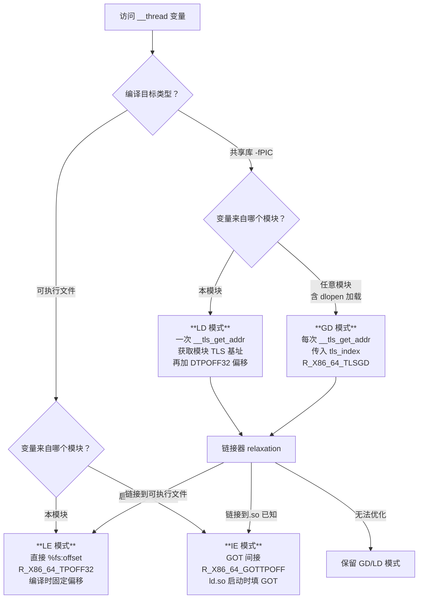

# 详解ELF文件(五十六).ELF与TLS线程本地存储

> [!abstract] TL;DR
> 线程本地存储（TLS，Thread-Local Storage）是 ELF 中最复杂的重定位机制之一。每个线程拥有独立的 TLS 块，通过 x86-64 的 `fs` 寄存器（`%fs:0` 指向线程控制块 TCB）寻址。编译器根据模块类型和链接时信息选择四种 TLS 访问模式（GD/LD/IE/LE），生成不同的代码序列和重定位类型。ld.so 管理动态线程向量（DTV），运行时通过 `__tls_get_addr` 处理跨模块 TLS 访问。逆向分析时，`%fs:` 前缀访问和 `__tls_get_addr` 调用是识别 TLS 变量的关键特征。

## 概述与定位

线程本地存储（TLS）是多线程编程的基础设施之一：它允许全局作用域的变量在**每个线程中拥有独立的副本**，而非所有线程共享同一个实例。

在 C/C++ 中，TLS 变量通过关键字声明：
```c
__thread int errno_copy;           // GCC 扩展（传统写法）
thread_local int tls_counter = 0;  // C11/C++11 标准写法
```

在 ELF 层面，TLS 是一套完整的机制体系：

- **程序头层面**：`PT_TLS` 描述 TLS 初始化模板
- **节区层面**：`.tdata`（已初始化 TLS 数据）和 `.tbss`（未初始化 TLS 数据）
- **重定位层面**：4 种 TLS 专用重定位类型，对应 4 种访问模式
- **运行时层面**：TCB（线程控制块）、DTV（动态线程向量）、`__tls_get_addr` 函数
- **寄存器层面**：x86-64 用 `fs` 寄存器，x86-32 用 `gs` 寄存器，作为 TLS 访问的基址寄存器

理解 TLS 机制对于：
- **逆向工程**：正确识别 TLS 变量访问（`%fs:` 前缀访问往往令初学者困惑）
- **漏洞挖掘**：TCB/DTV 结构被攻击可以劫持所有 TLS 访问
- **调试**：TLS 相关崩溃（尤其是动态加载的共享库中的 TLS）需要理解完整机制

本篇从 ELF 结构出发，系统解析四种访问模式的代码生成和重定位，最后给出逆向识别 TLS 访问的实用方法。

## 原理与机制

### TLS 内存模型总览

每个线程创建时，系统为其分配一块**线程本地存储块（TLS block）**。对于静态链接（包括 `DT_NEEDED` 在程序启动时加载的共享库），所有 TLS 块连续排列在线程控制块（TCB）附近；对于动态加载（`dlopen`），新模块的 TLS 块通过 DTV 间接访问。

x86-64 Linux 上的 TLS 布局（Variant II，ELF 规范的两种布局之一）：

```
低地址                                                    高地址
┌─────────────────────────────────────────────────────────────┐
│  模块 N 的 TLS 块  │ ... │  模块 2 的 TLS 块  │  模块 1（程序）的 TLS 块  │ TCB │
└─────────────────────────────────────────────────────────────┘
                                                              ↑
                                                         fs 寄存器指向这里
                                                         (%fs:0 = TCB 地址本身)
```

- **Variant II**（x86-64、x86-32）：TCB 在高地址，TLS 块在 TCB **之前**（负偏移），`%fs:0` 指向 TCB 自身
- **Variant I**（ARM、PowerPC）：TCB 在低地址，TLS 块在 TCB **之后**（正偏移）

`%fs` 寄存器（x86-64）或 `%gs` 寄存器（x86-32）存储 TLS 段的基址，通过 `arch_prctl(ARCH_SET_FS, addr)` 系统调用设置（Linux 下），或通过设置 LDT/GDT 描述符（传统 32 位方式）。

### PT_TLS 程序头

`PT_TLS` 程序头描述了 TLS 段的初始化模板（即 `.tdata` + `.tbss` 的合并视图）：

```c
typedef struct {
    Elf64_Word  p_type;     // PT_TLS = 7
    Elf64_Word  p_flags;    // PF_R = 只读
    Elf64_Off   p_offset;   // 文件中 .tdata 的偏移
    Elf64_Addr  p_vaddr;    // 虚拟地址（仅用于对齐计算）
    Elf64_Addr  p_paddr;    // 物理地址（忽略）
    Elf64_Xword p_filesz;   // .tdata 的大小（已初始化部分）
    Elf64_Xword p_memsz;    // .tdata + .tbss 的大小（含零初始化部分）
    Elf64_Xword p_align;    // 对齐要求（如 8 或 16）
} Elf64_Phdr; // type = PT_TLS
```

关键约束：`p_filesz <= p_memsz`，差值 `p_memsz - p_filesz` 即 `.tbss` 的大小（在文件中不占空间，运行时零初始化）。

每个线程创建时，系统将 `PT_TLS` 描述的模板**复制**到新线程的 TLS 块：
1. 将 `.tdata` 内容（`p_filesz` 字节）复制到 TLS 块起始处
2. 将剩余的 `.tbss` 区域（`p_memsz - p_filesz` 字节）清零

### .tdata 和 .tbss 节

```
节名          sh_type         sh_flags                         含义
.tdata        SHT_PROGBITS    SHF_ALLOC|SHF_WRITE|SHF_TLS     已初始化 TLS 数据
.tbss         SHT_NOBITS      SHF_ALLOC|SHF_WRITE|SHF_TLS     零初始化 TLS 数据
```

`SHF_TLS`（值 = 0x400）是关键标志，告诉链接器和 ld.so 这些节属于 TLS 模板。

对应源代码：
```c
__thread int  initialized_var = 42;   // 进入 .tdata（非零初始化）
__thread int  zero_var;               // 进入 .tbss（零初始化，BSS 语义）
thread_local struct Foo big_struct;   // 进入 .tbss（零初始化）
```

### 四种 TLS 访问模式

TLS 访问模式决定了编译器生成什么样的代码、链接器生成什么重定位类型：

| 模式 | 全称 | 适用场景 | 性能 | 重定位类型（x86-64）|
|------|------|---------|------|-------------------|
| **LE** | Local Exec | 可执行文件访问本模块的 TLS | 最快 | `R_X86_64_TPOFF32` |
| **IE** | Initial Exec | 可执行文件访问共享库的 TLS（启动时加载）| 较快 | `R_X86_64_GOTTPOFF` |
| **LD** | Local Dynamic | 共享库访问本模块的 TLS | 中 | `R_X86_64_TLSLD` + `R_X86_64_DTPOFF32` |
| **GD** | Global Dynamic | 共享库访问任意模块的 TLS（含 dlopen）| 最慢 | `R_X86_64_TLSGD` |

编译器根据 `-ftls-model=` 选项或目标文件类型自动选择：
- 编译可执行文件（非共享库）中访问**本模块** TLS → 编译器默认选 LE
- 编译可执行文件中访问**共享库** TLS → 编译器选 IE
- 编译共享库（`-fPIC`）中访问**本模块** TLS → 编译器选 LD
- 编译共享库中访问**任意** TLS（最保守）→ 编译器选 GD

ld.so 在链接时可以将 GD/LD 优化降级为 IE/LE（**TLS relaxation**），如果在链接阶段能确定模块关系。

## 结构/算法/伪代码详解

### 模式一：LE（Local Exec）— 最快路径

**适用场景**：可执行文件（ET_EXEC 或 ET_DYN）访问**其自身**的 TLS 变量。

**原理**：在链接时，TLS 变量相对于 TCB（`%fs:0`）的偏移**完全固定**，编译器直接生成 `%fs:` 段前缀的访问指令。

```c
// C 源码
__thread int x = 42;
void foo(void) { x++; }
```

```asm
; 编译器生成的汇编（GD 模式，链接器优化为 LE 后）：
; x 相对于 %fs:0 的偏移为 -8（Variant II：负偏移）
mov    eax, DWORD PTR fs:-8    ; 读取 TLS 变量 x
add    eax, 1
mov    DWORD PTR fs:-8, eax    ; 写回
```

**重定位类型**：`R_X86_64_TPOFF32`
```
类型：R_X86_64_TPOFF32
公式：S + A - TLS_TP（线程指针基址）
含义：符号地址相对于线程指针（%fs 基址）的偏移，负值表示在 TCB 之前
```

ld.so 在程序启动时根据 PT_TLS 的位置计算这个偏移，填入重定位目标地址（通常是一个 `movabs` 指令的立即数部分）。

### 模式二：IE（Initial Exec）— GOT 间接访问

**适用场景**：可执行文件访问**程序启动时加载的共享库**中的 TLS 变量（`DT_NEEDED` 共享库，非 `dlopen`）。

**原理**：共享库的 TLS 块相对于 TCB 的偏移在程序启动后确定，存储在 GOT 中；代码通过 GOT 间接读取这个偏移，再加上 `%fs` 获得变量地址。

```asm
; IE 模式的代码序列：
; （链接器生成 GOT 条目，ld.so 在启动时填写 TLS 偏移）
mov    rax, QWORD PTR [rip + x@GOTPCREL]   ; 从 GOT 读取 TLS 偏移
; 注意：GOT 中存的是偏移值（tp-relative offset），非地址
mov    eax, DWORD PTR fs:[rax]              ; %fs + 偏移 = TLS 变量地址
```

**重定位类型**：`R_X86_64_GOTTPOFF`
```
类型：R_X86_64_GOTTPOFF
目标：GOT 条目的地址（由 rip 相对指令访问）
ld.so 填入：x 的 tp-relative 偏移（S - TLS_TP，负值）
```

相比 LE，IE 多一次 GOT 内存读取，但避免了 `__tls_get_addr` 函数调用，性能仍较好。

### 模式三：GD（Global Dynamic）— 最通用路径

**适用场景**：共享库访问**任意模块**（包括 `dlopen` 加载的模块）的 TLS 变量。

**原理**：调用 `__tls_get_addr` 运行时函数，传入 `{module_index, offset}` 结构（tls_index），运行时动态查找正确的 TLS 块地址。

**GD 代码序列**（x86-64 ABI 规定的两指令序列，以便链接器识别并进行 relaxation）：

```asm
; GD 模式（编译器生成）：
.byte 0x66                           ; REX prefix（data16，填充作用）
lea rdi, [rip + x@TLSGD]            ; 加载 tls_index 结构的 GOT 地址到 rdi
.word 0x6666                         ; 两个 data16 前缀（填充，使序列固定长度）
rex64                                ; REX.W 前缀
call __tls_get_addr@plt              ; 调用 __tls_get_addr
; 返回值 rax = x 变量的地址

; 使用：
mov eax, DWORD PTR [rax]            ; 读取 TLS 变量 x
```

**为什么有这么多奇怪的前缀**：`data16` 和 `rex64` 是填充字节，使整个序列占用固定的字节数（16 字节），以便链接器在做 TLS relaxation 时能精确地将 GD 序列替换为 IE/LE 序列（原地覆盖，字节数相同）。

**GOT 中的 tls_index 结构**：

```c
typedef struct {
    unsigned long ti_module;  // 模块 ID（0 = 运行时由 ld.so 填写）
    unsigned long ti_offset;  // 变量在该模块 TLS 块中的偏移
} tls_index;
```

重定位类型：`R_X86_64_TLSGD` — 用于 GOT 中 tls_index 的 `ti_module`（运行时 ld.so 填写模块 ID）和 `ti_offset`（链接时填写）。

### 模式四：LD（Local Dynamic）— 共享库的本模块优化

**适用场景**：共享库访问**本模块**的多个 TLS 变量（仅调用一次 `__tls_get_addr` 获取模块基址，再用偏移访问各变量）。

**原理**：与 GD 类似，但 tls_index 的 `ti_offset` 为 0（获取的是整个 TLS 块的起始地址），然后多个变量通过加偏移访问，只需一次 `__tls_get_addr` 调用。

```asm
; LD 模式（访问本模块的 x 和 y 两个 TLS 变量）：

; 获取本模块 TLS 块基址（只调用一次）
lea rdi, [rip + __tlsld_name@TLSLD]  ; tls_index（ti_offset=0）
call __tls_get_addr@plt              ; 返回本模块 TLS 块基址
mov rbx, rax                         ; 保存基址

; 访问 x（DTPOFF32 重定位给出 x 在块内的偏移）
mov eax, DWORD PTR [rbx + x@DTPOFF]   ; R_X86_64_DTPOFF32

; 访问 y（同样通过块内偏移）
mov eax, DWORD PTR [rbx + y@DTPOFF]   ; R_X86_64_DTPOFF32
```

重定位类型：
- `R_X86_64_TLSLD`：GOT 中 tls_index（ti_module=0，ti_offset=0）的位置
- `R_X86_64_DTPOFF32`：变量在 TLS 块内的偏移（链接时直接计算）

### __tls_get_addr 实现原理

`__tls_get_addr` 是 ld.so 提供的核心运行时函数，处理 GD/LD 模式的 TLS 访问：

```c
// 伪代码（简化版 glibc dl-tls.c 实现）
void* __tls_get_addr(tls_index *ti)
{
    // 获取当前线程的 DTV
    dtv_t *dtv = THREAD_DTV();  // 等价于：((struct pthread *)%fs:0)->dtv
    
    uintptr_t module_id = ti->ti_module;
    
    // 检查 DTV 是否有效，且当前线程已为该模块分配 TLS 块
    if (__builtin_expect(dtv[0].counter != GL(dl_tls_generation), 0)
        || __builtin_expect(dtv[module_id].pointer.val == TLS_DTV_UNALLOCATED, 0))
    {
        // 慢路径：需要更新 DTV 或分配新的 TLS 块
        return __tls_get_addr_internal(ti);
    }
    
    // 快路径：直接从 DTV 获取该模块的 TLS 块地址
    return (char *)dtv[module_id].pointer.val + ti->ti_offset;
}
```

**DTV（Dynamic Thread Vector，动态线程向量）结构**：

```c
typedef union dtv {
    size_t counter;      // dtv[0]: TLS 代计数器（用于检测过期）
    struct {
        void *val;       // 指向该模块 TLS 块的指针
        bool  is_static; // 是否是静态 TLS 块（启动时分配）
    } pointer;
} dtv_t;

// dtv[-1] = dtv 数组本身的大小（槽位数）
// dtv[0]  = 当前 TLS 代计数器
// dtv[1]  = 可执行文件的 TLS 块基址
// dtv[2]  = 第一个 DT_NEEDED 共享库的 TLS 块基址
// dtv[n]  = 第 n 个模块的 TLS 块基址
// 动态加载（dlopen）的模块：DTV 按需扩展
```

**"TLS 代"（TLS generation）**：每次 `dlopen` 加载含有 TLS 的模块时，全局 `dl_tls_generation` 递增。各线程的 `dtv[0].counter` 落后于全局计数时，说明 DTV 需要更新。这是惰性分配的核心机制：新线程首次访问某模块的 TLS 时才实际分配该模块的 TLS 块。

### TCB 结构（线程控制块，x86-64 Linux/glibc）

```c
// include/tls.h / sysdeps/x86_64/nptl/tls.h（简化）
typedef struct {
    // 关键字段（以 %fs:0 基址的偏移定位）
    void *tcb;            // %fs:0x00 = 指向 TCB 自身（自引用，用于非 PIE 下的 TCB 指针传递）
    dtv_t *dtv;           // %fs:0x08 = DTV 数组指针
    struct pthread *self; // %fs:0x10 = 当前线程的 pthread 结构指针
    int multiple_threads; // %fs:0x18 = 是否存在多线程（用于信号处理优化）
    int gscope_flag;      // ...
    uintptr_t sysinfo;    // vDSO 系统调用入口（%fs:0x28，x86-64）
    uintptr_t stack_guard;// %fs:0x28 等：栈 canary 值（架构相关偏移）
    // ...（pthread 结构的其余字段）
} tcbhead_t;
```

重要的偏移（x86-64 glibc）：
- `%fs:0x00`：TCB 自身地址（自引用）
- `%fs:0x08`：DTV 指针
- `%fs:0x28`：栈 Canary 值（gcc 使用 `mov rax, QWORD PTR fs:0x28` 读取）

### TLS relaxation（重定位降级优化）

链接器在最终链接阶段，若能确定访问的是当前可执行文件模块的 TLS 变量，可以将较慢的 GD/LD 模式替换为较快的 IE/LE 模式：

```
GD（共享库编译时保守假设）
    │
    └─ 链接器 relaxation
          ├─ 链接到可执行文件 → 替换为 LE（最快）
          └─ 链接到共享库但目标已知 → 替换为 IE

代码替换示例（GD → LE）：
原 GD 序列（16 字节）:
  66 48 8d 3d xx xx xx xx    lea rdi, [rip+x@TLSGD]
  66 66 48 e8 xx xx xx xx    call __tls_get_addr@plt

替换为 LE 序列（16 字节，通过 NOP 填充保持长度）:
  64 48 8b 04 25 00 00 00 00  mov rax, QWORD PTR fs:0x0
  48 8d 80 xx xx xx xx        lea rax, [rax + tp_offset]
  90                          nop（填充）
```

## 工具视角与实战

### 查看二进制文件的 TLS 信息

```bash
# 查看 PT_TLS 程序头
readelf -l ./prog | grep TLS
# TLS            0x0000...    0x0000...  0x000...  0x000...  0x000...  R   0x8

# 详细程序头信息
readelf -Wl ./prog | grep -A 5 "TLS"

# 查看 .tdata 和 .tbss 节
readelf -S ./prog | grep -E "\.tdata|\.tbss"
# [ 3] .tdata   PROGBITS  ...  SHF_ALLOC|SHF_WRITE|SHF_TLS (0x403)

# 查看 TLS 相关重定位
readelf -r ./prog | grep -E "TLSGD|TLSLD|GOTTPOFF|TPOFF|DTPOFF"

# 查看 TLS 相关符号
readelf -W --syms ./prog | grep TLS
nm -D ./prog | grep -i tls
```

### 用 objdump 识别 TLS 访问模式

```bash
# 反汇编，寻找 TLS 相关指令
objdump -d ./prog | grep -E "fs:|__tls_get_addr"

# 典型输出：
# LE 模式（最常见，可执行文件中的 __thread 变量）：
#   4005a3: 64 8b 04 25 fc ff ff ff  mov eax,DWORD PTR fs:0xfffffffffffffffc
#   注意：地址是负偏移（0xfffffffc = -4），Variant II 布局

# IE 模式（可执行文件访问共享库 TLS）：
#   400560: 64 48 8b 04 25 00 00 00 00  mov rax,QWORD PTR fs:0x0
#   400569: 48 03 05 xx xx xx xx         add rax,QWORD PTR [rip+xxx]

# GD 模式（共享库中，调用 __tls_get_addr）：
#   1034: 66 48 8d 3d xx xx xx xx    lea rdi,[rip+xxx]
#   103c: 66 66 48 e8 xx xx xx xx    call __tls_get_addr@plt
```

### GDB 中检查 TLS 变量

```bash
gdb ./prog
(gdb) info threads                    # 查看所有线程
(gdb) thread 2                        # 切换到线程 2
(gdb) p errno                         # 直接打印 TLS 变量（GDB 自动处理）
(gdb) info address errno              # 查看 errno 的 TLS 地址
(gdb) x/g $fs_base                    # 读取 %fs 基址（= TCB 地址）
(gdb) x/g $fs_base+0x8               # 读取 DTV 指针
(gdb) p ((void**)*(void**)($fs_base+8))[1]  # DTV[1] = 主程序 TLS 块基址

# 在 pwndbg / GEF 中
(gdb) tls                             # pwndbg 命令，显示 TLS 信息
```

### Mermaid：四种 TLS 访问模式的决策流程



### 逆向识别 TLS 访问的特征汇总

**特征一：`%fs:` 段前缀**

```asm
; LE 模式特征：直接的 fs: 访问
mov eax, DWORD PTR fs:0xfffffffc      ; 32 位整数 TLS 变量
mov rax, QWORD PTR fs:0x0            ; TCB 自身（常见于线程库代码）
mov rax, QWORD PTR fs:0x28           ; 栈 Canary（几乎所有程序都有）
mov rax, QWORD PTR fs:0x8            ; DTV 指针（ld.so / 线程库内部）
```

**特征二：读取 `%fs:0x28` 后的比较（栈保护）**

```asm
; GCC 栈保护 canary 检查模式（不是"普通" TLS 变量，但同样用 %fs）
mov    rax, QWORD PTR fs:0x28         ; 读取 canary
mov    QWORD PTR [rbp-0x8], rax       ; 存入栈帧
; ... 函数主体 ...
mov    rdx, QWORD PTR [rbp-0x8]       ; 读回 canary
xor    rdx, QWORD PTR fs:0x28         ; 与原值对比
je     .ok
call   __stack_chk_fail               ; canary 被破坏，调用失败处理
```

**特征三：`__tls_get_addr` 调用**

```asm
; GD 模式特征：调用 __tls_get_addr
lea rdi, [rip + 0x...]                ; tls_index 地址（GOT 条目）
call __tls_get_addr@plt               ; 调用获取 TLS 变量地址
; 返回值 rax = TLS 变量地址，后续 [rax] 解引用
mov eax, DWORD PTR [rax]             ; 读取 TLS 变量值
```

**特征四：IDA Pro 中的识别**

IDA Pro 会自动识别 `FS:` 段前缀访问，并标注为 `large` 类型（由于偏移值被视为无符号大整数）：
```
; IDA 显示：
mov     eax, large fs:0FFFFFFFFFFFFFFFCH   ; = fs:-4（TLS 变量）
```

可以通过交叉引用 `__tls_get_addr` 快速找到所有动态 TLS 访问点。

## 安全性与正确使用

### TCB/DTV 的安全属性

**TCB 被攻击的后果**：

若攻击者能覆写 `%fs:0x8`（DTV 指针），后续所有 GD/LD 模式的 TLS 访问都将通过伪造的 DTV，可能导致任意内存读写：

```
攻击者覆写 %fs:0x8 → 伪造 DTV → __tls_get_addr 返回任意地址
                                  → 程序向"TLS 变量"写入 → 实为任意地址写入
```

防御：
- 完整 RELRO：将 GOT 设为只读，防止通过 GOT 覆写劫持 `__tls_get_addr`
- 栈 Canary（利用 `%fs:0x28`）：保护函数返回地址；但注意 canary 本身存在 TCB 中，若 TCB 可读，canary 也可泄漏

**`%fs:0x28` Canary 泄漏**：

```c
// 攻击者通过越界读等漏洞泄漏 %fs:0x28 处的 canary 值
// 再利用栈溢出时填入正确 canary，绕过栈保护
// 缓解：使用 ASAN、safe stack 等额外机制
```

**dlopen TLS 的内存泄漏**：

动态加载（`dlopen`）含 TLS 变量的模块后 `dlclose` 时，已有线程的 DTV 槽位不会立即回收（因为其他线程可能还在使用）。若频繁 `dlopen`/`dlclose` 含 TLS 的模块（如插件系统），会导致 DTV 无限增长，形成内存泄漏。

**正确实践**：
- 避免在频繁加载/卸载的插件中使用 `__thread` 变量
- 若必须使用，改用 `pthread_key_create` + `pthread_setspecific`（运行时管理的 TLS，`dlclose` 后可通过 destructor 清理）

### TLS 变量初始化顺序问题

与全局变量的静态初始化顺序不确定性（Static Initialization Order Fiasco）类似，TLS 变量的初始化顺序在多线程环境下也有细节问题：

```c
// 模块 A 的 TLS 变量（初始化到模板，OK）
__thread int counter = 0;

// 模块 A 的 TLS 变量（依赖运行时计算，潜在问题）
extern int compute_value(void);
__thread int computed = compute_value();  // 错误！TLS 只支持常量初始化
// 实际上 GCC 会报错：tls variable has non-constant initializer
```

TLS 变量只能用**常量表达式**初始化（类似 BSS/data 段的初始化限制）。需要运行时初始化的 TLS 变量，应在使用前手动初始化：

```c
__thread int initialized = 0;
__thread int my_value;

void ensure_initialized(void) {
    if (!initialized) {
        my_value = compute_value();
        initialized = 1;
    }
}
```

### 正确的 TLS 模型选择

```bash
# 强制指定 TLS 访问模式（通常让编译器自动选择）
gcc -ftls-model=global-dynamic  # GD：最安全（适合动态加载的插件）
gcc -ftls-model=local-dynamic   # LD：共享库中只访问本模块 TLS
gcc -ftls-model=initial-exec    # IE：共享库中但确保程序启动时加载（非 dlopen）
gcc -ftls-model=local-exec      # LE：只用于可执行文件，最快

# 对单个变量覆盖（__attribute__ 方式）
__thread int fast_var __attribute__((tls_model("initial-exec")));
// 告知编译器此变量来自启动时加载的模块，使用 IE 模式（更快）
// 危险：若此 .so 通过 dlopen 加载，IE 模式会崩溃！只在确定通过 DT_NEEDED 加载时使用
```

## 小结

TLS 机制是 ELF 体系中设计最精巧也最复杂的部分之一：

1. **ELF 层面**：`PT_TLS` 程序头描述 TLS 模板（`.tdata` + `.tbss`），每个线程创建时复制一份独立实例
2. **寄存器层面**：x86-64 用 `fs` 寄存器存储 TCB 地址（`%fs:0`），所有 TLS 访问以此为基准
3. **四种访问模式**：LE（最快，可执行文件本地）→ IE（GOT 间接，共享库初始加载）→ LD（模块基址 + 偏移）→ GD（最通用，支持 dlopen），编译器自动选择，链接器可优化降级
4. **运行时结构**：TCB 和 DTV 构成 TLS 的运行时骨架；`__tls_get_addr` 通过 DTV 定位跨模块的 TLS 块，支持动态加载的 TLS
5. **逆向识别**：`%fs:` 段前缀（LE/IE）和 `__tls_get_addr` 调用（GD/LD）是 TLS 访问的两大特征；`%fs:0x28` 固定是栈 Canary

理解 TLS 不仅是读懂逆向代码中神秘的 `fs:` 指令的必要前提，也是分析多线程漏洞、理解 glibc 线程库内部实现的基础。

## 相关阅读

- [[00.ELF文件详解总览|系列总览]]
- [[03.程序头表|程序头表（PT_TLS 段）]]
- [[17.got节|.got 节（IE 模式 GOT 条目）]]
- [[13.rel.dyn节|.rel.dyn 节（TLS 重定位类型）]]
- [[14.rela.dyn节|.rela.dyn 节（RELA 格式 TLS 重定位）]]
- [[55.ELF符号版本化全流程|ELF 符号版本化全流程（上一篇）]]

---

[[00.ELF文件详解总览|⬆ 系列总览]] | [[55.ELF符号版本化全流程|← 上一篇]] | [[57.ELF的SHT_GROUP与链接器去重|→ 下一篇]]
