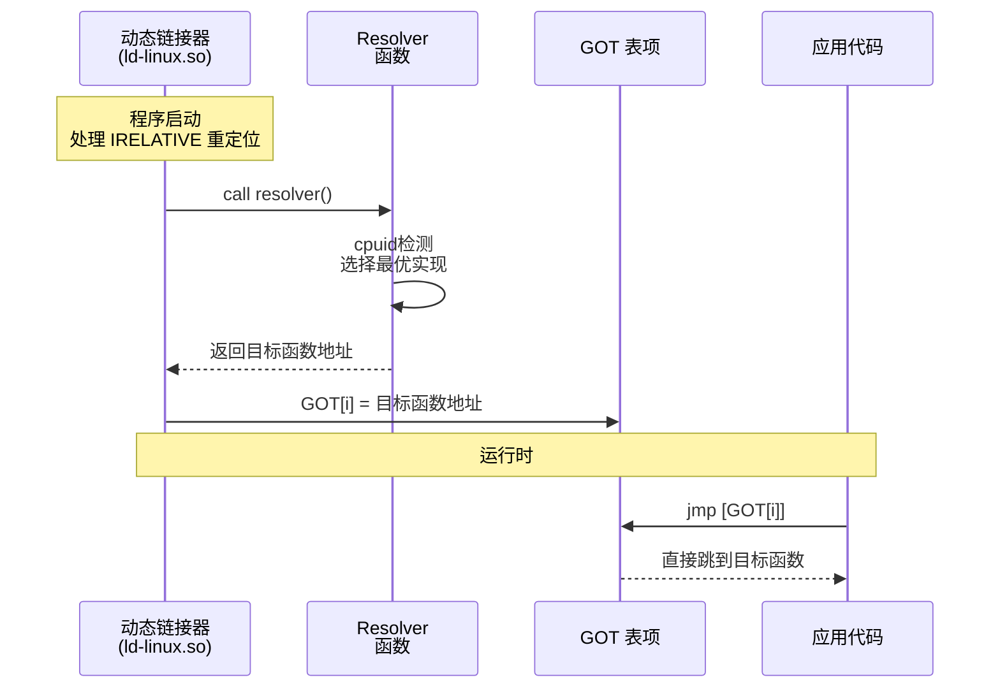

# GNU IFUNC间接函数机制

> [!abstract] TL;DR
> GNU IFUNC（Indirect Function，间接函数）是一种 ELF 扩展机制，允许运行时根据 CPU 特性或其他条件动态选择函数的实际实现。其核心是特殊符号类型 `STT_GNU_IFUNC`、专属重定位类型 `R_X86_64_IRELATIVE`，以及在加载时调用的 resolver（解析器）函数。glibc 广泛使用该机制实现 `memcpy`、`strlen` 等函数的 CPU 特性分发。本篇深度解析 IFUNC 的完整机制、glibc 实现源码、以及逆向时识别并恢复 IFUNC 跳转目标的实战方法。

---

## 一、问题背景：运行时函数分发的需求

### 1.1 CPU 特性多样性问题

现代 x86-64 CPU 支持一系列可选 SIMD 扩展（SSE2、AVX2、AVX-512 等），同一功能的不同实现版本在不同 CPU 上性能差异可达 5-10 倍。传统的解决方案有：

| 方案 | 原理 | 缺陷 |
|---|---|---|
| 编译时特性检测 | `#ifdef __AVX2__` | 单次编译只针对一个架构 |
| 运行时 `if` 分支 | 每次调用检测 `cpuid` | 热路径分支预测开销，且每次都判断 |
| 函数指针变量 | 初始化时设置，后续直接调用 | 多了一次间接跳转，破坏内联优化 |
| 动态链接器 `ifunc` | 加载时一次性决策，后续直接跳转 | 需要链接器/动态链接器支持（但这正是 IFUNC 所做的） |

IFUNC 的目标：**加载时一次性选择最优实现，运行时零额外开销**（等价于直接调用，无额外间接层）。

### 1.2 IFUNC 的使用场景

- **glibc 字符串/内存函数**：`memcpy`、`memset`、`memcmp`、`strlen`、`strchr`等，针对 SSE2/AVX2/AVX-512 提供多个实现版本
- **数学库优化**：`libm` 中 `sin`、`cos` 等的 FPU 特性分发
- **加密库**：OpenSSL 中 AES-NI 与软件实现的选择
- **用户自定义函数**：应用级别的 CPU 特性分发

---

## 二、`STT_GNU_IFUNC`：符号类型扩展

### 2.1 符号类型字段

ELF 符号（`Elf64_Sym`）的 `st_info` 字段低4位（`ELF64_ST_TYPE`）定义符号类型。标准类型包括 `STT_NOTYPE(0)`、`STT_FUNC(2)`、`STT_OBJECT(1)` 等。

GNU 扩展添加了：

```c
#define STT_GNU_IFUNC  10    /* GNU 扩展：间接函数 */
```

当符号 `st_info & 0xf == 10`，该符号是一个 IFUNC 符号。

### 2.2 IFUNC 符号的语义

普通函数符号（`STT_FUNC`）的 `st_value` 直接指向函数代码的起始地址。
IFUNC 符号的 `st_value` 指向的不是函数本身，而是一个 **resolver 函数**的地址。

```
普通符号：  st_value → [ 实际函数代码 ] → 执行
IFUNC 符号：st_value → [ resolver 函数 ] → 返回 → 实际函数地址 → 写入 GOT
```

### 2.3 查看 IFUNC 符号

```bash
# 在 glibc 中查看 memcpy 的符号类型
$ readelf -s /lib/x86_64-linux-gnu/libc.so.6 | grep -E 'IFUNC|memcpy'
# 输出示例：
#    Num:    Value          Size Type    Bind   Vis      Ndx Name
#    234: 0000000000092c40   234 IFUNC   GLOBAL DEFAULT   13 memcpy@@GLIBC_2.14

# 在目标文件中
$ readelf -s memcpy.o | grep IFUNC
```

### 2.4 Mermaid：IFUNC 解析流程



---

## 三、`R_X86_64_IRELATIVE`：专属重定位类型

### 3.1 重定位类型定义

```c
/* elf.h */
#define R_X86_64_IRELATIVE  37   /* Adjust indirectly by program base */
```

此重定位类型出现在 `.rela.dyn` 节（或 `.rel.dyn`）中，不同于普通符号重定位：

| 字段 | 普通重定位（如 R_X86_64_GLOB_DAT） | IRELATIVE |
|---|---|---|
| `r_sym`（符号索引）| 指向具体符号 | **0**（无符号） |
| `r_addend` | 符号加数 | **resolver 函数的地址**（相对加载基地址） |
| 处理时机 | 符号解析完成后 | **所有符号解析完成之后**（延迟处理） |

IRELATIVE 重定位的处理算法：

```c
/* 动态链接器伪代码 */
void apply_irelative(Elf64_Rela *rela, uint64_t load_base) {
    /* r_addend 是 resolver 函数相对加载基地址的偏移 */
    uint64_t resolver_addr = load_base + rela->r_addend;
    
    /* 调用 resolver，获取实际函数地址 */
    typedef uint64_t (*resolver_fn_t)(void);
    resolver_fn_t resolver = (resolver_fn_t)resolver_addr;
    uint64_t target_addr = resolver();
    
    /* 将结果写入 GOT 目标位置 */
    uint64_t *got_entry = (uint64_t *)(load_base + rela->r_offset);
    *got_entry = target_addr;
}
```

### 3.2 在 `.rela.dyn` 中的位置

IRELATIVE 条目在 `.rela.dyn` 中有特殊处理规则：动态链接器**必须在所有 GLOB_DAT 和 JUMP_SLOT 处理完成之后**才处理 IRELATIVE，因为 resolver 函数本身可能调用其他已需要动态链接的函数（如 `cpuid` 辅助函数）。

```bash
# 查看 libc 中的 IRELATIVE 条目
$ readelf -r /lib/x86_64-linux-gnu/libc.so.6 | grep -A2 IRELATIVE | head -30

# 示例输出：
# 000000002d5e68  000000000025 R_X86_64_IRELATIVE               925c40
# Offset: GOT 中的位置（相对库基地址）
# Addend: 0x925c40 = resolver 函数偏移（即 memcpy_resolver 之类）
```

### 3.3 与 PLT 的关系

对于可执行文件中调用 IFUNC 符号的情况，链接器会生成特殊的 PLT 条目（IPLT）：

```asm
# 普通 PLT 条目
memcpy@plt:
    jmp    [GOT+offset]    ; 延迟绑定：首次跳 PLT resolver，之后直接跳目标

# IFUNC 对应的 IPLT 条目（在链接时即处于"已解析"状态框架）
memcpy@plt:
    jmp    [GOT+offset]    ; GOT 项在加载时由 IRELATIVE 处理填充实际函数地址
```

核心区别：普通 PLT 的 GOT 项由符号绑定（JUMP_SLOT）填充，IFUNC 的 GOT 项由 IRELATIVE 调用 resolver 后填充。

### 3.4 静态链接的 IFUNC

当程序静态链接 libc（`-static`）时，IRELATIVE 重定位存在于可执行文件的 `.rela.plt`（或 `__rela_iplt_start/__rela_iplt_end` 标记的区域），在 `_start` 调用 `main` 之前，由 glibc 的 `__libc_start_main` 处理。

---

## 四、Resolver 函数：编写规范与约定

### 4.1 基本写法

```c
/* 声明一个 IFUNC resolver */
#include <sys/auxv.h>
#include <cpuid.h>

/* 实际实现：纯软件版 */
static void *my_memcpy_generic(void *dst, const void *src, size_t n) {
    /* ... 通用实现 ... */
}

/* 实际实现：AVX2 版 */
__attribute__((target("avx2")))
static void *my_memcpy_avx2(void *dst, const void *src, size_t n) {
    /* ... AVX2 实现 ... */
}

/* Resolver 函数 */
static void *my_memcpy_resolver(void) __asm__("my_memcpy");
/* 上面这行将 my_memcpy 符号的 resolver 设为此函数 */

__attribute__((ifunc("my_memcpy_resolver")))
void *my_memcpy(void *dst, const void *src, size_t n);

static void *my_memcpy_resolver(void) {
    unsigned int eax, ebx, ecx, edx;
    __cpuid(7, eax, ebx, ecx, edx);
    if (ebx & bit_AVX2)
        return my_memcpy_avx2;
    return my_memcpy_generic;
}
```

### 4.2 GCC `__attribute__((ifunc))` 的展开

上述 `__attribute__((ifunc("resolver_name")))` 语法是 GCC 扩展，等价于在汇编层面：

```asm
.type my_memcpy, @gnu_indirect_function
my_memcpy:
    # 此处的代码就是 resolver 函数体
    # 返回值（rax）即为实际函数地址
    ...
    ret
```

Clang 从 3.2 版本起支持此语法（通过 `__attribute__((ifunc(...)))`）。

### 4.3 Resolver 的约束

Resolver 函数在执行时处于特殊的早期环境中（特别是在 ELF 解释器本身初始化阶段），有以下约束：

1. **不能调用尚未解析的函数**：若 resolver 本身调用了其他 IFUNC 或未绑定的外部函数，会导致无限递归或崩溃
2. **不能使用 TLS**：线程本地存储在 resolver 执行时可能尚未初始化
3. **栈空间有限**：应避免大量栈分配
4. **通常只能调用已内联或已静态链接的辅助函数**

glibc 在 resolver 中使用的 CPU 特性检测通过 `dl-procinfo.c` 中的辅助结构，在链接器内部已经可用，不走正常动态链接。

### 4.4 通过 AT_HWCAP 检测 CPU 特性

在动态链接库的 resolver 中，推荐使用 `getauxval(AT_HWCAP)` 而非直接 `cpuid`，因为 `getauxval` 在动态链接器启动时已经可用，且更高效：

```c
static void *my_func_resolver(void) {
    unsigned long hwcap = getauxval(AT_HWCAP);
    if (hwcap & HWCAP_AVX2)
        return my_func_avx2;
    if (hwcap & HWCAP_SSE4_2)
        return my_func_sse42;
    return my_func_generic;
}
```

`AT_HWCAP` 和 `AT_HWCAP2` 由内核在 auxiliary vector（`/proc/self/auxv`）中提供，表示 CPU 支持的特性位掩码，无需 `cpuid` 指令（对虚拟化环境更友好）。

---

## 五、glibc IFUNC 实现：源码深度解读

### 5.1 glibc 的 IFUNC 注册机制

glibc 中 IFUNC 实现分散在各架构目录下。以 `memcpy` 的 x86-64 实现为例：

**文件**：`sysdeps/x86_64/multiarch/memcpy.c`（或 `.S`）

```c
/* glibc sysdeps/x86_64/multiarch/memcpy.c */
#include <memcopy.h>
#include <init-arch.h>

/* 各版本实现前向声明 */
extern __typeof(memcpy) __memcpy_avx_unaligned;
extern __typeof(memcpy) __memcpy_avx_unaligned_erms;
extern __typeof(memcpy) __memcpy_avx512_unaligned;
extern __typeof(memcpy) __memcpy_sse2_unaligned;
extern __typeof(memcpy) __memcpy_erms;

/* IFUNC resolver */
static inline void *
IFUNC_SELECTOR (void)
{
  const struct cpu_features *cpu_features = __get_cpu_features();
  
  if (CPU_FEATURE_USABLE_P (cpu_features, AVX512F)
      && CPU_FEATURE_USABLE_P (cpu_features, AVX512VL)
      && CPU_FEATURE_USABLE_P (cpu_features, BMI2))
    {
      if (CPU_FEATURE_USABLE_P (cpu_features, ERMS))
        return OPTIMIZE (avx512_unaligned_erms);  /* AVX-512 + ERMS */
      return OPTIMIZE (avx512_unaligned);           /* AVX-512 */
    }
  
  if (CPU_FEATURE_USABLE_P (cpu_features, AVX2))
    {
      if (CPU_FEATURE_USABLE_P (cpu_features, ERMS))
        return OPTIMIZE (avx_unaligned_erms);
      return OPTIMIZE (avx_unaligned);
    }

  if (CPU_FEATURE_USABLE_P (cpu_features, ERMS))
    return OPTIMIZE (erms);
  
  return OPTIMIZE (sse2_unaligned);  /* 最低 baseline：SSE2 */
}

/* 注册为 IFUNC */
libc_ifunc_redirected (__redirect_memcpy, memcpy, IFUNC_SELECTOR (void));
```

### 5.2 `cpu_features` 结构体

`__get_cpu_features()` 返回 `struct cpu_features` 指针，该结构在 `_dl_start` 初始化阶段（动态链接器启动时）被填充，存储在 `_rtld_global._dl_x86_cpu_features` 中：

```c
/* sysdeps/x86/include/cpu-features.h（简化） */
struct cpu_features {
  struct cpuid_registers cpuid[...]; /* raw cpuid 结果 */
  unsigned int family;              /* CPU family */
  unsigned int model;               /* CPU model */
  unsigned long long isa_1;         /* ISA 支持位图 */
  /* CPU_FEATURE_USABLE 宏检查此处 */
};
```

### 5.3 动态链接器中的 IRELATIVE 处理

在 `elf/dl-reloc.c` 的 `_dl_relocate_object` 函数中，IRELATIVE 重定位在最后一批处理：

```c
/* glibc elf/dl-reloc.c（大幅简化） */
void _dl_relocate_object(struct link_map *l, ...) {
    /* 第一轮：处理 GLOB_DAT、JUMP_SLOT 等普通重定位 */
    _dl_do_reloc(l, scope, RTLD_LAZY);
    
    /* 第二轮：处理 IRELATIVE（必须在第一轮之后） */
    if (l->l_rela_relative != NULL) {
        const ElfW(Rela) *r = l->l_rela_relative;
        const ElfW(Rela) *end = r + l->l_relativecount;
        for (; r < end; r++) {
            /* r->r_addend 是 resolver 的相对偏移 */
            ElfW(Addr) resolver = l->l_addr + r->r_addend;
            ElfW(Addr) value = ((ElfW(Addr) (*)(void)) resolver)();
            *(ElfW(Addr) *)(l->l_addr + r->r_offset) = value;
        }
    }
}
```

### 5.4 PLT IFUNC 调用链（用户程序视角）

```asm
; 编译后的用户程序调用 memcpy
; 在链接时，memcpy 是 IFUNC，链接器生成 IPLT 条目

call memcpy@plt            ; 跳转到 PLT 条目
;                          ↓
; memcpy@plt:
;   jmp [GOT_memcpy]       ; GOT 项在加载时已被 resolver 填充为实际函数地址
;
; 加载后 GOT_memcpy 可能指向：
;   __memcpy_avx_unaligned  （若CPU支持AVX2）
;   __memcpy_sse2_unaligned  （否则）
```

### 5.5 查看运行时 IFUNC 选择结果

```bash
# 查看 glibc 为当前 CPU 选择了哪个 memcpy 实现
$ LD_DEBUG=bindings ./my_prog 2>&1 | grep memcpy

# 或用 GDB 在 resolver 返回后检查 GOT
$ gdb ./my_prog
(gdb) break *(&memcpy@plt + 6)   # 在 PLT 第一条 jmp 后断点
(gdb) run
(gdb) x/1gx &GOT_memcpy          # 查看 GOT 项内容
(gdb) info symbol *GOT_memcpy     # 反查符号名
```

---

## 六、逆向识别 IFUNC 并恢复跳转目标

### 6.1 静态分析中的 IFUNC 特征

在 IDA Pro 或 Ghidra 中打开含 IFUNC 的 ELF 文件，会看到：

1. **符号类型异常**：符号类型显示为 `IFUNC` 而非 `FUNC`
2. **GOT 条目未解析**：静态分析时 GOT 中的 IFUNC 项显示为 resolver 地址而非实际函数地址
3. **PLT 条目结构异常**：IPLT 条目不含延迟绑定 resolver 跳转，直接 `jmp [GOT]`

```bash
# 用 readelf 识别 IFUNC 符号
$ readelf -s /lib/x86_64-linux-gnu/libc.so.6 | awk '$4=="IFUNC"'

# 查找 IRELATIVE 重定位条目
$ readelf -r /lib/x86_64-linux-gnu/libc.so.6 | grep IRELATIVE
```

### 6.2 动态分析恢复跳转目标

最可靠的方法是在运行时（resolver 已执行后）读取 GOT 项：

```python
# 用 pwntools 在 resolver 执行后读取 GOT
from pwn import *
import subprocess

# 方法一：gdb 脚本
gdb_script = """
set environment LD_PRELOAD=
break main
run
python
import gdb
# 找到 memcpy 的 GOT 地址
sym = gdb.lookup_symbol('memcpy')[0]
addr = int(gdb.parse_and_eval('(void*)memcpy'))
print(f"memcpy resolved to: {hex(addr)}")
sym2 = gdb.lookup_symbol(f'*{hex(addr)}')
print(f"Symbol: {sym2}")
end
"""
```

```bash
# 方法二：/proc 内存映射
$ gdb -batch -ex "break main" -ex "run" \
      -ex "x/1gx &memcpy@plt" \
      -ex "info symbol *(void**)(&memcpy@plt + 0)" \
      ./my_prog

# 方法三：LD_DEBUG
$ LD_DEBUG=all ./my_prog 2>&1 | grep -A1 "IRELATIVE\|ifunc"
```

### 6.3 IDA Pro 的 IFUNC 处理

IDA Pro 6.8 以后原生识别 `STT_GNU_IFUNC` 符号，在函数浏览器中以特殊颜色或标注显示。若未自动识别：

1. 在 resolver 函数首地址按 `P` 创建函数
2. 找到 resolver 的返回值（通常是 `LEA RAX, impl_addr` 或 `MOV EAX, addr`），手动追踪到实际实现
3. 用 IDAPython 批量处理：

```python
# IDAPython：批量解析 IFUNC 符号
import idc, idaapi, ida_nalt

for seg in idautils.Segments():
    seg_name = idc.get_segm_name(seg)
    if seg_name == '.dynsym':
        # 遍历符号，找 IFUNC 类型
        for sym in idautils.Names():
            if idc.get_symbol_attribute(sym, 'type') == 10:  # STT_GNU_IFUNC
                print(f"IFUNC: {idc.get_name(sym[0])} @ {hex(sym[0])}")
```

### 6.4 glibc IFUNC 的版本差异

不同 glibc 版本的 IFUNC 实现路径可能不同：

| glibc 版本 | memcpy resolver 位置 |
|---|---|
| 2.17 以前 | `sysdeps/x86_64/multiarch/memcpy.S`（汇编 resolver） |
| 2.17-2.28 | `sysdeps/x86_64/multiarch/ifunc-memcpy.h` |
| 2.29+ | `sysdeps/x86_64/multiarch/memcpy-vec-unaligned-erms.S` |

可通过 `strings /lib/x86_64-linux-gnu/libc.so.6 | grep "GLIBC_"` 确认版本，再查对应源码。

### 6.5 ARM/AArch64 上的 IFUNC

IFUNC 机制不限于 x86-64，ARM64 同样支持：

```c
/* R_AARCH64_IRELATIVE = 1027 */
#define R_AARCH64_IRELATIVE  1027
```

ARM64 的 resolver 约定与 x86-64 相同（返回实际函数地址），但 CPU 特性检测使用 `AT_HWCAP` 中的 ARM 特性位（如 `HWCAP_SHA2`、`HWCAP_AES`）。

---

## 七、安全性与正确使用

### 7.1 IFUNC 的安全隐患

**GOT 覆写攻击放大**：IFUNC 的 GOT 条目在加载时由 resolver 写入，若攻击者能够在 resolver 执行前覆写 resolver 函数地址（通过格式化字符串漏洞或堆溢出），就能劫持所有通过该 IFUNC 分发的函数调用。

**防御措施**：
- `RELRO`（`-Wl,-z,relro,-z,now`）：加载完成后将 GOT 设为只读，防止运行时覆写。但 IRELATIVE 条目在 `RELRO` 保护生效之前已处理完毕（因为 RELRO 是在所有重定位完成后才 `mprotect`），故本身不受影响
- `BIND_NOW`：强制加载时绑定，不使用延迟绑定，使 IFUNC 条目也在程序运行前写入完毕

### 7.2 Resolver 执行时间窗口

Resolver 在动态链接器初始化阶段执行，此时：
- 信号处理器未安装（信号可能导致 undefined behavior）
- 大多数 glibc 函数不可用
- 若 resolver 崩溃，错误信息极少，调试困难

**建议**：resolver 函数保持极简，仅做 CPU 特性检测和返回地址，不做任何复杂操作。

### 7.3 IFUNC 与地址空间布局随机化（ASLR）

IFUNC 和 ASLR 兼容良好：

- Resolver 的 `r_addend` 是相对加载基地址的偏移，加载时加上实际基地址（`l->l_addr`）得到 resolver 绝对地址
- Resolver 返回的目标地址也是绝对地址（已加上 `l->l_addr`）
- 每次加载，基地址随机，但 resolver 内部逻辑不变，结果始终是相对基地址的同一偏移

### 7.4 正确使用建议

| 场景 | 建议 |
|---|---|
| 需要 CPU 特性分发 | 优先使用 `__attribute__((ifunc))` 而非手动函数指针 |
| 安全敏感代码 | 配合 `BIND_NOW` + `RELRO`，防止运行时 GOT 覆写 |
| 调试 IFUNC | 在 `main` 断点后读取 GOT，而非 resolver 执行前 |
| 逆向分析 | 用 `LD_DEBUG=bindings` 观察运行时选择，用 gdb 读 GOT 实际值 |
| 静态链接 | IFUNC 需在 `_start` 前由启动代码处理 `__rela_iplt_start` 区域 |

---

## 参考

- GNU ELF Specification: `STT_GNU_IFUNC` (GNU 扩展，非 System V 标准)
- glibc 源码：`sysdeps/x86_64/multiarch/`、`elf/dl-reloc.c`
- Linux 内核辅助向量文档：`Documentation/arm64/elf_hwcaps.rst`
- Ulrich Drepper, "How To Write Shared Libraries" §2.2 Indirect Functions
- H.J. Lu, "GNU_IFUNC" ABI proposal (binutils 邮件列表, 2009)

---

[[00.ELF文件详解总览|⬆ 系列总览]] | [[57.ELF的SHT_GROUP与链接器去重|← 上一篇]] | [[59.ELF核心转储解析|→ 下一篇]]
