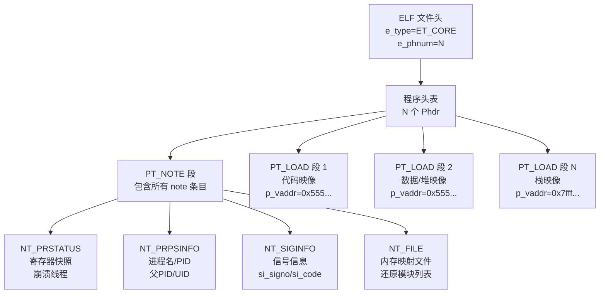

# ELF核心转储解析

> [!abstract] TL;DR
> 当进程崩溃时，Linux 内核将其内存快照、寄存器状态和进程元信息写入 core 文件，该文件是合法的 ELF 格式。核心转储由多个 `PT_LOAD` 段（内存映像）和一个 `PT_NOTE` 段（进程状态）构成，`NT_FILE`/`NT_PRSTATUS`/`NT_PRPSINFO` 等 note 条目携带了崩溃现场的全部关键信息。本篇深度解析 core 文件的二进制结构、各 note 条目的精确格式、如何手动解析还原崩溃现场，以及 `eu-readelf`、gdb、Python 的实战分析方法。

---

## 一、核心转储概述

### 1.1 触发条件

Linux 进程在收到特定信号时，内核生成 core 文件：

| 信号 | 默认动作 | 典型原因 |
|---|---|---|
| `SIGSEGV` (11) | core | 非法内存访问（空指针、越界） |
| `SIGABRT` (6) | core | `abort()` 调用、`assert()` 失败 |
| `SIGFPE` (8) | core | 浮点异常（除以零） |
| `SIGILL` (4) | core | 非法指令 |
| `SIGBUS` (7) | core | 总线错误（对齐问题） |
| `SIGSYS` (31) | core | 非法系统调用 |
| `SIGQUIT` (3) | core | `Ctrl+\` 手动触发 |

### 1.2 核心转储限制

```bash
# 查看当前 core 大小限制（0 = 禁止生成）
$ ulimit -c
0

# 启用无限制 core 转储
$ ulimit -c unlimited

# 查看 core 文件存储路径
$ cat /proc/sys/kernel/core_pattern
|/usr/share/apport/apport %p %s %c %d %P %E
# 若以 | 开头，说明 core 通过管道传给外部程序（如 systemd-coredump）

# 设置传统路径格式（core.PID）
$ echo "core.%p" | sudo tee /proc/sys/kernel/core_pattern
```

### 1.3 通过 `coredumpctl` 获取（systemd 系统）

```bash
# 列出最近的 core 转储
$ coredumpctl list

# 提取指定 PID 的 core 文件
$ coredumpctl dump 12345 -o crash.core

# 直接用 gdb 分析
$ coredumpctl gdb 12345
```

---

## 二、Core 文件的 ELF 结构

### 2.1 文件头特征

Core 文件是 `e_type = ET_CORE (4)` 的 ELF 文件，其他字段含义与普通 ELF 相同：

```c
/* ELF 文件头关键字段 */
Elf64_Ehdr {
    e_type      = ET_CORE    /* 4 */
    e_machine   = EM_X86_64  /* 62 */
    e_phoff     = ...        /* 程序头表偏移（紧接文件头后） */
    e_phnum     = N          /* 段数量：1(PT_NOTE) + K(PT_LOAD) */
    e_shoff     = 0          /* 节头表偏移：通常为 0，core 无节 */
    e_shnum     = 0          /* 节数量：0 */
    e_entry     = 0          /* 入口点：0（无意义） */
};
```

**重要**：core 文件通常**没有节头表**（`e_shoff = 0`，`e_shnum = 0`），只有程序头表。这意味着 `readelf -S core` 不会显示任何节，所有信息都在段（segment）层面。

### 2.2 程序头表：段类型组成

```bash
$ readelf -l core

Elf file type is CORE (core file)
Entry point 0x0
There are 42 program headers, starting at offset 64

Program Headers:
  Type           Offset   VirtAddr           PhysAddr           FileSiz  MemSiz   Flg Align
  NOTE           0x000438 0x0000000000000000 0x0000000000000000 0x003c28 0x000000     0
  LOAD           0x004000 0x0000555555554000 0x0000000000000000 0x001000 0x001000 R   0x1000
  LOAD           0x005000 0x0000555555555000 0x0000000000000000 0x001000 0x001000 R E 0x1000
  LOAD           0x006000 0x0000555555556000 0x0000000000000000 0x001000 0x001000 R   0x1000
  LOAD           0x007000 0x0000555555557000 0x0000000000000000 0x002000 0x002000 RW  0x1000
  LOAD           0x009000 0x00007ffff7dc5000 0x0000000000000000 0x1e2000 0x1e2000 R   0x1000
  # ... 更多 LOAD 段（栈、堆、各共享库的内存映射） ...
```

### 2.3 段数量与内存映射关系

每个 `PT_LOAD` 段对应进程地址空间中一个 VMA（Virtual Memory Area，由内核 `mm_struct` 中的 `vm_area_struct` 链表描述）。`p_vaddr` 是该 VMA 的虚拟起始地址，`p_filesz` 是实际保存到 core 文件中的字节数，`p_memsz` 是该区域的完整大小（可能大于 `p_filesz`，差额部分在 core 中不保存，通常是未映射内容）。

**Flags 对应 VMA 权限**：

| `p_flags` | 含义 |
|---|---|
| `R` | 只读映射（通常是代码段、只读数据） |
| `R E` | 可读可执行（代码段） |
| `RW` | 可读写（堆、栈、数据段） |

### 2.4 Mermaid：Core 文件整体结构



---

## 三、PT_NOTE 段详解

### 3.1 Note 条目的通用格式

`PT_NOTE` 段是一系列 note 条目（`Elf_Nhdr`）的线性拼接。每个条目格式：

```c
/* elf.h */
typedef struct {
    Elf64_Word  n_namesz;  /* 名称字符串长度（含 NUL），以 4 字节对齐 */
    Elf64_Word  n_descsz;  /* 描述数据长度（有效载荷），以 4 字节对齐 */
    Elf64_Word  n_type;    /* 类型标识符（NT_* 常量） */
    /* 后跟：名称字符串（n_namesz 字节，4字节对齐填充）*/
    /* 后跟：描述数据（n_descsz 字节，4字节对齐填充）*/
} Elf64_Nhdr;
```

Core 文件中的 note 条目名称通常为 `"CORE"` 或 `"LINUX"`（含末尾 NUL），`n_namesz = 5`（`strlen("CORE") + 1 = 5`，对齐后占 8 字节）。

### 3.2 Note 类型常量

```c
/* sys/procfs.h / linux/elf.h */
#define NT_PRSTATUS     1    /* 进程状态（寄存器等） */
#define NT_PRPSINFO     3    /* 进程信息（进程名、PID） */
#define NT_TASKSTRUCT   4    /* 内核 task_struct（通常不导出） */
#define NT_AUXV         6    /* 辅助向量（auxiliary vector） */
#define NT_SIGINFO      0x53494749  /* "SIGI"，信号信息 */
#define NT_FILE         0x46494c45  /* "FILE"，文件映射信息 */
#define NT_PRXFPREG     0x46e62b7f  /* x87 FPU 寄存器 */
#define NT_X86_XSTATE   0x202       /* 扩展 CPU 状态（AVX/AVX-512 等） */
```

多线程程序中，**每个线程**有一套 `NT_PRSTATUS`（和可能的浮点寄存器 note），且相互连续排列。`n_descsz` 和 note 类型组合可区分主线程和辅助线程。

---

## 四、NT_PRSTATUS：寄存器快照

### 4.1 完整数据结构

```c
/* sys/procfs.h（x86-64） */
struct elf_prstatus {
    struct elf_siginfo {
        int32_t si_signo;   /* 导致 core 的信号编号（如 11=SIGSEGV） */
        int32_t si_code;    /* 信号代码（如 SEGV_MAPERR=1） */
        int32_t si_errno;   /* errno（通常为 0） */
    } pr_info;
    
    int16_t  pr_cursig;     /* 当前信号（= pr_info.si_signo） */
    uint64_t pr_sigpend;    /* 等待信号掩码 */
    uint64_t pr_sighold;    /* 屏蔽信号掩码 */
    
    pid_t    pr_pid;        /* 进程 PID（线程 tid） */
    pid_t    pr_ppid;       /* 父进程 PID */
    pid_t    pr_pgrp;       /* 进程组 ID */
    pid_t    pr_sid;        /* 会话 ID */
    
    struct timeval pr_utime;    /* 用户态 CPU 时间 */
    struct timeval pr_stime;    /* 内核态 CPU 时间 */
    struct timeval pr_cutime;   /* 子进程用户态 CPU 时间 */
    struct timeval pr_cstime;   /* 子进程内核态 CPU 时间 */
    
    struct elf_gregset_t pr_reg;  /* 通用寄存器快照（见下） */
    
    int32_t  pr_fpvalid;    /* 是否有有效的浮点寄存器数据 */
};
```

### 4.2 x86-64 通用寄存器布局

`elf_gregset_t` 在 x86-64 上是一个 `unsigned long[23]` 数组，各寄存器按固定索引排列：

```c
/* sys/user.h (x86-64 Linux) */
struct user_regs_struct {
    unsigned long r15, r14, r13, r12;
    unsigned long rbp, rbx, r11, r10;
    unsigned long r9,  r8,  rax, rcx;
    unsigned long rdx, rsi, rdi;
    unsigned long orig_rax;  /* 系统调用原始 rax（-1 = 非系统调用） */
    unsigned long rip;       /* ★ 崩溃时的指令指针 */
    unsigned long cs;        /* 代码段寄存器 */
    unsigned long eflags;    /* 标志寄存器 */
    unsigned long rsp;       /* ★ 崩溃时的栈指针 */
    unsigned long ss;        /* 栈段寄存器 */
    unsigned long fs_base, gs_base;  /* TLS 基地址 */
    unsigned long ds, es, fs, gs;
};
```

### 4.3 用 Python 手动解析 NT_PRSTATUS

```python
import struct

def parse_prstatus(data, offset):
    """解析 NT_PRSTATUS 的关键字段（x86-64 Linux）"""
    # elf_siginfo: 3 * int32 = 12 bytes
    si_signo, si_code, si_errno = struct.unpack_from('<iii', data, offset)
    offset += 12
    
    pr_cursig = struct.unpack_from('<h', data, offset)[0]
    offset += 2 + 6  # 2 bytes cursig + 6 bytes padding to align
    
    # pr_sigpend, pr_sighold: 2 * uint64
    pr_sigpend, pr_sighold = struct.unpack_from('<QQ', data, offset)
    offset += 16
    
    # pr_pid, pr_ppid, pr_pgrp, pr_sid: 4 * int32
    pr_pid, pr_ppid, pr_pgrp, pr_sid = struct.unpack_from('<iiii', data, offset)
    offset += 16
    
    # pr_utime, pr_stime, pr_cutime, pr_cstime: 4 * timeval (2 * int64 each)
    offset += 4 * 16
    
    # pr_reg: 27 * uint64 (user_regs_struct on x86-64)
    regs = struct.unpack_from('<27Q', data, offset)
    reg_names = ['r15','r14','r13','r12','rbp','rbx','r11','r10',
                 'r9','r8','rax','rcx','rdx','rsi','rdi','orig_rax',
                 'rip','cs','eflags','rsp','ss','fs_base','gs_base',
                 'ds','es','fs','gs']
    
    print(f"Signal: {si_signo} (code={si_code})")
    print(f"PID: {pr_pid}, PPID: {pr_ppid}")
    for name, val in zip(reg_names, regs):
        print(f"  {name:12s} = {val:#018x}")
    
    rip = regs[16]  # RIP 索引为 16
    rsp = regs[19]  # RSP 索引为 19
    print(f"\n崩溃 RIP: {rip:#x}")
    print(f"崩溃 RSP: {rsp:#x}")
```

---

## 五、NT_PRPSINFO：进程元信息

### 5.1 数据结构

```c
/* sys/procfs.h */
struct elf_prpsinfo {
    char     pr_state;     /* 进程状态（'R'=运行 'S'=睡眠 'Z'=僵尸）*/
    char     pr_sname;     /* 打印友好的状态字符 */
    char     pr_zomb;      /* 是否为僵尸（1/0） */
    char     pr_nice;      /* nice 值 */
    uint64_t pr_flag;      /* 进程标志位 */
    uint32_t pr_uid;       /* 用户 ID */
    uint32_t pr_gid;       /* 组 ID */
    pid_t    pr_pid;       /* 进程 PID */
    pid_t    pr_ppid;      /* 父进程 PID */
    pid_t    pr_pgrp;      /* 进程组 */
    pid_t    pr_sid;       /* 会话 ID */
    char     pr_fname[16]; /* 可执行文件名（截断到15字符+NUL） */
    char     pr_psargs[80]; /* 命令行参数（截断到79字符+NUL） */
};
```

### 5.2 提取进程名与命令行

```bash
# 用 eu-readelf 直接提取
$ eu-readelf -n core | grep -A5 PRPSINFO

# 示例输出：
#   CORE                 136  PRPSINFO
#     State: 0 (R)
#     Zombie: 0
#     Nice: 0
#     pid: 1234, ppid: 1233, pgrp: 1234, sid: 1000
#     uid: 1000, gid: 1000
#     fname: my_program
#     psargs: ./my_program --option arg1
```

---

## 六、NT_FILE：内存映射文件表

### 6.1 格式详解（最复杂的 note）

`NT_FILE` 是 Linux 3.18 引入的 note 类型（之前用 `NT_AUXV` + `/proc/maps` 还原），记录了进程的所有文件映射，是还原 core 崩溃现场的关键。

```
NT_FILE 数据格式（小端）：
┌──────────────────────────────────────────┐
│  num_files  (8 bytes, uint64)            │  ← 文件映射条目数量
│  page_size  (8 bytes, uint64)            │  ← 页大小（通常 4096）
├──────────────────────────────────────────┤
│  Array of num_files entries:             │
│    start[0]   (8 bytes)                  │  ← VMA 起始地址
│    end[0]     (8 bytes)                  │  ← VMA 结束地址
│    file_ofs[0](8 bytes)                  │  ← 文件偏移（页为单位）
│    ...                                   │
│    start[N-1], end[N-1], file_ofs[N-1]   │
├──────────────────────────────────────────┤
│  Filename strings:                       │
│    filenames[0] (NUL 结尾字符串)          │  ← 对应条目 0 的文件路径
│    filenames[1]                          │
│    ...                                   │
└──────────────────────────────────────────┘
```

### 6.2 解析 NT_FILE 还原模块列表

```python
import struct

def parse_nt_file(data):
    """解析 NT_FILE note 的描述数据（desc 部分）"""
    offset = 0
    
    # 头部：条目数 + 页大小
    num_files, page_size = struct.unpack_from('<QQ', data, offset)
    offset += 16
    
    print(f"文件映射条目数: {num_files}")
    print(f"页大小: {page_size:#x}")
    
    # 读取所有 (start, end, file_offset) 三元组
    entries = []
    for i in range(num_files):
        start, end, file_ofs = struct.unpack_from('<QQQ', data, offset)
        entries.append((start, end, file_ofs))
        offset += 24
    
    # 读取文件名字符串区域
    filenames = []
    for i in range(num_files):
        end_idx = data.index(b'\x00', offset)
        filenames.append(data[offset:end_idx].decode('utf-8', errors='replace'))
        offset = end_idx + 1
    
    # 输出映射表
    print(f"\n{'起始地址':<20} {'结束地址':<20} {'文件偏移':<15} {'文件路径'}")
    print('-' * 80)
    for (start, end, file_ofs), fname in zip(entries, filenames):
        file_offset_bytes = file_ofs * page_size
        print(f"{start:#020x} {end:#020x} {file_offset_bytes:#015x} {fname}")
```

### 6.3 NT_FILE 的应用：还原加载地址

NT_FILE 中的 `start` 地址对应各模块在进程中的实际加载地址。结合 `readelf -l /path/to/lib.so` 获取的 `PT_LOAD` 段的 `p_vaddr`，可计算出各模块的 ASLR 偏移量（加载基地址）：

```python
def get_module_base(nt_file_entries, module_path):
    """从 NT_FILE 提取指定模块的加载基地址"""
    for (start, end, file_ofs), fname in nt_file_entries:
        if module_path in fname and file_ofs == 0:
            # file_ofs == 0 的条目对应模块的第一个段（通常是 EHDR 位置）
            return start
    return None

# 示例
libc_base = get_module_base(entries, "libc.so.6")
print(f"libc 加载基地址: {libc_base:#x}")
# 现在可以用 libc_base + 符号偏移 计算运行时地址
```

---

## 七、实战工具与分析流程

### 7.1 eu-readelf 全面解析

`eu-readelf`（elfutils 的 readelf，比 binutils 的 `readelf` 功能更强）：

```bash
# 查看所有 note 内容（最完整的方式）
$ eu-readelf -n core

# 查看程序头表（了解内存布局）
$ eu-readelf -l core

# 提取特定 note（grep 配合）
$ eu-readelf -n core | grep -A20 "NT_PRSTATUS"
$ eu-readelf -n core | grep -A30 "NT_FILE"

# 查看 core 文件头
$ eu-readelf -h core
```

### 7.2 gdb core-file 分析

gdb 是分析 core 文件最直接的工具：

```bash
# 加载 core 文件（需要对应的可执行文件）
$ gdb /path/to/program core

# 或者用 core-file 命令（在 gdb 内）
(gdb) file /path/to/program
(gdb) core-file core

# 崩溃现场检查
(gdb) bt              # 回溯调用栈
(gdb) info registers  # 查看所有寄存器
(gdb) x/20gx $rsp     # 查看栈内容
(gdb) x/5i $rip       # 查看崩溃处的指令

# 切换线程（多线程 core）
(gdb) info threads    # 列出所有线程
(gdb) thread 2        # 切换到线程 2
(gdb) bt              # 该线程的调用栈

# 查看 .maps 文件信息
(gdb) info sharedlibrary  # 加载的共享库及地址
(gdb) maintenance info sections   # 所有节信息
```

### 7.3 手动解析 core 的 Python 完整脚本

```python
#!/usr/bin/env python3
"""
core_parser.py：手动解析 ELF core 文件的关键信息
用法：python3 core_parser.py core
"""
import struct
import sys
import os

ELF_MAGIC = b'\x7fELF'
ET_CORE = 4
PT_NOTE = 4
PT_LOAD = 1

def align4(n):
    return (n + 3) & ~3

def parse_core(filepath):
    with open(filepath, 'rb') as f:
        data = f.read()
    
    # 解析 ELF 头
    magic = data[:4]
    assert magic == ELF_MAGIC, "不是 ELF 文件"
    
    ei_class = data[4]  # 1=32bit, 2=64bit
    assert ei_class == 2, "仅支持 64 位 core"
    
    e_type, e_machine = struct.unpack_from('<HH', data, 16)
    assert e_type == ET_CORE, f"不是 core 文件 (e_type={e_type})"
    
    e_phoff, = struct.unpack_from('<Q', data, 32)
    e_phentsize, e_phnum = struct.unpack_from('<HH', data, 54)
    
    print(f"Core 文件: {filepath}")
    print(f"程序头数量: {e_phnum}")
    
    # 遍历程序头
    note_offset = None
    note_size = None
    load_segments = []
    
    for i in range(e_phnum):
        ph_offset = e_phoff + i * e_phentsize
        p_type, p_flags = struct.unpack_from('<II', data, ph_offset)
        p_offset, p_vaddr, p_paddr = struct.unpack_from('<QQQ', data, ph_offset + 8)
        p_filesz, p_memsz, p_align = struct.unpack_from('<QQQ', data, ph_offset + 32)
        
        if p_type == PT_NOTE:
            note_offset = p_offset
            note_size = p_filesz
        elif p_type == PT_LOAD:
            load_segments.append((p_vaddr, p_vaddr + p_memsz, p_offset, p_filesz, p_flags))
    
    print(f"\nPT_LOAD 段数量: {len(load_segments)}")
    
    # 解析 NOTE 段
    if note_offset is not None:
        parse_notes(data, note_offset, note_size)

def parse_notes(data, offset, size):
    end = offset + size
    current = offset
    
    while current < end:
        n_namesz, n_descsz, n_type = struct.unpack_from('<III', data, current)
        current += 12
        
        name = data[current:current + n_namesz].rstrip(b'\x00').decode('ascii', errors='replace')
        current += align4(n_namesz)
        
        desc = data[current:current + n_descsz]
        current += align4(n_descsz)
        
        if name == 'CORE':
            if n_type == 1:    # NT_PRSTATUS
                print("\n=== NT_PRSTATUS ===")
                parse_prstatus_brief(desc)
            elif n_type == 3:  # NT_PRPSINFO
                print("\n=== NT_PRPSINFO ===")
                parse_prpsinfo(desc)
            elif n_type == 0x46494c45:  # NT_FILE
                print("\n=== NT_FILE ===")
                parse_nt_file_brief(desc)

def parse_prstatus_brief(desc):
    si_signo, si_code, _ = struct.unpack_from('<iii', desc, 0)
    pr_pid = struct.unpack_from('<i', desc, 24)[0]
    # regs 在 offset 112（pr_reg 字段）
    regs = struct.unpack_from('<27Q', desc, 112)
    rip = regs[16]
    rsp = regs[19]
    rax = regs[10]
    print(f"  信号: {si_signo} (code={si_code})")
    print(f"  PID: {pr_pid}")
    print(f"  RIP: {rip:#018x}")
    print(f"  RSP: {rsp:#018x}")
    print(f"  RAX: {rax:#018x}")

def parse_prpsinfo(desc):
    pr_state = desc[0]
    pr_fname = desc[28:44].rstrip(b'\x00').decode('utf-8', errors='replace')
    pr_psargs = desc[44:124].rstrip(b'\x00').decode('utf-8', errors='replace')
    pr_pid = struct.unpack_from('<i', desc, 20)[0]
    print(f"  进程名: {pr_fname}")
    print(f"  命令行: {pr_psargs}")
    print(f"  PID: {pr_pid}")

def parse_nt_file_brief(desc):
    num_files, page_size = struct.unpack_from('<QQ', desc, 0)
    print(f"  文件映射数: {num_files}")
    offset = 16
    entries = []
    for _ in range(num_files):
        start, end, file_ofs = struct.unpack_from('<QQQ', desc, offset)
        entries.append((start, end, file_ofs * page_size))
        offset += 24
    for i, (start, end, fofs) in enumerate(entries[:5]):  # 只显示前5条
        fname_end = desc.index(b'\x00', offset)
        fname = desc[offset:fname_end].decode('utf-8', errors='replace')
        offset = fname_end + 1
        print(f"  {start:#x}-{end:#x} @ {fofs:#x}  {fname}")
    if num_files > 5:
        print(f"  ... (共 {num_files} 条)")

if __name__ == '__main__':
    parse_core(sys.argv[1])
```

### 7.4 从 core 还原崩溃现场的完整流程

```
1. 触发崩溃并生成 core
   $ ulimit -c unlimited && ./my_program
   → 生成 core（或 core.PID）

2. 基本信息提取
   $ eu-readelf -n core | head -60
   → 确认崩溃信号、RIP、PID、命令行

3. 确认崩溃地址归属
   $ eu-readelf -n core | grep -A5 NT_FILE | grep '0x<崩溃RIP地址段>'
   → 确认 RIP 属于哪个模块（可执行文件 or 某共享库）

4. 计算模块偏移
   module_base = NT_FILE 中该模块的 start 地址
   rip_offset = RIP - module_base
   → 在反汇编中定位偏移 rip_offset 处

5. 用 gdb 验证
   $ gdb /path/to/binary core
   (gdb) bt
   (gdb) info registers
   (gdb) x/10i $rip - 0x10

6. 符号化（若有 DWARF 调试信息）
   $ addr2line -e /path/to/binary -a <rip_offset> -f -p
   → 输出文件名:行号 + 函数名
```

---

## 安全性与正确使用

### 8.1 Core 文件的信息安全风险

Core 文件包含进程的完整内存快照，可能泄露：
- **密钥材料**：密码、TLS 私钥、加密密钥（若在内存中未清除）
- **用户数据**：数据库查询结果、用户输入
- **进程内部状态**：算法状态、随机数种子

**防护措施**：

```bash
# 禁止生成 core（生产环境推荐）
$ ulimit -c 0
# 或在 /etc/security/limits.conf 中设置：
*  hard  core  0

# systemd-coredump 的访问控制
# /etc/systemd/coredump.conf：
[Coredump]
Storage=external
Compress=yes
ProcessSizeMax=2G

# 限制 core 文件只能 root 读取
$ echo "kernel.core_pattern = /var/crash/core.%p.%e" | sudo tee -a /etc/sysctl.conf
$ sudo chmod 700 /var/crash
```

### 8.2 删除内存中的敏感数据

```c
/* 安全清除密钥（防止 core dump 泄露） */
#include <string.h>

void secure_clear(void *ptr, size_t len) {
    volatile unsigned char *p = ptr;
    while (len--) *p++ = 0;
    /* 编译器不会优化掉 volatile 写 */
}

/* 或使用 explicit_bzero（glibc 2.25+） */
#include <strings.h>
explicit_bzero(key_buffer, key_len);

/* 更彻底：使用 madvise 让内核不将该页面写入 core */
#include <sys/mman.h>
madvise(sensitive_page, page_size, MADV_DONTDUMP);
/* 之后该内存页不会出现在 core 文件中 */
```

### 8.3 取证分析建议

进行 core 文件取证时：

1. **保全性**：立即对 core 文件做 SHA-256 哈希存档（`sha256sum core > core.sha256`），防止分析过程中意外修改
2. **只读分析**：使用 `losetup -r` 或只读挂载，不直接写入 core 文件
3. **完整性验证**：core 文件的 `p_filesz` 与实际段数据大小应匹配；`p_memsz > p_filesz` 是正常的（表示有部分内存未写入），但 `p_filesz > p_memsz` 是异常
4. **多线程 core**：每个线程的 NT_PRSTATUS 按 tid 排列，第一个通常是导致崩溃的线程

---

## 小结

ELF core 文件是 `e_type = ET_CORE` 的标准 ELF，无节头表，仅由一个 `PT_NOTE` 段和若干 `PT_LOAD` 段组成。`PT_NOTE` 段内线性排列多个 note 条目：`NT_PRSTATUS` 携带崩溃线程的完整寄存器快照（RIP/RSP 是定位崩溃点的起点），`NT_PRPSINFO` 携带进程名和命令行，`NT_FILE` 记录所有文件映射（用于还原各模块加载基址和 ASLR 偏移），`NT_SIGINFO` 记录触发崩溃的信号详情。分析流程：`eu-readelf -n core` 提取全部 note → 从 `NT_FILE` 还原模块基址 → 计算 RIP 在模块内的偏移 → `gdb` 加可执行文件加载 core 做最终验证与回溯。

## 参考 §/proc/PID/maps
- `man 5 core` — core 文件格式
- `man 1 eu-readelf` — elfutils readelf 文档
- Linux ELF core 格式源码：`fs/binfmt_elf.c` 的 `elf_core_dump` 函数
- GDB Internals：`gdb/corelow.c` — gdb 如何读取 core 文件
- elfutils 源码：`libelf/elf32_getphdr.c`、`readelf.c`

---

[[00.ELF文件详解总览|⬆ 系列总览]] | [[58.GNU_IFUNC间接函数机制|← 上一篇]] | [[60.ELF混淆与防护手段|→ 下一篇]]
